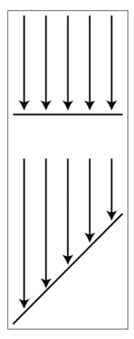
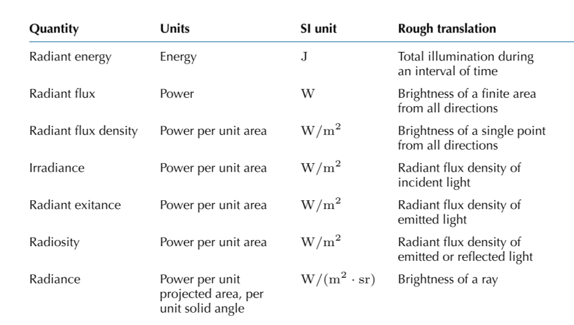
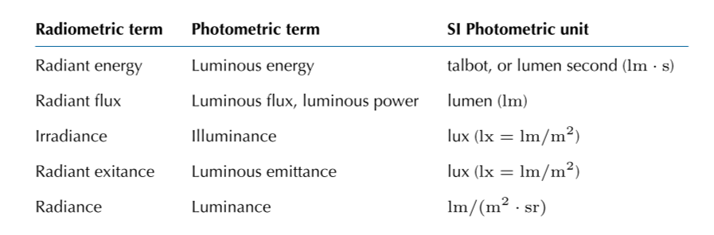

《3D数学基础：图形和游戏开发》第十章笔记

<!--more-->

# Chapter 10 Mathematical Topics from 3D Graphics

## How Graphics Works

### The Two Major Approaches to Rendering

渲染的最终目标是一个位图或一系列位图。位图是由一系列的颜色构成的矩形，每个颜色单元被称为像素（Pixel，picture element的缩写）。在生成位图的过程中，构成位图的数据被称为帧缓存（Frame buffer）。

用于决定每个像素的颜色的过程称为渲染，通常渲染算法分为两步，可见表面检测（Visible surface determination）和光照（Light）。可见表面追踪是找到离眼睛最近，且与当前渲染像素相关的片元。光照是决定有什么光从该片元发射或反射到眼镜的方向。

通常有两种方法进行可见表面检测。第一种称为光线追踪（raytracing）：光线追踪的思路是从沿着摄像机到每个像素的方向从像素中间位置发射射线，由该射线决定离眼最近的片元。第二种是深度缓冲法（depth-buffering）：该方法的思路是对于每个像素不仅保留其颜色信息，还保留深度信息，当计算每个像素时，如果计算的物体片元深度信息大于保留的深度信息（离眼睛更远），则舍弃计算出的数据，否则刷新保留的信息。从物体的表面片元转换到屏幕像素空间的过程称为`光栅化（Rasterization）`，且保留的片元称为`目标片元（destination fragment）`，新计算的片元称为`源片元（source fragment）`。

在进行第一步的过程中，执行光照计算并更新帧缓冲，则称为前向渲染（forward rendering），反之为延迟渲染（deferred rendering）。延迟渲染的过程是严格按照渲染的两步走，先将场景渲染至几何缓冲中（G缓冲，G-BUffer，Geometry buffer）。这时候缓冲中只有场景中元素的材质信息，不包含任何的光照信息，然后再根据G缓冲进行光照计算。

通常在多光源的情况下，如果用前向渲染，那么场景中的信息要被计算多次，而使用延迟渲染则只需要一次，也因此延迟渲染的效率更高。

### Describing Surface Properties：The BRDF

场景中只有小部分物体是自发光的，大部分的物体都是反射光。物体的颜色严格意义上并不是物体本身的颜色，而是物体反射的颜色，计算反射的函数称为`双向反射率分布函数（bidirectional reflectance distribution function，BRDF）`。

该函数表示为$f\left(\mathbf{x}, \hat{\omega}_{\mathrm{in}}, \hat{\omega}_{\mathrm{out}}, \lambda\right)$。

其中$\mathbf{x}$表示入射光线与表面的交点，$\hat{\omega}_{\mathrm{in}}$表示入射光线的角度，$\hat{\omega}_{\mathrm{out}}$反射光线的角度，$\lambda$表示反射光线的颜色信息（物理层面上为波长）。

使用BRDF来描述物体的光照情况，则物体的颜色体现在$\lambda$。物体的光泽程度体现在$\hat{\omega}_{\mathrm{out}}$和$\hat{\omega}_{\mathrm{out}}$的关系，如果各入射角度的反射角度都近似，那么物体看起来更闪耀。

对于一些物体，其反射情况更为复杂，如光线一部分会照射入物体本身，然后再反射出来（透明物体），描述这种反射情况的函数称为`双向表面散射分布函数（BSSDF, bidrectional surface scattering distribution function）`。对于一些物体也存在类似现象，但却不存在表面，如雾，称为`双向散射分布函数（BSDF,bidirectional scattering distribution function）`。

光照反射存在一些定理：
1. 不存在负光反射
2. 反射的光量不会多于入射光本身
3. Helmholtz互异性（Helmholtz reciprocity），将入射方向和反射方向呼唤，BRDF不变
   $$f\left(\mathbf{x}, \hat{\boldsymbol{\omega}}_{1}, \hat{\boldsymbol{\omega}}_{2}, \lambda\right)=f\left(\mathbf{x}, \hat{\boldsymbol{\omega}}_{2}, \hat{\boldsymbol{\omega}}_{1}, \lambda\right)$$

### A Very Brief Introduction to Colorimetry and Radiometry

比色法（COlorimetry）是关于如何测量光的颜色，辐射度量法（Radiometry）是关于如何策略光的亮度。

光的颜色实际上是由光的不同分量的波长构成，而通常将这个组成简化为三原色波长的组成，即RGB三色。上述BRDF函数中$\lambda$也可以相应拆成三个部分对应三原色的每个通道。RGB是一个近似的颜色表示法，并且不是唯一的颜色表示法，在许多实际运用中也不是最好的表示法，但是因为它更符合人的直觉，所以用的非常多。

测量光的亮度则通常从物理角度出发，将光作为一种电磁辐射的能量形式，单位为焦耳（J，joule）。如同其他的能量一样，通常来说，更关心的是单位时间内的能量传输，单位为瓦特（W，watt），且1W=1J/s。

对于电磁辐射来说，还需要关心单位时间内一定面积内通过的能量数目，即辐射通量（也称辐射功率，radiant power,radiant flur）。如果限定为单位时间中单位面积内通过的能量数目，则称为通量密度（flux density，radiosity），单位为瓦特每平方米$（W/m^2）$。

如果这个能量特指是入射光，那么通量密度用`辐照度（irradiance）`表示。对于发光的物体，发射出的光通量密度则用`辐出度(radiant exitance)`表示。而对于发射和反射的光通量密度统称为`辐射密度(Radiosity)`

但对于光照亮度而言，要考虑的的是单位投影面积内（或单位球面度内）的光照量，称为`辐射度（Radiance）`，单位为$W/(m^2\cdot sr)$，辐照度对应了光的亮度。

单位中的`sr`表示球面度(steradian)，表示面积未$r^2$的球表面所对应的张角。因为球的表面积为$4\pi r^2$，所以球的球面度为$4\pi$。

关于辐照度（irradiance）和辐射度（radiance）的区别如下图所示，其中两者的辐射度相同，而上半部分的辐照度大于下半部分：

所有物理上计算光量的描述如下所示：

还有一种从人的观察角度描述光量的方法，称为`测光法（photometry）`。它与物理测量类似，只是初始的描述光量的单位不同，如下表所示：

### The Rendering Equation

BRDF定义了针对一个特定入射方向的光线其反射方向和结果。

而对于最后人眼看到的效果，是所有入射可能的反射结果的综合表现。即使针对一个反射方向，这个方向上的结果也可能是来自于不同角度的多条入射光线的结合。渲染方程即用来表示所有入射可能的结合表现：

$$\begin{aligned}
L_{\text {out }}\left(\mathbf{x}, \hat{\boldsymbol{\omega}}_{\text {out }}, \lambda\right) &=L_{\text {emis }}\left(\mathbf{x}, \hat{\boldsymbol{\omega}}_{\text {out }}, \lambda\right) \\
&+\int_{\Omega} L_{\text {in }}\left(\mathbf{x}, \hat{\omega}_{\text {in }}, \lambda\right) f\left(\mathbf{x}, \hat{\boldsymbol{\omega}}_{\text {in }}, \hat{\boldsymbol{\omega}}_{\text {out }}, \lambda\right)\left(-\hat{\boldsymbol{\omega}}_{\text {in }} \cdot \hat{\mathbf{n}}\right) d \hat{\boldsymbol{\omega}}_{\text {in }}
\end{aligned}$$

注意该渲染表达式是对于单一的表面点$\mathbf{x}$和单一的颜色通道的$\lambda$。

方程的左侧$L_{\mathrm{out}}\left(\mathbf{x}, \hat{\omega}_{\mathrm{out}}, \lambda\right)$即表示在点$\mathbf{x}$，反射方向为$\hat{\omega}_{\mathrm{out}}$的$\lambda$分量结果。
方程右侧的第一个表达式$L_{\mathrm{emis}}\left(\mathbf{x}, \hat{\boldsymbol{\omega}}_{\mathrm{out}}, \lambda\right)$表示物体从在点$\mathbf{x}$，自发光方向为$\hat{\omega}_{\mathrm{out}}$的$\lambda$分量结果。
右侧第二部分表示所有在点$\mathbf{x}$，反射方向为$\hat{\omega}_{\mathrm{out}}$的$\lambda$分量结果的积分。

积分表达式$L_{\mathrm{in}}\left(\mathbf{x}, \hat{\omega}_{\mathrm{in}}, \lambda\right) f\left(\mathbf{x}, \hat{\omega}_{\mathrm{in}}, \hat{\omega}_{\mathrm{out}}, \lambda\right)\left(-\hat{\omega}_{\mathrm{in}} \cdot \hat{\mathbf{n}}\right)$也可以拆成三部分看。
1. 第一部分$L_{\mathrm{in}}\left(\mathbf{x}, \hat{\omega}_{\mathrm{in}}, \lambda\right)$即为入射的光线描述
2. 第二部分$f\left(\mathbf{x}, \hat{\omega}_{\mathrm{in}}, \hat{\omega}_{\mathrm{out}}, \lambda\right)$为BRDF表达式描述
3. 第三部分$\left(-\hat{\omega}_{\mathrm{in}} \cdot \hat{\mathbf{n}}\right)$是对于辐射度的系数计算。当$\hat{\omega}_{\mathrm{in}}$与$\hat{\mathbf{n}}$平行时，表达式的结果为1，即结果最大。此时入射光线与表面垂直，即直接是投影幕的面积。否则点乘相当于是计算$\cos$，即计算出投影面积的辐射度。

渲染方程中的$L\left(\mathbf{x}, \hat{\omega}_{\mathrm{in}}, \lambda\right)$出现在了等式的两侧，等数的左侧的为结果，右侧的为积分表达式的第一部分$L_{\mathrm{in}}\left(\mathbf{x}, \hat{\omega}_{\mathrm{in}}, \lambda\right)$。该部分表示从各个方向入射到点$\mathbf{x}$的光线。这个光线不仅仅可能是来自于光源的直接光，还可能来自于场景中的物体的各种反射（间接光）。对于计算机而言，计算出所有的反射是几乎不可能的的，于是对于渲染方程来说，都是求得一个可能条件下的最完美近似。

简单渲染管线解决的问题都是从光源出来的直接光。而解决反射光线（间接光）效果，期望与完美求解渲染方程的技术技术称为全局光（global illumination）。





***