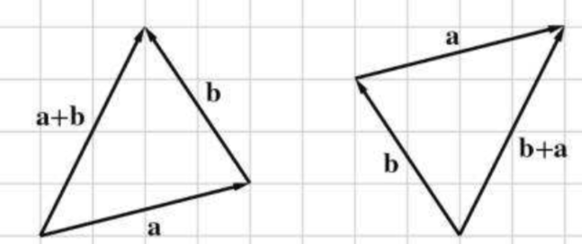
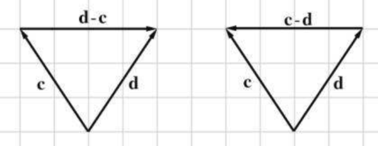
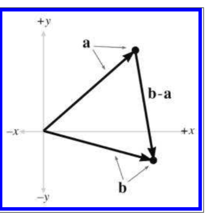
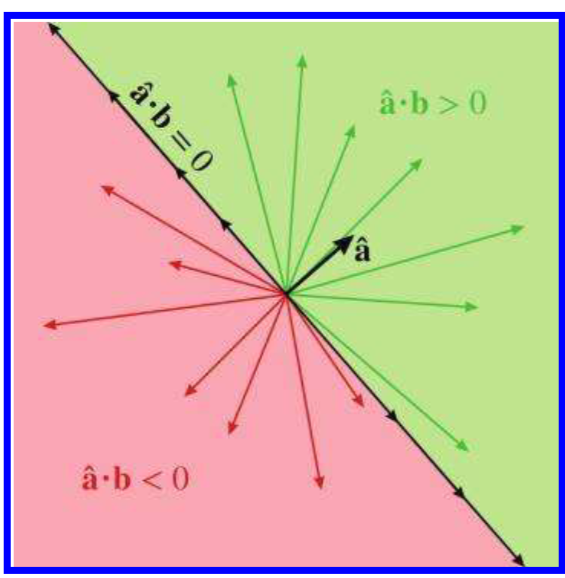
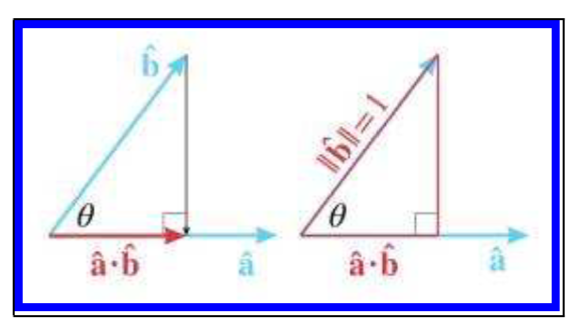
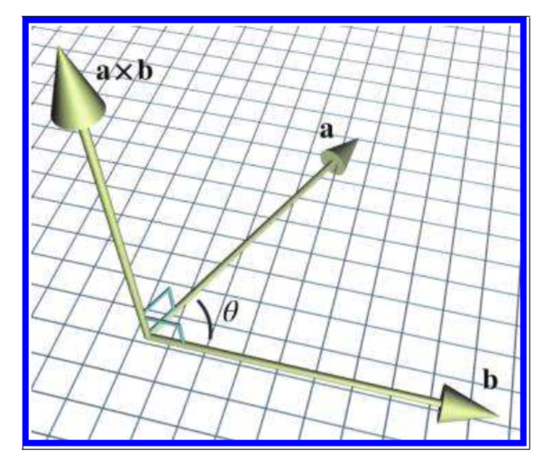
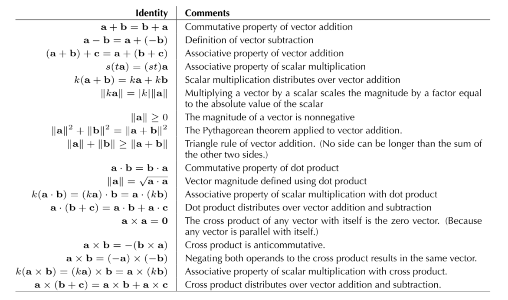



《3D数学基础：图形和游戏开发》第二章笔记。

介绍了向量的数学计算以及对应的几何意义，在每一节的第一部分是数学计算，第二部分是几何意义。



<!--more-->

# Chapter 2

## Mathematical Definition of Vector, and Other Boring Stuff

从数学角度看，向量（Vector）只是一个数字的数组。
数学上会区分向量和标量，带有方向的为向量，不带方向的为标量，如速度（有朝着某方向的含义在）是向量，位移是向量，而速率（仅仅是一个数字）是标量，距离是标量。

向量的维度表示一个向量中含有多少个数字。

向量通常通过方括号包裹，如果向量是水平方向的写，称其为行向量，否则为列向量，如：

行向量：

$$
[1,2,3]
$$

列向量：
$$
\begin{bmatrix}
1 \\\\
2 \\\\
3
\end{bmatrix}
$$



在这本书中：
1. 标量用小写斜体表示：*a,b,x,y*
2. 向量用小写粗体表示：**a,b,u,v**
3. 矩阵用大写粗体表示：**A,B,M,R**
   


研究向量和矩阵的数学称为线性代数（linear algebra）。在线性代数中，$n$维度的向量和矩阵是用来求解有$n$个未知数的方程的。而在这本书中解释了向量和与矩阵的几何与几何意义。

## Geometric Definition of Vector

从几何角度来说，向量是一条既有大小又有方向的线（有向线）。

向量并没有位置信息，大小和方向一致的向量出现在图中的什么位置并没有区别。

## Specifying Vectors with Cartesian Coordinates

### Vector as a Sequence of Displacements

当向量出现在笛卡尔坐标系中，向量中的每个元素表示对应的坐标的位移。

如$[2,3]$表示X轴方向移动了2，y轴方向移动了3，位移的顺序并没有关系。

### The Zero Vector

零向量是唯一一个没有方向的向量，在坐标系中，零向量不是一根线，而是一个点。

零向量是作为加法单位元（additive identity，加到别的元素上也不会造成区别的数字）。

## Vectors versus Points

点（Points）表示位置，向量（Vectos）表示位移。

### Relative Position

没什么关键信息。

### The Relationship between Points and Vectors

* 所有关于位置的方法，都是相对的

向量$[x,y]$表示从原点到点$(x，y)$的位移。

点是位置，图像上表示为一个点。向量是位移，图像上表示为一个箭头。

### It's All Relative

非图形学相关内容，作者描述了世上其他的相对物体。

## Negating a Vector

向量求反（Vector negating）：对于每个向量，都有一个相同维度的反向量，满足$v+(-v)=0$。

### Offical Linear Algebra Rules

向量求反：

$$
-\begin{bmatrix}
    a_1 \\\\
    a_2 \\\\
    \vdots \\\\
    a_{n-1} \\\\
    a_n \\\\
\end{bmatrix}=
\begin{bmatrix}
    -a_1 \\\\
    -a_2 \\\\
    \vdots \\\\
    -a_{n-1} \\\\
    -a_n \\\\
\end{bmatrix}
$$

### Geometric Interpretation

向量求反几何意义：保持向量的大小，但是方向变反方向

### Vector Multiplication by a Scalar

向量与标量相乘：

$$
k\begin{bmatrix}
    a_1 \\\\
    a_2 \\\\
    \vdots \\\\
    a_{n-1} \\\\
    a_n \\\\
\end{bmatrix}=
\begin{bmatrix}
    a_1 \\\\
    a_2 \\\\
    \vdots \\\\
    a_{n-1} \\\\
    a_n \\\\
\end{bmatrix}k=
\begin{bmatrix}
    ka_1 \\\\
    ka_2 \\\\
    \vdots \\\\
    ka_{n-1} \\\\
    ka_n \\\\
\end{bmatrix}
$$

* 向量与标量相乘，标量可以写在向量的左侧也可以写在右侧，但通常而言习惯性写在右侧
* 向量与标量相乘时不需要写乘号
* 标量不能被相乘除，向量不能除以另一个向量。

### Geometric Interpretation

向量与标量相乘几何意义：大小乘以$|k|$，如果$k$是负数，则向量的方向取反，否则不变。

## Vector Addition and Subtraction

### Official Linear Algebra Rules

向量相加：

$$
\begin{bmatrix}
    a_1 \\\\
    a_2 \\\\
    \vdots \\\\
    a_{n-1} \\\\
    a_n \\\\
\end{bmatrix}+
\begin{bmatrix}
    b_1 \\\\
    b_2 \\\\
    \vdots \\\\
    b_{n-1} \\\\
    b_n \\\\
\end{bmatrix}=
\begin{bmatrix}
    a_1+b_1 \\\\
    a_2+b_2 \\\\
    \vdots \\\\
    a_{n-1}+b_{n-1} \\\\
    a_n+b_n \\\\
\end{bmatrix}
$$

向量相减：

$$
\begin{bmatrix}
    a_1 \\\\
    a_2 \\\\
    \vdots \\\\
    a_{n-1} \\\\
    a_n \\\\
\end{bmatrix}-
\begin{bmatrix}
    b_1 \\\\
    b_2 \\\\
    \vdots \\\\
    b_{n-1} \\\\
    b_n \\\\
\end{bmatrix}=
\begin{bmatrix}
    a_1-b_1 \\\\
    a_2-b_2 \\\\
    \vdots \\\\
    a_{n-1}-b_{n-1} \\\\
    a_n-b_n \\\\
\end{bmatrix}
$$

* 向量不能与标量相加或相减，也不能与维度不同的向量相加或相减

### Geometric Interpretation

向量相加几何意义：如果是向量$a+b$，可以将a的头部与b的尾部向量，从a的尾部指向b的头部的向量即为加法结果，如下图所示：

向量相减几何意义：如果向量$d-c$，则将两个向量的尾部向量，从c头部指向d头部的向量即为减法结果，如下图所示：

### Displacement Vector from One Point to Another

当要计算从点a到点b的位移向量，可以通过$b-a$获得，如下图所示：

## Vector Magnitude(Length)

向量的大小也常称为向量的长度（Length）或向量的模（Norm）。

### Official Linear Algebra Rules

求向量的大小：

$$
\Vert V \Vert = \sqrt{\sum_{i=1}^{n}{v_i}^2}
$$

其中每个$v_i$表示向量$V$的一个维度，如x轴，y轴等

* 一些书用单条形符号表示，如$|v|$

如果有向量a和b，则a,b满足：

$$
\Vert a \Vert^2 + \Vert b \Vert^2 = \Vert a+b \Vert^2 \\\\
\Vert a \Vert + \Vert b \Vert\geq \Vert a+b \Vert 
$$

### Geometric Interpretation

求向量大小物理解释：求向量$V$的大小，类似于求直角三角形的第三条边长度，因此用类似于勾股定理的每条边平方相加，再开方。

对于任意正数值，有无数条向量的大小是该值。

## Unit Vectors

单位向量（Unit vector）是长度为1的向量（并没有限定方向），单位向量也被称为归一化向量（normalized vectors）。

* normalized vector表示是归一化向量即单位向量，长度为1的向量
* normal vector表示法向量，是垂直于某个面的向量

### Official Linear Algebra Rules

某个方向的单位向量可以通过这个方向的某向量除以它的大小得到，如

$$
\hat{{v}} = \frac{v}{\Vert v \Vert}
$$

* 零向量不能被归一化

### Geometric Interpretation

单位向量几何意义：在二维坐标系中，如果将无数的单位向量的尾部放在原点，则其顶点可以构成半径为1的圆。在三维坐标系中，如果将无数的单位向量的尾部放在原点，则其顶点可以构成半径为1的球。

## The Distance Formula

求两向量的距离：

$$
distance(u,v)=\Vert v-u \Vert=\sqrt{\sum_{i=1}^{n}{v_i-u_i}}
$$

其中$v_i$和$u_i$为向量$v$和$u$每个维度的值。

## Vector Dot Product

向量点乘（dot product）又称为向量内积（inner product）。

### Official Linear Algebra Rules

向量点乘时必须用一个使用点符号，如$a\cdot b$。如果两个向量之间没有点符号，则会认为这两个向量要进行矩阵的乘法。

$$
\begin{bmatrix}
    a_1 \\\\
    a_2 \\\\
    \vdots \\\\
    a_{n-1} \\\\
    a_n \\\\
\end{bmatrix}\cdot
\begin{bmatrix}
    b_1 \\\\
    b_2 \\\\
    \vdots \\\\
    b_{n-1} \\\\
    b_n \\\\
\end{bmatrix}=\sum_{i=1}^{n}{a_ib_i}

$$

向量的点乘是相互的，$a\cdot b=a \cdot b$

### Geometric Interpretation

#### Projection

**点乘的第一个几何意义：投影**

假设a是单位向量，则a与b的点乘,$\hat{a}\cdot b$表示为$b$在$a$上的投影的有向长度（因为点乘的结果是标量，所以这里的有向指的是正负，而不是方向）。如下图所示：

向量的点乘可以与标量的乘法相结合：

$$
(ka)\cdot b =k(a\cdot b)=a\cdot(kb)
$$

因此，上述关于单位向量的点乘可以推广到普通向量，即

> 向量a与向量b的点乘，结果为向量b在向量a上的有向投影长度(b的长度会影响该投影长度)乘以向量a的大小。

点乘满足加法与减法分配律即：

$$
a\cdot(b+c)=a\cdot b+a\cdot c
$$

**点乘的第二个几何意义：计算分量**

b在a上的投影实际上可以看作是b在a方向上的分量。因此还可以通过投影来将b拆分为两部分，平行于a的分量和垂直与a的分量，即

$$
b_\Vert=(\hat{a}\cdot b)\hat{a} \\\\
b_\perp=b-(\hat{a}\cdot b)\hat{a}
$$

**点乘的第三个几何意义：计算角度**

将投影的结果表示为三角形，如下所示：

单位向量$\hat{a}$和单位向量$\hat{b}$的点积为在a上的投影，即三角形的临边，所以角度$\theta$可表示为：

$$
cos\theta=\frac{\hat{a}\cdot\hat{b}}{1}=\hat{a}\cdot\hat{b}
$$

可以将其推广到普通的向量a和b，即

> 两个向量的点积等于这两个向量之间夹角的cos乘上两个向量的大小
> $$
a\cdot b= \Vert a\Vert \Vert b\Vert cos\theta \\\\
\theta=arccos(\frac{a\cdot b}{\Vert a\Vert \Vert b\Vert})
> $$

因此，如果点乘的两个向量夹角范围在$-90^\circ \sim 90^\circ$,结果为正数。如果夹角为90°，结果为0。如果范围在$90^\circ \sim 270^\circ$，结果为负数。

## Vector Cross Product

向量与向量还有个计算称为叉乘（Cross product）。

### Official Linear Algebra Rules

以三维向量的叉乘为例，表达式及计算如下：

$$
\begin{bmatrix}
    x_1 \\\\
    y_1 \\\\
    z_1 \\\\
\end{bmatrix} \times
\begin{bmatrix}
    x_2 \\\\
    y_2 \\\\
    z_2 \\\\
\end{bmatrix}=
\begin{bmatrix}
    y_1z_2-z_1y_2 \\\\
    z_1x_2-x_1z_2\\\\
    x_1y_2-y_1x_2
\end{bmatrix}
$$

当向量和点乘一起发生时，先计算叉乘，再计算点乘，即

$$
a\cdot b \times c = a\cdot (b\times c)
$$

形如$a\cdot (b\times c)$的表达式称为三重积。

* 叉乘是反交换的，即$a\times b = -(b\times a)$
* 叉乘满足分配律，即$a\times(b+c)=a\times b + a\times c$
* 叉乘没有结合性，即$(a \times b)\times c \neq a\times(b\times c)$
* 标量与叉乘结合：即$k(a\times b)=(ka)\times b = a\times(kb)$

### Geometric Interpretation

叉乘返回的结果是垂直于两个叉乘向量的另一个向量，如下图所示：

其大小等于两个向量的大小乘上两个向量之间夹角的sin,该大小也等于由两个向量构成的平行四边形的面积。即

$$
\Vert a\times b \Vert = \Vert a\Vert \Vert b\Vert \sin \theta
$$

叉乘结果的方向与左右手坐标系相关，如果表达式为$a \times b$，将b的尾部与a的头部相连。在左手坐标系下，如果在形成的方向是顺时针的，则结果方向指向外侧，如果是逆时针，则指向内侧。在右手坐标系下，结果相反。如下图所示：

也可以用手来求叉乘结果方向，如果表达式为$a \times b$，将大拇指指向a的方向，将食指指向b的方向，让中指与食指和大拇指垂直（像展示左右手坐标系那样），食指的方向即为叉乘结果方向。

## Linear Algebra Identities

下表为向量计算定律，基本都在上面解释过了：



引用：

1. *3D Math Primer for Graphics and Game Development* 2nd 2011 



***