

《计算机网络与因特网》 第六章笔记。



<!--more-->

# Chapter 6 Information Sources And Signals

## Introduction

这一章讲解释`信源（Information Sources）`和携带信息的信号的特征。

## Information Sources

数据通信理论更关注于较低层次的通信系统，因此信源可以是任意来源，不仅仅是包括计算机上层的键盘，鼠标，摄像机，传感器等等也是信源。

## Analog And Digital Signals

数据通信由两种信息组成，模拟信息或数字信息。模拟信号是由一个连续变化的函数构成，而数字信号则是跳跃变换的，在某个时间点会从一个强度突然跳跃至另一个强度。下图为模拟信号和数字信号的图解，左为模拟信号，右为数字信号：

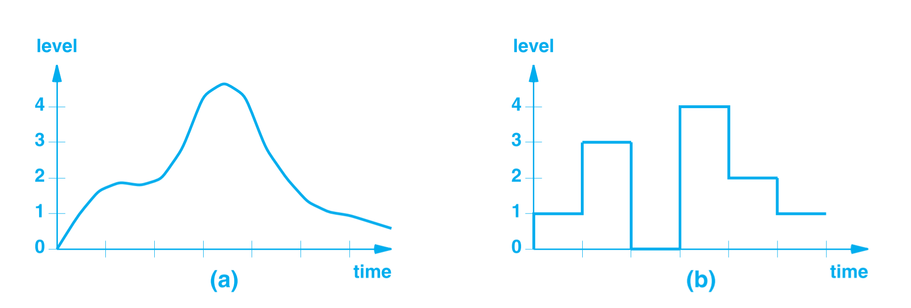

## Periodic And APeriodic Signals

信号也可分类为周期信号与非周期信号。周期信号顾名思义表示信号会重复出现，反之为非周期信号。下图为周期信号：

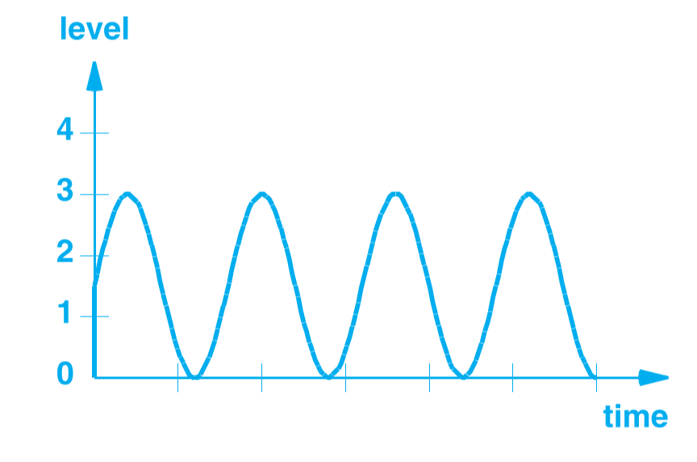

## Sine Waves And Signal Characteristics

数据通信通常使用`Sin函数`来表示信号。之所以选择Sin函数，是因为许多自然界产生的信号强度与时间的函数都是Sin，如麦克风获取声音后的输出信号，电磁波的信号等。

Sin函数波的信号特性由四个部分组成：

1. 频率（Frequency）：单位时间（通常是秒）内震动出现的个数。单位为赫兹（Hertz,Hz）
2. 波幅（Amplitude）：信号最强和最弱两处的差
3. 相位（Phase）：Sin拨开始的地方与参考时间（一般是时间0）的偏移
4. 波长（Wavelength）：一个周期的波在传播媒介中要传播的距离。

其中波长是一个媒介相关的特性，与波在媒介中传播的速度相关。剩下的三个特性都可以用数学公式表示，如波$A\sin (\omega t+\phi)$，其中$A$表示波幅，$\phi$表示相位，$\omega$表示频率，当$\omega=2\pi$时表示频率为1。

数据通信用的波一般都是高频的，一秒内出现百万个循环，对于这种频率的波，通常用兆赫兹（Megahertz,MHz）来表示。高频率波的单位如下表显示：

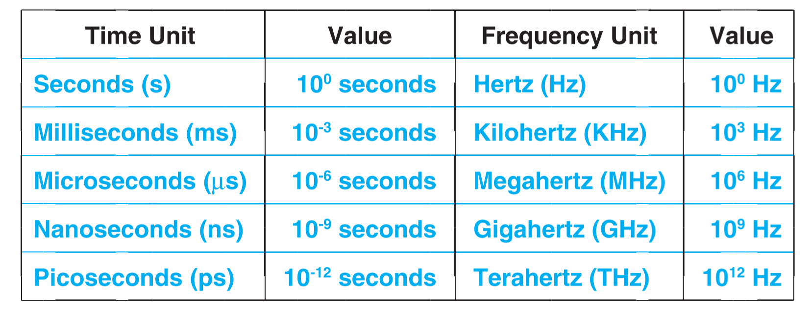

## Composite Signals

之前图中的波称为`简单信号(Simple Signal)`，因为只是以单一的Sin波组成。但在实际中，多数信号都是以`组合信号（Composite Signal）`的形式出现。如下图所示，就是两个不同频率及振幅的波组合成一个新的波。

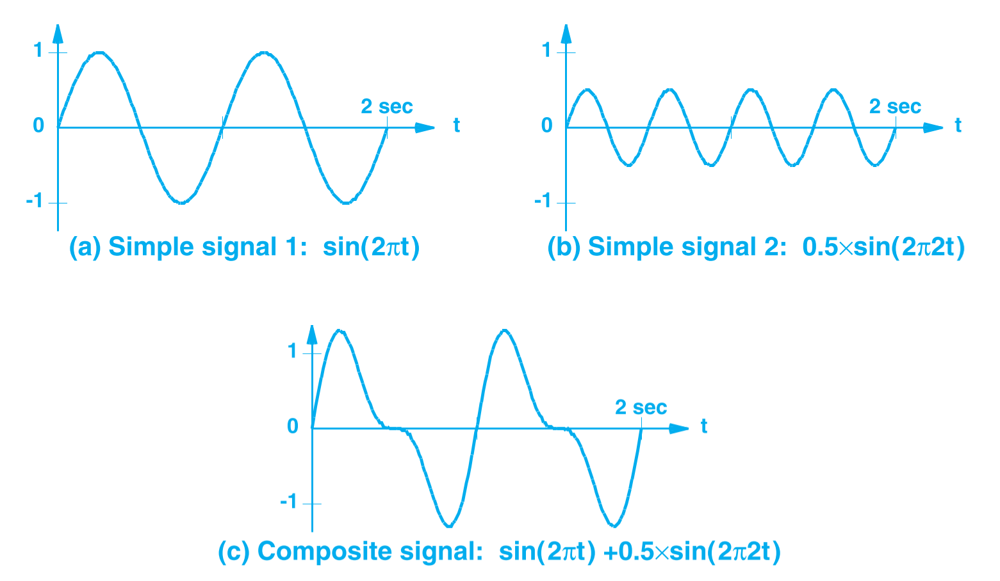

## The Importance of Composite Signals And Sine Functions

`调制（Modulation）`出来的信号通常是组合信号。数学家`傅里叶(Fourier)`发现可以从组合信号中解析出他的组成部分，即简单信号。大部分的通信系统都是用组合信号来携带信息，在接收端再将信息拆分成简单信号。

## Time And Frequency Domain Representations

之前的所有信号波的图片的$X轴$都是时间，称为信号在`时域(Time Domain)`内表示。

还有一种表现方式是信号在`频域(Frequency Domain)`内的表示，如之前$\sin (2\pi t)$和$0.5\times \sin(2\pi 2 t)$组成的复合信号，也用下图在频域中表示：

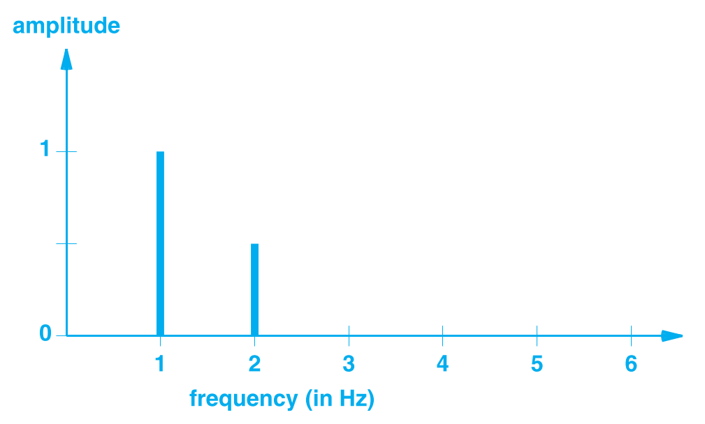

图中的$x轴$为频率，$y$轴仍为波幅。可以看到在频率为$1$和$2$的地方有波形出现，正好对应函数$\sin (2\pi t)$和$0.5\times \sin(2\pi 2 t)$的频率，波形的振幅也与函数所表现的振幅相同。

因为每个简单波在频域图的$x$轴上只占据一点，所以频域图用来表示复合波形是简单易读的。

## Bandwidth Of An Analog Signal

在计算机网络中经常听到`网络带宽(Network Bandwidth)`一词，关于网络带宽会在之后的章节中解释，这里先介绍一个相关概念，`模拟带宽(Analog Bandwidth)`。一个模拟信号的带宽是这个信号最高频率与最低频率之间的差，单位为$Hz$。如一个信号的频域图如下图所示，那么这个信号的贷款为$4KHz$，因为这个信号的最高频率为$5KHz$，最低频率为$1KHz$。

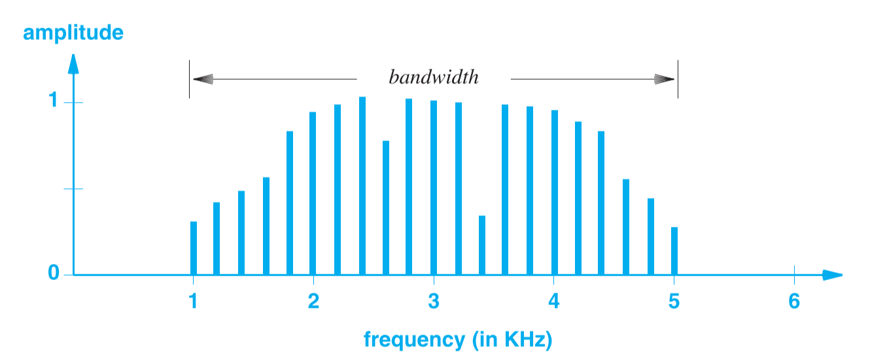

如果一个信号是用频域图来表示的，那么可以很快的看出这个信号的带宽。

## Digital Signals And Signal Levels

数字信号是由一系列的固定的`有效电平（Valid Level）`组成且在任意的时间点信号都处于这些有效电平之一。

一些系统用电压来表示数字信号，如电压为$5V$表示信号1，电压为$0V$表示信号0，如下图所示：

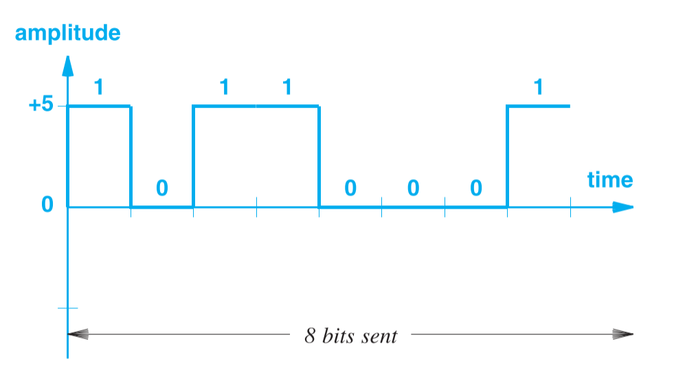

如果将电压划分更细，如电压$5V$表示信号$11$，电压$2V$表示$10$，电压$-2V$表示$01$，电压$-5V$表示$00$，如下图所示：

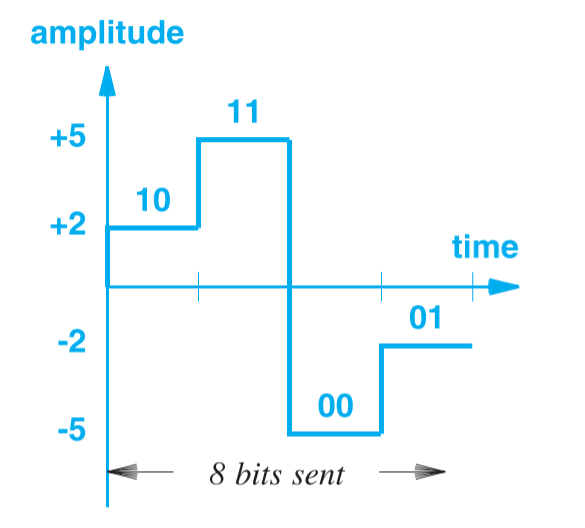

可以看到传输相同数据(8 bit)的情况下，第二种方法花费的时间少了一半，称第二种方法的`数据速率（Data Rate）`翻倍。因为第一种方法一次只能表示1bit的数据（1或0），而第二种方法表示了2bit的数据。如果电压细分为$2^n$种，则一次性能表达$n$ bit的数据。

理论上可以将电压切分到非常小（如分割成一百万个电平等级）达到每次都能传递许多信息的目的，但是实际中因为电力系统并不能区分过小的电压间隔，所以只将电压分割为几个电平等级。

## Baud And Bits Per Second

数据速率有两方面决定，一方面是上一节中提到的信号有效电平数量（决定每次可以携带多少数据），另一方面是每个有效电平持续的时间。

如上一节中的例子，假设将1秒切分为8部分（即一秒电平可以变换8次）传递数据，一共有2个电平等级。那么一秒传递8 bit的数据。如果改为有4个电平等级，则每次能传递2个bit,一秒传递16 bit的数据。如果仍然保持两个电平等级，但将一秒切分为16个部分，则同样一秒传递16 bit的数据。

将一秒电平可以变换的次数用波特表示(Baud)，波特数越高则一个电平持续的时间越短，如给每个电平0.001的持续时间，那么这个系统工作在1000 Baud。理论上来说波特可以非常高，让每秒传递的数据增多，但是实际上当一个信号持续时间过短系统是无法检测到该信号的。每秒传递的数据量可用以下公式表示:

$$
\text{bits per second} = baud \times \lfloor \log_2{(levels)} \rfloor
$$

## Converting A Digital Signal To Analog

根据傅里叶定理，任意的波形都可以由一系列Sin波组成，其中每个Sin波都有各自的振幅，相位与频率。

数字信号也可以看作是一个跃变的波形，但是这样的跃变波形需要由无数个Sin波才能构成，所以从工程角度来说不可能实现，毕竟不可能找出无数个信源。

所以在实际运用中只能妥协，运用越多的Sin波形，最终的复合波形就越接近跃变波形。下图展示了用模拟信号来表示数字信号的过程，图（a）是数字信号，显示为跃变波形，图（b）是用一个Sin波来表示，图（C）是两个Sin波，图（d）是用三个Sin波。可以看到Sin波的数量越多，波形越接近跃变信号，而且新增的波的频率越来越高。

一般而言，用三个Sin波模拟即可。

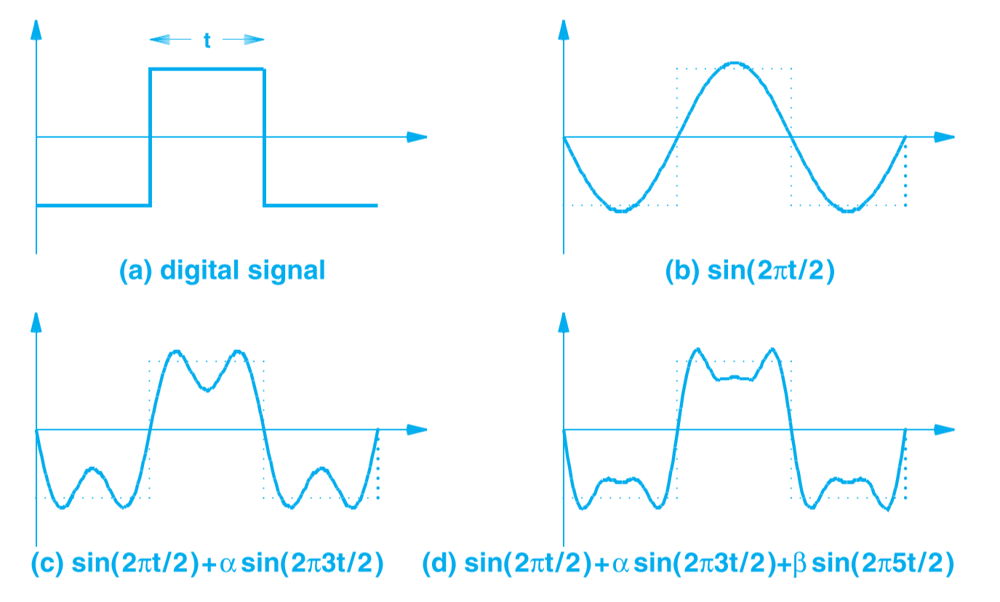

## The Bandwidth Of A Digital Signal

如之前所述，求一个信号的带宽是求其最大频率和最小频率的差值。对于数字信号来说可以先将他转换为模拟信号（多个Sin信号），然后找出最高频率的Sin以及最低频率的Sin。但是如上节所述，数字信号的跃变波形是由无数的Sin组成，且Sin的频率越来越高，即数字信号的最高频率是无限，因此数字信号的带宽为无限。

## Synchronization And Agreement About Signals

在实际运用中，发送端和接收端必须保证信号的每次变换间隔是一样的（可看作采样频率），这个问题称为`同步问题（Synchronization）`，下图展示了发送端和接收端以不同的频率采样会引发的问题，接收端的采样频率（10次每秒）高于发送端（8次每秒）。

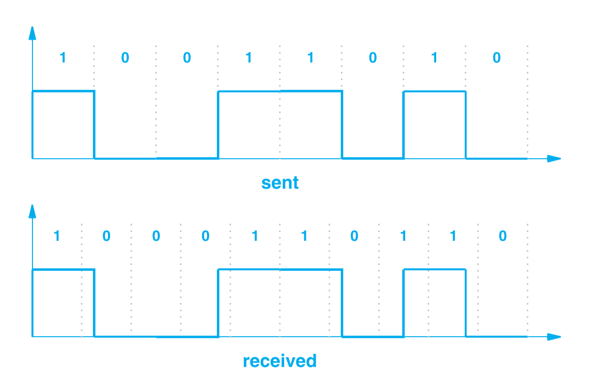

在实际运用中，这种频率的差异可能非常小，如误差为$10_{-8}$秒，那可能出现了几百万个Bit后才发生一次错误。但在传输速率在亿个Bit每秒时，这种细微的差距也会引发大量的错误数据。

## Line Coding

如上节所述，在数据传递的过程中可能会因为同步问题导致一些错误的发生，有一些方法来帮助避免这些错误的发生。一种是真正发送信号前，先发送一系列的特定模式的字节，如重复的0或者重复的1，通过这些字节来帮助接收端校准，另一种方法称为`信道编码（Line Coding）`，在这种方式下会添加一些额外的字符来保证接收端能确切的解析出真实的数据。

如一个电路能产生5V，0，-5V的电压，可以将-5V定义为一个数据的开始。因此0信号表示为$-5V,0V$，1信号表示为$-5V,5V$。接收端知道在-5V信号后才是真正的数据。这种方式的图解如下：

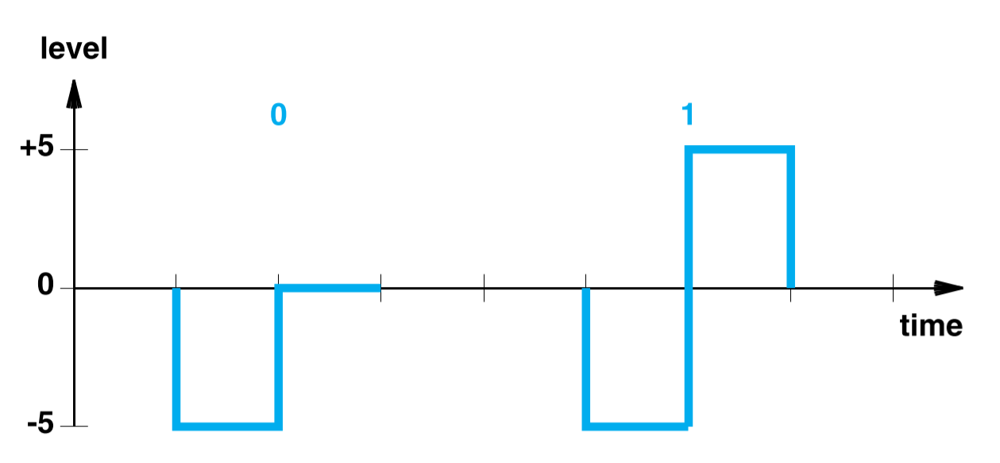

因为信道编码引入了额外的数据来保证真实数据的准确性，所以信道编码降低了真实数据的传输速率。

## Manchester Encoding Used In Computer Networks

`曼彻斯特编码(Manchester Encoding)`是一种信道编码，在计算机网络中曼彻斯特编码主要用于以太网中，所以十分重要。

对电路来说，检测信号的变化比检测信号的强度要简单。因此曼彻斯特编码将1信号定义为从零电压跳转为正电压，将0信号定义为从正电压跳转为零电压。而且曼彻斯特采样的时间为时间周期的中间，因此可以对于连续0或者连续1的情况，信号有时间可以回到之前的电压水平，保证下一次的检测正常。曼彻斯特编码的图示如下：

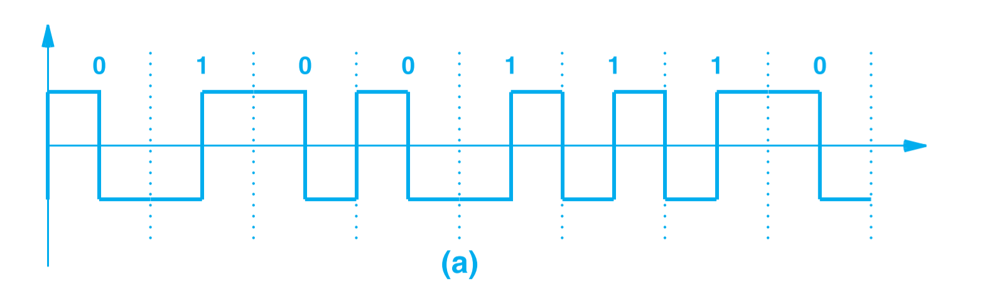

曼彻斯特编码还有一个变化，叫做`差分曼彻斯特编码（Differential Manchester Encoding）`，这种方法用相对变化来表示信号，0信号表示信号发生了变化，1信号表示信号没有变化。采样时间为时间周期点。差分曼彻斯特编码如下图所示：

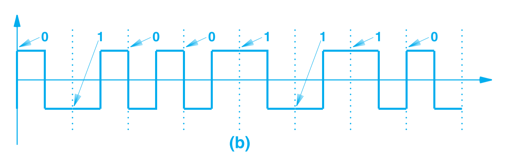

差分曼彻斯特编码的好处在于，即使信号的大小意外的翻转了也不会发生错误（如5V变为-5V之类）。

## Converting An Analog Signal To Digital



引用：

1. *Computer Networks and Internets* 6th



***