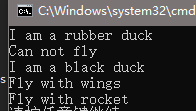
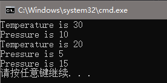
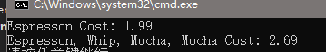
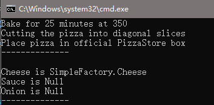
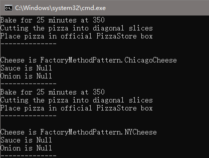
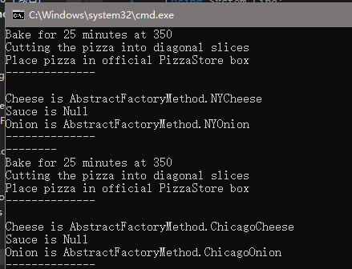


读书笔记1


<!--more-->

## 策略模式

策略模式（Strategy Pattern）是使用一些独立的类来各自封装一些通用的算法，这些被封装类都继承自同一个接口，该接口定义了算法。对于环境类来说，它只保存一个算法接口，而具体实现了这个算法的类，则可以在运行时动态更改。

例如有我们有一个项目需要描述鸭子，可能有50种不同的鸭子都派生自基类`Duck`，鸭子一共有三种飞行方式。这时候我们如果将某一种特定的飞行方式写在基类中，则不是使用这个飞行方式的所有派生鸭子都需要对该方法重写。如果我们不在基类中定义，而在各个派生类中实现，则可能多个有相同飞行方式的鸭子派生类都有相同的代码定义飞行方式，这造成了代码冗余。

所以我们可以使用策略模式，将三种飞行方式都派生自接口`FlyBehavior`，并在鸭子基类中定义变量`FlyBehavior`，然后在派生类中选择各自需要的飞行方式即可。

### 代码示例

#### 算法接口及实现类

```c# 飞行方法接口
public interface IFlyBehavior
{
    void Fly();
}
```

```c# 飞行方法实现

public class FlyNoWay : IFlyBehavior
{
    public void Fly()
    {
        Console.WriteLine("Can not fly");
    }
}

public class FlyWithRocket : IFlyBehavior
{
    public void Fly()
    {
        Console.WriteLine("Fly with rocket");
    }
}
public class FlyWithWings : IFlyBehavior
{
    public void Fly()
    {
        Console.WriteLine("Fly with wings");
    }
}
```

#### 环境类

```c# 鸭子基类 
public abstract class Duck
{
    private IFlyBehavior flyBehavior;

    public Duck() { }

    public abstract void disPlay();

    public void PerformFly()
    {
        flyBehavior.Fly();
    }

    public void setFlyBehavior(IFlyBehavior fb)
    {
        flyBehavior = fb;
    }
}
```

```c# 鸭子派生类 
public class BlackDuck : Duck
{
    public BlackDuck() : base()
    {
        setFlyBehavior(new FlyWithWings());
    }

    public override void disPlay()
    {
        Console.WriteLine("I am a black duck");
    }
}
public class RubberDuck : Duck
{
    public RubberDuck() : base()
    {
        setFlyBehavior(new FlyNoWay());
    }

    public override void disPlay()
    {
        Console.WriteLine("I am a rubber duck");
    }
}
```

#### 测试及结果

```c# 测试代码
RubberDuck rubberDuck = new RubberDuck();
rubberDuck.disPlay();
rubberDuck.PerformFly();

BlackDuck blackDuck = new BlackDuck();
blackDuck.disPlay();
blackDuck.PerformFly();
blackDuck.setFlyBehavior(new FlyWithRocket());
blackDuck.PerformFly();
```

运行结果



***

## 观察者模式

观察者模式（Observer Pattern）定义了一种一对多的依赖关系，当被观察者（`Subject`）的状态发生变化时，它将会通知观察者们（`Observers`）进行某种操作。

例如我们希望定义温度计和压力计，在天气信息发生变化时自动更新，而非自己反复的查询是否天气信息有发生变化。这里天气信息就是被观察者，而温度计和压力计就是观察者。

### 代码示例

#### 观察者及被观察者接口

```c# 被观察者
public interface ISubject
{
    void RegisterObserver(IObserver observer);
    void UnregisterObserver(IObserver observer);
    void NotifyObservers();
}
```

```c# 观察者
public interface IObserver
{
    void Update(ISubject subject);
}
```

#### 观察者实现

```c# 温度计
public class TemperatureObserver : IObserver
{
    private ISubject subject;
    public TemperatureObserver(ISubject subject)
    {
        this.subject = subject;
        this.subject.RegisterObserver(this);
    }

    public void Update(ISubject subject)
    {
        WeatherData weatherData = subject as WeatherData;

        //注意这里我们是从主动从被观察者那里去获取数据
        if (weatherData != null)
            Console.WriteLine("Temperature is " + weatherData.Temperature);
    }
}
```

```C# 压力计
public class PressureObserver : IObserver
{
    private ISubject subject;
    public PressureObserver(ISubject subject)
    {
        this.subject = subject;
        this.subject.RegisterObserver(this);
    }

    public void Update(ISubject subject)
    {
        WeatherData weatherData = subject as WeatherData;
        if (weatherData != null)
            Console.WriteLine("Pressure is " + weatherData.Pressure);
    }
}
```

#### 被观察者实现

```c# 天气数据
public class WeatherData : ISubject
{
    private List<IObserver> observersList;

    public float Temperature { get; private set; }
    public float Humidity { get; private set; }
    public float Pressure { get; private set; }

    public WeatherData()
    {
        observersList = new List<IObserver>();
    }

    public void NotifyObservers()
    {
        observersList.ForEach(o => o.Update(this));
    }

    public void RegisterObserver(IObserver o)
    {
        observersList.Add(o);
    }

    public void UnregisterObserver(IObserver o)
    {
        observersList.Remove(o);
    }

    private void measurementsChanged()
    {
        NotifyObservers();
    }

    public void SetMeasurements(float temperature, float humidity, float pressure)
    {
        this.Temperature = temperature;
        this.Humidity = humidity;
        this.Pressure = pressure;
        measurementsChanged();
    }
}
```

#### 测试及结果

```c# 测试代码
WeatherData weatherData = new WeatherData();
TemperatureObserver temperatureObserver = new TemperatureObserver(weatherData);
PressureObserver pressureObserver = new PressureObserver(weatherData);

weatherData.SetMeasurements(30, 20, 10);
weatherData.SetMeasurements(20, 40, 5);
weatherData.UnregisterObserver(temperatureObserver);
weatherData.SetMeasurements(10, 50, 15);
```

运行结果：




***

## 装饰模式

装饰模式(Decorator Pattern))提供了一个动态增加一个类功能的方法，主要实现思想是通过一个作为装饰者的类（`Decorators`）包裹被装饰类（`Component`）（装饰类以及被装饰类都有共同的基类）,`Decorators`会在`Component`类的某一个函数执行前或后进行一些操作，进而达到增加功能的作用。

装饰模式主要实现了“代码应该对扩展功能开放而对于修改关闭”的面向对象原则，它在增加新功能的前提下，不需要改动既有的代码，只需要增加新的`Decorators`并且包括既有的`Component`即可。

例如我们要计算一杯咖啡的价格，而这杯咖啡的价格还会受到额外的配料的影响，比如要加抹茶需要额外支付0.2元，加奶泡需要额外支付0.3元等。如果对各种配料都各自使用一个类来表示，则会存在较多的类需要维护，而且一旦配料发生变化等，还需要进行代码修改。而使用装饰模式则可以将原始的咖啡作为被装饰类，而所有的配料都是装饰类，则配料的更改仅需要增加或删除外部的装饰类即可。

### 代码示例

#### 装饰类及被装饰类基类

```c# 被装饰类基类
public abstract class Beverage
{
    protected string description = "UnKnown Beverage";

    public virtual string getDescription()
    {
        return description;
    }

    public abstract double Cost();
}
```

```c# 装饰类基类
public abstract class CondimentDecorator : Beverage
{
    protected Beverage beverage;

    public CondimentDecorator(Beverage beverage)
    {
        this.beverage = beverage;
    }
}
```



注意装饰类基类继承自被装饰类，并存有一个被装饰类的变量，因为装饰类需要在被装饰类操作的基础上进行一定额外的操作，所以它需要存有对被装饰类的引用，同时对外部而言调用者而言，它与被装饰类相同。



#### 被装饰类实现

```c# 浓咖啡
public class Espresso : Beverage
{
    public Espresso()
    {
        description = "Espresson";
    }

    public override double Cost()
    {
        return 1.99;
    }
}
```

#### 装饰类实现

```c# 酱油
public class Soy : CondimentDecorator
{
    public Soy(Beverage beverage) : base(beverage) { }

    public override string getDescription()
    {
        return beverage.getDescription() + ", Soy";
    }

    public override double Cost()
    {
        return 0.30 + beverage.Cost();
    }
}
```

```c# 奶泡
public class Whip : CondimentDecorator
{
    public Whip(Beverage beverage) : base(beverage) { }

    public override string getDescription()
    {
        return beverage.getDescription() + ", Whip";
    }

    public override double Cost()
    {
        return 0.30 + beverage.Cost();
    }
}
```

```c# 抹茶
public class Mocha : CondimentDecorator
{
    public Mocha(Beverage beverage) : base(beverage) { }

    public override string getDescription()
    {
        return beverage.getDescription() + ", Mocha";
    }

    public override double Cost()
    {
        return 0.20 + beverage.Cost();
    }
}
```

#### 测试及结果

```c# 测试代码
Espresso espresso = new Espresso();
Console.WriteLine(espresso.getDescription() + " Cost: " + espresso.Cost());

Beverage doubleMochaWhipEspresso = new Mocha(new Mocha(new Whip(espresso)));
Console.WriteLine(doubleMochaWhipEspresso.getDescription() + " Cost: " + doubleMochaWhipEspresso.Cost());
```

运行结果：



## 工厂模式

工厂模式是为了将对象的实例化与对对象的操作解耦。因为有时我们会根据情况的不同，实例化出对象的不同版本，而我们不希望这种对于情况的判断与逻辑代码耦合在一起。

工厂模式有三个较为常见的变种，下面会以创建披萨为例子来说明工厂模式。

### 简单工厂模式

简单工厂模式严格意义上并不是一个设计模式，只是它被太多人的使用，所以需要单独进行说明。

简单工厂模式会定义一个工厂类来进行对象的实例化。

我们定义一个披萨商店，他将会管理披萨产出的整个流程。我们为了将披萨的生产与之后的操作（如切披萨）拆分开，需要定义一个简单披萨工厂。

#### 披萨类及其实例化

```c# 披萨基类
public abstract class Pizza
{
    protected Cheese cheese = null;
    protected Sauce sauce = null;
    protected Onion onion = null;

    public string name { get; set; }

    public abstract void prepare();

    public void bake()
    {
        Console.WriteLine("Bake for 25 minutes at 350");
    }

    public void cut()
    {
        Console.WriteLine("Cutting the pizza into diagonal slices");
    }

    public void box()
    {
        Console.WriteLine("Place pizza in official PizzaStore box");
    }

    public void Debug()
    {
        Console.WriteLine("--------------");
        Console.WriteLine(name);
        Console.WriteLine("Cheese is " + (cheese != null ? cheese.ToString() : "Null"));
        Console.WriteLine("Sauce is " + (sauce != null ? sauce.ToString() : "Null"));
        Console.WriteLine("Onion is " + (onion != null ? onion.ToString() : "Null"));
        Console.WriteLine("--------------");
    }
}
```

```c# 披萨实现
public class CheesePizza : Pizza
{
    public override void prepare()
    {
        cheese = new Cheese();
    }
}

public class SaucePizza : Pizza
{
    public override void prepare()
    {
        sauce = new Sauce();
    }
}
```

#### 披萨商店与简单披萨工厂

```c# 披萨商店
public class PizzaStore
{
    SimplePizzaFactory simpleFactory;
    public PizzaStore(SimplePizzaFactory factory)
    {
        this.simpleFactory = factory;
    }

    public Pizza orderPizza(string type)
    {
        Pizza pizza = simpleFactory.createPizza(type);
        pizza.prepare();
        pizza.bake();
        pizza.cut();
        pizza.box();
        return pizza;
    }
}
```

```c# 简单披萨工厂
public class SimplePizzaFactory
{
    public Pizza createPizza(string type)
    {
        Pizza pizza = null;
        if (type.Equals("cheese"))
            pizza = new CheesePizza();
        else if (type.Equals("sauce"))
            pizza = new SaucePizza();
        return pizza;
    }
}
```

#### 测试及结果

```c# 测试代码
PizzaStore store = new PizzaStore(new SimplePizzaFactory());
Pizza pizza = store.orderPizza("cheese");
pizza.Debug();
```

运行结果:


### 工厂方法模式

简单工厂提供了一个类来作为对象实例化的工厂，它解决了对象实例化与逻辑代码耦合的问题，但没有提供扩写这个工厂的方法。例如上例中，我们需要在工厂中增加新的产品只能扩写原先的工厂类，但这可能会造成单个工厂类的逻辑过于复杂。
而工厂方法模式则是通过一个抽象函数来作为工厂，在各派生类中重写该函数，达到工厂的扩写。

我们定义一个抽象的披萨商店，并在其中定义一个抽象函数`createPizza`，并在披萨商店的继承类中重写这个方法来演示工厂方法模式。


注意这个例子完全可以通过建立多个简单工厂来实现，这里只是为了说明工厂方法模式的结构。


#### 抽象披萨商店及实例化

```c# 抽象披萨商店
public abstract class PizzaStore
{
    public Pizza orderPizza(string type)
    {
        Pizza pizza = createPizza(type);
        pizza.prepare();
        pizza.bake();
        pizza.cut();
        pizza.box();
        return pizza;
    }

    protected abstract Pizza createPizza(string type);
}
```

```c# 纽约披萨商店
public class NYPizzaStore : PizzaStore
{
    protected override Pizza createPizza(string type)
    {
        Pizza pizza = null;
        if (type.Equals("cheese"))
            pizza = new NYStyleCheesePizza();
        else if (type.Equals("sauce"))
            pizza = new NYStyleSausePizza();
        return pizza;
    }
}
```

```c# 芝加哥披萨商店
public class ChicagoPizzaStore : PizzaStore
{
    protected override Pizza createPizza(string type)
    {
        Pizza pizza = null;
        if (type.Equals("cheese"))
            pizza = new ChicagoStyleCheesePizza();
        else if (type.Equals("sauce"))
            pizza = new ChicagoStyleSaucePizza();
        return pizza;
    }
}
```

#### 不同风格的披萨实现

```c# 纽约风格的披萨
public class NYStyleCheesePizza : Pizza
{
    public override void prepare()
    {
        cheese = new NYCheese();
    }
}

public class NYStyleSausePizza : Pizza
{
    public override void prepare()
    {
        sauce = new NYSauce();
    }
}
```

```c# 芝加哥风格的披萨
public class ChicagoStyleCheesePizza : Pizza
{
    public override void prepare()
    {
        cheese = new ChicagoCheese();
    }
}

public class ChicagoStyleSaucePizza : Pizza
{
    public override void prepare()
    {
        sauce = new ChicagoSauce();
    }
}
```

#### 测试及结果

```c# 测试代码
PizzaStore store = new ChicagoPizzaStore();
Pizza pizza = store.orderPizza("cheese");
pizza.Debug();
store = new NYPizzaStore();
pizza=store.orderPizza("cheese");
pizza.Debug();
```

运行结果：



### 抽象工厂模式

工厂方法模式中的工厂的多态性依赖于继承，比如我们定义的`PizzaStore`中有个抽象函数`createPizza`，这个抽象函数即为一个工厂，在各个派生类中我们去重写这个抽象函数，通过继承来实现不同的工厂。而在抽象工厂模式中，我们将定义一个工厂接口，在需要工厂的接口中类中存储这个接口，并在不同的情况下用这个接口不同的实现，来达到工厂的多态性。

另外在工厂方法模式中，因为是通过重写函数的方法来实现，所以一个工厂只能产出一个产品。而在抽象工厂模式中，在一个抽象工厂中却能定义多个制造产品的函数，进而一个抽象工厂可以提供多个产品。


生产出一个产品还是多个产品并不是抽象工厂模式和工厂方法模式的主要区别，他们的主要区别在于工厂方法模式是通过继承来实现工厂的多态，而抽象工厂模式是通过组合。


我们定义一个披萨原料工厂，来体现抽象工厂模式。

#### 披萨原料工厂接口及实现

```c# 披萨原料工厂接口
public interface PizzaIngredientFactory
{
    Onion createOnion();
    Sauce createSauce();
    Cheese createCheese();
}
```

```c# 纽约披萨原料商店
public class NYPizzaIngredientFactory : PizzaIngredientFactory
{
    public Cheese createCheese()
    {
        return new NYCheese();
    }

    public Onion createOnion()
    {
        return new NYOnion();
    }

    public Sauce createSauce()
    {
        return new NYSauce();
    }
}
```

```c# 芝加哥披萨原料商店
public class ChicagoPizzaIngredientFactory : PizzaIngredientFactory
{
    public Cheese createCheese()
    {
        return new ChicagoCheese();
    }

    public Onion createOnion()
    {
        return new ChicagoOnion();
    }

    public Sauce createSauce()
    {
        return new ChicagoSauce();
    }
}
```


可以看到在抽象工厂的实现时，用到了工厂方法模式。抽象工厂模式与工厂方法模式并非互斥的两种模式，工厂方法模式实际上内嵌与抽象工厂模式中


#### 抽象披萨商店及实例化

```c# 抽象披萨商店
public abstract class PizzaStore
{
    public Pizza orderPizza(string type)
    {
        Pizza pizza = createPizza(type);
        pizza.prepare();
        pizza.bake();
        pizza.cut();
        pizza.box();
        return pizza;
    }

    protected abstract Pizza createPizza(string type);
}
```

```c# 纽约披萨商店
protected override Pizza createPizza(string item)
{
    Pizza pizza = null;
    PizzaIngredientFactory ingredientFactory = new NYPizzaIngredientFactory();
    if (item == "cheese")
        pizza = new CheesePizza(ingredientFactory);
    else if (item == "sauce")
        pizza = new SaucePizza(ingredientFactory);
    return pizza;
}
```

```c# 芝加哥披萨商店
public class ChicagoPizzaStore : PizzaStore
{
    protected override Pizza createPizza(string item)
    {
        Pizza pizza = null;
        PizzaIngredientFactory ingredientFactory = new ChicagoPizzaIngredientFactory();
        if (item == "cheese")
            pizza = new CheesePizza(ingredientFactory);
        else if (item == "sauce")
            pizza = new SaucePizza(ingredientFactory);
        return pizza;
    }
}
```


注意，这里披萨商店的实现，仍然是通过工厂方法模式。只是在`createPizza`函数中会实例化一个抽象工厂，并将其传递给对应的`Pizza`对象


#### 披萨类及其实例化

在披萨类的实例化中，我们使用了抽象工厂模式，披萨的实例化会包含一个披萨原料的抽象工厂，通过不同的披萨原料工厂来取得不同风味的披萨

```c# 披萨基类
public abstract class Pizza
{
    protected Cheese cheese = null;
    protected Sauce sauce = null;
    protected Onion onion = null;

    public string name { get; set; }

    public abstract void prepare();

    public void bake()
    {
        Console.WriteLine("Bake for 25 minutes at 350");
    }

    public void cut()
    {
        Console.WriteLine("Cutting the pizza into diagonal slices");
    }

    public void box()
    {
        Console.WriteLine("Place pizza in official PizzaStore box");
    }

    public void Debug()
    {
        Console.WriteLine("--------------");
        Console.WriteLine(name);
        Console.WriteLine("Cheese is " + (cheese != null ? cheese.ToString() : "Null"));
        Console.WriteLine("Sauce is " + (sauce != null ? sauce.ToString() : "Null"));
        Console.WriteLine("Onion is " + (onion != null ? onion.ToString() : "Null"));
        Console.WriteLine("--------------");
    }
}
```

```cs 披萨实现
public class CheesePizza : Pizza
{
    private PizzaIngredientFactory ingredientFactory = null;

    public CheesePizza(PizzaIngredientFactory ingredientFactory)
    {
        this.ingredientFactory = ingredientFactory;
    }

    public override void prepare()
    {
        cheese = ingredientFactory.createCheese();
        onion = ingredientFactory.createOnion();
    }
}

public class SaucePizza : Pizza
{
    private PizzaIngredientFactory ingredientFactory = null;

    public SaucePizza(PizzaIngredientFactory ingredientFactory)
    {
        this.ingredientFactory = ingredientFactory;
    }

    public override void prepare()
    {
        sauce = ingredientFactory.createSauce();
        onion = ingredientFactory.createOnion();
    }
}
```

#### 测试及结果

```cs 测试代码
PizzaStore pizzaStore = new NYPizzaStore();
Pizza pizza = pizzaStore.OrderPizza("cheese");
pizza.Debug();
Console.WriteLine("--------");
pizzaStore = new ChicagoPizzaStore();
pizza = pizzaStore.OrderPizza("cheese");
pizza.Debug();
```

运行结果：



引用：
1. https://design-patterns.readthedocs.io/zh_CN/latest/
2. https://dzone.com/articles/factory-method-vs-abstract
3. https://stackoverflow.com/questions/5739611/differences-between-abstract-factory-pattern-and-factory-method


***