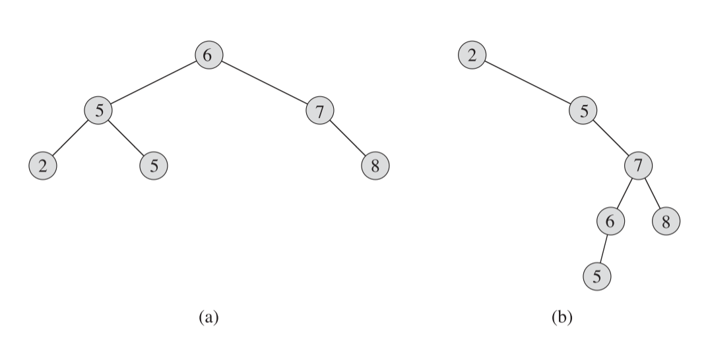



《算法导论》 第十二章笔记，线性二叉树的实现。



<!--more-->

## Chapter 12. Binary Search Trees

`搜索树(Search tree)`结构支持许多动态数组的操作，包括SEARCH，MINIMUM，MAXIMUM，PREDESCESSOR，SUCESSOR，INSERT和DELETE。

对于一个有$n$个结点的完全二叉树，这些操作在最坏情况下的时间复杂度应该为$\Theta(n)$，而如果是一个随机建立的二叉树，复杂度应该为$\Theta(\lg n)$

### What is a binary search tree?

二叉搜索树的每一个结点（下使用`x`来表示）都包含一个$key$值以及三个指针$p$、$left$和$right$分别表示结点的父结点，左子结点和右子结点。

对于一个二叉搜索树而言，一个结点的所有左子结点一定小于等于该结点值，结点的所有右子结点一定大于等于该结点值。

大部分搜索树的操作都与树的高度有关，下图是两个搜索二叉树的情况：



可以看到两个树都有8个结点，但(a)中的树较为平衡，树的深度较低，(b)树则很不平衡都集中在了右树上，树的深度较深。

二叉搜索树可以通过简单的递归按顺序打印出所有结点的数值，称为`中序树遍历(inorder tree walk)`，这个方法是先打印左树的值，再打印中间结点的值，最后打印右树的值。同理，还有`前序树遍历(preorder tree walk)`和`后序树遍历(postorder tree walk)`。

中序树遍历的伪代码如下

```pseudocode
INORDER-TREE-WALK(x)

if x!=NULL
	INORDER-TREE-WALK(x.left)
	print x.key
	INORDER-TREE-WALK(x.right)
```

中序树遍历的时间复杂度为$\Theta(n)$。

证明如下：首先因为中序遍历需要访问所有n个结点，所以时间复杂度最少为$\Omega(n)$，所以只要证明时间复杂度为$T(n)=O(n)$即能满足情况。

在空树的情况下，因为需要判断`x!=null`，所以也是存在一些时间花费的，以$T(0)=c$来表示。设左树有$k$个结点，则右树有$n-k-1$个结点，那么遍历时间可表达为$T(n)\leq T(k) + T(n-k+1) +d$。这个$d$表示是一个常数，用来控制右式为遍历时间的上限。

后面我们可以通过`4.3`节中的替代法来证明，为了证明$T(n)=O(n)$，假设$T(n)\leq (c+d)n+c$。对于$n=0$,$(c+d)0+c=c=T(n)$，满足情况，对于$n>0$来说

$$
T(n)\leq T(k) + T(n-k+1) +d \\\\
=( (c+d)k + c ) + ( (c+d)(n-k-1) +c ) +d \\\\
=c + (c+d)n  -(c+d) +c +d\\\\
=(c+d)n +c
$$

满足猜测，所以证明得$T(n)=O(n)$。因此结合$T(n)=\Omega(n)$可得$T(n)=\Theta(n)$

### Querying a binary search tree



1. *Introduction to Algorithms* 3rd Sep.2009



***