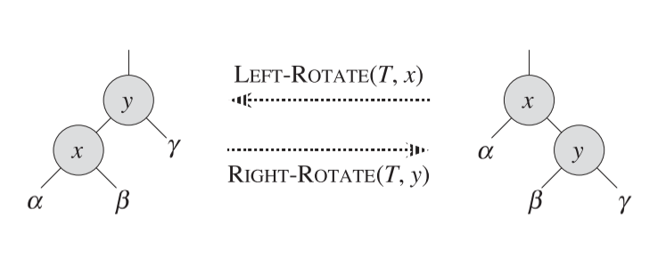
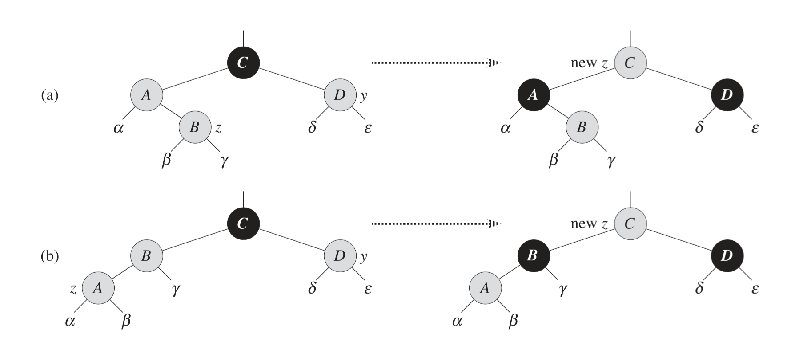
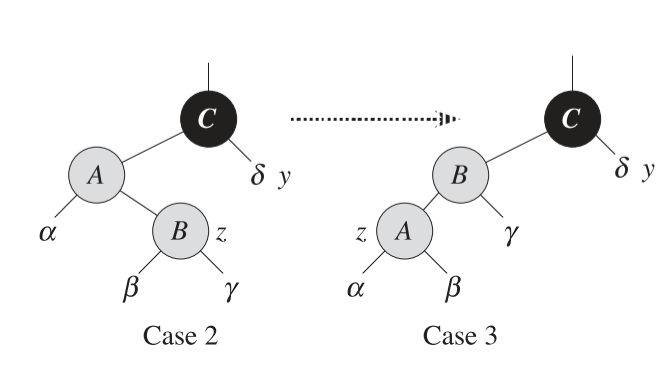
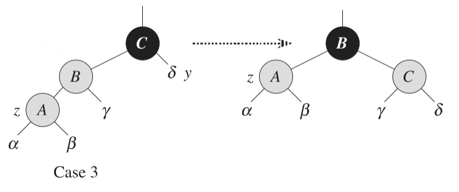
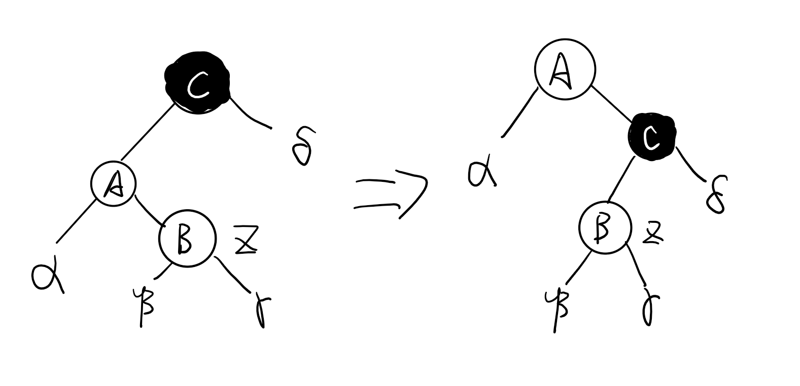



《算法导论》 第十三章笔记 红黑树实现



<!--more-->

# Chapter 13. Red-Black Trees

红黑树是众多让二叉搜索树达到平衡的树形结构之一。树达到平衡可以保证动态操作，如删除，插入，搜索等，复杂度都为$O(lgn)$

## Properties of red-black trees

红黑树是一种特殊的二叉搜索树，每个结点需要花费额外一个bit来存储结点的颜色信息，颜色为红或者黑。红黑树保证了整棵树，不会有一个路径是另一个路径的两倍长。

红黑树满足以下五个特性：

1. 所有结点要么是黑要么是红
2. 根节点是黑色的
3. 每个叶子（这里指NULL结点）是黑色的
4. 如果一个结点是红色的，那么他的两个子结点是黑色的（即不会有连续的两层是红）
5. 所有结点到他的任意后代的简单路径上（不存在绕行）有相同的黑色结点数

将任意结点到叶子的路径上黑色结点的数目成为`黑高(black-height)`，表达为$bh(x)$。将一棵树的黑高定义为：根节点到叶子的黑高。

* 黑高的计算并不包含结点自己。例如，根节点必然是黑色的，但如果一棵树，只有根节点，那么他的黑高是0，因为根节点并不纳入黑高的计算。

用一个哨兵（用`T.nil`表示）来指代叶子结点（NULL），这样所有的叶子和根节点的父节点都为`T.nil`。

将除了叶子结点外的所有结点成为`内部结点(internal nodes)`，否则为外部结点`external nodes`




定理：一个有$n$个内部结点的红黑树，其高度最多为$2\lg (n+1)$



定理证明如下：

1. 首先需要证明定理：对于任意一个结点$x$，至少有$2^{bh(x)}-1$个内部子结点
   
   用推导法证明该定理：

   (1)如果结点`x`的高度是0，则`x`一定是叶子结点。其黑高为0，那么内部子节点为$2^0-1=0$，即0个内部子节点，满足

   (2) 如果结点`x`的高度不为0，且有两个子结点。根据特性5，可以推得如果这个子结点是红色，则这个子结点的黑高为$bh(x)$，如果子结点是黑色，则子结点的黑高为$bh(x)-1$。

   因为$x$的黑高为$bh(x)$，如果子结点是黑色的，则这个子结点本身提供了一个黑色结点，所以它的黑高只能为父结点黑高减1，即$bh(x)-1$，反之子结点是红色的，那么这个结点不提供黑色结点，他的黑高和父结点一样，为$bh(x)$

   所以结点$x$至少有 $2*(2^{bh(x)-1}-1) +1$个结点，这里两个子结点的各自内部子结点数计算都取更小的黑高数$bh(x)-1$，式子最后的加一表示$x$结点自己，式子计算得$2^{bh(x)}-1$，即满足定理。

2. 根据红黑树的特性4，红色结点的子结点必为黑色。所以红色结点出现最多的情况也只能是红黑相间，红色结点不可能连续出现而黑色结点可以。因此一个节点的黑高数最起码是其高度的一半，即$bh(x)>\frac{h}{2}$。

3. 结合1和2中得出的结论。1中得出了
   
   $$
   n \geq 2^{bh(x)}-1
   $$

   2中得出了

   $$
   bh(x)>\frac{h}{2}
   $$

   所以

   $$
   n \geq 2^{bh(x)}-1 \geq 2^{\frac{h}{2}} -1
   $$

   即

   $$
   2^{\frac{h}{2}} \leq n+1
   $$

   即

   $$
   h \leq 2 \lg (n+1)
   $$

   得证。

因为一个有$n$个结点的红黑树，其高度$h$最多为$2\lg (n+1)$，且二叉搜索树的操作时间复杂度都为$O(h)$，所以红黑树操作的时间复杂度为$O(\lg n)$

## Rotations

红黑树的插入和删除操作都可能破坏红黑树特性。为了保证红黑树的特性，可以在两个操作后通过修改结点的颜色，和改变树的部分结构保证其仍然满足红黑树的特性。

通过`Rotate`操作来修改树的部分结构，这个操作要保证修改树结构的同时不会影响二叉搜索树的特性。`Rotate`分为`leftRotate`和`rightRotate`，因为两个操作基本是镜像的，所以这里只对`leftRotate`作具体分析。

在对于一个结点$x$进行左旋时，$x$必须含有右子树，将$x$的右子树称为$y$。左旋操作的支点可以看作是$x$和$y$的交界点，左旋操作为：用y替换x的位置，将$y$原先的左子树变为$x$的右子树,将$x$变为$y$的左子树，。

左旋和右旋的示意图如下：从左到右是对于y的右旋，从右到左是对x的左旋

* 无论是左旋还是右旋，被旋转的节点深度都+1，（变得更靠下）



左旋操作的伪代码如下

```pseudocode
TREE-ROTATE(T,x)

y = x.right;

//用y替换x的位置
y.p = x.p
if( x.p == NULL)
    T.root = y
else if ( x == x.p.left )
    x.p.left = y
else
    x.p.right = y

//将y的左结点变为x的右结点
x.right = y.left
if y.left != NULL
y.left.p = x

//将x作为y的左子树
y.left = x
x.p = y
```

c++代码的实现如下：

```c++
bool RBTree::LeftRotate(RBTreeNode* node)
{
	if (node == nullNode || node->right == nullNode)
	{
		cout << "Invalid operation: LeftRotate";
		return false;
	}

	RBTreeNode* lowerRight = node->right;

	//lowerRight replace node's place
	lowerRight->parent = node->parent;
	if (node->parent == nullNode)
	{
		rootNode = lowerRight;
		nullNode->right = rootNode;
		nullNode->left = rootNode;
		nullNode->parent = rootNode;
	}
	else if (node == node->parent->left)
	{
		node->parent->left = lowerRight;
	}
	else
	{
		node->parent->right = lowerRight;
	}

	//lowerRight's left subtree become node's right subtree
	node->right = lowerRight->left;
	if (lowerRight->left != nullNode)
	{
		lowerRight->left->parent = node;
	}

	//node as lowerRight's left subtree
	node->parent = lowerRight;
	lowerRight->left = node;

	return true;
}
```

右旋操作与左旋操作对称，只要将左旋操作中的left都换为right,right都换为left即可。

这里直接给出右旋操作的c++代码

```c++
bool RBTree::RightRotate(RBTreeNode* node)
{
	//As the symmetry of LeftRotate
	if (node == nullNode || node->left == nullNode)
	{
		return false;
	}

	RBTreeNode* lowerLeft = node->left;

	lowerLeft->parent = node->parent;
	if (node->parent == nullNode)
	{
		rootNode = lowerLeft;
		nullNode->left = rootNode;
		nullNode->right = rootNode;
		nullNode->parent = rootNode;
	}
	else if (node == node->parent->right)
	{
		node->parent->right = lowerLeft;
	}
	else
	{
		node->parent->left = lowerLeft;
	}

	node->left = lowerLeft->right;
	if (lowerLeft->right != nullNode)
	{
		lowerLeft->right->parent = node;
	}

	node->parent = lowerLeft;
	lowerLeft->right = node;

	return true;
}
```

左旋及右旋操作的时间复杂度都为$O(1)$

## Insertion

红黑树插入算法的思想为，先像普通的二叉搜索树一样插入结点，然后调用`RB-INSERT-FIXUP`函数调整树使其满足红黑树特性。

红黑树插入算法与普通的二叉搜索树插入算法主要有四个区别：

1. 用`T.nil`替代`NULL`
2. 将`T.nil`设为新插入结点的子结点
3. 新插入结点的颜色为红色
   
   这是为了保证性质5。如果新插入的结点设为黑色，那么新结点所在路径黑高则会增加，而另一条路径不变，则违背了性质5）。
4. 插入后，调用`RB-INSERT-FIXUP`函数

Insert伪代码如下

```pseudocode
RB-INSERT(T,z)

z.left = T.nil
z.right = T.nil
z. color = RED

y = T.nil
x = T.root
while x != T.nil
    y = x
    if z.key < x.key
        x = x.left
    else
        x= x.right
z.p = y
if y == T.nil
    T.root = z
else if z.key < y.key
    y.left = z
else
    y.right = z

RB-INSERT-FIXUP(T,z)
```

c++ 实现如下

```c++
bool RBTree::Insert(int value)
{
	RBTreeNode* toInsert = new RBTreeNode();
	toInsert->value = value;
	toInsert->color = RED;
	toInsert->right = nullNode;
	toInsert->left = nullNode;

	RBTreeNode* targetNode = rootNode;
	RBTreeNode* targetNodeParent = nullNode;

	while (targetNode != nullNode)
	{
		targetNodeParent = targetNode;
		if (value < targetNode->value)
		{
			targetNode = targetNode->left;
		}
		else if (value > targetNode->value)
		{
			targetNode = targetNode->right;
		}
		else
		{
			return false;
		}
	}

	if (targetNodeParent == nullNode)//Tree is empty
	{
		rootNode = toInsert;
		rootNode->parent = nullNode;
		nullNode->left = rootNode;
		nullNode->right = rootNode;
		nullNode->parent = rootNode;
	}
	else
	{
		if (value < targetNodeParent->value)
		{
			targetNodeParent->left = toInsert;
		}
		else
		{
			targetNodeParent->right = toInsert;
		}
		toInsert->parent = targetNodeParent;
	}

	InsertFixUp(toInsert);
	return true;
}
```

后面要解决的问题就是函数`RB-INSERT-FIXUP(T,z)`的实现，在进入讨论前，需要先明确几点

1. 性质1不可能违背，因为新插入的结点是红色
2. 性质3不可能违背，因为新插入的结点两个叶子设为了红色
3. 性质5不可能违背，因为新插入的结点为红色，且替换的是原来NULL的地方
4. 可能违背的只有性质2和性质4。

    当新插入的结点$z$是根节点时，违背性质2

    当新插入的结点父节点是红色时，违背性质4

5. 在每次插入新结点前，树的状态一定是满足红黑树的，这意味着同时性质2和性质4最多被违背一个。

    如果违背了性质2，那么说明新插入的$z$是树中唯一的结点，那么不可能违背性质4

    如果违背了性质4，那么说明$z$和$z.p$都为红色。$z.p$不可能是根节点，不然在插入$z$前就已经为违背了红黑树特性2，$z.p.p$必然为黑色，否则也是在插入前就违背了性质4。因此不可能违背性质4的情况下，不可能违背性质2。

这里算法更多的是关注违背性质4时的处理方式，因为性质2比较好修复，只要将根节点的颜色改变即可。

`RB-INSERT-FIXUP(T,z)`算法一共对插入新结点后，可能出现的违背红黑树原则的6种情况进行修复。前三种情况出现在$z.p$是$z.p.p$的左结点，后三种情况是$z.p$是$z.p.p$的右结点。前三种与后三种情况的修复是对称的，将前三种修复时的左旋操作改成右旋操作即为后三种情况的修复。因此这里只关注于前三种情况的讲解。

前三种(z.p = z.p.p.left )情况的区分在于$z$的$uncle$的颜色，即$z.p.p.right$的颜色。

1. 如果$z.p.p.right$为红色，无论$z$是$z.p$的哪科子树，都为情况1。
2. 如果$z.p.p.right$为黑色，且$z$是$z.p$是右子树，则为情况2。
3. 如果$z.p.p.right$为黑色，且$z$是$z.p$是左子树，则为情况3。


对于情况1的修复：

如图示，$z$为红色，$z.p$和$z.uncle$都是红色。情况1的修复步骤为：
1. 将$z.p$和$z.uncle$都变为黑色
    
    这样违背性质4的连续红色结点就消失了。
2. 将$z.p.p$变为红色

    因为$z.p$和$z.uncle$都变成了黑色，所有包含他们的通路，黑高都+1。考虑到包含了$z.p$和$z.uncle$的通路必然都包含$z.p.p$，所以为了保证通路上的黑高不变，将$z.p.p$变为红，这样增加的黑高就弥补了。

3. 将$z$指针指向$z.p.p$

    因为将$z.p.p$变为了红色，所以可能$z.p.p$和$z.p.p.p$会出现违背性质4的情况。将$z$指针指向$z.p.p$即可重新通过`RB-INSERT-FIXUP(T,z)`算法进行判断。

情况1修复的图解如下：



对于情况2、3的修复：

在情况2和3下，$z.uncle$是黑色，因此$z.uncle$和$z.p$的颜色不同，也就不能像情况1的修复一样统一改成黑色，不然会影响他们子树的黑高。因此这两种情况需要用到旋转来修复。

情况2下$z$作为$z.p$的右子树，因此可以对$z.p$进行左旋。于$z.p$进行左旋后，将原先$z.p$定义为$z$即转换为了情况3，如下图所示



对于情况3，我们对$z.p.p$，即上图中的$C$进行右旋。旋转后如下图所示。


可以看到路径存在$A$结点的树的黑高都减一（原先父结点是黑色的$C$,现在变成了红色的$B$），而包含$C$结点的路径黑高是不变的。而且此时$A$和$B$还是不满足性质4。这里再将原先的$B$调整为黑色，原先的$C$调整为红色。对于包含$A$的路径而言，黑高+1，对于包含$C$的路径而言，黑高不变，因为路径上一个结点变成了红，一个结点变成了黑。因此情况三的最终变化如下：



情况3调整后性质4和5都满足了，而不像情况1调整后仍然可能存在违背性质4的可能。

另外对于情况2和3的处理，不能是情况3通过右旋$z.p$来转换为情况2再进行修复。因为如果在情况2下对$C$进行右旋，会出现如下情况。



此时满足了性质4，但是包含$\alpha$结点路径的黑高少了1，如果为了满足性质5将$A$结点和$C$结点调整颜色，那么$C$结点和$B$结点又会违背性质4。

情况4，5，6的调整与情况1，2，3是镜像这里就不复述了。

整个给出`RB-INSERT-FIXUP(T,z)`的伪代码实现

```pseudocode
RB-INSERT-FIXUP(T,z)

while z.p.color == RED
	if z.p == z.p.p.left // Case 1,2,3
		y= z.p.p.right
		if (y.color == RED) //Case 1
			z.p.color = BLACK
			y.color = BLACK
			z.p.p.color = RED
			z = z.p.p
		else
			if z == z.p.right //Case 2
				z = z.p
				LEFT-ROTATE(T,z)
			z.p.color = BLACK // Case 3
			z.p.p.color = RED
			RIGHT-ROTATE(T,z.p.p)
	else //Case 4,5,6
		...
		//和情况1,2,3类似，将right和left对调即可
T.root.color = BLACK //保证性质2
```

c++代码如下

```c++
void RBTree::InsertFixUp(RBTreeNode* node)
{
	while (node->parent->color == RED)
	{
		if (node->parent == node->parent->parent->left)//The first three cases
		{
			RBTreeNode* uncle = node->parent->parent->right;

			if (uncle->color == RED) //Case 1
			{
				node->parent->color = BLACK;
				uncle->color = BLACK;
				node->parent->parent->color = RED;
				node = node->parent->parent;
			}
			else
			{
				if (node == node->parent->right) //Case 2
				{
					node = node->parent;
					LeftRotate(node);
				}

				//Case3
				node->parent->color = BLACK;
				node->parent->parent->color = RED;
				RightRotate(node->parent->parent);
			}
		}
		else
		{
			//The remainging three cases, as the symmetry of the first three

			RBTreeNode* uncle = node->parent->parent->left;
			if (uncle->color == RED)
			{
				node->parent->color = BLACK;
				uncle->color = BLACK;
				node->parent->parent->color = RED;
				node = node->parent->parent;
			}
			else
			{
				if (node == node->parent->left)
				{
					node = node->parent;
					RightRotate(node);
				}

				node->parent->color = BLACK;
				node->parent->parent->color = RED;
				LeftRotate(node->parent->parent);
			}
		}
	}
	rootNode->color = BLACK;
}
```

## Deletion





***