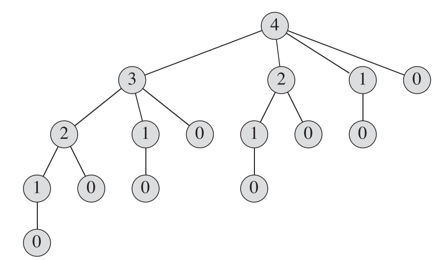
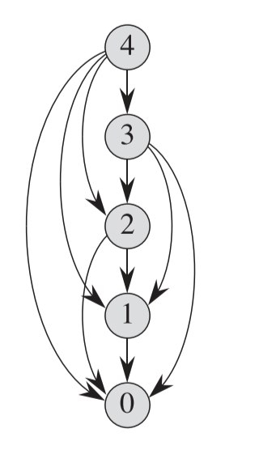



《算法导论》 第十五章笔记，介绍动态规划的概念及一些运用了动态规划的算法。



<!--more-->

# Chapter 15. Dynamic Programming

动态规划(Dynamic Programming)如分治法(divide-and-conquer method)一样都是通过组合子问题的解答来解决问题。两者的区别在于：

1. 分治法的子问题是互相独立的，不存在重叠
2. 动态规划的子问题是相互重叠的，不同的子问题可能存在重叠子问题。若对于每个子问题都求解一次，则会出现重复计算

动态规划常被用来解决最优问题（optimization problems），这种问题通常有许多可能的解答，动态规划的目标是求得一个最优解（通常是众多解答中的最大值或最小值）。

动态规划的步骤如下：

1. 找到最优解的结构
2. 递归定义最优解的值
3. 计算出最优解的值，通常是通过一个自下而上的递归方式解决
4. 使用计算得出的数据构建出最优解

步骤1-3是动态规划解决问题的基础，如果只需要求得最优解的值而非最优解本身，可以忽略步骤4。

## Rod cutting

钢条切割问题(Rod cutting)是假设存在一个钢条，切割成不同长度可以卖不同的钱，设切割出的长度为$i$，对应这一段长度的卖价为$P_i$。假设钢条长度从1-10的卖价如下

| 长度 | 1   | 2   | 3   | 4   | 5   | 6   | 7   | 8   | 9   | 10  |
| ---- | --- | --- | --- | --- | --- | --- | --- | --- | --- | --- |
| 价格 | 1   | 5   | 8   | 9   | 10  | 17  | 17  | 20  | 24  | 30  |


一段长度为$i$的钢条，一共有$2^{n-1}$个切割方法。因为将长度为$i$的钢条看作是有$i$个长度为1的结点进行分类，一共有$n-1$个连接点，每个连接点都可以选择切或者不切，所以有$2^{n-1}$个可能。

* 如有3个结点，1-2的切分和2-1的切分看作是两种可能。

设一段钢条在卖价最大化的情况下要切分成$k$块，则总长度为$n$的钢条可以表示为 $n=i_1+i_2+...+i_k$，最大化的总价为为$r_n$，可表示为$r_n=p_{i_1}+p_{i_2}+...+p_{i_k}$

对于上面假设的卖价，对应钢条的长度从1-10，各自的最佳卖价和切割方法如下

* 如切割方式$2+2$表示写成两半，一块为长度为2，另一块也为2.如果切割方式与总长度相同，如都为3,则表示不切割即为最佳切割方式。

| 钢条总长度 | 最大化卖价 | 最佳切割方式 |
| ---------- | ---------- | ------------ |
| 1          | 1          | 1            |
| 2          | 5          | 2            |
| 3          | 8          | 3            |
| 4          | 10         | 2+2          |
| 5          | 13         | 2+3          | p |
| 6          | 17         | 6            |
| 7          | 18         | 1+6 / 2+2+3  |
| 8          | 22         | 2+6          |
| 9          | 25         | 3+6          |
| 10         | 30         | 10           |

* 表格中的最佳切割方式是钢条切割问题的最佳解，而最大化卖价是最佳切割方式的数值。

可以把求得$r_n$，即整个钢条的最大化过程看作先切割一刀，这时候钢条变成了两部分，左部分就不再动了，对右部分继续切割，找到右部分的最佳切割方式，即对右部分求最佳解。数学可表示为

$$
r_n= \max _{1\leq i \leq n}(p_i + r_{n-i})
$$

这就是钢条切割问题的最佳解结构：整个问题的最佳解是与子问题的最佳解相关的。如上式中，最佳解的值是依赖于子问题的最佳解的值得到的。

### 递归解法

递归解法的伪代码如下，这个方法就是对式子$r_n= \max _{1\leq i \leq n}(p_i + r_{n-i})$的实现

```pseudocode
CUT-ROD(p,n)
if n == 0
    return 0

q = -MAX
for i = 1 to n
    q = max (q, p[i] + CUT-ROD(p,n-i))
return q
```
但这个运算是非常低效的，因为它存在许多的重复计算，如对于$n=4$，算法会在循环中分别以$n=0,n=1,n=2,n=3$调用CUT-ROD算法，而在以$n=3$调用时又会在循环中以$n=0,n=1,n=2$调用，这就造成了重复运算。调用时的计算如下图



图中的每个结点表示一次调用，结点中的数值表示$n$的取值，可以看到有非常多重复的结点。

设$T(n)$为该算法的执行时间，可以表示为

$$
T(n)= 1 + \sum _{i=1}^{n} T(n-i)
$$

可取$j=n-1$，将式子转换为

$$
T(n)= 1 + \sum _{j=0}^{n-1} T(j)
$$

可通过数学归纳法证明该式子的时间复杂度为$T(n)=2^n$，是一个指数型增长的式子，所以该算法的效率十分低下。

$T(n)=1 + \sum _{j=0}^{n-1} T(j)=2^n$的证明如下：

1. 当n=0时$T(0)=2^0=1$，满足式子，得证
2. 当n>0时
   $$
   T(n)=1+\sum _{j=0}^{n-1} 2^{j} \\\\
   =1 + 2^0 \cdot \frac{1-2^{n}}{1-2} \\\\
   = 1 + (2^n -1) \\\\
   = 2^n
   $$

    满足原式子，得证。

递归解法的c++实现如下:

```c++
int CutRod(int* priceTable, int rodLength)
{
	if (rodLength == 0)
		return 0;

	int price = INT_MIN;
	for (int i = 1; i <= rodLength; i++) //cut from 1 to length(equals to no cuts)
	{
		int tempPrice = priceTable[i] + CutRod(priceTable, rodLength - i);
		if (tempPrice > price)
			price = tempPrice;
	}
	return price;
}
```

### using dynamic programming for optimal rod cutting

在上一节的递归算法中，因为大量重复的计算导致了算法的低效。在动态规划的解法中，实际上是通过将计算过的子问题的解存储下来，之后再次遇到直接返回结果即可，所以动态规划本质上是一个空间与时间的权衡(time-memory trade-off)。

通过动态规划，基本可以将一个时间复杂度为指数型的算法（如$2^n$）转换为一个多项式型的算法（如$n^2$）

动态规划一般有两种解法，一种是`自顶向下备忘录法（top-down with memoization）`，一种是`自底而上法(bottom-up method)`。下面会以钢铁切割问题分别说明两种方法：

1. 自顶向下备忘录法

    这种方法与之前的递归法结构几乎相同，也是严格按照动态规划解法的定义，即将运算过的子问题答案记录下来。切割钢条问题使用自顶向下的备忘录法伪代码如下：

    ```pseudocode
    MEMOIZED-CUT-ROD(p,n):

    r = new array[n+1]
    for i =0 to n
        r[i] = -MAX
    return MEMOIZED-CUT-ROD-AUX(p,r,n)

    MEMOIZED-CUT-ROD-AUX(p,r,n):

    if r[n] > 0 //means there are record for this subproblem
        return r[n]
    if n == 0
        q = 0
    else
        q = -MAX
        for i = 1 to n
        q = max (q, p[i] + MEMOIZED-CUT-ROD-AUX(p,r,n-i))
    r[n] = q
    return q
    ```

    `MEMOIZED-CUT-ROD`主要功能是初始化一个数组$r$，这个数组存储了所有计算过的子问题的答案，`MEMOIZED-CUT-ROD-AUX`实际对应之前的递归算法`CUTROD`，不同点只是当发现答案记录过就直接返回。

    c++ 代码如下:
    
    ```c++
    int MemoizedCutRod(int* priceTable, int rodLength)
    {
        //create an array from 0 to rodLength, array length is (rodLength+1)
        //array[0] = 0, array[rodLength] means the max PriceMemo for rod of rodLength
        int* maxPriceMemo = new int[rodLength + 1];
        for (int i = 0; i < rodLength + 1; i++)
        {
            maxPriceMemo[i] = INT_MIN;
        }

        int maxPrice = MemoizedCutRodAux(priceTable, maxPriceMemo, rodLength);

        //for (int i = 1; i < rodLength + 1; i++)
        //{
        //    cout << "Max price for " << i << " is " << maxPriceMemo[i] << endl;
        //}
        return maxPrice;
    }

    int MemoizedCutRodAux(int* priceTable, int* maxPriceMemo, int rodLength)
    {
        if (maxPriceMemo[rodLength] > 0)//has record
            return maxPriceMemo[rodLength];

        int price = INT_MIN;
        if (rodLength == 0)
            price = 0;
        else
            for (int i = 1; i <= rodLength; i++)
            {
                int tempPrice = priceTable[i] + MemoizedCutRodAux(priceTable, maxPriceMemo, rodLength - i);
                if (tempPrice > price)
                    price = tempPrice;
            }

        maxPriceMemo[rodLength] = price;
        return price;
    }
    ```

    `priceTable`表示不同长度的钢条的价格数组，初始化定义为：

    ```c++
    int priceTable[] = { 0,1,5,8,9,10,17,17,20,24,30 };
    ```

    注意这里的数组长度都为$rodLength+1$，这是为了将长度与Index对齐，如长度为1的钢板的最大售价，则使用$maxPriceMemo[1]$即可。

2. 自底而上法

    自底而上法形式上更为简单，但它利用了动态规划的一个特性：较大的子问题包含较小的子问题。

    因此如果从最小的子问题开始解决，那么在解决后面更大的子问题时，它所依赖的所有小子问题都已经有了解答，也就不需要像自顶向下备忘法那样去检查是否子问题已经有了答案。

    所以如果要求长度为$n$的钢条的最大售价，只要从长度为1开始求起，依次求到长度为$n$

    伪代码如下：

    ```pseucode
    BOTTOM-UP-CUT-ROD(p,n)

    r = new array[n+1]
    for i =0 to n
        r[i] = -MAX
    r[0] = 0

    for i = 1 to n
        q = -MAX
        for j = 1 to i
            q = MAX(q , p[j] + r[i-j])
        r[i]=q

    return r[n]
    ```
    c++代码如下：

    ```c++
    int BottomUpCutRod(int* priceTable, int rodLength)
    {
        //Init for maxPriceMemo
        int* maxPriceMemo = new int[rodLength + 1];
        for (int i = 0; i < rodLength + 1; i++)
        {
            maxPriceMemo[i] = INT_MIN;
        }

        maxPriceMemo[0] = 0;

        //Calculate the MaxPriceMemo for length from 1 to length
        for (int i = 1; i <= rodLength; i++)
        {
            //Calculate cutRod for length = i
            int price = INT_MIN;

            for (int j = 1; j <= i; j++)
            {
                int tempPrice = priceTable[j] + maxPriceMemo[i - j];
                if (tempPrice > price)
                    price = tempPrice;
            }

            maxPriceMemo[i] = price;
        }

        for (int i = 1; i < rodLength + 1; i++)
        {
            cout << "Max price for " << i << " is " << maxPriceMemo[i] << endl;
        }

        return maxPriceMemo[rodLength];
    }
    ```

两个方法的时间复杂度实际上都是$\Theta(n^2)$。`BOTTOM-UP-CUT-ROD`中因为有个双重循环，所以时间复杂度为$\Theta(n^2)$，`MemoizedCutRod`中虽然只有一个循环，但在每次的循环中，可能会递归调用并需要解决子问题，子问题并不会重复调用，因此一共解决$n$个子问题，循环加上解决子问题的时间可得到时间复杂度同样为$\Theta(n^2)$。

虽然两个方法的时间复杂度都是$\Theta(n^2)$，但是`BOTTOM-UP-CUT-ROD`在实际使用中因为减少了函数的递归调用时间，所以更为高效。

### Subproblem graphs

子问题图（subproblem graphs）是一个有向图，每一个顶点都对应一个子问题。如果代表子问题$x$的结点指向代表子结点$y$的结点，则说明$x$问题的解依赖于$y$。

子问题图如下,它可以看作是表示递归解法的图的精简版，删除了所有重复的点，也表示子问题并不会被重复的计算：



子问题图可以用来获知动态规划问题的时间复杂度，因为图中的一个结点表示一个子问题，图中连接结点的边表示用来组合两个子问题答案的时间，因此用来解决整个动态规划问题的时间基本上与子问题图的顶点数+边数是呈线性关系的。

### Reconstructing a solution

上面的所有关于钢条切割问题的算法都只计算了钢条的最大售价（最佳解的值），而对于这个问题真正的解，如何切割钢条（最后钢条要切成几块，每块多长），并没有得出。所以上面的所有步骤都只完成了解动态规划问题四步骤的前三步。

为了得到最佳解需要对上面的步骤进行调整，调整有非常简单，在计算中再多保留一些数据即可。

以自底向上的`BOTTOM-UP-CUT-ROD`为例，在算法中，在算法中用了`p[j] + r[i-j]`来表示第一刀砍的长度$j$与剩下部分$i-j$。在售价最大的情况下，记录下第一刀砍的长度$j$即能获得动态规划的最佳解，因为在每一次的循环中，都将当前长度下第一刀砍的长度保存了下来，那么在剩下的长度越来越小的过程中，整个切割过程的每一刀长度都被记录了下来。

伪代码如下，这里的数组$s$即为记录第一刀长度的数组：

```pseudocde
EXTENDED-BOTTOM-UP-CUT-ROD(p,n)

r = new array[n+1]
s = new array[n+1]

for i =0 to n
    r[i] = -MAX
r[0] = 0

for i = 1 to n
    q = -MAX
    for j = 1 to i
        q = MAX(q , p[j] + r[i-j])
    r[i]=q
    s[i]=j

return s and s
```

c++代码如下，形参中的`cutLength`即表示不同长度下第一刀要砍的距离：

```c++
void ExtendedBottomUpCutRod(int* priceTable, int rodLength, int* maxPriceMemo, int* cutLength)
{
	for (int i = 0; i < rodLength + 1; i++)
	{
		maxPriceMemo[i] = INT_MIN;
	}

	maxPriceMemo[0] = 0;

	//Calculate the MaxPriceMemo for length from 1 to length
	for (int i = 1; i <= rodLength; i++)
	{
		//Calculate cutRod for length = i
		int price = INT_MIN;

		for (int j = 1; j <= i; j++)
		{
			int tempPrice = priceTable[j] + maxPriceMemo[i - j];
			if (tempPrice > price)
			{
				price = tempPrice;
				cutLength[i] = j;
			}
		}

		maxPriceMemo[i] = price;
	}

	//for (int i = 1; i < rodLength + 1; i++)
	//{
	//	//cout << "Max price for " << i << " is " << maxPriceMemo[i] << endl;
	//	cout << "First cut length for " << i << " is " << cutLength[i] << endl;
	//}
}
```

获得了最佳解后就可打印出对于长度为$n$的钢条，每一刀需要砍的长度，伪代码算法如下

```psudocode
PRINT-CUT-ROD-SOLUTION(p,n)

(r,s) = EXTENDED-EXTENDED-BOTTOM-UP-CUT-ROD(p,n)
while n > 0
    print s[n]
    n = s - n
```

c++实现如下：

```c++
int CutRodSolution(int* priceTable, int rodLength)
{
	int* maxPriceMemo = new int[rodLength + 1];
	int* cutLength = new int[rodLength + 1];
	ExtendedBottomUpCutRod(priceTable, rodLength, maxPriceMemo, cutLength);


	int remainLength = rodLength;
	while (remainLength > 0)
	{
		int length = cutLength[remainLength];
		cout << "to Cut " << length << endl;
		remainLength = remainLength - length;
	}

	return maxPriceMemo[rodLength];
}
```

## Matrix-chain multiplication





***