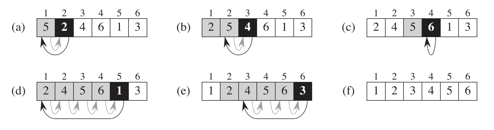
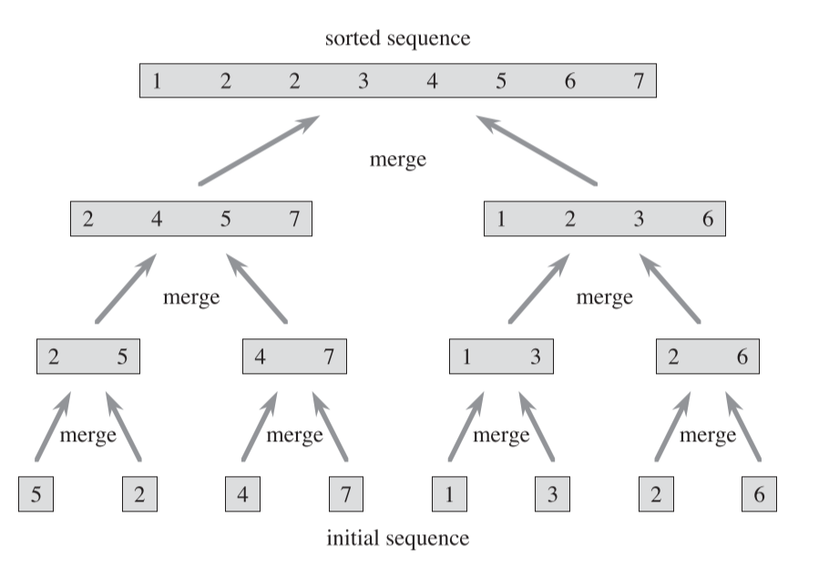
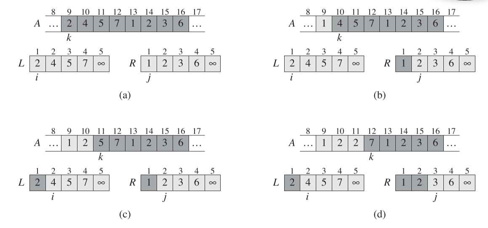
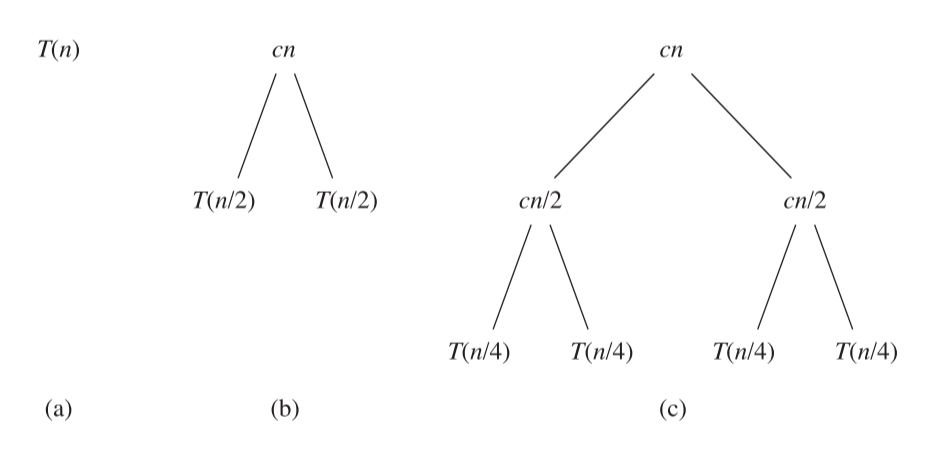
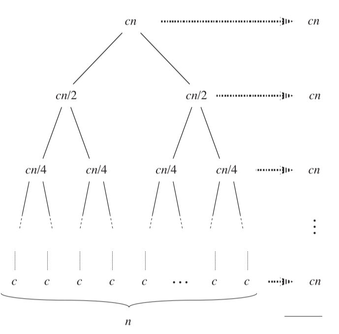
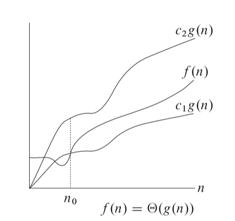
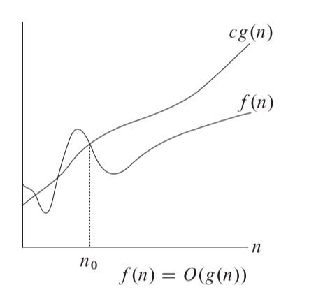
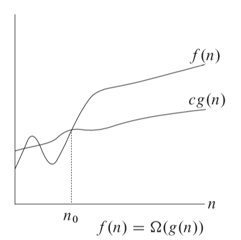
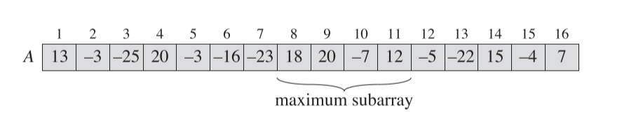


《算法导论》中第一部分 **基础** 的阅读笔记


<!--more-->

## Chapter 1. The Role of Algorithms in Computing

### Algorithms

1. 算法是一系列将输入转换为输出的操作步骤。
2. 数据结构是存储和管理数据的一种方式，这种方式要考虑到方便设备访问和修改数据。
3. 这本书也介绍了一些设计和分析算法的技术。如设计算法时需要的分治法，动态规划和如何分析算法是否准确是否高效等。
4. 算法在大多数情况下是找寻高效的方法，但在某些问题无法找到高效的解决方法，如NP问题。目前无人知道对于NP究竟是否存在一个高效的方法，而且NP问题有个特性，一旦找到了一个NP问题的高效解决方案，剩下的也就同样找到了。
5. 现代芯片的设计已经从提高时钟频率到了提高并行效率，因为芯片的功率提升与时钟频率的提升是一个超线性关系，如果一味的增高频率，很可能芯片就会过热。为了提升计算效率，现在考虑的就是使用多核芯片进行并行运算，书中也会引入一些多线程的算法。

### Algorithms as a technology

不同的算法一般有不同的效率，如插入排序和合并排序，插入排序的效率为$C_1 n^2$,而合并排序的效率为$C_2 n \log n$，虽然$C_1<C_2$，但是在n较大的情况下，$\log ⁡n$ 远小于$n^2$，所以对于大数据来说合并排序更为高效。

## Chapter 2. Getting Started

### Insertion Sort

1. 插入排序，在对数量较小的元素排序时是一个很高效的算法。

2. 插入排序类似于打牌整理手牌的过程，下为图解
    
    
    1) 首先将数组的某一项作为Key值，然后Key值从右至左的与每一项比较，如果该项的数值比Key值大，则将该值像右侧拷贝 A[i+1]=A[i] ，这相当于牌向右移的过程。

    2) 如果某一项比Key值小，则将Key值插入在他后方，A[i+1]=key

    3) 从数组的第二项开始从左至右的作为Key值，重复a,b的操作

3. 伪代码实现

    ```pseudocode
    for j=2 to A.length
	    key=A[j]
	    i=j-1
	    while i>0 && A[i]>key
		    A[i+1]=A[i]
		    i--;
        A[i+1]=key
    ```

4. C++实现

    ```c++
    void InsertationSort(int* array, int arraySize)
    {
	    for (int i = 1; i < arraySize; i++)
	    {
		    int key = array[i];
		    int startIndex = i - 1;
		    while (startIndex >= 0 && array[startIndex] > key)
		    {
			    array[startIndex + 1] = array[startIndex];
			    startIndex--;
		    }
		    array[++startIndex] = key;
	    }
    }
    ```

5. 一些书中伪代码需要注意的点

    1) for循环的变量，在退出循环后，保持最后一个超越循环边界的值
    
       如 for j=2 to A.length，在退出循环后，j = A.length +1

    2) A[ 1…..j] 表示A[1]、A[2]…A[j]

    3) 函数的形参是值传递的


### Analyzing algorithms

1. 分析算法主要是预测算法需要花费的资源，资源通常包括内存、带宽、但我们最关心的还是时间。

2. 书中的分析都是基于单核的随机访问机器(random-access machine)。在这个模型中，所有的操作都看作花费一个固定时长，而且我们不考虑内存操作（如分配内存）所占用的时间。

#### Analysis of insertion sort

1. 通常描述一个算法的运行时间都是一个关于输入数据大小的函数。

    1) 关于输入数据大小的定义根据问题的不同会发生改变。
   
        a. 对于排序问题，数据的大小通常就是需要排列的数的大小

        b. 对于两个整数相乘问题，数据大小就是这两个整数需要占据的bit数

        c. 有些时候还需要两个数字来描述问题，如关于图的问题就需要顶点数和边数。

    2) 关于算法的运行时间通常是关于算法究竟有多少步骤需要执行。在RAM模型中，我们简化每一步所花费的时间都是同样长且都为一个固定值。

    3) 循环语句本身比循环体要多一次执行，因为循环语句本身在越界的时候仍然会进行一次判断。
   
2. 插入算法时间复杂度分析

    | 插入排序步骤                        | 时间花费 | 运行次数              | 说明                                                                                                                                 |
    | ----------------------------------- | -------- | --------------------- | ------------------------------------------------------------------------------------------------------------------------------------ |
    | for j=2 to A.length                 | $c_1$    | $n$                   | 将A.Length看作n，因为循环语句本身多执行一次，所以总运行次数为$n$                                                                     |
    | &emsp;&emsp;key=A[j]                | $c_2$    | $n-1$                 | 2->n，运行$n-1$次                                                                                                                    |
    | &emsp;&emsp;i=j-1                   | $c_3$    | $n-1$                 | 2->n，运行$n-1$次                                                                                                                    |
    | &emsp;&emsp;while i>0 && A[i]>key   | $c_4$    | $\sum_{j=2}^nt_j$     | 因为运行次数收到while判断影响，所以不定为$t_j$<br>最好情况下直接满足，只需要判断一次，$t_j=1$<br>最坏情况运行到i=0，运行j次，$t_j=j$ |
    | &emsp;&emsp;&emsp;&emsp;A[i+1]=A[i] | $c_5$    | $\sum_{j=2}^n(t_j-1)$ | 比循环判断少运行一次，运行次数为$t_j-1$                                                                                              |
    | &emsp;&emsp;&emsp;&emsp;i--;        | $c_6$    | $\sum_{j=2}^n(t_j-1)$ | 比循环判断少运行一次,运行次数为$t_j-1$                                                                                               |
    | &emsp;&emsp;A[i+1]=key              | $c_7$    | $n-1$                 | 2->n，运行$n-1$次                                                                                                                    |

如表中所示，在最好情况下，$t_j=1$，最坏情况下运行$j$次。通常计算算法的复杂度，我们只考虑算法的最坏情况，因为往往在实际运算中，最坏情况就是最多的情况（如搜索算法，常常搜索的内容不在列表中，那就要搜索整个列表，即最坏情况）。而且纵使我们取平均值，在本例中，我们取运行次数为$j/2$，最终代入式子中计算，结果的最高次幂并不会改变。

我们以最坏情况计算整个表达式的时间

$$
T(n)=c_1n+c_2(n-1)+c_3(n-1)+c_4\sum_{j=2}^nj+\\\\c_5\sum_{j=2}^n(j-1)+c_6\sum_{j=2}^n(j-1)+c_7(n-1)
\\\\
又有
\\\\
\sum_{j=2}^nj=\frac{(2+n)(n-1)}{2}=\frac{n(n+1)}{2}-1
\\\\
\sum_{j=2}^nj-1=\frac{(1+n-1)(n-1)}{2}=\frac{n(n-1)}{2}
\\\\
代入上式得
\\\\
T(n)=c_1n+c_2(n-1)+c_3(n-1)+c_4\frac{n(n+1)}{2}-c_4\\\\+c_5\frac{n(n-1)}{2}+c_6\frac{n(n-1)}{2}+c_7(n-1)
\\\\
=\frac{c_4+c_5+c_6}{2}n^2+(c_1+c_2+c_3+\frac{c_4}{2}\\\\-\frac{c_5}{2}-\frac{c_6}{2}+c_7)n-(c_2+c_3+c_4+c_7)
=an^2+bn+c
$$

所以最坏的运行时间可以表达为$an^2+bn+c$，这是个二次幂方程.

#### Order of growth

一个函数的增长极受最高次幂的影响最大，所以我我们也只关注运算时间的最高次幂，在上例中即为$n_2$。我们将最坏情况运行时间成为$\Theta(n_2)$

### Designing algorithms

这节中简略介绍了分治法（divide-and-conquer），分治法的一大好处是运算时间比较好估计。

#### The divide-and-conquer approach

1. 许多算法都使用了递归，递归算法就是典型的分治法。将一个大问题分解为几个类似的小问题，然后递归的解决各个小问题，然后把结果合并在一起就得到了最终的答案。

2. 分治法的解决分为三个步骤：
   1) 分解：将大问题分解为几个小问题
   2) 解决：迭代解决小问题
   3) 合并：将小问题的答案结合成为原始问题的答案。

3. 归并排序（Merge sort algorithms）就是一个典型的分治法算法。排序算法的思想是将需要排序的数组二分，先对左半部分进行排序，再对右半部分进行排序，最有把左右半部分合并在一起获得完整的排序好的数组。

4. 归并排序算法的伪代码

    ```psuedocode
    Merge-sort(A,p,r)

    //A->需要排序的数组，p->需要排序部分的左起点，r->需要排序部分的右终点

    如果出现了p=r，说明被拆分出的子数组只有一个元素，则不需要计算。只计算p < r的情况

    if p < r 
        q = [(p+r)/2] //除不尽的话向下取整

        //将需要排序的部分等分为两部分，各自进行排序

        Merge-sort(A,p,q)
        Merge-sort(A,q+1,r)
        Merge(A,p,q,r)

    ```

    下图为归并排序图解，先将序列逐渐二分直到最后成为单个元素（单个元素不需要合并），然后再进行合并操作。

    


5. 归并排序中，最重要的就是最终合并的部分。在之前合并函数前，我们假定两个需要被合并的数组已经排序完毕。合并部分的伪代码如下

    ```pseudocode
    Merge(A,p,q,r)

    // A-> 需要排序的数组
    //p,q,r->数组中的Index，p<q<r，A[p,q]表示一个子数组（下称为左半部分），A[q+1,r]表示另一个子数组（下称为右半部分），左右部分都已经排序完毕。

    n1=q-p+1 //左半部分长度
    n2=r-q //右半部分长度

    Make L[1...n1+1],R[1...n2+1] //创建两个新的数组，长度与左右部分长度+1，防止之后遍历时越界。

    for i=1 to n1
        L[i]=A[p+i-1] //将左半部分内容对应拷贝到新建立的左数组中

    for j-1 to n2
        R[i]=A[q+j]  //将右半部分内容对应拷贝到新建立的右数组中

    //将左右数组的最后一个数值都设为无限大，如果遍历时达到了最后一个数值，说明这个数组已经完全装填回了原数组。因为最后的数值为无限大，所以另一个数组的数值始终小于等于这个数值，因此会一直装填另一个数组。

    L[n1+1]=Max 
    R[n2+1]=Max

    i,j=1

    for k=p to r
        if(L[i]<= R[j]>)
            A[k]=L[i]
            i++
        else
            A[k]=R[j]
            j++
    ```

    合并部分算法的图解

    

6. C++实现

    ```c++
    void MergeSort(int* array, int leftStartIndex, int rightEndIndex)
    {
        if (leftStartIndex == rightEndIndex)
            return;

        int centerIndex = (leftStartIndex + rightEndIndex) / 2;
        MergeSort(array, leftStartIndex, centerIndex);
        MergeSort(array, centerIndex + 1, rightEndIndex);
        Merge(array, leftStartIndex, centerIndex, rightEndIndex);

    }

    void Merge(int* array, int leftStartIndex, int middleIndex, int rightEndIndex)
    {
        int leftPartLength = middleIndex - leftStartIndex + 1;
        int rightPartLength = rightEndIndex - middleIndex;

        int* leftArray = new int[leftPartLength + 1];
        int* rightArray = new int[rightPartLength + 1];

        for (int i = 0; i < leftPartLength; i++)
            leftArray[i] = array[leftStartIndex + i];

        for (int i = 0; i < rightPartLength; i++)
            rightArray[i] = array[middleIndex + 1 + i];


        //Make the last index to be max
        leftArray[leftPartLength] = INT_MAX;
        rightArray[rightPartLength] = INT_MAX;

        int leftArrayIndex = 0, rightArrayIndex = 0;

        for (int i = leftStartIndex; i <= rightEndIndex; i++)
        {
            if (leftArray[leftArrayIndex] < rightArray[rightArrayIndex])
                array[i] = leftArray[leftArrayIndex++];
            else
                array[i] = rightArray[rightArrayIndex++];
        }

        delete[] leftArray;
        delete[] rightArray;
    }
    ```

#### Analyzing divide-and-conquer algorithms

当计算一个迭代问题的时间复杂度时，我们也常用迭代表达式来表示。

我们假定将原问题拆分为$a$个子问题，每个子问题有$\frac{1}{b}$个数据，那么所有这些子问题的花费时间为$aT(\frac{1}{b})$。并且拆分子问题需要$D(n)$的时间，合并子问题需要$C(n)$时间。另外我们需要考虑到如果子问题的输入数据足够小，可能在固定时间内子问题就能解决，例如排序的子问题，如果子数组只有一个变量，那么直接返回即可（固定时间）。所以整体的时间花费为：

$$
T(n)=\begin{cases}
    \Theta(1) & \text{if } n \leq c\\\\
    aT(\frac{1}{b})+D(n)+C(n) & 其他情况条件
\end{cases}
$$

#### Analysis of merge sort

这里着重讨论归并排序的时间复杂度。

**分解时间**：归并排序将数组分为两部分，这一操作只是单纯的二分，所以花费时间为固定值，即$D(n)=\Theta(1)$

**解决时间**：将数组平分为两个部分，所以每一份的数据为$n/2$且有两部分，所以子问题解决时间为$2T(\frac{n}{2})$

**合并时间**： 由合并算法的伪代码可知，整个计算过程只有单层循环，所以时间复杂度$C(n)=\Theta(n)$

综上，归并排序的时间复杂度为

$$
T(n)=\begin{cases}
    \Theta(1) & \text{if } n=1\\\\
    2T(\frac{n}{2})+\Theta(n) & \text{if } n\geq 1
\end{cases}
$$

目前$T(n)$的表达式是一个递归表达，我们需要根据这个解出$n\geq 1$情况下的$T(n)$单纯对于$n$的表达式。


我们将$T(n)$用树形结构表示，每个节点都代表一部分时间，所有节点的时间累计即为$T(n)$

例如式子$T(n)=2T(\frac{n}{2})+\Theta(n)$，使用树形结构表达即为从下图的(a)树转换为(b)树，(b)树中的每个节点即代表等式右边的每小部分。而$T(\frac{n}{2})$又可进一步表达为$2T(\frac{n}{4})+\Theta(\frac{n}{2})$，即为下图中(b)图的叶子进一步转换，变成(c)图的样子。




我们可以重复递归这样的操作，直到属性结构变成下图所示：



整棵树所有叶子所代表的时间总和即为$T(n)$，可以看到每一层叶子的总和都为$cn$。最下一层一共有$n$个节点，每个节点时间花费为$c$，即代表归并排序中分解子数组到数组的元素只有一个的情况，这时候直接返回（花费时间固定）。

现在问题的解决到了求树一共有多少层，我们知道最下面一层有$n$个元素，每层的数量都是2的次幂，且第一层为一个元素，所以我们设层数为$x$，计算表达式应该为：

$$
2^(x-1)=n \\\\
x=\lg n+1
$$

那么整棵树所有叶子的时间花费总和即为，每层的时间（$cn$）乘以层数($\lg n+1$)，即$T(n)=cn\lg n+cn$。

所以归并排序最差情况时间复杂度标识为$\Theta(n\lg n)$

* 书中的$\lg n$表示$\log_2n$，而非一般数学书中的$\log_{10}n$，因为计算机讨论的是二进制而非现实生活中常用的十进制。

## Chapter 3. Growth of Functions

### Asymptotic notation

#### Asymptotic notation,functions,and running time

书中所有的渐进符号都是用来用来表达算法的运算时间的，虽然渐进符号也能用来表示算法的其他资源，如内存，硬盘空间等。

#### $\Theta$-notation

在第二章中，描述插入算法的最坏情况下$T(n)=\Theta(n^2)$，但没有详细解释$\Theta$含义，
这一节给出了定义。

对函数$f(n)$，如果存在常数$c_1$，$c_2$和$n_0$使得对于任意$n\geq n_0$，满足
$$
0\leq c_1g(n)\leq f(n) \leq c_2g(n)
$$

则称$f(n)=\Theta(g(n))$，$g(n)$称为$f(b)$的渐进紧确界，函数下图表示




注意$\Theta(g(n))$实际上是一系列函数的集合，所以严格意义上来说应该表达为$f(n)\in \Theta(g(n))$，但在书中为了表达方便，都写为$f(n)=\Theta(g(n))$



这里的所有函数都约定为非负的


数学证明如下：

如我们要证明函数$\frac{1}{2}n^2-3n=\Theta(n^2)$，那么按定义，应该证明

$$
0\leq c_1n^2\leq \frac{1}{2}n^2-3n \leq c_2n^2
$$

不等式各边都除去$n^2$，得到

$$
c_1 \leq \frac{1}{2}-\frac{3}{n} \leq c_2
$$

那么当$n$足够大时（大于$n_0$）,则逼近于$c_1 \leq \frac{1}{2}\leq c_2$，明显可以可以找到$c_1$和$c_2$满足该不等式是。这里的$c_1$和$c_2$取值可以有无数种组合。

#### $O$-notation

$O$标记表示渐进上边界，定义为对函数$f(n)$，如果存在常数$c$和$n_0$使得对于任意$n\geq n_0$，满足

$$
0\leq f(n) \leq cg(n)
$$

函数图如下：



因为$O$标记定义的表达式实际上是$\Theta$标记表达式的一部分，所以可以用同样的方法证明$O$标记的合理性。

要注意的是，按照定义，$O$标记仅仅是定义了上边界，而没有具体的确认这个边界与原函数需要多么的紧密。如$n=O(n^2)$仍然也是成立的，即使对于函数$f(n)=n$来说，紧密的上边界应该为$O(n)$。

也正是因为如此，对于算法来说，无论输入情况是什么样的，都可以用$O$标记来描述。以插入函数举例：我们针对插入函数的最差输入情况（每次插入的数都需要插入到已有列表的第一个），紧密上边界表达式为$O(n^2)$；对于最佳输入情况（每次插入的数都可直接插入已有列表的最后），紧密的上边界应该表达为$O(n)$，但是表达式$O(n^2)$按定义仍然是可以用来描述最好情况的。

而渐进紧确界$\Theta$则不满足上述情况，在插入算法中，最坏和最好情况下，表达式分别为$\Theta(n^2)$和$\Theta(n)$。这里不同的是$\Theta(n^2)$不能用于描述最好情况，因为你无法找到一个常量$c$，在$n$足够大的情况下，仍然满足$n^2<cn$。

#### $\Omega$-notation

$\Omega$标记提供了符号渐进下边界，定义为存在常数$c$和$n_0$使得对于任意$n\geq n_0$，满足

$$
0\leq cg(n)\leq f(n)
$$

函数图像如下：



$\Omega$标记的证明与$\Theta$类似，且与$O$一样都能描述算法的任何输入。只不过$\Omega$关注的是算法的最好情况，$O$关注的是算法的最差情况，所以通常我们对于$O$的使用较多。



定理3.1：
对任意两个函数$f(n)$和$g(n)$，当且仅当$f(n)=O(g(n)$和$f(n)=\Omega(g(n))$时，存在$f(n)=\Theta(g(n))$



#### Asymoptotic notation in equations and inequalities

在书中，有时会在表达式和不等式中用渐进表达式来省去一些不关注的细节，如表达式$2n^2+3^n+1=2n^3+\Theta(n)$表示$2n^2+3^n+1=2n^3+f(n)$，其中$f(n)\in \Theta(n)$

#### $o$-notation

如之前在$O$标记一节中描述的，$O$标记可以表示紧密上边界和非紧密上边界，如对于函数$2n^2$,$O(n^2)$即为紧密上边界，而$O(n^3)$则不是。

这里我们定义$o$标记来单独表示非紧密上边界：对于任意正常量$c$，都存在一个对应的常量$n_0$使得在$n\geq n_0$时满足

$$
0\leq f(n) < cg(n)
$$

则称$f(n)=o(g(n))$

$o$标记和$O$标记在定义上的区别在于，$O$是存在常量$c$和$n_0$使表达式成立即可，而$o$定义是对于任意常量$c$，都要存在$n_0$使得表达式成立(且表达式为<而非$\leq$)，例如$2n=o(n^2)$但$2n\neq o(n)$。如果后者成立，那么当$c$取2时，无论$n_0$取值为多少，都无法满足$f(n)<2n$。

关于$o$标记还有一个等效的定义表达式：因为是$o$标记非紧密的上边界，所以当$n$足够大，$g(n)$会远大于$f(n)$

$$
\lim_{n\rightarrow \infty}\frac{f(n)}{g(n)}=0
$$

#### $\omega$ -notation

$\omega$标记对于$\Omega$标记就如同$o$标记对于$O$标记。$\omega$标记的定义为，对于任意正常量$c$，都存在一个对应的常量$n_0$使得在$n\geq n_0$时满足

$$
0\leq cg(n) < f(n)  
$$

则称$f(n)=\omega(g(n))$。例如，$n^2/2=\omega(n)$但$n^2/2 \neq \omega(n^2)$。且同样存在另一个定义。

$$
\lim_{n\rightarrow \infty}\frac{f(n)}{g(n)}=\infty
$$

$o$标记和$\omega$标记的关系可以表达为：当且仅当$g(n)\in o(f(n))$时，$f(n)\in \omega(g(n))$

#### Comparing functions

渐进标记与数学中的不等式有点类似，同样都满足传递法，如a<b，b<c，则a<c。

$f(n)=O(g(n))$ 类似于 $a\leq b$

$f(n)=\Omega(g(n))$ 类似于 $a\geq b$

$f(n)=\Theta(g(n))$ 类似于 $a= b$

$f(n)=o(g(n))$ 类似于 $a < b$

$f(n)=\omega(g(n))$ 类似于 $a > b$

但与不等式不同的是，对于两个数字，关系要么满足大于等于，要么满足小于等于。但对于渐进标记，存在两个函数$f(n)$和$g(n)$，可能即不满足$f(n)=O(g(n))$，也不满足$f(n)=\Omega(g(n))$，如函数$n$与$n^{1+\sin n}$，因为$n^{1+\sin n}$的次幂始终在变化，在0-2之间摇摆。


### Standard notations and common functions

这一节主要是介绍一些数学内容，这里只列出关键的结论，定理和公式，并没有完整证明。

#### Floors and ceilings（向上取整与向下取整）

一些定理及公式

$$\lceil n/2 \rceil + \lfloor n/2 \rfloor = n$$

$$ \lceil \frac{\lceil x/a \rceil}{b} \rceil = \lceil \frac{x}{ab} \rceil$$ 

$$ \lfloor \frac{\lfloor x/a \rfloor}{b} \rfloor = \lfloor \frac{x}{ab} \rfloor$$ 

$$ \lceil \frac{a}{b} \rceil \leq \frac{a+(b-1)}{b} $$

$$ \lfloor \frac{a}{b} \rfloor \geq \frac{a-(b-1)}{b} $$

#### Modular arithmetic（求余）

$$ a mod n =a -n\lfloor a/n \rfloor$$

如果存在$(a mod n ) = (b mod n)$，可写作$a\equiv b \text { (mod n)}$

#### Polunomials(多项式)

对于某个常量$k$，如果有$f(n)=O(n^k)$则称函数$f(n)$是多项式有界的

#### Exponentials（指数）

$$(a^m)^n=a^{mn}$$

$$(a^m)+a^n=a^{m+n}$$

对所有实数有，
$$ e^x=\sum_{i=0}^{\infty}\frac{x^i}{i!} $$
$$ e^x\geq1+x$$
$$ e^x=\lim_{n\rightarrow \infty}(1+\frac{x}{n})^n$$

指数增长速度比多项式快得多，可表达为

$$ \lim_{n\rightarrow \infty}\frac{n^b}{a^n}=0$$

用渐进标记，则表达为

$$n^b=o(a^n)$$

#### Logarithms（对数）

$$ \lg ^kn=(\lg n)^k$$
$$ a=b^{\log_ba} $$
$$ \log_c(ab)=\log_ca+\log_cb$$
$$ \log_ba^n=n\log_ba$$
$$ \log_ba= \frac{\log_ca}{\log_cb} $$
$$ \log_b(1/a)=-\log_ba$$
$$ \log_ba=\frac{1}{\log_ab}$$
$$ a^{\log_bc}=c^{\log_ba}$$

如果满足$f(n)=O(\lg^kn)$，则称$f(n)$是多对数有界的。

多项式的增长速度比对数快得多，可以表达为

$$ \lim_{n\rightarrow \infty}\frac{\lg^bn}{n^a}=0$$

用渐进标记，则表达为

$$\lg^bn=o(n^a)$$

#### Factorials(阶乘)

$$n!\leq n^n \text{ 即 }n!=o(n^n)$$
$$ n!=\omega 2^n$$
$$ \lg(n^!)=\Theta(n\lg n)$$

#### Functional iteration (多重函数)

可看作是函数的递归嵌套，递归次数用括号包裹的次幂表示，如$f^{(i)}(n)$，表示递归$i$次

$$
f^{(i)}(n)=
\begin{cases}
    n & \text{if }i=0 \\\\
    f(f^{(i-1)}(n)) & \text{if } i >0
\end{cases}
$$

如函数$f(n)=2n$，$f^{(i)}(n)=2^in$

注意区分$\lg^in$与$\lg^{(i)}n$，前者是$\lg n$的$i$次幂，后者是对$n$连续使用$i$次对数函数。

#### The iterated logarithm function (多重对数函数)

使用$lg*n$表示多重对数函数，定义为

$$ \lg^*n=min\{i\geq 0:lg^{(i)}n\leq 1\} $$

意思是求得最小的可以满足$lg^{(i)}n\leq 1$的$i$是多少

如$lg^*16=3$、$lg^*65536=4$，因为

$$\log_216=4 \rightarrow \log_24=2 \rightarrow \log_22=1$$
$$\log_265536=16 \rightarrow \log_216=4 \rightarrow \log_24=2 \rightarrow \log_22=1$$

即分别需要三次和四次运算才能满足条件。

#### 斐波那契数列

斐波那契数列定义为：

$$F_0=0$$
$$F_1=1$$
$$F_i=F_{i-1}+F_{i-2} $$


还有一个定义

$$
F_i=\frac{\phi ^ i - \hat{\phi}^i}{\sqrt{5}}
$$

其中$\phi$和$\hat{\phi}$为方程$x^2=x+1$的两个解。

* 斐波那契数列以指数速率增长。

## Chapter 4. Divide-and-Conquer

在分析分治法的时候一般无视了许多细节，例如在分析归并排序时，如果考虑到$n$存在奇、偶情况，那么表达式应该写成

$$
T(n)=\begin{cases}
     \Theta(1) & \text{ if }  n=1
     \\\\
     T(\lceil n/2 \rceil)+T(\lfloor n/2 \rfloor)+\Theta(n) & \text{ if }  n>1
\end{cases}
$$

但在实际中，通常会无视向上取整，向下取整和一些边界条件，所以在归并排序分析时写成

$$T(n)=2T(n/2)+\Theta(n)$$

### 4.1 The Maximum-subarray problem

从一个整数数组中找寻出值最大的子数组。如下图所示的数组中，$A[8..11]$即为最大数组，和为43



#### A brute-force solution

暴力破解法：通过双重循环遍寻所有的子数组情况，找出最大的数组。通过上一个子数组的和加上当前元素即可求得当前子数组的和，所以计算子数组和的花费为$O(1)$，遍历所有子数组需要的时间花费为$O(n^2)$，所以总体算法时间为$O(n^2)$

暴力破解的代码实现如下：

```cpp
int FindMaximumSubarray_BruteForce(int* originArray, int arrayLength, int& leftIndex, int& rightIndex)
{
	int maxSum = -INT_MAX, sum = 0;
	leftIndex = rightIndex = 0;
	for (int i = 0; i < arrayLength; i++)
	{
		sum = 0;
		for (int j = i; j < arrayLength; ++j)
		{
			sum += originArray[j];
			if (sum > maxSum)
			{
				maxSum = sum;
				leftIndex = i;
				rightIndex = j;
			}
		}
	}
	return maxSum;
}
```

#### A solution using divide-and-conquer

分治法求最大子数组问题的思路为，把原数组等分为两个部分，左半数组和右半数组。这时候求得的最大数组只可能是三种情况：完全在左半数组中，完全在右半数组中，处在左右半数组交界的地方。

所以分治法求最大子数组的伪代码如下，代码中依次求三种情况的最大子数组，然后比较求得原数组的最大子数组。（在求左右半边的最大子数组时使用了迭代）。

```pseudocode
FIND-MAXIMUM_SUBARRAY(A,low,high)
//A为原数组，low，high分别表示拆分出的左或右数组的左右Index

if high==low //只有一个元素时，即为最大子数组
    return [low,high,A[low]]
else 
    mid=[(low + high)/2]
    (left-low, left-high, left-sum)= FIND-MAXIMUM_SUBARRAY(A,low,mid)
    (right-low, right-high, right-sum)= FIND-MAXIMUM_SUBARRAY(A,mid+1,high)
    (cross-low, cross-high,cross-sum)=FIND-MAX-CROSSING-SUBARRAY(A,low,mid,high)

    if left-sum >=right-sum && left-sum>=cross-sum
        return [left-low,left-high,left-sum]
    else if right-sum>=left-sum && right-sum >= cross-sum
        return [right-low,right-high,right-sum]
    else
        return [cross-low,cross-high,cross-sum]
```

在求左右半边的最大子数组时使用了迭代，现在还要解决的就是求交叉最大子数组FIND-MAX-CROSSING-SUBARRAY函数的定义。

交叉最大子数组一定一部分处于左半数组，一部分处于右半。从Index mid处向左和向右各寻找最大的左部分，然后将左右部分结合便形成了最大的交叉子数组。

求交叉最大子数组伪代码如下：

```pseodocode
FIND-MAX-CROSSING-SUBARRAY(A,low,mid,high)

left-sum= -MAX
sum=0;

for i= mid downto low
    sum = sum + A[i]
    if sum > left-sum
        left-sum=sum;
        max-left-Index=i

right-sum= -MAX
sum=0;

for i= mid to high
    sum = sum + A[i]
    if sum > right-sum
        right-sum=sum;
        max-right-Index=i

return (max-left-index,max-right-index,left-sum + right-sum)

```

完整C++实现代码如下：

```c++
int FindMaximumSubarray_DivideAConquer(int* originArray, int leftIndex, int rightIndex, int& maxLeftIndex, int& maxRightIndex)
{
	if (leftIndex == rightIndex)
	{
		maxLeftIndex = maxRightIndex = leftIndex;
		return originArray[leftIndex];
	}

	int midIndex = (leftIndex + rightIndex) / 2;

	int sumLeft = 0, leftMaxLeftIndex = 0, leftMaxRightIndex = 0;
	sumLeft = FindMaximumSubarray_DivideAConquer(originArray, leftIndex, midIndex, leftMaxLeftIndex, leftMaxRightIndex);

	int sumRight = 0, rightMaxLeftIndex = 0, rightMaxRightIndex = 0;
	sumRight = FindMaximumSubarray_DivideAConquer(originArray, midIndex + 1, rightIndex, rightMaxLeftIndex, rightMaxRightIndex);

	int sumCross = 0, crossMaxLeftIndex = 0, crossMaxRightIndex = 0;
	sumCross = FindCrossingMaximumSubarray(originArray, leftIndex, midIndex, rightIndex, crossMaxLeftIndex, crossMaxRightIndex);

	if (sumLeft >= sumRight && sumLeft >= sumCross)
	{
		maxLeftIndex = leftMaxLeftIndex;
		maxRightIndex = leftMaxRightIndex;
		return sumLeft;
	}
	else if (sumRight >= sumLeft && sumRight >= sumCross)
	{
		maxLeftIndex = rightMaxLeftIndex;
		maxRightIndex = rightMaxRightIndex;
		return sumRight;
	}
	else
	{
		maxLeftIndex = crossMaxLeftIndex;
		maxRightIndex = crossMaxRightIndex;
		return sumCross;
	}
}

int FindCrossingMaximumSubarray(int* originArray, int leftIndex, int midIndex, int rightIndex, int& maxLeftIndex, int& maxRightIndex)
{
	int maxSumLeft = -INT_MAX;
	int sum = 0;
	for (int i = midIndex; i >= leftIndex; i--)
	{
		sum += originArray[i];
		if (sum > maxSumLeft)
		{
			maxLeftIndex = i;
			maxSumLeft = sum;
		}
	}

	int maxSumRight = -INT_MAX;
	sum = 0;

	for (int i = midIndex + 1; i <= rightIndex; i++)
	{
		sum += originArray[i];
		if (sum > maxSumRight)
		{
			maxRightIndex = i;
			maxSumRight = sum;
		}
	}

	return maxSumLeft + maxSumRight;
}
```





***