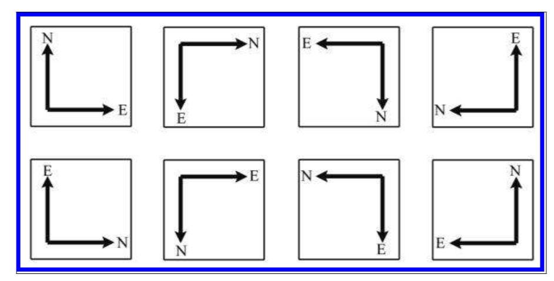
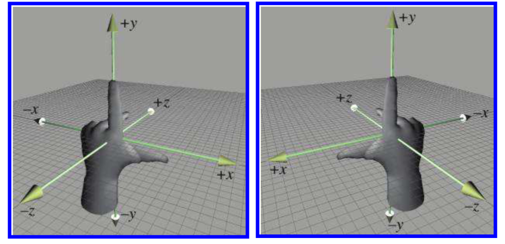
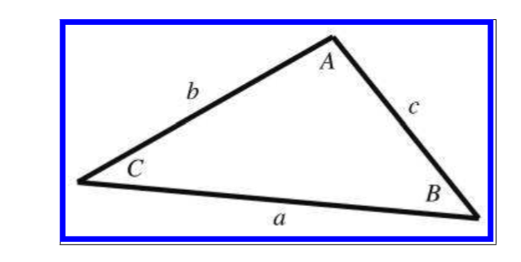

***



《3D数学基础：图形和游戏开发》第一章笔记

关于笛卡尔坐标系的介绍，如三维坐标种的左右手坐标系。

一些三角函数的介绍。



<!--more-->

# Chapter 1

在计算机三维数学和三维坐标的计算中，用的最频繁的框架就是笛卡尔坐标系（Cartesian coordinate system）。

## 1D Mathematics

有理数（Rational numbers）定义：可以表示为两个整数的比
实数定义：包括有理数和无理数（例如$\pi$）

对于自然数和整数的研究称作为离散数学（Discrete Mathematics），对于实数的学习称为连续数学（Continuous Mathematics）。



图形学第一定理：如果看起来结果是对的，那么就是对的

If it looks right, it is right.



## 2D Cartesian Space

坐标轴的长度是无限的。

对于二维坐标而言，无论X轴和Y轴选取的方向如何，都能通过旋转（包括翻转）将其互相转换。如下图是二维坐标的一共8种可能（当X轴选定一个方向（X轴的选择有六种可能）时，Y轴因为必须与X轴垂直，所以只有两种可能，正向或反向）：

所以从某种角度而言，所有的二维坐标都是等效的。

## 3D Cartesian Space

所有的二维坐标是等效的，但所有的三维坐标并不是等效的。可以通过旋转或反转将三维坐标中的两个匹配，但在这种情况下第三个坐标的方向可能是反的。

> 三维坐标一共有48种可能（Z轴一共有6种可能，X和Y构成二维坐标，有8种可能，6*8 = 48）。

因此所有的三维坐标被分为两组，一组被称为左手坐标系（Left-handed coordinate spaces），另一组被称为右手坐标系（Right-handed coordinate spaces）。左右手坐标系只是不同的选择，两者其他方面的差异。

如下图所示，左边为左手坐标系，右边为右手坐标系。

在每个坐标系下，如图所示，食指，中指，大拇指相互垂直，大拇指指向X轴正方向，食指指向Y轴正方向，中指指向Z轴正方向。

左右手坐标系还会影响`旋转的正方向`。在每个坐标系下，如果要绕着某个轴旋转，用大拇指指向该轴的正方向，四指环绕方向即为旋转的正方向。



这本书下的例子都是以左手坐标系为准的。



## Odds and Ends

### Summation and Product Notation

累加符号：
$$
\sum_{i=1}^{n}a_i
$$

累乘符号:
$$
\prod_{i=1}^{n}a_i
$$

### 间隔符号

$[a,b]$表示$a\leq x\leq b$

$(a,b)$表示$a<x<b$

$[a,b)$表示$a\leq x <b$

$(a,b]$表示$a<x\leq b$

### Angles,Degrees, and Radians

角度（Angles）在日常生活中用的比较多，但是在数学上弧度（Radians）用的更多。

当提及弧度，实际上是计算某角度在半径为1的圆上所占的长度。因为半径为1的圆周长为$2\pi$，所以$360^\circ = 2\pi 弧度$。

弧度与角度的转换关系如下：
$$
1\text{ rad} = (180/\pi)^\circ \approx 57.29578^\circ \\\\
1 ^ \circ = (\pi /180) \text{ rad} \approx 0.01745329 \text{ rad}
$$

### Trig Functions

对于在半径为1的圆上的点$（x,y）$，$\theta$为该点与原点形成的向量与X轴正方向的夹角，则
$$
x = \cos(\theta) \\\\
y = \sin(\theta) \\\\
$$

### Trig Identities

1. 基本转换

$$
\sin(-\theta)=-\sin\theta\\\\
\cos(-\theta)=\cos\theta\\\\
\tan(-\theta)=-\tan\theta \\\\
\sin(\frac{\pi}{2}-\theta) = \cos\theta\\\\
\cos(\frac{\pi}{2}-\theta) = \sin\theta\\\\
\tan(\frac{\pi}{2}-\theta) = \cot\theta\\\\
\cos \theta = -\cos(180-\theta)\\\\
\sin \theta = \sin (180-\theta)
$$

2. 勾股定理
   $$
   \sin^2\theta+cos^2\theta=1 \\\\
   1 + \tan^2\theta = \sec^2\theta \\\\
   1 + \cot^2\theta = csc^2 \theta
   $$

3. 

$$
\sin(a+b) = \sin a \cos b + \cos a\sin b \\\\
\sin(a-b) = \sin a \cos b - \ cos a \sin b \\\\
\cos(a+b) = \cos a \cos b -\sin a \sin b \\\\
\cos(a-b) = \cos a \cos b + \sin a \sin b \\\\
\tan(a+b) = \frac{tan a+ tan b}{1- \tan a\tan b } \\\\
\tan(a-b) = \frac{tan a - tan b }{1+ \tan a \tan b} \\\\
$$

4. 两倍角定理
   $$
   \sin 2\theta = 2\sin \theta \cos \theta \\\\
   \cos 2\theta = \cos ^2 \theta-\sin^2\theta=2cos^2\theta-1=1-2sin^2\theta \\\\
   \tan 2 \theta=\frac{2\tan \theta}{1- \tan^2\theta}
   $$
   

5. 正弦定理

   对于如下的三角形，有：

   

   $$
   \frac{\sin A}{a} = \frac{\sin B}{b}=\frac{\sin C}{c}
   $$
   
6. 余弦定理
   对于上面的三角形，有

   $$
   a^2=b^2+c^2-2bc\cos A, \\\\
   b^2 = a^2 +c^2 - 2ac \cos B, \\\\
   c^2 = a^2 +b^2 -2ab \cos C.
   $$



引用：

1. *3D Math Primer for Graphics and Game Development* 2nd 2011 


***