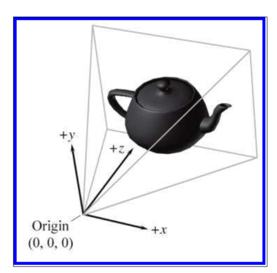
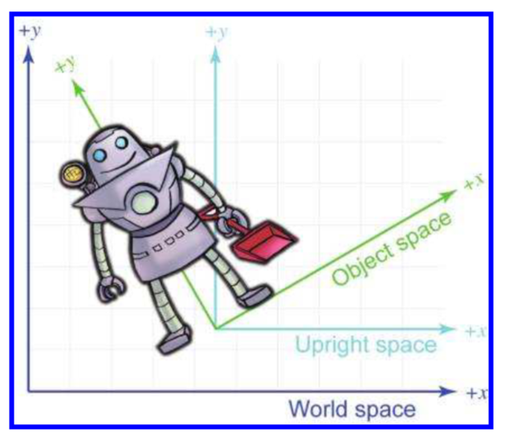
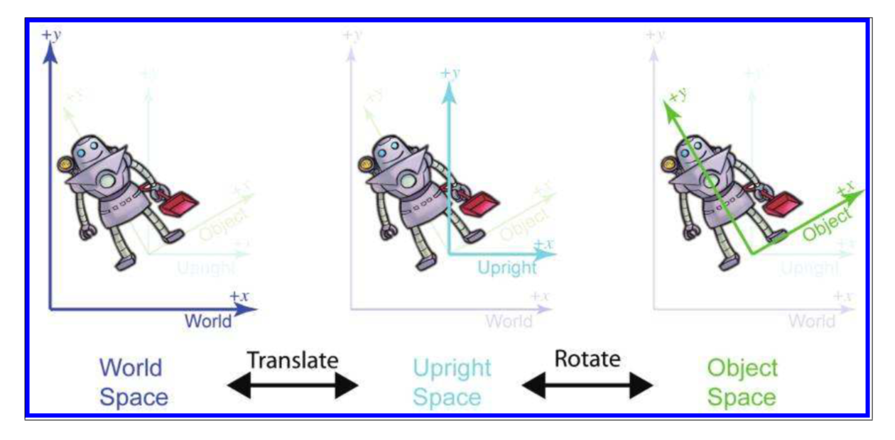



《3D数学基础：图形和游戏开发》第三章笔记

3.1节没什么关键信息。
3.2节介绍了世界坐标系，物体坐标系，摄像机坐标系，以及作者自己引入的直立坐标系。
3.3节介绍了坐标系转换时从移动物体出发和从移动坐标系出发的两种思考角度，还讨论了基本向量的选择问题。
3.4节讨论了嵌套坐标系存在的目的。
3.5节讨论了作者引入直立坐标系的初衷。



<!--more-->

# Chapter3 Multiple Coordinate Spaces

## Why Bother with Multiple Coordinate Spaces?

没什么关键信息

## Some Useful Coordinate Spaces

之所以需要不同的坐标系，是因为一些信息仅在某些坐标系下是有意义的，或者只能在某坐标系下获得（或更容易得到）。

### World Spaces

世界坐标系（World Spaces）是作为一个全局的存在，所有的其他坐标系都属于这个坐标系下。世界坐标系是需要关系的最大坐标系（类似于全集的概念）。

在不同的情况下，会有不同的世界坐标。

世界坐标系也被称为全局坐标系(Global coordinate space)或者统一坐标系（Universal coordinate space）。

### Object Space

物体坐标系（Object Space）是属于每一个物体的，即每个物体都有自己的物体坐标系，当这个物体移动时，物体坐标系也相应移动。

“向右转”就是物体坐标系的概念，而“向东走”就是全局坐标系的概念。

在图形学中，物体坐标系也被称为模型坐标系（Model Space），模型的顶点信息就描述在该物体的模型坐标系下。

### Camera Space

物体坐标系的一个重要特例就是摄像机坐标系（Camera Space），摄像机坐标系是关于用于渲染的视角的坐标系。

在摄像机坐标系下，$+X$轴指向右侧，$+Z$轴指向前方，$+Y$指向上方（注意本书采用的是左手坐标系，OpenGL采用的是右手坐标系）。

摄像机坐标系如下图所示：

### Upright Space

直立坐标系（Upright space）是这本书中提出的概念，是作为世界坐标和物体坐标转化过程中的中间变量存在，如下图所示：

直立坐标系的原点与物体坐标系相同，直立坐标系的方向与世界坐标系相同。下图为物体坐标系与世界坐标系经过直立坐标系转换的步骤：

## Basis Vectors and Coordinate Space Transformations

将一个坐标系下的坐标转换为另一个坐标系下的坐标称为坐标系转换（coordinate space transformation）。

### Dual Perspectives

坐标系转换可以从两个角度来考虑：

1. 主动转换（Active Transformation）：两个坐标系保持不动，物体的坐标进行转换
2. 被动转换（Pasison Transformation）：物体保持不动，坐标系进行转换

只需要注意的是，在从两个角度思考时，位移的方向是不同的。如上图从世界坐标转换到直立坐标系的过程，如果思考角度是移动物体，那么物体是向左下移动，到了原点；如果是从移动坐标系角度考虑，坐标系是向右上移动，到了原点。

另一点是，在进行旋转操作时，要保证物体处于当前坐标系的原点，因为一个坐标系下的旋转操作都是基于该坐标系的原点的。

所以在上图中，当从世界坐标系转换到本地坐标系时，会先移动转换到直立坐标系，因为前者坐标系物体不在原点，而后者在。同理在从本地坐标系转换到世界坐标系时，会先进行旋转，因为此时物体已经在原点了。

### Specifying Coordinate Spaces

坐标系是由原点和坐标轴两部分决定的，坐标轴是相对与自己原点而言的“上”，“右”，“前”。

一个坐标系的原点和坐标轴是相对于另一个坐标系的。

如在展示三个坐标系的上图中，如果说机器人的高度是5.5。那么直立坐标系的原点在世界坐标系中的位置大约在$(4.5,1.5)$，而物体坐标系中的$(1,0)$点，在直立坐标系下大约是$(0.87,0.5)$，物体坐标系中的$(0,1)$点，在直立坐标系下大约是$(-0.5,0.87)$。在直立坐标系中，向量$(0.87,0.5)$的角度大约是30°，因此两个坐标系的原点位置差距为$(4.5,1.5)$，角度差距在30°。

### Basis Vectors

如果在物体坐标系下一个点的位置是$(-1,5)$，那么它在世界坐标系下的位置可以按以下公式进行计算：

$$
w=o+b_xp+b_yq
$$

其中$b$为点在物体坐标系下的位置，即$(-1,5)$，$w$为点在世界坐标系下的位置，$o$为物体坐标系的原点在世界坐标系中的位置，在上例中为$(4.5,1.5)$，$p$为物体坐标系X轴在世界坐标系中的表示，在上例中为$(0.87,0.5)$，$q$为物体坐标系Y轴在世界坐标系中的表示，在上例中为$(-0.5,0.87)$。

将所有数据带入上式，可以算出该点在世界坐标系下的坐标为$(-1.13,5.35)$。计算如下：

$$
w=(4.5,1.5)+(-1)*(0.87,0.5)+5*(-0.5,0.87)=(-1.13,5.35)
$$

可以将上述公式简化，即不再将“点”作为考虑的对象，而是描述向量。因为是向量所以也就不需要考虑位移。如果上述公式不考虑位移（可以假象为两个坐标系的原点是重叠的），且推广至三维空间，可表示为：

$$
v=xp+yq+zr
$$

式中的$v$是目标坐标系下的坐标，$x,y,z$是当前坐标系下的选取的三条基本向量上的分量，$p,q,r$为三条基本向量在目标坐标系$v$上的表示。

如上例中，因为是二维空间，只有两条基本向量，选取的分别是X轴和Y轴，对应的P为$(0.87,0.5)$，对应的q为$(-0.5，0.87)$。

如有物体坐标系下的向量$b=[b_x,b_y,b_z]$，对应世界坐标系下的向量$u=[u_x,u_y,u_z]$，$p,q,r$为物体坐标系下选取的三条基本向量在世界坐标系下的表示。套用上述的公式，可表示为

$$
u=b_xp+b_yq+b_zr \text{ 或者表达为 } \begin{aligned}
    u_x=b_xp_x+b_yq_x+b_zr_x\\\\
    u_y=b_xp_y+b_yq_y+b_zr_y\\\\
    u_z=b_xp_z+b_yq_z+b_zr_z\\\\
\end{aligned}
$$

> 注意$p,q,r$三个向量实际上都是在世界坐标系下的表示，即$u,p,q,r$是属于一个坐标系下。

如果知道了向量$b$，求向量$u$只需要套用公式即可。但如果知道了向量$u$想求向量$b$，则需要解一个三元方程（$b_x,b_y,b_z$都是未知量）。

如果一系列向量满足，`向量互相垂直，即正交（orthogonal）`和`向量的长度都为1`，则称这些向量为标准正交基（orthonormal），如果基本向量是标准正交基，则求$b$的过程可以从解三元方程简化为以下公式：

$$
b_x=u\cdot p
\\\\
b_y=u\cdot q
\\\\
b_z = u\cdot r
$$

之所以可以这样简化，是因为：

1. 点乘的物理意义有求在某个分量上的长度，所以可以通过点乘来计算。
2. 如果三条基本向量不是相互垂直的，那么在一条基本向量上值增加，会导致另一条基本向量上的值也增加。
   如基本向量选取为$(1,0)$和$(1,1)$，如果点从$(1,1)$位移到$(2,2)$点上，虽然是在基本向量$(1,1)$上移动的，但同样会增加在$(1,0)$上的值。
   这样的话在上述公式中，则会出现$b_x$的值不仅与$p$有关，还可能与$q$有关。
3. $a\cdot b$的结果还与$b$的长度有关，为了避免这个影响，所以取$p,q,r$都为1

> 选取的基本向量通常都需要是线性无关的（Linearly Independent），即任意一个向量不能通过其他向量的线性组合表示出来。否则的话，n个向量无法描述n维空间中的所有向量，在线性代数中，将通过基本向量能表述的空间维度称为`秩(rank)`

对于基本向量不是标准正交基的情况，将在第六章中说明。

通常而言，对于三维空间而言，基本向量的选取都是X,Y,Z轴。

## Nested Coordinate Spaces

因为通常而言，物体坐标系最后都要基于世界坐标系进行计算，如把不同的物体放在世界中的过程。

因此可以称世界坐标系是父空间，物体坐标系是子空间。

而物体坐标系可以进一步划分，如将一只羊作为物体坐标系，可以再进一步将其头作为物体坐标系的子坐标系，称为头坐标系。同理头坐标系下还可以耳朵坐标系等。

这种将不同部分层层划分的模型称为关节模型（articulated model）。

一些运动在各自的坐标系下计算是很简单的，但是放在世界坐标系下将会很复杂。如羊一边走，一边摇头，一边上下翻动耳朵。对于耳朵坐标系而言，这只是Y轴的变化，但是对于世界坐标系而言，就是耳朵的运动轨迹就非常复杂了。

当知道了物体在一个子坐标系下的位置，可以通过坐标系之间的相对位置来进行转换。这部分会在之后章节详细说明。

## In Defense of Upright Space

当将点从物体坐标系转换到世界坐标系时，不仅需要进行旋转操作，还需要进行位移操作。

当将向量从物体坐标系转换到世界坐标系时，仅需要旋转操作。

但物体和点在代码中通常都是用同一个类型来表示的，如`flaot3`。因此需要一个方法来区分操作究竟是针对点还是向量，有的人将`flaot3`取别名，如变成`point`和`vector`，有的人则是通过计算过程，如将旋转操作和位移操作分开，在处理点的时候，使用位移操作。

作者在这里提出的直立坐标系（Upright Space）则是另一种表达，设想是，当使用世界坐标系时，则表示这个操作是需要进行位移的，而使用直立坐标系时，则是不需要位移。



引用：

1. *3D Math Primer for Graphics and Game Development* 2nd 2011 



***