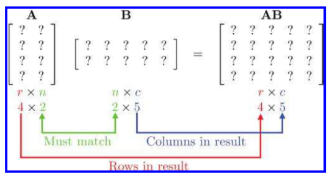
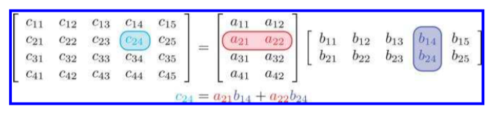
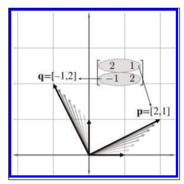
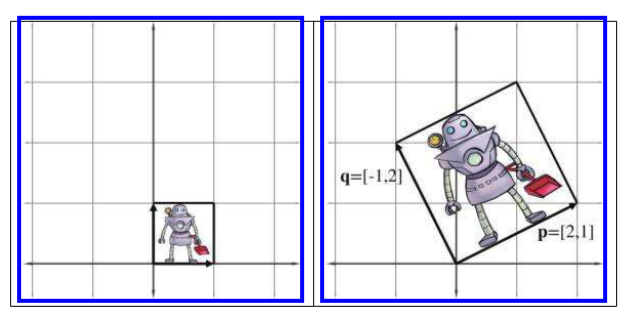
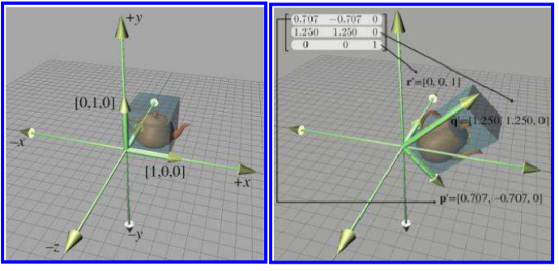



《3D数学基础：图形和游戏开发》第四章笔记

这一节简单的介绍了矩阵的一些基础性质：
4.1 关于矩阵的一些数学特性
4.2 关于矩阵是用来表达线性变换的几何意义
4.3 介绍了矩阵在线性代数中还可以用于解方程组



<!--more-->

# Introduction to Matrices

矩阵是3D数学的重要部分，它主要被使用在不同的坐标系之间的转换。

## Mathematical Definition of Matrix

在线性代数中，矩阵是由一系列数字按行和列排布组成。可以将向量看作是标量的集合，把矩阵看作是向量的集合。

### Matrix Dimensions and Notation

将一个有$r$行，$c$列的矩阵称为是$r\times c$矩阵，矩阵中的数字由方括号包围，如下为一个$3 \times 3$的矩阵，

$$
M=\begin{bmatrix}
m_{11}&m_{12}&m_{13}\\\\
m_{21}&m_{22}&m_{23}\\\\
m_{31}&m_{32}&m_{33}\\\\
\end{bmatrix}
$$

在这本书中，所有的矩阵都用大写粗体表示，如$\mathbf{M}$，用$m_{ij}$表示$\mathbf{M}$中第i行，第j列的元素。

### Square Matrices

将行数和列数相同的矩阵，称为`方阵（Square Matrices）`。

将下标的行数和列数相同的元素，称为`对角元素（Diagonal elements）`，如上矩阵中的$m_{11}$,$m_{22}$,$m_{33}$为对角元素。

如果一个矩阵（并不一定是方阵）中，所有的非对角元素都是0，那么整个矩阵称为对角矩阵（diagonal matrix）。如下

$$
\begin{bmatrix}
3&0&0&0\\\\
0&1&0&0\\\\
0&0&-5&0\\\\
0&0&0&2\\\\
\end{bmatrix}
$$

在对角矩阵中，如果所有的元素都为1，那么就变成了`单位矩阵（Identity Matrix）`，单位矩阵通常用$\mathbf{I}$表示，如下

$$
\begin{bmatrix}
1&0&0&0\\\\
0&1&0&0\\\\
0&0&1&0\\\\
0&0&0&1\\\\
\end{bmatrix}
$$

如果一个矩阵与单位矩阵相乘，那么得到的还是该矩阵本身。

### Vectors as Matrices

向量可以看作是一个$1\times n$或者$n \times 1$的矩阵，即$1\times n$的矩阵可以称为行向量，$n\times 1$可以称为列向量。

### Matrix Transposition

给定一个$r\times c$矩阵$\mathbf{M}$，其转置写为$\mathbf{M^T}$，转置矩阵是一个$c\times r$的矩阵。其中$\mathbf{M}$中的行变为$\mathbf{M^T}$中的列，即$\mathbf{M^T_{ij}}=\mathbf{M_{ji}}$。如下：

$$
{\begin{bmatrix}
a&b&c\\\\
d&e&f\\\\
g&h&i\\\\
\end{bmatrix}}^T=
\begin{bmatrix}
a&d&g\\\\
b&e&h\\\\
c&f&i\\\\
\end{bmatrix}
$$
$$
{\begin{bmatrix}
x & y &z
\end{bmatrix}}^T=\begin{bmatrix}
x\\\\
y\\\\
z\\\\
\end{bmatrix}
$$

转置矩阵有如下性质：

1. 矩阵转置的转置等于本身，$(\mathbf{M^T})^T=\mathbf{M}$
2. 如果一个矩阵的转置等于矩阵本身，那么$\mathbf{D^T}=\mathbf{D}$，那么这个矩阵就是是单位矩阵。

### Multiplying a Matrix with a Scalar

$$
kM=k\begin{bmatrix}
m_{11}&m_{12}&m_{13}\\\\
m_{21}&m_{22}&m_{23}\\\\
m_{31}&m_{32}&m_{33}\\\\
\end{bmatrix}=
\begin{bmatrix}
km_{11}&km_{12}&km_{13}\\\\
km_{21}&km_{22}&km_{23}\\\\
km_{31}&km_{32}&km_{33}\\\\
\end{bmatrix}
$$

### Multiplying Two Matrices

对于$r\times n$的矩阵$\mathbf{A}$，如果与$n\times c$的矩阵$\mathbf{B}$相乘，结果为$r\times c$的矩阵$\mathbf{AB}$

对于两个矩阵相乘，前者的列数必须与后者的行数匹配，如下：

假设将相乘结果中的每个元素称为$c_{ij}$，其值为前者的第$i$行中所有元素与后者的第$j$列中的元素一一相乘并累加，即

$$
c_{ij}=\sum_{k=1}^{n}a_{ik}b_{kj}
$$

如下：

矩阵相乘有如下性质：

1. $\mathbf{MI=IM=M}$
2. 矩阵的相乘不是可交换的，$\mathbf{AB\neq BA}$
3. 矩阵的相乘满足结合律，$\mathbf{(AB)C=A(BC)}$。矩阵与标量和向量同样满足结合性，即
   $$
   \mathbf{(kA)B=k(AB)=A(kB)}，\\\\
   \mathbf{(vA)B=v(AB)}
   $$
4. 乘积的转置，等于乘数与被乘数的转置以相反的顺序相乘，$\mathbf{(AB)^T=B^TA^T}$

### Multiplying a Vector and a Matrix

如有向量和矩阵的乘法如下：

$$
\begin{bmatrix}
x & y &z
\end{bmatrix}\begin{bmatrix}
  m_{11}&m_{12}&m_{13}\\\\
m_{21}&m_{22}&m_{23}\\\\
m_{31}&m_{32}&m_{33}\\\\
\end{bmatrix}= \\\\
\begin{bmatrix}
xm_{11}+ym_{21}+zm_{31} & xm_{12}+ym_{22}+zm_{32} &xm_{13}+ym_{23}+zm_{33}
\end{bmatrix}
$$

$$
\begin{bmatrix}
  m_{11}&m_{12}&m_{13}\\\\
m_{21}&m_{22}&m_{23}\\\\
m_{31}&m_{32}&m_{33}\\\\
\end{bmatrix}
\begin{bmatrix}
x\\\\
y\\\\
z\\\\
\end{bmatrix}=
\begin{bmatrix}
  xm_{11}+ym_{12}+zm_{13}\\\\
  xm_{21}+ym_{22}+zm_{23}\\\\
  xm_{31}+ym_{22}+zm_{33}\\\\
\end{bmatrix}
$$

向量和矩阵的乘法有以下特性：

1. 结果的每个元素，相当于原向量与矩阵不同列的点积（如果是矩阵与列向量相乘，则是与矩阵不同行的点积）
2. 矩阵中的每个元素相当于是控制输入向量的某个元素在输出某个元素上的占比。如$m_{12}$就是控制输入的$x$元素，在输出的$y$元素上的占比。所以对输入的向量而言，所有控制输入向量X分量的元素都在第一行，所有控制Y分量的元素都在第二行，所有控制Z分量的元素都在第三行，即矩阵的每一行都代表一个基础向量（类似于X轴，Y轴）。
3. 元素和向量的成绩满足分配律，如$\mathbf{(v+w)M=vM+wM}$

### Row versus Column Vectors

行向量与列向量本质上并没有区别，但需要注意使用行列向量与矩阵相乘时的顺序是不同的。假设向量$\mathbf{v}$需要与矩阵$\mathbf{A,B,C}$依次相乘。如果$\mathbf{v}$是列向量，那么向量应该出现在右侧，即写为$\mathbf{vABC}$。如果$\mathbf{v}$是行向量，那么向量应该出现在右侧，即写为$\mathbf{CBAv}$。

且行向量与列向量与同一个矩阵相乘后，对应的元素是不同的（如行向量计算结果的第一个元素与列向量计算结果的第一个元素不同）。因此如果想要使用行向量进行计算和使用列向量进行计算的结果向量元素一一对应相等的话，则它们各自使用的矩阵必须是不同的，且为转置关系。

行向量的优点在于，阅读的顺序和相乘的顺序是一致的，即从左到右，而列向量乘积的相乘顺序则是从右到左，但行向量的主要缺点在于，当向量的维度增加时，会让表达式变得非常的长，造成书写的不便，而使用列向量就不会有这个问题。

对于数学家而言，因为需要用到推到，所以他们更喜欢用写起来较短的列向量表达式。而对于计算机而言，因为没有书写的问题，所以更喜欢阅读和相乘顺序相同的行向量，**本书也是使用行向量作为与矩阵相乘的向量**，之后章节计算出的各种变换矩阵都是基于行向量的，如果要使用在列向量的计算环境下，需要进行转置。

DirectX使用行向量，OpenGL使用列向量。当使用别人的表达式或者代码时，需要特别注意它使用的是行向量还是列向量。

## Geometric Interpretation of Matrix

从几何意义角度来说，方阵可以描述任何的`线性变化（Linear transformation）`。

线性变化保证了图形中的线条不会被弯曲，且线条们的平行性质不会给改变，但其他的几何性质，如角度，面积，体积，长度都可能发现变化。线性变化包括：

1. 旋转(Rotation)
2. 缩放(Scale)
3. 正交投影(Orthographic projection)
4. 反射(Reflection)
5. 切边（shearing）

### Multiplying a Vector and a Matrix

假设$\mathbf{i}=[1,0,0],\mathbf{j}=[0,1,0],\mathbf{k}=[0,0,1]$，矩阵$\mathbf{M}$为

$$
\begin{bmatrix}
m_{11}&m_{12}&m_{13}\\\\
m_{21}&m_{22}&m_{23}\\\\
m_{31}&m_{32}&m_{33}\\\\
\end{bmatrix}
$$

则向量$\mathbf{v}=v_x\mathbf{i}+v_y\mathbf{j}+v_z\mathbf{k}$。且矩阵和向量的乘法可以看作为：

$$
\mathbf{vM}=(v_x\mathbf{i}+v_y\mathbf{j}+v_z\mathbf{k})M \\\\
=(v_x\mathbf{i})\mathbf{M}+(v_y\mathbf{j})\mathbf{M}+(v_z\mathbf{k})\mathbf{M}\\\\
=v_x(\mathbf{i}\mathbf{M})+v_y(\mathbf{j}\mathbf{M})+v_z(\mathbf{k}\mathbf{M})\\\\
=v_x\begin{bmatrix}m_{11} & m_{12} &m_{13} \end{bmatrix}+v_y\begin{bmatrix}m_{21} & m_{22} &m_{23} \end{bmatrix}\\\\
+v_z\begin{bmatrix}m_{31} & m_{32} &m_{33} \end{bmatrix}
$$

**可以将矩阵的每一行看作是一个基本向量**，即$\begin{bmatrix}m_{11} & m_{12} &m_{13} \end{bmatrix}$，$\begin{bmatrix}m_{21} & m_{22} &m_{23} \end{bmatrix}$和$\begin{bmatrix}m_{31} & m_{32} &m_{33} \end{bmatrix}$都是基本向量，将其命名为$\mathbf{p,q,r}$，则上式结果可以改写为

$$
\mathbf{vM}=v_x\mathbf{p}+v_y\mathbf{q}+v_z\mathbf{r}
$$

与原式$\mathbf{v}=v_x\mathbf{i}+v_y\mathbf{j}+v_z\mathbf{k}$比较，可以得出，原来的基本向量$\mathbf{i,j,k}$经过了线性变化，变成了新的基本向量$\mathbf{p,q,r}$，不同的的基本向量就构成了不同的坐标系。

可以通过上述的方法来直接判断一个方阵所代表的线性变化，**方阵的每一行都是变换后的基本向量**，如有方阵
$$
\mathbf{M}=
\begin{bmatrix}
2 & 1 \\\\
-1 & 2
\end{bmatrix}
$$

其中，$\mathbf{p}=\begin{bmatrix}2 &1 \end{bmatrix},\mathbf{q}=\begin{bmatrix}-1 &2 \end{bmatrix}$。即原坐标$(0,1)$变成了$(2,1)$，原坐标$(1,0)$变成了坐标$(-1,2)$，如下图所示：

如果对一个二维图片使用该矩阵进行变化，则如下图所示：

对于三维矩阵同样如此，如有三维矩阵

$$
\begin{bmatrix}
  0.707 & -0.707 & 0 \\\\
  1.25 & 1.25 & 0 \\\\
  0 & 0 & 1 \\\\
\end{bmatrix}
$$

将其用于三维模型的坐标变化，则结果如下图所示：

如同可以通过矩阵来直接判断出基本向量的变换，也可以直接通过基本向量的变换来构建出矩阵，只要将对应的基本向量填入每一行即可。

> $n$维方阵在$n$维度下只能描述线性变化。因为$n$维的零向量与$n$维矩阵相乘的结果为零向量，即没有任何的位移变换发生。

## The Bigger Picture of Linear Algebra

矩阵在线性代数中，主要用于解决方程组问题，如有方程

$$
-5x_1+x_2+x_3=-10, \\\\
2x_1+x_2+4x_3=12, \\\\
x_1-3x_3=9, \\\\
$$

可以用矩阵表达为：

$$
\begin{bmatrix}
-5 & 1 &1 \\\\
2& 2&4 \\\\
1& 0&-3 \\\\
\end{bmatrix}
\begin{bmatrix}
  x_1 \\\\
  x_2 \\\\
  x_3
\end{bmatrix}=
\begin{bmatrix}
-10 \\\\
12\\\\
9
\end{bmatrix}
$$

即可以通过矩阵的变换求出方程组的解。

线性代数在解方程组方面的应用在这本书中不多，但在一些更深入的主题，如物理引擎和渲染方面则有很多应用。



引用：

1. *3D Math Primer for Graphics and Game Development* 2nd 2011 
   



***