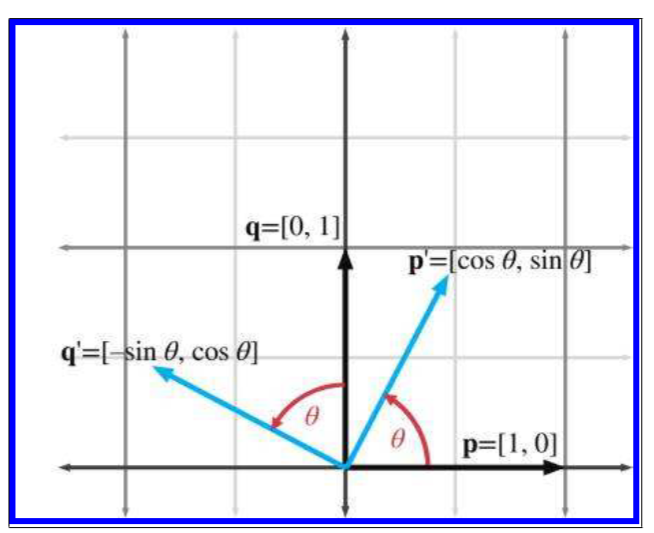
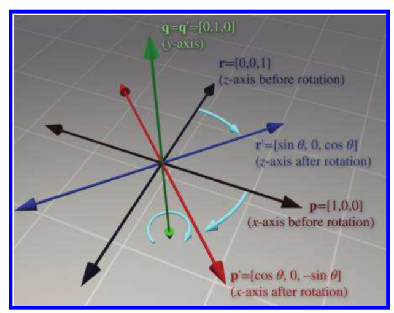
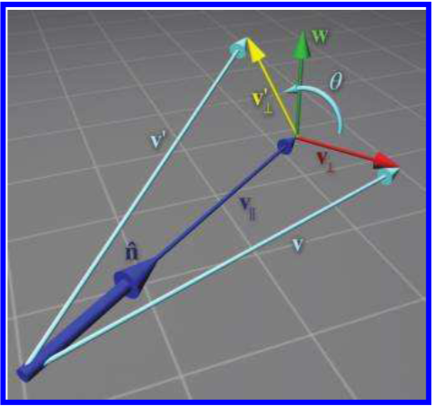
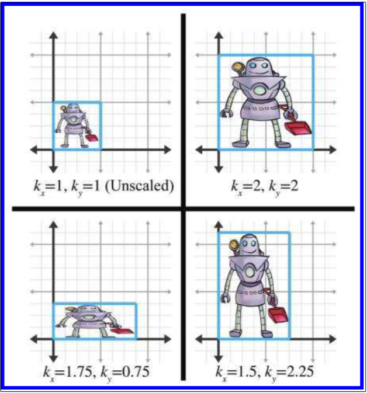
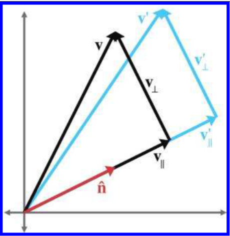
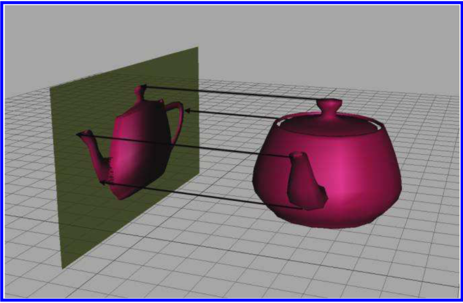
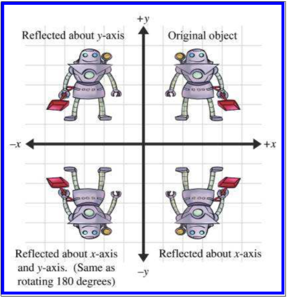
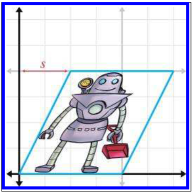
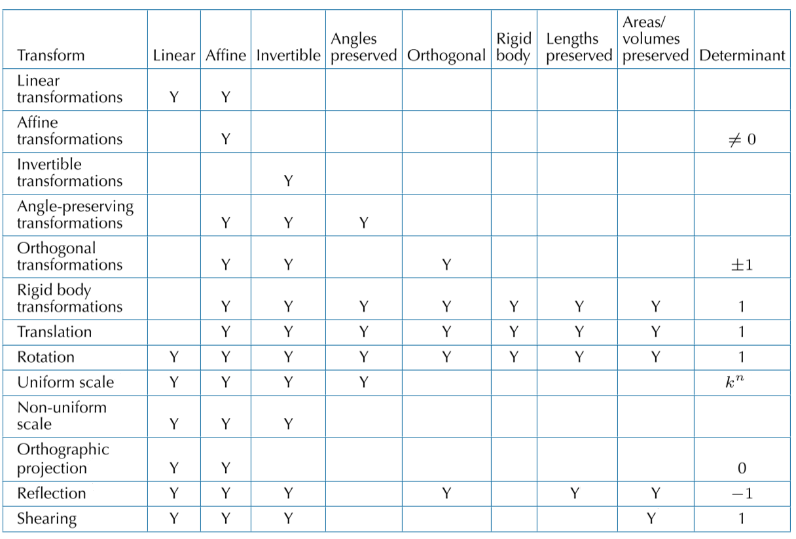

《3D数学基础：图形和游戏开发》第五章笔记

5.1-5.5 介绍了五种线性变换，旋转，缩放，正交投影，反射，切变。
5.6 介绍了线性变化的结合。
5.7 介绍了变换的种类，包括线性变换和仿射变换。还有各种其他的分类方式，如可逆变换，保角变换等。

<!--more-->

# Chapter 5 Matrices and Linear Transformations

这一章将主要介绍使用$3\times 3$矩阵进行三维孔径啊下的线性变化（Linear Transformations）。线性变化是不包含位移的，包含了位移的变换称为仿射变换（Affine Transformation）。对于一个$N$维的方阵，是不可能你表达出$N$维的仿射变换的。

这一章中推到出变换矩阵的方法还是通过先计算出基础向量经过变换后的向量，然后将变换后向量依次填入矩阵的每一行，形成变换矩阵。

## Rotation

### Rotation in 2D

在二维空间中的旋转是基于一个点的。对于基于原点的二维旋转，只有一个变量即旋转角度$\theta$，而且通常而言顺时针旋转为正方向，逆时针旋转为反方向。

旋转矩阵如下：

$$
\mathbf{R}(\theta)=\begin{bmatrix}
\cos\theta & \sin\theta \\\\
-\sin\theta & \cos\theta \\\\
\end{bmatrix}
$$

其中的每一行都是变换后的标准向量，即将$(1,0)$，变为了$(\cos\theta , \sin\theta)$，将$(0,1)$变成了$( -\sin\theta , \cos\theta )$，如下图所示：

### 3D Rotation about Cardinal Axes

这里讨论的三维旋转矩阵也同样是基于原点旋转的，但在三维空间中，可以围绕不同的轴进行旋转，这里首先给出基于三个向量轴的旋转：

绕着X轴的计算矩阵如下：
$$
R_x(\theta)=\begin{bmatrix}
1&0          &0\\\\
0& \cos\theta&\sin\theta\\\\
0& -sin\theta&\cos\theta\\\\
\end{bmatrix}
$$

绕着Y轴的计算矩阵如下：

$$
R_y(\theta)=\begin{bmatrix}
\cos\theta&0 &-\sin\theta\\\\
0& 1&0\\\\
\sin\theta&0 &\cos\theta\\\\
\end{bmatrix}
$$

绕着Z轴的计算矩阵如下：

$$
R_z(\theta)=\begin{bmatrix}
\cos\theta& \sin\theta&0\\\\    
-\sin\theta& \cos\theta&0\\\\
0&0 &1\\\\    
\end{bmatrix}
$$

三个矩阵的推导同样是通过基本向量的变换。如果某个轴作为旋转轴，那么这个轴在旋转过程中是不会发生变化的，而剩下的两个轴就可以看作是一个二维空间的旋转，如下图是当旋转轴是Y轴的示意图：

### 3D Rotation about an Arbitrary Axis

向量绕着任意轴$n$(穿过原点的轴)旋转$\theta$角度的计算表达式如下：

$$
R({\hat{n},\theta})=
\begin{bmatrix}
{n_x}^2(1-\cos \theta) + \cos\theta &
n_xn_y(1-\cos \theta)+n_z\sin\theta &
n_xn_z(1-\cos \theta) -n_y\sin\theta
\\\\
n_xn_y(1-\cos \theta) -n_z\sin\theta  &
{n_y}^2(1-\cos \theta)+\cos\theta &
n_yn_z(1-\cos \theta) +n_x\sin\theta
\\\\
n_xn_z(1-\cos \theta) +n_y\sin\theta &
n_yn_z(1-\cos \theta)-n_x\sin\theta &
{n_z}^2(1-\cos \theta) +\cos \theta
\end{bmatrix}
$$

推导过程如下：

针对对于任意轴的旋转矩阵，思路同样是求基本向量在旋转后的结果。向量$\mathbf{v}$在绕任意轴$n$旋转$\theta$角度后变为$\mathbf{v^{'}}$，表达式为：

$$
\mathbf{v^{'}}=\mathbf{v}\mathbf{R}(\hat{\mathbf{n}},\theta)
$$

求解过程如下：

1. 为了方便计算，将向量$v$拆成两部分$v_{\parallel}$和$v_{\perp}$，分别表示平行于和垂直于旋转轴$n$的分量。在旋转过程中，平行于旋转轴$n$的分量$v_{\parallel}$是不会发生变化的，因此要求的只是旋转后的$v^{'}_{\perp}$
   整个旋转的示意图如下：
   
2. $v_{\parallel}$可以通过点积求得，即$\mathbf{ v_{\parallel}=(v\cdot\hat{n})\hat{n}}$
3. $v_{\perp}$可以通过$v$减去$v_{\parallel}$得到，即$\mathbf{v_{\perp}=v-v_{\parallel}}$
4. 图中的$w$向量是为了与向量$v_{\perp}$构成一个平面，$w$向量的长度与$v_{\perp}$相同，且垂直于$\hat{n}$和$v_{\perp}$，所以可得$\mathbf{w=\hat{n}\times v_{\perp}}$
5. 此时,$w$和$v_{\perp}$构成了一个二维平面，根据二维平面的旋转可得，$v_{\perp}^{'}=\cos \theta v_{\perp} + \sin\theta w$
6. 结合上面所有的式子，可推导出$v^{'}$的公式，即
$$
\mathbf{v^{'}=V_{\perp}^{'}+v_{\parallel}}\\\\
=\mathbf{\cos \theta v_{\perp} + \sin\theta w+(v\cdot\hat{n})\hat{n}} \\\\
=\cos\theta(v-(v\cdot\hat{n})\hat{n})+\sin\theta (\hat{n}\times v_{\perp})+(v\cdot\hat{n})\hat{n} \\\\
=\cos\theta(v-(v\cdot\hat{n})\hat{n})+\sin\theta (\hat{n}\times(v-v_{\parallel}))+(v\cdot\hat{n})\hat{n} \\\\
=\cos\theta(v-(v\cdot\hat{n})\hat{n})+\sin\theta (\hat{n}\times v-\hat{n} \times v_{\parallel})+(v\cdot\hat{n})\hat{n} \\\\
=\cos\theta(v-(v\cdot\hat{n})\hat{n})+\sin\theta (\hat{n}\times v-0)+(v\cdot\hat{n})\hat{n} \\\\
=\cos\theta(v-(v\cdot\hat{n})\hat{n})+\sin\theta (\hat{n}\times v)+(v\cdot\hat{n})\hat{n} 
$$

即最终用$\hat{n}，\theta，v$表达$v^{'}$的式子为：

$$
v^{'}=\cos\theta(v-(v\cdot\hat{n})\hat{n})+\sin\theta (\hat{n}\times v)+(v\cdot\hat{n})\hat{n}
$$

将$p=\begin{bmatrix} 1 & 0& 0\end{bmatrix}$作为$v$代数上式，得:

$$
v^{'}=p^{'}=\cos\theta({\begin{bmatrix} 1\\\\0\\\\0 \end{bmatrix}}^T-n^x{\begin{bmatrix} n^x\\\\n^y\\\\n^z \end{bmatrix}}^T)+
sin\theta {\begin{bmatrix} 0\\\\n_z\\\\-n_y \end{bmatrix}}^T+n^x{\begin{bmatrix} n^x\\\\n^y\\\\n^z \end{bmatrix}}^T
$$

其中：$\hat{n}={\begin{bmatrix} n^x\\\\n^y\\\\n^z \end{bmatrix}}^T$，且$\hat{n}\times v={\begin{bmatrix} 0\\\\n^z\\\\-n^y \end{bmatrix}}^T$

原式可继续化简：

$$
p^{'}=v^{'}=\cos\theta({\begin{bmatrix} 1\\\\0\\\\0 \end{bmatrix}}^T-n^x{\begin{bmatrix} n^x\\\\n^y\\\\n^z \end{bmatrix}}^T)+
sin\theta {\begin{bmatrix} 0\\\\n_z\\\\-n_y \end{bmatrix}}^T+n^x{\begin{bmatrix} n^x\\\\n^y\\\\n^z \end{bmatrix}}^T \\\\
={\begin{bmatrix}
\cos\theta(1-{n_x}^2)+0+{n_x}^2\\\\
\cos\theta(0-n_xn_y)+\sin\theta n_z+n_xn_y\\\\
\cos\theta(0-n_xn_z)-\sin\theta n_y +n_xn_z
\end{bmatrix}}^T \\\\
={\begin{bmatrix}
{n_x}^2(1-\cos \theta) + \cos\theta \\\\
n_xn_y(1-\cos \theta)+n_z\sin\theta \\\\
n_xn_z(1-\cos \theta) -n_y\sin\theta
\end{bmatrix}}^T
$$

使用相同的步骤，可以计算出当输入$v=q=\begin{bmatrix} 0 & 1& 0\end{bmatrix}$时，结果$q^{'}$值为：

$$
q^{'}={\begin{bmatrix}
n_xn_y(1-\cos \theta) -n_z\sin\theta  \\\\
{n_y}^2(1-\cos \theta)+\cos\theta \\\\
n_yn_z(1-\cos \theta) +n_x\sin\theta
\end{bmatrix}}^T
$$

当输入为$r=q=\begin{bmatrix} 0 & 0& 1\end{bmatrix}$，结果$r^{'}$值为：

$$
r^{'}={\begin{bmatrix}
n_xn_z(1-\cos \theta) +n_y\sin\theta  \\\\
n_yn_z(1-\cos \theta)-n_x\sin\theta \\\\
{n_z}^2(1-\cos \theta) +\cos \theta
\end{bmatrix}}^T
$$

将每个变换后的基本矩阵，即$p^{'},q^{'},r^{'}$放入变换矩阵的每一行，即为所需要求的绕着任意轴旋转的变换矩阵，即：

$$
R({\hat{n},\theta})=
\begin{bmatrix}
{n_x}^2(1-\cos \theta) + \cos\theta &
n_xn_y(1-\cos \theta)+n_z\sin\theta &
n_xn_z(1-\cos \theta) -n_y\sin\theta
\\\\
n_xn_y(1-\cos \theta) -n_z\sin\theta  &
{n_y}^2(1-\cos \theta)+\cos\theta &
n_yn_z(1-\cos \theta) +n_x\sin\theta
\\\\
n_xn_z(1-\cos \theta) +n_y\sin\theta &
n_yn_z(1-\cos \theta)-n_x\sin\theta &
{n_z}^2(1-\cos \theta) +\cos \theta
\end{bmatrix}
$$

## Scale

### Scaling along the Cardinal Axes

缩放效果如下图所示：

对于基本向量而言，在进行了缩放操作后，其变为：

$$
p^{'}=k_xp=kx\begin{bmatrix}1& 0 &0\end{bmatrix}
=\begin{bmatrix} k_x&0&0\end{bmatrix}，\\\\
q^{'}=k_yq=ky\begin{bmatrix}0& 1&0\end{bmatrix}
=\begin{bmatrix} 0&k_y&0\end{bmatrix}，\\\\
r^{'}=k_zr=kz\begin{bmatrix}0& 0&1\end{bmatrix}
=\begin{bmatrix} 0&0&k_z\end{bmatrix}，\\\\
$$

将其带入缩放矩阵的每一行，可得，如果缩放的方向是基本向量的话，那么缩放矩阵为：

$$
S(k_x,k_y,k_z)=\begin{bmatrix}
k_x&0 &0 \\\\
0&k_y &0 \\\\
0&0 &k_z \\\\
\end{bmatrix}
$$

如果使用一个向量与该矩阵相乘，得

$$
\begin{bmatrix}x&y&z \end{bmatrix}
\begin{bmatrix}
k_x&0 &0 \\\\
0&k_y &0 \\\\
0&0 &k_z \\\\
\end{bmatrix} =
\begin{bmatrix}k_xx&k_yy&k_zz \end{bmatrix}
$$

如果沿着各个轴的缩放大小是一样的，则称这个缩放为均匀缩放（Uniform Scaling），否则为非均匀缩放（Nonuniform Scaling）。

### Scaling in an Arbitary Direction

向量$v$沿着任意穿过原点的轴$n$缩放得到向量$v^{'}$，示意图如下：

计算过程如下：

1. 如求沿着任意轴旋转一样，将$v$拆成两部分$v_{\parallel}$和$v_{\perp}$，其中$\mathbf{ v_{\parallel}=(v\cdot\hat{n})\hat{n}}$，$\mathbf{v_{\perp}=v-v_{\parallel}}$
2. 如果沿着轴$n$进行缩放，$v_{\parallel}$将发生相应缩放，而$v_{\perp}$不会产生任何变化，即:

$$
v_{\parallel}^{'}=kv_{\parallel}=k(v\cdot\hat{n})\hat{n} \\\\
v_{\perp}^{'}=v_{\perp}=v-v_{\parallel}=v-(v\cdot\hat{n})\hat{n}
$$

3. 因此可求得$v^{'}$：

$$
v^{'}=v_{\perp}^{'}+v_{\parallel}^{'} \\\\
=v-(v\cdot\hat{n})\hat{n} + k(v\cdot\hat{n})\hat{n} \\\\
=v+(k-1)(v\cdot\hat{n})\hat{n}
$$

如同计算绕着任意轴旋转一样，如果输入的向量$v$是基本向量$p=\begin{bmatrix}1,0,0 \end{bmatrix}$，代数上式，可求得$p^{'}$：

$$
p^{'}=p+(k-1)(p\cdot\hat{n})\hat{n} \\\\
={\begin{bmatrix}1 \\\\ 0 \\\\ 0\end{bmatrix}}^T + (k-1)n_x{\begin{bmatrix} n_x \\\\ n_y \\\\ n_z\end{bmatrix}}^T \\\\
={\begin{bmatrix}1 \\\\ 0 \\\\ 0\end{bmatrix}}^T + {\begin{bmatrix}(k-1) {n_x}^2 \\\\(k-1)n_xn_y \\\\ (k-1)n_xn_z\end{bmatrix}}^T \\\\
={\begin{bmatrix}1+(k-1) {n_x}^2\\\\ (k-1)n_xn_y \\\\ (k-1)n_xn_z\end{bmatrix}}^T
$$

使用相同的步骤，可以计算出当输入$v=q=\begin{bmatrix} 0 & 1& 0\end{bmatrix}$时，结果$q^{'}$值为：

$$
q^{'}={\begin{bmatrix}(k-1) {n_xn_y}\\\\ 1+(k-1){n_y}^2 \\\\ (k-1)n_yn_z\end{bmatrix}}^T
$$

当输入为$r=q=\begin{bmatrix} 0 & 0& 1\end{bmatrix}$，结果$r^{'}$值为：

$$
r^{'}={\begin{bmatrix}(k-1) {n_xn_z}\\\\ (k-1){n_yn_z} \\\\ 1+(k-1){n_z}^2\end{bmatrix}}^T
$$

将其放入缩放矩阵对应的行中，可得沿着任意穿过原点的轴进行缩放的矩阵为：

$$
S(\hat{n},k)=\begin{bmatrix}
1+(k-1) {n_x}^2&(k-1)n_xn_y &(k-1)n_xn_z \\\\
(k-1) {n_xn_y}& 1+(k-1){n_y}^2 & (k-1)n_yn_z \\\\
(k-1) {n_xn_z} & (k-1){n_yn_z} & 1+(k-1){n_z}^2 \\\\
\end{bmatrix}
$$

## Orthographic Projection

正射投影（Orthographic Projection）保证所有原始点和投影点的连线时平行的，如下图所示：

###  Projecting onto a Cardinal Axis or Plane

如果投影到$xy$平面上，那么即沿着$z$轴缩放到0。即将$\hat{n}=\begin{bmatrix}0&0&1\end{bmatrix}$，$k=0$，代入

$$
S(\hat{n},k)=\begin{bmatrix}
1+(k-1) {n_x}^2&(k-1)n_xn_y &(k-1)n_xn_z \\\\
(k-1) {n_xn_y}& 1+(k-1){n_y}^2 & (k-1)n_yn_z \\\\
(k-1) {n_xn_z} & (k-1){n_yn_z} & 1+(k-1){n_z}^2 \\\\
\end{bmatrix}
$$

得
$$
P_{xy}=S(\begin{bmatrix}0&0&1\end{bmatrix},0)=\begin{bmatrix}
1 & 0 &0 \\\\
0 & 1 &0 \\\\
0 & 0 &0 \\\\
\end{bmatrix}
$$

同理，可得
$$
P_{xy}=S(\begin{bmatrix}0&1&0\end{bmatrix},0)=\begin{bmatrix}
1 & 0 &0 \\\\
0 & 0 &0 \\\\
0 & 0 &1 \\\\
\end{bmatrix}
$$
$$
P_{yz}=S(\begin{bmatrix}1&0&0\end{bmatrix},0)=\begin{bmatrix}
0 & 0 &0 \\\\
0 & 1 &0 \\\\
0 & 0 &1 \\\\
\end{bmatrix}
$$

### Projecting onto an Arbitrary Line or Plane

如果投影到任意平面上，且向量$\hat{n}$垂直于该平面。那么投影实际上是相当于沿着向量$\hat{n}$进行缩放，且缩放系数$k=0$。将其代入沿着任意角度进行缩放的矩阵，即

$$
R(\hat{n})=S(\hat{n},0)=\begin{bmatrix}
1+(0-1) {n_x}^2&(0-1)n_xn_y &(0-1)n_xn_z \\\\
(0-1) {n_xn_y}& 1+(0-1){n_y}^2 & (0-1)n_yn_z \\\\
(0-1) {n_xn_z} & (0-1){n_yn_z} & 1+(0-1){n_z}^2 \\\\
\end{bmatrix} \\\\
=\begin{bmatrix}
1-{n_x}^2&-n_xn_y &-n_xn_z \\\\
-{n_xn_y}& 1-{n_y}^2 & -n_yn_z \\\\
-{n_xn_z} &-{n_yn_z} & 1-{n_z}^2 \\\\
\end{bmatrix} 
$$

## Reflection

反射（Reflection）也称为镜像（Mirroring）是针对一个轴（2D空间）或者一个平面（3D空间）进行反转的操作。

反射操作如下图所示：

针对于一个平面或一个轴的反射变换，相当于沿着垂直该平面或轴的向量$\hat{n}$进行$k$大小为$-1$的缩放操作。即：

$$
R(\hat{n})=S(\hat{n},0)=\begin{bmatrix}
1+(-1-1) {n_x}^2&(-1-1)n_xn_y &(-1-1)n_xn_z \\\\
(-1-1) {n_xn_y}& 1+(-1-1){n_y}^2 & (-1-1)n_yn_z \\\\
(-1-1) {n_xn_z} & (-1-1){n_yn_z} & 1+(-1-1){n_z}^2 \\\\
\end{bmatrix} \\\\
=\begin{bmatrix}
1-2{n_x}^2&-2n_xn_y &-2n_xn_z \\\\
-2{n_xn_y}& 1-2{n_y}^2 & -2n_yn_z \\\\
-2{n_xn_z} &-2{n_yn_z} & 1-2{n_z}^2 \\\\
\end{bmatrix} 
$$

## Shearing

切变（Shearing）是歪斜（skews）坐标轴的变化，因此有时也会被称为斜变变换（skew transform）。基本思想是把一个方向轴上的元素乘以系数后加到另一个方向轴上。

如$x^{'}=x+sy$，对应的矩阵为：

$$
H_x(s)=\begin{bmatrix}
    1 & 0 \\\\
    s & 1
\end{bmatrix}
$$

矩阵中的$s$即对应计算过程$0+s*1$。从矩阵可以看出基本向量$\begin{bmatrix}1 &0 \end{bmatrix}$并没有发生变化，基本向量$\begin{bmatrix}0 &1 \end{bmatrix}$变为了$\begin{bmatrix}s &1 \end{bmatrix}$。

$H_x(s)$表示$x$被$y$轴切变，即$x$轴的值受$y$轴的影响
如下图中所示，：

同理，如果在三维坐标中，$H_{xy}$表示$xy$平面被$z$轴坐标影响。所有的三维空间切变矩阵如下所示：

$$
\mathbf{H_{xy}}(s, t)=\begin{bmatrix}
1 & 0 & 0 \\\\
0 & 1 & 0 \\\\
s & t & 1
\end{bmatrix}
$$
$$
\mathbf{H_{xz}}(s, t)=\begin{bmatrix}
1 & 0 & 0 \\\\
s & 1 & t \\\\
0 & 0 & 1
\end{bmatrix}
$$
$$
\mathbf{H_{yz}}(s, t)=\begin{bmatrix}
1 & s & t \\\\
0 & 1 & 0 \\\\
0 & 0 & 1
\end{bmatrix}
$$

切边是一个比较少用到的变换，因为使用切变变换和缩放变换（无论是均匀还是非均匀）后的图形完全可以通过旋转和非均匀缩放来达成。

## Combining Transformations

因为几个变换矩阵的大小是相同的，所以多个变换矩阵可以被结合在一起。如在物体坐标系中的物体，需要转换到世界坐标系中，此时需要用矩阵$\mathbf{M_{obj\rightarrow wld}}$，将物体从世界坐标系中转换到摄像机坐标系，需要用到矩阵$\mathbf{M_{wld\rightarrow cam}}$

则将物体从物体坐标系转换到摄像机坐标系的表达式如下：

$$
\begin{aligned}
\mathbf{P_{\mathrm{cam}}} &=\mathbf{p_{\mathrm{wld}}} \mathbf{M_{\mathrm{wld} \rightarrow \mathrm{cam}}}\\\\
&=\left(\mathbf{p_{\mathrm{obj}}} \mathbf{M_{\mathrm{obj} \rightarrow \mathrm{wld}}}\right) \mathbf{M_{\mathrm{wld} \rightarrow \mathrm{cam}}}
\end{aligned}
$$

注意矩阵的相乘是满足结合律的，即上式可以进一步简化为：

$$
\begin{aligned}
\mathbf{P_{\mathrm{cam}}} &=\left(\mathbf{p_{\mathrm{obj}}} \mathbf{M_{\mathrm{obj} \rightarrow \mathrm{wld}}}\right) \mathbf{M_{\mathrm{wld} \rightarrow \mathrm{cam}}} \\\\
&=\mathbf{p_{\mathrm{obj}}}\left(\mathbf{M_{\mathrm{obj} \rightarrow \mathrm{wld}}} \mathbf{M_{\mathrm{wld} \rightarrow \mathrm{cam}}}\right)\\\\
&=\mathbf{p_{\mathrm{cam}}}=\mathbf{p_{\mathrm{obj}} }\mathbf{M_{\mathrm{obj} \rightarrow \mathrm{cam}}}
\end{aligned} \\\\
$$

## Classes of Transformations

首先需要说明映射和函数的关系。映射指的是输入按照一定的规则变成特定的输出，而函数是用来描述映射关系的。

如将$F$将$a$映射至$b$，可以表示为$F(a)=b$

### Linear Transformations

如果$F(a)$是线性变化，那么$F(a)$满足以下特性：

$$\begin{aligned}
F(\mathbf{a}+\mathbf{b}) &=F(\mathbf{a})+F(\mathbf{b})
\\\\
F(k \mathbf{a}) &=k F(\mathbf{a})
\end{aligned}$$

线性变换还有两个重要推论：
1. 如果满足，$F(a)=\mathbf{aM}$，其中$\mathbf{M}$是一个方阵。那么$F(a)$是线性变换。
   
   证明如下：
   $$
   F(\mathbf{a}+\mathbf{b})=(\mathbf{a}+\mathbf{b}) \mathbf{M}=\mathbf{a} \mathbf{M}+\mathbf{b} \mathbf{M}=F(\mathbf{a})+F(\mathbf{b})\\\\
   \text{且，}\\\\
   F(k \mathbf{a})=(k \mathbf{a}) \mathbf{M}=k(\mathbf{a} \mathbf{M})=k F(\mathbf{a})
   $$

   即满足线性变换的定义
2. 对于一个线性变换而言，如果输入是零向量，那么输出必然是零向量。
   证明如下：
   如果$F(0)=a$,
   那么$F(K0)=F(0)=a$，且$KF(0)=Ka$
   如果$a\neq 0$，则$F(k0)\neq KF(0)$，即不满足线性代数的性质二。

> 在本章的5.1-5.5节所有描述的变换都可以通过一个矩阵完成，所以它们都是线性变换。

### Affine Transformations

仿射变换（Affine Transformation）是在线性变换后加上位移变换，因此仿射变换是线性变换的超集，任何的线性变换都是仿射变换（只不过后面的位移为零）。

任何形式为$\mathbf{v'=vM+b}$的变换都是仿射变换。

### Invertible Transformations

如果一个变换是可逆的，即存在一个相反的变换可以重置之前的变换，表达式如下：

$$
F^{-1}(F(\mathbf{a}))=F\left(F^{-1}(\mathbf{a})\right)=\mathbf{a}
$$

因为位移操作必然是可逆的，所以仿射变换是否可逆的关键在于线性变换是否可逆。主要的线性变换，除了投影外都是可逆的，因为投影变换将一个维度的数值变为了零，即一个维度的数据消失了。

找出一个变换的相反操作，相当于找出这个变换矩阵的逆矩阵。如果一个矩阵没有逆矩阵，称这个矩阵为奇异矩阵（或退化矩阵，singular matrix）。一个奇异矩阵的行列式为零。

在非奇异矩阵中（存在逆矩阵的矩阵），当且仅当输入为零向量时，输出才会是零向量。而在奇异矩阵中，有一系列的输入向量都会导致输出为零向量，这些输入向量称为矩阵的零空间（Null Space）。在投影矩阵中，垂直于投影平面的所有向量都在零空间中，因为这些向量在投影后会变成一个点。

对于一个方阵，如果它的基础向量（因为本书用的是行向量，所以相当于每一行，如果用的是列向量则相当于每一列）是线性相关的，则这个矩阵是歧义矩阵，即不存在逆矩阵。

### Angle-Preserving Transformations

如果一个变换是保角变换（Angle-Preserving Transformation），那么在变换前后图形中的两个向量的夹角是不会发生变换的。

只有位移，旋转，和均匀缩放是保角变换。对于反射变换，虽然角度的绝对值不会发生改变，但是角度的方向发生了改变，因此也不能算是保角变换。

所有的保角变换都是仿射变换且都是可逆的。

### Orthogonal Transformations

正交变换（Orthogonal Transformation）可以很容易的求出反变换，所以被使用的频率很高。

正交变换保证变换前后，图像的长度，角度的绝对值，面积和体积不会发生改变。

只有位移，旋转和反射是正交变换。

所有的正交变换都是可逆的，且是仿射变换。

### Rigid Body Transformations

刚体变换（Rigidbody Transformation，proper transformations）只改变图像的位置和角度，但不会改变其形状。位移和旋转是唯二的刚体变换，反射变换因为改变了图形的角度方向所以不是刚体变换。

刚体变换几乎是最严格的变换。所有的刚体变换，都是正交的，保角的，可逆的和仿射的。

刚体变换的行列式大小为1。

### Summary of Types of Transformations

所有变换的总截图如下，Y表示必然满足，空白处表示不一定满足。



引用：

1. *3D Math Primer for Graphics and Game Development* 2nd 2011 



***