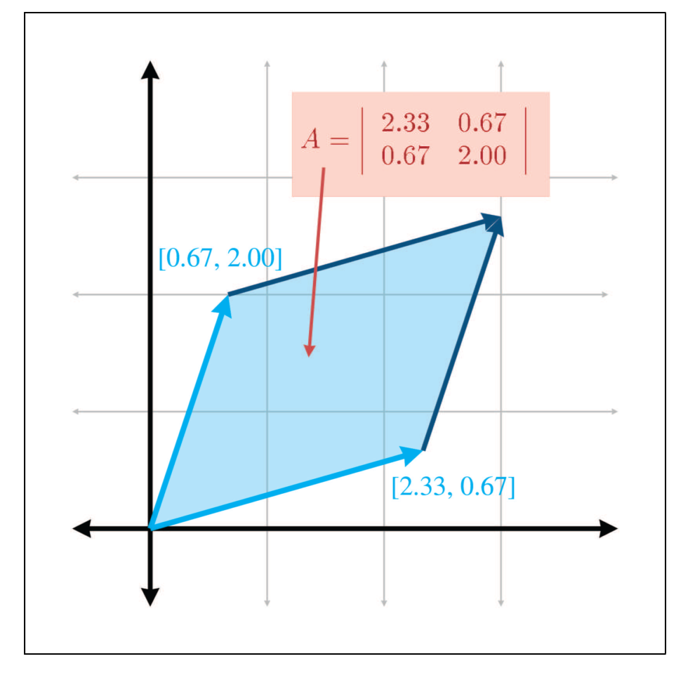
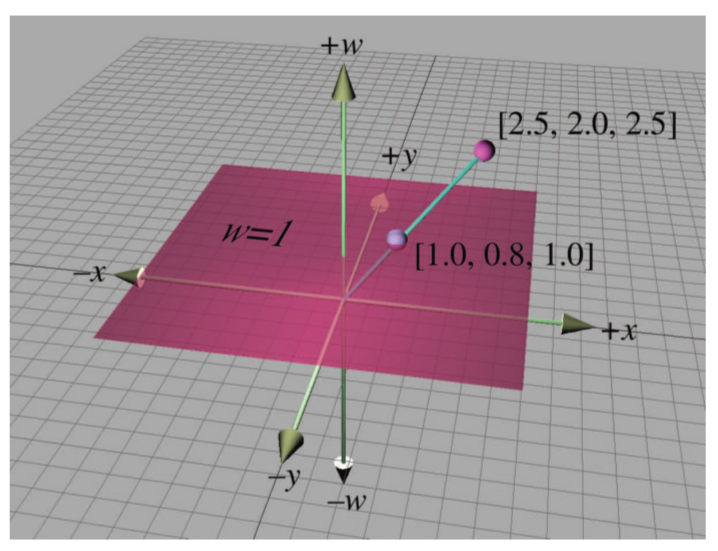
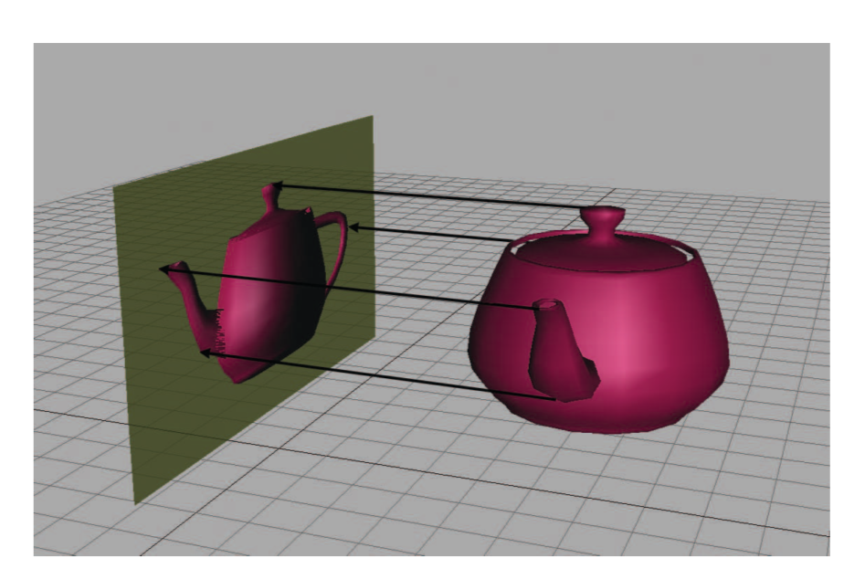
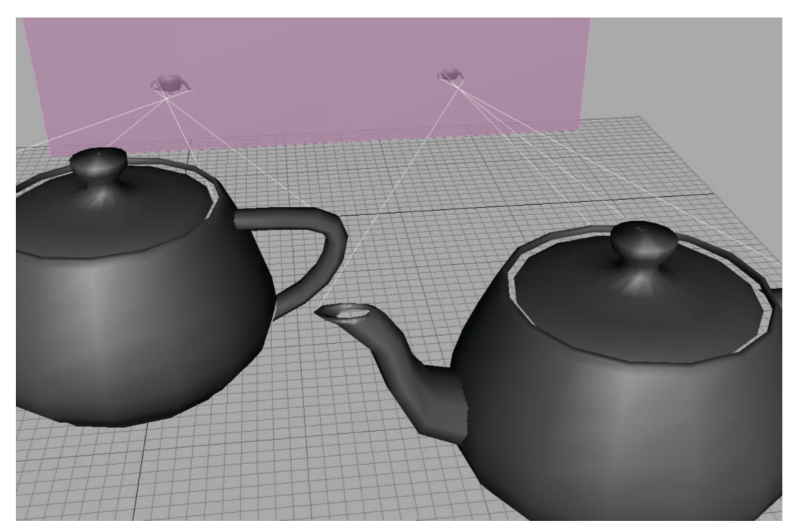
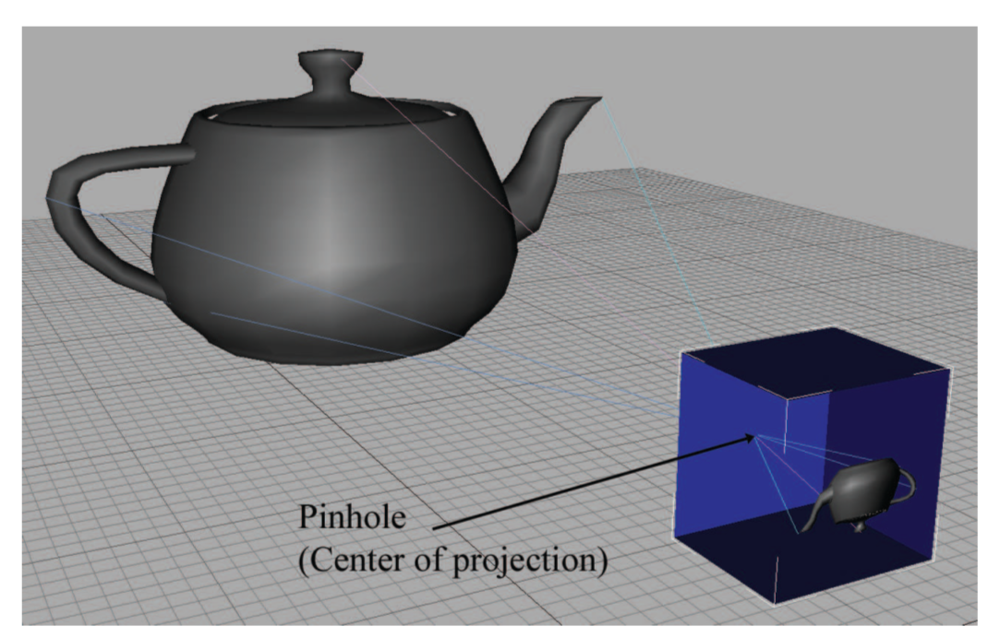
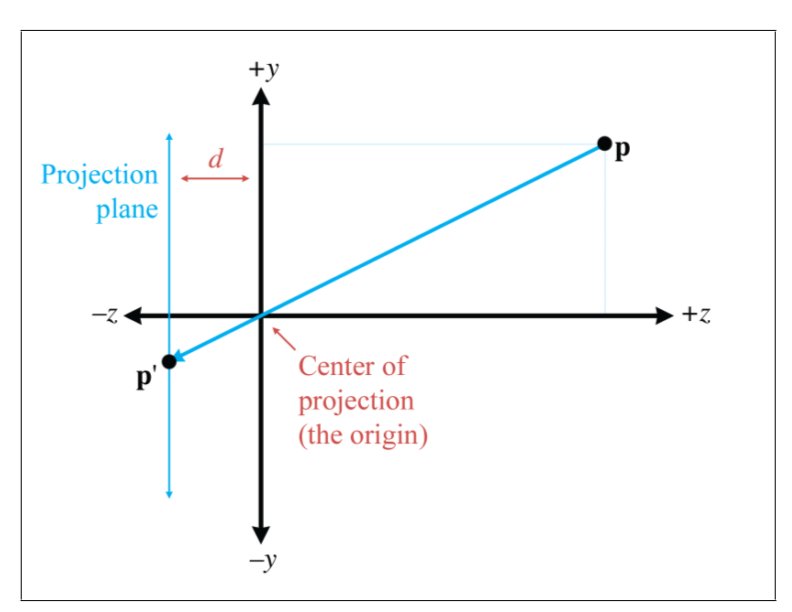
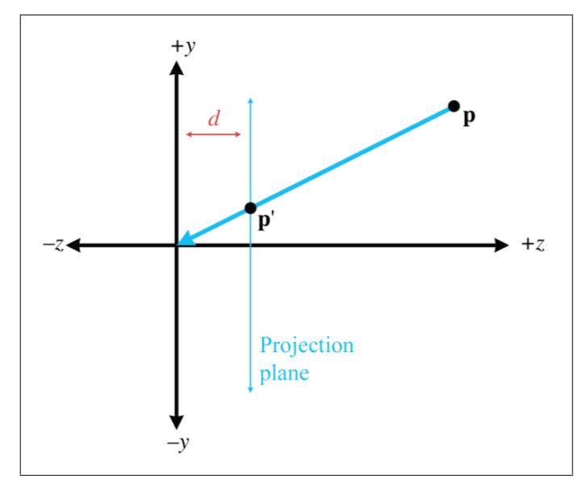

《3D数学基础：图形和游戏开发》第六章笔记

6.1 介绍了矩阵的行列式

6.2 介绍了矩阵的逆

6.3 介绍了正交矩阵

6.4 介绍了齐次矩阵

6.5 介绍了齐次矩阵与透视投影的关系

<!--more-->

# Chapter 6 More on Matrices

在第四章中介绍了矩阵的基本数学性质和几何意义。

在第五章中着重介绍了矩阵的几何意义，列举了一系列矩阵能表示的各种图形变换。

在这一章中将扩展前两章的知识，介绍矩阵的另一些数学特性和深入讨论图形变换。

## Determinant of a Matrix

对于方阵而言，有一个重要的标量成为矩阵的行列式（Determinant of the matrix）。

### Determinants of  $2\times 2$ and $3\times 3$  matrices

方阵$\mathbf{M}$的行列式写为$|\mathbf{M}|$或者写为"$def \mathbf{M}$"，非方阵的矩阵并没有行列式。

二维行列式的计算过程如下：

$$|\mathbf{M}|=\left|\begin{array}{ll}
m_{11} & m_{12} \\\\
m_{21} & m_{22}
\end{array}\right|=m_{11} m_{22}-m_{12} m_{21}$$

三维行列式的计算过程如下：

$$
\begin{aligned}
\left|\begin{array}{lll}
m_{11} & m_{12} & m_{13} \\
m_{21} & m_{22} & m_{23} \\
m_{31} & m_{32} & m_{33}
\end{array}\right|\\
&=\begin{array}{l}
&m_{11} m_{22} m_{33}+m_{12} m_{23} m_{31}+m_{13} m_{21} m_{32} \\
&-m_{13} m_{22} m_{31}-m_{12} m_{21} m_{33}-m_{11} m_{23} m_{32}
\end{array} \\\\
&=\begin{array}{l}
& m_{11}\left(m_{22} m_{33}-m_{23} m_{32}\right) \\
&+m_{12}\left(m_{23} m_{31}-m_{21} m_{33}\right) \\
&+m_{13}\left(m_{21} m_{32}-m_{22} m_{31}\right)
\end{array}
\end{aligned}
$$

### Minros and Cofactors

余子式（Minors）和代数余子式（Cofactors）之后求任意维度的行列式时会用到。

对于矩阵$\mathbf{M}$来，$\mathbf{M}^{\{ij\}}$表示删除了第$i$行和第$j$的子矩阵，而子矩阵的行列式称为余子式。如下所示：

$$\mathbf{M}=\left[\begin{array}{ccc}
-4 & -3 & 3 \\\\
0 & 2 & -2 \\\\
1 & 4 & -1
\end{array}\right] \quad \Longrightarrow \quad M^{\{12\}}=\left|\begin{array}{cc}
0 & -2 \\\\
1 & -1
\end{array}\right|=2$$

而代数余子式，是为余子式再加上一个系数，该系数由子矩阵所删除的行列决定，即

### Determinants of Arbitary $n\times n$ Matrices

任意$n\times n$矩阵的行列式计算过程如下：

1. 任意选取一行或一列
2. 对这行或这列中的每一个元素，将它和它所在行列的代数余子式相乘。
3. 将第二步中的所有结果累加

即：

如果一个三维矩阵通过上述方法计算：

$$\begin{aligned}
\left|\begin{array}{lll}
m_{11} & m_{12} & m_{13} \\
m_{21} & m_{22} & m_{23}
\end{array}\right|=m_{11}\left|\begin{array}{cc}
m_{22} & m_{23} \\
m_{31} & m_{32} & m_{33}
\end{array}\right| &-m_{12}\left|\begin{array}{cc}
m_{21} & m_{23} \\
m_{31} & m_{33}
\end{array}\right| \\
&+m_{13}\left|\begin{array}{cc}
m_{21} & m_{22} \\
m_{31} & m_{32}
\end{array}\right|
\end{aligned}$$

以下为行列式的一些重要特性：

1. 如果矩阵是单位矩阵，那么行列式为1
   $$|\mathbf{I}|=1$$
   
2. 矩阵乘积的行列式等于矩阵行列式的乘积
   $$|\mathbf{A B}|=|\mathbf{A} \| \mathbf{B}|$$
   
3. 矩阵转置的行列式等于矩阵的行列式
   $$\left|\mathbf{M}^{\mathrm{T}}\right|=|\mathbf{M}|$$
   
4. 有任意行或列全为0，则该矩阵行列式为0

   $$\left|\begin{array}{cccc}
   ? & ? & \cdots & ? \\
   ? & ? & \cdots & ? \\
   \vdots & \vdots & & \vdots \\
   0 & 0 & \cdots & 0 \\
   \vdots & \vdots & & \vdots \\
   \vdots & ? & \cdots & ?
   \end{array}\right|=\left|\begin{array}{cccccc}
   ? & ? & \cdots & 0 & \cdots & ? \\
   ? & ? & \cdots & 0 & \cdots & ? \\
   \vdots & \vdots & & \vdots & & \vdots \\
   ? & ? & \cdots & 0 & \cdots & ?
   \end{array}\right|=0$$

5. 交换矩阵的任意两行或两列，行列式取反
   $$\left|\begin{array}{cccc}
   m_{11} & m_{12} & \cdots & m_{1 n} \\
   m_{21} & m_{22} & \cdots & m_{2 n} \\
   \vdots & \vdots & & \vdots \\
   m_{i 1} & m_{i 2} & \cdots & m_{i n} \\
   \vdots & \vdots & & \vdots \\
   m_{j 1} & m_{j 2} & \cdots & m_{j n} \\
   \vdots & \vdots & & \vdots \\
   m_{n 1} & m_{n 2} & \cdots & m_{n n}
   \end{array}\right|=-\left|\begin{array}{cccc}
   m_{11} & m_{12} & \cdots & m_{1 n} \\
   m_{21} & m_{22} & \cdots & m_{2 n} \\
   \vdots & \vdots & & \vdots \\
   m_{j 1} & m_{j 2} & \cdots & m_{j n} \\
   \vdots & \vdots & & \vdots \\
   m_{i 1} & m_{i 2} & \cdots & m_{i n} \\
   \vdots & \vdots & & \vdots \\
   m_{n 1} & m_{n 2} & \cdots & m_{n n}
   \end{array}\right|$$

6. 将矩阵的一行或一列乘以系数后加到零一行或列上不改变行列式的值（因此切变的行列式为1）

   $$\left|\begin{array}{cccc}
   m_{11} & m_{12} & \cdots & m_{1 n} \\
   m_{21} & m_{22} & \cdots & m_{2 n} \\
   \vdots & \vdots & & \vdots \\
   m_{i 1} & m_{i 2} & \cdots & m_{i n} \\
   \vdots & \vdots & & \vdots \\
   m_{j 1} & m_{j 2} & \cdots & m_{j n} \\
   \vdots & \vdots & & \vdots \\
   m_{n 1} & m_{n 2} & \cdots & m_{n n}
   \end{array}\right|=\left|\begin{array}{cccc}
   m_{11} & m_{12} & \cdots & m_{1 n} \\
   m_{21} & m_{22} & \cdots & m_{2 n} \\
   \vdots & \vdots & & \vdots \\
   m_{i 1}+k m_{j 1} & m_{i 2}+k m_{j 2} & \cdots & m_{i n}+k m_{j n} \\
   \vdots & \vdots & & \vdots \\
   m_{j 1} & m_{j 2} & \cdots & m_{j n} \\
   \vdots & \vdots & & \vdots \\
   m_{n 1} & m_{n 2} & \cdots & m_{n n}
   \end{array}\right|$$

### Geometric Interpretation of Determinant

在2D中，行列式实际上是表达了两个向量（每一行表示一个向量）所构成的平行四边形的有向面积，如：

同理，在3D中即表示由三条向量构成的平行六面体体积。

行列式的大小表示了一个变换是否改变了多个向量所构成物体的面积或体积，行列式的正负表示了变换是否存在反转，如果行列式为0，那么说明这个变换存在投影。

## Inverse of a Matrix

矩阵$\mathbf{M}$的逆矩阵为$\mathbf{M^{-1}}$，矩阵与逆矩阵的乘积为单位矩阵，即：

$$\mathbf{M}\left(\mathbf{M}^{-1}\right)=\mathbf{M}^{-1} \mathbf{M}=\mathbf{I}$$

并不是所有的矩阵都有逆矩阵，如零矩阵无论与哪个矩阵相乘都不会成为单位矩阵。如果一个矩阵有逆矩阵，就称该矩阵为可逆矩阵或非奇异矩阵（Invertible or nonsingular）。

对于可逆矩阵有如下性质：

1. 对于任何可逆矩阵，当前仅当$\mathbf{v=0}$时有$\mathbf{vM=0}$。

2. 任何可逆矩阵的行和列都是线性不相关的。
   
3. 可逆矩阵的行列式不为0。因此检查一个矩阵的行列式是否为零是最通用且最快的检查矩阵是否可逆的方法。

### The Classical Adjoint

伴随矩阵（Classical Adjoint）是计算逆矩阵的方法，将矩阵$\mathbf{M}$的伴随矩阵称为“adj $\mathbf{M}$”。

伴随矩阵是原矩阵所有代数余子式构成的矩阵的转置。如下以一个$3\times 3$矩阵作为例子：

$$\mathbf{M}=\left[\begin{array}{ccc}
-4 & -3 & 3 \\
0 & 2 & -2 \\
1 & 4 & -1
\end{array}\right]$$

要求伴随矩阵，首先要求出所有的代数余子式，即：

$$\begin{aligned}
&C^{\{11\}}=+\left|\begin{array}{cc}
2 & -2 \\
4 & -1
\end{array}\right|=6, \quad C^{\{12\}}=-\left|\begin{array}{cc}
0 & -2 \\
1 & -1
\end{array}\right|=-2, \quad C^{\{13\}}=+\left|\begin{array}{cc}
0 & 2 \\
1 & 4
\end{array}\right|=-2\\
&C^{\{21\}}=-\left|\begin{array}{cc}
-3 & 3 \\
4 & -1
\end{array}\right|=9, \quad C^{\{22\}}=+\left|\begin{array}{cc}
-4 & 3 \\
1 & -1
\end{array}\right|=1, \quad C^{\{23\}}=-\left|\begin{array}{cc}
-4 & -3 \\
1 & 4
\end{array}\right|=13\\
&C^{\{31\}}=+\left|\begin{array}{cc}
-3 & 3 \\
2 & -2
\end{array}\right|=0, \quad C^{\{32\}}=-\left|\begin{array}{cc}
-4 & 3 \\
0 & -2
\end{array}\right|=-8, \quad C^{\{33\}}=+\left|\begin{array}{cc}
-4 & -3 \\
0 & 2
\end{array}\right|=-8
\end{aligned}$$

矩阵的伴随矩阵如下：

$$\begin{aligned}
\operatorname{adj} \mathbf{M} &=\left[\begin{array}{ccc}
C^{\{11\}} & C^{\{12\}} & C^{\{13\}} \\
C^{\{21\}} & C^{\{22\}} & C^{\{23\}} \\
C^{\{31\}} & C^{\{32\}} & C^{\{33\}}
\end{array}\right]^{\mathrm{T}} \\
&=\left[\begin{array}{ccc}
6 & -2 & -2 \\
9 & 1 & 13 \\
0 & -8 & -8
\end{array}\right]^{\mathrm{T}}=\left[\begin{array}{ccc}
6 & 9 & 0 \\
-2 & 1 & -8 \\
-2 & 13 & -8
\end{array}\right]
\end{aligned}$$

### Matrix Inverse-Official Linear Algebra Rules

用矩阵的伴随矩阵除以矩阵的行列式，即为矩阵的逆矩阵。因为计算逆矩阵时要除以矩阵的行列式，所以行列式为0的矩阵是不存在逆矩阵的。公式如下：

$$\mathbf{M}^{-1}=\frac{\operatorname{adj} \mathbf{M}}{|\mathbf{M}|}$$

除了用伴随矩阵的方法来计算逆矩阵，还有如高斯消除（Gaussian elimination）等其他方法。高斯消除法的运算量会更小，但针对图形学最常用的$3\times 3$和$4 \times 4$大小的矩阵，用伴随矩阵的方法就已经足够。

逆矩阵有如下性质：

1. 逆矩阵的逆矩阵等于原矩阵

   $$\left(\mathbf{M}^{-1}\right)^{-1}=\mathbf{M}$$

2. 单位矩阵的逆矩阵为本身。

   $$\mathbf{I^{-1}=I}$$

   * 单位矩阵并不是唯一的逆矩阵为本身的矩阵，反射矩阵和旋转180°的矩阵通用也满足。

3. 转置的逆矩阵等于逆矩阵的转置

   $$\left(\mathbf{M}^{\mathrm{T}}\right)^{-1}=\left(\mathbf{M}^{-1}\right)^{\mathrm{T}}$$

4. 乘积的逆矩阵等于相反顺序的逆矩阵的乘积

   $$(\mathbf{A B})^{-1}=\mathbf{B}^{-1} \mathbf{A}^{-1}$$

5. 逆矩阵的行列式等于原矩阵行列式的倒数

   $$\left|\mathbf{M}^{-1}\right|=1 /|\mathbf{M}|$$

### Matrix Inverse-Geometric Interpretation

逆矩阵的几何意义即是相反的变换，相当于一个变换的undo。

$$(\mathbf{v M}) \mathbf{M}^{-1}=\mathbf{v}\left(\mathbf{M M}^{-1}\right)=\mathbf{v} \mathbf{I}=\mathbf{v}$$

## Orthogonal Matrices

### Orthogonal Matrices-Official Linear Algebra Rules

一个方阵当且仅当它和它的转置乘积为单位矩阵时，这个矩阵为正交矩阵（Orthogonal Matrix）：

$$\mathbf{M} \text { is orthogonal } \Longleftrightarrow \quad \mathbf{M M}^{\mathrm{T}}=\mathbf{I}$$

同时因为$\mathbf{M}^{-1} \mathbf{M}=\mathbf{I}$，所以正交矩阵还满足：

$$\mathbf{M} \text { is orthogonal } \Longleftrightarrow \mathbf{M}^{\mathrm{T}}=\mathbf{M}^{-1}$$

如果知道一个矩阵是正交的（如旋转和反射变换），那么可以很快的通过求其转置矩阵来获得逆矩阵。

### Orthogonal Matrices-Geometric Interpretation

正交矩阵的意义在于其逆矩阵非常容易求得（转置矩阵即为逆矩阵）。

如果一个变换仅包含位移，旋转和反射，那么它为正交矩阵。

如果一个矩阵的每一行（或每一列）构成的基本向量长度为1，且相互垂直，那么它也是正交矩阵。

证明如下：

首先根据正交矩阵的定义，矩阵与矩阵的转置乘积为单位矩阵：

假设

$$
\mathbf{M}=\left[\begin{array}{lll}
m_{11} & m_{12} & m_{13} \\
m_{21} & m_{22} & m_{23} \\
m_{31} & m_{32} & m_{33}
\end{array}\right]
$$

且$\mathbf{M}$为正交矩阵，则有

$$
\left[\begin{array}{lll}
m_{11} & m_{12} & m_{13} \\
m_{21} & m_{22} & m_{23} \\
m_{31} & m_{32} & m_{33}
\end{array}\right]\left[\begin{array}{lll}
m_{11} & m_{21} & m_{31} \\
m_{12} & m_{22} & m_{32} \\
m_{13} & m_{23} & m_{33}
\end{array}\right]=\left[\begin{array}{lll}
1 & 0 & 0 \\
0 & 1 & 0 \\
0 & 0 & 1
\end{array}\right]
$$

用$\mathbf{r_1,r_2,r_3}$代表矩阵$\mathbf{M}$的每个基本向量（每一行），即

$$\begin{aligned}
&\mathbf{r}_{1}=\left[\begin{array}{lll}
m_{11} & m_{12} & m_{13}
\end{array}\right]\\
&\mathbf{r}_{2}=\left[\begin{array}{lll}
m_{21} & m_{22} & m_{23}
\end{array}\right]\\
&\mathbf{r}_{3}=\left[\begin{array}{lll}
m_{31} & m_{32} & m_{33}
\end{array}\right]
\end{aligned}$$

$$\mathbf{M}=\left[\begin{array}{l}
-\mathbf{r}_{1}- \\
-\mathbf{r}_{2}- \\
-\mathbf{r}_{3}-
\end{array}\right]$$

可得：

$$\begin{array}{lll}
\mathbf{r}_{1} \cdot \mathbf{r}_{1}=1, & \mathbf{r}_{1} \cdot \mathbf{r}_{2}=0, & \mathbf{r}_{1} \cdot \mathbf{r}_{3}=0 \\
\mathbf{r}_{2} \cdot \mathbf{r}_{1}=0, & \mathbf{r}_{2} \cdot \mathbf{r}_{2}=1, & \mathbf{r}_{2} \cdot \mathbf{r}_{3}=0 \\
\mathbf{r}_{3} \cdot \mathbf{r}_{1}=0, & \mathbf{r}_{3} \cdot \mathbf{r}_{2}=0, & \mathbf{r}_{3} \cdot \mathbf{r}_{3}=1
\end{array}$$

即每个基本向量与自己的点乘值为1，去别的基本向量点乘值为0。即表明每个基本向量的长度为1，且与其他的基本向量相互垂直。

如果一个矩阵是正交矩阵，它的转置也必然是正交矩阵。因此无论矩阵的每一行还是每一列满足上述条件，都能证明它是正交矩阵。



在英语中有些术语会造成困扰。`orthogonal basis vectors`是描述一系列相互垂直的向量，但并没有限定它们的长度。如果它们满足长度为1，则称为`orthnormal basis verctors`。但是`orthogonal matrices`需要基本向量不仅相互垂直，而且长度为1。即`orthogonal basis vectores`不能构成`orthogonal matrices`，必须是`orthonormal basis vectores`才行。



### Orthogonalizing a Matrix

有时遇到一些矩阵因为数据的错误或者浮点误差（Floating point error）。

在这些情况下，需要通过一些变换将矩阵的基本向量变为互相垂直和长度为一。通常使用的方法为`Gram-Schmidt 正交化`。

首先将矩阵的标准向量（每一行）定义为$\mathbf{r}_{1}, \mathbf{r}_{2},$ 和 $\mathbf{r}_{3}$，并将转换后的满足相互垂直的基本向量定义为$\mathbf{r}_{1}^{\prime}, \mathbf{r}_{2}^{\prime},$ 和 $\mathbf{r}_{3}^{\prime}$。

其转换方法如下：

$$\begin{aligned}
&\mathbf{r}_{1}^{\prime} \Leftarrow \mathbf{r}_{1}\\
&\begin{array}{l}
\mathbf{r}_{2}^{\prime} \Leftarrow \mathbf{r}_{2}-\frac{\mathbf{r}_{2} \cdot \mathbf{r}_{1}^{\prime}}{\mathbf{r}_{1}^{\prime} \cdot \mathbf{r}_{1}^{\prime}} \mathbf{r}_{1}^{\prime} \\
\mathbf{r}_{3}^{\prime} \Leftarrow \mathbf{r}_{3}-\frac{\mathbf{r}_{3} \cdot \mathbf{r}_{1}^{\prime}}{\mathbf{r}_{1}^{\prime} \cdot \mathbf{r}_{1}^{\prime}} \mathbf{r}_{1}^{\prime}-\frac{\mathbf{r}_{3} \cdot \mathbf{r}_{2}^{\prime}}{\mathbf{r}_{2}^{\prime} \cdot \mathbf{r}_{2}^{\prime}} \mathbf{r}_{2}^{\prime}
\end{array}
\end{aligned}$$

其中$\mathbf{r}_{2}^{\prime}$只所以这么定义，是为了从$\mathbf{r2}$中减去平行于$\mathbf{r1}$的部分，这样剩余部分$\mathbf{r}_{2}^{\prime}$即为垂直于$\mathbf{r1}$的部分。

且根据利用点乘求向量分量的定义可得，

$$\begin{aligned}
r_{2}^{\prime} &=r_{2}-\left(r_{2} \cdot \hat{r}_{1}\right) \cdot \hat{r}_{1} \\
&=r_{2}-\left(r_{2} \cdot \frac{r_{1}^{\prime}}{\left|r_{1}\right|}\right) \cdot \frac{r_{1}^{\prime}}{\left|r_{1}\right|} \\
&=r_{2}-\frac{r_{2} \cdot r_{1}^{\prime}}{\left|r_{1}\right|^{2}} \cdot r_{1}^{\prime} \\
&=r_{2}-\frac{r_{2} \cdot r_{1}^{\prime}}{r_{1}^{\prime} \cdot r_{1}^{\prime}} \cdot r_{1}^{\prime}
\end{aligned}$$

求$\mathbf{r}_{3}^{\prime}$的过程同理。

对于$\mathbf{r}_{3}^{\prime}$还可以直接通过求得的$\mathbf{r}_{1}^{\prime}$和$\mathbf{r}_{2}^{\prime}$获得，即

$$\mathbf{r}_{3}^{\prime} \Leftarrow \mathbf{r}_{1}^{\prime} \times \mathbf{r}_{2}^{\prime}$$

在求得相互垂直的向量$\mathbf{r}_{1}^{\prime}, \mathbf{r}_{2}^{\prime},$ 和 $\mathbf{r}_{3}^{\prime}$后，通过归一化基本求得长度为1的矩阵，如下：

$$\begin{aligned}
&r_{1}^{\prime \prime}=\frac{r_{1}^{\prime}}{\left|r_{1}^{\prime}\right|}\\
&r_{2}^{\prime \prime}=\frac{r_{2}^{\prime}}{\left|r_{2}^{\prime}\right|}\\
&r_{3}^{\prime \prime}=\frac{r_{3}^{\prime}}{\left|r_{3}^{\prime}\right|}
\end{aligned}$$

还有一种方法是利用迭代来求得相互垂直的向量，称为`Nonbiased incremental 正交化`。如下：

$$\begin{aligned}
&\mathbf{r}_{1}^{\prime} \Leftarrow \mathbf{r}_{1}-k \frac{\mathbf{r}_{1} \cdot \mathbf{r}_{2}}{\mathbf{r}_{2} \cdot \mathbf{r}_{2}} \mathbf{r}_{2}-k \frac{\mathbf{r}_{1} \cdot \mathbf{r}_{3}}{\mathbf{r}_{3} \cdot \mathbf{r}_{3}} \mathbf{r}_{3}\\
&\mathbf{r}_{2}^{\prime} \Leftarrow \mathbf{r}_{2}-k \frac{\mathbf{r}_{2} \cdot \mathbf{r}_{1}}{\mathbf{r}_{1} \cdot \mathbf{r}_{1}} \mathbf{r}_{1}-k \frac{\mathbf{r}_{2} \cdot \mathbf{r}_{3}}{\mathbf{r}_{3} \cdot \mathbf{r}_{3}} \mathbf{r}_{3}\\
&\mathbf{r}_{3}^{\prime} \Leftarrow \mathbf{r}_{3}-k \frac{\mathbf{r}_{3} \cdot \mathbf{r}_{1}}{\mathbf{r}_{1} \cdot \mathbf{r}_{1}} \mathbf{r}_{1}-k \frac{\mathbf{r}_{3} \cdot \mathbf{r}_{2}}{\mathbf{r}_{2} \cdot \mathbf{r}_{2}} \mathbf{r}_{2}
\end{aligned}$$

该方法时通过选取一个适当的k，进行反复迭代获取一个很近似正交的类型。

## $4\times 4$ Homogeneous Matrices

这部分第一次提及了四维向量，称为齐次坐标（Homogeneous coordinate）。

### 4D Homogeneous Space

在四维向量中，第四个元素为$w$。

为了更好的理解物理的三维空间是如何扩展到四维空间的。先以二维空间为例，想象二维空间是存在于三维齐次空间中的一个平面，且第三个元素值为1，即$w=1$，所有在该平面上的点都可表示为$(x,y,1)$。所有不在$w=1$平面上的齐次坐标点$(x,y,w)$，都可以通过$(x/w,y/w,1)$转换到二维物理平面上。如下：

同样的，对于任何在二维平面上的点$(x,y)$都有无限多个相应的在齐次坐标中的点$(kx,ky,k)$。这些点构成一条穿越原点的直线。

当$w=0$时，除法是未定义的，所以没有相对应的在二维物理平面上的点。因此将$w=0$的坐标定义为是在无限远处的点，这些点是用来表示方向而不是位置，即$w=0$的坐标实际上是作为向量来进行处理，而$w\neq 0$的点才是作为表示位置的点。

将二维空间的概念推广到三维空间中，三维空间中的点也同样可以看作是在四维齐次空间中，只不过第四个元素值$w=1$。同样的，任意在四维齐次空间中的点，都可以通过$(x/w,y/w,z/w,1)$转换到三维空间中。当$w=0$时，坐标同样是用来表示向量而不是点。

在三维空间中引入四维齐次坐标主要有两个原因：

1. 为了计算上的便捷，因为位移需要用到四维矩阵，而将其他所有的变形都用四维矩阵表示可以方便计算。
2. 第四个参数$w$可以用于表示透视投影（perspective projection）。

### $4\times 4$ Translation Matrices

因为$n$维零向量与任何的$n\times n$矩阵相乘结果都是$n$维零向量，所以通过一个$3 \times 3$的矩阵是永远无法将一个点从原点移动出去的，即$n$维的矩阵无法在$n$维空间中表示位移。

但是可以通过一个$4 \times 4$的矩阵在三维空间中表示位移。如下所示：

$$\left[\begin{array}{llll}
x & y & z & 1
\end{array}\right]\left[\begin{array}{cccc}
1 & 0 & 0 & 0 \\
0 & 1 & 0 & 0 \\
0 & 0 & 1 & 0 \\
\Delta x & \Delta y & \Delta z & 1
\end{array}\right]=\left[\begin{array}{lllll}
x+\Delta x & y+\Delta y & z+\Delta z & 1
\end{array}\right]$$

* 注意这个变换在四维空间中，仍然是一个线性变换（具体来说是切变），但从三维空间角度来看，就是一个仿射变换，对三维向量进行了位移。

另外三维矩阵可以扩展成四维矩阵来表示普通的三维向量的变换，如下所示：

$$\begin{aligned}
&\left[\begin{array}{llll}
x & y & z & 1
\end{array}\right]\left[\begin{array}{cccc}
m_{11} & m_{12} & m_{13} & 0 \\
m_{21} & m_{22} & m_{23} & 0 \\
m_{31} & m_{32} & m_{33} & 0 \\
0 & 0 & 0 & 1
\end{array}\right]\\
&=\left[\begin{array}{llll}
x m_{11}+y m_{21}+z m_{31} & x m_{12}+y m_{22}+z m_{32} & x m_{13}+y m_{23}+z m_{33} & 1
\end{array}\right]
\end{aligned}$$

因此，如果一个三维向量需要先进行旋转变换（变换矩阵为$\mathbf{R}$），再进行位移变换（变换矩阵为$\mathbf{T}$），则矩阵及表达式如下：

$$\mathbf{R}=\left[\begin{array}{cccc}
r_{11} & r_{12} & r_{13} & 0 \\
r_{21} & r_{22} & r_{23} & 0 \\
r_{31} & r_{32} & r_{33} & 0 \\
0 & 0 & 0 & 1
\end{array}\right], \quad \mathbf{T}=\left[\begin{array}{cccc}
1 & 0 & 0 & 0 \\
0 & 1 & 0 & 0 \\
0 & 0 & 1 & 0 \\
\Delta x & \Delta y & \Delta z & 1
\end{array}\right]$$

$$\mathbf{v}^{\prime}=\mathbf{v R T}=\mathbf{v}(\mathbf{R T})=\mathbf{v M}$$

其中$\mathbf{M}$为两个变换结合的变换矩阵，表示如下：

$$\begin{aligned}
\mathbf{M}=\mathbf{R} \mathbf{T} &=\left[\begin{array}{cccc}
r_{11} & r_{12} & r_{13} & 0 \\
r_{21} & r_{22} & r_{23} & 0 \\
r_{31} & r_{32} & r_{33} & 0 \\
0 & 0 & 0 & 1
\end{array}\right]\left[\begin{array}{cccc}
1 & 0 & 0 & 0 \\
0 & 1 & 0 & 0 \\
0 & 0 & 1 & 0 \\
\Delta x & \Delta y & \Delta z & 1
\end{array}\right] \\
&=\left[\begin{array}{cccc}
r_{11} & r_{12} & r_{13} & 0 \\
r_{21} & r_{22} & r_{23} & 0 \\
r_{31} & r_{32} & r_{33} & 0 \\
\Delta x & \Delta y & \Delta z & 1
\end{array}\right]
\end{aligned}$$

可以看出，矩阵$\mathbf{M}$是将$\mathbf{R}$和$\mathbf{T}$中的变换部分和在了一起，即

$$\mathbf{M}=\left[\begin{array}{ll}
\mathbf{R} & \mathbf{0} \\
\mathbf{t} & 1
\end{array}\right]$$

另外如前所述，当一个齐次空间中的向量坐标的第四个元素$w=0$时，这个坐标表示的是位置而不是位移，如下所示，取向量的坐标为$\left[\begin{array}{llll}x & y & z & 0\end{array}\right]$，与$\mathbf{M}$相乘的结果将不包含位移信息，如：

$$\begin{array}{ll}
\left[\begin{array}{llllllll}
x & y & z & 0
\end{array}\right]\left[\begin{array}{llll}
r_{11} & r_{12} & r_{13} & 0 \\
r_{21} & r_{22} & r_{23} & 0 \\
r_{31} & r_{32} & r_{33} & 0 \\
\Delta x & \Delta y & \Delta z & 1
\end{array}\right] \\
& =\left[\begin{array}{llll}
x r_{11}+y r_{21}+z r_{31} & x r_{12}+y r_{22}+z r_{32} & x r_{13}+y r_{23}+z r_{33} & 0
\end{array}\right]
\end{array}$$

### General Affine Transformations

在四维齐次空间中，就能实现仿射变换而不仅仅是线性变换，经常使用的仿射变换包括：

1. 绕着不经过原点的任意轴旋转
2. 沿着不经过原点的任意轴缩放
3. 沿着不经过原点的任意平面反射
4. 投影至任意不包括原点的平面

这些变换的基本思路都是，先将线性变换的中心（如旋转轴，缩放轴，投影平面等）移动到原点，再进行线性变换，最后位移回原点。将位移的矩阵命名为$\mathbf{T}$，将线性变换的矩阵命名为$\mathbf{R}$，即：

$$\mathbf{T}=\left[\begin{array}{cccc}
1 & 0 & 0 & 0 \\
0 & 1 & 0 & 0 \\
0 & 0 & 1 & 0 \\
-p_{x} & -p_{y} & -p_{z} & 1
\end{array}\right]=\left[\begin{array}{cc}
\mathbf{I} & \mathbf{0} \\
-\mathbf{p} & 1
\end{array}\right]$$

$$\mathbf{R}_{4 \times 4}=\left[\begin{array}{cccc}
r_{11} & r_{12} & r_{13} & 0 \\
r_{21} & r_{22} & r_{23} & 0 \\
r_{31} & r_{32} & r_{33} & 0 \\
0 & 0 & 0 & 1
\end{array}\right]=\left[\begin{array}{cc}
\mathbf{R}_{3 \times 3} & \mathbf{0} \\
\mathbf{0} & 1
\end{array}\right]$$

$$\mathbf{T}^{-1}=\left[\begin{array}{cccc}
1 & 0 & 0 & 0 \\
0 & 1 & 0 & 0 \\
0 & 0 & 1 & 0 \\
p_{x} & p_{y} & p_{z} & 1
\end{array}\right]=\left[\begin{array}{ll}
\mathbf{I} & 0 \\
\mathbf{p} & 1
\end{array}\right]$$

按上述的，先位移再线性变换再位移回去的操作方法，实际变换过程为：

$$\begin{aligned}
T R_{4 \times 4} T^{-1} &=\left[\begin{array}{ll}
I & 0 \\
-p & 1
\end{array}\right]\left[\begin{array}{ll}
R_{3\times 3} & 0 \\
0 & 1
\end{array}\right]\left[\begin{array}{ll}
I & 0 \\
p & 1
\end{array}\right] \\
&=\left[\begin{array}{ll}
R_{3\times 3} & 0 \\
-p \left(R_{3\times 3}\right) & 1
\end{array}\right]\left[\begin{array}{ll}
I & 0 \\
p & 1
\end{array}\right] \\
&=\left[\begin{array}{ll}
R_{3 \times 3} & 0 \\
-p\left(R_{3 \times 3}\right)+p & 1
\end{array}\right]
\end{aligned}$$

## $4 \times 4$ Matrices and Perspective Projection

在第五章中提到了正交投影，正交投影是一种平行投影，每条顶点和其投影点的连线是平行的，如下：

在3D中的透视投影（Perspective projection）投影同样也是投影到二维平面上，不同的是所有的顶点与投影点的连线会相会在投影中心（Center of projection）上，且在投影平面后这些连线的延伸会在投影平面上构成一个倒转的图形，如下所示：

对于一个透视投影来说，投影平面是固定的，投影中心距离投影平面的距离也是固定的，因此物体离投影中心越近，其在投影平面上的构成的图像大小就越大，这个现象称为透视收缩（perspective forshortening）。

### A pinhole Camera

透视投影之所以在图形学中很重要，是因为它就是人类视觉系统工作的方式。人眼可以简化为是一个小孔成像系统，如下所示：

盒子上的小孔即是投影中心，盒子的后表面就是投影平面。

小口成像可以用坐标来表示，将投影看作是原点，将物体的顶点看作是$p$点，将物体在投影平面上的成像看作是$p^{\prime}$，如下图所示：

根据三角形相似定理，可得：

$$\frac{-p_{y}^{\prime}}{d}=\frac{p_{y}}{z} \quad \Longrightarrow \quad p_{y}^{\prime}=\frac{-d p_{y}}{z}$$

同理可得：

$$p_{x}^{\prime}=\frac{-d p_{x}}{z}$$

因此，整个变换可以表达为：

$$\mathbf{p}=\left[\begin{array}{lll}
x & y & z
\end{array}\right] \quad \Longrightarrow \quad \mathbf{p}^{\prime}=\left[\begin{array}{lll}
x^{\prime} & y^{\prime} & z^{\prime}
\end{array}\right]=\left[\begin{array}{ccc}
-d x / z & -d y / z & -d
\end{array}\right]$$

在计算机的实际运用中，上述结果中的负号是完全没意义的，因此可以等同于将投影平面移动到投影中心前面（这样的作法在真实物理世界中是不可行的），如下图：

则变换变为：

$$\mathbf{p}^{\prime}=\left[\begin{array}{lll}
x^{\prime} & y^{\prime} & z^{\prime}
\end{array}\right]=\left[\begin{array}{lll}
d x / z & d y / z & d]
\end{array}\right.$$

### Perspective Projection Matrices

为了将上述的$p^{\prime}$转换到四维齐次空间中，需要为$xyz$三个分量找出一个公因数作为$w$，即

$$\mathbf{p}^{\prime}=\left[\begin{array}{lll}
d x / z & d y / z & d
\end{array}\right]=\left[\begin{array}{lll}
d x / z & d y / z & d z / z
\end{array}\right]=\frac{\left[\begin{array}{lll}
x & y & z
\end{array}\right]}{z / d}$$

公因数为$z/d$，因此可以转换为齐次坐标：

$$\left[\begin{array}{llll}
x & y & z & z / d
\end{array}\right]$$

对于齐次向量$[x,y,z,1]$如果想要转换到上述的齐次坐标，需要用下列矩阵，该矩阵称为投影矩阵：

$$\left[\begin{array}{llll}
x & y & z & 1
\end{array}\right]\left[\begin{array}{llll}
1 & 0 & 0 & 0 \\
0 & 1 & 0 & 0 \\
0 & 0 & 1 & 1 / d \\
0 & 0 & 0 & 0
\end{array}\right]=\left[\begin{array}{llll}
x & y & z & z / d
\end{array}\right]$$

> 通过矩阵，求出$\left[\begin{array}{llll}
> x & y & z & z / d
> \end{array}\right]$的过程并不是透视投影，将$\left[\begin{array}{llll}
> x & y & z & z / d
> \end{array}\right]$转换为$\left[\begin{array}{llll}
> d x / z & d y / z & d & 1
> \end{array}\right]$的过程才是。

在真实运用中，投影矩阵会比这里更加复杂（同样也会称为裁剪矩阵），主要的区别在于：

1. 在远剪切平面会保证$w=1$。这样做保证了深度检测的精确性（//TODO why？）。
2. 还需要对$x，y$进行缩放来满足摄像机的视野（Field of view）要求。



引用：

1. *3D Math Primer for Graphics and Game Development* 2nd 2011 



***