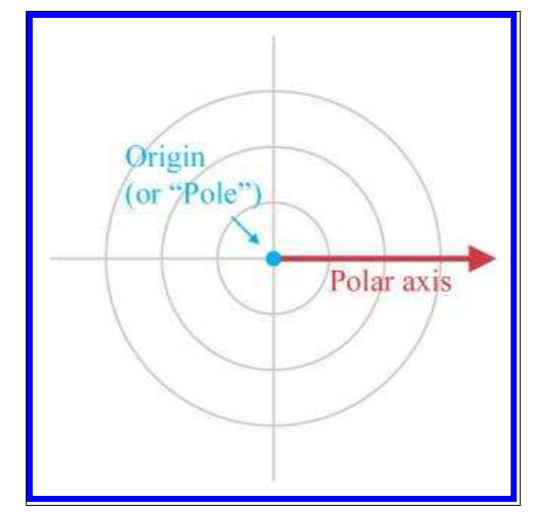
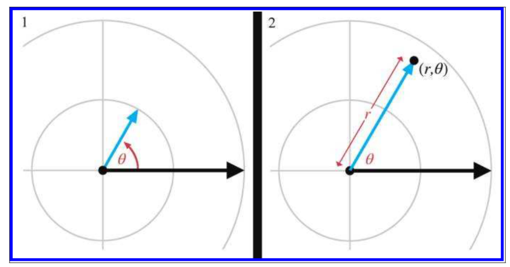
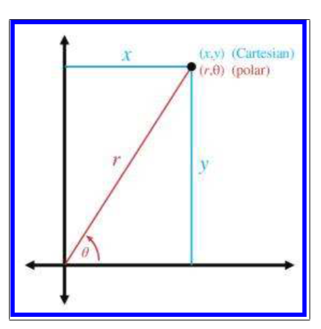
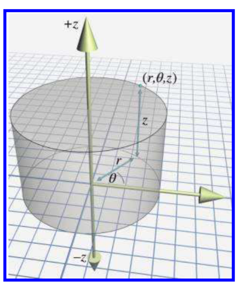
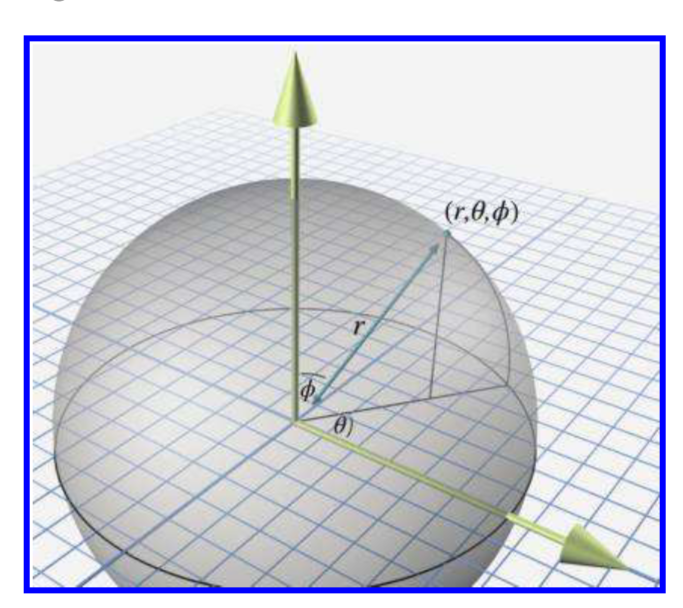
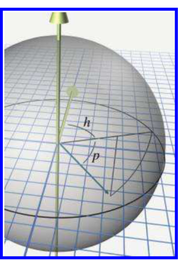
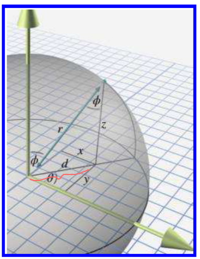

《3D数学基础：图形和游戏开发》第七章笔记

7.1节 介绍2D极坐标

7.2节 介绍哪些问题下极坐标比笛卡尔坐标更有用

7.3节 介绍极坐标如何在3D中工作，并介绍圆柱坐标系和球坐标系

7.4节 介绍在极坐标系中点和线段的关系

<!--more-->

# Chapter 7 Polar Coordinate Systems

## 2D Polar Space

### Locating Points by Using 2D Polar Coordinates

在笛卡尔坐标系下，有两个轴分别表示$x,y$，但在极坐标系下只有一个轴，成为极轴（Polar axis），表示从原点发出的一条射线。在数学中，极轴是指向右侧的，即笛卡尔坐标系下$+x$轴的方向。如下图所示：

极坐标系通过一个标量$r$距离原点的距离，一个角度$\theta$表示与初始极轴的夹角，其中角度的正方向是逆时针。通过$(r,\theta)$来表示二维极坐标中的一个点，位置为极轴先逆时针转动$\theta$角度，然后再在极轴上移动$r$，如下所示：

上图极坐标系图中的同心圆，表示$r$相同的点的集合，图中的直线则表示$\theta$相同的点的集合。

极坐标系中的单位可以是弧度，也可以是角度，只要保证使用时统一一个单位即可。在本书中使用角度。

### Aliasing

在笛卡尔坐标系下，一个点只有一个表示。但是在极坐标系下，一个点有无数个表示。如过两个表示实际上是指同一个点，那么称这两个表示互为对方的别名（Aliases）。

如果有点表示为$(r,\theta)$，那么所有它的别名可以表示为$\left((-1)^{k} r, \theta+k 180^{\circ}\right)$，其中$k$为任何整数。

极坐标中还有歧义性（singularity），即当$r=0$时，无论$\theta$取何值，结果都没有区别。

别名和歧义性本身并不会引发任何问题，只不过表达起来存在困难而已。但就如$13/26$通常表示为$1/2$一样，在极坐标系中也有一个通常的表示法，成为正则坐标（canonical coordinate）。一个正则表达是$r$为非负，且$\theta$的范围在$\left(-180^{\circ}, 180^{\circ}\right]$中。如果表达$(r,\theta)$满足以下的三个条件，那么这个表达就是正则坐标：

$$
\begin{cases}
  r \geq 0 & \\
  -180^{\circ} < \theta \leq 180 ^{\circ} & 如果极轴指向左侧，则\theta=180^{\circ} \\
  r=0 \Rightarrow \theta=0 & 
\end{cases}
$$

以下的方法可以将一个非正则坐标转换为正则坐标：

1. 当$r=0$时，$\theta =0$
2. 当$r<0$时，$r=-r, \theta=\theta +180^{\circ}$
3. 当$\theta \leq -180^{\circ}$，$\theta =\theta +k360 ^{\circ}$，$k$为第一个让$\theta > -180^{\circ}$的值
4. 当$\theta > -180^{\circ}$，$\theta =\theta -k360 ^{\circ}$，$k$为第一个让$\theta \leq -180^{\circ}$的值

### Converting between Cartesian and Polar Coordinates in 2D

二维极坐标系和笛卡尔坐标系的转换可以参考下图：

极坐标系转换为笛卡尔坐标系表达式如下：

$$x=r \cos \theta \quad y=r \sin \theta$$

笛卡尔坐标系转换为极坐标系表达式如下：

$$ r=\sqrt{x^{2}+y^{2}} \quad  \theta=\arctan (y / x)$$

其中，$\theta=\arctan (y / x)$是由$\frac{y}{x}=\frac{r\sin \theta}{r \cos \theta}$化简得来。

但$\arctan (y / x)$的表达式存在两个问题，第一是当$x=0$时，表达式的除法是未定义的。第二是$\arctan$的范围为$\left[-90^{\circ},+90^{\circ}\right]$。这个原因是$\frac{y}{x}$隐藏了一部分信息：$x和y$分别存在正负，所以一共有4种组合，但是$\frac{y}{x}$却只有两个结果。

在书中，作者定义了函数$atan2$，其定义为：

$$\operatorname{atan} 2(y, x)=\left\{\begin{array}{ll}
0, & x=0, y=0 \\
+90^{\circ}, & x=0, y>0 \\
-90^{\circ}, & x=0, y<0 \\
\arctan (y / x), & x>0 \\
\arctan (y / x)+180^{\circ}, & x<0, y \geq 0 \\
\arctan (y / x)-180^{\circ}, & x<0, y<0
\end{array}\right.$$

此时，笛卡尔转换为极坐标系可以表示为：

$$r=\sqrt{x^{2}+y^{2}} ; \quad \quad \theta=\operatorname{atan} 2(y, x)$$

## Why Would Anybody Use Polar Coordinates

人们本能上会觉得笛卡尔坐标系更熟悉，但是日常生活中实际上使用更多的是极坐标系，如“往西走50米”，这个描述就是极坐标系（方位+距离）。但是在电脑的计算中，使用较多的是笛卡尔坐标系。

在游戏和物理中，如果一个变换只关注角度和距离，那么极坐标系是比较好的选择。
另外在球表面上的计算，也通常使用极坐标系，如经度、维度，实际上就是球坐标系下的表示。

## 3D Polar Space

在2D极坐标系下，两个变量分别是距离$r$和角度$\theta$，当扩展为3D极坐标时，第三个变量可以是距离$z$，此时变为了圆柱坐标系，也可以是$\phi$，此时变为了球坐标系。

### Cylindrical Coordinates

圆柱坐标系以及点$(r,\theta,\phi)$的表示如下图所示：

可以看到，第三个变量$z$是垂直于2D极坐标平面的，当$z=0$时，即为2D极坐标平面。

### Spherical Coordinates

球坐标系在使用中更为常见。球坐标系下第三个变量仍然表示角度且命名为$\phi$。$phi$的初始方向为垂直向上，旋转正方向为绕着极轴顺时针向下，如下图所示：

$\theta$被称为方位角（Azimuth），$\phi$被称为天顶角（Zenith）。在地球仪中经度（Longitude）对应的为$\theta$，维度（Latitude）对应的为$90^{\circ}-\phi$，海拔（Altitude）对应$r$。

### Some Polar Conventions Useful in 3D Virtual Worlds

之前章节描述的是数学层面上的极坐标系，但在3D游戏的使用中，数学层面的极坐标系存在以下问题：

1. $\theta =0$的位置，对应的是$+x$方向，但希望对应的方向是$+z$方向。
2. $\phi =0$的位置，对应的是$+y$方向，但这样的话当$\phi=0$时，并不等于二维的极坐标系。而在$(r,\theta,90^{\circ})$时才等同于二维坐标系。
3. $\theta$和$\phi$不方便记忆。

为此，3D游戏中的极坐标系做了如下改变
1. 水平角$\theta$命名为$h$(heading)，且当$h=0$时指向$+z$方向。旋转正方向从Y轴正方向看为顺时针
2. 垂直角$\phi$命名为$p$(pitch)，当$p=0$时，为水平角度，旋转正方向为向下。
   
3D游戏中的极坐标系如下图所示：

### Aliasing of Spherical Coordinates

三维坐标中同样存在别名和歧义性。

1. 当r取反时，$h+k180^{\circ}$，并且$p=-p$即能获得一样的值（别名）
2. 当$r=0$时，$h$和$p$取任意值都没有区别。（歧义性）
3. $(h,p)$可以表示为$\left(h \pm 180^{\circ}, 180^{\circ}-p\right)$（别名）
   如h向右转90°，p向下转45°，等同于h向左转90°，p向下转135°。
4. 当$p=\pm 90^{\circ}$时，$h$取任意值没有区别（歧义性）（万向锁，gimbal lock）。

同样如在二维极坐标中一样，可以通过正则坐标来消除歧义和别名，三维极坐标系的正则坐标满足以下条件：

$$
\left\{\begin{array}{l}
r \geq 0 \\
-180^{\circ}<h \leq 180^{\circ}  & 指向后侧时，h=180^{circ} \\
-90^{\circ} \leq p \leq 90^{\circ} \\
r=0 \Rightarrow h=p=0 \\
|p|=90^{\circ} \Rightarrow h=0
\end{array}\right.
$$

可以通过以下方法，将普通三维极坐标转换为正则坐标

1. 当$r=0$,$h=p=0$
2. 当$r <0$，$h=h+180^{\circ},p=-p$
3. 当$p<-90^{\circ}$,$p=p+k360^{\circ}$，直到$p\geq -90^{\circ}$
4. 当$p>270^{\circ}$,$p=p-k360^{\circ}$，直到$p\leq 270^{\circ}$
5. 当$p>90^{\circ}$,$h=h+180^{\circ}$,$p=180^{\circ}-p$
6. 当$h \leq -180^{\circ}$,$h=h+k360^{\circ}$，直到$h > -180^{\circ}$
6. 当$h > 180^{\circ}$,$h=h-k360^{\circ}$，直到$h \leq 180^{\circ}$

### Converting between Spherical and Cartesian Coordinates

球坐标系与笛卡尔坐标系的转换图如下所示（数学层面）：

其中

$$
x=r \sin \phi \cos \theta, \quad y=r \sin \phi \sin \theta, \quad z=r \cos \phi
$$

求解过程如下：

$z=r \cos \phi$很容易从图中看出，关键是求得$x和y$的表达式。当$\phi=90^{\circ}$时，即为二维的球坐标系，有

$$x^{\prime}=r \cos \theta, \quad y^{\prime}=r \sin \theta$$

根据，相似三角形性质，可得

$$x / x^{\prime}=y / y^{\prime}=d / r$$

又有$d / r=\sin \phi$

所以可以求得

$$
x=r \sin \phi \cos \theta, \quad y=r \sin \phi \sin \theta, \quad 
$$

如果是求3D游戏转换的球坐标系，可得

$$x=r \cos p \sin h, \quad y=-r \sin p, \quad z=r \cos p \cos h$$

笛卡尔坐标系转换为球坐标系如下：

$$
r=\sqrt{x^{2}+y^{2}+z^{2}} \\
h=\operatorname{atan} 2(x, z) \\
p=\arcsin (-y / r)
$$

## Using Polar Coordinates to Specify Vectors

实际上，极坐标系的描述就线段的描述（方向+距离）。

一切上述的极坐标的点的描述，都可以直接转换为对线段的描述。



引用：

1. *3D Math Primer for Graphics and Game Development* 2nd 2011 



***