《3D数学基础：图形和游戏开发》第九章笔记

9.1节 关于图形的表示法分类

9.2节 介绍了射线

9.3节 介绍了球和圆

9.4节 介绍了边界盒

9.5节 介绍了平面

9.6节 介绍了三角形

9.7节 介绍了多边形

<!--more-->

# Chapter 9 Geometric Primitives

## Representation Techniques

这一节介绍不同的用来表达基本图形的方法：

第一种是隐式表达（Implicit form），即用一个等式或不等式来描述关系，如下式是描述球的，当为等号时，说明点在球面上，如果小于则说明点在球内，大于说明点在球外。

$$x^{2}+y^{2}+z^{2}=1$$

第二种表达式为参数化表达（Parametric form），如下式为参数化表达圆，其中$t$为的参数，通常来说参数的数值为$[0,1]$

$$x(t)=\cos 2 \pi t, \quad y(t)=\sin 2 \pi t$$

参数化表达圆的示意图如下：

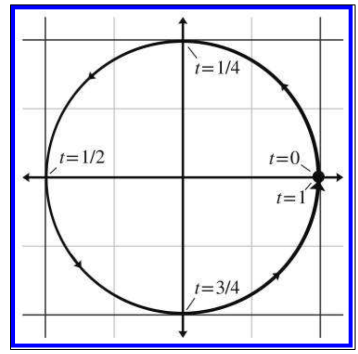

参数化表达可以进一步细分为一元表达（univariate）， 即只有一个参数，和二元表达（bivariate），即有两个参数。一元表达描述的是一个曲线，二元表达描述的是一个曲面。

第三种表达方式是直接表达，但这种表达没有统一的形式。如使用两个点来描述一条直线，用半径和圆心来描述一个圆。

## Lines and Rays

从数学角度来说，关于线条有三个定义：

1. 直线是用来描述一个朝正反方向都无限延伸的线
2. 线段是用来描述由确切两个点构成的有限长度的线。这两个点并没有起点和终点之分，即不存在方向。
3. 射线是用来描述有一个起点，和朝一个方向无限延伸的线。

从几何角度来说

1. 直线描述与数学角度相同
2. 线段描述与数学角度相同
2. 射线是用来描述一个有方向的线段，即存在起点和终点的概念。

在电子游戏中，通常只使用射线，直线和线段的概念很少出现。

### Rays

1. 如果用直接方法定义射线，直接给定终点和起点即可，$\mathbf{P}_{org}$和$\mathbf{P}_{end}$
2. 用参数化表达射线，表达式如下
   $$\mathbf{p}(t)=\mathbf{p}_{0}+t \mathbf{d}$$
   其中，$\mathbf{P}_0$为起点，$\mathbf{d}$为射线的有向长度，参数$t$的取值范围是$[0,1]$

   射线的参数化表达也可以进一步拆分为两部分，即分别描述x分量和y分量
   $$x(t)=x_{0}+t \Delta x, \quad y(t)=y_{0}+t \Delta y$$

   可以看出这个表达存在四个自由度，分别是$x_0$和$y_0$表示起点和$\Delta x$和$\Delta y$表示一个分量上的有向长度。

### Special 2D Representation of Lines

这一节介绍一些二维射线的特殊表达

1. 截距形式（Slope-interpret form）
   
   $$y=m x+y_{0}$$

   其中$m$表示射线的斜率(rise/run)，$y_0$表示截距（y-intercept），如下图所示

   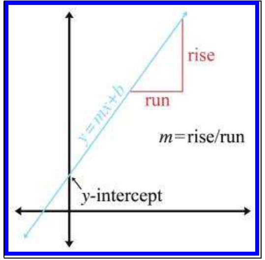

   截距形式的问题在于，它无法表达沿着Y轴向上的射线。

2. 隐式表达（Implicit definition）
   
   射线的隐式表达实际上相当于截距形式的变形

   $$a x+b y=d$$

   而且隐式表达可以进一步使用向量的点乘表达，

   $$\mathbf{p} \cdot \mathbf{n}=d$$

   其中$\mathbf{n}=[a, b]$表示射线的法线方向，且是一个单位向量。

   $\mathbf{p}=[x,y]$表示射线上的点。

   $d$表示射线沿着$\mathbf{n}$方向上离原点的距离。

   如下所示：

   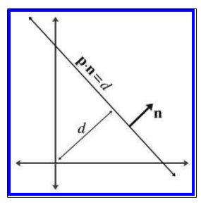

3. 垂直线等分法：
   该方法定义两个点$\mathbf{q,r}$，射线用来描述距离这两个点距离相等的点的几何。如下图所示：

   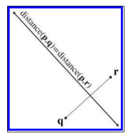

### Converting between Representations

直接表达法：

$$\mathbf{P}_{end}和\mathbf{P}_{org}$$

截距法：

$$y=m x+y_{0}$$

隐式表达法：

$$a x+b y=d$$

向量表达法：

$$\mathbf{p} \cdot \mathbf{n}=d$$

垂直线等分法法：

$$与点\mathbf{q}和点\mathbf{r}距离相同的点的合集$$

上述相互之间的转换方法为：

1. 直接表达法与隐式表达法的转换
   
   直接表达即为通过两个点$\mathbf{P}_{end}$和$\mathbf{P}_{org}$来描述一条射线，为了将其转换为隐式表达法首先需要计算出两点之间的有向距离

   $$\mathbf{d}=\mathbf{p}_{\text {end }}-\mathbf{p}_{\text {org }}$$

   $\mathbf{d}$不仅表示两点间的距离还表示两点间的方向
   
   因此如果表示为截距法，那么射线的斜率为$m=d_y/d_x$，将点$\mathbf{P}_org$代入式子中，可以求得$y_0=y_{org}-\frac{d_y}{d_x}x_{org}$

   转换为隐式表达法则有：

   $$a=d_{y}, \quad b=-d_{x}, \quad d=x_{\text {org }} d_{y}-y_{\text {org }} d_{x}$$

2. 隐式表达法和截距法的转换
   
   使用隐式表达法中的$a,b,d$来描述截距法，则有
   $y=-\frac{a}{b}x+\frac{d}{b}$

3. 隐式表达法求射线的法线和距离
   
   隐式表达法可以直接转换为向量形式的表达，即

   $$a x+b y=\mathbf{p} \cdot \mathbf{n}=[x \quad y]\cdot[a \quad b]=d$$

   即$\mathbf{n}t[a \quad b]$，如果将其转换为单位向量，即

   $$\hat{\mathbf{n}}=[a \quad b]/\sqrt{a^2+b^2}$$

   如果用$\hat{\mathbf{n}}$作为表达式，则原表达式两边都要等除$\sqrt{a^2+b^2}$，即

   $$
   [x \quad y]\cdot \frac{[a \quad b]}{\sqrt{a^2+b^2}}=\frac{d}{\sqrt{a^2+b^2}}
   $$

   $$
   [x \quad y]\cdot \hat{\mathbf{n}}=distance
   $$

   其中$\hat{\mathbf{n}}$为射线的法线，$distance$为射线沿着法线方向与原点的距离。

4. 垂直线等分法转换为隐式表达法
   
   有两个点$\mathbf{q}和点\mathbf{r}$，其中$\mathbf{r}$是x轴分量更大的点。

   可以得到由这两个点构成的线段的斜率为$r_{y}-q_{r}/r_{x}-q_{x}$，因为所求的射线，即这两个点中间的垂直线斜率相反，所以可以得到所求射线的斜率$m=q_{r}-r_{y}/r_{x}-q_{x}$

   转换为隐形表达式，则可得：

   $$\begin{aligned}
   &a=q_{y}-r_{y}\\
   &b=r_{x}-q_{x}
   \end{aligned}$$

   点$\mathbf{q}和点\mathbf{r}$的中点在所求射线上，且该中点为$\mathbf{q}+\frac{\mathbf{r-q}}{2}=\frac{\mathbf{q+r}}{2}$，将该点带入隐形表达式，可得

   $$d=\frac{\mathbf{q}+\mathbf{r}}{2} \cdot\left[\begin{array}{ll}
   a & b
   \end{array}\right]$$

   进一步化简得：

   $$\begin{aligned}
   d &=\frac{\mathbf{q}+\mathbf{r}}{2}    \cdot\left[\begin{array}{cc}
   a & b
   \end{array}\right]=\frac{\mathbf{q} +\mathbf{r}}{2} \cdot\left[\begin{array}   {cc}
   q_{y}-r_{y} & r_{x}-q_{x}
   \end{array}\right] \\
   &=\frac{\left(q_{x}+r_{x}\right)\left(q_  {y}-r_{y}\right)+\left(q_{y}+r_{y}\right)   \left(r_{x}-q_{x}\right)}{2} \\
   &=\frac{\left(q_{x} q_{y}-q_{x} r_{y}+r_  {x} q_{y}-r_{x} r_{y}\right)+\left(q_{y}    r_{x}-q_{y} q_{x}+r_{y} r_{x}-r_{y} q_{x} \right)}{2} \\
   &=r_{x} q_{y}-q_{x} r_{y}
   \end{aligned}$$

## Sphere and Circles

球常用来作为物体的边框，一是用球作为边框比较简单，二是因为当用球来作为边框时，物体的旋转并不会造成任何的影响，因此物体旋转后的再次计算边框。

球的隐式定义如下：

$$\|\mathbf{p}-\mathbf{c}\|=r$$

其中$\mathbf{p}$表示球上的点,$\mathbf{c}$表示球心，两者都是向量。非向量形式的隐式表达如下：

$$\begin{aligned}
\left(x-c_{x}\right)^{2}+\left(y-c_{y}\right)^{2} &=r^{2} \\
\left(x-c_{x}\right)^{2}+\left(y-c_{y}\right)^{2}+\left(z-c_{z}\right)^{2} &=r^{2}
\end{aligned}$$

球的其他计算数学计算如下：

1. 直径
   $$D=2 r$$
2. 周长
   $$C=2 \pi r=\pi D$$
3. 圆的面积
   $$A=\pi r^{2}$$
4. 球的表面积
   $$S=4 \pi r^{2} $$
5. 球的体积
   $$V=\frac{4}{3} \pi r^{3}$$

## Bounding Boxes

`AABB（Axially aligned bounding box）`通常用来表示立方体形状的边框，而且立方体的边必须与当前坐标系下坐标轴相平行。

另一种不太常用的立方体边框为OBB（Oriented bounding box），这里立方体的边与坐标系的轴没有任何约束。相对来说，AABB更容易创建，而且OBB仅仅是AABB在一个坐标系下旋转，所以这一节只会讨论AABB。

OBB和AABB的区别并不在于边框本身，而是在于坐标系。如果一个边框用于在世界坐标中旋转了的物体，那么这个边框从物体坐标系角度看是AABB，但是从世界坐标系角度看是OBB

### Representing AABBs

一种表达方式是限定三个坐标系的范围，即

$$x_{\min } \leq x \leq x_{\max }, \quad y_{\min } \leq y \leq y_{\max }, \quad z_{\min } \leq z \leq z_{\max }$$

也可以通过两个对角线的点来进行表达，即

$$\mathbf{p}_{\min }=\left[\begin{array}{lll}
x_{\min } & y_{\min } & z_{\min }
\end{array}\right], \quad \mathbf{p}_{\max }=\left[\begin{array}{ccc}
x_{\max } & y_{\max } & z_{\max }
\end{array}\right]$$

其中边框的中点可以表示为：

$$\mathbf{c}=\left(\mathbf{p}_{\min }+\mathbf{p}_{\max }\right) / 2$$

边框的尺寸向量（Size vector）用$\mathbf{s}$表示，值为对角线两个点间的有向距离：

$$\mathbf{s}=\mathbf{p}_{\max }-\mathbf{p}_{\min }$$

同样也可以计算半径向量，如下所示：

$$\mathbf{r}=\mathbf{p}_{\max }-\mathbf{c}=\mathbf{s} / 2$$

关于边框的值$P_{min}, P_{\max }, \mathbf{c}, \mathbf{s}, \text {和} \mathbf{r}$，除了$\mathbf{s}和\mathbf{r}$这两个值的搭配，通过其他任意搭配都可以求出边框的其他值。

### Computing AABBs

//TODO

// 书中给出了关于AABB的类

### AABBs versus Bounding Spheres

AABB对于球边框的优势：

1. 计算由一系列的点构成的AABB面只需要线性时间（比较出最小的点和最大的点即可），而计算出由一系列的点构成的球相对复杂。
2. 通常来说，对于同一个物体AABB边框会更小，最坏的情况下，AABB也只比球边框大不到两倍（当物体本身是一个球时），而最坏情况下球边框可能会比AABB大很多。
   如下所示，蓝色为球边框，红色为AABB
   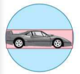

球边框对于AABB边框的优势：

1. 物体的变换不会造成球边框的变化，如下图所示：
   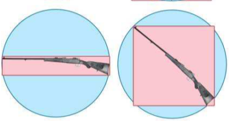

#### Transforming AABBs

如之前所述，AABB边框在物体变换后也会发生变化，这一节介绍如何计算变换后的AABB边框。

通常有两种思路，一种是对变换后的物体再次求解AABB边框，第二种是直接对AABB边框进行同样的变换。通常第二种方法比第一种计算更快，因为无论物体本身多复杂，计算AABB的变换只需要计算8个顶点，所以通常第二种方法用的较多。

第二种方法中直接将AABB变换后的结果作为新的AABB是不行的，因为可能旋转会导致原先的$\mathbf{P}_{max}$变得比$\mathbf{P}_{min}$更小。所以直接对AABB边框进行同样的变换后，根据变换后的8个顶点，得出新AABB框，如下图所示：

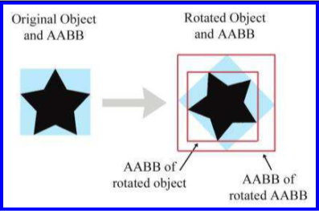

上图的右半部分是旋转后的物体和ABBB，图中蓝色的部分是直接对AABB进行了旋转，此时在世界坐标系下，它已经变成了OBB。
内部的红色边框为第一种方法，是根据旋转后的图形再次求解AABB。该方法准确但效率较低。
外部的红色边框为第二种方法，它是由旋转后的原AABB（蓝色部分）计算得到的，它比理想上的AABB框要更大。该方法迅速，只需要计算AABB的顶点，但通常会造成计算出的边框更大。

第二种方法的计算如下，假设$[x \quad y \quad z]$是原先AABB的顶点，变换后的顶点为$[x^{\prime} \quad y^{\prime} \quad z^{\prime}]$，则转换果然如下：

$$\begin{aligned}
\left[\begin{array}{ll}
x^{\prime} & y^{\prime} & z^{\prime}
\end{array}\right] &=\left[\begin{array}{lll}
x & y & z
\end{array}\right]\left[\begin{array}{lll}
m_{11} & m_{12} & m_{13} \\
m_{21} & m_{22} & m_{23} \\
m_{31} & m_{32} & m_{33}
\end{array}\right] \\
x^{\prime} &=m_{11} x+m_{21} y+m_{31} z \\
y^{\prime} &=m_{12} x+m_{22} y+m_{32} z \\
z^{\prime} &=m_{13} x+m_{23} y+m_{33} z
\end{aligned}$$

其中矩阵表示进行的变换。

通常的的方式是将八个顶点分别通过上式进行计算，然后找出最小点和最大点。

但是观察后发现，可以直接通过矩阵中的元素正负号来直接求出最大点和最小点，下面以二维平面的变换作为例子，即变换为：

$$\begin{aligned}
\left[\begin{array}{ll}
x^{\prime} & y^{\prime} 
\end{array}\right] &=\left[\begin{array}{lll}
x & y
\end{array}\right]\left[\begin{array}{lll}
m_{11} & m_{12} \\
m_{21} & m_{22}
\end{array}\right] \\
x^{\prime} &=m_{11} x+m_{21} y\\
y^{\prime} &=m_{12} x+m_{22} y \\
\end{aligned}$$

在二维平面下中，AABB有四个顶点，$[x_{min},y_{min}],[x_{min},y_{max}],[x_{max},y_{min}],[x_{max},y_{max}]$

所以$x^{\prime}$也相对有四种可能，即$m_{11} x_{min}+m_{21} y_{min}$，$m_{11} x_{min}+m_{21} y_{max}$，$m_{11} x_{max}+m_{21} y_{min}$，$m_{11} x_{max}+m_{21} y_{max}$，

如果将$x^{\prime}$拆分成两部分来看，即$m_{11}x$和$m_{21}y$，如果$m_{11}$是正数，那么要求得更小的$x^{\prime}$，x是$x_{min}$时更合适，反之$x_{max}$更合适。对于$m_{21}$也是同理，$y_{min}$适合$m_{21}$是正数的情况，$y_{max}$适合$m_{21}$是负数的情况

因此求$x_{min}^{\prime}$，只需要判断$m_{11}$和$m_{21}$的大小，然后直接选取对应的x和y分量，进行累加就行，不需要求出所有的$x^{\prime}$可能进行比较。

//TODO
//书中有对应的求新AABB算法

## Planes

3D中的平面对应2D中的射线，其定义也与在2D中的射线类似：与给定的两个点距离相同的所有的点的集合。

### The Plane Equation：An Implicit Definnition of a plane

隐式表达法：
1. 用标量
   $$a x+b y+c z=d$$
2. 用向量
   $$\mathbf{p} \cdot \mathbf{n}=d$$
   其中$\mathbf{p}$为在平面上的点，$\mathbf{n}=[a \quad b \quad c]$为垂直平面的线。
   证明如下，假设平面上还有一个点$\mathbf{q}$：

   $$\begin{aligned}
   \mathbf{n} \cdot \mathbf{p} &=d \\
   \mathbf{n} \cdot \mathbf{q} &=d \\
   \mathbf{n} \cdot \mathbf{p} &=\mathbf{n}  \cdot \mathbf{q} \\
   \mathbf{n} \cdot \mathbf{p}-\mathbf{n}    \cdot \mathbf{q} &=0 \\
   \mathbf{n} \cdot(\mathbf{p}-\mathbf{q}) & =0
   \end{aligned}$$

   如果要求平面的法线，对$n$进行归一化即可
   $$
   \hat{\mathbf{n}}=\frac{[a \quad b \quad c]}{\sqrt{a^2+b^2+c^2}}
   $$

   用法线表示平面为：

   $$
   \mathbf{p}\cdot \hat{\mathbf{n}}=\frac{d}{\sqrt{a^2+b^2+c^2}}=distance
   $$

   其中distance为平面距离原点的距离

平面分正反面，沿着法线方向看，看到的是背面，法线指向的方向是正面，如下图所示：

### Defining a Plane by Using Three Points

假设有三个在平面上的点$\mathbf{p}_{1}, \mathbf{p}_{2}$和$\mathbf{p}_{3}$，且他们按顺时针方向排列，如下图所示：

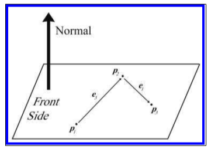

可以按照下式，求出法线：

$$\mathbf{e}_{3}=\mathbf{p}_{2}-\mathbf{p}_{1}, \quad \mathbf{e}_{1}=\mathbf{p}_{3}-\mathbf{p}_{2}, \quad \hat{\mathbf{n}}=\frac{\mathbf{e}_{3} \times \mathbf{e}_{1}}{\left\|\mathbf{e}_{3} \times \mathbf{e}_{1}\right\|}$$

将任意一个点带入法线表达式，既能求出distance
，如$distance=\hat{\mathbf{n}}\cdot \mathbf{p}_1$

即最终表达式为

$$\mathbf{P}\cdot \hat{\mathbf{n}}=\hat{\mathbf{n}}\cdot \mathbf{p}_1$$

### "Best Fit" Plane for More than Three Points

当给定了多个点，要根据多个点求平面时，不能简单的从多个点中任意选取出三个点，因为：

1. 选取的三个点可能在一条线上
2. 多个点构成的多边形可能是凹的，即虽然按顺时针在多边形上取了三个点，但实际上它们是逆时针的
3. 由于精度或各种原因，三个点可能实际上并不在一个平面上。

所以解法是用所有的点来计算，如有以下点：

$$\begin{aligned}
&\mathbf{p}_{1}=\left[\begin{array}{lll}
x_{1} & y_{1} & z_{1}
\end{array}\right]\\
&\mathbf{p}_{2}=\left[\begin{array}{lll}
x_{2} & y_{2} & z_{2}
\end{array}\right]\\
&\vdots\\
&\mathbf{p}_{n-1}=\left[\begin{array}{lll}
x_{n-1} & y_{n-1} & z_{n-1}
\end{array}\right] \\
&\mathbf{p}_{n} =\left[\begin{array}{lll}
x_{n} & y_{n} & z_{n}\end{array}\right]
\end{aligned}$$

则法线为：

$$\begin{aligned}
n_{x}=&\left(z_{1}+z_{2}\right)\left(y_{1}-y_{2}\right)+\left(z_{2}+z_{3}\right)\left(y_{2}-y_{3}\right)+\cdots \\
& \cdots+\left(z_{n-1}+z_{n}\right)\left(y_{n-1}-y_{n}\right)+\left(z_{n}+z_{1}\right)\left(y_{n}-y_{1}\right) \\
n_{y}=&\left(x_{1}+x_{2}\right)\left(z_{1}-z_{2}\right)+\left(x_{2}+x_{3}\right)\left(z_{2}-z_{3}\right)+\cdots \\
& \cdots+\left(x_{n-1}+x_{n}\right)\left(z_{n-1}-z_{n}\right)+\left(x_{n}+x_{1}\right)\left(z_{n}-z_{1}\right) \\
n_{z}=&\left(y_{1}+y_{2}\right)\left(x_{1}-x_{2}\right)+\left(y_{2}+y_{3}\right)\left(x_{2}-x_{3}\right)+\cdots \\
& \cdots+\left(y_{n-1}+y_{n}\right)\left(x_{n-1}-x_{n}\right)+\left(y_{n}+y_{1}\right)\left(x_{n}-x_{1}\right)
\end{aligned}$$

即

$$\begin{aligned}
&n_{x}=\sum_{i=1}^{n}\left(z_{i}+z_{i+1}\right)\left(y_{i}-y_{i+1}\right)\\
&n_{y}=\sum_{i=1}^{n}\left(x_{i}+x_{i+1}\right)\left(z_{i}-z_{i+1}\right)\\
&n_{z}=\sum_{i=1}^{n}\left(y_{i}+y_{i+1}\right)\left(x_{i}-x_{i+1}\right)
\end{aligned}$$

//TODO: 推导该公式

在求出了$n$后，将所有的点都带入公式，然后求出平均的$d$，如下：

$$d=\frac{1}{n} \sum_{i=1}^{n}\left(\mathbf{p}_{i} \cdot \mathbf{n}\right)=\frac{1}{n}\left(\sum_{i=1}^{n} \mathbf{p}_{i}\right) \cdot \mathbf{n}$$

### Distance from Point to Plane

要求平面外点$\mathbf{q}$距离平面的距离，可找出平面上离该点最近的点$\mathbf{p}$，有向距离$\mathbf{pq}$即为距离，当$\mathbf{q}$处于平面的正方向，则距离为正数，否则为负数，如下图所示：

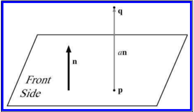

如果$\mathbf{n}$是单位向量法线，即$\hat{\mathbf{n}}$，那么$a$即是有向距离。

在实际求解的过程中，实际上并不需要算出$\mathbf{p}$的位置，如下所示：

$$\begin{aligned}
\mathbf{p}+a \hat{\mathbf{n}} &=\mathbf{q} \\
(\mathbf{p}+a \hat{\mathbf{n}}) \cdot \hat{\mathbf{n}} &=\mathbf{q} \cdot \hat{\mathbf{n}} \\
\mathbf{p} \cdot \hat{\mathbf{n}}+(a \hat{\mathbf{n}}) \cdot \hat{\mathbf{n}} &=\mathbf{q} \cdot \hat{\mathbf{n}} \\
d+a &=\mathbf{q} \cdot \hat{\mathbf{n}} \\
a &=\mathbf{q} \cdot \hat{\mathbf{n}}-d
\end{aligned}$$

## Triangles

### Notation

三角形是通过三个顶点定义的。通常在左手坐标系下，三个顶点的顺序为顺时针。

三角形的边和顶点的定义如下图所示：

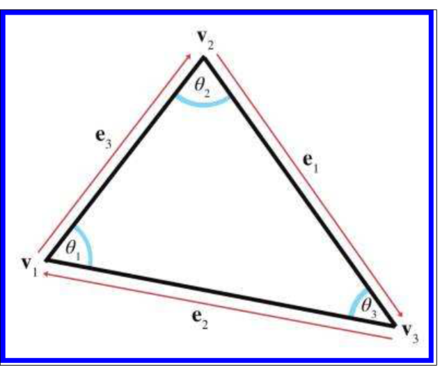

$$\begin{aligned}
&\mathbf{e}_{1}=\mathbf{v}_{3}-\mathbf{v}_{2}, \quad \mathbf{e}_{2}=\mathbf{v}_{1}-\mathbf{v}_{3}, \quad \mathbf{e}_{3}=\mathbf{v}_{2}-\mathbf{v}_{1}\\
&l_{1}=\left\|\mathbf{e}_{1}\right\|, \quad l_{2}=\left\|\mathbf{e}_{2}\right\|, \quad l_{3}=\left\|\mathbf{e}_{3}\right\|
\end{aligned}$$

根据顶点，边，角的关系，有正弦和余弦定理，如下所示：

正弦定理为：

$$\frac{\sin \theta_{1}}{l_{1}}=\frac{\sin \theta_{2}}{l_{2}}=\frac{\sin \theta_{3}}{l_{3}}$$

余弦定理为：

$$\begin{array}{l}
l_{1}^{2}=l_{2}^{2}+l_{3}^{2}-2 l_{2} l_{3} \cos \theta_{1} \\
l_{2}^{2}=l_{1}^{2}+l_{3}^{2}-2 l_{1} l_{3} \cos \theta_{2} \\
l_{3}^{2}=l_{1}^{2}+l_{2}^{2}-2 l_{1} l_{2} \cos \theta_{3}
\end{array}$$

### Area of a Triangle

最普通的求三角形面积为通过底和高，即

$$A=b h / 2$$

海拉公式，可以通过三角形的三边长度来求得三角形面积：

$$\begin{aligned}
&s=\frac{l_{1}+l_{2}+l_{3}}{2}=\frac{p}{2}\\
&A=\sqrt{s\left(s-l_{1}\right)\left(s-l_{2}\right)\left(s-l_{3}\right)}
\end{aligned}$$

还可以通过三角形的顶点本身来求得三角形面积，首先需要对三个顶点相减，获得三条边的向量$e_1,e_2,e_3$，然后再任意取其中两条求面积如下所示：

$$A=\frac{\left\|\mathbf{e}_{1} \times \mathbf{e}_{2}\right\|}{2}$$

该公式推导如下：

首先三角形的三条边都与X轴形成了一个梯形，如下图所示：

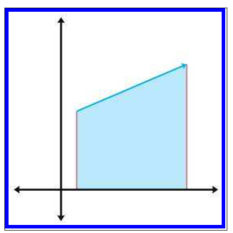

对该梯形的面积定义正负，如果边的顶点是由左到右，则梯形面积为正，否则面积为负，三边构成的梯形面积如下：

$$\begin{aligned}
&A\left(\mathbf{e}_{1}\right)=\frac{\left(y_{3}+y_{2}\right)\left(x_{3}-x_{2}\right)}{2}\\
&A\left(\mathbf{e}_{2}\right)=\frac{\left(y_{1}+y_{3}\right)\left(x_{1}-x_{3}\right)}{2}\\
&A\left(\mathbf{e}_{3}\right)=\frac{\left(y_{2}+y_{1}\right)\left(x_{2}-x_{1}\right)}{2}
\end{aligned}$$

三角形的面积为三个梯形的累加，如下所示：

$$\begin{aligned}
A &=A\left(\mathbf{e}_{1}\right)+A\left(\mathbf{e}_{2}\right)+A\left(\mathbf{e}_{3}\right) \\
&=\frac{\left(y_{3}+y_{2}\right)\left(x_{3}-x_{2}\right)+\left(y_{1}+y_{3}\right)\left(x_{1}-x_{3}\right)+\left(y_{2}+y_{1}\right)\left(x_{2}-x_{1}\right)}{2} \\
&=\frac{\left(\begin{array}{c}
\left(y_{3} x_{3}-y_{3} x_{2}+y_{2} x_{3}-y_{2} x_{2}\right) \\
+\left(y_{1} x_{1}-y_{1} x_{3}+y_{3} x_{1}-y_{3} x_{3}\right) \\
+\left(y_{2} x_{2}-y_{2} x_{1}+y_{1} x_{2}-y_{1} x_{1}\right)
\end{array}\right)}{2} \\
&=\frac{-y_{3} x_{2}+y_{2} x_{3}-y_{1} x_{3}+y_{3} x_{1}-y_{2} x_{1}+y_{1} x_{2}}{2} \\
&=\frac{y_{1}\left(x_{2}-x_{3}\right)+y_{2}\left(x_{3}-x_{1}\right)+y_{3}\left(x_{1}-x_{2}\right)}{2}
\end{aligned}$$

将上式中的$y_1,y_2,y_3$都减去$y_3$，相当于三角形向下平移了一部分，所以结果不会变，即如下所示：

$$\begin{aligned}
&\begin{aligned}
A &=\frac{y_{1}\left(x_{2}-x_{3}\right)+y_{2}\left(x_{3}-x_{1}\right)+y_{3}\left(x_{1}-x_{2}\right)}{2} \\
&=\frac{\left(y_{1}-y_{3}\right)\left(x_{2}-x_{3}\right)+\left(y_{2}-y_{3}\right)\left(x_{3}-x_{1}\right)+\left(y_{3}-y_{3}\right)\left(x_{1}-x_{2}\right)}{2}
\end{aligned}\\
&=\frac{\left(y_{1}-y_{3}\right)\left(x_{2}-x_{3}\right)+\left(y_{2}-y_{3}\right)\left(x_{3}-x_{1}\right)}{2}
\end{aligned}$$

上述结果即为点乘，即

$$A=\frac{\left\|\mathbf{e}_{1} \times \mathbf{e}_{2}\right\|}{2}$$

### Barycentric Space

`重心系统（Barycentric Space）`是用三角形的三个顶点来描述三角形的位置，表达式为：

$$\left(b_{1}, b_{2}, b_{3}\right) \equiv b_{1} \mathbf{v}_{1}+b_{2} \mathbf{v}_{2}+b_{3} \mathbf{v}_{3}$$

其中

$$b_{1}+b_{2}+b_{3}=1$$

重心系统实例如下：

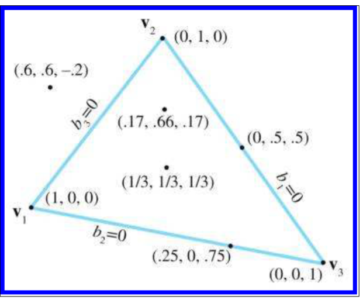

注意其中三个顶点的数值，即

$$(1,0,0) \equiv \mathbf{v}_{1}, \quad(0,1,0) \equiv \mathbf{v}_{2}, \quad(0,0,1) \equiv \mathbf{v}_{3}$$

三角形内的点，数值会在$[0,1]$之间，三角形外的点最少会有一个负数。

下图是重心系统的镶嵌，可以看出重心系统中值的运算规律：

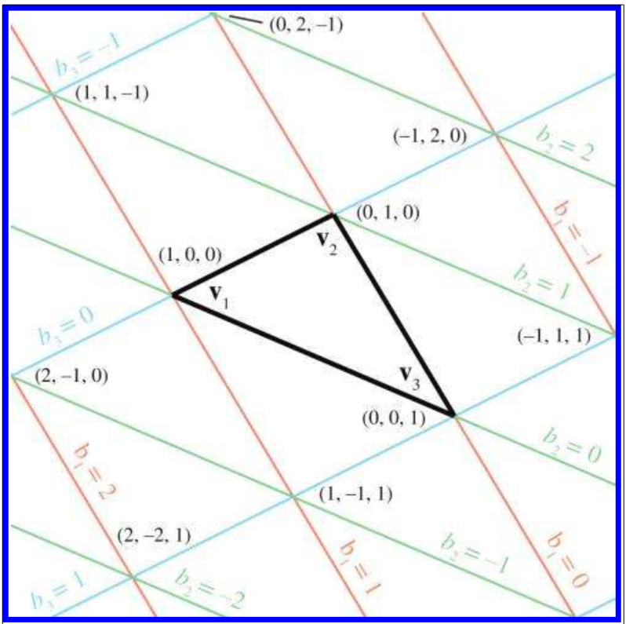

如第一个数值表示顶点$\mathbf{V}_1$对面的边所平行的部分，即$\mathbf{V}_2$和$\mathbf{V}_3$构成的边。因此可以看到该边上的点，值都为$(0,x,x)$，而平行于该边且经过$\mathbf{v}_1$的边上面的点都为$(1,x,x)$，$\mathbf{v}_1$点为$(1,0,0)$。同理顶点$\mathbf{v}_2$对面，由$\mathbf{v}_1$和$\mathbf{v}_3$构成的边，表示第二个参数，即$(x,0,x)$。第三个参数的数值也同理可得。

重心系统的维度不是由参考点的维度决定的，而是由参考点的数量决定的。如三角形的重心系统，无论三角形的点是二维还是三维的，只要是三角形就需要三个参考点，所以该重心系统是二维的。

在图形学中，重心系统常应用在在计算顶点插值时，如计算片段的颜色。还被应用在计算相交问题时，一根射线可以根据与各个三角形片元的重心值判断是与哪个片元相交。

### Calculating Barycentric Coordinates

如果通过重心系统计算笛卡尔坐标系，可以通过上述公式：

$$\left(b_{1}, b_{2}, b_{3}\right) \equiv b_{1} \mathbf{v}_{1}+b_{2} \mathbf{v}_{2}+b_{3} \mathbf{v}_{3}$$

由笛卡尔坐标系计算重心表达如下：

已知三个点和所求点的笛卡尔坐标系，如下图所示：

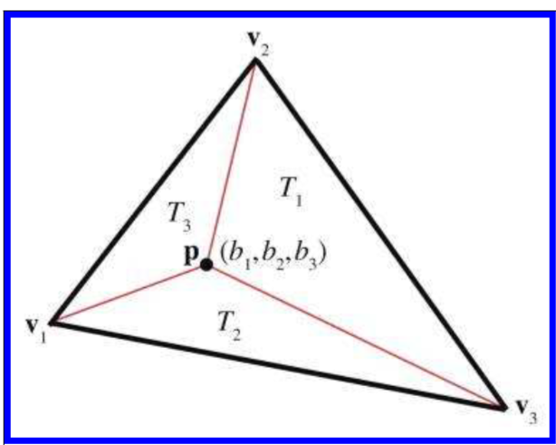

对于二维空间中的三角形，根据三角形重心的定义，可得：

$$\begin{aligned}
b_{1} x_{1}+b_{2} x_{2}+b_{3} x_{3} &=p_{x} \\
b_{1} y_{1}+b_{2} y_{2}+b_{3} y_{3} &=p_{y} \\
b_{1}+b_{2}+b_{3} &=1
\end{aligned}$$

三个表达式对应三个未知数$b_1,b_2,b_3$，因此这是一个三元一次方程的求解，结果为：

$$\begin{array}{l}
b_{1}=\frac{\left(p_{y}-y_{3}\right)\left(x_{2}-x_{3}\right)+\left(y_{2}-y_{3}\right)\left(x_{3}-p_{x}\right)}{\left(y_{1}-y_{3}\right)\left(x_{2}-x_{3}\right)+\left(y_{2}-y_{3}\right)\left(x_{3}-x_{1}\right)} \\
b_{2}=\frac{\left(p_{y}-y_{1}\right)\left(x_{3}-x_{1}\right)+\left(y_{3}-y_{1}\right)\left(x_{1}-p_{x}\right)}{\left(y_{1}-y_{3}\right)\left(x_{2}-x_{3}\right)+\left(y_{2}-y_{3}\right)\left(x_{3}-x_{1}\right)} \\
b_{3}=\frac{\left(p_{y}-y_{2}\right)\left(x_{1}-x_{2}\right)+\left(y_{1}-y_{2}\right)\left(x_{2}-p_{x}\right)}{\left(y_{1}-y_{3}\right)\left(x_{2}-x_{3}\right)+\left(y_{2}-y_{3}\right)\left(x_{3}-x_{1}\right)}
\end{array}$$

根据上节中，通过顶点求三角形面积的方法，可以看出上式的分子和分母都是面积公式的两倍，因此也可以化简为：

$$b_{1}=A\left(T_{1}\right) / A(T), \quad b_{2}=A\left(T_{2}\right) / A(T), \quad b_{3}=A\left(T_{3}\right) / A(T)$$

对于三维空间中的三角形，也可以通过类似的方法求得结果。但是因为是三维空间，所以可以列出四个表达式（x,y,z三个表达式+一个和为1的限制），但是未知数还是三个（$b_1,b_2,b_3$）。因此需要删除一个表达式。

但是不能随便删除一个表达式，因为删去一个表达式的操作相当于将三维空间中的三角形投影至一个平面上，而如果三角形是垂直或者接近垂直于该平面，那么就会有问题。因此要选择投影面积最大的平面。

可以根据法线判断出投影面积最大的平面，如果法线为$[0,1,0]$，那么法线垂直于$xz$平面，即$xz$平面最大，即删除$y$，也因此法线上哪个分量最大，删除哪个表达式。

上述已经求得重心可以通过三角形的面积得到：

$$b_{1}=A\left(T_{1}\right) / A(T), \quad b_{2}=A\left(T_{2}\right) / A(T), \quad b_{3}=A\left(T_{3}\right) / A(T)$$

同时由之前公式可知，面积可以通过叉乘求得，即：

$$A=\frac{\left\|\mathbf{e}_{1} \times \mathbf{e}_{2}\right\|}{2}$$

因此理论上可以通过用顶点获取三角形的各边，再通过边的叉乘的得到结果。但存在的问题是，上述公式中的求模永远返回的是正数，因此这样就无法计算三角形外的点。

解决方法是再通过一个点积，如下所示：

$$\begin{aligned}
\mathbf{c} \cdot \hat{\mathbf{n}} &=\|\mathbf{c}\|\|\hat{\mathbf{n}}\| \cos \theta \\
&=\|\mathbf{c}\|(1)(\pm 1) \\
&=\pm\|\mathbf{c}\|
\end{aligned}$$

其中$\mathbf{c}$为叉乘的结果，$\hat{\mathbf{n}}$为法线，因此$\mathbf{c}$必然平行于$\hat{\mathbf{n}}$。如果两者同向则返回正数，否则返回负数。

整个计算如下图所示：

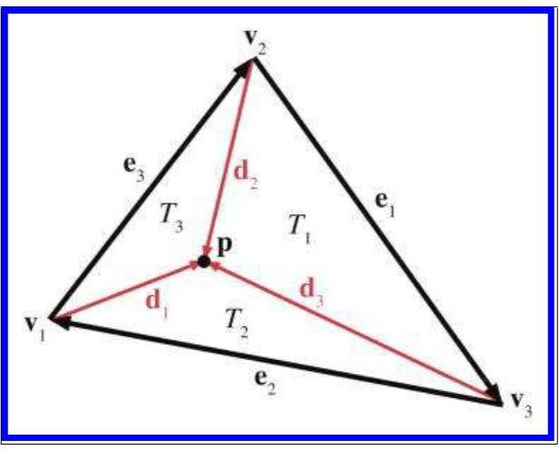

其中：

$$\begin{aligned}
&\mathbf{e}_{1}=\mathbf{v}_{3}-\mathbf{v}_{2}, \quad \mathbf{e}_{2}=\mathbf{v}_{1}-\mathbf{v}_{3}, \quad \mathbf{e}_{3}=\mathbf{v}_{2}-\mathbf{v}_{1}\\
&\mathbf{d}_{1}=\mathbf{p}-\mathbf{v}_{1}, \quad \mathbf{d}_{2}=\mathbf{p}-\mathbf{v}_{2}, \quad \mathbf{d}_{3}=\mathbf{p}-\mathbf{v}_{3}
\end{aligned}$$

$$\hat{\mathbf{n}}=\frac{\mathbf{e}_{1} \times \mathbf{e}_{2}}{\left\|\mathbf{e}_{1} \times \mathbf{e}_{2}\right\|}$$

$$\begin{aligned}
&b_{1}=A\left(T_{1}\right) / A(T)=\frac{\left(\mathbf{e}_{1} \times \mathbf{d}_{3}\right) \cdot \hat{\mathbf{n}}}{\left(\mathbf{e}_{1} \times \mathbf{e}_{2}\right) \cdot \hat{\mathbf{n}}}\\
&b_{2}=A\left(T_{2}\right) / A(T)=\frac{\left(\mathbf{e}_{2} \times \mathbf{d}_{1}\right) \cdot \hat{\mathbf{n}}}{\left(\mathbf{e}_{1} \times \mathbf{e}_{2}\right) \cdot \hat{\mathbf{n}}}\\
&b_{3}=A\left(T_{3}\right) / A(T)=\frac{\left(\mathbf{e}_{3} \times \mathbf{d}_{2}\right) \cdot \hat{\mathbf{n}}}{\left(\mathbf{e}_{1} \times \mathbf{e}_{2}\right) \cdot \hat{\mathbf{n}}}
\end{aligned}$$

### Special Points

1. 质心（center of gravity）
   质心为三角形三个顶点位置的平均值，即：

   $$\mathbf{c}_{\mathrm{Grav}}=\frac{\mathbf{v}_{1}+\mathbf{v}_{2}+\mathbf{v}_{3}}{3}$$

   其重心坐标值为：
   $$\left(\frac{1}{3}, \frac{1}{3}, \frac{1}{3}\right)$$

2. 内心（incenter）
   内心距离三角形三条边的距离相等，也因此是三角形内切圆的圆心，如下图所示：

   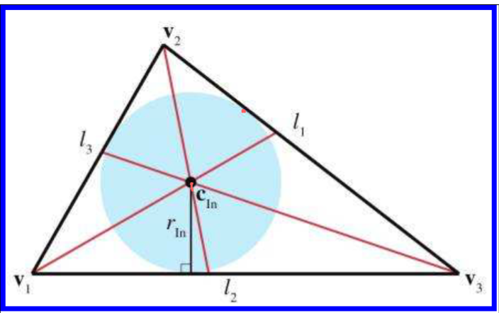

   计算方法如下：

   $$\mathbf{c}_{\mathrm{In}}=\frac{l_{1} \mathbf{v}_{1}+l_{2} \mathbf{v}_{2}+l_{3} \mathbf{v}_{3}}{p}$$

   其重心坐标值为：

   $$\left(\frac{l_{1}}{p}, \frac{l_{2}}{p}, \frac{l_{3}}{p}\right)$$

   内心与三角形边的距离为：

   $$r_{\mathrm{In}}=\frac{2 A}{p}$$

3. 外心（circumcenter）
   外心是距离三角形三个顶点距离相同的点，如下图所示：

   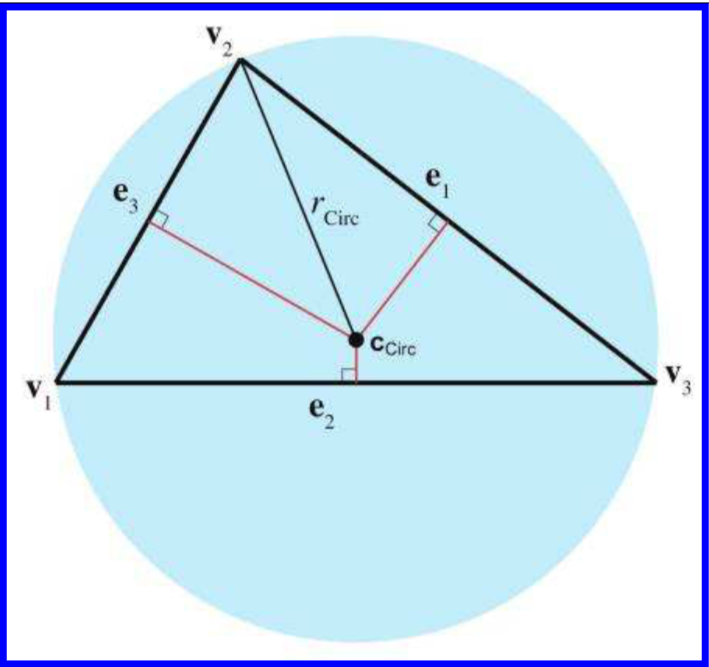

   计算过程如下：

   先根据上图中的标识算出如下的中间变量：

   $$\begin{aligned}
   &\begin{array}{l}
   d_{1}=-\mathbf{e}_{2} \cdot   \mathbf{e}_{3} \\
   d_{2}=-\mathbf{e}_{3} \cdot   \mathbf{e}_{1} \\
   d_{3}=-\mathbf{e}_{1} \cdot   \mathbf{e}_{2}
   \end{array}\\
   &c_{1}=d_{2} d_{3}\\
   &c_{2}=d_{3} d_{1}\\
   &c_{3}=d_{1} d_{2}\\
   &c=c_{1}+c_{2}+c_{3}
   \end{aligned}$$

   其中外心的点为：

   $$\mathbf{c}_{\mathrm{Circ}}=\frac{\left(c_{2}+c_{3}\right) \mathbf{v}_{1}+\left(c_{3}+c_{1}\right) \mathbf{v}_{2}+\left(c_{1}+c_{2}\right) \mathbf{v}_{3}}{2 c}$$

   重心坐标值为：

   $$\left(\frac{c_{2}+c_{3}}{2 c}, \frac{c_{3}+c_{1}}{2 c}, \frac{c_{1}+c_{2}}{2 c}\right)$$

   距离三角形三个顶点的值为：

   $$r_{\mathrm{Circ}}=\frac{\sqrt{\left(d_{1}+d_{2}\right)\left(d_{2}+d_{3}\right)\left(d_{3}+d_{1}\right) / c}}{2}$$

## Polygons

通常来说，多边形是一个由顶点和边组成的平面图形。

### Simple versus Complex Polygons

简单多边形不存在洞，复杂多边形存在洞，如下所示：

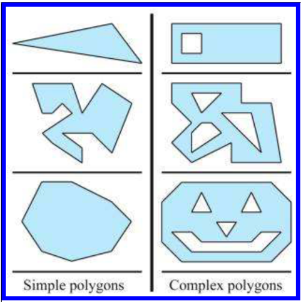

可以通过加上一对缝合边将简单多边形转换为复杂多边形，如下所示：

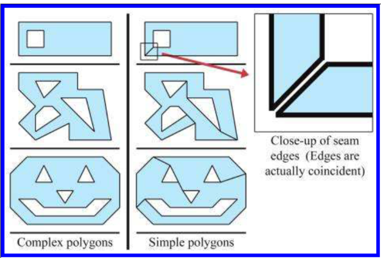

还有一种自相交多边形（Self-intersecting polygon），如下所示：

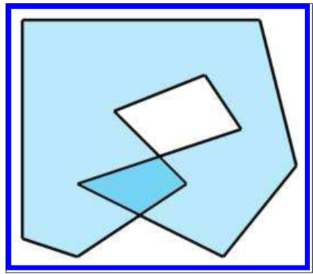

### Convex versus Concava Polygons

关于凹多边形(Concave)和凸多边形(Convex)有多种区分方法：

1. 凹多边形至少有一个凹点（concavity），如下所示：
   
   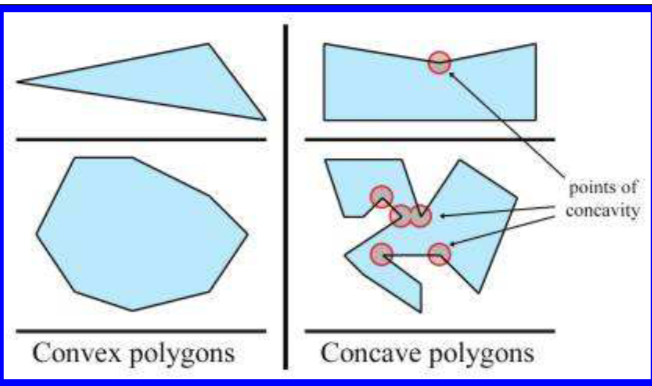

2. 凹多边形至少有一对顶点的连线是在多边形外的。
3. 凹多边形沿着所有顶点走，顶点的旋转顺序会发生变化（顺逆时针）。
   这个可以通过对每两边进行叉乘来判断，如果叉乘的结果与法线方向不一致，说明顺序为逆时针，否则为顺时针。如果按顺时针顺序来取两边进行叉乘，突然出现了结果与法线相反的情况，则该两边中间为凹点。
4. 无论是凸多边形还是凹多边形，其内角和都是$(n-2)360^{\circ}$。但是通过点积求得的是较小角的角度。如果对凸多边形的每两边都点积，则结果和为$(n-2)360^{\circ}$，而凹多边形不是。
   如下图所示：
   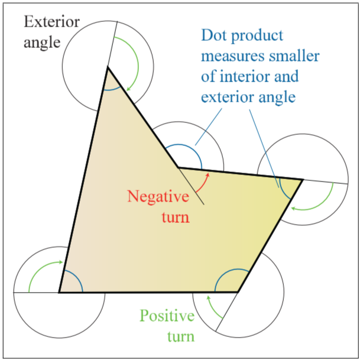

### Triangulation and Fanning

每一个$n$条边的凸多边形都能分为$n-2$个三角形。如下图所示：

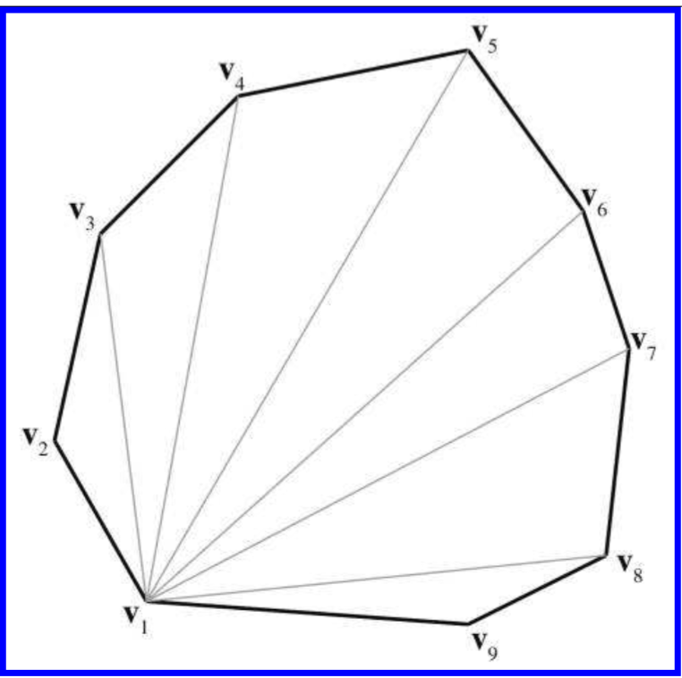

但这样切分的问题在于，可能会切出一条非常细的三角形。

解决方法为每次切分前，先找出能使内角最大的切割方法，然后切一刀，将图形分为两部分。再对每一个部分迭代使用上述方法，直到只剩下三角形。这样可以一定程度避免出现细长三角形，但效率不如直接切分高。



引用：

1. *3D Math Primer for Graphics and Game Development* 2nd 2011 



***