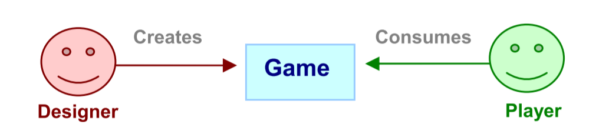
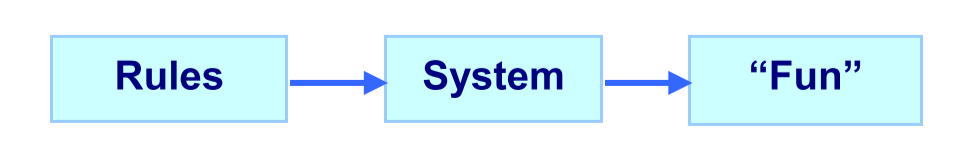
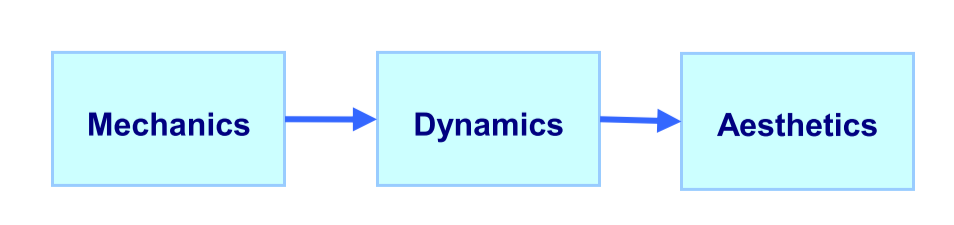
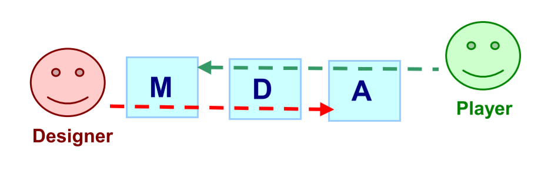
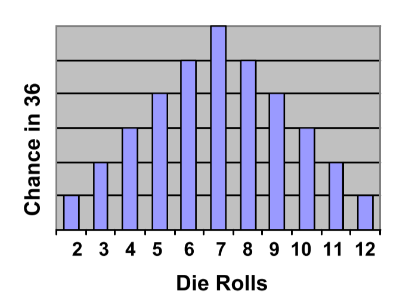



《MDA： A Formal Approach to Game Design and Game Research》 笔记

这篇论文中，作者提出了一个名为MDA的形式上的框架，A指玩家游戏的感受，D指游戏运行时的行为，M指游戏的基本规则元素。

作者认为可以通过框架帮助设计师分析游戏，如从A推导出M，或从M预测会导致的A。



<!--more-->

## Introduction

在这篇论文中，作者提出了MDA框架（Mechanics，Dynamics,Aesthetics的缩写），这一种形式上的理解游戏的方法。该方法尝试将游戏设计与游戏开发联系在一起，将游戏评论和技术上的游戏研究联系在一起。

## Towards a Comprehensive Framework

目前的游戏研究很多是针对一个游戏领域，这篇文章是从整个游戏的角度去思考：从游戏系统的基本方法，到游戏设计的总体目标，到最终玩家的体验。

一个系统性的连贯性是从解决和满足系统中各个部分的限制和要求中创造的。对于游戏而言，连贯性需要从游戏的各个层面中获得，可以通过自底向上的思考，即思考如何通过游戏代码实现游戏概念，概念又如何最终体现在玩家体验，也可以从自顶向下的思考，即从玩家体验开始分析，体验是如何从游戏概念中获得的，游戏概念又是怎么通过游戏代码实现的。

MDA框架就是帮助游戏从业者进行上述的思考，无论是自底向上还是自顶向下。

## MDA

游戏设计师和玩家的关系是，游戏设计师创造了游戏，玩家消费游戏，如下图所示：

玩家消费设计师创造的游戏的过程，可以看作为是“设计师定义了游戏的规则，游戏的规则构成了游戏系统，游戏系统决定了玩家的游戏体验”，如下所示：

可以将整个过程抽象为如下：

Mechancis：下简称为M，表示游戏的算法和数据结构
Dynamics：下简称为D，表示游戏运行时的行为，包括玩家的输入和游戏系统的输出
Aesthetics：下简称为A，描述了玩家在游戏时的情绪上的反应

这个框架的基本思想是，游戏是相对于媒体而言，更像是一个手工制品，它的内容很大一部分来自于玩家的行为。而不是像电影这样的媒介，所有的内容都是直接传递给观众的。

## MDA in Detail

### MDAs as Lens

可以将MDA作为一个观察游戏的方法。设计师的角度使用MDA来看游戏，游戏的M在运行时形成了D，最后反应为玩家的A。从玩家角度来看，A是来自于观察D，而D是来自也运行的M。如下所示：

可以看出，无论是修改M还是A，都会最终都会反映在MDA的另一端。

### Aesthetics

A表示玩家游戏时的体验，设计师的目的是让玩家在游戏时感到有趣，有趣可以体现在如下方面：

1. Sensation：来自于感官愉悦
2. Fantasy：来自于幻想
3. Narrative：来自于故事情节
4. Challenge：来自于克服困难
5. Fellowship：来自于社交
6. Discovery：来自于发现的过程
7. Expression：来自于自我情感的发现
8. Submission：来自于消磨时光

大部分的游戏的有趣都是上述多个点的结合，如*最终幻想*是Fantasy, Narrative, Expression, Discovery, Challenge, Submission，*模拟人生*是 Discovery, Fantasy, Expression, Narrative。但是每个游戏中这些不同的点不是平均的，都有各自的着重点。

### Aesthetic Models

A模型是作为一个指南针的存在，指导D和M该如何去设计实现。

如在竞技游戏中，玩家的情绪上的参与感（A）是来自于击败对手的渴望，所以在设计游戏时，D和M的关键就在于如何提供快速清晰的反馈和对抗性的游戏方式。

### Dynamic Models

D模型直接影戏了玩家对于游戏的体验（即D构成了A）。比如，A中的Challenge来自游戏时的时间限制或者对手的竞争，Fellowship来自于游戏时同一个队伍的信息交流，或者游戏时玩家发现组队合作比自己单打独斗更有利。

在设计时，应该先构建一个模型，用这个模型来预测游戏运行时会发生的事情（D）。如*大富翁*中每次玩家有两个六面筛子，那么投筛子出现的点数概率分布如下：

可以根据这个模型来预测游戏时，玩家走完一圈需要花费多少时间。

同样的，可以进一步通过游戏运行时发生的事（D），来预测玩家的情绪（A）。

如大富翁中，富有的玩家拥有更多的土地，拥有土地多的玩家有更高的概率收到租金，于是就会变得更加的富有，而贫穷的玩家会愈发贫穷，且富有的玩家始终是少数，毕竟资源是有限的。那么在游戏中，只有小部分的富有玩家会有参与感。

这个问题可以通过引入负反馈解决，如在游戏中更多的奖励贫困玩家，或给富有玩家增加限制，通过这些规则（M）来改变运行时的情况（D）进而改变玩家的情绪（A）。

### Mechanics

M包括玩家在游戏中可以进行的操作和行为，以及玩家可以看到的各种游戏元素等等。如对于射击游戏而言，武器，弹药和玩家的出生点就是M。

修改M可以最终影响到运行时的D，如在大富翁中为富有的玩家引入税，为贫困的玩家引入保证金。税和保证金就是M，但他们构成了负反馈，即会影响了运行时的D。而这些D的变换，会改变只有极少数的玩家有参与感的问题，即又进一步影响了玩家的A。

### Tuning

在分析游戏时，需要反反复复的进行迭代，去修改M。该如何修改M的想法可以来自于对D和A的分析。

## MDA at Work

这里作者以设计一款针对不同年龄段的游戏作为例子，展示如何从上层的A推导出M该如何创建。这里的例子是些非常笼统的概念，需要展示的仅仅是A到M的推导。

### First Pass

如果一个游戏是针对3到7岁的孩子，那么游戏的A应该专注于Exploration和Discovery，这样要需要游戏时的行为（D）不是竞赛性的，所以游戏中的规则和元素（M）可以是轻松愉快的，如有趣的内置语音与玩家交流，与孩子大闹的小物件等等。

### Second Pass

如果是针对7-12岁的孩子，那么游戏的A应该是有更多的Challenge，或许也应该包含一些narrative。在运行时（D）,玩家应该可以与别的玩家进行交流，共同发展关系，也可以增加一些时间限制（M）来实现Challenge。

### Third Pass

如果针对14-35岁的玩家，游戏的A可以是关于Fantasy的，有更多的Challenge等。这时候运行时就可以有更多策略方面的玩法，比如选择适当的技能，进行适当的战斗，对应的M可以是技能树之类的元素。

## Conclusion

综上，MDA是一个形式化的，帮助设计与开发的迭代框架。即游戏设计师通过从玩家的A出发，来推导出该如何设计M，或者从M出发，预测会导致怎么样的A。



引用：

1. Hunicke, R., LeBlanc, M. and Zubek, R., 2004, July. MDA: A formal approach to game design and game research. In Proceedings of the AAAI Workshop on Challenges in Game AI (Vol. 4, No. 1, p. 1722).



***