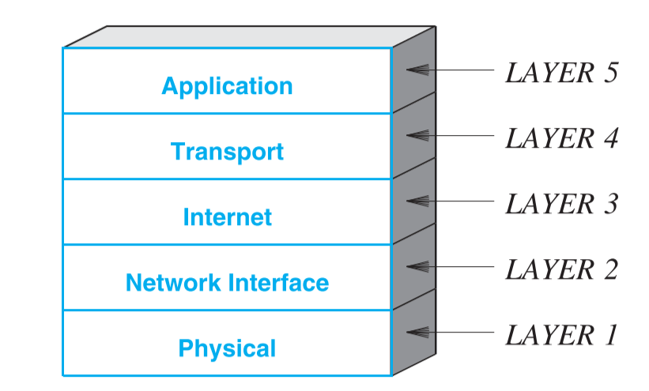
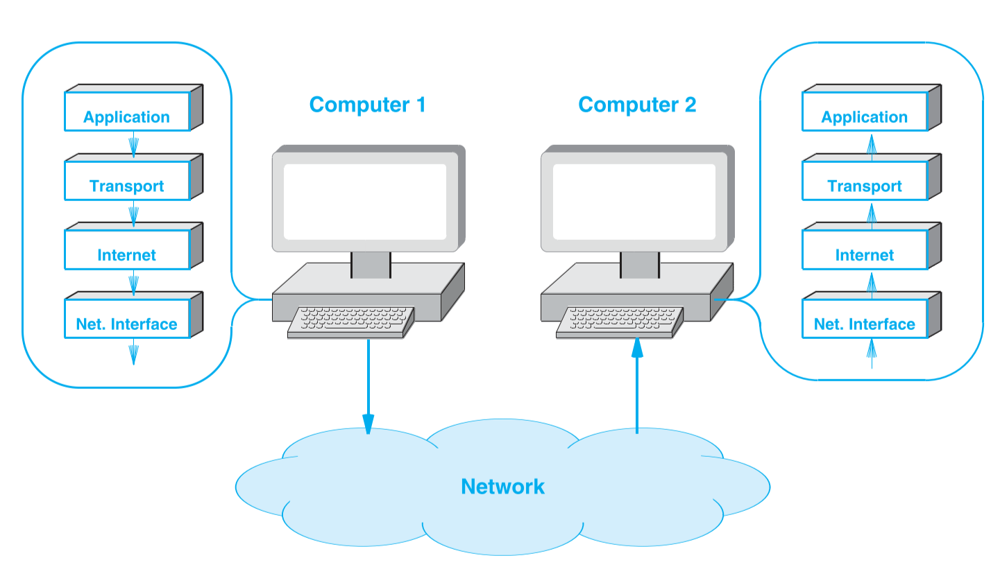
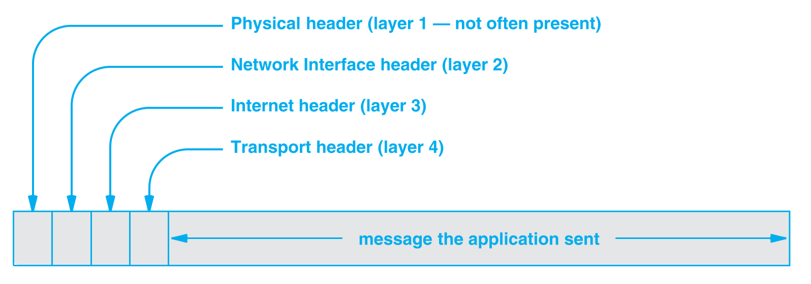
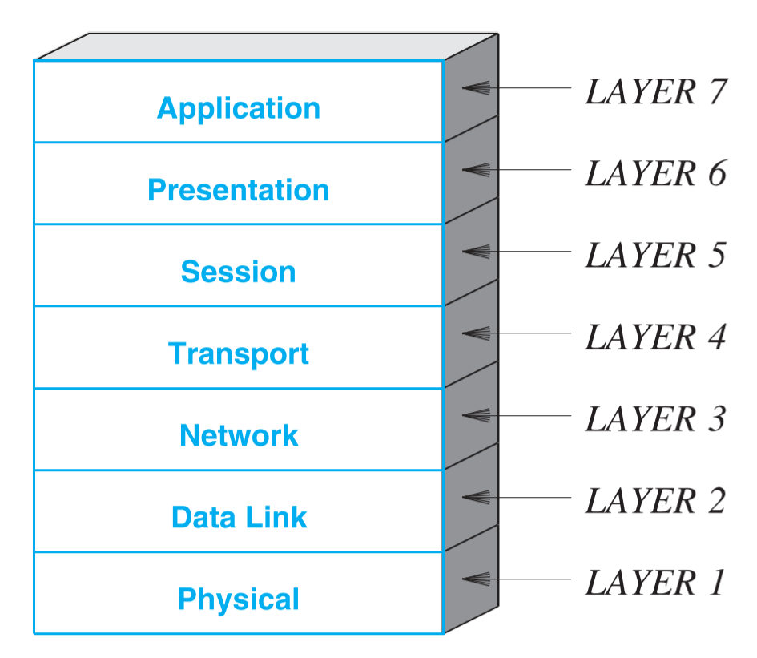



《计算机网络与因特网》 第一章笔记

笼统的介绍了网络的五个关键领域，一些网络基本概念，TCP/IP分组模型，OSI模型等。



<!--more-->

# Chapter1 Introduction And Overview

## 1.1 Growth Of Computer Networking

计算机网络正在持续的爆炸性成长。在1970年代它只是一个非常小范围的研究课题，在1980年也只有几个网站，但到现在计算机网络已经成为了生活中的一部分。

## 1.2 Why Networking Seems Complex

计算机网络是一个高速发展的领域。

对于初学者而言，他可能让人觉得很困惑，因为并没有一个最基础的理论来将计算机网络的所有部分联系在一起。有许多组织都定义了计算机网络的标准，而有时这些标准相互之间并不兼容。

计算机网络用语也并没有一个统一的标准，许多组织都定义过自己一套用语规范，这又很容易让初学者们感到困惑。

## 1.3 The Five Key ASpects of Networking

计算机网络包括五个关键领域：

1. 网络应用与网络编程
2. 数据通信
3. 分组交换与网络技术
4. TCP/IP的网络互联
5. 附加的网络概念和技术

### Network Applications and network programming

用户使用网络服务和设施是基于一个安装在电脑上的应用程序，这个程序可以与其他电脑上的程序通过网络进行交流。网络程序有很多种类，包括邮件，下载器，游览器等。

所有这些程序都是构建在一个单一的、共享的网络上，因此开发者可以使用同一套接口来进行开发。

计算机网络的只是可以帮助开发者更好的开发网络应用。

### Data Communications

数据通信是电子工程的主要领域，它基于一些物理现象来传输数据，是一个较底层的方法。

因为数据通信是基于物理概念，所以乍看起来它与计算机网络的学习并没有太深的关系，但数据通信中的一些关键概念影响了通信规范的制定。例如调制中带宽的概念直接影响了网络的吞吐量。

数据通信也引入了复用的概念，即多个来源的数据可以被组合在一起通过一个共享的媒介进行传输，然后再分开传递给不同的目的地。

数据通信包含了许多底层的细节，他为计算机网络构建了基础。

### Packet Switching And Networking Technologies

通信网络已经从早期的依赖于物理点线进行的点对点电报或电话系统转换为一个通信电路。早期的通过线连接已经转换为通过电交换。

`分组交换（Packet switching）`从最底层的方式改变了网络，是现代网络的基础。多个信息发送者不再需要依赖于专用网络，通过分组交换他们可以通过一个共享的网络来传输数据。

分组交换将数据分为许多小块，称为包`Packets`，包中都包含一个目的地的信息。网络中的设备都包含了如何抵达其他地址的信息，当设备接收到一个包后他会解析包中的数据，并选择一个通路将其送给正确的目的地。

因为计算机网络在设计时有许多不同的需求，例如速度，距离，经济成本等，有许多分组交换技术被发明出来，他们针对不同的需求在细节上存在着一些差异。

### Internetworking with TCP/IP

在一段时间内，许多研究者都致力于找到一个可以满足所有需求的分组交换技术。在1973年，Vinton Cerf 和 Pobert Kahn认为不存在一种分组交换技术可以满足所有的需求，因此他们致力于将不同的技术融合在一起。他们发展了一系列的标准，并最终成为了`TCP/IP协议族(TCP/IP Internet Protocol)`(简称为TCP/IP)。这最终成为了全球网络的基础，并称为计算机网络的一个重要组成部分。

TCP/IP标准成功的一个重要原因是它宽容的异质性。TCP/IP使用了一个虚拟的方法来定义网络不相关的包好网络不相关的检测方法。因此即使分组技术在持续的发展，因为TCP/IP始终可以与新的分组技术共存。

### Additional Networking Concepts And Technologies

除了构造网络的硬件和协议，还有大量的其他技术为网络提供了不同偶给你能。

例如`软件定义网络(Software Defined Networking(SDN))`允许管理者定义和控制网络，`物联网(Internet to Thing)`让嵌入式系统可以通过网络进行交流。

## Public and Private Parts Of The Internet

计算机网络是由`公共网络(Public network)`和`私人网络(Private network)`构成的。

### Public Network

公共网络是`服务提供商(Service Provider)`所拥有的服务，服务商会将服务提供给任何订阅了的个人或组织。这里的公共指的是大众都可以订阅这个服务，并不意味着公共网络传输的数据是被暴露在外，所有人都可以获取的。

### Private Network

私人网络是指网络的使用权被限制在一个组间。如果服务商将服务租赁给了个人或公司，个人或公司仅在自己的范围内使用这个网络，那么它就是私人网络。

私人网络按其大小可以被分类为以下四种：

1. 消费者(Consumer)
2. 小型办公室/家庭办公室(Small Office/Home Office,SOHO)
3. 中小型商用(small-medium Business，SMB)
4. 大型企业(Large enterprise)

## Networks,Interoperability,And Standards

通信至少包含两个实体，信息发送者和信息接受者。为了保证网络中的所有实体都能正确的交流，需要有一个共同的标准。

使用`互操作性(Interoperability)`来表示两个实体是否可以无误的彼此通信。

为了保证实体可以正确的彼此交流，他们需要遵守一系列共同的规则，这些规则被称为`通信协议(Communication protocol/Network protocol/Protocol)`。
1. 在通信发生错误的时候需要采取的行动也是由通信协议来指定。
2. 通信协议可以是底层的，例如电压或信号的制定，也可以高层的，如软件传输的数据类型。

## Protocol Suites And Layering Models

为了避免重复工作，每个协议应该只负责其他协议未包含的部分，因此协议的制定并非是相互独立的。将一系列合作的协议称为`族(Suites/Families)`。族中的每个协议都只关注通信中的一部分，族中的所有协议组合起来就覆盖了整个通信的所有方面。

一个用来将协议分组的基本抽象是`分组模型(Layering model)`，分组模型将所有通信问题分为几个部分，每个部分称为`一层(Layer)`。将所有协议按层分组帮助协议的设计者和实现者有效的控制了问题的复杂度，因为他们只需要关注与网络的一个方面即可。

下图展示了因特网的分组模型，也成为TCP/IP分组模型：

### Layer 1:Physical

物理层的协议指定了传输媒介和相关硬件的细节。电子相关的属性，频率，信号等都属于物理层。

### Layer 2: Network Interface(MAC)

MAC层的协议指定了对网络通信的细节以及网络硬件与Layer3（Internet层）的通信细节。硬件地址，网络地址，网络可支持的最大包数据以及传输媒介的协议等信息都属于网络接口层。

### Layer 3：Internet

因特网层是因特网的基础。因特网地址结构，因特网包的结构，大包拆分成小包的方式，报告错误的方式都属于因特网层。

### Layer 4：Transport

传输层协议提供了计算机上的一个应用与另一台机器上的应用交流的方法。如接收端接收数据的最大速率，避免网络堵塞的方法，和保证接收端按顺序接收数据的技术都属于传输层。

### Layer 5: Application

应用层的协议指定了通过网络交流的应用传输的数据信息的格式和意义，以及需要执行的步骤。如邮件，文件传输，语音电话等的实现都属于应用层。

## 1.7 How Data passes Through Layers

分组模型并不只是为了帮助理解协议，协议的实现满足某一层协议的输出需要匹配相邻层协议的输入。

如下图展示了两台电脑通过网络传输数据的过程：

一号电脑是数据的发送方，二号电脑是数据的接收方。数据从一号电脑的应用层逐渐向下传递，通过接口层进入网络，在进入网络并传输后，通过二号电脑的接口层传入，再向上逐渐传递到应用层。

## 1.8 Headers And Layers

每一层的协议为了保证数据被正确的传递都进行了一些计算。在发送端的每一层中都将一些额外的信息加到了数据包中，对应的，在接受段的每一层中都将解析并移除这些额外的信息。

这些被协议额外加入的数据称为`数据头(header)`。以发送端为例，数据头是在数据逐层向下的过程中一步步被加入的，即传输层增加一些数据头，网络层增加一些数据头，接口层增加一些数据头。因此最终的数据会如下图所示，最靠近原始数据的数据头是最早被添加的：

* 虽然图中每个被添加的数据头大小看起来相同，但实际上都不是一个固定的大小。

## 1.9 ISO And The OSI Seven Layer Reference Model

在因特网模型发展的过程中，有两个组织定义了一个替代的参考模型，称为`开放式系统互联参考七层模型(Open Systems Interconnection Seven-Layer Reference Model)`，简称为`OSI模型`。

这两个组织分别是`国际标准化组织（International Organization for Standardization）`，简称为$ISO$和`国际电信联盟（International Telecommunications Union）(ITU)`中的电信标准部门。

`OSI`协议图如下：

TCP/IP协议比OSI协议更为高效合理，发展和部署OSI协议的工作已经被停滞。许多工作者目前在扩展OSI协议的定义来让其符合TCP/IP，基本是让Network层匹配Internet层，然后再在Session层和Presentation层增加一些支持协议。

虽然许多工程师和商业部门知道`OSI协议`不如`TCP/IP协议`高效，但他们依然处于某些原因在坚持使用。

## 1.10 Remainder Of The Text

书的剩下部分将分为五个部分，基本对应与1.3节中提到的五个重要领域。

第一部分介绍网络应用和网络编程

第二部分介绍数据通信和信息传输

第三部分介绍分组交换以及包数据，另外也会介绍一些网络的基本分类，如局域网和广域网

第四部分将介绍TCP/IP协议族

第五部分介绍剩下的一些网络相关的技术



引用：

1. *Computer Networks and Internets* 6th



***