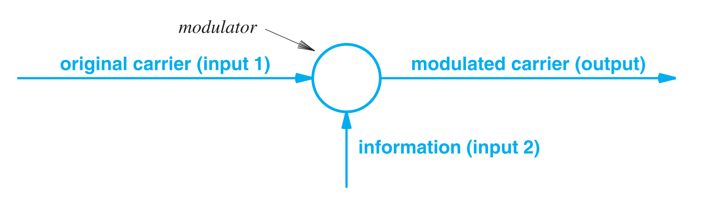
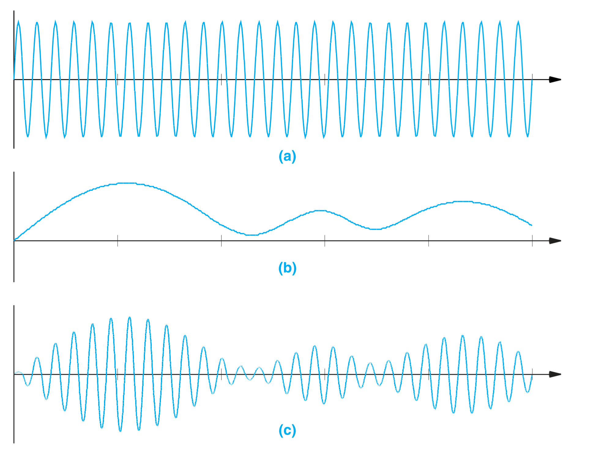
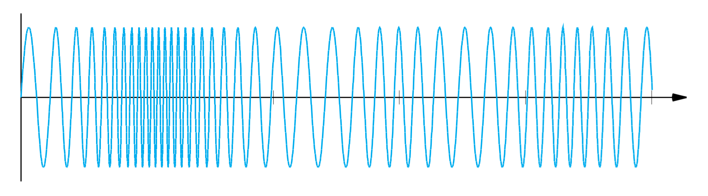
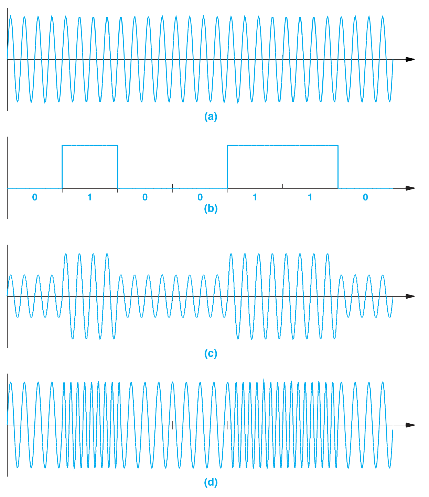
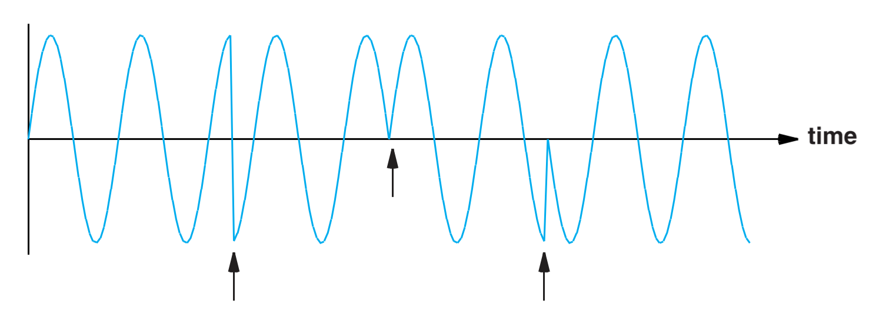
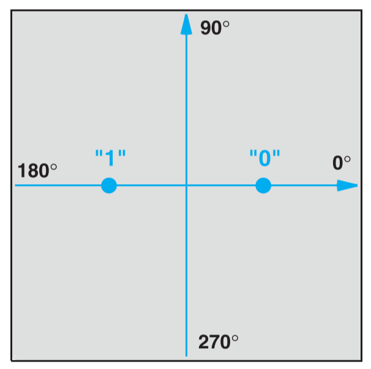
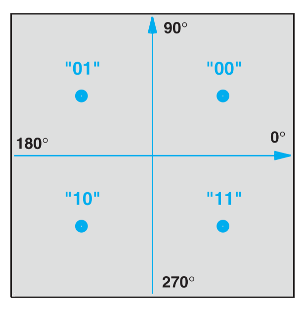
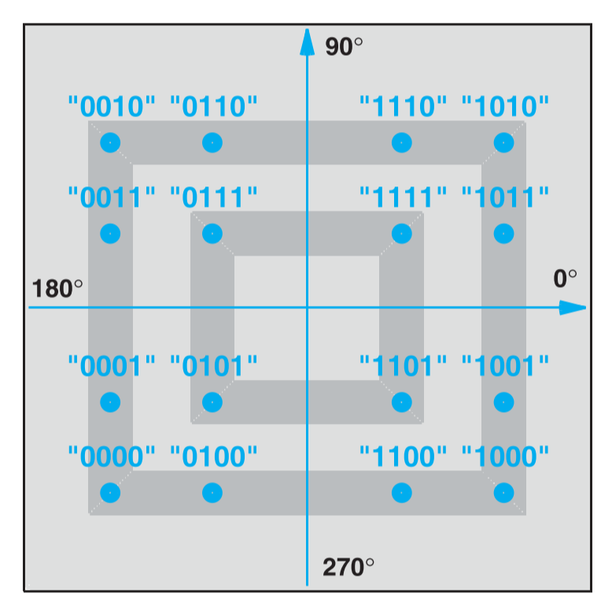
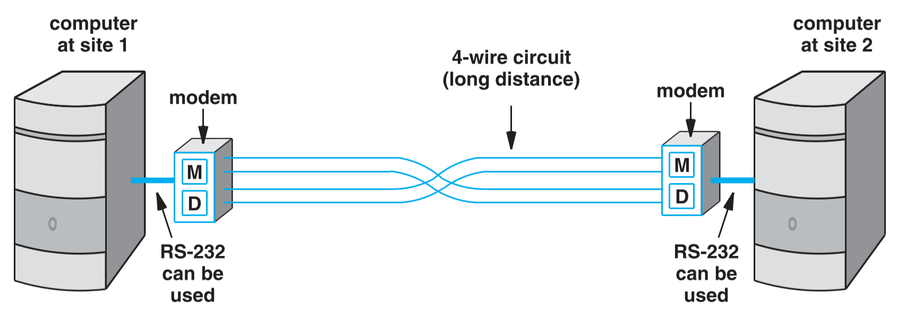
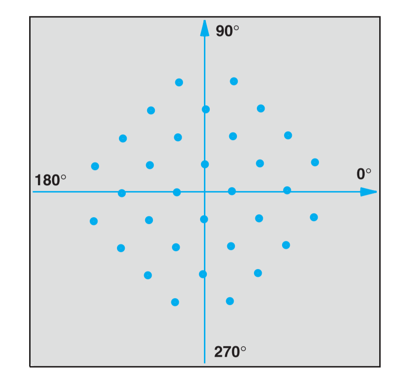

《计算机网络与因特网》 第十章笔记

调制与调制器相关内容。

<!--more-->

# Chapter 10 Modulation And Modems

## Introduction

这一章讨论数据通信中的调制与调制器相关的内容。

调制是利用高频的信息来携带原始数据，将分别讨论当原始数据是模拟信号和数字信号的情况。

## Carriers,Frequency,And Propagation

许多通信系统会利用一个持续震荡的电磁波来作为信息的载波（Carrier），通常这个信号都是一个高频信号。在第七章有提到，信号的频率会影响信号的传播特性，如穿透性，对噪声的敏感性等。

## Analog Modulation Schemes

`调制（Modulation）`意为根据原始信号来改变载波的特性。调制有两个输入，一个是载波，一个是原信号，然后产生一个调制后的载波作为输出。调制的原理图如下：

输入的原信号必须改变载波的一个特性，根据特性的不同可以分为`振幅调制（Amplitude modulation）`，`频移调制（Frequency modulation）`，`移相调制（Phase shift modulation）`。其中前两种最为普遍。

## Amplitude Modulation

`振幅调制（Amplitude modulation）`是根据原信号改变载波的振幅。从时域图上看，调制后的波形的轮廓与原信号基本相同，如下图所示，（a）是高频载波，（b）是原信号，（c）是调制后的信号。

## Frequency Modulation

`频移调制（Frequency modulation）`是根据原信号改变载波的频率，当信号强是，载波的频率增加，反之减少。如下图即为频移调制后的样子：

## Phase Shift Modulation

`移相调制（Phase shift modulation）`是根据原信号改变载波的相位。经过理论上可行，但对于模拟信号来说，很少用移相调制，因为模拟信号采样点的数据可能比较接近，导致移相的大小不明显，很容易被误认为是频率的改变。但对于数字信号来说移相调制因为可以一个码元传递多个Bit的字节，所以经常被使用。

## Amplitude Modulation And Shannon's Theorem

在之前解释振幅调制的示意图中，调制后信号变化幅度较大，最低处的强度接近于0。但实际运用时，基本上振幅调制的幅度变化很小。因为考虑到有噪声的存在，如果信号的变化幅度较大，在信号最弱时的信噪比会很低，则几乎无法传递有效信息。

## Modulation,Digital Input,And Shift Keying

为了区分模拟信号和数字信号的调制，使用属于`移位键控（Shift Keying）`来表示数字信号的调制。数字信号的调制与模拟信号调制基本原理类似，只不过作为原信号的模拟信号是连续的数值变化，而数字信号是离散的几个特定的数值。振幅与频率移位键控如下图，(a)是载波，(b)是原信号，(c)是振幅移位键控，(d)是频率移位键控

## Phase Shift Keying

`相位移位键控(Phase Shift Keying)`是根据原信号突然的改变载波的相位，如下图所示，即为相位移位键控的示意图。

## Phase Shift And A Constellation Diagram

如之前所示，相位移位键控最大的优势在于可以用一个码元传递多个bit。可通过$2^n$个相位来使一个码元可携带$n$ bit数据。使用星座图来表示相位变化大小与该大小与对应数据的关系。星座图如下图所示，图（1）是只有两个相位变化，即表示0和1，图（2）是有四个相位变化，可代表两个bit,即00,01,10,11。

## Quadrature Amplitude Modulation

如上节所述，可以在使用相位移位键控时采用多个相位间隔使一个码元传递多个bit。但某些情况下，硬件无法检测过于精细的相位变化。这时候可以通过降相位移位键控和振幅移位键控结合在一起使一个码元可携带更多的数据，这方法称为`正交振幅调制（Quadrature Amplitude Modulation）`。如下图所示：

如上图，一共有四个相位区分，每个点距离原点的距离代表振幅，一共有四个电压，因此一共有16种组合，一个码元可以携带4个bit。

## Modem Hardware For Modulation And Demodulation

将一系列的数据bit作为输入，然后根据这些原数据对载波进行调制的设备称为`调制器（Modulator）`，反之根据调制后的载波重新解析出原信号的机器称为`解调器（Demodulator）`。在实际中，大部分的通信设备同时包含调制器和解调器，这种设备被称为`调制解调器（Modem）`。下图是两个计算机的通信简图，在两者将数据传给中间的电缆媒介前，都经过了调制解调器

## Optical And Radio Frequency Modems

调制解调器不仅可用于电缆的传输，对于无线电波和光纤也同样适用，原理也一样，在发送端调制解调器对载波进行调制，在接收端，数据从被调制后的载波中会提取。

## Dialup Modems

在语音电话系统中，使用的调制解调器称为`拨号调制解调器（Dialup Modems）`，其与普通的调制解调器最大的区别在于，前者用的是语音信号，后者用的是电信号，而且拨号调制解调器占用的带宽更小。

因为电话系统接受的是模拟信号，所以拨号调制解调器也是一个对模拟信号进行调制的设备。但讽刺的是现代电话系统的中间传输部分是数字信号，于是发送端在调制后，需要将模拟信号转换为数字信号。而在接收端，在进行解调前也需要先将中间传输来的数字信号转换为模拟信号。

## QAM Applied To Dialup

正交振幅调制也同样可用于拨号调制解调器中。因为大部分语音频率本身是从$300HZ\sim 3300HZ$，但拨号调制解调器只能提供$600HZ\sim 3000HZ$，所以同样需要正交振幅调制来使一个码元能携带更多的数据。

## V.32 And V.32bis Dialup Modems

V.32和V.32bis是两个拨号调制解调器用正交振幅调制的标准。

V.32使用32个振幅和相位的组合来表示数据，可以达到单向每秒9600个bit的数据速率。

V.32bis使用128个振幅和相位的组合来表数据，可以达到单向每秒14400个bit的数据速率。



1. *Computer Networks and Internets* 6th



***