《计算机网络与因特网》 第七章笔记。

这一章是关于传播媒介的，首先给出了传播媒介的分类。

然后依次介绍各种媒介，包括线，光纤，红外线等。

最后介绍了信道容量的概念。

<!--more-->

# Chapter 7 Transmission Media

## Introduction

这一章将会给出传播媒介的分类，介绍电磁传播的基本概念以及展示干扰和噪音是如何被屏蔽的，最后会解释容量的概念。

## Guided And Unguided Transmission

有两种重要的将传输媒介分类的方法：

1. 按传播路径：使用`有向（Guided）`和`无向（Unguided）`来描述传播路径。像铜线和光纤这种提供特定路径的方式称为有向。而像无线电这样的传输称为无向。工程师会通俗的将这两种称为`有线(wired)`和`无线(wireless)`，因此光纤也算在有线的范畴。

2. 按能的形式：分为三种类型，在线缆上的`电信号（Electrical Energy）`，无线上使用的`无线电（Radio）`和光纤中使用的`光（Light）`。

## Taxonomy By Forms Of Energy

下图展示了按能的形式分类的图，这个分类图也不是完美的，例如在无线电部分分为`陆地无线电（Terrestrial Radio）`和`卫星无线电（Satellite）`，但实际上太空空间站的无线电部分两者都不符合。

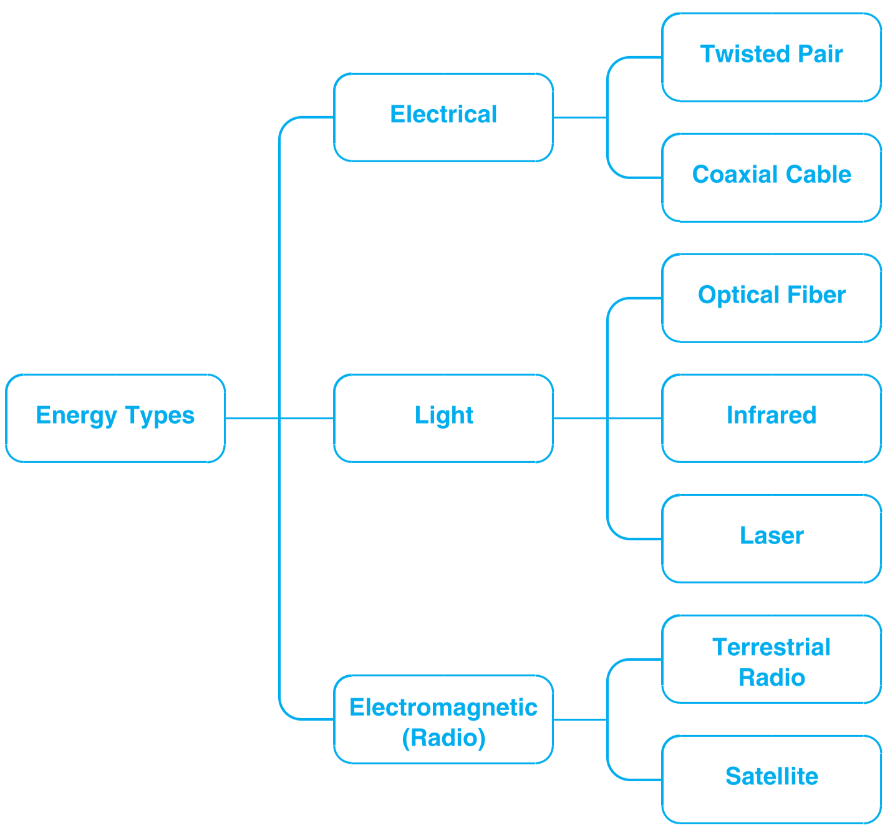

## Background Radiation And Electrical Noise

所有用电信号传输的电路都需要两根线，一根用来将信号传递给接收方，一根用来将反馈还给发送方。最简单的电传输方式就是使用两根铜线，每根线都用塑料包裹住，来防止相互之间的电干扰，在两根线外还有一层整个包裹起来，为了人方便使用。

但在线缆形式下有许多改进，这主要是因为电信号有以下特征：

1. 环境中有随机的电磁辐射，称为`噪音（Noise）`，如霓虹灯和电机就会发出随机的辐射。一般来说通信系统在正常运行状态下就会产生少量的噪音。
2. 当电磁辐射遇到金属会被吸收进而产生细微的信号，这些信号会对正常的信号造成干扰。
3. 正因为金属能吸收电磁辐射，所以可以用足够的金属放在噪声源和通信系统间，将其作为`防护（Shield）`。

## Twisted Pair Coppter Wiring

有三种形式的电缆可以减少电磁噪音的干扰：

1. 非屏蔽双绞线（Unshielded Twisted Pair,UTP）
2. 同轴电缆（Coaxial cable）
3. 屏蔽双绞线（Shielded Twisted Pair,STP）

第一个形式，非屏蔽双绞线在通信中被广泛应用。如名字一样，双绞线是将两根铜线缠绕在一起的形式，这种相互缠绕的形式比两根线平行排布有更好的抗干扰性。如下图所示，（a）为平行排列，蓝线更接近辐射源，于是它相对于灰线吸收了更多的能量，而在（b）图的缠绕形式中，两根线都各有一部分更靠近辐射源，所以整体来说，两者收到的能量是相同的。

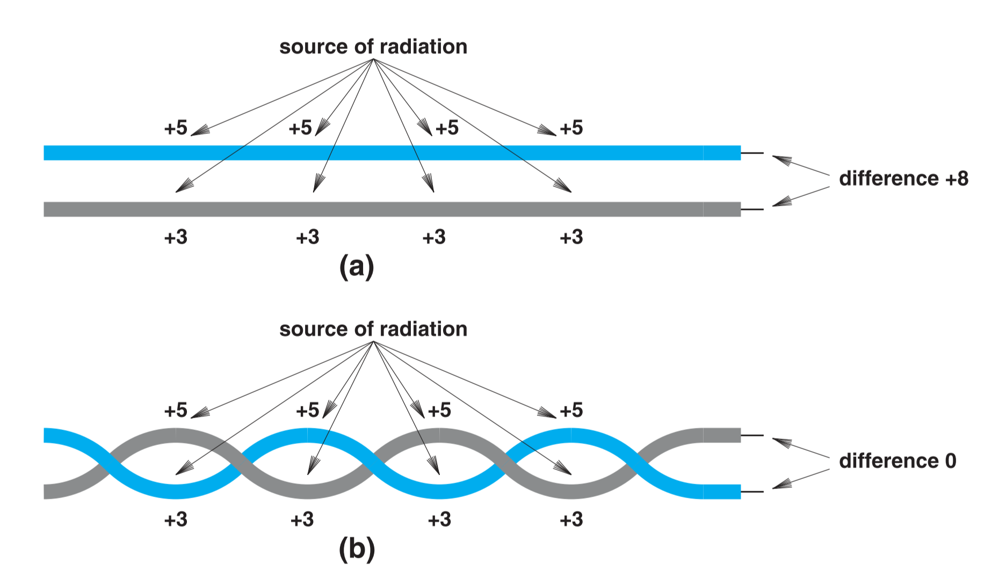

## Shielding：Coaxial Cable And Shielded Twisted Pair

因为非屏蔽双绞线只是让两根线吸收了相同的能量，但噪音还是被吸收了，所以在一些情况下，非屏蔽双绞线仍然会产生问题，如有特别强的电噪音环境，或者特别接近噪声源，或者通信系统中的信号频率很高（频率越高对噪音越敏感）。为了解决这些问题，只能尽量的屏蔽噪声。

一种方法就是`同轴电缆（Coaxial Cable）`，它在线材的外层增加了一层`编织金属屏蔽(Braided metal shield)`（如网状）。使用编织样的金属层而非一整块金属层主要是处于便携性的考虑（后者的屏蔽性更好），但相对于非屏蔽双绞线，同轴电缆的便携性还是差的。如电视的信号线，一般都是同轴电缆，同轴电缆如下图所示：

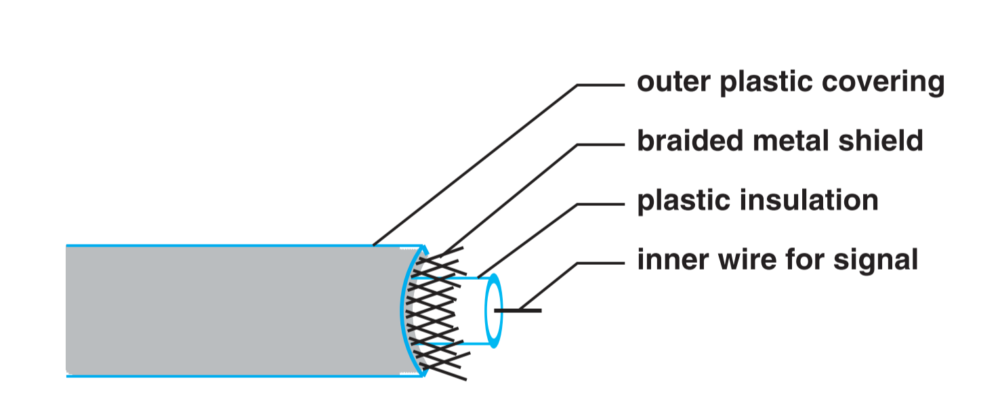

屏蔽双绞线则是非屏蔽双绞线和同轴电缆的混合，是两者形式的折中，他在一对或多对双绞线的外层使用了更薄的金属屏蔽层，很多情况下用铝来作为金属屏蔽层（铝更软）。

如之前节所述，为了避免铜线间的电干扰，铜线外层会包裹一层塑料。双绞线是将两个两个包裹着塑料的铜线绞在一起，同轴电缆则是在一根包裹住塑料的导线外包裹金属屏蔽层，屏蔽双绞线是在两根包裹着塑料的铜线绞在一起后再包裹金属层。

## Categories Of Twisted Pair Cable

一些标准机构为用于计算机网络的双绞线定义了标准，这些机构包括`美国国家标准组织（American National Standards Institute，ANSI）`，`通信产业联合（Telecommunications Industry Association，TIA）`，`电子产业联合（Electronic Industries Alliance，EIA）`，下图为主要分类：

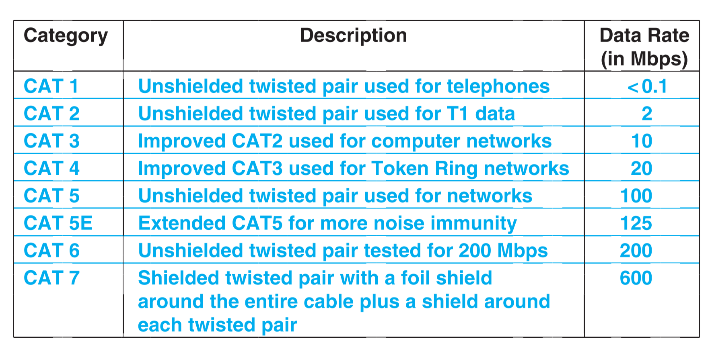

## Media Using Light Energy And Optical Fibers

有三种形式的媒介是用光能携带数据的：`光纤（Optical Fibers）`，`红外线传输（Infrared transmission）`，`点对点激光（Point to Point lasers）`。

其中最重要的类型是光纤：

1. 每根光纤都是一根包裹在塑料外层中的细玻璃线或者透明塑料。
   
2. 光纤是用于单项传播的。在光纤的一段是一个激光或者LED，用来发射光，另一端是连接一个感光设备用来检测光。如果数据需要双向传播，则需要用到两根光纤。多根光纤用塑料封壳包裹在一起生成光纤电缆。

光纤无法被弯折成直角，但光纤仍然可以弯曲，甚至可以弯曲成一个直径小于2英寸的圆，让光纤在弯折状态下仍然可以正常工作，主要是因为光的传播特性。

光从一个低密度物质照射入另一个高密度物质，随着入射的角度不同，光的反应也会不同。存在一个特定的角度，当光以这个角度入射时，光会随着两个物质的交界处传播。当光的入射角大于这个角度时，光会被反射。当光的入射角小于这个角度时，光会发生折射。如下图所示：

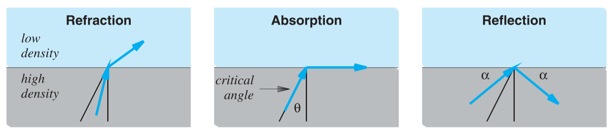

光纤运用的是光的反射，有一个特殊的镀层（Cladding）与光纤共同形成一个边界，在传输过程中，光会在上下两个边界内反射前进。

但反射的过程中是存在能量损耗的，而且因为光的反射，光传播的路径是比光的直线传播要长的，因此光在光纤一段发射后，抵达另一端时能量会更低，而且会更分散（Dispersed），如下图所示：

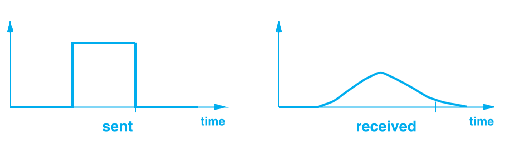

上图中，因为接受时的能量更低，所以Y轴值更低，且因为能量更分散，所以接受的时间也会拖长，因此在X轴上如同被拉伸。

## Types Of Fiber And Light Transmission

因为光在传输中的反射导致的分散在长距离使用光纤时会成为严重问题，因此有三个种类的光纤，不同的在性能与价格上权衡，

1. 跃变型多模光纤（Multimode，step index fiber）：这种类型的光纤，光纤与镀层中的边界很陡峭，因此光会在边界内频繁的反射，造成大量的能量分散，但是这种光纤价格最便宜。

2. 渐变型多模光纤（Multimode，graded index fiber）：这种类型比跃变型多模稍贵，但是能减少反射进而有更少的能量分散。
   
3. 单模光纤（Single mode fiber）：这种类型的光纤最贵，但也有最低能量分散。通常用于长距离传输和高比特率的传输。

如之前节所述光纤的一端会用来发射光，另一端会用来接收光。在发射端，可以通过`发光二极管（Light Emitting Diode，LED）`，或者`激光二极管（Injection Laser Diode，ILD）`。在 接收端可以用`感光细胞（Phote-sensitive）`或者`光敏二极管（Photodiode）`。

## Optical Fiber Compared To Copper Wiring

光纤的优势：

1. 对电噪音免疫
2. 更少的衰减（相对于铜线而言）
3. 更高的带宽

铜线的优势：

1. 更低的价格
2. 更少的设备要求（光纤的接收端必须被有效的抛光）
3. 更不易被损坏

## Infrared Communication Technologies

`红外线通信（Infrared Communication）`也是光能通信的一种，也是点对点技术的一种,电视遥控机就是红外线通信的应用。红外线的频率在人眼可见光的范围外，但是红外线仍然表现的如同可见光，它会很快的消散，可以在坚硬光滑表面反射，会被不透明物体阻挡，薄如纸片的物体会阻挡信号，甚至大气中的水气都会阻碍信号。

因此红外线通信适用于室内使用，适用于距离短且无阻挡的通信。

下图是三种红外线通信的常见技术：

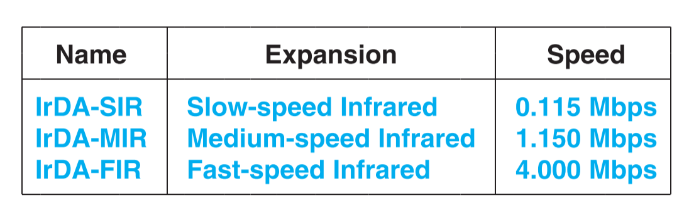

## Point-To-Point Laser Communication

`激光通信（Laser Communication）`是另一种点对点通信，如红外线通信一样，激光通信也需要一个无阻挡的路径。

但与红外线通信不同的是，激光通信只能覆盖很小的一片区域，激光的宽度通常只有几厘米（这里是宽度，并不是指长度），也正是因为激光的宽度很窄，所以激光传输的接收条件是比较苛刻的，通常是被永久的固定安装。

激光通信的典型应用是楼与楼之间的信号传输，通常在相邻大楼的外墙或者顶楼安装部署用于激光通信的发射和接收装置。

## Electronmagnetic(Radio) Communication

常用`无向性（unguided）`来描述不需要任何介质来传播能量的通信方式。在计算机网络中最常用的依赖于电磁能的无向性技术是无线电传播（Radio Frequency Transmission）。无线电传播相较于光传播有个显著的优势，即可以长距离传播且可穿透阻碍物。

电磁能的使用依赖于他的频率属性，常用`波谱（Spectrum）`来描述可能的频率范围。全球的各政府分配不同频率的使用权，例如在美国是`联邦通信委员会（Federal Communications Commission）`。下图是主要的能量频率波谱，其中无线电的范围基本是$3KHZ$到$300GHZ$。

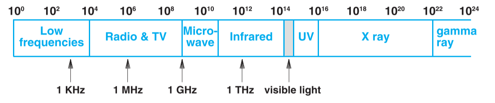

## Signal Progagation

电磁波的频率也决定它传播时的特性，下表是波传播的三大类型：

| 分类 | 频率范围    | 传播类型                           |
| ---- | ----------- | ---------------------------------- |
| 低频 | < 2 MHZ     | 沿地球表面传输，可能会被地形阻挡   |
| 中频 | 2 到 30 MHZ | 在大气层中反射传播，尤其是在电离层 |
| 高频 | >30 MHZ     | 直线传播，会被障碍物阻挡           |

无线技术也可被分为以下两类：

1. 地表（Terrestrial）：依赖相对贴近地表的设备通信，例如无线电发射器和微博发射器。这些设备一般安装在山顶，人造塔或建筑上。
2. 非地表（Nonterrestrial）：依赖于大气层外的设备，例如轨道卫星

## Types Of Satellites

通信卫星可以根据距离地表的距离分为三类：

1. `近地轨道卫星（Low Earth Orbit,LEO）`：

  有低延迟的优点，但是与地球的相对位置变化的较快，接收端需要追踪卫星。

2. `中地球轨道卫星（Medium Earth Orbit,MEO）`：
   
  为地球南北极提供信号的椭圆轨道卫星。

3. `对地静止轨道卫星（Geostationary Earth Orbit,GEO）`：

  与地面可以保持固定角度，缺点是离地球较远，延迟大。

## Geostationary Earth Orbit(GEO) Satellites

从上节对于通信卫星的描述可以看出，通信卫星的权衡主要是在延迟和与轨道周期的权衡（轨道周期与地球自转相差越远，追踪卫星越难）。

这里以`对地静止轨道卫星（Geostationary Earth Orbit,GEO）`为例，对地静止轨道卫星的距离地表距离约为35805千米，计算过程如下：

因为卫星保持在轨道上，所以离心力与万有引力相等，即

$$
{\omega}^2mr=\frac{GMm}{r^2} \\\\
化简为：\\\\
r^3=\frac{GM}{w^2}\\\\
其中，G是万有引力常数为6.67\times 10^-20 {km}^3/kg\cdot {s^2}，M是地球质量为5.976\times 10^{24} kg\\\\
\omega 为角速度，如果要求对地静止，即角速度与地球自转相同，即\\\\
\omega = \frac{2\pi}{3600*24}=7.29\times10^{-5} rad/s\\\\
都代入上式，求得r=42172 km，减去地球半径6376km，得对地静止轨道卫星的距离地表距离约为35805千米。
$$

卫星距离如果不足这个数值，其旋转速度就会比地球快，在这个距离下，卫星与地表以相同的速度转动，所以地表上的卫星追踪装置在追踪到卫星后就不需要再次运动，因为两者的角度不会发生变化。但对地静止轨道卫星的最大缺陷是信号的延迟，信号的速度以光速计算，信号的一次来回需要：

$$
2\times \frac{35.8\times 10^6 \text{ meters}}{3\times 10^8 \text{meters/sec}}=0.238 sec
$$

0.2秒的延迟在许多领域上是无法被接受的。

## GEO Coverage Of The Earth

在对地静止轨道上的卫星数量是由限制的。为了避免星号键的相互干扰，卫星与卫星间必须有间隔，间隔的大小与信号的强度相关，但通常而言是4-8度，因为整个轨道是360度，所以对地静止轨道上最多有45-90颗卫星。

最少则需要三颗卫星来覆盖整个地球，如下图所示：

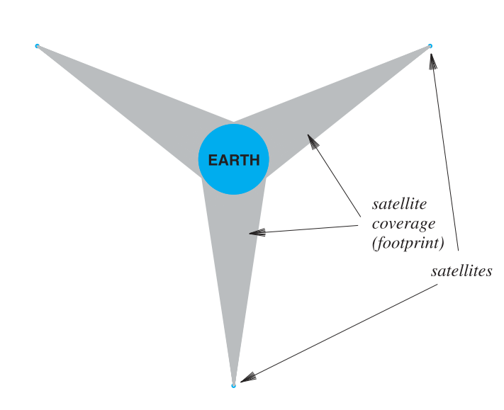

证明如下，首先根据透视原理，距离一个球体越近，能看到球体的部分越少。在距离球体无限远的距离，最多也只能看到球体的50%，如下图所示：

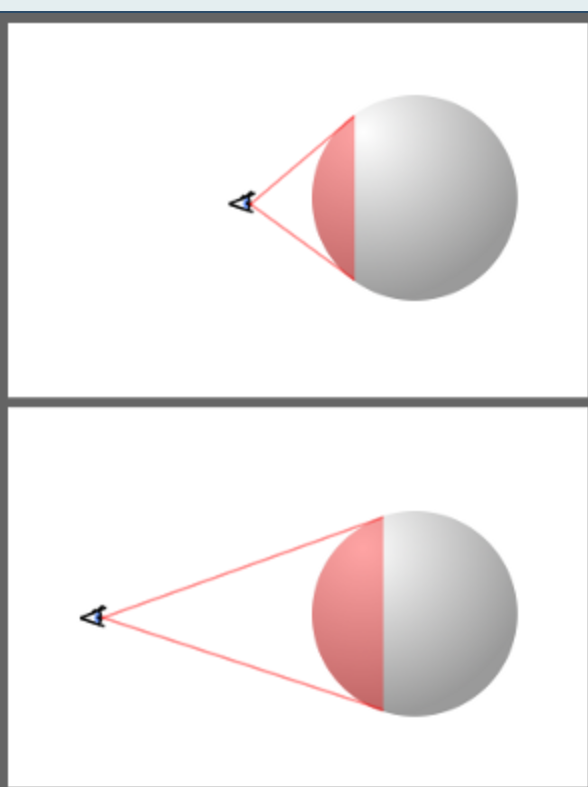

将能看到球体的百分比设为X，离球体的距离设为d，求的半径设为R，表达式为：

$$
X=\frac{50\%}{1+\frac{R}{d}}
$$

式子是由等比三角形得出的，如下图：

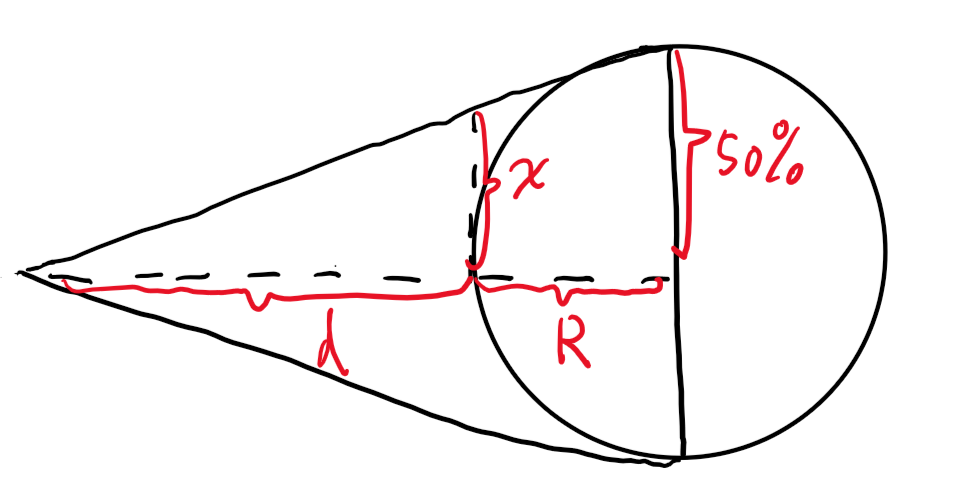

将地球半径6376KM及对地静止轨道距离35805KM代入，得能看到的范围是约为42.45%，所以最少需要三颗卫星才能覆盖地球。

## Low Earch Orbit(LEO) Satellites And Clusters

近地轨道卫星的高度最多为2000千米，其主要的缺点在于无法与地面保持相同速度，因此地面上的天线必须旋转来追踪卫星。最低的近地轨道卫星在大约90分钟就可以环绕一遍地球，移动速度还是将对较快的，因此对于地面天线来说追踪有一定难度。

通常的解决方式是用卫星群（Clustering）或者阵列部署（Array Deployment）的卫星来解决追踪问题。一系列卫星一同工作来覆盖较大的区域。

如一条信息需要从欧洲传到北美，欧洲的地面基站向此时他上方的卫星发送数据，上方的卫星将信息在卫星群之间传播，一直传送到北美上方的卫星，北美上方的卫星再将信息传送给北美的地面基站。

## Tradeoffs Among Media Types

通信媒介的选择是复杂的，通常需要从以下几个方面权衡：

1. 花费（Cost）：材料，安装，操作，维护等的开销
2. 数据速率（Data rate）：每秒可以传送多少数据
3. 延迟（Delay）：数据传播和处理的延迟
4. 信号影响（Affect on signal）：信号是否会衰减和失真
5. 环境（Environment）：对干扰的敏感性和电子噪音
6. 安全性（Security）：是否容易被窃听

## Measuring Transmission Media

可以从两个方面来评判传输媒介：`传播延迟（Progagation Delay）`和`信道容量（Channel Capacity）`。

`奈奎斯特第一准则（Nyquist Theorem）`表明在理想低通信道下的最高码元速率速率是带宽的2倍。假设有K个电平，则一个码元能传输的bit数为$log_2K$，B表示信道的带宽，因此数据速率可以表达为：

$$
D=2Blog_2K \text{ bits /s} 
$$

下面证明奈奎斯特准则：

一个有限带宽的低通滤波器，如果其截至频率为$\omega_g$其频域图如下：

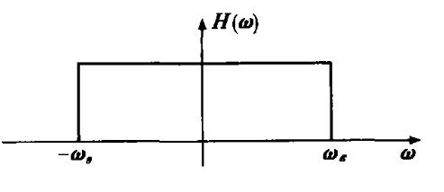

该滤波器的时域相应图为：

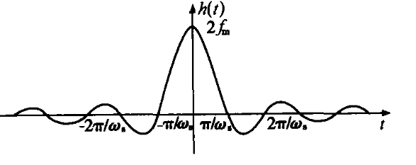

时域的相应波形时一个拖尾的连续信号，这个拖尾会干扰后续信号。但是从波形上可以看出，在$t=\frac{\pi}{\omega_s},\frac{2pi}{\omega_s}...$处是0，所以如果在这些间隔点发送码元，则不会被干扰。这些点的间隔时间为$T_s=\frac{\pi}{\omega_s}=\frac{1}{2f_m}$，所以码元速率为$R=\frac{1}{T_s}=2f_m$

## The Effect of Noise On Communication

奈奎斯特定理提供了了理论上的最高码元速率，因为他并没有将噪音纳入考虑， 而实际中噪音不可避免。香农在此基础上给出了考虑噪音的数据速率，称为香农定理（Shannon's Theorem）：

$$
C=B\log_2(1+S/N) bits/s
$$

其中$S/N$称为信噪比，式子中并没有给出电平数量K，这是因为实际上在考虑噪声时，电平数量是受噪声影响的，噪声越大，为了避免干扰，电平的间隔就只能越大，因此电平数量就越少。

## The Significance Of Channel Capacity

奈奎斯特定律鼓励工程师探索更高效的编码方式，因为在最高码元速率受信道带宽限制时，编码方式越高效，一个码元携带的数据就越多，单位时间内就能传输更多的比特。

香农定理给出了真实环境下，数据速率的上限，即无论编码多么高效，在非理想环境（有噪声）下，每秒最大的比特传输量



1. Xianping, W.M.L.R.T., 2002. Simple Certification of Nyquist Rule. Journal of Beijing Institufe of Petrochemical Technology, (2), p.12.

2. https://zh.wikipedia.org/wiki/%E5%9C%B0%E7%90%83%E9%9D%9C%E6%AD%A2%E8%BB%8C%E9%81%93

3. *Computer Networks and Internets* 6th



***