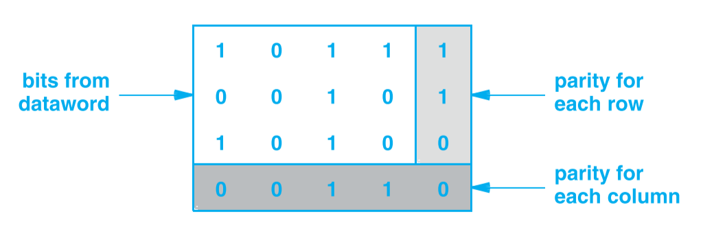
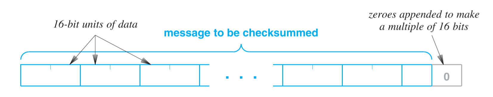
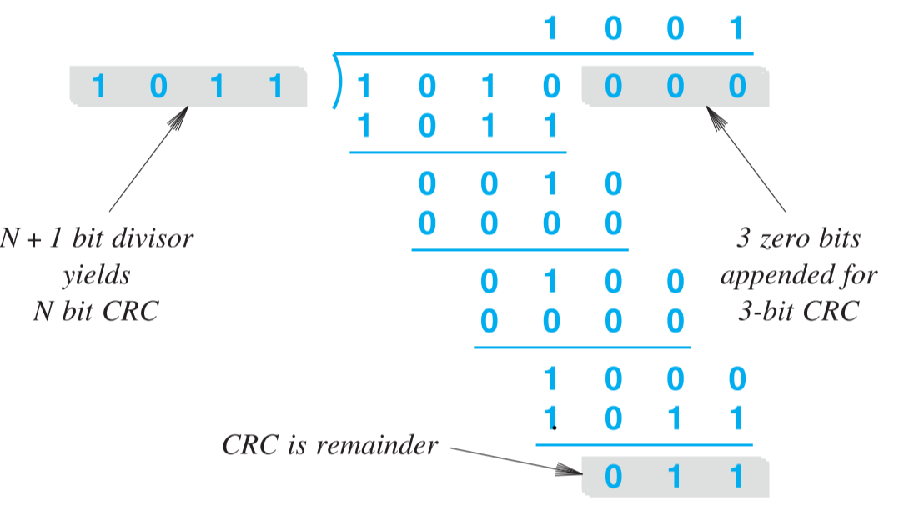
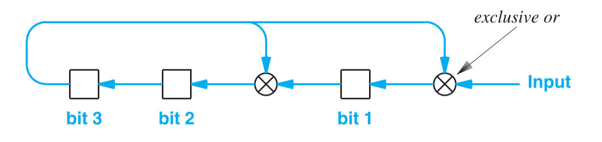

《计算机网络与因特网》 第八章笔记。

给出了可能出现的错误，以及控制错误的信道编码方法，包括检测错误和修复错误。


<!--more-->

# Chapter 8 Reliability And Channel Coding

## Introduction

这一章介绍在通信过程中会出现的错误，以及控制错误的技术。

其中的一部分也被纳入了因特网的协议中，这也会在本章中介绍。

## The Three Main Sources Of Transmission Errors

传输中发生的错误可以分为三大类：

1. 干扰（Interference）：如第七章所述，环境中存在许多电磁干扰，这些电磁干扰会阻碍无线电传输和线缆中的信号传输。
2. 失真（Distortion）：所有的物理系统都会造成信号的失真。光纤中的光因为移动距离的增加，时域会发生扩张（频域也因此变化）。信道容量会导致一些频率的信号被过滤掉。放在线缆旁边的金属可能会改变线缆内信号的频率，金属也能干扰无线电信号。
3. 衰弱（Attenuation）：信号在媒介中传输的过程中，信号会逐渐衰弱。

香农定理给出了介绍错误的思路：提高信噪比。

但无论如何噪声不可能被完全的消除，所以许多方法致力于检测错误，在某些情况下自动修复错误。

但是错误的监测机制无疑是会为系统增加开销的，因此系统设计时要考虑在错误影响与错误检测开销间做权衡，如金融系统，1bit的错误可能会造成很严重的错误，但是在图片中1bit的错误可能根本无法被识别到。

## Effect Of Transmission Errors On Data

这里要区分传输错误与数据错误，数据是由传输信号在经过例如解码，解调后得到的。传输错误最后都会导致最后的数据出错。主要有三类传输造成的数据错误：

1. 单元位错误（Single Bit Error）：即一系列数据中，只有一位数据被改变了。这通常是因为传输信号的短时间（称为脉冲，Spike）干扰造成的。
2. 突发性错误：一系列数据中有多位数据被改变，通常是由长时间的干扰造成的。错误长度是由错误开始位到错误结束位直接的位数决定。如下表，错误的数据由加粗表示，错误长度是7：
   
   | 发送 | 1   | 0   | 1     | 1   | 0     | 0   | 0     | 1     | 0     | 1   | 1   |
   | ---- | --- | --- | ----- | --- | ----- | --- | ----- | ----- | ----- | --- | --- |
   | 接收 | 1   | 0   | **0** | 1   | **1** | 0   | **1** | **0** | **1** | 1   | 1   |

## Two Strategies For Handling Channel Errors

有一系列的方法解决数据错误并增加数据的可靠性，这些方法统称为`信道编码(Channel Coding)`，这些方法可以被分为两类：`前向错误纠正技术（Forward Error Correction，FEC）`，`自动重传请求技术（Automatic Repeat reQuest，ARQ）`。

前向错误纠正技术的主题思想是在发送的数据中增加额外的信息，接收端可以根据这些额外信息来判断是否有错误发生，有些方法可以检测出究竟是哪一位数据发生了错误，并在可能的情况下纠正错误。

自动重传请求技术是让接收端和发送端互换数据来保证数据被正确的传递。

## Block And Convolutional Error Codes

前向错误纠正技术可以再细分为两类：

1. 分组错误码（Block Error Codes）：分组错误码是将数据分成一块块的，然后对每一块都增加额外信息。每一块的额外信息只针对于该块数据本身。
2. 卷积错误码（Convolutional Error Codes）：卷积错误码是将数据看作一系列bits，增加的额外信息是由当前的bit和之前的bit共同决定的。

卷积错误码相对于分组错误码需要更多的计算，但是也更能检测出错误。

## An Example Block Error Code：Single Parity Checking

单一奇偶校验检查（Single Parity Checking）是分组错误码检测的一个例子，可以再分为偶校验检查和奇校验检查。如果将数据分为$n$ bit一组，那么每一组增加一位数据，当是偶校验时，$n$位数据+1位额外数据应该一共有偶数个1，当是奇校验时，$n$位数据+1位额外数据应该一共有奇数个1。下表为8位数据时的例子：

| 原始数据 | 偶校验 | 奇校验 |
| -------- | ------ | ------ |
| 00000000 | 0      | 1      |
| 01011011 | 1      | 0      |
| 01010101 | 0      | 1      |

单一奇偶校验是一个比较弱的信道编码，他只能检测错误，但无法检测出错误具体出现在哪一位，也无法纠正错误。而且当有偶数个位发生错误时，错误就无法被检测出来。

## The Methematics of Block Error Codes And (n,k) Notation

如有$k$位bit的数据，我们将所有$2^k$种可能出现的数据称为`数据字(Datawords)`，在这些数据中增加$r$位额外数据，一共有$n=k+r$个数据，所有$2^n$种可能称为`编码字(codeworks)`，其中编码字中合法的部分，即额外添加的数据与原数据时符合规则的部分，称为`码书(Codebook)`，并将这种方法标记为$(n,k)$

如单一奇偶校验中,$k=8,r=1$，因此一共有256个数据字，也对应了有256个合法的编码字，一共有512个编码字。

在理想状态下，合法编码字中的任一一位被改变了，改变后的编码字就不是合法编码字。但是在单一奇偶校验的例子中，如果同时改变了合法编码字中的两位，那么结果仍然是一个合法编码字。

没有一个信道编码可以达到理想状态，所以要考虑的就是，合法编码字最少多少位数据要被同时改变，才能产生另一个合法编码字。在单一数字编码中，这个位数为2。

## Hamming Distance：A Measure Of A Code's Strength

汉明距离（Hamming Distance）是用来测量一个合法编码字要转换为另一个合法编码字最少要改变的数据位数的方法中需要用到的概念。如果给定两个$n$长度的字符，两个字符的汉明距离就是两个字符间不同的数据数量。

如$d(000,001)=1,d(000,101)=2,d(000,111)=3,d(101,001)=1$。

可以先对两个字符求异或，然后计算异或出来的字符1的总数，即为汉明距离。

## The Hamming Distance Among String In A Codebook

为了计算出一个合法编码字要转换为另一个合法编码字最少要改变的数据位数，先要计算出码书中所有编码字组合的汉明距离。如对2位bit数据进行单一奇校验检测：

| 数据字 | 编码字 |
| ------ | ------ |
| 00     | 001    |
| 01     | 010    |
| 10     | 100    |
| 11     | 111    |

一共有4个编码字，4个编码字一一配对一共有6种可能，$d(001,010)=2,d(010,100)=2,d(001,100)=2,d(010,111)=2,d(001,111)=2,d(100,111)=2$。6种可能中最小的汉明距离是2，所以最少需要更改2位数据才能从一个合法编码字变为另一个合法编码字。

因此计算从一个合法编码字转换为另一个合法编码字最少要改变的数据位数过程是，计算出所有码书中的编码字（即合法编码字）两两配对后的所有汉明距离$d_{min}$，其中的最小值即为所求值。

## The Tradeoff Between Error Detection And Overhead

对于一个编码，最多的能被检测出来的错误位数为$e=d_{min}-1$，如单一奇偶校验，因为$d_{min}=2$，所以最多能正确检测出来的错误位数为1。

虽然$d_{min}$越大能检测出来的错误位数越多，但这也意味着要增加更多的额外数据，对于$(n,k)$的编码，工程师用编码率（Code Rate）$R=\frac{k}{n}$来表示为了检测出错误信息的编码开销。

## Error Correction With Row And Column(RAC) Parity

奇偶校验本身是不能进行错误纠正的，但是通过`行列奇偶校验（Row And Column Parity）`就可以做到。如一共有12个bit的原始数据，即$k=12$，排成三行四列每一列每一行都进行奇偶校验，增加一个额外位，则一共8个额外位，即$r=8，n=k+r=20$，因此这是一个$(20,12)$的编码，如下图所示：



因此如果一位数据出错，会同时在对应的行和列校验位感知到，因此就可以定位到错误的数据，取反后就能纠正数据。

奇偶校验数据的$d_{min}$还是2，因此如果错误的位数大于1，当是偶数时无法被检测到，当是奇数时虽然能检测出错误，但无法纠正。

## The 16-Bit Checksum Used In The Internet

有个称为`因特网校验和（Internet checksum）`的信道编码方法在网络中扮演了重要角色。这个算法的输入可以是任意长度，将输入拆分为一段段16字节的的部分，如果不能长度不能被16整除，则最后补0。如下图所示：



算法的流程如下：

1. 将输入拆分为以16-bit为一组
2. 定义一个32-bit的变量（这里称为$C$）作为结果。
3. 将每一组16-bit的数据累加给$C$
4. 将$C$的前16位累加给后16位
5. 将$C$的后16位取反，如果取反后全是0，则将其改为全是1
6. 此时$C$的16位即为校验和。

可以看出最后的校验和也是16位的数据，将校验和作为新的一组16-bit放在原数据后（经过了补0的原数据）发送出去。接收端接受信息后重复算法流程，如果数据没有发生错误，最后接收端计算出的校验和应该是FFFF。

下面以两个例子进行说明：
1. 例子1
   如果发送端输入数据为`0100 1000 0110 0101`，`0110 1100 0110 1100`，`0110 1111 0010 0001`，计算过程如下：
    ```text
       0100 1000 0110 0101
       0110 1100 0110 1100
    +  0110 1111 0010 0001
    ----------------------------
    1  0010 0011 1111 0010
    ```

    将高16位移到后16位
    ```text
      0010 0011 1111 0010
    +                   1
    -------------------------
      0010 0011 1111 0011 
    ```
    取反后得到：
    ```text
    1101 1100 0000 1100
    ```
    这即为校验和

    对于接收端，因为将校验和也一并发送了过去，所以接收端的计算过程如下：
    ```text
       0100 1000 0110 0101
       0110 1100 0110 1100
       0110 1111 0010 0001
    +  1101 1100 0000 1100
    ----------------------------
    1  1111 1111 1111 1110
    ```

    将高16位移到后16位
    ```text
      1111 1111 1111 1110
    +                   1
    -------------------------
      1111 1111 1111 1111 
    ```

    取反后得到：
    ```text
    0000 0000 0000 0000
    ```
    因为全为0，所以改为全为1
    ```text
    1111 1111 1111 1111
    ```

2. 例子2
    如果发送端输入数据为`1111 1111 1111 1111`，`1111 1111 1111 1111`，`0000 0000 0000 0001`，计算过程如下：
    ```text
       1111 1111 1111 1111
       1111 1111 1111 1111
    +  0000 0000 0000 0001
    ----------------------------
    1  1111 1111 1111 1111
    ```

    将高16位移到后16位
    ```text
      1111 1111 1111 1111
    +                   1
    -------------------------
    1 0000 0000 0000 0000 
    ```
    此时虽然高16仍然有数值，但不需要再次累加，后16位取反后得到：
    ```text
    1111 1111 1111 11111
    ```
    这即为校验和

    对于接收端，因为将校验和也一并发送了过去，所以接收端的计算过程如下：
    ```text
       1111 1111 1111 1111
       1111 1111 1111 1111
       0000 0000 0000 0001
    +  1111 1111 1111 1111
    ----------------------------
    10 1111 1111 1111 1110
    ```

    将高16位移到后16位
    ```text
      1111 1111 1111 1110
    +                  10
    -------------------------
    1 0000 0000 0000 0000 
    ```

    取反后得到：
    ```text
    1111 1111 1111 1111
    ```

## Cyclic Redundancy Codes(CRCs)

在高速网络中，有一个称为`循环冗余码(Cyclic Redundancy Codes,CRCs)`的信道编码方法。循环冗余码有三个主要优点：

1. 可以对任意长度的数据进行计算
2. 可以充分的检测出错误
3. 可以通过硬件实现，所以非常的高效

求$CRC$的计算过程可以看作是两个二进制数的相除，一个代表原数据，一个代表一个特定的除数（可根据不同的情况设置，除数的设置决定错误检测的能力），如果需要求得$N$长度的$CRC$，则需要$N+1$长度的被除数。二进制数相除的过程可以看作是多项式相除，如果原数据是$1010$，除数设置为$1011$，则计算过程如下图：



## An Efficient Hardware Implementation Of CRC

CRC算法的实现硬件是由`移位寄存器(Shift Register)`和`异或门(Exclusive or gates)`构成的。在计算CRC前，硬件会初始化将移位寄存器中的所有位改为0，上例中的除数$1011$，对应的硬件图如下：



TODO：为什么这么设计的原因。

## Automatic Repeat Request(ARQ) Mechanisms

自动重传请求技术（Automatic Repeat Request,ARQ）需要发送端和接收端传递信息来检测错误。当一方发送数据给另一方时，接收方需要传递一个回执给发送方。如果在一段时间后发送方仍然没有收到回执，则认为数据丢失，重新发送数据。

自动重传请求技术适合只能检测错误，但不能修复错误的系统。当接收方检测出数据有错误后，将数据丢弃并不传递回执，那么发送方就会再次发送数据。



1. *Computer Networks and Internets* 6th
2. [多项式除法](https://en.wikipedia.org/wiki/Polynomial_long_division)
3. [1's Complement Arithmetic](https://heasarc.gsfc.nasa.gov/docs/heasarc/ofwg/docs/general/checksum/node11.html)



***