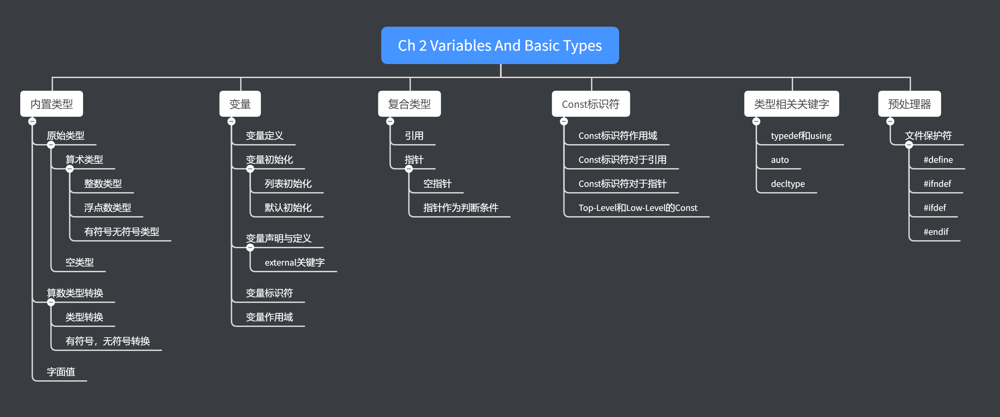
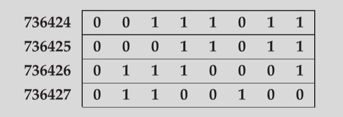
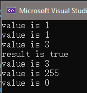
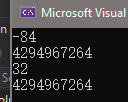
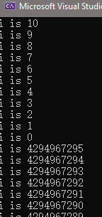



《C++ Primer》 第二章笔记，关于变量与基本类型。





<!--more-->

# Chapter 2 Variables And Basic Types

## Primitive Built-in-Types

C++的内置类型（Primitive Type）包括算数类型和空（Void）。算数类型可以用来表示字符，整数，布尔值，浮点数。

### Arithmetic Types

算数类型（Arithmetic Types）可以再细分为整数类型（Integral types）和浮点数类型（Floating-point types）。

> 算数类型的大小，即占用多少个bit，在不同的设备上是不同的

C++标准保证了每个类型的最小尺寸，编译器可以给类型分配大于最小尺寸的位数。因为位数的变换，每一个类型所能表示的最大值和最小值也会相应的变换。

C++有的算数类型如下：

| 类型        | 含义           | 最小尺寸           |
| ----------- | -------------- | ------------------ |
| bool        | 布尔值         | Not Available      |
| char        | 字符           | 8 bits             |
| wchar_t     | 宽字符         | 16 bits            |
| char16_t    | Unicode 字符   | 16 bits            |
| char32_t    | Unicode 字符   | 32 bits            |
| short       | 短整数         | 16 bits            |
| int         | 整数           | 16 bits            |
| long        | 长整数         | 32 bits            |
| long long   | 长整数         | 32 bits            |
| float       | 单精度浮点数   | 精度为6位有效数字  |
| double      | 双精度浮点数   | 精度为10位有效数字 |
| long double | 额外精度浮点数 | 精度为10位有效数字 |

> long long 是C++ 11 后才支持的特性

> 一个char的大小应该保证可以容纳一个设备的基础字符集，通常尺寸为8 bits。wchar_t,char16_t和char32_t都是为了扩展字符集。

> 布尔值，字符和各种整数，都是整数类型。

内存可以分配的最小单元是byte，存储的基本单元为word。在c++中，byte的大小是可以容纳机器基本字符集的大小，通常为8 bits。word的大小通常为32 bits或者64 bits，即4到8 bytes。

> 通常编译器会提供给浮点数比最低要求更高的精度，float一般表示7位有效数字，double表示16位有效数字。通常float用1个word表示，double用两个words表示，long double用3或4个words表示。但要注意的是这些精度与尺寸都不是固定的，可能儿因设备的不同而不同。

大多数的计算机都会给每个byte分配一个地址。如在一台8-bit byte和 32-bit words的电脑上，一个word的内存如下，可以说是地址在736424的word或地址在736427的byte。



数据的类型决定了编译器会如何处理这些内存，即多少bit的数据会被认为是一个数据以及该如何翻译这些内存。

### Signed and Unsigned Types

除了布尔值和扩展字符集的字符（如wchar_t等），所有的整数类型都可以被分类为有符号（signed）与无符号（unsigned）。

默认的类型，如int，short，long和long long都是有字符的，可以通过加上相应的`unsigned`关键字得到无字符版本，如`unsigned long`。`unsigned int`被缩写为`unsigned`。

但是对于char类型，有三个类型`char`，`signed char`，`unsigned char`三个版本。`char`是`signed char`或`unsigned char`中的一种，具体是哪一种由编译器决定。

标准并没有定义有符号类型如何表示数据，但是定义了正数部分和负数部分应该是均匀的分割，如8-bit的 signed char，应该保证能覆盖$-127 \sim 127$的范围。大多数现代设备的实现下，char表示的范围是$-128\sim127$。

> 数据定义建议：
> 1. 如果确保数值不会是负数，使用unsigned类型
> 2. 通常情况下使用int，short的可定义范围太小，如果数值大于了int可表示范围，使用long long。之所以不使用long，是因为在许多设备的实现下，long和int的大小是相同的。
> 3. 在算数表达式中，不要使用char和布尔值。char类型在不同的设备下，可能是signed char可能是unsigned char，这个会导致bug的发生。布尔值则会被解释为0或1，可能与设想的结果不同，建议直接用0或1来表达。
> 4. 使用double进行浮点数计算。一是因为float通常没有足够的精度，二是因为单精度和双精度的开销差距几乎可以忽略不计，三是因为对于一些设备而言，双精度反而会有更高的效率。

### Type Conversions

类型转换会在使用一个类型的对象，但希望得到另一个类型的对象时自动进行。

如下列代码

```cpp
bool b = 42;
cout << "value is " << b << endl;
int i = b;
cout << "value is " << i << endl;
i = 3.14;
cout << "value is " << i << endl;
if (i)
	cout << "result is true" << endl;
double pi = i;
cout << "value is " << pi << endl;
unsigned char c = -1;
cout << "value is " << (int)c << endl;
signed char c2 = 256;
cout << "value is " << (int)c2 << endl;
```

结果为



规则如下：

1. 如果将一个非布尔值的算数类型赋值给布尔值，如果该数据值为0，则布尔值为false，否则为true。
2. 如果将布尔值赋值给算数类型，如果布尔值是true，则值为1，否则值为0。
3. 如果将浮点数类型赋值给整数类型，整数类型将保留浮点数的整数部分。
4. 如果将整数类型赋值给浮点数类型，则浮点数的小数部分为0。
5. 如果给unsigned类型赋值了超过其能表达的范围的数，结果为值与unsigned类型范围的取模。如上例中，`unsigned char c = -1`，值为最大能表达的数$256-1$（测试电脑char为8-bit）。
6. 如果给signed类型赋值了超过其能表达的范围的数，结果是未定义的，虽然在这里的测试中，结果为0。
但结果在不同电脑，不同编译器，甚至不同的运行时间都会不同，结果是不可预知的。

#### Expression Involving Unsigned Types

当signed与unsigned数一起计算时，signed会被转换为unsigned，如下面代码所示：

```cpp
unsigned u1 = 10, u2 = 42;
int i = -42;
cout << i + i << endl;
cout << i + u1 << endl;
cout << u2 - u1 << endl;
cout << u1 - u2 << endl;
```

结果为：



第二个表达式值为4294967264，因为在计算时$i$被转换为了unsigned,值为$2^{32}-42$（32次方是因为int用32-bit表示），因此整个式子的结果为$2^{32}-42+10=4294967264$。

同理第四个式子直觉上结果应该为-32，但因为是unsigned的，所以结果为$2^{32}-32=4294967264$。

在使用unsigned作为循环条件时尤其要注意，如下式：

```cpp
for (unsigned i = 10; i >= 0; i--)
{
	cout << "i is " << i << endl;
}
```

结果会变成死循环：



因为在i变为0后，执行`i--`，i将变成$2^{32}-1$，而不是-1。

* 因此不要将signed和unsigned混用，即使是知道隐式转换的规则。因为在不同的设备下，用以表达unsigned类型的字节数是可能是不同的，这将会导致隐式转换后的结果不同。本例子中，int为32-bit表达，但并不保证所有的设备都是用32-bit表达int。

### Literals

#### Integar and Floating-Point Literals

可以使用十进制，八进制或者十六进制来写整数字面量。以`0`开始的字面量会被认为是八进制，以`0x`或者`0X`开始的字面量会被认为是十六进制。

以下的三个表达是等效的，结果都是十进制的20。

```cpp
int i_decimal = 20, i_octal = 024, i_hexadecimal = 0x14;
cout << "i decimal is " << i_decimal << endl;
cout << "i octal is " << i_octal << endl;
cout << "i hexadecimal is " << i_hexadecimal << endl;
```

三个表达是等效的，结果都是十进制的20。

```cpp
int month = 09;//error, 09 is treated as octal
```

上式无法通过编译，因为0开头的字面值会被认为是八进制数，而数字9不会出现在八进制数中。

十进制的字面值会被默认是有符号的，八进制和十六进制则可以是无符号也可以是有符号的。即十进制的字面值类型会被认为是`int,long,long long`之中最小的满足值的类型。八进制或十六进制则会在`int,unsigned int,long,unsigned long,long long, unsigned long long`中选择最小的满足的类型。

如果字面值的大小超过long long 或unsigned long long所能匹配的值，则无法匹配任意一种类型，编译器将会报错，如以下语句无法通过编译：

```cpp
//cout << 9223372036854775808 << endl;
//cout << -9223372036854775808 << endl;
```

因为这是10进制的字面值，其最大类型为long long，而signed long long的范围是$-9223372036854775808 \sim 9223372036854775807$。$-9223372036854775808$虽然在范围内，但仍然无法被编译，因为十进制的字面值并不会被认为有负号，即$-9223372036854775808$会被认为是一个$0减去9223372036854775808$，即仍然计算的是$9223372036854775808$。

> 这里谈论的限制都是C++标准的限制，但是有些编译器的实现会与标准不同，如上述代码在visual studio 2019中可通过编译，这是因为编译器将其自动转换为了unsigned long long 类型

浮点数的字面值用十进制的小数点或者用科学计数法（符号E表示），如下:

```cpp
cout << 3.14159 << endl;   //3.14159
cout << 3.14159E0 << endl; //3.14159
cout << 3.14159E1 << endl; //31.14159
cout << 0. << endl;//0
cout << 0e0 << endl;//0
cout << .001 << endl;//0.001
cout << 1E-3 << endl;//0.001
```

默认的所有浮点数字面值的类型为double。

#### Character and Character String Literals

单引号之间的字符会被认为是char字面值，双引号之间的字符会被认为string字面值。如

```cpp
cout << 'a' << endl;	   //a
cout << "Hello" << endl;   //Hello
```

string字面值是const char的数组，编译器会自动在数组的最后加上一个空白字符，即`\0`，所以string的真实长度比看上去的字符数大1。如'a'长度为1，"a"长度为2。

两个string字面值如果中间只有空格，或tab或者换行符，会被认为是一个string字面值，如

```cpp
cout<<"This is first string literal"
		"This is second string literal"<<endl;
```

#### Escape Sequences

一些无法显示出来的字符（如回车）和一些有特殊含义的字符可以使用转义序列（Escape sequence）表示。

一些常用转义序列

| 转义符 | 作用    | 转义符 | 作用                      |
| ------ | ------- | ------ | ------------------------- |
| \n     | 换行    | \t     | 水平 tab                  |
| \v     | 纵向tab | \<\*>  | 打印出特殊符号\*，如" ' \ |

也可以使用数字和转义符来生成转义序列，假设编译器使用的是[`Latin-1`字符集](CPPPrimer-Chapter2-Notes/"https://kb.iu.edu/d/aepu")。可在`\x`后跟1或多位十六进制数组，或在`\`后跟着1至3位八进制数字，如以下代码都将显示一样的结果：

```cpp
cout << "M\n";	 //M
cout << "\115\12"; //M
cout << "\x4d\xA"; //M
```
* 这里的\115后跟着的是八进制数，转换为十进制为77，可在Latin-1表中得知，77表示为M。同理\12表示十进制10，表示为LF，即换行。

* 跟在`\`后的数字最多只会被计算前三位，如`\1234`将会被认为是转义序列`\123`和一个普通的4。而`\x`之后跟着的所有数字都会被计算,如`\x1234`会被认为后面跟着16-bits的十六进制数（一个16进制数是4-bits），但是大多数的硬件都是使用8-bits char的，所以通常来说，两位十六进制数就足以表示字符表了。

#### Specifying the Type of a Literal

可以通过前缀或后缀来指定整数、浮点数以及字符字面值的类型。字符字面值用前缀，整数及浮点数字面值用后缀。

字符字面值类型指定如下表所示：

| 前缀                     | 类型     |
| ------------------------ | -------- |
| u                        | char16_t |
| U                        | char32_t |
| L                        | wchar_t  |
| u8（只能用于string类型） | char     |

整数字面值指定如下表所示:

| 后缀     | 最小类型  |
| -------- | --------- |
| u 或 U   | unsigned  |
| l 或 L   | long      |
| ll 或 LL | long long |

> 整数字面值设定的是最小类型，即最终的类型还是会根据字面值的大小来调整
> 指定有无符号的类型后缀可以和指定长度的类型的混合使用

浮点数字面值指定如下表所示：

| 后缀   | 类型        |
| ------ | ----------- |
| f 或 F | float       |
| l 或 L | long double |

指定字面值类型示例代码如下所示：

```cpp
cout << 9223372036854775808ULL << endl;
cout << L'a' << endl;
cout << u8"hi" << endl;
cout << 1E-3F << endl;
cout << 0.001F << endl;
cout << 3.14159L << endl;
```

## Variables

C++中的每个变量（Variables）都有类型。

### Variable Definitions

简单的变量定义由一个类型指示器（Type Specifier）跟着一个或多个由逗号分割的变量名称组成，以分号结束。如：

```cpp
int sum = 0, value, units_sold = 0;
```

### Initializers

当变量定义在同个语句中定义多个变量时，每个变量在声明后马上可见，即后续的变量可以用前面的变量来初始化，如：

```cpp
double price = 109.99, discount = price * 0.16;
```

在C++中初始化（Initialization）和赋值（assignment）是两个不同的操作，在许多语言中这两者的区别几乎可以忽略。但是在C++中两者的区别却很重要，初始化是一个变量在创建时给予参数的过程，赋值是变量已经生成后由新的参数替代原先参数的过程。

* 在后续的章节中会进一步讨论两者的差异。

### List initialization

C++有多种方法来初始化变量，如下所示：

```cpp
int units_sold = 0;
// int units_sold(0);
// int units_sold = {0};
// int units_sold{0};
```

这四者都是初始化的方法，其中后两种带有大括号的是C++11的新特性，称为列表初始化（list initialization）。

如果使用列表初始化，那么在初始化变量的过程中不允许出现精度的丢失，如下所示：

```cpp
long double id = 3.1415926536;
float ifloat{id};
int a{id}, b = {id};
```
> 书中描述编译器会禁止丢失精度的赋值，但在gcc 8.1.0的版本测试下，编译器只是给出了warning

### Default Initialization

当定义一个变量但没有给初始化数值时，参数会被赋予默认值。在任何函数外的未赋值变量会被初始化为0，在函数内部的未赋值内置变量则不会被初始化。未初始化的变量值是未定义的（Undefined），访问或拷贝任何未初始化的值都会产生错误。

> 这里的描述仍然是C++的标准定义，但是不同的编译器会有不同的实现，如在gcc 8.1.0版本中，函数内部的未赋值变量仍然会被初始化为0。但要知道未定义的操作在不同的版本或设备下很可能有不同的结果，所以应该尽可能避免。

### Variable Declarations and Definitions

C++支持单独编译（Separate Compilation），即可以把整个程序放在多个文件中，每个文件可以独立的被编译。

为支持单独编译，C++需要区分声明（Declaration）和定义（Definition）。

`声明`是为了让程序知道变量的名称。如果一个文件需要使用在其他地方定义的变量，那么在这个文件中需要对该变量进行声明。声明一个变量需要指定它的类型和名称。

`定义`是创建相关的变量。定义一个变量首先会先声明该变量，然后再为该变量开辟存储空间，并赋予初始值。

每个变量都只可以被定义一次，但可以被声明多次。

可以使用关键字`external`来指定操作是声明而不是定义，不允许在函数内部使用external关键字。

如上所属，声明是不包括函数的初始值的，所以如果一个声明包含了对变量的初始化，那么该声明实际上是定义（在后续章节中可以看到，对于const变量会需要同时使用external和初始化）。如下所示：

```cpp
//Declarations and Definitions
extern int i;			   // Declares but does not define i
int j;					   //declare and defines j
extern double pi = 3.1416; // declare and defines pi, same with expression without extern
```

为了在多个文件中使用同一个变量，必须在`一个文件`中定义该变量，在其他文件中声明（不包括定义）该变量。

### Identifiers

C++中的标识符（变量名称）由字符，数字和下划线构成，C++并没有限制名称的长度。

### Scope of a Name

作用域（Scope）是指一个变量在程序中存在意义的部分，在C++中绝大部分的作用域都是通过大括号（`{  }`）进行分割的。

#### Nested scopes

作用域有的时候会形成嵌套，如果产生嵌套的话，外部作用域（Outer scope）中定义的参数可以被内部作用域（Inner scope）使用，如果内部作用域定义了一个与外部作用域中某变量名字相同的新变量，外部作用域中的变量将会被隐藏，但可以使用操作符`::`来访问被隐藏了的变量。

如下所示，其中定义在所有函数外的变量有`全局作用域(Global scope)`，否则的话有`代码块作用域(block scope)`。

```cpp
int reused = 42; //global scope

int main()
{
  int unique = 0;							   //block scope
  cout << reused << " " << unique << endl;   //42 0
  int reused = 0;							   //local named reused hidesglobal   reused
  cout << reused << " " << unique << endl;   // 0 0
  cout << ::reused << " " << unique << endl; // 42 0
}
```

其中第二个输出中的reused变量是在内部作用域中新定义的变量，因此值为0。第三个输出中的reused使用了`::`操作符访问了全局变量中的reused,所以值为42。

## Compound Types

复合类型（Compound Type）是根据其他类型定义的一种类型，C++有多种混合类型，在这里会先介绍两种，引用（Reference）和指针（Points）。

### References

> 在C++11中引入了右引用(rvalue reference)和左引用(lvalue reference)的概念。但通常来说，当提及引用时都是指左引用。

引用（Reference）是一个物体的别名，引用类型指代另一个类型。

一个引用创建时会绑定至另一个变量，成为它的别名。当引用创建后无法重新绑定至其他变量，因此引用创建的时候必须被初始化。

```cpp
int ival = 1024;
int &refVal = ival;
// int &refVal2; //error,must be initialized
// &refVal = reused; //error,can not be rebinded
refVal = reused;//Not rebingding, is to change ival's value
```

#### A Reference Is an Alias

如之前所述，引用不是物体，而是另一个物体的别名，所以对引用的任何操作实际上都是对被绑定的物体的操作。如下：

```cpp
int ii = refVal;	   //Bound to ival
int &refVal3 = refVal; //the same value as ival
```

#### Reference Definitions

引用符号`&`是针对变量名称而言的，所以每个引用在定义的时候前面都需要加上引用符号。

另外除了在2.4节（const reference可以绑定至任意可转换的对象）和15.2节提到的两个特殊情况，引用类型必须和被捆绑的值类型一致，且引用类型不能捆绑至字面值。

```cpp
int i = 1024, i2 = 2048;
int &r = i, r2 = i2; //r is int refernece, r2 is int
// int &refVal4 = 10; //error, can't be bound to literal
double dval = 3.14;
// int &refVal5 = dval; //error, types not match
```

### Pointers

指针（Pointers）是一个“指向”别的类型的符合类型。

与引用不同的是，指针是一个物体，因此它可以被拷贝和赋值，在指针的生命周期内，它可以被指向多个不同的物体。而且指针在定义时并不一定要被初始化，但与其他的内建类型一样，在代码块作用域中的指针如果未被初始化赋值，则它的值是未定义的。

与引用相似的是，在定义每个指针变量的时候，都需要在前面加上指针符号`*`。

#### Taking the Address of an Object

一个指针包含另一个物体的地址，可通过取地址符(&)来获得一个对象的地址。

与引用类似，除了在2.4节（pointer to const可以绑定至nonconst对象）和15.2节阐述的特殊情况外，指针所指向的对象类型必须与指针类型相同。如下列代码所示：

```cpp
//Points
int *ip1, *ip2; //define int pointer without initializer
double dp, dp2; //dp is double, dp2 is double pointer
int ival = 42;
int *p = &ival; //p hold the address of ival
double dval;
double *pd = &dval; //Initializer is the address of a double
double *pd2 = pd;   //Initializer is a pointer to double
// int *pi = pd;		//error,pointer types not match
// int *pi2 = &dval;   // error,pointer types and object typenot match
```

#### Pointer Value

一个指针的值，可以是以下四种情况：

1. 指向一个对象的地址
2. 指向一个对象地址后的第一个byte
3. 空指针，不指向任何对象
4. 非法指针，除了上述三个情况的指针都是非法指针。

使用非法指针的结果是未定义的，具体的结果由不同的编译器决定。虽然情况2和3是合法的，但是访问这两种情况的指针结果也是未定义的。如

```cpp
int *ip = &ival;	 //Pointer to ival
int *ipEnd = ip + 1; //Pointer to end of ival
int *ipNull = NULL;
cout << (*ip) << "  " << (*ipEnd) << endl; // 42 0
```

虽然在这里的测试中`(*ipEnd)`返回的值为0，但实际上这是未定义操作，在不同的编译器会返回不同的结果。

#### Using a Pointer to Access an Object

当使用指针访问变量时，需要使用解引用符号`*`。如上节代码中的`(*ip)`。

* 尽可能避免解引用那些非法或者没有指向具体对象的指针。

&和\*符号现在都有多个含义，&既可以表示为引用，又可以表示取地址符号，\*既可以表示指针，又可以表示解引用符号。它们在代码中的具体含义由上下文决定：

```cpp
int i = 42;
int &r = i;							 //reference
int *pp;							 //pointer
pp = &r;							 //address-of operator
*pp = i;							 //dereference
int &r2 = *pp;						 // reference and dereference
cout << (r2) << "" << (*pp) << endl; //4242
```

#### Null Pointers

空指针（Null Pointers）并不指向任何对象，代码可以在使用指针前检查其是否为空。

有三种方法定义空指针，如下所示：

```cpp
int *p1 = nullptr; // c++ 11
int *p2 = 0;
int *p3 = NULL;
```

nullptr是C++11标准中引入的特性，它是一个特殊的字面值，可以转换为任何指针类型。NULL定义在头文件`cstdlib`中，它使用预处理器(`#define`)转换为0，所以使用NULL和使用0来定义空指针实际上是等效的。

* 尽量使用nullptr

虽然可以用0来表示空指针，但并不能将int变量直接赋值给指针，即使该变量值为0也不行，如下：

```cpp
int zero = 0;
// p3 = zero; //error, can't assign an int to pointer
```
#### Assignment and Pointers

指针和引用都是对对象的间接访问，但引用是对象的别名，且引用本身并不是一个对象，但指针是一个对象，它存储另一个对象的地址。

引用在初始化后无法修改其本身绑定的对象，指针可以在生命周期内修改它所指向的对象。

#### Other Pointer Operations

指针可以用来作为判断条件，如果指针为0（空指针）则为false，任何非空指针都为true。

可以比较两个指针是否相同（== 或 !=），如果两个指针包含的地址是一样的，则两者相同。

如果用了非法的指针来作为判断条件或判断是否相同，结果是*未定义的*。

#### void* Pointers

void*类型是一个可以包含任何类型的对象的地址的特殊类型。如下所示：

```cpp
double obj = 3.14, *pdd = &obj;
void *pv = &obj;//pv can hold a pointer to any type
pv = pdd;
```

但无法通过void\*对其指向的对象进行操作，因为void\*无法得知对象的具体类型，也就无法解释对象，如下：

```cpp
// cout << (*pv) << endl;//error,can't operate in the object void* addresses
```

void*更多的是用来处理内存方面的工作。

### Understanding Compound Type Declarations

#### Defining Multiple Variables

如之前所述，引用和指针的定义是跟着变量名字的，因此可以在一个定义中同时定义普通变量，引用和指针。如:

```cpp
int i = 1024, *p = &i, &r = i
```

&和*符号可以写在类型后面，也可以写在变量前面，如下面两个式子是等效的：

```cpp
int* p;
int *p;
```

但为了避免误解，即认为引用和指针的定义是跟着变量类型的，推荐使用第二种方式。

#### Pointers to Pointers

指针是内存中的一个对象，所以可以创建指针指向另一个指针对象，如下所示：

```cpp
int ival = 1024;
int *pi = &ival;
int **ppi = &pi;
cout << "Direct value is " << ival << endl;//Direct value is1024
cout << "Indirect value is " << *pi << endl;//Indirect valueis 1024
cout << "Double indirect value is " << **ppi << endl;//Doubleindirect value is 1024
```

C++并没有限定指针的个数，因此可以进一步定义`***pppi`等。

#### Reference to Pointers

因为引用并不是一个对象，所以不可能存在引用的指针，但可能存在指针的引用，如下：

```cpp
int i = 42;
int *p;
int *&r = p;
r = &i; //make p point to i
*r = 0; //make i's value to 0
```

重点是语句`int *&r = p`，该语句的操作符比较多，为了很好理解，可以从变量名逐渐向外层读。变量名是r，离变量名最近的操作符是`&`，因此r是一个引用，外层的操作符是`*`，因此r是指针的引用，再外层是`int`，所以r是int指针的引用。

## const Qualifier

可以使用const限定词来限制一个变量在初始化后不会被改变。

#### Initialization and const

const限定的变量必须被初始化，初始化的语句可以是任何复杂的表达式，且用于初始化的变量并不一定要是const的。

const变量的初始化如下所示：

```cpp
const int kk = getSize();
// const int k; //error, const value must be initialized
int i = 42;
const int ci = i;
int j = ci;
```

其中修饰变量$ci$的const限定符，只是表明变量$ci$不能会修改，用于初始化的$i$仍然能被修改，使用$ci$初始化的j也仍然能被修改。

#### By Default, const Objects Are Local to a File

对于const限定的变量，大多数编译器在编译的过程中会将相关的代码直接修改为限定的值，如下代码：

```cpp
const int bufSize = 512;
```

在代码中使用bufSize的地方在编译后都会被修改为512。

也因此，在不同的文件中，可以定义多个同名的const变量，因为const的作用域是仅局限在本文件中的。普通的非const的变量则不行，它们只能在某一个文件中被定义一次，其他文件中只能声明。

而需要在多个文件中公用一个const变量时则需要用到extern关键字，如下所示：

```cpp
//In file Chapter2Const.h
int getSize() { return 42; }
extern const int bufSize = getSize();

//In file Chapter2_VariablesAndBasicType.cpp
extern const int bufSize;
cout << "value is: " << bufSize; //value is: 42
```

### Reference to const

将有限定词const的引用成为`const reference`，但这个称呼有的时候会造成干扰，实际上应该的表达时reference to const。因为严格意义上，所有的引用本身在初始化后都是无法修改的（无法绑定至别人的变量），所以所有的引用都是const的。

一个const变量的引用必须是const reference，否则就可以通过普通的引用来修改const变量。示例如下：

```cpp
const int ci = 1024;
const int &r1 = ci;
// r1 = 42;	  //error,ri is reference to a const variable
// int &r2 = ci; //error, reference to a const variable mustbe const
```

#### Initialization and Reference to const

在之前的引用章节中，提到引用类型必须与被引用的对象类型一致。

这里将阐述第一个意外，一个const reference可以绑定至任意其他可以被转换的变量和表达式（如非const的变量，字面值，类型不同但可转换的变量等），如下所示：

```cpp
int i = 42;
double dval = 3.14;
const int &r1 = i;
const int &r2 = 42;
const int &r3 = r1 * 2;
const int &r4 = dval;
// int &r5 = i * 2;//error, plain,nonconst reference must match type
```

如语句`const int &r4 = dval`，编译器实际上将初始化过程转换为了类似于如下的语句：

```cpp
const int temp = dval;
const int &r4 = temp;
```

因为r4是const reference，所以它不会修改绑定的对象，因此绑定的对象是临时变量也没有问题。而对于普通引用来说，如果执行了同样的操作，那后续对普通引用的操作就变成了操作一个临时变量了。

#### A Reference to const May Refer to an Object That is not const

const Refernece只是限定了不能通过该引用来修改绑定的参数，但参数本身是否能修改并不限定，如下代码

```cpp
int i = 42;
int &r1 = i;
const int &r2 = i;
cout << "value is " << r2 << endl; //value is 42
r1 = 0;
// r2=0;//error,can't change const reference
cout << "value is " << r2 << endl; //value is 0
```

### Points and const

指向const变量的指针也必须是const类型的指针。对于指向const变量的指针而言，也可以指向非const的变量，但仍然不能绑定至类型不同的变量和字面值。如下所示：

```cpp
const double pi = 3.14;
// double *ptr = &pi;//error,pointer must be pointer to const
const double *cptr = &pi;
// *cptr = 42; //error,can't modify const value
double dval = 3.14;
cptr = &dval; //can pointer to different variable
// const int *iptr = &dval;//error,can't point to differnet type
```

pointer to const只是限制了不能通过该指针对变量进行修改（这一点如同const refernece）。但是对指针本身的值可以修改（reference不行，无论是不是const的）。

#### const Pointers

如果要限定指针本身的值不被修改，可以使用const Pointers。const Pointer是在指针符号\*后加上const。
const pointers必须初始化。

$$
\begin{cases}
  \text{pointer to const} & \text{不能通过该指针修改绑定的内容} \\\\
  \text{const pointer} & \text{不能修改指针本身}
\end{cases}
$$

如下代码所示：

```cpp
int errorNum = 0, warningNum = 0;
// int *const curErr;//error, must be initialized.
int *const curErr = &errorNum;
// curErr = &warningNum; // can not change pointer value
*curErr = 1;

const double pi = 3.14;
double p = 3.1415;
const double *const pip = &pi;
// pip = &p; //error,can not change pointer value
// *pip = 2.0; //error,can not const variable value
}
```

### Top-Level const

使用术语`top-level const`来表示本身是const,使用术语`low-level const`表示指向的值是const类型。

更宽泛的说，任何类型都可以是top-level const的，复合类型如引用和指针可以是low-level const的。而指针与其他类型不同，可以同时是top-level和low-level的const。

当拷贝top-level const类型的变量时，top-level const属性会被无视。而low-level const则必须满足，即被拷贝的对象和接纳拷贝数据的对象都必须有相同的low-level const属性或者它们的类型可以转换，通常non-const可以转换至const，但是const不能转换至non-const。

top-level const和low-level const的测试代码如下：

```cpp
int i = 0;
int *const pi = &i;  //pi is top level const
const int ci = 42;   //top level const
const int *p2 = &ci; //low level const
// int *p3 = p2;	//error,differnt low level const,and const can't convert to nonconst
const int *const p4 = p2; //both top and low level const
const int &r1 = ci;		  //low level const
// int &r2 = ci;	//error,differnt low level const,and const can't convert to nonconst
i = ci;			   //high level const of ci is ignored
p2 = p4;		   //high level of p4 is ignored
p2 = &i;		   //although different low level const,but nonconst can convert to const
const int &r3 = i; //although different low level const,but nonconst can convert to const
```

### constexpr and Constant Expressions

//TODO

## Dealing with Types

### Type Aliases

类型别名（Type Aliases）是用来给另一个类型定义一个新名字。可以用`typedef`关键字和`using`关键字（C++11特性）。

```cpp
typedef double wages; //wages is a synonym for double
using base = wages;   //base is a synonym for wages(double)
base b = 3.14;
wages w = b;
cout << b << "  " << w << endl;//3.14  3.14
```

#### Pointers, const, and Type Aliases

也可以对类型的指针使用别名，如下所示：

```cpp
int value1 = 15, value2 = 20;
typedef int *pInt;
typedef const int *cpInt;
const pInt p = &value1;//equals to int *const p=&value1;
cpInt cp = &value1;//equals to const int *cp=&value1;
// *cp = 20; //error, cp is pointer to const int
*p = 20; // p is int* const
// p = &value2; //error,p is int * const
```

需要注意分辨指针别名的类型，如在上例中，定义了`pInt`类型为pointer to int，那么const pInt还是修饰指针的，即其类型应该是`int * const`,为const pointer to int

### The auto Type Specifier

auto关键字是C++11的特性，可以使用auto来让编译器自动识别变量的类型。变量的类型是由初始化数值决定的。即使用了auto的话，必须对变量进行初始化。

* C++是静态语言，所以auto只是让编译器识别出变量类型，但变量类型在运行时仍然是不可改变的。

在同一个声明语句中，auto必须指代同一个类型，如下：

```cpp
auto i = 0, *p = &i; //i is int, p is int*
// auto sz = 0, pi = 3.14; //error, sz is int but pi is double
```

#### Compound Types,const,and auto

在复合类型下，编译器并不能保证auto关键字解析出的数据类型与初始值的类型一致。

如使用引用来初始化auto类型，会得到引用类型绑定的值的类型。而且auto类型会无视top level const,如果要保留的话需要显示的使用const，但当对top level const使用引用时，top level const不会被无视。

```cpp
int i = 0, &r = i;
auto a = r; //a is int not int reference because r is alias for i
const int ci = i, &cr = i; //ci is const int,cr is const int reference
auto b = ci;			   //b is int
auto d = &i;			   //d is int*
auto e = &ci;			   //e is const int *
auto &g = ci;			   // g is const int reference
// auto &h=42;//error
const auto &h = 42; //can bind const reference to literal
auto &m = i, k = ci;	//although i is int while ci is const int,but the top-level constis ignored
// auto &n = i, *p2 = &ci; //error,while using reference, top-level const is not ignored
```

有几个语句需要特别注意，首先是`auto e = &ci`，这里对const int的ci使用了引用，所以const保留，即e类型为const int，同理还有`auto &g = ci`,g也同样是const int reference。

还有语句`auto &m = i, k = ci`，虽然i和ci的类型不同，但是因为top level const被无视，所以这里仍然可以放在一起被定义。而`auto &n = i, *p2 = &ci`中因为对ci使用了引用符号，所以top level const被保留，i和ci类型不同，因此无法在一起定义。

### The decltype Type Specifier

有时希望编译器可以根据一个表达式的返回值来自动判定一个变量的类型，但却不希望用表达式的返回值来初始化变量。这时候可以使用`decltype`关键字，该关键字是C++11的特性，使用如下

```cpp
decltype(getSize_Literal()) size;
```

但需要特别说明的，当decltype传入的是*变量*时，decltype对top level const和引用的处理与auto不一样，auto默认会无视这些，但是decltype则全部保留，如

```cpp
const int ci = 0, &cj = ci;
decltype(ci) x = 0; // x is const int
auto xx = ci;//xx is int
decltype(cj) y = x; //y is int reference
// decltype(cj) yy; //yy is int reference, must be initialized
```

上例中的y会被认为是int的引用所以必须要初始化，这也是C++语言中唯一的引用类型不表现为另一个变量的别名，而真的将其视为引用类型的情况。

#### decltype and Reference

当decltype传入的是表达式时，如果表达式返回的值可以作为赋值操作的左参数，那么decltype的判断类型将是返回类型的引用，如：

```cpp
int i = 42, *p = &i, &r = i;
decltype(r) b = i;  //b is int reference
decltype(r + 0) bb; //bb is int,because r + 0 is a expression and result is literal
decltype(p) c;		// c is int pointer
// decltype(*p) cc;//error,*p is a expression and *p can be the left hand side of assignment,cc is int&
```

如上式，如果想通过一个引用类型返回普通类型，将其写成返回字面值的表达式即可。且如上式中，`p`是参数，所以判断的类型是参数本身的类型即int指针，而*p是表达式，且返回的结果是int，因此最终结果是int &

注意普通函数返回是字面值，如下函数看起来返回的是一个变量，但实际上是该变量值的字面值：

```cpp
int getSize_Int()
{
    int i = 0;
    return i;
}
```

因此形如`decltype(getSize_Int()) size;`,size的类型为Int,因为返回的字面值无法作为左参数。

另外在decltype中，如果普通参数外有额外的括号，则也会被认为是表达式，如：

```cpp
decltype(i) d; // d is uninitialized int
// decltype((i)) dd;//error,(i) is expression and i can be left hand side, so dd is int&
```

## Defining Our Own Data Structures

### Defining the Sales_Data Type

在类与结构体的定义主体后可直接声明对象，虽然通常不这样做。如下所示：

```cpp
struct Sales_data
{
	std::string bookNo;
	unsigned units_sold = 0;
	double revenue = 0.0;
} accum, trans, *salesptr;
```

但通常将类与结构体的定义和相关对象的声明分开，如下所示：

```cpp
struct Sales_data
{
	std::string bookNo;
	unsigned units_sold = 0;
	double revenue = 0.0;
};

Sales_data accum, trans, *salesptr;
```

#### Class Data Menbers

结构体中的变量如果没有初始值，将会默认初始化。

而如同`double revenue = 0.0`这样在类的内部定义变量时直接赋予初值，称为类内初始化（in-class initializer）。这也是C++11的特性。

### Using the Sales_data Class

无重要内容

### Writing Our Own Header Files

通常类是在函数外定义的（在19.7节可以看到在函数内定义类的方法）。

为了保证类的定义在每个文件中是相同的，在头文件中定义类。通常来说头文件的名字与其中定义的类名字相同。

因为头文件在多次引用（include），所以必须有一个方式可以保证即使头文件多次被引用，类的定义也不会重复。

### A Brief Introduction to the Preprocessor

通常保证头文件可以被安全多次引用的方法是预处理器（preprocessor）。C++的预处理器继承自C语言，是一个在编译器前运行的程序，它可以修改部分源码内容。

当预处理器看到`#include xxx`时，它会将`#include xxx`替换为指定头文件中的内容。 

C++使用预处理器来定义文件保护符（Header guards），预处理器变量有两个可能的状态，定义（define）和未定义（undefined）。

`#define`关键字加上一个名字可直接将这个名字定义为预处理变量。同样，预处理器还有两个关键字来判断变量是否被定义，`#ifndef`和`#ifdef`，前者在变量未定义时为true，后者在变量定义时为true。

> 注意#define的作用域是文件，所以使用该方法只能保证在同一个文件内，不会多次include同一个文件。但无法保证整个程序只include一次。如程序有多个CPP文件，每个文件都include某h文件，且该文件内有定义（非声明）参数，那么同样会造成重复定义。
> 因此，尽量不要在头文件中进行任何函数或变量的定义。除非是内联函数的定义。

当`#ifndef`和`#ifdef`为true的情况下，它们后面的代码会一直执行，直到遇到`#endif`关键字。

如一个带有文件保护符的头文件如下：

```cpp
#ifndef SALES_DATA_H
#define SALES_DATA_H

#include <string>

using namespace std;

struct Sales_data
{
    std::string bookNo;
    unsigned units_sold;
    double revenue;
};

#endif
```

在第一次引入该头文件时，还没有定义过`SALES_DATA_H`，所以`ifndef`为true。但第二次引入时因为`#define`语句的执行，`ifndef`为false，即之后的语句不会再被执行，也就不会有类的重复定义。

预处理器变量的作用域与C++变量的作用域不同，预处理器变量的名称必须在整个程序中都是独一无二的。通常来说为了避免重复，都根据头文件的名字对预处理器变量取名，且一般都是全大写。

* 虽然不是强制规定，但建议每个头文件都带有文件保护符。



引用：

1. *Cpp Primer* 5th Aug.2012
2. [Latin-1字符集](CPPPrimer-Chapter2-Notes/"https://kb.iu.edu/d/aepu")


***