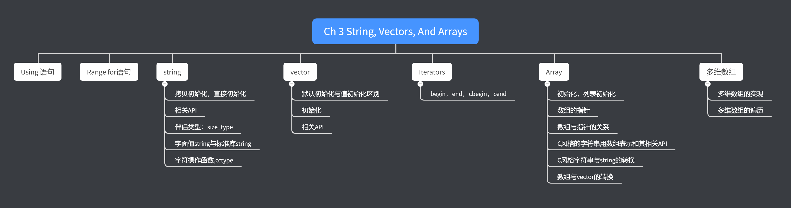



《C++ Primer》 第三章笔记。

第二章介绍的是C++中的内建类型，这一章则是会介绍C++标准库中的一些重要类型。





<!--more-->

# Chapter 3 String, Vectors, And Arrays

## Namespace using Declarations

可以使用`using <namespace>::<name>`的方式定义在命名空间中的一个函数或变量，注意一个`using`命令符只能对应一个名字，如下式

```cpp
using std::cin;
using std::cout;
using std::endl;

void voidTestNamespace();

int main()
{
    voidTestNamespace();
}

void voidTestNamespace()
{
    cout << "Enter two number" << endl;
    int v1, v2;
    cin >> v1 >> v2;
    cout << "The sum is " << v1 << " and " << v2 << " is " << v1 + v2 << endl;
}
```

### Header Should not include using Declarations

如之前所述，预处理器实际上是把`#incldue`语句替换为头文件中的内容，所以如果在头文件中使用了using声明，那么所有引用了该头文件的文件都会使用该using声明。

这可能会造成意想不到的情况发生，所以应该尽量避免在头文件中使用using声明。

## Library string Type

使用C++标准库的string前，应该首先引入string，如下

```cpp
#include <string>
using std::string;
```

### Defining and Initializing strings

初始化String的方法如下表所示：

| 实例代码            | 描述                                       |
| ------------------- | ------------------------------------------ |
| string s1           | 默认的初始化，s1是空字符串                 |
| string s2           | s2是s1的拷贝                               |
| string s2 = s1      | 与上式相同                                 |
| string s3("value")  | s3是字符串字面值的拷贝，不包括最后的空字符 |
| string s3 = "value" | 与上式相同                                 |
| string s4(n,'c')    | 用n个'c'来初始化s4                         |

如果用string字面值来初始化string类型，字面值最后的空字符是不会被拷贝进string的，如上表中，`"value"`是字面值，其长度为6，而通过`"value"`初始化的s3，长度为5，如下代码验证：

```cpp
string s3("value");
string s4 = "value";
char str[] = "value";
cout << sizeof(str) / sizeof(*str) << endl; //6
cout << s3.length() << endl;                //5
cout << s4.length() << endl;                //5
```

#### Direct and Copy Forms of Initialization

当使用`=`进行初始化的时候，实际上编译器执行的是`拷贝初始化(Copy Initialize)`，当不使用`=`时，是`直接初始化（Direct Initialization）`。

上表中，`string s2 = s1`和`string s3 = "value"`是拷贝初始化，其他的都是直接初始化

### Operations on strings

#### Reading and Writing strings

下表为可以对string进行的操作：

| 操作代码      | 解释                                          |
| ------------- | --------------------------------------------- |
| os << s       | 输出结果到os,返回os                           |
| is >> s       | is的结果到s，返回is。is的数值以whitespace分隔 |
| getline(is,s) | 读取is中的一行，返回is                        |
| s.empty()     | s是否为空                                     |
| s.size()      | s中的字符数                                   |
| s.length()    | s中的字符数，与size是同义api，返回的结果相同  |
| s[n]          | 去s中index为n的字符                           |
| s1 + s2       | 返回一个新string,值为s1和s2的结合             |
| s1 = s2       | 将s1中的值替换为s2的值                        |
| s1 == s2      | s1和s2是否相同                                |
| s1 != s2      | s1和s2是否不同                                |
| <,<=,>,>=     | s1和s2的大小，根据字典规则排序                |

其中`is >> s`是以whitespace分隔的（空格，换行，tab），当读到whitespace时一个读取便结束，如下所示

```cpp
string s1, s2;
cin >> s1 >> s2;                //input is "   Hello World!    "
cout << "s1 is " << s1 << endl; //Hello
cout << "s2 is " << s2 << endl; //World!
```

可以看到用cin的话，是无法读取输入中的空格的，如果需要读取空格，建议使用`getline`，如下所示：

```cpp
string line;
while (getline(cin, line))
{
    cout << "result is " << line << endl;
}
/*
$ ./a.exe
123  456   789
result is 123  456   789
    Hello World    
result is     Hello World 
*/
```

`getline`以换行符进行分割，在Windows中输入回车即可，当getline读取到换行符后即会停止，读取的结果不包含换行符，即如果一行的开头便是换行符，则这次读取的结果为空字串。

又因为`getline`返回的也是stream类型，所以同样可以作为判断条件。

#### The string::size_type Type

string.size()方法返回字符串中的字符数，但是返回的结果并不是int或者unsigned，而是`string::size_type`。

string类和其他大部分的库类都定义了伴侣类型(companion type)，string::size_type就是其中一个。int之类的内建类型是硬件相关的，即不同的硬件会有不同的结果，而伴侣类型则是机器不相干的实现。

string::size_type内部的细节书中未提及，但是它是大到足够容纳任何长度字符串的unsigned类型。也因为是unsigned，所以要注意表达式中signed int到unsigned int的隐式转换，如

```cpp
int n = -3;
if (n < s3.length())
    cout << "n is smaller" << endl;
else
    cout << "s3 length is smaller" << endl;

/*
s3 length is smaller"
*/
```

直觉上，n是负数，而s3的长度必然是正数，所以n一定小于s3的长度，但实际上因为n被转换为了unsigned int，所以是一个非常大的数（$2^32-3$）。因此最终的结果是s3的长度更小。

在C++11中，可以通过auto关键字来避免每次都手动的输入伴侣类型（通常比内建类型长，所以相对不太容易输入），如

```cpp
auto len = line.size()
```

#### Adding Literals and strings

string标准库允许将字符字面值和字符串字面值转换为string字面值。

但如果需要用`+`操作符将字面值和string类型合并的时候，必须保证操作符的至少一端是string类型，如下

```cpp
string s1 = "hello", s2 = "world";
string s3 = s1 + ',' + s2 + "\n";
cout << s3;
// string s4 = "Hello" + "world";  //error,both sides of + are literals
string s4 = s1 + "," + s2; //ok, s1 + "," return string
```

### Dealing with the Characters in a string

在标准库的cctype头文件中定义了许多关于字符的函数。

> cctype实际上是从C标准库中继承来的，在c中命名为`ctype.h`。通常而言，在C中的标准库会被命名为`c<Name>.h`，如果这个库被移植到到C++，则会被命名为`cc<Name>`。
> C和C++在很大程度上是通用的，在C++的移植版本中主要变换是将所有的函数和变量会被移到std命名空间下。如果直接使用C版本的标准库也是可以运行的，但是推荐还是使用C++版本，这样可以保证标准库命名空间的统一。

cctype中常用的函数如下：

| 代码实例     | 解释                                                      |
| ------------ | --------------------------------------------------------- |
| isalnum (c)  | c是否是字母或者数字                                       |
| isalpha (c)  | c是否是字母                                               |
| iscntrl (c)  | c是否是控制字符                                           |
| isdigit (c)  | c是否是数字                                               |
| isgraph (c)  | c是否是可显示的（不包括空格）                             |
| islower (c)  | c是否是小写的                                             |
| isprint (c)  | c是否是可显示的（包括空格）                               |
| isupper (c)  | c是否是大写的                                             |
| ispunct (c)  | c是否是标点符号                                           |
| isspace (c)  | c是否是空白字符（空格，tab，vertical tab,返回，换行符等） |
| isxdigit (c) | c是否是十六进制字符                                       |
| tolower(c)   | 将c从大写切换为小写                                       |
| toupper(c)   | 将c从小写切换为大写                                       |

#### Processing Every Character? Use Range-Based for

可以使用`Range for`来改变字符串中的每个字符，`Range for`结构如下

```cpp
for (declaration : expression)
    statement
```

如需要判断字符串中的每个字符是否是标点符号，可以通过如下代码：

```cpp
string s("Hello World!!!");
decltype(s.size()) punct_cnt = 0; //type is size_t
for (auto c : s)
{
    if (ispunct(c))
        ++punct_cnt;
}
cout << "There are " << punct_cnt << " punctuation characters in " << s <<endl;
/*
There are 3 punctuation characters in Hello World!!!
*/
```

在使用range for的时候，为了避免数值的拷贝，可以使用引用，并且在只访问数据的情况下，为了避免对值进行修改，可以使用const reference，如下：

```cpp
for (const auto &c : s)
{
    if (ispunct(c))
        ++punct_cnt;
}
```

#### Using a Range for to Change the Characters in a string

`Range for`实际上是返回值的拷贝，如上节的例子中在每次迭代的情况下，是将str中下个字符拷贝至c中。因此如果需要通过Range for修改string中的数值，就需要使用引用，如下是将字符串中的每个字符转换为大写的代码：

```cpp
for (auto &c : s)
{
    c = toupper(c);
}

cout << "result is " << s << endl;

/*
HELLO WORLD!!!
*/
```

#### Using a Subsctipt for Iteration

可以使用下标（`[<index>]`）取string中的每个字符。使用下标返回的并不是拷贝，而直接是string中的数值，所以可以直接进行修改，并不需要引用，如下是使用下标来将每个字符改为大写：

```cpp
string s("Hello World!!!");
for (decltype(s.size()) i = 0; i != s.size(); i++)
{
    s[i] = toupper(s[i]);
}
cout << "result is " << s << endl;
/*
HELLO WORLD!!!
*/
```

## Library vector Type

Vector是对象的集合，所有的对象都必须有相同的类型。Vector并不是一个具体的类，而是一个类模板。

模板可以被视为是编译器生成函数或者类的指导，编译器使用模板生成函数和类的过程称为`实例化（Instantiation）`。当使用模板时，必须提供想要编译器创建的函数或类类型。在模板后跟上一对尖括号，在尖括号内部加上想要创建的类型，如`vector<int>`。

Vector中可以容纳绝大部分的类型，无论是内建类型还是自定义的类型，但是不能包含引用，严格严格来说引用并非是对象。Vector中的对象也可以是另一个Vector，在老版本中嵌套Vector的尖括号中必须带有空格，如`vector<vector<int> >`，但在C++11中不需要如此，直接写成`vector<vector<int>>`即可。

### Defining and Initializing vectors

#### Value Initialization and Default Initialization

首先要说明值初始化（Value Initialization）和默认初始化（Default Initialization）的概念。

1. 在默认初始化情况下，如果变量声明在函数外，一个变量将获得其初始值。而在函数内，内建类型的值是未定义的。
2. 在值初始化情况下，无论变量声明在函数内外，它都会获得其初始值。

定义和初始化vector的方法如下所示：

| 示例代码                 | 解释                                                         |
| ------------------------ | ------------------------------------------------------------ |
| vectore<T> v1            | vector中的元素类型为T，v1为空                                |
| vector<T> v2(v1)         | v2中包含有v1中每个元素的拷贝                                 |
| vector<T> v2 = v1        | 与上式一样                                                   |
| vector<T> v3(n,val)      | v3中有n个元素，每个元素的值都是val                           |
| vector<T> v4(n)          | v4中有n个元素，每个元素都是T的默认值                         |
| vector<T> v5{a, b, c}    | 如果a,b,c与T类型匹配，则v5包含a,b,c三个元素（不匹配的情况在下面有详细说明）。 |
| vector<T> v5 = {a, b, c} | 与上式相同                                                   |


vector的创建同样分类为拷贝初始化和直接初始化，定义和string中的初始化一样，如`vector<T> v2 = v1`和`vector<T> v5 = {a, b, c}`为拷贝初始化，其他的都为直接初始化。

在初始化中，如果使用的是括号(`()`)，则括号中的值为vector中元素的数量，所以括号内的值必须是自然数。如果使用的是大括号（`{}`），则会尝试将其中的值作为vector的元素，如下所示：

```cpp
vector<int> intList_1(10);
// vector<string> intList_1("abc");//error
vector<int> intList_2{10};
vector<int> intList_3(10, 1);
vector<int> intList_4{10, 1};
cout << "vector_1 size is " << intList_1.size() << endl;
cout << "vector_2 size is " << intList_2.size() << endl;
cout << "vector_3 size is " << intList_3.size() << endl;
cout << "vector_4 size is " << intList_4.size() << endl;
/*
vector_1 size is 10
vector_2 size is 1
vector_3 size is 10
vector_4 size is 2
*/
```

> 式子`vector<T> v4(n)`中，进行的是值初始化。类型T必须含有默认初始化值，否则vector的初始化会失败。

但如果使用的是大括号，而且大括号内的值与vector中的元素类型不匹配，那么就无法将其作为vector中的元素，编译器会尝试将大括号替换为括号再次解析，如果仍然解析失败则会编译错误。如：

```cpp
vector<string> v5{"hi"};
// vector<string> v6("hi");//Error, value in parentheses must be digit
vector<string> v7{10};
vector<string> v8{10, "hi"}; //try to analyse as parentheses
// vector<string> v9{10, 20};//Error, analyse as parenthese still not work
cout << "v5 size is " << v5.size() << endl;
cout << "v7 size is " << v7.size() << endl;
cout << "v8 size is " << v8.size() << endl;
/*
v5 size is 1
v7 size is 10
v8 size is 10
*/
```

### Adding Elements to a vector

使用`push_back`方法来增加vector中的元素。

在标准库中vector的实现下，vector的扩张是很高效的，所以通常来说不需要用括号的初始化方法来定义vector的大小，有的时候定义vector的大小反而会造成性能方面的影响。除了所有的元素都是相同值的情况，否则尽量避免使用括号的初始化方法。

#### Programming Implications of Adding Elements to a vector

在vector的循环中要注意使vector大小发生变化的操作。

如果操作时关于改vector的大小的，则无法使用在string节提到的`range for`来遍历vector。

### Other vector Operations

对vector的操作如下表，绝大部分的含义与之前介绍的string的操作一样。

| 代码示例       | 含义                                             |
| -------------- | ------------------------------------------------ |
| v.empty()      | 返回vector是否为空                               |
| v.size()       | 返回vector中元素的个数                           |
| v.push_back(t) | 将一个元素加到vector最后，元素的值与t相同        |
| v[n]           | 访问下标为n的元素                                |
| v1 = v2        | 将v1中的元素都替换为v2中元素的拷贝               |
| v1 = {a,b,c}   | 将v1中的元素都替换为大括号内的元素               |
| v1 == v2       | v1与v2是否完全相同（元素个数，顺序，数值都相同） |
| v1 != v2       | v1和v2是否不同                                   |
| <, <=, >, >=   | 顺序排列，按字典顺序                             |

与string类似，size()操作返回的也是size_type，注意这里的size_type是属于实例化后的vector，如下：

```cpp
// vector::size_type size = 1; //error
vector<int>::size_type size = 1;
```

> 与string类似，下标操作[]也必须注意元素的存在，如果通过下标访问了不存在的元素，称为缓存区溢出错误（Buffer overflow）。通常可以通过使用range for来避免下标操作，也进而避免了缓存区溢出错误。

## Introducing Iterators

除了Vector，标准库还定义了其他的容器（Container），所有的容器都包含迭代器操作（Iterator），但仅有部分的容器支持下标操作（`[]`）。

严格意义上，string并不是容器，但是string提供了非常多的容器操作。

迭代器有的像指针，同样提供了对象的非直接访问，而且同样也有合法和非法迭代器。一个合法的迭代器应该指向容器中一个元素或者指向容器最后的元素尾部的位置（position on past the last element）。

### Using Iterators

通常来说，支持迭代器的类型都有两个成员迭代器，`begin`和`end`，`begin`指向容器中的第一个元素，`end`指向最后的元素尾部的位置，所以`end`指向的位置实际上并不是任何元素，`end`是一个用来标记容器尾部的指示器，通常将`end`迭代器值称为`off-the-end`迭代器。

如果一个容器是空的，则其`begin`和`end`指向的是同一个位置，都是`off-the-end`迭代器。

#### Iterator Operations

迭代器只支持部分操作，如下表所示：

| 代码实例       | 说明                                                                        |
| -------------- | --------------------------------------------------------------------------- |
| *iter          | 返回迭代器指向的元素的引用                                                  |
| iter->mem      | 访问迭代器指向元素中的成员mem，等同于(*item).mem                            |
| ++iter         | 迭代器指向下一个元素的位置                                                  |
| --iter         | 迭代器指向上一个元素的位置                                                  |
| iter1 == iter2 | 判断两个迭代器是否相同，两个迭代器都指向同一元素或都指向`off-the-end`时相同 |
| iter1 != iter2 | 判断两个迭代器是否不同                                                      |

因为end返回的并不是元素，所以不能被解引用或再使用`++`操作符。

因为并非所有的容器类都支持下标运算，且不一定支持关系比较，如`<`和`>`，所以C++程序会推荐使用迭代器并使用`!=`来进行循环操作，因为这样的实现可以适应任何的容器。

如下是两个等效的代码，一个对string使用下标，一个对string使用迭代器：

```cpp

string s("Hello World!!!");
for (decltype(s.size()) i = 0; i != s.size(); i++)
{
    s[i] = toupper(s[i]);
}
cout << "result is " << s << endl;

s = "Hello World!!!";
for (auto i = s.begin(); i != s.end(); i++)
{
    (*i) = toupper(*i);
}
cout << "result is " << s << endl;
/*
result is HELLO WORLD!!!
result is HELLO WORLD!!!
*/
```

#### Iterator Types

像`size_type`一样，含有迭代器的类型也定义了相应的同伴类型，`iterator`和`const_iterator`，且类型是属于实例化后的类，如`vector<int>`。iterator和const_iterator的关系如同pointer和pointer to const，后者只能读取指向的元素，但不能修改，而且对于const对象来说，必须使用const_iterator，如下：

```cpp
vector<int> v1{1, 2, 3};
const vector<string> v2{"a", "b", "c"};

vector<int>::iterator v1Iter = v1.begin();
vector<int>::const_iterator v1Iter2 = v1.begin();
const vector<int>::iterator v1Iter3 = v1.begin();
// (*v1Iter2) = 2;//error,can't modify value through const_iterator
++v1Iter2;
// ++v1Iter3; //can't modify const iterator

// vector<string>::iterator v2Iter = v2.begin(); //error, must beconst_iterator
vector<string>::const_iterator v2Iter2 = v2.begin();
// const vector<string>::iterator v2Iter3 = v2.begin(); //error,still mustbe const_iterator
```

注意区分`const iterator`和`const_iterator`，前者类似于const pointer,指的是迭代器本身不能改变，即在初始化后无法指向其他元素，后者类似于pointer to const，指的是不能通过该迭代器修改指向的元素。

可以通过`cbegin`和`cend`来自动获取`const_iterator`，如

```cpp
auto cIter = v1.cbegin();
```

#### Combining Dereference and Member Access

可以使用`->`来取代`(*).`操作，如`it->empty()`等同于`(*it).empty()`。注意在使用后者时，必须加上括号。

如果去掉括号，`*it.empty()`指的是在`it`这个迭代器中寻找成员`empty`，无疑会造成编译错误。

#### Some vector Operations Invalidata Iterators

使用迭代器来执行循环操作时，也要注意循环操作造成容器大小变化时，很可能会造成循环的错误结果。

### Iterator Arithmetic

vector和string支持一些额外的迭代器操作，如下表所示：

| 代码实例      | 含义                                           |
| ------------- | ---------------------------------------------- |
| iter + n      | 返回该迭代器后n个元素的位置                    |
| iter - n      | 返回该迭代器前n个元素的位置                    |
| iter += n     | 让迭代器指向后n个元素的位置                    |
| iter -= n     | 让迭代器指向前n个元素的位置                    |
| iter1 - iter2 | 获得两个迭代器之间的距离，即相距多少个元素     |
| <, <=, >, >=  | 关系比较，比较迭代器指向元素的前后，越靠前越小 |

#### Arithmetic Operations on Iterators

`iter1 - iter2`操作返回的是一个名为`difference_type`的signed int类型,该类型同样属于实例化后的容器类型。

#### Using Iterator Arithmetic

使用迭代器进行二分查找例子:

```cpp
string text = "abcdefghijk";
char toSearch;
cin >> toSearch;
auto beg = text.cbegin(), end = text.cend();
auto mid = beg + (end - beg) / 2;
while (mid != end && (*mid) != toSearch)
{
    if (toSearch < (*mid))
        end = mid;
    else
        beg = mid + 1;
    mid = beg + (end - beg) / 2;
}
cout << (end != mid ? "Found" : "Not Found") << endl;
```

## Arrays

### Defining and Initializaing Build-in Arrays

数组同样也是复合类型（compound type）。

数组的大小是数组类型的一部分，所以必须在编译阶段就确定，也因此设定数组大小的值必须是const的，且数组的定义不能使用auto，如下：

```cpp
unsigned num = 42;
const unsigned cnum = 42;
int arr[10];
// int arr2[]; //error,must indicate array size
// auto aarr[] = {1, 2, 3}; //error,can not use auto
// auto aarr[10]; //error,can not use auto
// int arr2[num]; //error,num is not const
int arr3[cnum];
```

形如`arr3[cnum]`的式子，执行的是默认初始化，如果该式子出现在函数内，且其元素类型是内建类型，则值是未定义的。

因为引用并不是对象，所以也没有引用的数组。

#### Explicitly Initializing Array Elements

对数组可以使用列表初始化，在使用列表初始化的时候可以不指定数组的大小，此时数组的大小由列表内的元素数量决定。如果指定了数组大小，那么这个大小必须大于列表中元素的数量，在比列表元素数量大的情况下，数组中剩余的部分将进行值初始化。在不适用列表初始化的情况下，必须指定数组大小，如下：

```cpp
const unsigned sz = 3;
int ia1[sz] = {1, 2, 3};
int a2[] = {0, 1, 2};          //array size is 3
int a3[5] = {0, 1, 2};         //array size is 5, value is 01,2,0,0
string sa[sz] = {"hi", "byt"}; //size is 3,value is "hi""bye" ""
// int a4[sz] = {0, 1, 2, 3};     //error, list elements count is greater than array size
```

#### Character Arrays Are Special

使用string字面值初始化char数组时要注意，string字面值最后是带有一个空白字符的，所以数组的大小应该是string字面值的大小+1。如：

```cpp
char ca1[] = {'c', 'b', 'a'};       //size is 3
char ca2[] = {'c', 'b', 'a', '\0'}; //size is 4
char ca3[] = "abc";                 //size is 4
// const char a4[6] = "Daniel";       //error,no space for \0
```

#### No Copy or Assignment

数组是没有拷贝初始化和赋值的，如下所示：

```cpp
int a[] = {0, 1, 2};
// int aa[] = a;   //error
// int aa[] = a[]; //still error
int aa[3];
// aa = a;         //error,can't use assignment
```

> 某些编译器会允许数组的赋值，但仍然建议不要这样做，因为这不是C++标准的实现，在其他编译器中可能会引发问题。

#### Understanding Complicated Array Declarations

指针的数组和数组的指针的声明会看起来有点复杂，如下所示：

```cpp
int array[10];
int *ptrs[10]; // ptrs is an array of size 10 where elementstype is int*
// int &refs[10];//error,refs seems to be an array whereelemtns type is int&, however reference is not object
int(*parray)[10] = &array;   //parray is a pointer point toan int array of size 10
int(&rarray)[10] = array;    //rarray is a reference bind toan int array of size 10
int *(*pparray)[10] = &ptrs; //pparray is a pointer point toan int* array of size 10
```

当没有括号将\*与变量名称合在一起时，\*表示元素的类型，如`int *ptrs[10]`表示`int*`的数组，当有括号时，表示变量本身的类型，如`int(*parray)[10] = &array`，表示parray是一个指针，指向int[10]。

引用符号同理。

### Accessing the Elements of an Array

当使用一个参数来作为数组的下标值时，这个参数的类型应该时`size_t`。`size_t`是一个机器相关的unsigned type。size_t定义在头文件cstddef中，该头文件是从C语言的头文件`stddef.h`改写而来。

同样可以使用下标和range for对数组进行操作，如下使用下标访问元素，使用range for遍历所有的元素，代码的功能是将输入的数组分类，判断有多少是在0-9范围中，有多少在10-19范围中等：

```cpp
// unsigned scores[11];//warning,not defined value
unsigned scores[11] = {};
unsigned grade;
while (cin >> grade)
{
    if (grade <= 100)
    {
        ++scores[grade / 10];
    }
}
for (auto c : scores)
{
    cout << " " << c << " ";
}
```

注意必须对scores进行初始化。被初始化的第一条语句，执行的是默认初始化，而第二条语句`unsigned scores[11] = {}`使用的是值初始化。因此在函数内，后者可以保证所有的元素有确定的初始值（unsigned为0），而前者的值是未定义的。

如输入为`33 1 44 112 100 22 77 76 75 ^Z`，输出可能为` 1  0  268501010  1  16713577  0  898214646  32766  8  0  1 `，在这种情况下输出的结果是无法保证的。

而进行初始化的话，使用相同的输入，结果为` 1  0  1  1  1  0  1  2  0  0  1 `与预期结果相同。

在代码的最后通过range for遍历输出了scores中的元素，因为数组的大小是数组的一部分即必须在编译时确认，所以系统可以了解究竟有多少元素在数组中。

### Pointers and Arrays

在C++中，数组和指针是紧密关联的。在绝大部分表达式中，当使用数组时，编译器会将其转换为对第一个元素的指针，如下所示：

```cpp
string nums[] = {"one", "two", "three"};
cout << (*nums) << endl;
string *p = nums;
string *pp = &nums[0];
if (p == pp)
    cout << "two pointers are the same" << endl;
else
    cout << "they are different" << endl;
    
/*
one
two pointers are the same
*/
```

在上例中，当使用`nums`实际上使用的是`&nums[0]`，即对第一个元素的指针。

如使用auto也可以发现，编译器自动对数组进行了转换，如下代码：

```cpp
auto pnums = nums; // same as auto pnums = &nums[0]
// pnums = "zero";
(*pnums) = "zero";
cout << "first element is " << nums[0] << endl;

/*
first element is zero
*/
```

`pnums`的类型为`string*`，对pnums指向对象的操作即是对数组第一个元素的操作。

需要注意的是，当使用关键字`decltype`时，返回的仍然是数组类型，而不是对第一个元素的指针，如下：

```cpp
decltype(nums) another = {"abc", "def"};
for (auto n : another)
{
    cout << "value is " << n << endl;
}
/*
value is abc
value is def
value is
*/
```

如之前所述，数组的大小是数组类型的一部分，所以这里的another类型为string[3]，而列表初始化只给了两个元素，所以最有一个元素将默认为空string。

#### Pointers are Iterators

对于数组中元素的指针，其支持的操作与之前提到的迭代器支持的操作一样，包括`++`,`--`，通过`*`解引用，`==,!=`，关系判断，`+= n`等。

如可以通过数组来进行循环遍历，如下：

```cpp
int arr[] = {0, 1, 2, 3, 4, 5, 6, 7, 8, 9};
int *endPtr = &arr[10]; //point to one past last elemment
cout << "value is: " << endl;
for (int *i = arr; i != endPtr; i++)
{
    cout << (*i) << " ";
}
cout << endl;

/*
value is: 
0 1 2 3 4 5 6 7 8 9
*/
```

在代码中使用了`&arr[10]`来获取相当于off-the-end迭代器的指针，因为其指向了最后一个元素后面的位置。在C++11标准中，可以使用函数`begin`和`end`来获取对应的迭代器的指针，如下所示，判断两种方法取得的值是否相同：

```cpp
int *oBeg = arr;
int *oEnd = &arr[10];
int *beg = std::begin(arr);
int *end = std::end(arr);
cout << "Begin is " << (oBeg == beg ? "the same" : "not thesame") << endl;
cout << "End is " << (oEnd == end ? "the same" : "not thesame") << endl;
/*
Begin is the same
End is the same
*/
```

下例是使用使用指针来判断两个数组是否相同的例子:
```cpp
bool CompareTwoArray(int *const pb1, int *const pe1, int *const pb2, int *const pe2)
{
    if ((pe1 - pb1) != (pe2 - pb2))
        return false; //Different length

    for (auto i = pb1, j = pb2; i < pe1 && j < pe2; i++, j++)
    {
        if ((*i) != (*j))
            return false;
    }
    return true;
}

void Exercise3_36()
{
    int arr1[]{1, 2, 3, 4};
    int arr2[]{1, 2, 3, 4};
    int arr3[]{1, 2, 3, 4, 5};
    int arr4[]{1, 2, 3, 5};
    cout << CompareTwoArray(begin(arr1), end(arr1), begin(arr2), end(arr2)) << endl;
    cout << CompareTwoArray(begin(arr1), end(arr1), begin(arr3), end(arr3)) << endl;
    cout << CompareTwoArray(begin(arr1), end(arr1), begin(arr4), end(arr4)) << endl;

    /*
    1
    0
    0
    */
}
```

#### Pointer Arithmetic

两个指针也是可以相减的，结果类型为`ptrdiff_t`，是一个硬件相关的类型，定义在`cstddef`头文件中。在不同的硬件上，它可能会被转换为不同的类型，如转换为long long等。

对不指向任何数组元素的指针进行访问，或比较两个不相关的指针是可以编译的，但其运行的结果是未定义的，如下所示：

```cpp
cout << "value of end is " << *end << endl;
cout << "value of end next is " << *(++end) << endl;

int i = 0, sz = 42;
int *p = &i, *e = &sz;
cout << (p < e ? "p is smaller than e" : "p is larger thane") << endl;
```

这些操作的结果都是未定义的，不同的硬件，不同的编译器甚至不同的运行时间都会造成不同的结果。

#### Interaction between Dereference and Pointer Arithmetic

在对指针进行解引用时，括号的使用会影响结果,如下：

```cpp
int ia[] = {0, 2, 4, 6, 8, 10};
cout << *(ia + 4) << endl;//Access the fifth element
cout << *ia + 4 << endl;//Access the first element and add 4to the result
/*
8
4
*/
```

#### Subscripts and Pointers

可以对任何指针使用下标，但是大多数情况下，只有对指向数组中元素的指针使用下标才有意义，剩下的都是未定义的结果，如下：

```cpp
int ia[] = {0, 2, 4, 6, 8, 10};
int *iaP = &ia[2];
cout << *iaP << endl;       //Third element
cout << iaP[-2] << endl;    //First element
cout << *(iaP - 2) << endl; //First element,same with lastexpression
cout << iaP[-3] << endl;    //undefined result

int a = 2;
int *ap = &a;
cout << ap[0] << endl;  // a
cout << ap[-1] << endl; //undefined result
```

如上所示，通过解引用符号\*对指针的访问，相当于使用`[0]`操作,因此如`iaP[-2]`和`*(iaP - 2)`是等效的。

### C-Style Character Strings

C++中的string字面值实际上是继承自C语言的。通过C++的string存储string字面值会将其转换为string类型，但如果要完全体现String字面值（C风格的String）本身的特性，可以使用char数组或者指针，如`char str[] = "ABC";`，该数组的大小为4，因为还有在最后包含一个空字符。

在`cstring`头文件中，定义了对C-style的string操作的方法，如下表所示

| 代码实例      | 说明                                                                |
| ------------- | ------------------------------------------------------------------- |
| strlen(p)     | 返回p的长度，不包含最后的空字符                                     |
| strcmp(p1,p2) | 判断两个字符串的大小，p1大于p2返回正数，小于p2返回负数，等于p2返回0 |
| strcat(p1,p2) | 将p2的内容添加到p1后，返回p1                                        |
| strcpy(p1,p2) | 将p2的内容拷贝到p1中，返回p1                                        |

对C-Sty;e字符串（使用char数组或指针）进行判断，必须使用`strcmp`，如下所示：

```cpp
string s1 = "A string example";
string s2 = "A different string";
cout << (s1 > s2) << endl;
char cs1[] = "A string example";
char cs2[] = "A different string";
cout << (cs1 > cs2) << endl;      //wrong way,no meaning, iscomparing address of first element
cout << strcmp(cs1, cs2) << endl; //correct way

/*
1
1
1

Although cs1>cs1 also yield correct result,but it's nomeaning.
*/
```

#### Caller is Responsible for Size of a Destination String

使用C-Stype字符串相关操作时需要额外的小心，如`strcat`和`strcpy`操作，并不会检查第一个参数，即装填最终结果的数组的大小，如果数组大小不满足，则会产生错误结果。

另外`strlen`的长度通常是通过找寻C-Style字符串最后的空字符来实现的，如果参数是一个没有空字符的C-Style字符串，那么结果是未定义的，如下：

```cpp
char ca[]{'a', 'b', 'c'};
cout << strlen(ca) << endl;

/*
21
*/
```

这里的21即是一个未定义的结果，在不同情况下结果会不同。在通常的编译器实现下，strlen会一直向后遍历内存，直到找到一块内存其中值未空白字符。

也正因为使用C-Style字符串需要额外的小心，一般现代C++程序推荐使用标准库中的string类型。

### Interfacing to Older Code

在之前已经说明了，可以使用字符串字面值来直接初始化标准库中的string类型，更通常来说，可以使用任何最后是空白字符结尾的C-Style字符串直接转换为标准库中的string类型。如果C-Style字符串结尾不是空白字符，同样结果是未定义的。如下所示：

```cpp
string s = "ABCD";
cout << "value is " << s << ", size is " << s.size() << endl;
char cs[]{'A', 'B', 'C', 'D', '\0'};
string sc = cs;
cout << "value is " << sc << ", size is " << sc.size() <<endl;
char cs2[]{'A', 'B', 'C', 'D'};
string sc2 = cs2;
cout << "value is " << sc2 << ", size is " << sc2.size() <<endl;

/*
value is ABCD, size is 4
value is ABCD, size is 4
value is ABCD慅a, size is 7
*/
```

相反，无法直接将string转换为C-Style字符串，但可以通过string的成员函数`c_str`将结果转换为`const char *`。

需要注意的是，c_str返回的是字符串第一个元素的指针，且最后是由空字符结尾，并且标准库的string值改变的话，对应返回的数据也会自动改变，如下

```cpp
// char *cs3 = s; //error,can't direct convert
const char *cs3 = s.c_str();
cout << "value is " << cs3 << endl;
s = "DEFC";
cout << "value is " << cs3 << endl;
string css = cs3;
cout << "value is " << css << ", size is " << css.size() <<endl;

/*
value is ABCD
value is DEFC
value is DEFC, size is 4
*/
```

#### Using an Array to Initialize a vector

如前所述，无法直接通过一个数组初始化另一个数组。同样的，无法通过一个vector直接初始化一个数组，但却可以通过指向数组元素的指针来初始化vector，如下所示

```cpp
int intArr[]{0, 1, 2, 3, 4, 5};
vector<int> intVec(begin(intArr), end(intArr));
for (auto i : intVec)
{
    cout << i << " ";
}
cout << endl;

intVec = vector<int>(intArr, intArr + 3);
for (auto i : intVec)
{
    cout << i << " ";
}
cout << endl;

/*
0 1 2 3 4 5 
0 1 2
*/
```

代码的前半段是使用begin和end函数来获取第一个元素指针和off-the-end指针，这样就是完整拷贝了数组的元素到新vector中。

后半段是直接使用指针操作，需要注意的是传入的第二个参数是指向vector最后一个元素的内存尾部的地址。因此代码中第二个参数为`intArr+3`，但实际上Vectr中最后一个参数值是`*(intArr+2)`。

创建的vector和原数组是不同的内存，因此创建完后，修改原数组并不会对vector中的元素造成影响。

## Multidimensional Arrays

C++并没有多维数组的概念，实际上多维数组的实现是通过数组的数组。如`ia[3][4]`可以看作是一个三行四列的数组。对于多维数组必须指定维度，不能初始值来推断。

### Initializing the Elements of a Multidimensional Array

以下是初始化多维数组的几种方式：

```cpp
int ia[3][4];   //without initialization;
int ib[3][4]{}; //All elements will be 0
int ic[3][4] = {{0, 1, 2, 3}, {4, 5, 6, 7}, {8, 9, 10, 11}};
int id[3][4] = {0, 1, 2, 3, 4, 5, 6, 7, 8, 9, 10, 11};
int ie[3][4] = {{0}, {4}, {8}};
int ix[3][4] = {0, 4, 8};
```

其中`ic`和`id`的初始化结果是相同的，`ie`是初始化了每一行的第一个元素的值，`ix`的初始化了第一行的前三个元素，之后的元素都会被装填为0（进行了值初始化）。

### Subscripting a Multidimentional Array

```cpp
int ia[3][4]= = {{0, 1, 2, 3}, {4, 5, 6, 7}, {8, 9, 10, 11}};
int (&row)[4] = ia[0];
```

其中`ia[0]`表示第一行，是一个长度为4的int数组。row是一个绑定至长度为4的int数组的引用。

可以使用下标来遍历数组，如下所示：

```cpp
int ic[3][4] = {{0, 1, 2, 3}, {4, 5, 6, 7}, {8, 9, 10, 11}};
for (int i = 0; i < 3; i++)
{
    for (int j = 0; j < 4; j++)
    {
        cout << ic[i][j] << " ";
    }
}
cout << endl;
/*
0 1 2 3 4 5 6 7 8 9 10 11
*/
```

### Using a Range for with Multidimentsional Arrays

当使用C++ 11标准的`range for`遍历多维数组时，需要注意除了最内侧的数组外，外层的遍历都需要用引用，如下：

```cpp
int ic[3][4] = {{0, 1, 2, 3}, {4, 5, 6, 7}, {8, 9, 10, 11}};

for (auto &row : ic)
{
    for (auto &col : row)
    {
        cout << col << " ";
    }
}
cout << endl;

for (auto &row : ic)
{
    for (auto col : row)
    {
        cout << col << " ";
    }
}
cout << endl;

// for (auto row : ic)
// {
//     for (auto col : row)
//     {
//         cout << col << " ";
//     }
// }
// cout << endl;

/*
0 1 2 3 4 5 6 7 8 9 10 11 
0 1 2 3 4 5 6 7 8 9 10 11
*/
```

上面代码中，第一部分是两层循环都使用了引用，第二部分是之后外层循环使用了引用，第三部分是两层循环都没有使用引用。第一部分和第二部分都得到了理想的结果，而第三部分是无法通过编译的。

当外层循环的row不是引用时，编译器会自动将其转换为指针，即row的类型会变为`int *`，指向每一行数组的第一个元素，而对于指针没法使用range for，所以会出现编译错误。

#### Pointers and Multidimensional Arrays

首先要注意数组与指针的关系，式子`int *ip[4]`表示ip是一个长度为4的数组，其中元素类型为int\*。式子`int (*ip)[4]`表示ip是一个指针，指向长度为4的数组。

可以使用指针来遍历数组，如下：

```cpp
int ic[3][4] = {{0, 1, 2, 3}, {4, 5, 6, 7}, {8, 9, 10, 11}};
for (int(*p)[4] = ic; p != ic + 3; ++p)
{
    for (int *q = (*p); q != (*p) + 4; q++)
    {
        cout << (*q) << " ";
    }
}
cout << endl;

/*
0 1 2 3 4 5 6 7 8 9 10 11 
*/
```

注意外部循环中遍历p的类型是`int (*)[4]`，即指向大小为4的数组的指针，将ic赋值给p，是因为编译器会自动的将数组转换为指向第一个元素的指针，在外部循环中，第一个元素是数组。在内部循环中，初始值是(\*p)，即是一个大小为4的数组，同样编译器会将其转换为第一个元素的指针，即int\*。

如之前节所示，可以用begin和end简化代码，如下

```cpp
for (int(*p)[4] = begin(ic); p != end(ic); ++p)
{
    for (int *q = begin(*p); q != end(*p); q++)
    {
        cout << (*q) << " ";
    }
}
cout << endl;

/*
0 1 2 3 4 5 6 7 8 9 10 11 
*/
```

#### Type Aliases Simplify Pointers to Multidimensional Arrays

可以通过为int数组取一个别名来简化代码，如下

```cpp
// using int_array = int[4];
typedef int int_array[4];

int ic[3][4] = {{0, 1, 2, 3}, {4, 5, 6, 7}, {8, 9, 10, 11}};
for (int_array *p = ic; p != ic + 3; ++p)
{
    for (int *q = (*p); q != (*p) + 4; q++)
    {
        cout << (*q) << " ";
    }
}
cout << endl;

/*
0 1 2 3 4 5 6 7 8 9 10 11
*/
```

示例中，将长度为4的int数组称为int_array。示例中使用using和typedef是等效的。




引用：

1. *Cpp Primer* 5th Aug.2012



***