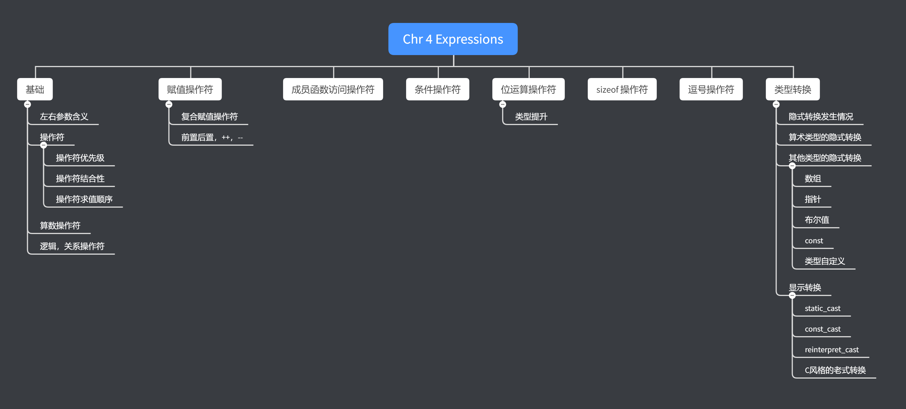
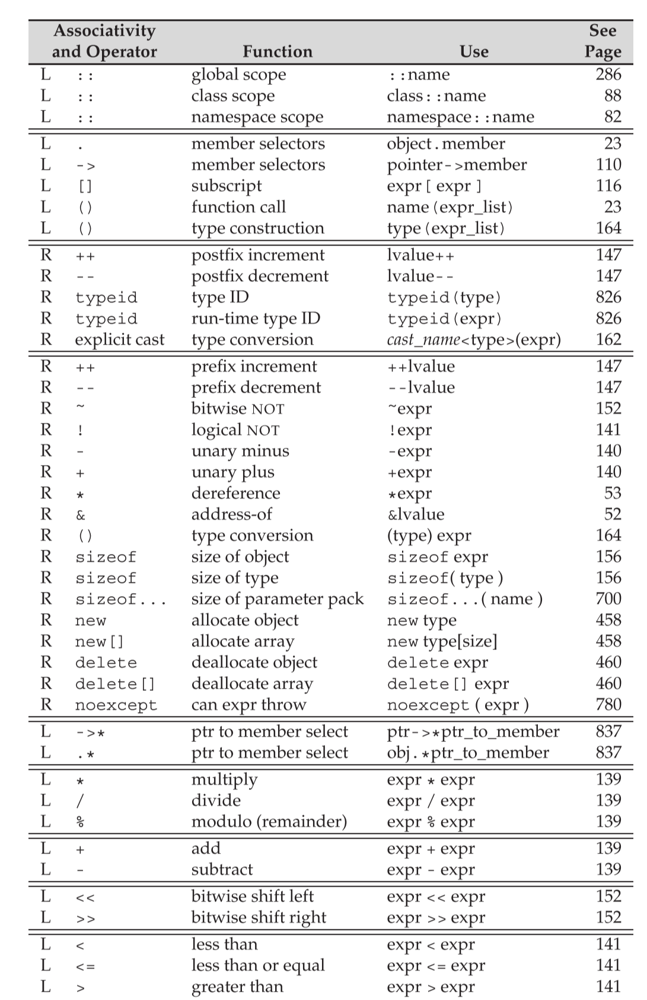
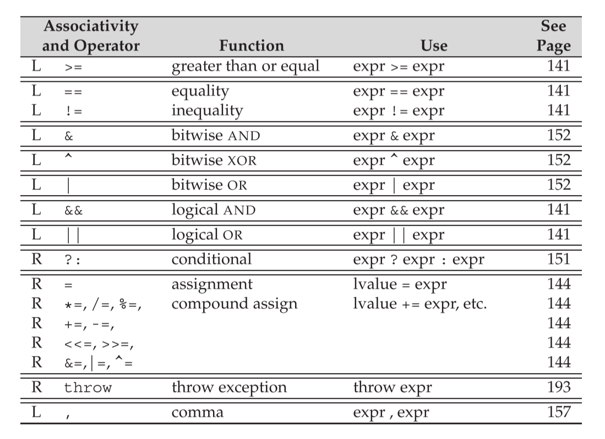



《C++ Primer》 第四章笔记

主要关于对内建类型的操作。





<!--more-->

# Chapter 4 Expressions

## Fundamentals

### Basic Concepts

#### Grouping Operators and Operands

多个操作符的顺序是由优先级（Precedence）和结合性（associatively）有时还有求值顺序（order of evaluation）决定的。

#### Overloaded Operators

操作符可以被重载，但是操作符接受的参数数量，优先级还有结合性是没法被改变的。

#### Lvalues and Rvalues

左参数（Lvalues）是出现在赋值左侧的参数，右参数(Rvalues)是出现在赋值右侧的参数。当使用右参数时，使用的是右参数的值，当使用左参数时，使用的是参数的地址。

除了在13.6节会提到一个例外，可以在右参数的地方使用左参数代替，但是在左参数的地方无法使用右参数代替。

> 赋值操作会返回左参数，取地址操作返回的指针是右参数，前置的`++`和`--`返回左参数。

左右参数在使用`decltype`时也会体现出区别，当传入decltype的是表达式时，且表达式的结果是左参数，那么decltype的结果是引用。

假设`p`的类型是`int *`，那么`*p`返回的是左参数，因此`decltype(*p)`结果是int&，而因为取地址符返回的是右参数，即`(&p)`结果为为右参数，所以`decltype(&p)`结果是`int* *`，而不是引用`int** &`

### Precedence and Associativity

优先级（Precedence）决定是操作符执行的先后顺序，结合性（Associativity）决定的是同优先级的操作符之间执行的顺序。

算数操作符是左结合，即计算顺序是从左到右的，如`3*4/2`，会先计算除法，而赋值操作是右结合。

可以使用括号来重新决定优先级和结合性。

### Order of Evaluation

求值顺序决定了操作符的多个参数，哪个还会先进行求值。

如下代码：

```cpp
int i = f1() * f2();
```

C++标准只能保证在执行乘法操作前，函数f1和f2都会被执行完毕，但是f1和f2的执行顺序是*未定义的*。

同理，如下代码的结果也是未定义的，即使在测试中得到了期待答案，也无法保证在其他硬件或编译器下能正常工作：

```cpp
cout << i << " " << ++i << endl;
```

所有出现在同一个表达式中的未限定求值顺序的操作符的执行顺序都是未定义的。所以尽量不要在同一个表达式中引用或修改同一个对象，这很可能会引发Bug。

只有四个操作符的执行顺序是指定了的，逻辑与`&&`，逻辑或`||`，条件判断`?:`和逗号`,`。

只有一种情况下，在同一个式子中使用未限定求值顺序的操作符对同一个变量多次操作能得到确定的答案，即修改了变量的子表达式本身就是另一个表达式的对象。

如`int*++iter`，按优先级会计算`++iter`，而改变后的`iter`本身就是`int*`表达式的对象。但是在之前的式子的`f1() * f2()`中，乘法操作符的对象是函数运行后的值，而不是函数本身。同理，对于`cout << i << " " << ++i`，前面的`i`和`i++`实际上是不相关的，即`<<`操作符并不是将它俩链接在一起，所以谁先执行也是不能保证的。

#### Order of Evaluation,Precedence and Associativity

如有式子`f()+g()* h()+j()`,可以得出以下结论：

1. 优先级保证了，g()的结果和h()的结果会先相乘
2. 结合性保证了f()的结果会先和g()和h()相乘的结果相加，然后得到的结果再与j()相加。
3. 四个函数的执行顺序无法保证。

如果这四个函数是相关的，如都会在内部对同一个全局变量进行修改或访问，那么结果将是未定义的。

### Arithmetic Operators

算数操作符的优先级排序如下，所有的算数操作符的结合性都是从左至右：

| 优先级 | 操作符 | 含义 | 使用        |
| ------ | ------ | ---- | ----------- |
| 1      | +      | 正号 | + expr      |
| 1      | -      | 负号 | - expr      |
| 2      | *      | 相乘 | expr * expr |
| 2      | /      | 相除 | expr / expr |
| 2      | %      | 求余 | expr % expr |
| 3      | +      | 相加 | expr + expr |
| 3      | -      | 相减 | expr - expr |

算数操作符的结果都是右参数。

#### Arithmetic Operation on Boolean

在对布尔值进行算数操作时需要额外的注意，如下代码：

```cpp
bool b = true;
bool b2 = -b;
cout << "b2 is " << b2;

/*
b2 is 1
*/
```

因为对b使用了负号操作符，所以b会转换为int，因为b值为true，所以被转换为1，即b2的值为-1,因为非0，所以b2值为true。最后使用cout打印时，又转换为了int，为1。

#### Overflow

如果对整数类型使用了算数操作符且结果超过了类型所能表达的最大值，那么结果是未定义的，如使用short表示一个数，且在某设备上short是16-bits的类型，那么它的表达范围是$-32768\sim 32767$，如有以下代码：

```cpp
short short_value = 32767;
short_value++;
cout << "short value is " << short_value << endl;

/*
b2 is 1short value is -32768
*/
```

结果为-32768，是因为编译器对其进行了`wrap around`，但因为结果实际上是未定义的，并不能保证所有设备上都是这个结果。

#### remainder(%) operation

取余符号的操作对象必须是整数类型，对于`m % n`，结果的正负与m一样。即`m%(-n)`的值与`m%n`相同，`(-m)%n`的值与`-(m%n)`相同。

### Logical and Relational Operators

所有的算数值（整数和浮点数）和指针转换为布尔值的规则相同，值为0为false，值非0为true。

所有的逻辑和关系运算符优先级如下标：

| 优先级 | 结合性 | 操作符 | 含义     |
| ------ | ------ | ------ | -------- |
| 1      | Right  | !      | 取非     |
| 2      | Left   | <      | 小于     |
| 2      | Left   | <=     | 小于等于 |
| 2      | Left   | >      | 大于     |
| 2      | Left   | >=     | 大于等于 |
| 3      | Left   | ==     | 相等     |
| 3      | Left   | !=     | 不等     |
| 4      | Left   | &&     | 与       |
| 4      | Left   | \|\|   | 或       |

`&&`操作和`||`操作都是最短路径求值

#### The Relational Operators

因为关系运算符的返回结果是bool值，级联关系运算符的结果通常如期望的不同，如下代码：

```cpp
int i = 3, j = 2, k = 3;
if (i < j < k)
    cout << "enter case 1";
        
/*
enter case 1
*/
```

运算的实际过程是，先判断`i<j`，结果为false，返回0，然后判断`o<k`，结果为true。如果要判断i,j,k是否是递增的，应该写为

```cpp
if(i < j && j < k)
    cout << "enter case 1";
```

#### Equality Tests and the bool Literals

可以在condition中直接使用算数值或者指针来判断该参数是否是0，如下

```cpp
if(val) {/* ... */}//true if val is nonzero value
```

但上式不能改写为
```cpp
if(val == true)  {/* ... */}
```

在这个式子中，true会被转换为val的类型，即变为1，因此式子判断的是val的值是否为1。

## Assignment Operators

#### Assignment Is Right Associative

赋值操作的结合性是从右至左的，且赋值的右参数必须与左参数类型相同或者可以转换到左参数的类型，如下代码所示：

```cpp
int i;
double d;
i = d = 3.5;
cout << "i is " << i << ", d is " << d << endl;
d = i = 3.5;
cout << "i is " << i << ", d is " << d << endl;

/*
i is 3, d is 3.5
i is 3, d is 3
*/
```

#### Assignment Has Low Precedence

在C++中，可以在condition中使用赋值操作，如下两部分代码是等效的，但第二个更简洁：

```cpp
int i = getValue();
while ( i != 42 )
{
  // do sth
  i = getValue();
}
```

```cpp
int i;
while( (i = getValue()) != 42)
  // do sth
```

注意赋值操作的优先级很低，所以需要使用括号来限定优先操作，如果不使用括号，则i的值会变成getValue返回值与42的比较结果，即只会是0或1。

#### Compound Assignment Operators

以下都是复合赋值操作符：
`+=`,`-=`,`*=`,`/=`,`%=`,`<<=`,`>>=`,`&=`,`^=`,`|=`。

以`+=`为例，下两个式子是等效的：

```cpp
a += 1;
a = a+1;
```

但是从性能角度考虑，使用复合赋值操作只需要读取一次左参数，而普通的赋值方法则需要读取两次，因此复合赋值操作有更好的性能，虽然之中的差距不是很明显。

## Increment and Decrement Operators

`++`和`--`操作都有两个形式，前置(Prefix)和后置（Postfix），前置返回的是原值加1后的原对象本身，结果是左参数。后置返回的是原对象的原值，结果是右参数。如下代码所示：

```cpp
int i = 0, j;
cout << "i is " << i << ", j is " << j << endl;
j = ++i;
cout << "i is " << i << ", j is " << j << endl;
j = i++;
cout << "i is " << i << ", j is " << j << endl;

/*
i is 0, j is 0
i is 1, j is 1
i is 2, j is 1
*/
```

> 尽量使用前置操作，这样代码更简洁，且因为避免了拷贝也有更好的性能

### Combining Dereference and Increment in a Single Expression

因为累加符号的优先级低于解引用符，所以`*p++`等同于`*(p++)`

### Remember That Operands Can Be Evaluated in Any Order

如之前所述，在同一个表达式内，子表达式的计算顺序是无法保证的（操作符的优先级决定的是子表达式的计算结果在总表达式中计算的顺序）。

在同一个表达式中，有子表达式使用对象，另一个子表达式修改对象时，结果是未定义的，如下式：

```cpp
string s = "abcdefg";
auto beg = s.begin();
while (beg != s.end() && !isspace(*beg))
{
    *beg = toupper(*beg++);
}
/*
aAAAAAA 
*/
```

结果并不是期望的遍历整个字符串并将所有字符换为大写，这是因为语句`*beg = toupper(*beg++)`是未定义的，它可能被解释为以下任何情况：

```cpp
*beg = toupper(*beg)
*(beg + 1) = toupper(*beg)
//Others
```

右侧的`*beg++`中的两个操作符的顺序是固定的，即先进行累加，在进行解引用。

但是左侧的`*beg`和右侧的`*beg++`哪个先进行运算结果是不一定的，如果先运行了左侧，则结果对应上述第一种可能，否则对应上述第二种可能。

## The Member Access Operators

`ptr->mem`相当于`(*ptr).mem`

箭头操作需要对指针对象进行操作，且返回的是左参数，点操作返回的参数是左参数还是右参数由对象本身决定。

## The Conditional Operator

条件操作符的形式为`cond ? expr1 : expr2`，和逻辑与和逻辑或一样，条件操作符同样也是最短求值，所以`expr1`和`expr2`中只会有一个参数被计算。

### Nesting Conditional Operations

当有多个条件操作符嵌套时，结合性是从右至左的，如下：

```cpp
void TestConditionalOperations()
{
    int grade;
    cin >> grade;
    string final = (grade > 90) ? "High Pass" : (grade < 60) ? "fail" : "pass";
    //Equals to:
    //(grade > 90) ? "High Pass" : ((grade < 60) ? "fail" : "pass")
    cout << "Final is " << final << endl;
}
```

结合性是从右至左的，但是计算顺序仍然是从左至右，即会先计算`grade > 90`的情况，再计算`grade <60`。

### Using a Conditional Operator in an Output Expression

因为条件操作符（Conditional Operator）的优先级很低，所以在输出表达式中使用条件操作符时往往都需要加上括号，如下：

```cpp
cout << ((grade < 60) ? "fail" : "pass");
cout << endl;
cout << (grade < 60) ? "fail" : "pass";
cout << endl;
// cout << grade < 60 ? "fail" : "pass"; //Error

/*
fail
1
*/
```

第三个表达式无法正常编译，第二个表达式输出了1，因为都是因为`<<`操作比条件操作符有更高的优先级。

第二个表达式和第三个表达式等效为以下代码：

```cpp
// cout << (grade < 60) ? "fail" : "pass";
cout << (grade <60) ;
cout ? "fail" : "pass"

// cout << grade < 60 ? "fail" : "pass"; //Error
cout << grade;
// cout < 60 ? "fail" : "pass"; //Error, can not use < on cout
```

## The Bitwise Operators

位操作符（Bitwise Operators）使用整数类型来表示一系列的bits。如果操作的对象类型小于操作的结果类型，则会首先将操作的对象转换为结果类型，然后再进行操作。

位操作符的优先级及描述如下表所示：

| 优先级 | 操作 | 含义   | 代码实例       |
| ------ | ---- | ------ | -------------- |
| 1      | ~    | 位取反 | ~expr          |
| 2      | <<   | 左移   | expr1 << expr2 |
| 2      | >>   | 右移   | expr1 >> expr2 |
| 3      | &    | 与     | expr1 & expr2    |
| 3      | ^    | 异或   | expr1 ^ expr2    |
| 3      | \|   | 或     | expr1 \ expr2    |

### Bitwise Shift Operators

1. `<<`和`>>`都是位移操作，右侧的参数必须是正整数，而且必须小于左侧操作对象的bit数，否则将是未定义的。
   
2. 位移运算结合性时从左至右的。
   
3. 返回的结果是拷贝的左侧操作对象位移右侧参数后的结果，即位移运算不会影响原变量。
   
4. 位移出边界的bit将被舍弃。
   
5. 对于左移操作，如果操作对象是signed的，那么操作结果是未定义的，如果操作对象是unsigned的，数据左移后，在右侧装填0。
   对于右移操作，如果操作对象是signed的，操作结果是基于实现的，可以实现为操作后左侧插入1，也可以实现为操作后左侧拷贝sign位（即数据的第一位）。如果操作对象是unsigned的，则在操作后在左侧插入0。
   > 在操作对象为signed时，左移和右移操作要么是未定义的，要么是基于实现的，都不可控。所以建议只对unsigned对象进行位移操作。

例子1：

如有一台设备，其中char为8-bits，int为16-bits，一个名为bits的char对象的值为0233（八进制表示），则其二进制表示为

`10011011`

首先将其，转换为int，拓展的位都为0，如下
`00000000 10011011`

如果执行的函数是`bits<<8`，即将bits左移8位，结果为

`10011011 00000000`，最左侧的8位移除了范围，所以被丢弃了。

如果执行的函数是`bits >> 3`，即将bits右移动3位，结果为
`000000000 00010011`，最右侧的三位移出了范围，所以被丢弃了。

### Bitwise Not Operator

同样在操作前，如果操作对象的整数类型较小，需要将其提升为结果的整数类型，如结果为int（16-bits）,对象为char，且值为`10010111`，则对其进行取反操作的结果为：

`11111111 01101000`

### Bitwise And,Or

同样在操作前，如果操作对象的整数类型较小，需要将其提升为结果的整数类型。

对于异或操作，如果两个操作对象中，有且只有一个1，则结果为0，否则结果都为0。

例子2：

在一台int为21-bits，char为8-bits的设备上运行`~'q' << 6`，该设备用Latin-1字符集，q二进制表示为`01110001`。

首先将其转换为int，结果为

`00000000 00000000 00000000 01110001`

然后进行取反操作，结果为

`11111111 11111111 11111111 10001110`，

再左移6位，结果为

`11111111 11111111 11100011 10000000`

如果要将该结果转换为10进制，首先第一位数据是1，说明为负数，负数的二进制是补码，因此需要将该二进制转换为原码，首先减一，得到

`11111111 11111111 11100011 01111111`

再取反，得到

`00000000 00000000 00011100 10000000`

表达为10进制为7296,所以结果为-7296。

### Using Bitwise Operators

如果有一个int值quiz1，需要将其第27位变为1，则可使用以下代码

```cpp
quiz1 |= 1UL << 27;
```

如果要将其27位变为0，则可使用如下代码：

```cpp
quize1 &= ~(1UL << 27);
```

如想要的到第27位的值，可以使用如下代码：

```cpp
bool status= quiz1 & (1UL << 27)
```

### Shift Operators Are Left Associateive

位移操作符的结合性是从左至右的，而IO的操作符是继承自位移操作符的，因此IO的操作符的结合性也同样是从左至右的，因此如下代码将会无法通过编译：

```cpp
cout << 10 <24;
```

因为<<的优先级高于关系操作符，因此上式实际上等于：

```cpp
cout << 10;
cout < 24
```

因此会造成编译错误。

## The sizeof Operator

sizeof操作符返回类型的大小，单位为byte，该操作符结合性是从右至左的，结果为`type_t`类型。有以下两种表达方式：

```cpp
sizeof (type)
sizeof expr
```

sizeof操作符并不会对操作对象求值，因此如果表达式的结果是未定义的也没关系。

对于sizeof有以下规则：

1. 对于char或者返回结果为char类型的表达式，sizeof的结果为1
2. 对引用对象使用sizeof，结果为绑定的对象类型大小
3. 对指针使用sizeof，结果为该设备上容纳地址需要的字节数（硬件相关）。
4. 对数组使用sizeof，返回的是整个数组的大小，因为实际上数组的大小是数组类型的一部分
5. 对string和vector使用sizeof，返回是这两个类的固定部分，即大小是固定的，并不随元素数量而变化。
   
sizeof实例代码如下：

```cpp
string s = "ABCD", ss = "", *sp = &s;
cout << sizeof(string) << endl;//32
cout << sizeof ss << endl;//32
cout << sizeof s << endl;//32
cout << sizeof sp << endl;//8
cout << sizeof *sp << endl;//32
cout << sizeof s.size() << endl;//8
cout << sizeof(size_t) << endl;// 8

int arr[3]{1, 2, 3};
cout << sizeof(arr) << endl;//12
int arrr[4]{};
cout << sizeof(arrr) << endl;//16
```

## Comma Operator

逗号操作符（Comma Operator）使用两个操作对象，求值顺序是从左至右的，即逗号操作符可以保证操作对象求值的顺序。

逗号操作符会先对左手边的操作对象求值，然后丢弃结果，再对右手边的操作对象求值，然后返回结果，如果右手边的对象操作对象是左参数，则返回左参数，否则返回右参数。

如下代码：

```cpp
int x = 1, y = 3, i;
cin >> i;
(i > 0) ? ++x, ++y : --x, --y;
cout << "x is " << x << ", y is " << y << endl;

/*
2
x is 2, y is 3
*/

/*
-1
 x is 0, y is 2
*/
```

因为逗号操作符的优先级是最低的，所以上式实际上为

```cpp
( (i > 0) ? ++x, ++y : --x ), --y;
```
无论如何，逗号操作符的右手边参数，`--y`都会被运行。

当i>0时，执行的是`(++x,++y)`，然后再执行`--y`，因此结果为x=2,y=3。

当i<0时，执行的是`--x`，再执行`--y`，所以结果为x=0,y=2

也因为逗号操作符的优先级是最低的，因此下式无法正常编译

```cpp
int a = --x , ++y;

//Equals to
//int a = --x;
//,++y
```

## Type Conversions

C++会自动进行隐式转换，如表达式

```cpp
int ival = 3.541 + 3;
```

表达式中的3会先转换为double类型，然后相加的结果再转换为int类型。

隐式转换会在以下情况下发生：

1. 在多数表达式中，小于int的整数类型会被先转换为int类型
2. 在条件中，非布尔值的表达式会转换为布尔值
3. 在初始化中，初始化值会被转换为目标类型；在赋值中，等号右手边的参数类型会转换为左手边的参数类型
4. 在算数和关系表达式中，如果操作数的类型不同，那么会转换为一个通用的类型（在下一节解释）

### The Arithmetic Conversions

这节阐述的是算数类型的隐式转换，算数表达式中的隐式转换遵循以下规则：

1. 算术类型的转换会尽量保持精度，如`3.541+3`中是3转换为了double类型，因为这样可以保留结果的精度。
   
2. 小的整数类型会被转换为大的整数类型，如`bool`, `short`, `unsigned short`, `char`, `unsigned char`都会默认尝试转换为int，如果int无法容纳参数值，则转换为unsigned int。
   a. 如果与较小的整数类型进行计算的是比int更大的整数类型，则直接转换为该类型，如`'a'+12L`，会直接将'a'转换为long类型。
   b. 注意这里必须是与较小的整数类型直接连接的，如`12+b+12L`中，b还是会先转换为int。
   c. 如果更大的类型非整数类型，仍然会先转换为int再转换为目标类型，如`3.14L+'a'`，'a'会先转换为int。
   

3. signed和unsigned类型转换
   a. 如果两个类型都是signed或都是unsigned，则较小的类型转换为较大的类型
   b. 如果unsigned的类型大于等于signed的类型（这里比较的是类型，不是参数值），则signed类型转换至unsigned的目标类型。
   c. 如果signed类型大于unsigned类型，则首先尝试将unsigned类型转换至signed的目标类型，如果signed目标类型无法容纳unsigned类型的参数值，则将signed类型转换至unsigned 目标类型。

### Other Implicit Conversions

除了算数类型的隐式转换，C++还有其他类型的隐式转换，如

1. 数组到指针的隐式转换：
   如之前所述，在使用数组名称时，会自动转换为指向数组第一个元素的指针。
   这个转换在以下情况不适用：
   a. 使用decltype
   b. 使用取地址符&
   c. 使用sizeof
   d. typeid，在19.2.2节会说明

2. 指针转换
   指针转换包含以下几种：
   a. 固定字面值0和字面值nullptr可以被转换至任意类型的指针（空指针）
   b. 指向任何非const类型的指针可以转换至void*
   c. 指向任何类型的指针都可以转换至const void*

3. 布尔值转换
   任何在表达式中的算数类型和指针都会被转换至布尔值，如果参数值为0为false，否则为true

4. const转换
   a. 在初始化时，非const的对象可以初始化const对象。
   b. 指向普通类型的指针也可以转换为指向const类型的指针。
   c. 相反的操作，即将const类型转换至非const的隐式转换不存在。

5. 类型自定义隐式转换
   a. `string s = "abc"`就是string类型自定义的隐式转换，将C类型的字符串字面值转换为string类型
   b. `while ( cin >> s)`也是cin类型自定义的隐式转换，将cin类型转换为布尔值

### Explicit Conversions

可以使用cast来进行显示转换，显示转换的格式为：

`cast-name<type>(express)`

其中`cast-name`为显示转换的方法，一共有四种，其中`dynamic_cast`在19.2节会进行详细说明，剩下三种如下：

#### static_cast

任何定义了的转换（除了low-level const）都可以通过静态转换（static_cast）来执行，这里的`定义`指的是可能存在的转换。如double和int之间存在转换，但vector和int之间不存在转换，因此前者可以使用静态转换，后者不行。

如：

```cpp
int i = 10, j = 3;
double slope = i / j;
cout << "slope is " << slope << endl;
slope = static_cast<double>(i) / j;
cout << "slope is " << slope << endl;

/*
slope is 3
slope is 3.33333
*/
```

直接进行`i/j`的话，因为两者都是int，所以结果也是int，因此输出的值为3。而通过static_cast将i的类型转换为double，此时j也会被隐式转换为double，因此结果为3.33。

通常也会用静态转换将`void*`转换到目标指针，如下

```cpp
void *p = &slope;
double *dp = static_cast<double *>(p);
cout << "slope is " << (*dp) << endl;

/*
slope is 3.33333
*/
```

`void*`转换为的目标指针必须是原先的值匹配，否则结果是未定义的。


#### const_cast

low-level的const只能通过`const_cast`显示转换，`const_cast`唯一能做的是也只是转换low-level的const。

如:

```cpp
const int *value1 = &i;
// int *valueP = value;
int *value2 = const_cast<int *>(value1);
cout << "value1 is " << (*value1) << endl;
*value2 = 3;
cout << "value1 is " << (*value1) << endl;
cout << "value2 is " << (*value2) << endl;

/*
value1 is 10
value1 is 3
value2 is 3
*/
```

通过了const_cast，上式将`const int *`赋值给了普通的`int*`。甚至通过`int*`修改了参数，但是C++标准中，修改通过const_cast得到的指针结果是未定义的。

* 虽然在测试中得到了期望的结果，但是极度不推荐用这样的方法。

#### reinterpret_cast

reinterpret_cast可以在更低的层次转换类型，因此提供了更多的转换可能。

但在转换后的类型很可能是无法正常操作的，如：

```cpp
int *ip;
char* cstr = reinterpret_cast<char*>(ip);
string str = cstr;
```

代码中，将`int*`转换为了`char*`，并用它来初始化`string`，在编译过程中代码不会出现任何问题，但在运行时的结果是未定义的，因为实际上`char*`和`int*`在bit层面的解释方法是不一样的。

* 尽量避免使用reinterpret_cast,该操作太危险了

#### Old-Style Casts

在C语言中，可以通过以下两种方式进行显示转换：

```c
type (expr)
(type) expr

//Like,

char *pc;
int i = int(*pc);
i = (int)(*pc);
```

old-stype转换与上述的三个显示转换实际上是等效的，它会首先尝试进行`static_cast`和`const_cast`，如果是合法的，则进行相应操作，如果这两个都不合法，则进行`reinterpret_cast`操作。

如以下两个操作是等效的：

```cpp
const string *ps;
void *pv;
pv = static_cast<void *>(const_cast<string *>(ps));
pv = (void *)ps;
```

## Operator Precedence Table

下图为C++所有操作符的含义，实例代码，结合性，优先级以双横线区分：








引用：

1. *Cpp Primer* 5th Aug.2012



***