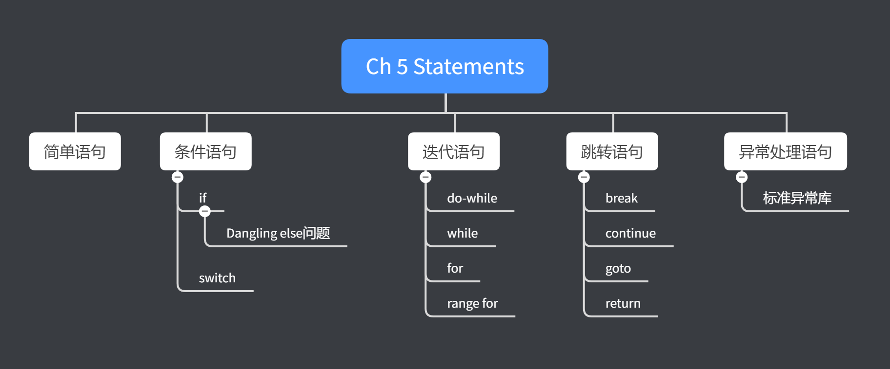

《C++ Primer》 第五章笔记

讨论了基础语句，循环语句和条件判断语句，以及讨论了C++的异常处理。




<!--more-->

# Chapter 5 Statements

## Simple Statements

### Null Statements

一个单一的分号即构成了一条空语句（Null Statements），当语言语法需要一条语句，但是代码逻辑并不需要的时候，空语句是很有用的。如：

```cpp
while(cin>> s && s != sought)
    ;   //null Statements
```

建议在每个空语句后都加上注释，表明是故意使用空语句而不是不小心遗漏。

### Compound Statements(Blocks)

多条语句可以放在一个代码块中，代码块以两个大括号构成。如果代码块中没有任何的语句，则相当于一个空语句，如

```cpp
while(cin>> s && s != sought)
{

}
```

## Statement Scope

可以在`if`, `switch`,`while`和`for`的控制语句中定义变量，在控制语句中定义的变量，只在其对应的作用域下有用，如

```cpp
while (int i = getNum())
{
    cout << "i is " << i << endl;
}
// i = 0; //error, out of scope
```

## Conditional Statements

### The if Statement

If与C语言的If语句类似。

#### Dangling else

当if和else的数量不匹配时，else该与哪个if结合称为`dangling else`问题，C++的解决方法是，else与上方最近的未匹配其他else的if语句结合。


### The switch Statement

switch语句的构造如下：

```cpp
switch (expression)
{
    case caseLabel1:
        //some code
        break;
    case caseLabel2:
        //some code
        break;
    case caseLabel3:
        //some code
        break;
    default:
        //some code
        break;
}
```

`expression`可以是一个变量的定义语句，或普通的一个变量，但expression必须是可以转换到整数类型的，expression的值会与每一个`caseLabel`进行比较，决定进入哪个case。

当进入一个case后，case内的代码会被执行，然后会进入顺应的下一个case，直到遇见`break`语句为止，所以在大多数情况下，每一个case中都会有一个break语句。

> 如果在某个case下故意的不加入break，要继续执行下一个case中的代码时，建议加上注释表明不是意外遗漏了break。

`caseLabel`必须是一固定的整数表达式参数（Integral constant），如`case 3.14:`，`case ival`（ival不是const int）等语句都无法通过编译。

当所有的case都不满足时，会进入`default`中，虽然default case不是强制的，但还是建议添加default。

#### Variable Definitions inside the Body of a switch

因为switch下所有case都是在一个作用域中（并没有大括号进行分割），所以在一个case中定义的变量是可以在另一个case中使用的，但是定义变量时不能进行初始化，因为初始化的case并不一定会被选中，如：

```cpp
switch (val)
{
case 1:
    // string file_name; //error, default initialization, and the initialization may bebypassed
    // int ival = 0;//error, the initialization may be bypassed
    int jval; //int is build-in type and this is in function so it isn't initialiazed
    break;
case 0:
    jval = 2;
    break;
default:
    break;
}
```

代码中的file_name和ival都会造成编译失败，两者都有初始化的过程，file_name虽然没有指定初始化变量，但是因为它不是内建类型，所以会被默认初始化。

如果确实需要在某个case下定义变量且要初始化，那么只能将这个case的作用域与其他case分开，如下：

```cpp
switch (val)
{
case 1:
{
    // string file_name; //error, default initialization, and the initialization may bebypassed
    // int ival = 0;//error, the initialization may be bypassed
    int jval; //int is build-in type and this is in function so it isn't initialiazed
    break;
}
case 0:
    // jval = 2;//error, jval is in another code scope
    break;
default:
    break;
}
```

## Iterative Statements

`while`和`for`在执行body的代码前会先进行条件判断，而`do while`会先执行一次body代码，再进行条件判断

### The while Statement

```cpp
while (condition)
    statement
```

在condition或statement中定义的变量会在每一次的迭代中被创建和摧毁。

### Traditional for Statement

for语句的标准形式为：

```cpp
for (initializer; condition; expression)
    statement;
```

for语句的执行顺序是：先执行`initializer`，再执行`condition`判断条件，如果不满足则退出for循环，否则执行`statement`再执行`expression`。然后再次回到`condtion`进行循环。

如while循环一样，在`initialzier`中定义的变量的作用域只在控制语句和statement内部。

#### Multiple Definitions in the for Header

在`initializer`中可以定义多个变量，但只能使用一条定义语句，因此所有初始化的变量都是一个类型的，如

```cpp
vector<int> v{1, 2, 3};
for (decltype(v.size()) i = 0, sz = v.size(); i != sz; ++i)
{
    v.push_back(v[i]);
}
for (auto &val : v)
{
    cout << val << " " << endl;
}
cout << endl;
/*
1
2
3
1
2
3
*/
```

在第一个for循环中，定义了i和sz两个变量。

#### Omitting Parts of the for Header

for控制语句中的`initializer`, `condition`, `expression`都是可以被省略的。

如果`condition`被省略，相当于将true作为condition，因此为了避免死循环，必须在循环body中使用break。

### Range for Statement

range for循环的结构如下：

```cpp
for(declaration: expression)
    statement
```

expression必须是用大括号括起的一系列元素，或者数组，或者带有begin, end迭代器的类型（如vector和string）。

declaration的类型必须是expression中元素的类型匹配，可以使用auto来简化操作。

如果要修改元素，必须将declaration的类型设置为引用，且使用引用也可以避免元素的拷贝来提升性能。

declaration中的变量会在每次statment执行后运行，并且用下一个元素来进行初始化。

```cpp
for (auto &val : {1,2,3})
{
    cout << val << " " << endl;
}
```

在range for中添加或删除元素可能会造成错误，这是因为range for循环的范围，即最终结束的end是被缓存下来的，在其中修改了元素的数量，range for的范围也不会改变。

### The do while Statement

`do while`与`while`很类似，只是在statement执行后再检查condition，如：

```cpp
do
    statement
while(condition)
```

因为`do while`的condition会后执行，所以condition中不允许定义变量，否则将会出现statement中使用未定义变量的情况。

## Jump Statements

C++中一共有四种跳转语句，`break`,`continue`,`goto`,`return`，`return`会在6.3节介绍。

### The break Statement

break语句可以出现在`while`，`do while`，`for`和`switch`语句中，break语句只影响最近的loop或者switch语句，使用了break后会终止整个循环。

### The continue Statement

continue语句会终止当前的循环语句，并进入下一次循环。continue只出现在for,while和do while中（break还能出现在switch中），continue只有在switch是嵌套在循环中的时候才能写在switch内部，而且终止的也是嵌套switch的循环。

在while和do while中，continue后执行的是循环的condition，在传统for循环中，continue后执行的是for循环控制语句的expression，在range for中，continue后执行的是用下一个元素初始化declaration中的变量。

### The goto Statement

goto语句提供了无条件的跳转，goto语句可以跳转到同一函数中的另一个语句中，如

```cpp
    int val;
    int print1;
    cin >> val;
    if (val == 0)
        goto print0;
    else
        goto print1;

print0:
    cout << "This is 0" << endl;
print1:
    cout << "This is 1" << endl;
```

其中goto语句后跟着的print0和print1称为label，label指定了程序的跳转点。且label的命名和变量的命名是独立的，如代码中，定义了变量print1和label print1。

> goto的作用域是同一个函数，即只能跳转到同一个函数中定义的label中。

goto语句还可以向上跳转，向上跳转的过程中，如果遇到了定义变量的语句，被定义的变量会被销毁，并重新构造，如下：

```cpp
begin:
    int sz = getNum();
    if (sz <= 0)
        goto begin;
```

上述代码中，如果执行了`goto begin`，则变量sz会被销毁并被重新定义。

## Try Blocks and Exception Handling

异常（Exceptions）是runtime时的不正常情况，如数据库连接错误，错误输入等。

异常处理是在程序的一部分检测到问题时，抛出异常信息，由另一部分程序来处理异常信息且问题之后的代码将不再运行。

C++的异常处理由三部分构成：

1. throw expressions：当检测到错误时，使用throw来抛出异常信息。
2. try blocks，用来标记需要检测的代码部分，try block由语句try开始，由一个或多个catch语句作为终止。catch语句后的代码块是处理异常的代码。
3. 一系列异常类，用来提供关于异常的信息。

示例代码如下：

```cpp
int salesNum1, salesNum2;
while (cin >> salesNum1 >> salesNum2)
{
    try
    {
        if (salesNum1 < 0 || salesNum2 < 0)
        {
            throw runtime_error("num can't be less than 0");
        }
        int total = salesNum1 + salesNum2;
        cout << "Total num is " << total << endl;
    }
    catch (runtime_error err)
    {
        cout << err.what() << ", try again?" << endl;
        char c;
        cin >> c;
        if (c == 'n')
            break;
    }
}

/*
20 11
Total num is 31
-1 25
num can't be less than 0, try again?
y
22 20
Total num is 42
-2 1
num can't be less than 0, try again?
n
*/
```

当运行了`throw`语句后，之后的代码将不再运行，在示例代码中，抛出的是`runtime_error`异常，该异常定义在头文件`stdexcept`中，且必须通过string或C风格的字符串来初始化。关于不同类型的异常，将在之后章节中说明。

try语句块就是被检测的代码部分，注意其中定义的变量作用域仅在try代码块中，即使在后面的catch代码块中也无法访问。

try代码块后跟着一个或多个catch语句，每个catch负责一个错误类型，如果try代码块中抛出的错误语句与catch的错误类型匹配，则会进入相应的catch代码块，代码块中就是错误处理。

注意其中使用了`err.what()`，这里的`err`就是监听到的异常信息，由try中通过throw抛出。每个异常类都定义了`what`函数，该函数返回用于初始化异常对象的语句，在本例中即是`num can't be less than 0`，返回的类型是C风格的字符串。

#### Functions Are Exited during the Search for a Handler

如果出现了try代码块的中嵌套了多个其他的try，则当某个try代码块中抛出了异常信息，则会先在这个try对应的catch语句中搜索对应的异常处理。如果没有则再更外层的try代码块中找对应的异常处理。

如果最终没有搜索到对应的异常处理，将会执行标准库中的函数`terminate`，该函数的实现是系统相关的，但无论什么实现都保证程序之后的部分不会被继续执行。

如果一段程序再非try块中发生了异常，则会是直接调用`terminate`函数。

#### Writing Exception Safe code is hard

当一个异常发生时，代码中的一部分被执行了，另一部分没有被执行。这就可能造成物体只初始化了一部分或者一些物体没有被释放等等，这些都需要在代码的异常处理中完成。

如果一个程序的异常处理部分可以完全解决异常遗留下的各种问题，那么就说这个异常处理是安全的（Exception safe）。但要实现一份安全的异常处理是很困难的，需要额外的细心和考虑到各种可能的情况。

### Standard Exceptions

C++库中所有的异常类型定义在四个头文件中：

1. `exception`头文件，定义了最通用的异常类型`exception`，这个类型只能告知有异常发生，但无法提供任何额外的信息。
2. `new`头文件，定义了`bad_alloc`异常类型，会在12.1.2节进行说明
3. `type_info`头文件，定义了`bad_cast`异常类型，会在19.2节说明
4. `stdexcept`头文件，该头文件定义了一系列常用的异常类。如下表所示：

| 异常类          | 说明                                   |
| --------------- | -------------------------------------- |
| exception       | 最普通的异常                           |
| runtime_error   | 只能在runtime检测到的异常              |
| range_error     | 运行时的错误，结果超出了有效范围       |
| overflow_error  | 运行时的错误，计算上溢                 |
| underflow_error | 运行时错误，计算下溢                   |
| logic_error     | 逻辑错误                               |
| domain_error    | 逻辑错误，没有结果的参数               |
| invalid_error   | 逻辑错误，不合适的参数                 |
| length_error    | 逻辑错误，尝试创建大于物体最大值的参数 |
| out_of_error    | 逻辑错误，使用了超出合理范围的参数     |


`exception`，`bad_accloc`和`bad_cast`类都使用默认初始化，无法提供其他的初始值。`stdexcept`中定义的一系列异常处理类，都必须用string或者C风格的字符串进行初始化，没有默认的构造函数。

所有的异常都有且只有一个函数`what`，该函数返回值类型为`const char*`，用来说明异常的信息。对于`stdexcept`中的异常类，返回的信息即是在初始化异常对象时传入的信息，对于其他的异常类，返回的内容由编译器决定。




引用：

1. *Cpp Primer* 5th Aug.2012



***