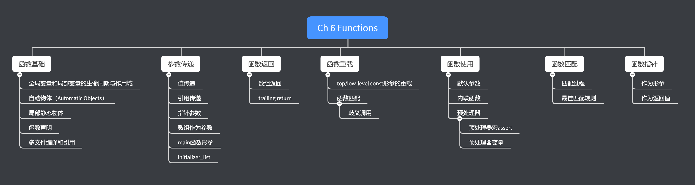



《C++ Primer》 第六章笔记。

关于函数的定义，函数参数的传递方式，函数重载，函数指针。





<!--more-->

# Chapter 6 Functions

## Function Basics

#### Parameters and Arguments

函数的形参（Parameters）和实参（Arguments）是一一对应关系，但是编译器不能保证形参被初始化的顺序。

#### Function Parameter List

为了与C语言兼容，C++同样允许用void来作为形参的参数，如下

```cpp
void f2(void)
{
}
```

参数的名字是可选的。但是如果没有设置参数名字，但因为参数没有名字所以无法在函数内部引用。但是未命名的参数还是需要指定实参的，如下：

```cpp
void pareNoName(int, float fval)
{
}

// pareNoName(0.1f);//Although int doesn't have name, we still must assign it
pareNoName(3, 0.1f);
```

#### Function Return Type

函数返回的类型不能是数组类型，也不能是函数类型，但可以返回函数和数组的指针，以及函数的调用（相当于返回调用的函数的结果）。

### Local Objects

对于一个变量而言，需要关注它的作用域以及生命周期。

在函数内部定义的变量称为局部变量，如果局部变量与全局变量有相同的名称，局部变量会隐藏全局变量的定义，如果想要调用全局变量，需要用到作用域符号`::`。

```cpp

int val = 2;

void TestLocalObject()
{
    int val = 3;
    cout << "local val is " << val << endl;
    cout << "global val is " << ::val << endl;

    /*
    local val is 3
    global val is 2
    */
}
```

全局变量的生命周期是从定义到程序终止，局部变量的生命周期是当退出了作用域。

#### Automatic Objects

函数的形参就是自动物体（Automatic Objects），它们在函数开始时被分配创建， 在函数终结时被释放。

#### Local static Objects

局部静态物体是在第一次被调用时创建，在程序终止时被摧毁，作用域在函数内部。如：

```cpp
int count_calls()
{
    static int ctr = 0;
    return ++ctr;
}

void TestStaticObjects()
{
    for (int i = 0; i != 10; ++i)
    {
        cout << count_calls() << endl;
    }

    /*
    1
    2
    3
    4
    5
    6
    7
    8
    9
    10
    */
}
```

静态的局部变量执行的是值初始化，因此即使是内建类型，它也会默认值，不会像普通的内建局部变量一样变成未定义的。

### Function Declarations

如同变量一样，函数也只能被定义一次，但可以多次声明。

如果是函数声明，则使用分号取代函数主体，也因为声明并没有函数主体，所以所有的形参有没有名字都没有区别。

如
```cpp
void pareName(int val, float fval);
void pareName(int, float);
```

一个函数的类型由函数名字，返回类型以及形参类型决定，函数的类型也成为函数原型(function prototype)。

#### Function Declarations Go in Header Files

函数的声明应该在头文件中，函数的定义在源文件中，这样如果后续要修改函数的声明，只需要改动一处即可。

在定义函数的源文件中，需要引入声明的头文件。

### Separate Compilation

#### Compiling and Linking Multiple Source Files

如我们将函数`GetNum`声明在头文件`GetNum.h`中，将函数的定义写在源文件`GetNum.cpp`中，将调用`GetNum`的语句写在源文件`Chapter6_Functions.cpp`中，则所有的文件内容如下：

```cpp
//GetNum.h
int GetNum();

//GetNum.cpp
#include "GetNum.h"

int GetNum()
{
    return 10;
}

//Chapter6_Functions.cpp
#include <iostream>
#include "GetNum.h"
using std::cout;
int main()
{
    cout << GetNum() << endl;
}
/*
10
*/
```

对于有多个源文件（CPP）文件的情况下，编译时要把所有的源文件都带上，源文件的顺序并不造成影响，如：

```text
g++ Chapter6_Functions.cpp GetNum.cpp
```

也可以单独编译（带上-c flag）某个源文件（必须是与其他源文件不依赖的），将其编译为.o文件，之后再编译其他依赖该源文件的文件时，只要带上.o文件，而不需要重新编译该文件，如下：

```text
g++ -c GetNum.cpp
g++ Chapter6_Functions.cpp GetNum.o
```

## Argument Passing

当调用函数时，实际上是用实参初始化了形参，初始化的过程与一般的参数初始化一样。而如果形参的类型是引用的话，那么会直接绑定至实参，否则的话初始化时会拷贝实参的值。

如果形参的参数是引用，称实参是引用传递（Paseed by reference或called by reference）。

如果形参的类型不是引用，那么实参会进行拷贝，称实参是值传递（Passed by value或called by value）。

### Passing Arguments by Value

当形参是值传递时，修改函数中的局部变量并不会影响实参。

#### Pointer Parameters

指针与其他非引用的变量一样，形参会通过拷贝实参的值进行初始化。但是指针的值即是指向的对象，因此拷贝生成的形参与实参指向的是同一个变量，也因此通过形参修改对象也同样会影响实参指向的对象。

如：

```cpp
void Swap(int *val1, int *val2)
{
    int temp = (*val1);
    *val1 = *val2;
    *val2 = temp;
}

void Exercise6_10()
{
    int val1 = 10, val2 = 5;
    cout << "Val 1 is " << val1 << ", Val2 is " << val2 << endl;
    Swap(&val1, &val2);
    cout << "Val 1 is " << val1 << ", Val2 is " << val2 << endl;
}
```

### Passing Argument by Reference

使用引用传递就可以在函数内部修改实参的值，如

```cpp
void TestCallByReference()
{
    int val1 = 10, val2 = 5;
    cout << "Val 1 is " << val1 << ", Val2 is " << val2 << endl;
    Swap(val1, val2);
    cout << "Val 1 is " << val1 << ", Val2 is " << val2 << endl;
}

void Swap(int &val1, int &val2)
{
    int temp = val1;
    val1 = val2;
    val2 = temp;
}
```

#### Using Reference to Avoid Copies

函数可以通过将形参设置为引用类型来避免拷贝的过程，进而可以提升性能。

且尽量使用const reference，本章的后小节会进行说明。

#### Using Reference Parameters to Return Additional Information

一个函数只可以返回一个值，在需要返回多个参数的时候，也可以通过引用，将要返回的参数作为形参的一部分传递进函数，并在函数内部修改成结果的值。

### const Parameters and Arguments

如普通的参数初始化一样，当使用实参来初始化形参时，top-level的const会被无视，如：

```cpp
void TestConstParametersAndArguments()
{
    const int ci = 3;
    int i = 2;
    func(ci);
    func(i);
    /*
    value is 3
    value is 2
    */
}

void func(const int i)
{
    cout << "value is " << i << endl;
}

// void func(int i) {}//Error,redefines
```

函数func的形参类型为const int，但是可以用int的来进行初始化，因为这里是top-level的const。也因此函数`func(int)`和函数`func(const int)`是无法同时定义的，不然当使用int调用参数时，两个函数都可匹配。

#### Use Reference to const When Possible

当可能的时候尽量使用const referencce，因为

1. const reference可以避免函数中意外的修改实参值
2. 普通reference形参，不能通过字面值进行初始化
3. 普通reference形参，不能通过非const实参进行初始化

如：

```cpp
const string ss = "";
// funs("");//error,can not use literal to initialize string reference
// funs(ss);//error,can not use const string to initialize stringreference
funss("");
funss(ss);

void funs(string &s) {}
void funss(const string &s) {}
```

### Array Parameters

虽然可以使用数组作为形参，但当数组作为形参的时候，是无法进行有效的值拷贝的。因为数组无法进行拷贝初始化，且当调用数组时，调用的实际上是指向数组第一个元素的指针。

以下三个函数定义，实际上是完全等效的：

```cpp
void print(const int *);
void print(const int[]);
void print(const int[10]);
```

即可以使用其中任意一个作为声明，再用另一个作来进行定义，而想声明其中两个则是不行的，因为会形成重复定义，后两个在编译的过程中会变换为第一种的写法。也因此，即使定义的是最后一种写法，看起来是要求一个大小为10的const int数组，但仍然可以传递普通的int指针进去，如

```cpp
int i = 0, j[2] = {0, 1};
print(&i);
print(j);

void print(const int[10])
{
}
```

因为即使形参使用数组，也会在编译时转换为指针，所以函数是不知道传进来的数组大小的，因此需要额外的信息来指定数组大小，以下为三种普遍的方式：

#### Using a Marker to Specify the Extent of an Array

如之前所示，C风格的字符串实际上是const char[]，而C风格的字符串用来判断是否是数组结尾就是用一个空白的字符作为数组结束的标记位（Marker），如下：

```cpp
print("abcd");

void print(const char cp[])
{
    if (cp)
    {
        while (*cp)
            cout << *cp++;
    }
    cout << endl;
}

/*
abcd
*/
```

但是这种方法需要找到一个几乎不会作为正常数据的值，否则就会与正常数据产生干扰。

#### Using the Standard Liberary Conventions

第二种方法是通过标准库中的`begin`和`end`方法来传递数组的开始与结束指针，如下：

```cpp
int j[2] = {0, 1};
print(begin(j), end(j));

void print(const int *beg, const int *end)
{
    while (beg != end)
        cout << *beg++ << endl;
}

/*
0
1
*/
```

#### Explicitly Passing a Size Parameter

函数中使用一个形参来指定数组的大小，如：

```cpp
print(j, end(j) - begin(j));

void print(const int *beg, size_t size)
{
    for (size_t i = 0; i != size; ++i)
    {
        cout << *beg++ << endl;
    }
}

/*
0
1
*/
```

#### Array Parameters and const

可以使用在形参使用数组的引用，这个方法可以限定传递的数组的大小，如下：

```cpp
int valList[] = {0, 1, 2, 3, 4};
print(valList);
//print(j); // j is int array with size 2,so can't pass

void print(int (&arr)[5])
{
    for (auto val : arr)
    {
        cout << val << endl;
    }
}
```

注意数组的大小也是数组类型的一部分，所以对数组进行引用限定了数组大小，例子中只有数组大小是5的数组可以传递。

#### Passing a Multidimensional Array

对于多维数组，可以通过使用一个数组的指针进行传递，如

```cpp
int mat[3][2] = {{1, 2}, {3, 4}, {5, 6}};
print(mat, 3);

void print(int (*matrix)[2], int rowSize)
{
    for (int i = 0; i != rowSize; ++i)
    {
        for (int j = 0; j != 2; ++j)
        {
            cout << matrix[i][j] << endl;
        }
    }
}

/*
1
2
3
4
5
6
*/
```

其中因为传入的是长度为2的数组的指针，所以在循环中，可以确认内部循环的最大值为2。`matrix[i]`实际上获取的是长度为2的数组，但是会自动转为int*，所以`matrix[i][i]`实际上对一个int*使用`[j]`。也可以通过解引用符进行访问，即写成`*((*(matrix + i)) + j)`

需要注意的是，无法直接通过指针的指针，如`int**`来进行传递的。因为数组的大小是类型的一部分，在上例中，`mat`的会自动转换为`int*[2]`而不是`int*`。因此如果函数的形参为`int**`，将无法匹配。如果要使用指针的指针来传递，那么就必须用指针来表示多维数组，如：

```cpp
//Initial array
int **matrix = new int *[3];
for (int i = 0; i != 3; ++i)
{
    matrix[i] = new int[2];
    matrix[i][0] = 2 * i;
    matrix[i][1] = 2 * i + 1;
}
print(matrix, 3, 2);
//release data
for (int i = 0; i != 3; ++i)
{
    delete[] matrix[i];
}
delete[] matrix;

void print(int **matrix, int rowSize, int columnSize)
{
    for (int i = 0; i != rowSize; ++i)
    {
        for (int j = 0; j != columnSize; ++j)
        {
            cout << matrix[i][j] << endl;
        }
    }
}

/*
0
1
2
3
4
5
*/
```

### main: Handling Command-Line Options

c++的main函数入口，可以是无参的，也可以是以下的格式

```cpp
int main(int argc, char** argv){}

//或者

int main(int argc,char* argv[]){}
```

第一个int参数表示传入的参数数量，第二个是C风格的字符串的类型表示传入的参数。通常最少有一个参数，该参数是运行的exe文件的路径，如定义main函数如下：

```cpp
int main(int argc, char **argv)
{
    cout << "argc count is " << argc << endl;
    for (int i = 0; i != argc; ++i)
    {
        cout << "arg is " << argv[i] << endl;
    }
}
```

当直接启动编译完的exe文件，`./a.exe`，输出结果为

```text
argc count is 1
arg is D:\Study-Notes\C++Primer\Chapter6_Functions\a.exe
```

当启动exe并传入参数时，`./a.exe 1 2 3`，输出结果为：

```text
argc count is 4
arg is D:\Study-Notes\C++Primer\Chapter6_Functions\a.exe
arg is 1
arg is 2
arg is 3
```

### Functions with Varying Parameters

有的时候并不了解一个函数究竟需要多少个形参，如一个函数需要来处理错误信息，但错误信息的数量是不固定的。

为了处理这样的情况，在C++11的特性中，有两个方法，第一种是通过`initializer_list`，第二种是通过`variadic`模板。第二种方法将在16.4中进行说明。

C++还有一种名为`elipsis`的参数类型，可以实现传递不同数量的实参，但是该方法应该仅在与C接口进行通信时使用。

#### initializer_list Parameters

initializer_list是一种表示数组的标准库中的类型，支持的操作如下表：

| 代码                           | 含义                                                      |
| ------------------------------ | --------------------------------------------------------- |
| initializer_list<T> lst;       | 默认初始化                                                |
| initializer_list<T> lst{a,b,c} | 参数初始化，元素是初始值的拷贝，且list中的元素都是const的 |
| lst2(lst)                      | initializer_list的拷贝或赋值                              |
| lst2 = lst                     | 同上                                                      |
| lst.size()                     | 返回initializer_list中的元素数量                          |
| lst.begin()                    | 返回第一个元素的指针                                      |
| lst.end()                      | 返回最后一个元素后面的指针                                |

* initializer_list的拷贝操作实际上并没有拷贝，而是共享被拷贝对象的元素

如同vector，initializer_list也是模板类，需要指定元素的类型。

如表格中所述，initializer_list中的元素都是const的，无法进行修改。

当调用initializer_list作为参数的函数时，如果想传递一系列的值来直接初始化initializer_list，则这些值必须放在大括号内。

使用例子如下：

```cpp
void TestVaryingParameters()
{
    error_msg({"functionX", "abc", "def"});
}

void error_msg(initializer_list<string> il)
{
    for (auto beg = il.begin(); beg != il.end(); ++beg)
    {
        cout << *beg << " ";
    }
    cout << endl;
}

/*
functionX abc def 
*/
```

#### Ellipsis Parameters

Elipsis是C++用来访问C中的库的，书中也未进行详细说明。但日后使用到时再进行查询。

## Return Types and the return Statement

### Functions with No Return Value

在无返回值的函数中，编译器会在函数尾部隐式的加入一个return语句。

#### Functions That Return a value

如果函数的返回值不为空，则必须写明有return语句返回该类型的值，或者是返回一个可以隐式转换为该类型的值。

如果函数中有判断语句，且在某些case下没有返回值，那么编译器有可能可以检测出该错误，也有可能检测不出来，当检测不出来时，函数的结果是未定义的。

#### How Values Are returned

函数中返回的值，会用来初始化一个临时的变量，该临时的变量会作为函数的返回结果。如：

```cpp
string ReturnThePluralVersionOfWord(size_t ctr, const string &word, const string &ending)
{
    return (ctr <= 1) ? word : word + ending;
}
```

当ctr <= 1时，返回的是word的拷贝，当ctr > 1时，返回的是一个未命名的临时string，其中的值为word + ending。

#### Nerver Return a Reference or Pointer to a Local Object

如果要避免函数返回参数的时的拷贝，可以将返回类型设置为引用。但要注意千万不要返回本地局部变量的引用或指针。如：

```cpp
const string &manip()
{
    string ret;
    if (!ret.empty())
        return ret; //error,return reference of local variable
    else
        return "empty";//error, return reference of a temporary string
}
```

在例子中，如果返回的是ret，那么返回的是一个局部变量的引用，当退出函数时，该变量会被释放，于是引用的就是一个空参数。如果返回的是"empty"，实际上返回的是值为empty的临时变量的引用。

这两种返回方式的结果都是未定义的。

#### Reference Returns Are Lvalues

如果一个函数返回的是类型，那么该函数返回的是右参数。如果一个函数返回的是类型的引用，那么该函数返回的是左参数。因此可以将返回结果为引用的函数放在等式的左边，如：

```cpp
char &Get_Val(string &str, string::size_type ix)
{
    return str[ix];
}

string s("abc");
Get_Val(s,0) = 'A';
```

#### List Initializing the Return Value

在C++11特性下，函数可以通过大括号括其一系列返回的函数，如下：

```cpp
vector<string> process()
{
    return {"A", "Bb", "c"};
}
```

该例子中，会返回一个临时的vector<string>变量，变量中有三个元素，由返回值来充填。

#### Return from main

main函数虽然指定了返回类型为int，但却可以不写返回语句，这是因为当没有返回语句时，编译器会补上return 0。

main函数返回0表示执行成功，返回其他数值通常表示执行不成功，具体的定义是系统相关的，要返回系统不相关的值，可以使用头文件`cstdlib`。如

```cpp
#include <cstdlib>

int main()
{
    if(someFailure)
        return EXIST_FAILURE;
    else
        return EXIST_SUCCESS;
}
```

这两者都是预处理器的变量，所以不需要定义作用域或using语句。

#### Recursion

在函数中可以再调用自己，这种称为递归。

main函数中不能再调用自己。

### Returning a Pointer to an Array

同样因为数组无法被拷贝，一个函数无法返回数组类型，但是返回数组的指针。关于定义返回数组指针的函数，有以下几种方法

#### Typedef / Using

#### Functions That Return Class Types and the Call Operator

```cpp
typedef int arrt[10];
// using arrt = int[10];// equally

arrt *funcArray();
```

#### Declaring a Function That Returns a Pointer to an Array

像声明指向数组的变量那样直接定义，如

```cpp
int (*funcArray())[10];
```

funcArray()表明形参为空，(*funcArray())表明返回的是一个指针类型。

#### Using a Trailing Return Type

该方法是C++11的特性，Trailing Return可以针对任何的类型的函数，但针对返回值为数组的指针的函数时尤为有效。如

```cpp
auto funcArray() -> int (*)[];
```

该方法下，用auto替代原先定义返回类型的地方。

#### Using decltype

因为对数组使用decltype，返回的是数组类型，而不是指针类型，如

```cpp
int odd[] = {1, 2, 3, 4, 5};
int even[] = {0, 2, 4, 6, 8};
decltype(odd) *funcArray()
{
    return &odd;
}
```

## Overloaded Functions

main函数无法被重载

#### Defining Overloaded Functions

重载函数必须在形参的类型或者形参的数量上有区分。无法仅仅通过函数的返回类型来进行重载。

#### Overloading and const Parameters

无法仅通过形参的top-level的const属性进行函数重载，如下两个函数虽然不同，但却会造成重复定义。因为当调用函数时，top-level的const属性会被无视，因此对于调用者而说，两个函数是没有区别的，它们实际差异是体现在函数body中对形参的处理。

```cpp
Record lookup(Phone);
Record lookup[(const Phone);
```

但如果const的区别是low-level的，那么是可以进行重载的，如

```cpp
Record loopup(Account&);
Record loopup(const Account&);
```

对于调用者而言，上面的两个函数是不同的。如果使用的实参是const的，那么将无法直接调用第一个函数。当使用的形参是非const的，那么会优先调用第一个函数，关于重载函数的调用选择规则会在之后的小节中进行说明。

#### const_cast and Overloading

如有以下函数：

```cpp
const string &shorterString(const string &s1, const string &s2)
{
    return s1.size() < s2.size() ? s1 : s2;
}
```

函数的形参是low level的const引用，返回的类型也为low level的const引用。如果调用的实参为非const的引用，会进行隐式的类型转换，此时返回结果将仍然是const的引用。

而如果想要实现，传入的实参是const的，返回为const类型；传入的实参是non-const类型，返回也会non-const类型，就需要进行函数重载。如下所示：

```cpp
string &shorterString(string &s1, string &s2)
{
    const string &r = shorterString(const_cast<const string &>(s1), const_cast<const string &>(s2));
    return const_cast<string &>(r);
}
```

这里通过调用形参为const引用的版本来获取结果，注意在调用函数时，需要将形参转换为const类型，否则调用的将还是这个函数本身，即形成了无止境的递归。在返回结果时将const引用的版本返回的const string&转换为string&。

#### Calling an Overloaded Function

从一系列重载函数中找到正确的函数，这个过程叫做函数匹配（Function matching）。

对于调用重载函数，一共有三种可能的结果：

1. 编译器找到了最佳的匹配函数（Best match），最终将调用该函数。
2. 编译器没有找到任何可以匹配的函数（No match），最终编译器将报错。
3. 编译器找到了多个匹配的函数，且无法从中判断出谁匹配度更高，为歧义调用（Ambiguous call），最终编译器将报错。

### Overloading and Scope

如果在内层的代码范围内声明或者定义一个名字，则在外层代码块范围中同样名字的对象将被隐藏。这个规则同时适用于变量和函数。


如下代码，在内层作用域中定义的变量和函数将隐藏外层作用域中的同名变量与函数，如果要调用外层作用域的话需要`::`。

```cpp
string read() { return "readed"; }
void print(const string &s) { cout << s << endl; }
void print(double d) { cout << d << endl; }
void fooBar(int ival)
{
    bool read = false;
    // string s = read();//error, read() is hidden, in this scope read is a bool variable
    string s = ::read(); //ok,use :: to indicate search name is global scope

    // Decalare a function in the inner scope.This action is rare in practice.
    //Here we only use this to illustrate scope hidding
    void print(int);
    // print("value :");//error, print(const string &s) is hidden.
    print(ival);
    print(3.14);//ok, but it will call print(int)
}
```

在C++中，如果调用了一个名字的对象，编译器会在当前作用域首先找该名字的对象（可能不存在，可能一个，可能多个）。如果对象不存在的话，才会去外部作用域查找。

因此在上述代码中，调用`print`函数，编译器在当前的作用域找到了`print(int)`，就不会在外层的作用域查找了，于是`print(double)`与`print(const string&)`都不会被作为重载的候选人，更不会进行函数匹配。

## Features for Specialized Uses

### Default Arguments

可以为形参设定默认参数。但如果为一个形参设定了默认参数，该形参后面的所有形参都必须指明默认参数。

如

```cpp
string screen(int ht = 24, int wid = 80,char background = ' ');
```

如果仅想要修改最后一个变量，其他的变量仍然按默认参数，也仍然必须写明前面的参数。

如调用`screen('?')`，看起来实参类型为`char`，与最后一个参数相匹配，但在调用过程中，形参与实参是一一对应的，该表达式等同于`screen('?', 80, ' '`，即`'?'`会被转换为int作为第一个参数。

#### Default Argument Declarations

C++中，只可以定义一个变量，但可以多次声明变量。但是对于默认参数而言，每个形参的默认参数都最多被声明一次，如

```cpp
string screen(int,int,char = ' ');
// string screen(int,int,char = '*');
string screen(int=24,int=80,char);
```

在第一条语句执行后，第二条语句无法通过编译，因为它重新声明了char类型的形参的默认值，造成了重复定义。而第三条语句仍然可以执行，且第三条语句执行后，函数`screen`的三个形参都有了默认值。

```cpp
string screen(int, int, char = '*');
// string screen(int, int, char = ' ');
string screen(int = 24, int = 80, char);

string screen(int width, int height, char c)
{
    cout << "width is " << width << ", height is " << height << ", c is " << c << endl;
    return "";
}

screen();
/*
width is 24, height is 80, c is *
*/
```

#### Default Argument Initializers

函数的默认参数可以是任何可以转换为形参类型的表达式，如

```cpp
int vall = 20;
char cc = 'a';

void printDefaultArgument(int ran = rand(), int w = vall, char c = cc)
{
    cout << "random is " << ran << ", w is " << w << ", c is " << c << endl;
}

void TestDefaultArgument()
{
    printDefaultArgument();
    vall = 30;
    char cc = 'b';
    printDefaultArgument();
}

/*
random is 41, w is 20, c is a
random is 18467, w is 30, c is a
*/
```

上述代码中，`printDefaultArgument`函数第一个形参`ran`的默认值是一个函数，函数会随机取一个int值，第二个和第三个形参都是全局变量。

在函数`TestDefaultArgument`中调用`printDefaultArgument`函数，第二次调用前先改变了全局变量`vall`的值，然后定义了一个同名新局部变量`cc`。但是因为`printDefaultArgument`函数的第三个形参实际上是全局变量中的`cc`，所以在第二次调用`printDefaultArgument`时，第三个形参的数值并没有发生改变。

### Inline and constexpr Functions

在大多数的设备下，函数调用是一个花费较大的操作，需要拷贝实参，记录和回复调用时的状态等。`inline`关键字可以减少函数的调用。

#### inline Functions Avoid Function Call Overhead

如果定义一个函数为`inline`的，那么编译器会在编译阶段，将函数调用的地方换成函数主体，这样就避免了函数的调用。这样的函数称为内联函数（inline Function）。

如
```cpp
inline const string &shorterString(const string &s1, const string &s2)
{
    return s1.size() < s2.size() ? s1 : s2;
}
```

注意并不是函数加上了`inline`关键字就一定会变成内联函数，`inline`关键字如同一个申请，至于函数最终是否会变成内联由编译器决定。通常而言，递归函数和行数大于75行的函数是不会变成内联函数的。

#### constexpr Functions

//TODO

#### Put inline and constexpr Functions in Header Files

和其他的函数不同，内联函数在一个程序中是可以被多次定义的，如:

```cpp
// GetNum.h
int GetNum();
inline double GetDoubleNum();

// GetNum.cpp
int GetNum()
{
    return 10;
}

inline double GetDoubleNum()
{
    return 3.14;
}

//Chapter6_Functions.cpp

// int GetNum()
// {
//     return 10;
// }
inline double GetDoubleNum()
{
    return 4.15;
}

cout << GetDoubleNum();

/*
4.15
*/
```

可以看到在`Chapter6_Functions.cpp`和`GetNum.cpp`两个源文件中都对`GetDoubleNum`函数进行了定义，且仍然可以正常运行。而如果尝试在`Chapter6_Functions.cpp`中再次定义`GetNum`函数，则会发生编译错误。

这是因为对于内联函数而言，是在本源文件中搜索内联函数的定义然后进行替代。

最合理的方式是将内联函数的定义放在头文件中，这样在使用include时，实际上就将内联函数的定义拷贝到了源文件中。

### Aids for Debugging

可以使用预处理器来帮助C++进行调试工作，即实现在开发过程中，可以打出调试log，而在实际程序中log则不予显示的方法。

#### The assert Preprocessor Macro

预处理宏（Preprocessor Macro）是一种预处理器变量，运行起来有点像内联函数。

`assert`预处理器宏可以接纳一个表示condition的表达式，定义在头文件`cassert`中，且因为是预处理器变量，因此不需要设定命名空间。当表达式的结果为false时，将打出信息并且终止程序的运行。如：

```cpp
int a = 3, b = 2;
assert(a < b);

/*
Assertion failed!

Program: D:\Study-Notes\C++Primer\Chapter6_Functions\a.exe
File: Chapter6_Functions.cpp, Line 50

Expression: a < b
*/
```

`assert`通常是用来判断那些不可能发生的情况，如当某个数值超过了阈值等。

#### The NDEBUG Preprocessor Variable

`assert`的运行状态预处理变量`NDEBUG`决定，如果该变量被定义了，则`assert`不会被执行。

因此可以通过在代码中加入`#define NDEBUG`来关闭`assert`的调试。也可以直接在编译时通过flag -D来加入这句话，如

```text
g++ Chapter6_Functions.cpp 

$ ./a.exe 

Assertion failed!

Program: D:\Study-Notes\C++Primer\Chapter6_Functions\a.exe
File: Chapter6_Functions.cpp, Line 50

Expression: a < b

g++ Chapter6_Functions.cpp -D NDEBUG

$ ./a.exe 
4.15
```

也可以进一步利用NDEBUG来定义自己的调试函数，如

```cpp
void Debug(const string &msg)
{
#ifndef NDEBUG
    cout << msg << endl;
#endif
}
```

C++还提供了一些帮助调试的预处理器变量：

| 变量     | 含义               |
| -------- | ------------------ |
| __func__ | 当前的函数名       |
| __FILE__ | 当前文件名         |
| __LINE__ | 当前行号           |
| __TIME__ | 该文件被编译的时间 |
| __DATE__ | 该文件被编译的日期 |

```cpp
void TestPreprocessorVariable()
{
    cout << "Function is " << __func__ << endl;
    cout << "File is " << __FILE__ << endl;
    cout << "Line is " << __LINE__ << endl;
    cout << "Time is " << __TIME__ << endl;
    cout << "Dateis " << __DATE__ << endl;
}

/*
Function is TestPreprocessorVariable
File is Chapter6_Functions.cpp
Line is 78
Time is 16:49:12
Dateis Feb 22 2020
*/

```

## Function Matching

函数匹配过程可以分为三步：

1. 找出候选函数（candidate functions），通过函数的名字，找到所有可能的重载函数（注意作用域隐藏）。
2. 找出可选函数（viable functions），在候选函数中通过形参数量和类型找出可以被调用的函数
3. 找出最佳匹配，在所有的可选函数中根据规则找出最佳匹配函数。

以下是找最佳匹配函数的规则，排名越靠前的函数，会越优先被选取

1. 实参类型与形参类型完全匹配，包括
   a. 实参类型与形参类型相同，不需要任何转换
   b. 实参是数组或函数，形参是对应的指针类型
   c. 实参和形参的差距是可以无视的top-level const

2. 需要进行const转换
   low level的const转换，如实参是nonconst的引用，形参是const的引用。

3. 需要进行数值提升（promotion）
   较小的整数类型会自动转换成int或更高类型的整数类型。如

   ```cpp
    void ff(int);
    void ff(short);
    ff('a');//Call ff(int)
   ```
   
   因为十进制的字面值会自动转换为最小为`int`的变量，所以`a`的最终类型为int。所以可以与`ff(int)`完全匹配，但是与`ff(short)`需要进行一次转换。

4. 需要进行算数转换或者指针转换
   算数类型的转换，如int转float,int转double。注意只要都是算数转换，则它们的排名就是一样的，无论正在进行的类型转换是什么。

   指针转换指的是，0转换为空指针，non const的指针可以转换为void*，任何指针都可以转换为`const void*`。

5. 需要进行类转换（14.9节中进行说明）

如果出现了多个可选函数由相同的排名，则会出现歧义调用（Ambiguous call）。如

```cpp
f(int,int);
f(double,double);

// f(42,2.56); // ambiguous call
```

对于调用`f(42,2.56)`无论是访问`f(int,int)`和`f(double,double)`都是进行了一次算数转换，所以这两个函数的优先级一样的，为歧义调用。

还有类似于

```cpp
void manip(long);
void manip(float);
// manip(3.14); // ambiguous call
```

无论调用哪个函数都会进行算数转换，即使转换的目标类型不同，但是函数的优先级仍然是一样的，所以为歧义调用。

## Pointers to Functions

函数指针就是指向函数的指针，指针的类型需要匹配要指向的函数的形参数量，形参类型和返回值类型。如：

```cpp
bool (*pf)(const string &, const string &); // uninitialized
```

pf为指向两个形参都是`const string&`，返回值为bool的函数的指针。如可以指向

```cpp
bool lengthCompare(const string &, const string &);
```

注意，定义pf时，外面的括号不能缺少，不然变成

```cpp
bool *pf(const string &, const string &);
```

上述代码意思为一个名为pf的返回值为bool*的函数的声明。

#### Using Function Pointers

在赋值和使用函数指针的时候，取地址符(&)以及解引用符(*)都可以被省略。

```cpp
bool (*fp)(const string &, const string &) = lengthCompare;
// bool (*fp)(const string &, const string &) = &lengthCompare;//equal to above

bool b1 = fp("hello", "goodbyte");
bool b2 = (*fp)("hello", "goodbyte");// equal to above
bool b3 = lengthCompare("hello", "goodby");//equal ro above

cout << "b1: " << b1 << endl;
cout << "b2: " << b2 << endl;
cout << "b3: " << b3 << endl;

/*
b1: 0
b2: 0
b3: 0
*/


当使用函数指针时，赋值给函数指针的函数的类型必须与函数指针的类型完全一致。

```cpp
void ff(nt val);
void (*p1)(unsigned int) = ff;
// void (*p2)(int) = ff; //error, can't convert unsigned int to int
```

#### Function Pointer Parameters

无法将函数类型作为函数的形参类型，但是可以将函数指针作为形参的函数类型。如同数组一样，如果将函数的形参类型设置为某个函数类型，那么会形参类型会自动转换为该函数类型的指针，如

```cpp
void print(const int *);
void print(const int[]);

void useBigger(const string &s1,const string &s2,bool pf(const string&,const string&));
void useBigger(const string &s1,const string &s2,bool (*pf)(const string&,const string&));
```

上述代码，每一组是完全相同的。

调用形参为函数指针的函数时，也可以省略取地址符，如以下两个语句是完全相同的。

```cpp
useBigger(s1, s2, lengthCompare);
useBigger(s1, s2, &lengthCompare);
```

但当使用`decltype`时，使用函数类型以及函数类型的指针返回的结果是不同的，如

```cpp
//Func and Func2 are function type
typedef bool Func (const string &,const string &);
typedef decltype(lengthCompare) Func2;

//FuncP and FuncP2 are pointer to function type
typedef bool (*FuncP) (const string &,const string &);
typedef decltype(lengthCompare) *FuncP2;
```

上述代码，每组等效，但是第一组定义的是函数类型的别名，第二组定义的是函数指针的别名。

但使用函数类型和函数指针的别名来定义函数时，又可以直接进行转换，如下两句，完全等效

```cpp
void useBigger(s1, s2, Func);
void useBigger(s1, s2, FuncP);
```

#### Returning a Pointer to Function

如同数组一样，无法将函数类型作为函数的返回值，但可以返回函数类型的指针。如需要定义函数`f1`，形参为int，返回值类型为指向形参为(int*,int)，返回值为int的函数的指针。

以下是四种定义返回类型为函数指针的函数的方法，分别是使用别名，直接定义，使用trailing方法，使用decltype

```cpp
//Method1: use alias
using F = int(int *, int);      //F is Function type,retun type is int
using FF = int *(int *, int);   //F is Function type,retun type is pointe to int
using PF = int (*)(int *, int); //FP is pointer to Function type
PF f1(int);
// F f1(int); //error, function type can not be return type
F *f1(int);

//Method 2: directly
//like directly define return is pointer to array, which looks like
//int (*f1(int)) [10];
int (*f1(int))(int*,int);

//Method 3: use trailing return
auto f1(int) -> int (*)(int *, int);

//Method4: use decltype
int func1(int*,int);
decltype(func1)* f1(int);
```



引用：

1. *Cpp Primer* 5th Aug.2012



***