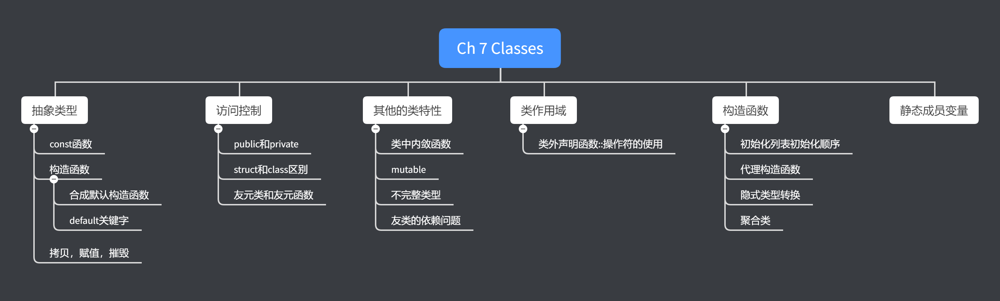



《C++ Primer》 第七章笔记





<!--more-->

# Chapter 7 Classes

## Defining Abstract Data Types

如果一个类让用户可以任意访问其中的数据，且必须自己定义针对相关数据的操作，则该类不是抽象类型。

### Designing the Sales_data class

在本章中，会逐步完善一个称为Sales_data的类，在完善的过程中解释类的特性。

### Defining the Revised Sales_data Class

成员函数必须在类内声明，可以在类内或类外进行定义。且在类内定义的函数默认是内联（inline）的。

如目前Sales_data类为：
```cpp
#include <iostream>
#include <string>

using std::istream;
using std::ostream;
using std::string;

struct Sales_data
{
    //Member function
    string isbn() const { return bookNo; }
    Sales_data &combine(const Sales_data &);
    double avg_Price() const;

    //Member variable
    string bookNo;
    unsigned units_sold = 0;
    double revenue = 0;
};

//nonmember but related function

Sales_data add(const Sales_data &, const Sales_data &);
ostream &print(ostream &, const Sales_data &);
istream &read(istream &, Sales_data &);
```

#### Introducing this

首先注意成员函数:

```cpp
string isbn() const { return bookNo; }
```

当类的实例化调用函数时，实际上会隐式的传递一个this指针，指针指向该实例的地址，如下代码：

```cpp
Sales_data total;
total.isbn();
```

编译器会将`total.isbn()`调用，改写为类似于如下代码：

```cpp
Sales_data::isbn(&total);
```

当在函数内部访问成员变量时都相当于用了`this->`。如函数体内访问了bookNo，实际上等同于`this->bookNo`，而这个调用下，this指向total，所以访问的是实例化total中的bookNo变量。

另外this是一个const指针，即无法让this指向别的变量。

#### Intruducing const Member Functions

同样还是成员函数：

```cpp
string isbn() const { return bookNo; }
```

还需要注意到在这个函数的声明中有关键字`const`，当const跟在参数列表后时，其目的是改变this指针的类型，让this指针是一个指向const变量的指针。整个函数的定义会被编译器翻译为类似如下的代码：

```cpp
string Sales_data::isbn(const Sales_data* const this)
{ 
    return this->bookNo;
}
```

称这样的函数为const函数。

如果该函数不是定义为const的，则const的Sales_data实例将无法调用isbn函数。如同变量的隐式转换规律，一个const变量无法赋值给一个指向非const变量的指针。实例代码如下：

```cpp
//In SalesData_Struct.h, modify the declaration of isbn function
string isbn() { return bookNo; }

//Call isbn function
Sales_data total;
total.isbn();
const Sales_data cTotal;
// cTotal.isbn();//error
```

在编译器的隐式转换后，`cTotal.isbn()`会变成用一个`const Sales_data* const`类型的指针区初始化一个`Sales_data* const`类型的指针，如之前章节所述，该操作是非法的。

#### Class Scope and Member Functions

类的编译分为两步，首先会先编译所有的声明，然后再编译函数的定义（实现），因此在函数的实现中，可以任意调用其他的成员变量，无论它定义在更前面还是后面。

#### Defining a Member Function outside the Class

如果在类外定义const函数，同样需要在参数列表后加上const关键字

```cpp
double Sales_data::avg_Price() const
{
    if (units_sold)
        return revenue / units_sold;
    else
        return 0;
}
```

#### Defining a Function to Return "This" Object

如果成员函数返回类型是该类型本身或者该类型的引用，可以返回`*this`，如：

```cpp
Sales_data &Sales_data::combine(const Sales_data &rhs)
{
    units_sold += rhs.units_sold;
    revenue += rhs.revenue;
    return *this;
}
```

### Defining Nonmember Class-Related Functions

一些函数从概念上是某种类型的一部分，但却不是定义在函数的内部。这样的函数声明应该写在该类型的头文件（函数定义可以放在头文件对应的cpp文件中）。

如：

```cpp
//In SalesData_struct.h
//nonmember but related function

Sales_data add(const Sales_data &, const Sales_data &);
ostream &print(ostream &, const Sales_data &);
istream &read(istream &, Sales_data &);

//In SalesData_struct.cpp
Sales_data add(const Sales_data &lhs, const Sales_data &rhs)
{
    Sales_data sum = lhs;
    sum.combine(rhs);
    return sum;
}

ostream &print(ostream &os, const Sales_data &item)
{
    os << item.isbn() << " " << item.units_sold << " " << item.revenue << " " << item.avg_Price();
    return os;
}
istream &read(istream &is, Sales_data &item)
{
    double price = 0;
    is >> item.bookNo >> item.units_sold >> price;
    item.revenue = price * item.units_sold;
    return is;
}
```

注意在函数`print`和`read`中返回的是ostream和istream的引用，这是因为这两个类型不支持拷贝。

在`add`函数中，首先是一个拷贝初始化`Sales_data sum = lhs`。C++的默认实现中，拷贝一个类类型会拷贝其中所有的成员变量，因此sum和lhs中的所有成员变量将有相同的值（但在不同的内存中）。

### Constructors

构造函数特点：

1. 构造函数在实例化创建时被执行。
2. 构造函数与函数类型同名
3. 构造函数没有返回值
4. 构造函数不允许被定义成const函数。因为一个对象的const与否是在创建后才决定的，所以构造函数会在决定constness前先执行。

#### The Synthesized Default Constructor

默认构造函数（default constructor）是不需要任何形参的构造函数。

当类没有定义任何构造函数时，编译器会创建合成默认构造函数（synthesized default constructor）。合成默认构造函数的操作为，当参数有类内初始化（变量定义时有初始化值），如`int a = 3;`，则使用类内初始化值进行值初始化，否则使用变量的默认初始化。

#### Some Classes Cannot Rely on the synthesized Default Constructor

一些类无法依赖合成默认构造函数，因为

1. 只有类没有定义任何构造函数时，才会有合成默认构造函数
2. 当没有类内初始化值时，合成默认构造函数会使用变量默认初始化，但内建类型（int等）和复合类型（array，pointer）出现在函数内部时默认值是未定义的。所以当且仅当这些参数有类内初始化值时才可以依赖合成默认构造函数，否则构造的结果是未定义的。
3. 有的情况下，编译器无法生成合成默认构造函数。如类中的一个成员变量并没有默认构造函数，合成默认构造函数也就无法去初始化这个变量。因此在这种情况下，需要自己定义默认构造函数。如
   
#### Defining the Sales_data Constructors

Sales_data构造函数定义如下：

```cpp
//Inside class body
Sales_data() = default;
Sales_data(const string &s) : bookNo(s) {}
Sales_data(const string &s, unsigned n, double p) : bookNo(s), units_sold(n), revenue(p * n) {}
Sales_data(istream &);

//Outside class body
Sales_data::Sales_data(istream &is)
{
    read(is, *this);
}
```

上述一共定义了四个构造函数，其中三个是在类内定义的，一个是在类外定义的。

在定义默认构造函数时，使用了default关键字，该关键字是C++11的特性，表示希望构造函数表现的如同合成默认构造函数一模一样。

#### Constructor Initializer List

在构造函数中的定义中，出现在参数列表后，函数主体前，以`:`开头的部分称为初始化列表（Initializer List）。初始化列表必须出现在函数定义中，即必须与函数主体一起出现。

当一个成员变量没有出现在初始化列表中时，该函数的初始化逻辑与合成构造函数相同，即有类内初始化值使用类内初始化，否则使用默认初始化。

* 建议为每个成员参数都设置类内初始化值

#### Defining a Constructor outside the Class Body

如形参为`istream`版本的构造函数：

```cpp
Sales_data(istream &);

Sales_data::Sales_data(istream &is)
{
    read(is, *this);
}
```

该构造函数没有初始化列表，或者严格意义上说，初始化列表为空。则该构造函数会在执行函数主体前，先按照合成默认构造函数的逻辑初始化所有成员变量，然后再执行函数主体。

> 尽量在初始化列表中初始化变量。如果将成员变量的赋值写在构造函数主体内，则实际上是经过了一个默认初始化，再进行了一个赋值。

### Copy, Assignment, and Destruction

类还要控制对象是如何被拷贝，赋值和摧毁的。

1. 拷贝：当使用对象初始化另一个变量，或作为值类型（没有引用）传递进函数或从函数返回时，对象都会经历拷贝。
2. 赋值：当使用赋值操作符（`=`）时会经历赋值
3. 摧毁：当对象退出作用域时会被摧毁。在数组和vector中的元素，会在容器摧毁时被摧毁。

如果用户没有指定拷贝，赋值和摧毁的实现，编译器都会提供合成版本。以下代码展示了编译器提供的合成赋值操作：

```cpp
total = trans; // synthesized assignment

//Equals to
total.bookNo = trans.bookNo
total.units_sold = trans.units_sold
total.revenue = trans.revenue
```

#### Some Classes Canot Rely on the Synthesized Versins

通常来说，有动态内存分配的类不适合合成版本的拷贝，赋值和摧毁（第12章和13.1.4节会解释）。

但是合成版本可以正确处理string和vector，如下：

```cpp
Test firstOne;
firstOne.value = {1, 2, 3};
Test secondOne;
secondOne = firstOne;

firstOne.value[0] = 4;

cout << "First one value is: " << endl;
for (int i : firstOne.value)
    cout << i << " ";

cout << endl;

cout << "Second one value is: " << endl;
for (int i : secondOne.value)
    cout << i << "";

// First one value is: 
// 4 2 3
// Second one value is:
// 123
```

Test类中仅包含一个vector，如下：

```cpp
struct Test
{
    vector<int> value;
};
```

可以看到合成默认赋值正确的拷贝了vector中的每个元素。

## Access Control and Encapsulation

public关键字后的变量可以被程序的其他部分访问，private关键字后变量仅能被类中的成员函数访问。

public和private关键字可以出现在类中出现任意多次。

#### Using the class or struct keyboard

struct和class的**唯一**区别在于，class中没有写在public和private后的成员默认是private的，而struct中则默认是public的（struct中同样可以定义public和private）。

### Friends

一个类可以允许其他的类或者函数访问其中的非public变量，此时其他的函数或者类被称为友类（函数）（Friends）。

要声明函数是友函数，只需要在类中加上函数的声明，并且最前方加入`friend`关键字即可。如下：

```cpp
class Sales_data
{

    friend Sales_data add(const Sales_data &, const Sales_data &);
    friend ostream &print(ostream &, const Sales_data &);
    friend istream &read(istream &, Sales_data &);

public:
    Sales_data() = default;
    Sales_data(const string &s);
    Sales_data(const string &s, unsigned n, double p) : bookNo(s), units_sold(n), revenue(p * n) {}
    Sales_data(istream &);

public:
    //Member function
    string isbn() const { return bookNo; }
    // string isbn() { return bookNo; } // should be const
    Sales_data &combine(const Sales_data &);

private:
    double avg_Price() const;
    //Member variable
    string bookNo;
    unsigned units_sold = 0;
    double revenue = 0;
};
```

`friend`关键字只可以出现在类的定义中，而且因为严格意义上它并不是类的一部分，所以可以出现在类中的任意地方，不受public和private影响。

#### Declarations for Friends

在类内部关于friends的声明并不是函数声明，因此应该在类外部再次声明函数。如：

```cpp
class Sales_data
{
    friend Sales_data add(const Sales_data &, const Sales_data &);
    friend ostream &print(ostream &, const Sales_data &);
    friend istream &read(istream &, Sales_data &); 

    .
    .
    .
}

// Sales_data returnAddResult(const Sales_data &lhs, const Sales_data &rhs)
// {
//     return add(lhs, rhs);
// } //Error

Sales_data add(const Sales_data &, const Sales_data &);
ostream &print(ostream &, const Sales_data &);
istream &read(istream &, Sales_data &);
```

示例代码中的`returnAddResult`尝试返回`add`函数的结果，但因为`add`函数仅被声明为了友函数，并没有真正的进行声明，所以无法访问。

* 虽然即使不在类外部再次声明函数，大部分的编译器也都能正确编译。但是C++标准是要求在类外再次声明的，即使程序在没有再次声明的情况下正常运行了，也不能保证该代码换一个编译器仍然能正常工作。

## Additional Class Features

7.1-7.2以`Sales_data`这个类作为例子说明了类的一些特性。在这一节中会继续深入探讨这些特性。

### Class Members Revisited

#### Defining a Type Member

在类内部，也可以定义Type成员。该成员与其他的成员类型一样，是受public和private关键字影响的。但与其他成员不同的是，在使用该类型前，必须已经出现了该类型的定义（对其他成员，会先编译声明，再编译定义，因此成员的位置不造成任何影响），如下：

```cpp
class Screen
{
public:
    // pos i = 0; //error, the pos hasn't been 
    typedef string::size_type pos;
    // using pos = string::size_type; // same with above

private:
    pos cursor = 0, height = 0, width = 0;
    string content;
};
```

当在类外访问该别名时，也需要像访问普通变量一样，如`Screen::pos`

#### Making Members inline

如之前所述，定义在类内部的函数会隐式的认为为inline的。也可以通过显示的在函数类内声明或类外定义前加上inline来将函数变为内联函数，如：

```cpp
class Screen
{
    ...
    char get() const
    {
        return content[cursor];
    }

    inline char get(pos ht, pos wd) const;
    
    ...
}

inline char Screen::get(pos ht, pos wd) const
{
    
}
```

在上述代码中，`get()`是隐式的被定义为内联，`get(pos ht, pos wd)`是显示的被定义为内联，代码中`get(pos ht, pos wd)`的声明和定义处都加上了关键字inline，实际上只需要在任意一处定义即可。

注意如在第六章中所述，内联函数的定义建议与声明放在同一个头文件中

#### mutable Data Members

mutable数据成员永远不会是const的，即使在const函数中（this指针是指向const的指针）仍然能被修改。如

```cpp
class Screen
{
public:
    ...
    void ChangeAccessCtr() const;
    ...

private:
    ...
    mutable size_t accessCtr = 0;
    ...
}

void Screen::ChangeAccessCtr() const
{
    ++accessCtr;
}

```

上述代码中,`ChangeAccessCtr`是const函数，但因为accessCtr变量是mutable的，所以仍然能够修改accessCtr。

### Functions That Return *this

如果某成员函数返回的类型为类的引用，则该函数可以被正确的级联起来，否则虽然可以通过编译，但之后的操作是基于临时变量，如下：

```cpp
//Define class function outside class
Screen &Screen::move(pos ht, pos wd)
{
    pos row = ht * width;
    cursor = row + wd;
    return *this;
}

Screen &Screen::set(char c)
{
    content[cursor] = c;
    return *this;
}

Screen Screen::move_copy(pos ht, pos wd)
{
    pos row = ht * width;
    cursor = row + wd;
    return *this;
}


//Test code

Screen sc(20, 20, ' ');
sc.move(4, 0).set('a');
cout << "content is " << sc.get() << endl;
sc.move_copy(4,0).set('b');
cout << "content is " << sc.get() << endl;

/*
content is a
content is a
*/
```

如上述代码所示，`move`函数返回的是类型的引用，`move_copy`函数返回的是类型本身，因此实际上返回的是一个经过拷贝初始化临时变量。当对`move`函数的返回值调用`set`时，原先的值被修改了，而对`move_copy`函数的返回值调用`set`时，被修改的实际上是返回的临时变量。

#### Returning *this from a const Member Function

如果成员函数是const函数，且返回类型是该类型的指针或引用，那么该指针或引用是指向const变量的。也因此无法级联调用其他非const的函数，如下所示：

```cpp
//In Screen.h

class Screen
{
public:
    ...
    inline const Screen &Display() const;
    ...
}

const Screen &Screen::Display() const
{
    cout << content;
    return *this;
}

//In Chapter7_Classes.cpp

// sc.Display().set('a'); //error when there is no nonconst overload
```

在上述代码中，因为`Display`函数是const的，因此传入的this指针是`const Screen * const`类型，也因此如果返回的是`*this`，返回类型为`const Screen&`。

调用语句`sc.Display().set('a')`失败，是因为set不是const函数，所以其this指针类型为`Screen * const`，而传入的是Display返回的变量指针，类型为`const Screen * const`，所以无法进行隐式转换。

#### Overloading Based on const

解决上述问题的方法是，定义一个非const的函数进行重载，因为函数的const与否实际是决定传入的this指针的类型，而且是low level的const区别，所以可以进行重载。如下所示：

```cpp
//In Screen.h
class Screen
{
public:
    ...
    inline const Screen &Display(ostream &) const;
    inline Screen &Display(ostream &);
    ...
private:
    void do_display(ostream &os) const;
}

const Screen &Screen::Display(ostream &os) const
{
    do_display(os);
    return *this;
}

//In Screen.cpp
Screen &Screen::Display(ostream &os)
{
    do_display(os);
    return *this;
}

void Screen::do_display(ostream &os) const
{
    os << content;
}

//In Chapter7_Classes.cpp
sc.Display(cout).set('a'); // correct,when there is nonconst overwrite

```

在上述代码中，`sc.Display(cout).set('a')`可以成功运行，因为类中定义了const和非const两个版本的Display函数。该语句实际调用的是非const版本的Display，其中会调用const函数`do_display`，调用中存在将指向非const对象的指针（this指针）隐式转换为指向const对象的指针的过程。

### Class Type

每个类都定义了一个独特的类型。两个不同的类即使其中的所有成员都一模一样，也无法相互赋值，但可以通过指针进行转换。如下：

```cpp
//In Test.h
struct First
{
    int memi = 0;
    int getMem = 0;
};

struct Second
{
    int memi = 0;
    int getMem = 0;
};

//In Chapter7_Classes.cpp

First first;
Second sec;
first.memi = 2;

// sec = first; //Error

Second *sp = reinterpret_cast<Second *>(&first);
cout << "sp value is " << sp->memi << endl;

/*
sp value is 2
*/
```

#### Class Declarations

可以在没有定义类的情况下声明类，如

```cpp
struct NotDefined;
```

这种声明称为前向声明(forward declaration)。在执行完声明，但还没有执行完定义前，类`NotDefined`是不完整类型（incomplete type）。编译器知道了该类型是类，但还不知道其中包含有什么成员。

当创建一个类型的实例化时，该类型必须经过了定义。否则编译器不知道需要为他分配多少的内存。

不完整类型只能用于三个地方：

1. 定义该类型的指针或引用
2. 作为函数声明中的参数或者返回类型。注意是声明，不是定义
3. 作为静态类型成为类的成员

在类的定义过程中，类还是不完整的。因为不完整类型可以用于以上三个地方，所以一个类型可以将本类型的指针或引用作为成员参数，或作为静态成员。也可以用本类型作为成员函数的形参和返回值。如：

```cpp
struct TestNotDefined
{
    NotDefined *np;
    static NotDefined ns;
    NotDefined functionAboutNotDefine(NotDefined);
};
```

### Friendship Revisited

一个类可以将另一个类或者某个类中特定的成员函数作为友类或友函数。

#### Friendship between Classes

在类中定义另一个类为友类，同样需要使用关键字`friend`，另外还需要指定类型为class，如

```cpp
//In Screen.h
class Screen
{
    friend class Window_mgr;
    ....
}
```

与定义普通的友函数一样，定义友类的语句可以出现在类定义内部的任何地方。此时，虽然出现了`Window_mgr`类名，但并不需要`Window_mgr`类被定义，甚至不需要其被声明。

定义`Window_mgr`类的代码如下：

```cpp
//In Window_mgr.h
#include <vector>
#include "Screen.h"

using std::vector;

class Window_mgr
{
public:
    using ScreenIndex = vector<Screen>::size_type;
    void Clear(ScreenIndex index);

private:
    vector<Screen> screens{Screen(5, 5, 'a')};
};

//In Window_mgr.cpp
#include "Window_mgr.h"

void Window_mgr::Clear(ScreenIndex index)
{
    Screen &s = screens[index];
    s.content = string(s.height * s.width, ' ');
}
```

这里因为需要真切的用到Screen类型，所以需要引入`Screen.h`文件。注意在函数Clear的实现中，访问了Screen中的private成员，如height和width。

> 友类或友函数性质不能传递，即A将B定义为朋友，B将C定义为朋友。但C并不是A的朋友，因此不能访问A中变量。

#### Making A member Function a Friend

上例中是将完整的Window_mgr定义为友类，所以类中的所有函数都可以访问Screen的私有成员，存在一定的风险性。Screen可以仅将Window_mgr中的Clear函数定义为友函数，如下：

```cpp
//In Screen.h
#include "Window_mgr.h"
class Screen
{
    friend void Window_mgr::Clear(ScreenIndex);
    ....
}

//In Window_mgr.h
#include <vector>

class  Screen;
using std::vector;

class Window_mgr
{
public:
    using ScreenIndex = vector<Screen>::size_type;
    void Clear(ScreenIndex index);

private:
    vector<Screen> screens;
};


//In Window_mgr.cpp
#include "Window_mgr.h"
#include "Screen.h"

void Window_mgr::Clear(Window_mgr::ScreenIndex index)
{
    Screen &s = screens[index];
    s.content = string(s.height * s.width, ' ');
}
```

注意当设置某类中的成员函数作为另一个类的友函数时，要额外注意引用依赖问题。

在本例中，因为在Screen类里要访问Window_mgr中的clear函数，所以这时就必须引入（include）`Window_mgr.h`。但这就会造成`Screen.h`中`include "Window_mgr.h"`，`Window_mgr.h`中`include "Screen.h"`的相互依赖。

实际上在`Window_mgr.h`中根本不需要访问`Screen`类中的成员，而仅仅是将`Screen`类作为形参类型和Vector中元素类型，因此完全可以使用不完整类型，即仅仅声明Screen类，代码中写为`class Screen;`。而在`Window_mgr.cpp`中因为需要访问了`Screen`类中的成员，所以必须引入`Screen.h`。

总结定义和声明顺序应该为：

1. 定义`Window_mgr`类，其中只能声明`Clear`函数，不能定义`Clear`函数，否则就需要访问到`Screen`中的成员，则必须引用`Screen.h`，这里要避免引用。当需要用到`Screen`类型本身时，声明`Screen`类。
2. 定义`Screen`类，其中声明`Window::mgr`为友函数。此步骤需要引入`Window_mgr`的定义。
3. 定义`clear`函数，此步骤需要引入`Screen`类定义

#### Overloaded Functions and Friendship

在声明一个函数为友函数时，需要带上函数的返回类型和参数。因此当友函数有重载类型时，仅会将满足友函数定义的那个版本作为友函数。

#### Friend Declarations and Scope

如之前所述，友类和友函数的声明，并非是该函数的真正声明。该函数再未进行外部声明时，仍然是无法被其他的函数使用的，如下代码所示：

```cpp
struct X
{
    friend void f();
    // X() { f(); } //error
    void g();
    void h();
};

// void X::g() { return f(); } //error

void f() {}

void X::h() { return f(); }
```

虽然代码中声明了`f()`为友函数，但构造函数和函数`g()`都是在外部声明前想访问函数`f()`，所以都会造成编译错误，而`h()`在外部声明后再进行定义，因此就能正常访问。

## Class Scope

#### Scope and Members Defined outside the Class

类的定义本身就是一个作用域，因此在类外定义成员函数时需要加上`::`操作符。

当成员函数的名字出现后，它的参数列表和定义主体就是在作用域里面的了。因此在参数列表和定义主体中访问类中成员时不需要加上`::`操作符。但是返回类型是在作用域外的，所以返回类型是类中的成员类型，则需要加上`::`操作符。如下：

```cpp
//In Window_mgr.h
class Window_mgr
{
public:
    ....
    void Clear(ScreenIndex index);
    ScreenIndex addScreen(const Screen &s);
    ...
}


//In Window_mgr.cpp
void Window_mgr::Clear(ScreenIndex index)
{
    Screen &s = screens[index];
    s.content = string(s.height * s.width, ' ');
}

Window_mgr::ScreenIndex Window_mgr::addScreen(const Screen &s)
{
    screens.push_back(s);
    return screens.size() - 1;
}
```

在例子中，当`ScreenIndex`出现在了参数列表中时不需要加上`Window_mgr::`修饰作用域，但是当`ScreenIndex`作为返回类型时则必须加上。

### Name Lookup and Class Scope

C++找寻一个名字的含义时步骤是：
1. 现在使用该名字的作用域里搜索该名字的声明，声明必须出现在使用之前
2. 如果名字在当前作用域没有找到，在其嵌套的作用域中寻找（同样需要出现在使用之前）
3. 如果找不到声明，则报错

类编译的顺序为：

1. 先编译所有的声明
2. 所有声明编译完，整个类的成员都是可见后，再编译函数主体等定义部分。

#### Name Lookup for Class Member Declarations

C++找寻名字的策略和类编译顺序共同决定了以下结果：

1. 当名字出现在返回类型或者参数列表中时，该名字必须在使用前已经声明过
2. 当名字出现在成员函数主体中时，如果在使用该名字前无法在函数内部找到该名字的声明，则在类内部搜索该名字，所有的类成员变量都会被搜索，无论它的出现顺序。

如：

```cpp
typedef double Money;
string bal;
class Account
{
public:
    Money balnce() { return bal; }
private:
    Money bal;
};
```

在上述代码中，函数`balance`返回的bal是成员变量`Money bal`，而不是全局变量string，即使成员变量的声明在全局变量`bal`使用后面。

#### Type Names Are Special

通常而言，Type声明可以在嵌套的作用域中重新修改，如下：

```cpp
typedef double Money;

void testTypedef()
{
    Money i;
    typedef int Money;//correct
    Money j;
}
```

i的类型为double，j的类型为int。

但是在类中不允许重新定义，即使是一样的类型，如下：

```cpp
typedef double Money;
class Account
{
public:
    Money balnce() { return bal; }

private:
    // typedef double Money; //error, class not allow redefine
    Money bal;
};
```

> 很多的编译器仍然会允许类内进行type重定义，但这样的行为是不符合标准的，无法保证在更换了编译器后仍然能正常工作。

#### Normal Block-Scope Name Lookup inside Member Definitions

#### After Class Scope, Look in the Surrounding Scope

```cpp
//In Screen.cpp
int height = 5;
void Screen::dummyFcn(pos height)
{
    cout << "height is " << height << endl;
    cout << "Screen height is " << this->height << endl;
    cout << "Global height is " << ::height << endl;
}

//In Chapter7_Classes.cpp
Screen s(10, 2, ' ');
s.dummyFcn(3);


/*
height is 3
Screen height is 10
Global height is 5
*/
```

## Constructors Revisited

### Constructor Initializer List

#### Constructor Initializers Are Sometimes Required

const成员变量必须通过初始化列表进行初始化，因为在构造函数体内部的操作实际上是赋值不是初始化，如下：

```cpp
class ConstRef
{
private:
    ConstRef(int ii) : ci(ii), ri(ii)
    {
        i = ii;
    }

    // ConstRef(int ii) //error
    // {
    //     ri = i;
    //     ci = i;
    //     i = ii;
    // }

public:
    int i;
    const int ci;
    int &ri;
};
```

上述代码中，`ci`和`ri`必须通过初始化列表进行初始化，而i可以出现在初始化列表中（初始化），或者在出现在构造函数体内（先被默认初始化，因为是内置类型，所以结果为未定义，再将ii赋值给它）

#### Order of Member Initialization

成员参数的初始化顺序是由其在声明中出现的顺序决定的，和在初始化列表中的顺序无关。如：

```cpp
class Num
{
public:
    Num(int val) : j(val), i(j) {}
    void Print()
    {
        cout << "i value is: " << i << endl;
        cout << "j value is: " << j << endl;
    }

private:
    int i;
    int j;
};


Num n(2);
n.Print();

/*
i value is: 0
j value is: 2
*/
```

在上例中，初始化列表中是先出现用`val`值初始化`j`，再通过`j`初始化`i`。但因为类的声明顺序中，是先声明了`i`再声明`j`。所以实际上的运行逻辑为，用未定义的`j`初始化了`i`，再通过`val`值初始化了`j`。

因此输出结果为`i`为0，`j`为2，`i`的值实际上是未定义的。

### Delegating Constructors

代理构造函数时可以通过该类中的另一个构造函数来完成初始化，如

```cpp
inline Sales_data::Sales_data(const string &s, unsigned n, double p) : bookNo(s), units_sold(n), revenue(p * n)
{
    cout << "Constructor with 3 parameters" << endl;
}

inline Sales_data::Sales_data() : Sales_data("", 0, 0)
{
    cout << "Constructor with no Parameters" << endl;
}
inline Sales_data::Sales_data(const string &s) : Sales_data(s, 0, 0)
{
}
// inline Sales_data::Sales_data(istream &is) : Sales_data(),revenue(0) { read(is, *this); }
inline Sales_data::Sales_data(istream &is) : Sales_data()
{
    read(is, *this);
}
```

注意，当使用了代理构造函数时，初始化列表中就不能出现其他的变量初始化了，如上述代码尝试同时使用代理构造函数和初始化revenue就失败了。

当一个构造函数使用另一个代理构造函数时，代理构造函数的列表初始化会先运行，然后它的函数体会执行，最后执行本构造函数的函数体，如使用语句`Sales_data s`调用无参构造函数，它会调用三个参数的代理构造函数，输入结果如下：

```cpp
/*
Constructor with 3 parameters
Constructor with no Parameters
*/
```

可以看出，三个参数的代理构造函数先运行了，然后运行的是无参构造函数。

### The Role of the Default Constructor

无论一个对象是被默认初始化还是值初始化（相关概念在3.3.1节中），默认构造函数都会被执行。

默认初始化在以下情况会发生：

1. 当在代码作用域中定义了非static的变量或者数组，且数组没有初始化列表（`{}`）
2. 当一个类有使用合成默认构造函数的类成员。
3. 当类中的成员在构造函数中并没有通过初始化列表进行初始化，这些成员会被默认初始化。

值初始化在以下情况发生：

1. 定义数组时，提供了初始化列表，但是列表大小小于数组大小，剩余元素被值初始化。
2. 当定义局部static变量
3. 对于类类型，使用`T()`形式进行声明，所以Vector(n)，里面的元素都进行的是值初始化。

### Using the Default Constructor

```cpp
class NoDefault
{
public:
    NoDefault(const string);
};

struct A
{
    NoDefault my_mem;
};

// A a;
// A a = A();

struct B
{
    // B(){}; //error
    B() : b_member(""){};
    NoDefault b_member;
};
```

上述代码中，`NoDefault`没有默认构造函数。当`A`包含有`NoDefault`类型的成员，A的合成默认构造函数就无法使用，因为其无法调用`NonDefault`变量的默认构造函数。

语句`A a;`使用的是默认初始化，`A a=A()`使用的是值初始化，但两者都无法通过编译。

同理，在`B`中必须手动的在初始化列表中为`NonDefault`类型变量初始化，否则在尝试调用其默认构造函数时会发生错误。

### Implicit Class-Type Conversions

可以通过**一个参数**被调用的类构造器提供了隐式类型转换，从调用参数转换为该类型。

如`Sales_data`类提供了只需要一个const string引用的构造函数：

```cpp
inline Sales_data::Sales_data(const string &s) : Sales_data(s, 0, 0)
{
}
```

因此可以从const string类型隐式转换为Sales_data，如下：

```cpp
Sales_data &Sales_data::combine(const Sales_data &rhs)
{
    units_sold += rhs.units_sold;
    revenue += rhs.revenue;
    return *this;
}


string null_book = "9999";
Sales_data item;
item.combine(null_book);
```

上述代码中`null_book`会隐式转化成`Sales_data`对象，然后传递给`combine`函数。

注意这一步中，`null_book`隐式转换成的对象是一个临时变量，当combine函数执行完后就会被抛弃。

#### Only One Class-Type Conversions Is Allowed

需要注意，语句`item.combine("9999")`无法通过编译。

因为`"9999"`类型是C类型的字符串，它要先隐式转换为`string`，`string`再隐式转换为`Sales_data`，该过程包含了两次隐式转换，而C++的隐式转换仅支持一次，所以编译器无法执行。

#### Suppressing Implicit Conversions Defined by Constructors

可以通过`explicit`关键字禁止构造函数的隐式转换，`explicit`关键字仅能出现在类内的成员函数声明中。如

```cpp
class Sales_data
{
public:
    explicit Sales_data(const string &s);
    ....
}


string null_book = "9999";
Sales_data item;
// item.combine(null_book);// error, when constructor isexplicit
item.combine(Sales_data(null_book));//Direct Initialization
item.combine(static_cast<Sales_data>(null_book));//static_cast
```

在上述代码中可以看到，Sales_data构造函数被定义为了explicit，隐式转换不再能执行，但仍然可以通过直接初始化和`static_cast`进行转换。

标准库中：
1. string类型有通过const char*的构造函数，如`string("abc")`，该构造函数不是explicit的
2. vector类型中有通过int的构造函数，如`vector(2)`，该构造函数是explicit的

### Aggregate Classes

如果一个类满足以下条件，则它是一个聚合类（Aggregate Classes）：

1. 所有的成员变量都是public的
2. 没有定义任何的构造函数
3. 没有任何的类内初始值（如`int a = 1`）
4. 没有基类，没有虚函数。

如下就是一个聚合类：

```cpp
struct Data
{
    int ival;
    string s;
};
```

对于聚合类，可以通过大括号进行初始化，大括号中的参数按顺序与聚合类中定义的变量一一初始化。如果大括号中的参数数量小于聚合类中的数据数量，后面的参数进行值初始化。如下：

```cpp
Data val1{0, "Anna"};
Data val2{0};
```

### Literal Classes

//TODO,after read 2.4.4

## static Class Members

当给成员变量加上`static`关键字后，该变量就变成了静态成员变量，静态成员变量也受到public，private等关键字的影响。

静态成员可以是const的，但静态函数不允许是const的。如下所示：

```cpp
class Account_S
{
public:
    void calculate()
    {
        amount += amount * interestRate;
    }

    static double rate()
    {
        return interestRate;
    }

    static void rate(double);

private:
    string owner;
    double amount;
    static double interestRate;
    static const double cRate;
    static double InitRate();
    // static double CInitRate() const; //error static member function can't be const
};
```

一个类的对象实际上并不包含其中的静态成员，因此静态函数也没有this指针，所以定义为函数定义为const与否并没有意义。

#### Using a Class static Member

可以通过作用域操作符，对象本身，对象引用，对象指针等来访问静态成员，如下：

```cpp
double r = Account_S::rate();
Account_S ac1;
Account_S *ac2 = &ac1;
r = ac1.rate();
r = ac2->rate();
```

对于普通成员函数而言，可以直接通过访问静态成员，如`Account_S`中的方法`calculate`，其中直接访问了静态成员`interestRata`。

#### Defining static Members

当在类外定义静态成员函数时，不需要再次写明`static`关键字，如：

```cpp
void Account_S::rate(double rate)
{
    interestRate = rate;
}
```

因为静态成员变量不是类对象的一部分，因此不能使用类内初始值，也不会被构造函数初始化（但可以在构造函数函数体内赋值），如

```cpp
class Account_S
{
    // Account_S() : interestRate(0) //error
    // {
    //     interestRate = 0;
    // }

    Account_S()
    {
        interestRate = 0;
    }
    ...

    // static double interestRate = 2;//error
    static double interestRate;
    ···
}
```

当尝试使用类内初始值时就会发生编译错误，静态成员变量的初始化过程与静态成员函数定义过程相同，如下

```cpp
//inside class
class Account_S
{
public:
    typedef double RateD;

private:
    static RateD interestRate;
    static double interest;
    static double InitRate() { return 0; }
...
}

//outside class
Account_S::RateD Account_S::interestRate = InitRate();
double Account_S::interest = 2.0;
```

如同在定义成员函数时一样，当成员函数的名字出现后，参数列表和函数主体就已经在作用域内部了。同理在上述定义中，当成员变量`interestRate`名字出现后，其余的部分就已经在作用域里了（变量的参数类型在名字出现前，所以不在作用域里），因此`InitRate`不需要使用作用域操作符来访问。

#### In-Class Initialization of static Data Members

//TODO，关于 costexpr

#### static Members Can be Used in Ways Ordinary Members Can't

1. 当一个类型是不完整类型时，无法使用该类型作为类中普通成员变量的类型，但可以作为类中静态成员变量的类型，如

```cpp
class Bar
{
    ...
    static Bar mem1;
    ...
}
```

2. 可以在类中使用静态成员变量作为成员函数的初始值，而普通成员变量不行，如

```cpp
class Account_S
{
public:
    // void TestDefaultValue(double a = amount)
    // {
    // }//can not use member variable as default parameters

    void TestDefaultValue(double a = interest)
    {
    }//can use member variable as default parameters
private:
    double amount;
    static double interest;
}
```



引用：

1. *Cpp Primer* 5th Aug.2012



***