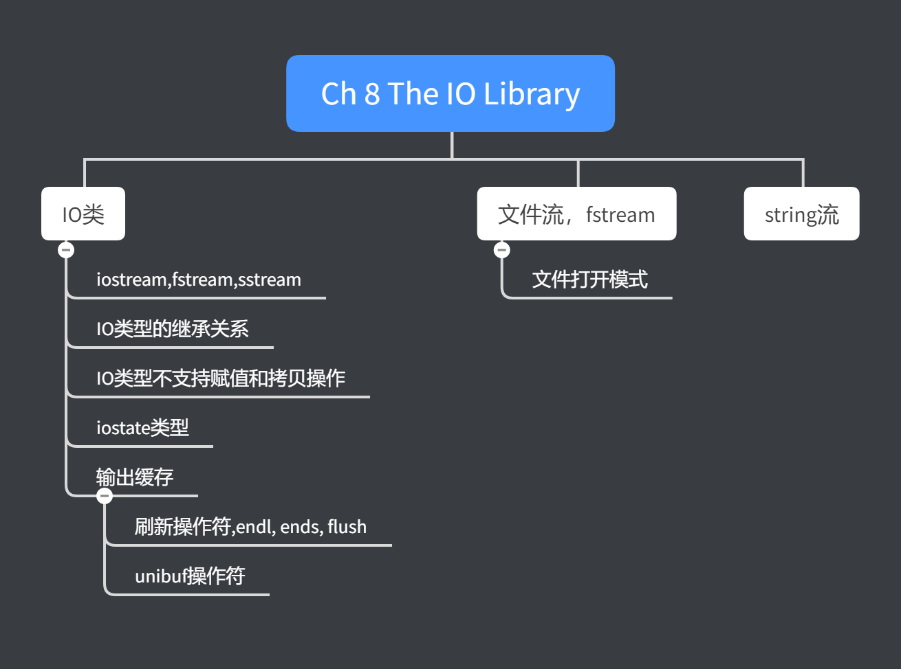



《C++ Primer》 第八章笔记。





<!--more-->

# Chapter 8 The IO Library

IO库定义了一系列读取和写入内建类型的操作。

## The IO Classes

为了处理不同的IO操作，IO库定义了一系列的IO类型，他们集中在三个头文件中：`iostream`中定义列读取和写入流（Steam）的基本类型，`fstream`定义了读取和写入文件的类型，`sstream`定义列读取和写入字符串的类型。如下所示：

| 头文件   | 类型                                          |
| -------- | --------------------------------------------- |
| iostream | istream,wistream 从流中读取                   |
|          | ostream,wostream 向流中写入                   |
|          | iostream,wiostream 对流读取和写入             |
| fstream  | ifstream,wifstream 从文件中读取               |
|          | ofstream,wofstream 向文件中写入               |
|          | fstream,wfstream 对文件读取和写入             |
| sstream  | istringstream,wistringstream 从string中读取   |
|          | ostringstream,wostringstream 向string中写入   |
|          | stringstream,wstringstream 对string读取和写入 |

从表中可以看出，每个类型都有一个`w`版本，这个版本是针对宽字符处理的。如`cin,cout,cerr`都有对应的`wcin,wcout,wcerr`。

#### Relationships among the IO Types

IO库用继承来实现对于不同类型的操作，如`ifstream`和`istringstream`都是继承自`istream`，因此所有对于`istream`的操作都可以使用在`ifstream`和`istringstream`上。

### No Copy or Assign for IO Objects

IO类型不支持赋值和拷贝操作，如

```cpp
ofstream out1, out2;
// out1 = out2; //error, cannot assign stream objects
```

因此无法将IO类型作为函数的形参和返回值，通常是使用IO类型的引用来表示。读写IO类型都会改变其状态，所以通常也不会将传递的IO类型变为const reference。

### Condition States

一旦一个问题发生，之后对于IO类型的操作就会失败，只有当IO类型处于无错误状态下才能进行流的读取和写入。因此，通常在代码中需要首先判断IO类型的状态，最简单的方法就是直接将io作为判断条件，如

```cpp
while (cin >> word)
{
    ///
}
```

#### Interrogating the State of a Stream

将IO作为判断条件，只能得到IO是否是正确的，但无法确定其究竟是因为什么原因导致失败。

IO类型定义了一系列机器相关的`iostate`类型来表示IO流的状态，每个IO类型都有自己的`iostate`类型，如`istream::iostate`，`fstream::iostate`。这个类型本质上是一系列的bits，所以可以通过位运算来进行操作。`iostate`类型和内置的函数操作如下所示：

| 类型与函数        | 说明                                                |
| ----------------- | --------------------------------------------------- |
| strm::iostate     | stm表示IO类型，strm::iostate表示该类型对应的状态    |
| strm::badbit      | 一个不可自动恢复的错误发生了，通常是系统层面的错误  |
| strm::failbit     | 一个可自动恢复的错误发生了，如读取string，赋值给int |
| strm:: eofbit     | 遇到了文件结尾（end-of-file）                       |
| strm:: goodbit    | 表示流没有错误，该值保证为0                         |
| s.eof()           | s是stm类型的实例，当eofbit位被置上时，该值为true    |
| s.fail()          | 当failbit位或badbit位被置上时，该值为true           |
| s.bad()           | 当badbit位被置上时，该值为true                      |
| s.good()          | 当badbit,failbit和eofbit都没有置上时，该值为true，  |
| s.clear()         | 清空流的所有位，使其恢复正确状态，返回空            |
| s.clear(flags)    | 清空flags位，flags为iostate类型，返回空             |
| s.setstate(flags) | 设置flags位，flags为iostate类型，返回空             |
| s.sdstate         | 返回当前状态                                        |

通常来说，使用`good()`和`fail()`两个函数来判断流的状态。当将流作为判断条件时，实际上等同于调用了`!fail()`。要注意调用`fail()`并没有检查`eofbit`位，所以直接将流作为判断条件时，读取到文件末尾并不会停止，还会继续读取一次。

如下使用`ifstream`测试所示，文件内已有内容为`123\n456`：

```cpp
ifstream in("./Test.txt");
while (in.good())
{
    in >> content;
    cout << "Read Content with good is " << content << endl;
}

in.close();
in.open("./Test.txt");
cout << endl;

while (in)
{
    in >> content;
    cout << "Read Content with condition is " << content << endl;
}

/*
Read Content with good is 123
Read Content with good is 456

Read Content with condition is 123
Read Content with condition is 456
Read Content with condition is 456
*/
```


#### Managing the Condition State

如之前所述，可以对`iostate`类型进行位操作，如需要将`failbit`和`badbit`还原，但保留`eofbit`，可以使用以下语句：

```cpp
cin.clear(cin.rdstate() & ~cin.failbit & ~cin.badbit);
```

### Managing the Output Buffer

对于操作系统而言，将数据写入设备，可能是一个耗时的操作，所以通常操作系统会将数据先缓存起来，之后将多个数据合并再一起写入设备。

但这种缓存机制可能会导致Debug时的困扰，如程序意外终止时，缓存的数据并没有被输出，于是明明某个Debug语句已经运行，但因为数据没有刷新，导致被误以为并没有运行。

以下几种情况会让存储的数据被刷新，输出给设备：

1. 当整个程序正常结束时。在main return的过程中，所有的输出缓存被刷新。
2. 当缓存满时，会进行刷新。
3. 当使用刷新操作符时，如`endl`，`flush`,`ends`。
4. 可以使用操作符`unitbuf`设置IO对象，让输出IO对象的每一次操作都刷新缓存。默认情况下，`cerr`是已经被设置了`unitbuf`的。
5. 如果输出IO对象被绑定至另一个IO对象，那么另一个IO对象无论进行了读还是写操作，都会刷新输出IO对象。默认情况下，`cin`和`cerr`都绑定了`cout`，所以无论是读和写这两个对象，都会刷新`cout`的缓存。

#### Flushing the Output Buffer

操作符`endl`会刷新缓存，并在增加一个换行符。
操作符`ends`会刷新缓存，并在增加一个空白字符。
操作符`flush`单纯刷新缓存。

```cpp
cout << "hi!" << endl;
cout << "hi!" << flush;
cout << "hi!" << ends;
```

#### The unitbuf Manipulator

`unitbuf`可以理解为一个开关，当设上时，每一次的输出操作都会立刻的刷新缓存。

```cpp
cout << unitbuf;
```

可以通过`nounitbuf`关闭

```cpp
cout << nounitbuf;
```

#### Tying Input and Output Streams Together

当一个输入IO对象绑定输出IO对象时，任何对于输入IO对象的读取，都会刷新输出IO对象的缓存。

默认情况下，`cin`绑定给了`cout`，所以执行任何的`cin >> xxx`操作都会先刷新`cout`对象

关于绑定有两个操作函数，`tie()`和`tie(& o)`，前者返回当前绑定的IO输出对象的指针，后者也返回当前绑定的IO输出对象的指针，然后将`o`作为新的绑定IO输出对象。如下所示：

```cpp
cin.tie(&cout); //System already do

ostream *old_tie = cin.tie(nullptr);
//old_tie is pointer to cout
//Now cin is tied to nothing

cin.tie(&cerr);
cin.tie(old_tie);
//cin is tied to cout
```

注意，每个IO对象只能绑定给一个输出对象，所以上示代码中，`cin`最终绑定给了`old_tie`。但是一个输出对象可以同时被多个IO对象绑定，如`cout`同时被`cin`和`cerr`绑定。

## File Input and Output

对于文件的流操作包含有三个类型：
1. `ifstream`：读取给定文件
2. `ofstream`：写入给定文件
3. `fstream`：读取或写入给定文件

如之前所述，对于`iostream`的所有操作都可以用于`fstream`，而`fstream`还有一些特定的操作，如下所示：

| 操作                    | 说明                                                                                        |
| ----------------------- | ------------------------------------------------------------------------------------------- |
| fstream fstrm;          | fstream是fstream头文件中定义的类型，fstrm是实例，且没有打开任何的文件                       |
| fstream fstrm(s, mode); | fstrm打开地址为s的文件，s可以是string，也可以是C风格的字符串，默认的mode与fstream的类型相关 |
| fstream fstrm(s, mode); | 指定打开文件的模式为mode                                                                    |
| fstrm.open(s)           | 打开地址为s的文件，mode与类型相关，返回空                                                   |
| fstrm.open(s,mode)      | 打开地址为s的文件，指定mode，返回空                                                         |
| fstrm.close()           | 关闭当前绑定的文件                                                                          |
| fstrm.is_open()         | 检查绑定的文件是否被正确打开                                                                |

### Using File Stream Objects

无论是要写入还是读取一个文件，都需要定义一个文件流，然后使用该文件流打开文件。

当使用带有文件地址的文件流构造函数时，文件会被自动打开。如`ifstream in(file)`。

file为C风格的字符串，在C++11下，file还可以是string。

#### Using an fstream in Place of an iostream&

fstream作为iostream的派生类，如果一个函数的形参为`iostream&`，则也可以传递`fstream`。

注意，因为IO操作不支持拷贝和赋值，所以函数的形参必然为引用。

#### The open and close Members

`open`操作并不一定成功，当失败时其中的`failbit`位会被置上，所以通常来说，最好使用代码检查文件流的状态，如

```cpp
ofstream out;
out.open(file);
if (out)
    ...
```

当文件流已经打开了一个文件，则该文件流无法直接打开其他的文件，必须先关闭前一个文件才行，如

```cpp
ofstream out;
out.open(file);
out.close();
out.open(file2);
```

一个文件，也无法被多个文件流打开，当需要另一个文件流操作时，需要先让使用该文件的文件流关闭文件，如：

```cpp
out1.open("./Test.txt");
out1.close();
in.open("./Test.txt");
```

#### Automatic Construction and Destruction

当一个文件流对象离开了作用域时，它会被销毁，在销毁时会自动的给关闭当前绑定的文件。

### File Modes

文件流的打开模式有以下几种：

| 模式   | 说明                               |
| ------ | ---------------------------------- |
| in     | 作为程序的输入打开（读取文件）     |
| out    | 作为程序输出打开（写入文件）       |
| app    | 每一次写入前，定位到文件的最后     |
| ate    | 在文件打开时，直接定位到文件的最后 |
| trunc  | 删除文件的内容                     |
| binary | 以位模式进行IO操作                 |

`ifstream`默认以`in`模式打开。`ofstream`默认以`out`模式打开，且`trunc`位被置上，即输出时默认将文件内已有的内容删除的。`fstream`默认同时以in和out模式打开文件

主动设定模式，要以下限制：

1. `out`只能在`ofsteram`和`fstream`类型时被置上
2. `in`只能在`ifsteram`和`fstream`类型时被置上
3. `trunc`只有在`out`模式下才能置上
4. `app`只能在`trunc`没有被置上时才能置上
5. `ate`和`binary`可以在任何文件流类型置上，且可以与其他的类型任意搭配。

#### Opening a File in out Mode Discards Existing Data

`ofstream`模式默认是以`out`模式打开，且置上`trunc`位，所以如下的几种定义方式没有区别：

```cpp
ofstream out("file1");
ofstream out2("file1", ofstream::out); // outand truncare implicit
ofstream out3("file1", ofstream::out | ofstream::trunc);
```

如果要保护文件的内容不被删除，有两种方法，一是置上`app`位，二是同时置上`in`和`out`位。如下：

```cpp
// to preserve the file’s contents, we must explicitly specify appmode 
ofstream app("file2", ofstream::app); // out is implicit
ofstream app2("file2", ofstream::out | ofstream::app);
```

注意`in`模式只能赋给`ifstream`和`fstream`，所以上示代码中是通过置上`app`位。

#### File Mode is Determined Each Time open Is Called

文件流的mode可以看作是与文件结合的，文件流的mode会在每次打开文件时重新指定。如果没有在重新打开文件时，没有显示的设置mode，则该文件会重新以默认的mode打开（不会保留打开前一个文件时指定的mode）。

如下测试，文件已有内容为`123\456`：

```cpp
ofstream out1("./Test.txt", ostream::app);
out1 << "\n789";
out1.close();
in.open("./Test.txt");
while (in.good())
{
    in >> content;
    cout << "Read Content with good is " << content << endl;
}

in.close();
cout << endl;

out1.open("./Test.txt");
out1 << "\n666";
out1.close();
in.open("./Test.txt");
while (in.good())
{
    in >> content;
    cout << "Read Content with good is " << content << endl;
}

/*
Read Content with good is 123
Read Content with good is 456
Read Content with good is 789

Read Content with good is 666
*/
```

可以看到`out1`，在创建时设置上了`app`位，所以没有擦除文件已有内容。但当其重新打开文件时，`app`位被清空，仍然是`trunc`被置上，文件已有内容被删除。

## string Streams

String流是把String看作一个IO流进行操作，定义在`sstream`头文件中，其中包括`istringstream`读取string，`ostringstream`写入string，`stringstream`可同时读取和写string。string流有以下特有的操作：

| 操作              | 说明                                                               |
| ----------------- | ------------------------------------------------------------------ |
| sstream strm      | 创建一个未绑定的string流                                           |
| sstream stream(s) | 创建一个绑定s拷贝的string流，s是string类型，该构造函数是explicit的 |
| strm.str()        | 返回strm绑定的string的拷贝                                         |
| strm.str(s)       | 将s的拷贝绑定至strm，返回空                                        |

### Using an istringstream

因为sstringstream继承自iostream可以使用操作符，所以istringstream可以使用>>操作符，且如同cin中的>>一样，一次读取是以空白字符为结束的。如以下代码就是通过stringstream来从输入中读取数据：

```cpp
//morgan 2015 86255
while (getline(cin, line))
{
    PersonInfo info;
    istringstream record(line); //Bind line to record
    record >> info.name;        //Read one word,in this case, it's name
    // Read one word,in this case, it's phone,
    //If condition is false, means that there is no content
    while (record >> word)
    {
        info.phones.push_back(word);
    }
    people.push_back(info);
}
```

### Using ostringstreams

同样的，ostringstream可以使用<<操作符，对ostringstream使用<<操作符类似于对string使用+=。如：

```cpp
ostringstream ssf;
ssf << "123"
    << " 456";
cout << ssf.str() << endl;

/*
123 456
*/
```



引用：

1. *Cpp Primer* 5th Aug.2012



***