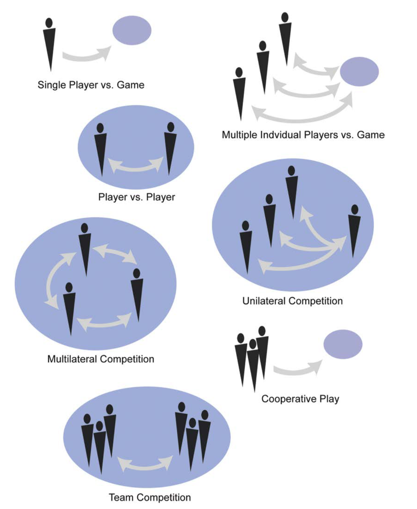
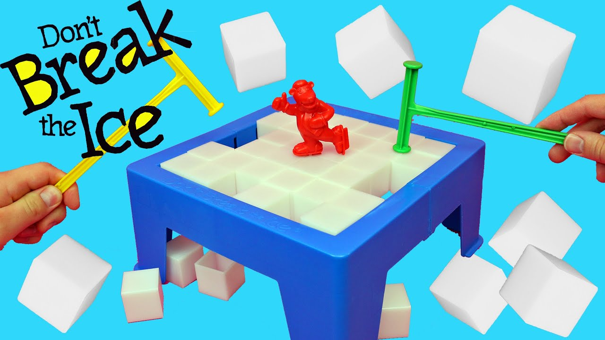



《Game Design Workshop》 第三章笔记，这一章关于游戏中的常规元素。

包括，玩家、目标、流程、规则、资源、冲突、边界、结果。



<!--more-->

# Chapter 3 Working with Formal Elements

常规元素（Formal Elements）是那些组成游戏的元素，包含玩家，目标，流程，规则，自愿，冲突，边界和结果，这些构成了游戏的本质。

当充分了解这些元素后，就可以对他们进行结合来创造自己的新类型游戏。

## Players

游戏是为玩家的游戏体验而设计的，玩家必须遵守游戏的规则和限定才能玩游戏。

以下是一些游戏中针对玩家设计可以考虑的方面。

### Invitation to Play

游戏中最重要的时刻之一就是游戏的`邀请阶段`。对于桌游而说，游戏的邀请是社交部分。对于电子游戏而言，邀请阶段通常只是简单的开始按钮，但是有一些游戏它们有独特的邀请方式，如吉他英雄（Guitar Hero）通过拨弄吉他开始游戏。设计一个游戏的邀请阶段能让一款游戏更加的引人注目。

### Number of Players

对于玩家人数是固定的游戏和对于玩家人数是变换的游戏，两者设计的思路是不同的。许多电子游戏仅支持一个游戏玩家，这种游戏的结构是让玩家与游戏系统竞争。也有许多游戏设计为多位玩家，如大富翁（Monopoly），EVE，WOW，但是这些游戏在一定程度上也是能支持一个玩家游玩的。如魔兽世界，即使一个人玩，游戏中的许多元素也让游戏体验足够有趣。

### Roles of  Players

一些游戏其中的所有玩家都有相同的角色（这里角色指的是玩家的任务），如大富翁，围棋。

还有一些游戏，不同的玩家扮演着不同的角色，如珠玑妙算（Mastermind，一个密码破解游戏），一个玩家扮演密码编写者，其他的玩家扮演密码破解者。

游戏的角色定义了玩家的基本能力，大部分的网络游戏都提供了多种不同的角色。对于多角色的游戏，定义核心不同的橘色和平衡各角色之间的能力是关键问题。

### Player Interaction Patterns

E.M.Avedon在文章*The Structural Elements of Games*中将玩家的交互分为"玩家对抗游戏"和“多个玩家之间的对抗”。这里作者将Avedon的概念进行进一步的细分，分为如下七种：

1. Single player versus game

   这种游戏结构是玩家与游戏系统进行对抗。因为这种架构中没有其他的玩家，所以游戏的冲突通常是通过解密或者其他的方式来表现。

2. Multiple individual players versus game

   这种游戏结构是多个玩家一起与游戏系统进行对抗，但是玩家之间并不一定需要交互，甚至可以不再一个时间点。这种游戏结构在Facebook这种社交网站出现后变得流行。这种游戏本质上还是单人游戏，只不过多个玩家会一起与同一个系统进行对抗，它在不希望竞争的，但又希望有社交元素的玩家中很流行，如赌场游戏（多个人会使用一台老虎机）。

3. Player versus Player

   这种游戏结构是两个玩家直接进行对抗。这在策略游戏和竞争游戏中是一个经典的结构。

4. Unilateral competition

   这种结构是多个玩家一起对抗一个玩家，称为单边竞争。如桌游苏格兰场（Scotland Yard），其中一个玩家是罪犯，他了解游戏的所有信息，而其他玩家扮演侦探，他们必须一起合作找出罪犯的线索。单边竞争是一个将游戏的合作性和竞争性结合在一起的结构。

5. Multilateral competition

   这种结构是三个或更多的玩家直接对抗，1v1v1，称为多边对抗。如大富翁就属于这种类型，通常提及多人游戏时就是指这种结构。许多桌游设计成玩家人数需要是三到六人，这种人数是直接对抗的理想人数。

6. Cooperative play

   这种结构也是对各玩家一起与游戏系统对抗，但与第二种结构不一样的是，在这个结构中玩家需要相互合作。

7. Team competition

   这种结构中，两个或更多的小组相互对抗。传统的运动如足球，篮球就是这种模式。这种模式不仅对于参与者有重大的吸引力，对于旁观者也同样如此，所以传统的运动会诞生粉丝文化。

## Objectives

目标是玩家需要追求的东西，它定义了玩家在游戏规则下需要完成的东西。在理想状态下，目标对于玩家而言，应该是有挑战性的同样也是可完成的。

目标的存在不仅为游戏提供了挑战，同样也为游戏定下了基调。目标不仅仅是游戏的基本元素，它也提供了游戏的戏剧部分，理想状态下游戏的目标应该与游戏中的故事能完美融合。

许多学者尝试为游戏的目标进行分类，主要分为如下几种：

1. Capture

   捕捉游戏的本质是摧毁或得到对手的某些东西，同时避免被对手捉到或杀死。从古时起，这种设计思路就深深的嵌套在游戏中，比如常玩的木头人，就是这一类的游戏。

2. Chase

   追逐游戏的目标是抓住对手或者从对手手上逃离。
   
   追逐游戏可以是玩家与游戏系统的对抗，玩家与玩家的对抗，或者单边对抗。
   
   追逐游戏可以由速度和灵活度决定。
   
   苏格兰场也算是一种追逐游戏，只不过使用的是逻辑和推导来逃离玩家的追逐。
   
3. Race

   比赛游戏的目标是在其他玩家前达到某种目标。比赛游戏可以是基于物理的灵活性（速度等），或者是基于概率。

4. Alignment

   对齐游戏的目标是将游戏中的元素按一定的空间规则排列在一起或分类游戏中的元素。俄罗斯方块就是属于这种类型。

5. Rescue or scape
   

逃离游戏的目标是达到一个游戏设计的安全区域。通常这个游戏目标是与其他的游戏目标结合在一起的。

6. Forbidden Act

   禁止行为游戏的目标是通过错误的移动，谈话或者任何玩家不应该做的行为来破坏游戏规则。

   如游戏Don't break the ice就属于这种类型：

   

   这种游戏类型在电子游戏中很少见，可能是因为没法直接的进行物理竞赛，也很难游戏的公平性。

   但是任天堂的switch中有许多关于这种类型的游戏

7. Construction

   建造游戏的目标是建造，保持和管理物体，这种游戏可能包含直接或间接的竞争。如模拟人生就是这种类型的游戏。

   这种类型的游戏通常是将资源管理和交易来作为游戏中的重要元素，游戏也是通过策略选择而非灵活性或概率进行比赛。

8. Exploration

   探索游戏的目标是探索游戏场景。这种游戏通常是与其他更复杂的目标捆绑在一起的。例如塞尔达传说，游戏的目标不仅仅是探索世界，还要解密神庙，救出公主等。

9. Solution

   解密游戏的目标是在解决一个困难或谜题。许多的游戏会被归纳与其他的游戏类型，但其中包含解密部分，如上述的塞尔达传说

10. Outwit

    智慧游戏的目标是通过收集和使用知识来击败别的玩家。

    有的智慧游戏是通过游戏外的知识来进行比赛，还有一些是利用游戏内知识，如

游戏的目标并不是单独存在的，一个游戏的目标很可能是上述多个种类的目标混合在一起。游戏设计者应该尝试将不同的目标结合在一起，看是否会创造出一个更加有趣的可能。

## Procedures

流程（Procedures）是游戏的玩法，也是“玩家”为了达到目标能采取的行为。

对于桌游来说，游戏的流程通常是写在纸上让玩家阅读的。对于电子游戏来说，游戏的流程通过蕴含在了游戏的操作手册中（因为流程就是玩家采取的行为，操作一定程度上代表了流程）。

通常来说，游戏有以下几种流程：

1. 开始的行为（Starting action）：如何让游戏开始
2. 逐步进行的行为（Progression of action）：在游戏开始后，持续不断的行为。通常就是游戏进行中主体（Core loop）。
3. 特殊行为（Special actions）：游戏进行中的特殊事件，因为游戏中的其他元素或状态的改变而变得可执行的行为。
4. 解决的行为（Resolving actions）：让游戏走向结束的行为

如对于马里奥游戏，按下游戏开始键就是`开始行为`。在游戏进行中，玩家的前进，跳跃等就是`逐步进行的行为`，而诸如马里奥在水中按下前进就会游泳，吃下花朵就可以发射火球等就是`特殊行为`，马里奥并没有一个解决的行为，因为游戏是否正常结束是由游戏本身决定，而非玩家本身。

### System Procedures

电子游戏相对于传统游戏而言复杂了许多，电子游戏有在后台运行的系统流程（System Procedures），这个流程会对玩家的行为和游戏的情景做出相应反应。

传统的桌游实际上也有相同的工作，如大富翁中，需要玩家判断踩到了别人的土地后要付多少的租金，需要通过筛子来引入随机因素。只不过因为在电子游戏的这些事件可以交由系统来进行，所以这些计算可以变得更快。

但这不意味着电子游戏就一定比传统的游戏更加复杂，一些简单的行为可以导致异常复杂的结果。如围棋中的行为，只是双方下棋，但是其背后的逻辑可以异常复杂。

### Defining Procedures

当设计游戏的流程时，要注意游戏环境的限制。例如设计桌游时，游戏的流程就不应该过于复杂。还要考虑游戏的交互方式，是使用手柄还是键盘鼠标等。

要特别注意游戏的主体（core loop）。对于电子游戏，游戏的主体包括检查游戏的状态，玩家是否碰到了某些东西，同时系统也要对玩家的输入做出相应反应，而对于非电子游戏而言，玩家需要自己去检查游戏的状态。无论是电子游戏还是非电子游戏，游戏的主体都需要设计的足够流畅，玩家可以轻松的执行流程中的每一步，让游戏正确的进行下去。

游戏的流程本质上是被游戏的规则还有游戏本身所限制的。设计师需要意识到这些限制，然后在限制中找到一个有创造性且优雅的方式来让游戏流程顺畅且容易被记住。

## Rules

游戏规则定义了游戏中的物体和玩家可以执行的行为。

在桌游来说，游戏规则同样是写在纸上的，对于电子游戏来说，规则可以同样写在手册中，也可以通过游戏本身来透露。

当设计规则时，需要考虑到规则与玩家之间的关系。如果规则太多，玩家或许很难去理解游戏，如果规则太少，玩家则可能感到困惑。即使规则制定的很好，且被游戏系统完美的运行，玩家也同样需要通过某种方法了解规则，否则当某种情况发生时，玩家将觉得被系统所欺骗了（虽然系统行为是正确的）。

### Rules Defining Objects and Concepts

游戏中的物体是由规则决定的，且游戏中的物体含义是与真实世界中的含义不同的，无论这些物体是完全虚构的，还是基于真实世界创建的。

例如象棋中的马和车，虽然是基于真实世界创建的的物体，但他们的运行规律是由游戏决定的。即使是基于真实世界创建

的，其含义也会与真实世界中的模板有或多或少的差异。

对于桌游来说，其设定的物体作为规则中的一部分，需要显式的告知玩家，通常还是通过纸质的说明书。玩家必须理解这些规则和物体，也正因为这个原因，桌游中的物体会被限定为比较简单的元素，通常只有一到两个变量或状态，而且是由物理特性来表示。如围棋中的棋子，只有两个变量，颜色和位置。

但是对于电子游戏而言，物体的变量可以非常复杂，因为它是由系统进行计算，玩家甚至不会意识到这么多的变量的存在。如怪物的属性，攻击位置，攻击力，魔法值等等等等。玩家也不会"精确"的知道这些变量，即使是最专业的策略游戏玩家，也不会将游戏完全的变成一场数学运算，玩家通常是通过直觉来去获知这些变量。

当设计游戏中的物体时，需要特变注意玩家是如何去理解这些物体的特质的。例如如果变量过于复杂，玩家是否会造成困惑，如果变量过于简单，玩家是否有能力区分物体等。

### Rules Restricting Actions

规则限定了玩家的行为，这个可以从三方面考虑：

1. 规则弥补了游戏的漏洞。

   如大富翁中，“进监狱时并不会因为通过起点获得200元”，避免了这个惩罚行为实际造成了奖赏。

2. 规则可制定游戏的基本形式。

   如“足球是两个由11人组成的队伍在360\*160英尺的场地上的竞赛”，这个规则限定了每队的玩家人数是11人，游戏的边界是360\*160。

   实际上游戏的规则和流程制定了所有其他的元素

3. 规则提供了平衡性。

   如魔兽争霸中，“必须要三本建筑才能造某些兵种”，避免了玩家一开始就憋钱造高级兵种带来的不平衡。

### Rules Determining Effects

规则同时在特定情况下触发某些效果，即"如果XXX发生了，那么XXX"。

通过规则触发效果有以下好处：

1. 它为游戏创造了变量。条件并不是在游戏中一直存在的，所以它可以给玩家带来特殊的体验和惊喜。
2. 它可以让游戏重回正轨。如塞尔达中的体力值，游戏并不希望体力值作为一个非常重要的存在，如用完了体力值林克就会死，但是也不希望体力值变成一个随意挥霍的东西，游戏需要提供一个方法让玩家知道需要节省体力值。于是游戏设置了“如果体力值用完了，那么体力值的回复会变慢”这样的设定。

### Defining Rules

和指定流程时一样，指定规则时也要注意游戏本身的限制。对于玩家而言，规则需要是清晰的，玩家要直接通过本能就了解游戏的规则，这样游戏才能看起来是公平的，反应良好的。

通常来说，指定的规则越复杂，就需要花越多的努力让玩家理解规则。玩家对于规则理解的越少，他们就越不可能做出有意义的选择，也就越不觉得对于游戏有足够的掌控。

## Resources

在现实生活中，资源是用来达成目标的资产，在游戏世界中也基本是这样。

管理资源和决定玩家什么时候和怎样去接触资源是游戏设计工作中的重要部分。设计师需要决定哪些资源是玩家可以掌控的，玩家又该通过怎么样的方式去用这些资源，同时保证玩家在使用资源的过程中不会破坏游戏的挑战性。

游戏设计师要设计玩家如何获得足够达成目标的资源，玩家或许不会像他们预期的那样获得非常多的资源，但是他们最终获得的资源一定是够他们推动游戏的，否则这个设计就是不平衡的。

从定义上来说，资源必须满足“实用性”和“稀缺性”。例如在暗黑破坏神中不会出现寿司这个资源，虽然寿司在这游戏中会是一个有趣的存在，但这个存在是无意义的。同时资源也不会非常非常多，否则资源也就失去了其存在的意义（不构成任何挑战）。

以下是游戏中通常会出现的资源：

### Lives

生命是动作游戏中最经典的稀缺资源，如马里奥中的生命。

生命这个资源采纳了最简单的模式：越多越好，更多的生命不会造成任何的副作用。

### Units

在一些游戏中，玩家需要管理“单位”作为资源。如西洋棋中的棋子，炉石传说中的卡牌等。

有些单位是有限，有些是可再生的。

在游戏设计中，决定每个单位的花费，和平衡它与游戏中的其他元素是一个非常复杂的过程。最好的平衡方法，就是反复的测试。

### Health

生命值可以作为一个单独的元素，或者其他元素的属性，如生命和单位就可以有生命值作为属性，来提示还有多久会失去这个元素。

通常来说，生命值这样的元素是有方法补充的。如在动作游戏中，玩家会通过药品来补充生命值，在角色扮演游戏中，玩家通过睡觉或者吃饭来补充生命值。不同的游戏种类适用不同的生命值补充方法，动作游戏中需要快速反应，所以补充生命值的方法更快但不真实，而角色扮演游戏则是相反。

### Currency

金钱也是许多游戏中的重要资源，通常游戏也会因此设计一个交易系统。如真实世界一样，金钱的存在加快了交易的进行，让玩家可以更方便的获取自己想要的资源，而不是繁琐的以物换物。

### Actions

一些游戏中，行为也是一种资源。如一些动作游戏中，会限制一些过于强大的行为，“大招”就是最好的例子，玩家需要有效的管理这种稀缺资源。

### Power-ups

游戏中的一种经典资源就是能量提升，如马里奥中的蘑菇和花朵。

能力提升资源通常会设计的非常稀少而且是临时性的。

### Inventory

一些游戏中，玩家可以选择收集和管理一些资源（通常能量提升和和单位不允许被管理），将这种资源称为“库存（Inventory）”。因为玩家可以收集的资源容量是有限的，所以这种收集本身就也存在稀缺性，玩家需要做出选择决定收集哪些资源，丢弃哪些资源。

### Special Terrain

一些游戏中的某些地形也是一种资源，如魔兽争霸Ⅲ中的黄金是从金矿中采集的，金矿作为一个地形也成为了重要的i资源。

### Time

时间在一些游戏中也会称为限制和资源。如许多的动作游戏，还有快棋，每个玩家都只有固定的时常做出下棋的选择。

## Conflict

冲突通过规则，流程还有游戏情况（如多个玩家）来阻止玩家直接达成目标，冲突通常是一个游戏的核心。

流程通常提供了一种低效的达成目标的方法，即强迫玩家必须使用某些方法或技能才能达成目标。

流程本身也提供了竞赛和玩耍的感觉，玩家在这个低效的过程中会逐渐获得成就感或其他的快乐的感觉。

冲突通常有以下三个表现形式：

### Obstacles

障碍在一种常用的冲突方式。无论在单机游戏还是多人游戏中，都能使用障碍作为冲突，但在多人游戏中更多一些。

障碍不仅仅是物理形式，如水池，山坡，也可以是智力方面的，如动作游戏中的谜题等。

### Opponents

在多人游戏中，对手是一个最主要的冲突来源。

### Dilemmas

困境作为冲突通常是用来表示那些进退两难的选择，如大富翁中选择是否要购买一块土地。

## Boundaries

边界是用来将游戏和其他非游戏的部分区分开来的。

Huizinga将玩家同意游戏的规则，开始游戏的行为称为，进入“Magic circle”。其中一个重要的部分，就是玩家需要有安全感，他可以在任意时间选择退出这个“Magic circle”。

游戏设计者必须定义游戏的边界，即玩家如何进入和退出游戏。这个边界可以是物理的，如足球场的边界，也可以是概念上的，如只是简单的放弃玩一个游戏。

边界的设置也决定了一款游戏的风格，因此修改边界也可以作为游戏设计的一部分。例如大富翁中能用真的金钱会怎么样？

边界不仅仅作为游戏中的一个元素，它也提供了情绪上的区分。边界的存在让玩家在游戏中的情绪与在现实生活中的情绪所分开，如在游戏中对朋友开一些相对过分的玩笑并不会产生在现实中说同意的话造成的影响。

对于大多数的游戏而言，游戏系统是一个封闭的系统，即游戏内的元素是不会与游戏外的元素进行交互的。但现在也有许多的游戏设计师尝试去打破这个边界，如Pokémon GO。

## Outcome

游戏的结果必须是一个不确定的因素，这样才能获取玩家的注意力。通常来说游戏的结果必须是一个可测量的结果，但也有例外，如模拟游戏，和一些在线的多人游戏，并不存在分数和输赢的概念。

对于绝大部分的游戏而言，游戏的结果是输或赢。在特定的时间或情况下，系统回去检测是否有达成赢或输的标准，如果达到了，那么游戏就结束了。

一些游戏是零和的，即一个人赢就代表另一个人输，如下棋。还有一些游戏是非零和的，如魔兽世界，一个玩家获取了某些东西并不代表另一个玩家会失去某些东西。非零和游戏在本质上不是竞争游戏，所以需要有另一个系统来体现游戏中的得失，如排名系统，玩家统计，或者其他不同的目标，甚至是玩家自定义的目标，如“我需要在模拟人生中达成...”。

## Conclustion

这一章中介绍了游戏的常规元素，设计师可以通过结合这些元素来创造不同的游戏体验。

也可以通过分析游戏中的这些元素来学习游戏设计。



引用：

1.*Game Design Workshop* 4th 2019 by Tracy Fullerton



***