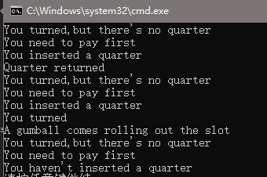
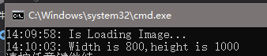
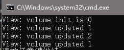


这一篇将会介绍状态模式，代理模式和复合模式并整理了书中提到了9个设计原则。


<!--more-->

## 状态模式

状态模式(State Pattern)允许一个对象根据其内部状态的变化来选择需要执行的操作。这个对象会看起来像是改变了它的类。

状态模式定义听起来有些奇怪，实际上就是将不同状态的行为定义在不同的状态类中，然后根据状态的不同切换这些状态类，进而达到不同的行为。

例如我们需要做一个口香糖贩卖机需要处理，投钱、退钱、旋转出货按钮这三个操作，然后机器有未投钱、投钱、货物卖出、货物卖完四个状态。我们可以将不同状态下对三个操作的处理定义在各自的状态类中。

### 代码示例

#### 状态类接口

```cs 状态类接口
public interface State
{
    void InsertQuarter();
    void EjectQuarter();
    void TurnCrank();
    void Dispense();
}
```

#### 状态类实现

```cs 未投钱状态
public class NoQuarterState : State
{
    private GumballMachine gumballMachine = null;

    public NoQuarterState(GumballMachine gumballMachine)
    {
        this.gumballMachine = gumballMachine;
    }

    public void Dispense() { Console.WriteLine("You need to pay first"); }

    public void EjectQuarter() { Console.WriteLine("You haven't inserted a quarter"); }

    public void InsertQuarter()
    {
        gumballMachine.SetState(gumballMachine.HasQuarterState);
        Console.WriteLine("You inserted a quarter");
    }

    public void TurnCrank() { Console.WriteLine("You turned,but there's no quarter"); }
}
```

```cs 投钱状态
public class HasQuarterState : State
{
    private GumballMachine gumballMachine = null;

    public HasQuarterState(GumballMachine gumballMachine)
    {
        this.gumballMachine = gumballMachine;
    }
    public void Dispense()
    {
        Console.WriteLine("No gumball dispensed");
    }

    public void EjectQuarter()
    {
        Console.WriteLine("Quarter returned");
        gumballMachine.SetState(gumballMachine.NoQuarterState);
    }

    public void InsertQuarter()
    {
        Console.WriteLine("You can't insert another quater");
    }

    public void TurnCrank()
    {
        Console.WriteLine("You turned");
        gumballMachine.SetState(gumballMachine.SoldState);
    }
}
```

```cs 货物卖出状态
public class SoldState : State
{
    private GumballMachine gumballMachine = null;

    public SoldState(GumballMachine gumballMachine)
    {
        this.gumballMachine = gumballMachine;
    }

    public void Dispense()
    {
        gumballMachine.ReleaseBall();
        if (gumballMachine.remainGumballsNum > 0)
            gumballMachine.SetState(gumballMachine.NoQuarterState);
        else
        {
            Console.WriteLine("Opps,out of gumballs");
            gumballMachine.SetState(gumballMachine.SoldOutState);
        }
    }

    public void EjectQuarter()
    {
        Console.WriteLine("Sorry,you already turned the crank");
    }

    public void InsertQuarter()
    {
        Console.WriteLine("Please wait,we are already giving you a gumball");
    }

    public void TurnCrank()
    {
        Console.WriteLine("Turning twice dones't get you another gumball");
    }
}
```

```cs 货物售完状态
public class SoldOutState : State
{
    private GumballMachine gumballMachine = null;
    public SoldOutState(GumballMachine gumballMachine)
    {
        this.gumballMachine = gumballMachine;
    }
    public void Dispense()
    {
        Console.WriteLine("No gumball dispensed");
    }

    public void EjectQuarter()
    {
        Console.WriteLine("You can't eject,you haven't inserted a quarter yet");
    }

    public void InsertQuarter()
    {
        Console.WriteLine("You can't insert a quarter,the machine is sold out");
    }

    public void TurnCrank()
    {
        Console.WriteLine("You turned,but there are no gumballs");
    }
}
```

### 测试代码及结果

```cs 测试代码
GumballMachine gumballMachine = new GumballMachine(5);
gumballMachine.TurnCrank();
gumballMachine.InsertQuarter();
gumballMachine.EjectQuarter();
gumballMachine.TurnCrank();
gumballMachine.InsertQuarter();
gumballMachine.TurnCrank();
gumballMachine.TurnCrank();
gumballMachine.EjectQuarter();
```

运行结果：



***

## 代理模式

代理模式（Proxy Pattern）为对象提供一个代理进而控制对其的访问。

例如我们需要加载一张图片，但加载图片是个访问网络或IO的操作，我们不希望这个这个操作阻塞UI线程，于是我们可以定义一个代理来进行多线程的加载，并在加载完成后显示图片。

### 代码示例

#### 抽象接口

```cs 图片接口
public interface Icon
{
    void PrintIconWidthAndHeight();
}
```

#### 抽象接口实现

```cs 真实图片类
public class ImageIcon : Icon
{
    private int width, height;
    public ImageIcon()
    {
        Thread.Sleep(5000);//Pretend there is some hard work to load the image
        width = 800;
        height = 1000;
    }
    public void PrintIconWidthAndHeight()
    {
        Console.WriteLine(DateTime.Now.ToLongTimeString() + ": Width is " + width + ",height is " + height);
    }
}
```

```cs 代理图片类
public class ImageProxyIcon : Icon
{
    private ImageIcon icon = null;
    private bool isLoading = false;

    public ImageProxyIcon() { }

    public void PrintIconWidthAndHeight()
    {
        if (icon != null)
            icon.PrintIconWidthAndHeight();
        else if (!isLoading)
        {
            Console.WriteLine(DateTime.Now.ToLongTimeString() + ": Is Loading Image...");
            isLoading = true;
            new Thread(() =>
            {
                icon = new ImageIcon();
                icon.PrintIconWidthAndHeight();
            }).Start();
        }
    }
}
```

### 测试代码及结果

```cs 测试代码
ImageProxyIcon proxyIcon = new ImageProxyIcon();
proxyIcon.PrintIconWidthAndHeight();
```

运行结果：




代理模式与装饰模式很像，不同的是装饰模式的目的是在原先的类外扩展某些功能，而代理模式只是控制原先类中某些接口的访问。例如上例子中，`ImageProxyIcon`并没有为`ImageIcon`拓展什么功能，只是用了多线程来访问访问其中的函数。


***

## 复合模式

复合模式（Compound Pattern）是通过两个或以上的设计模式形成一个可以解决一般性问题的通用框架。

MVC框架就是一种组合模式，`Controller`和`View`之间使用了策略模式， `View`中只存`Controller`的接口，进而达到可以随时切换不同`Controller`的目的。`Model`和`View`之间使用了观察者模式，`View`作为观察者，`Model`作为被观察者，当`Model`的数据发生变化时，`View`相应改变。而`View`本身使用了组合模式，比如按钮中可能存在子按钮，窗口中存在子窗口等等。

我们以音量调节作为一个最简的MVC框架示例。

### 代码示例

#### 框架接口

```cs 观察者接口
public interface IVolumeObserver
{
    void VolumeUpdated();
}
```

```cs Model接口
public interface IVolumeModel
{
    int Volume { get; set; }
    void RegisterObserver(IVolumeObserver observer);
    void UnRegisterObserver(IVolumeObserver observer);
}
```

```cs Controller接口
public interface IViewController
{
    void VolumeUp();
    void VolumeDown();
    void SetVolume(int volume);
}
```

#### 接口实现

```cs Model
public class VolumeModel : IVolumeModel
{
    private int volume = 0;
    public int Volume
    {
        get { return volume; }
        set
        {
            volume = value;
            observersList.ForEach(observer => observer.VolumeUpdated());
        }
    }
    private List<IVolumeObserver> observersList = null;

    public VolumeModel()
    {
        observersList = new List<IVolumeObserver>();
    }

    public void RegisterObserver(IVolumeObserver observer)
    {
        observersList.Add(observer);
    }

    public void UnRegisterObserver(IVolumeObserver observer)
    {
        observersList.Remove(observer);
    }
}
```

```cs View
public class VolumeView : IVolumeObserver
{
    private IViewController controller = null;
    private IVolumeModel model = null;

    public VolumeView(IViewController controller, IVolumeModel model)
    {
        this.controller = controller;
        this.model = model;
        this.model.RegisterObserver(this);
        Console.WriteLine("View: volume init is " + model.Volume);
    }

    public void OnVolumeUpButtonClick()
    {
        controller.VolumeUp();
    }

    public void OnVolumeDownButtonClick()
    {
        controller.VolumeDown();
    }

    public void VolumeUpdated()
    {
        Console.WriteLine("View: volume updated " + model.Volume);
    }

    ~VolumeView()
    {
        model.UnRegisterObserver(this);
    }
}
```

```cs Controller
public class VolumeController : IViewController
    {
        private VolumeModel model = null;
        public VolumeController(VolumeModel model)
        {
            this.model = model;
        }

        public void SetVolume(int volume)
        {
            model.Volume = volume;
        }

        public void VolumeDown()
        {
            --model.Volume;
        }

        public void VolumeUp()
        {
            ++model.Volume;
        }
    }
```

### 测试代码及结果

```cs 测试代码
VolumeModel model = new VolumeModel();
VolumeView view = new VolumeView(new VolumeController(model), model);
view.OnVolumeUpButtonClick();
view.OnVolumeUpButtonClick();
view.OnVolumeDownButtonClick();
```

运行结果：



***

## 设计原则

1. 将变化的部分封装起来（Encapsulate what varies)
2. 组合优于继承（Favor composition over inheritance）
3. 面向接口编程而非实现（Program to interfaces, not implementations.）
4. 减少需要交互的类之间的耦合（Strive for loosely coupled designs between objects that interact）
5. 对拓展开放，对修改关闭（Classes should be open for extension but closed for modification.）
6. 依赖于抽象而非具体的类（	Depend on abstraction.Do not depend on concrete classes）
7. 暴露最少的信息给其他类（最少知识原则）（Talk only to your immediate friends）
8. 高层有对底层的管理，而底层不需要关心高层何时会调用自己（好莱坞原则）（Don't call us ,we’ll call you）
9. 一个类应该有且只有一个被改变的理由（A class should have only one reason to change）



引用：
1. https://design-patterns.readthedocs.io/zh_CN/latest/behavioral_patterns/behavioral.html


***