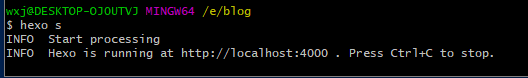
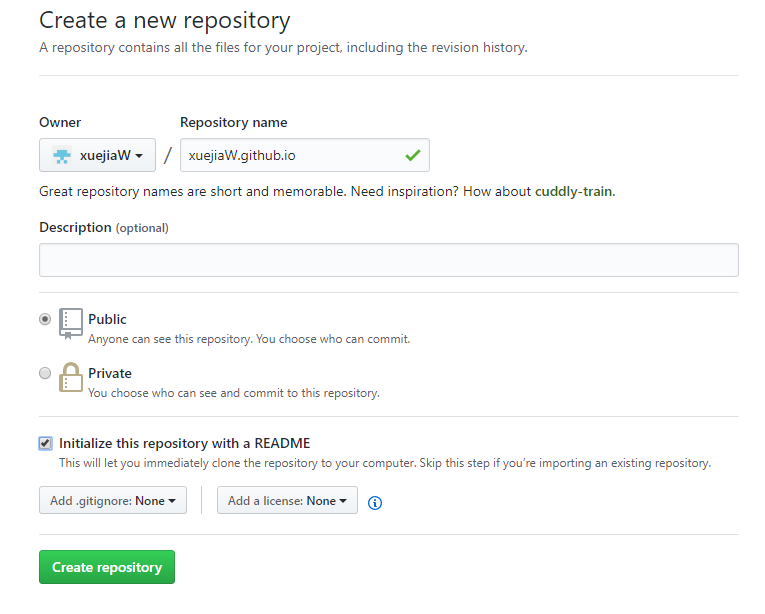
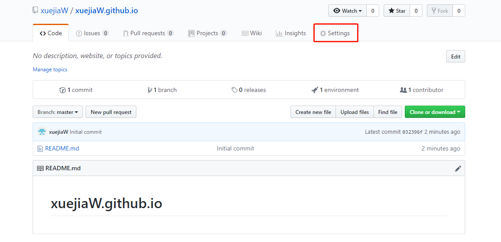
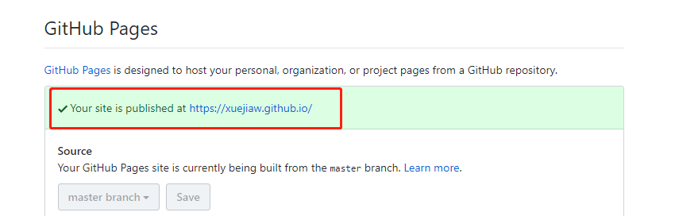
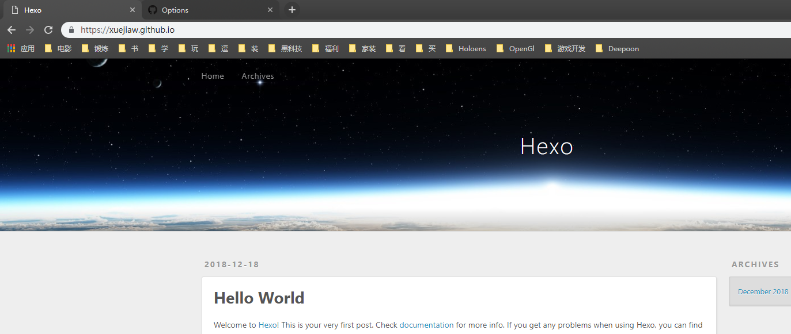

从大学开始就有通过Onenote整理笔记的习惯，也多次想过将自己的笔记分享出去。曾尝试过微信的公众号，但公众号的编辑器没法完全保存Onenote笔记的格式，发现每次发布都需要大量的时间去调整格式后便做了罢。之后想要建立个人博客，但苦于完全没有网站前端的开发经验便一拖再拖。最近也是才发现有Hexo这么一个搭建网站的框架便开始了再次尝试。这篇及之后的关于Hexo的文章与其说是教程更像是笔记，只是在学习Hexo时的一些记录罢了。

这一篇将包括Hexo环境安装，本地博客的创建，上传至Github域名三部分的介绍

<!--more-->

## Hexo环境安装

1. 安装[Node.js](https://nodejs.org/en/)
2. 安装[Git](https://git-scm.com/)
3. 安装Hexo cmd运行 `npm install -g hexo-cli`

这里不做关于Git的介绍。

## 建站

1. 新建Hexo网站文件夹

   在需要保存Hexo网站文件夹的地方，运行`git bash`,输入`hexo init <folderName>`。Hexo会通过`git`自动拉去需要的文件，如果在安装过程中有错误显示，`cd`进创建出来的文件夹目录下，然后运行`npm install`补安装缺少的文件。

2. 新建出来的文件夹目录如下

   ```c++
   ├── _config.yml
   ├── package.json
   ├── scaffolds
   ├── source
   |   ├── _drafts
   |   └── _posts
   └── themes
   ```

3. 生成网站页面

   运行`hexo generate`，运行后在目录下会新生成`public`文件夹,该文件夹即为网页的数据文件夹

4. 测试网站

   运行`Hexo server`,将生成一个本地的Hexo Host，将`http://localhost:4000`复制到游览器即可预览

   也可以通过`Hexo server -p <port>`来指定生成本地Host的端口

   

## 文件夹及目录介绍

1. scaffolds 文件夹

   模版文件夹，当用Hexo新建一个md文件时，Hexo会根据这个文件夹下的模版决定新生成的md文件默认有哪些内容。

2. source 文件夹

   资源文件夹，在网站上显示的内容都在这个文件夹下，在刚生成的目录下，只有一个`_posts`，其中存放提交的文章

3. themes 文件夹

   主题文件夹

4. _config.yml

   配置文件

## Github上传博客

1. 新建工程以生成外网路径

   注意工程的名字必须为`<Owner>.github.io`
   

   新工程会自动生成一个外部访问的网址，点开Setting即可看到

   

   下图红框地址即为最终博客的地址

   

2. 配置Hexo至Github工程

   在`_config.xml`文件下添加

   ```yml
   deploy:
    type: git
    repository: git@github.com:xuejiaW/xuejiaW.github.io.git
    branch: master
   ```

   * 注意page页面只能是master，hexo源码可以保存在自己新建的任意分支

3. 运行`hexo deploy`将数据部署到网站

   * 注意：有时候部署后，发现本地发生了变化，但是网站上没有变化，此时运行先运行 `hexo clean`再`hexo deploy`
  
4. 访问地址

    将上面看到的路径复制到游览器中即可看到自己的博客效果。

    