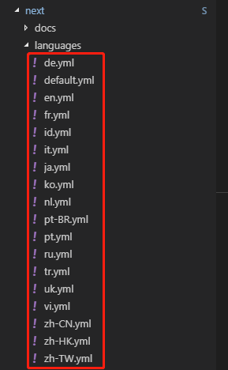



这一篇我们将学习使用主题，`themes`文件夹即为主题文件存在的路径。Hexo安装后自带了`landscape`主题，在Hexo官网上也有多个主题供选择，这里我选择了较为经典的模版`nexT`，`nexT`的[官网文档](http://theme-next.iissnan.com/)可能因为较长时间未更新，文档的中的一些配置已经无法在最新（本文创建时为V6.7.0）的`nexT`中生效，所以本文的一些内容会与官网文档不同。



<!--more-->

Hexo工程中一般存在多个`_config.yml`文件在Hexo目录下会存在一个，在每一个主题的文件夹下还有一个。我们将存在于Hexo目录下的配置文件叫做 **站点配置文件**,存在于主题文件夹下的叫做 **主题配置文件** 。

## 安装nexT主题

在Hexo目录下，运行`git clone https://github.com/iissnan/hexo-theme-next themes/next`命令即可下载nexT工程，在下载完成后，打开站点配置文件，并找到`theme`字段，将其属性改为next即表示开始使用nexT主题

```yml
theme: next
```

## 选择主题模版

nexT自带有四个模版`Muse`,`Mist`,`Pisces`,`Gemini`,可以在主题配置文件中找到字段`scheme`，并进行相应的修改

```yml
scheme: Pisces
```

## 配置站点语言

我们可以修改博客的语言版本，在站点配置文件中找到`language`字段，并修改为自己想要的语言版本。

```yml
language: zh-CN
```

支持的语言版本由主题文件来决定，在主题文件夹下存在`languages`文件夹，下面存放了该主题所支持的语言。如nexT所支持的语言为：



## Menu菜单

默认的Menu菜单只有归档和首页两个页面，如果要增加更多的页面，在主题配置文件的`menu`字段中加入即可，字段的格式如下。其中Icon为[Font Awesome](http://fontawesome.dashgame.com/)图标，名字与`Font Awesome`对应即可

```yml
menu:
# <KEY> : <Link> || <Icon>
  home: / || home
```

## 侧边栏

在主题配置文件中修改`sidebar`字段开控制侧边栏行为，比如`position`表示显示的位置，`display`表示显示的时机

```yml
sidebar:
  # 侧边栏显示在左侧
  position: left
  #只在文章存在目录的情况下显示侧边栏
  display: post
```

侧边栏中的头像可在主题配置文件中的`avatar`字段中修改

```yml
avatar:
  # 使用本地图片时，将图片放在source目录下的uploads或images目录下（必须是这两个目录名字）
  #网络图片，直接将图片的url赋值即可
  url: /uploads/blackCat.jpg
```

侧边栏的作者昵称和站点描述可分别在站点配置文件中的`author`和`description`中修改

```yml
description: To see the world as it is, and to love it.
keywords:
author: 三叔
```
