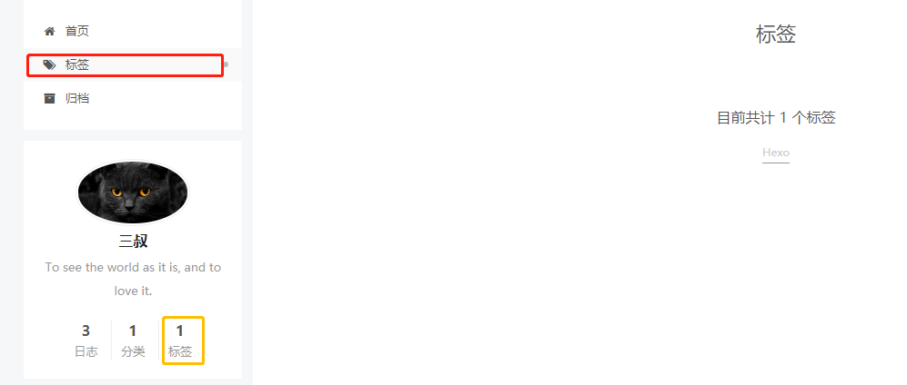
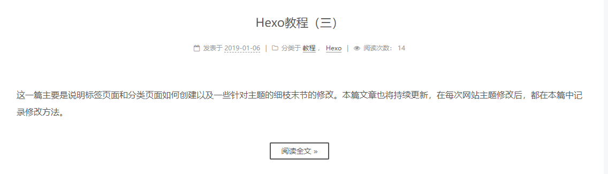
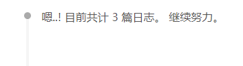
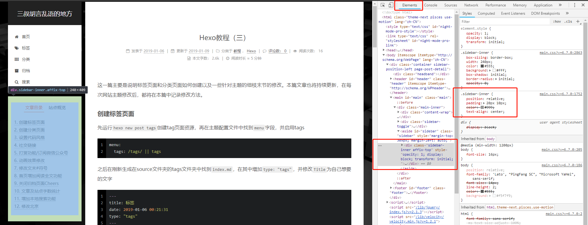
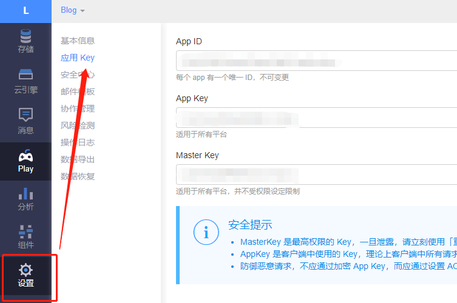

这一篇主要是说明标签页面和分类页面如何创建以及一些针对主题的细枝末节的修改。本篇文章也将持续更新，在每次网站主题修改后，都将在本篇中记录修改方法。

<!--more-->

## 创建标签页面

先运行`hexo new post tags`创建tag页面资源，再在主题配置文件中找到`menu`字段，并启用tags

```yml
menu:
  tags: /tags/ || tags
```

之后在刚新生成在source文件夹的tags文件夹中找到`index.md`，在其中增加`type: "tags"`，并修改`Title`为自己想要的文字

```yml
---
title: 标签
date: 2019-01-06 00:21:31
type: "tags"
---
```

在下图的红框及黄框处都会自动链接到Tags页面，Tags页面也将自动统计目前所使用的标签数


## 创建分类页面

运行`hexo new page categories`创建分类页面，之后的操作与创建标签页面类似，这里不做赘述。

## 设置代码风格

在主题配置文件中修改`highlight_theme`字段，目前共有`normal`,`night`,`night eighties`,`night blue`,`night bright`，五种选项

```yml
highlight_theme: night
```

## 社交链接

在主题配置文件中修改`social`字段，其格式与`menu`字段相同，|| 前为链接，后为`Font Awesome`图标

```yml
social:
  GitHub: https://github.com/xuejiaW || github
```

## 打赏功能/订阅微信公众号

分别在主题配置文件中修改`reward`及`wechat_subscriber`字段

```yml
reward:
  enable: true
  comment: Donate comment here
  wechatpay: /images/wechatpay.jpg

wechat_subscriber:
  enabled: true
  qcode: /path/to/your/wechatqcode e.g. /uploads/wechat-qcode.jpg
  description: e.g. subscribe to my blog by scanning my public wechat account
```

## 动画效果修改

在配置文件中修改`motion`字段下的相应设置即可。

```yml
motion:
  enable: true
```

## 修改文末#符号

每一篇文章如果打上了Tag，则会在文末显示`#<tag>`这样的标记，但#显得不太美观，而且无法直接的表现出其标签的含义，所以这里想将其替换为图标

找到`themes/next/layout/_macro/post.swig`文件，并在其中搜索`rel="tag"`字段，并将其后的`#`修改为`<i class="fa fa-<FontAwesome icon>"> </i>`即可

```swig
<a href="{{ url_for(tag.path) }}" rel="tag"><i class="fa fa-tags"> </i> {{ tag.name }}</a>
```

上例中的tags即为[FontAwesome图标](https://fontawesome.com/icons?d=gallery)

## 首页增加阅读全文功能

在文章想要出现在首页的内容之后加入`<!--more-->`即可

```md
这一篇主要是说明标签页面和分类页面如何创建以及一些针对主题的细枝末节的修改。本篇文章也将持续更新，在每次网站主题修改后，都将在本篇中记录修改方法。

<!--more-->
```



在点击了阅读全文按钮进入文章后会发现，文章自动跳转到了首页显示内容之后的地方，如果要关闭这个功能，在主题配置文件中修改`scroll_to_more`字段

```yml
scroll_to_more: false
```

## 关闭归档页面Cheers

进入归档页面后会发现默认有以下效果



如果需要关闭的话，在主题配置文件中找到`cheers_enabled`字段

```yml
cheers_enabled: false
```

## 文章及站点字数统计

> Github支持地址：https://github.com/theme-next/hexo-symbols-count-time

首先在Hexo目录下运行`npm install hexo-symbols-count-time --save`安装需要的插件，后在站点配置文件中添加

```yml
symbols_count_time:
  symbols: true
  time: true
  total_symbols: true
  total_time: false
```

再在主题配置文件中修改`symbols_count_time`字段

```yml
symbols_count_time:
  separated_meta: true
  item_text_post: true
  item_text_total: true
  awl: 2 # 统计的语言 中文为2，英语为5，俄语为6
  wpm: 275 # 每分钟估计的阅读字符数
```

## 增加本地搜索功能

> Github支持地址 https://github.com/theme-next/hexo-generator-searchdb

首先在Hexo目录下运行`npm install hexo-generator-searchdb --save`安装需要的插件，后在站点配置文件中添加

```yml
search:
  path: search.xml
  field: post
  format: html
  limit: 10000 #最大搜索的文章数，10000即为在最新的10000篇文章中搜索
```

再在主题文件中配置修改`local_search`字段

```yml
local_search:
  enable: true
  trigger: auto
  top_n_per_article: 1
  unescape: false
```

## 修改背景

在`\themes\next\source\css\_custom\custom.styl`文件下增加

```css
body {
    background:url("background url");
    background-repeat: no-repeat;
    background-attachment:fixed;
    background-size: cover;
    width: 100%;
}
```

## 修改页面其他元素

实际上next自定义的修改都可放在`\themes\next\source\css\_custom\custom.styl`下，想要修改某一部分时，可以先打开博客网页（以Chrome游览器为例），然后按F12，唤出调试界面。

当在Element情况下选择部分代码，左侧页面相关部分会高亮，这部分类也会相应的显示出来，如上图中为`.sidebar-inner`，只要把最右侧的相关代码

```css
.sidebar-inner {
    position: relative;
    padding: 20px 10px;
    color: #999;
    text-align: center;
}
```

改动后复制到`custom.styl`即可。

由于我不懂CSS，所以这部分的修改也是摸石头过河，就不多说了。

## 增加Valine评论系统

[Valine](https://valine.js.org/quickstart.html)是一个轻量级，无后端的评论系统，它完全依赖于[Leancloud](https://leancloud.cn/)运行，配置起来也十分便捷。
在`Leancloud`上完成账号的注册登录，并创建完应用后。如下图进入应用界面，并进入设置找到AppID与AppKey。



在主题配置文件中开启Valine并填入相应参数即可

```yml
valine:
  enable: true
  appid:  APPID
  appkey:  APPKEY
  notify: false
  verify: false
  placeholder: 匿名的！不需要注册！想说啥直接说吧！
  avatar: mm
  guest_info: nick,mail,link
  pageSize: 10
  visitor: true #这里开启后注意该文件中还有一个leancloud_visitors字段，这两个功能相同，选一个开启就好，否则会有冲突
```

完成配置后刷新页面，每篇文章下便会出现评论，之前的分类及标签页面也会出现，如果不想在这两个页面显示评论，可以修改对应的`index.md`文件，如

```yml
---
title: 标签
date: 2019-01-06 00:21:31
type: "tags"
comments: false
---
```

## 待续

...
