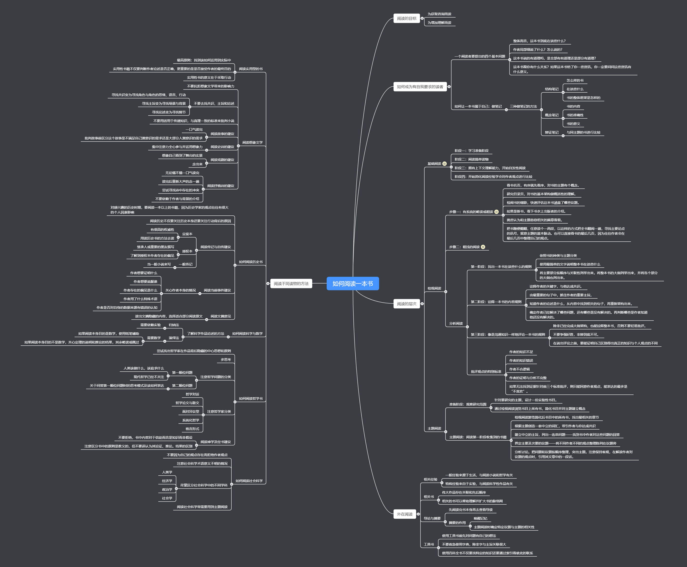

《如何阅读一本书》思维导图、简评、笔记与摘要。

<!--more-->

# 简评

反思了下自己2018年的读书或许自己太注重读书的量而没有关心读书的质，以至于许多的书看过后并没有留下什么印象。想起了曾经在Kindle上读过的《如何阅读一本书》，这本书在当时给自己留下了很深的印象，但没有付诸于实践。在春节假期的后半段决定重写阅读这本书来帮助自己在新的一年提高阅读的质量。

读书过程中按照书的章节做了完整的笔记与摘要，笔记与摘要内容很长，没必要完整阅读，主要是为了以后如果需要复习可以回忆起特定章节的内容。同时为了以后可以快速回忆起整本书的主要建议，整理了对应的思维导图。

合格的阅读应该是带有主动思考的阅读，作者认为主动阅读需要回答四个基本问题：

1. 整体而言，这本书到底在谈些什么？
2. 作者局部细说了什么？怎么说的？
3. 这本书说的有道理吗，是全部有有道理还是部分有道理？
4. 这本书跟你有什么关系？如果这本书给了你一些资讯，你一定要问问这些资讯有什么意义。

作者提出要通过三个层次的阅读来回答这四个问题：检视阅读、分析阅读、主题阅读，并分别讲解了每个层次中需要遵循的规则或要点。

作者还分别解析了面对不同种类的书籍该如何调整这些规则与要点，并给出了阅读特定种类书籍的建议。

全书主要关注的是主动阅读中该如何去有效的思考，这样的一个较高层次的指导，针对于读书过程中`如何做笔记`以及`如何整理书中的内容`这样更实践性的指导仅是一笔带过。

# 思维导图

# 笔记与摘要

## 阅读的层次

### 阅读的活力与艺术

信息时代使得人们可以轻易的获取大量的知识，这些知识也包括了媒体人经过设计和包装后再次传递出来的知识。但这样的行为实际上让平常人失去了独自思考的能力，并且将他人的结论误认为是“自己”的成果。

> 1. 太多的资讯就如同太少的资讯一样，都是一种对理解力的阻碍。换句话说，现代的媒体正以压倒性的泛滥资讯阻碍了我们的理解力。
> 2. 如何将知识分子的态度与观点包装起来，是当今最有才智的人在做的最活跃的事业之一。

#### 主动阅读

读书或多或少是一个主动的行为，人总不能眼神呆滞放空大脑还能进行有效的阅读。作者和读者的关系如同投手和打击手，读书是一个作者和读者配合的工作。作者在写书时会考虑该怎样让读者理解，而读者则要学会如何理解作者的各种表达方式和内容。

> 1. 第一提醒读者，阅读可以是一件多少主动的事。第二要指出的是，阅读越主动，效果越好。
> 2. 其实完全相反，听众或读者的“接收”，应该像是棒球赛中的捕手 才对。 捕手在接球时所发挥的主动是跟投手或打击手一样的。
> 3. 捕手的艺术就在能接住任何球的技巧—— 快速球、曲线球、变化球、慢速球等等。同样地，阅读的艺术也在尽可能掌握住每一种讯息的技巧。

#### 阅读的目标：为获取资讯而读，以及为增进理解而读

阅读的目标分为两种，一是为获取资讯而读，二是为增进理解而阅读。

例如一个人对于美国历史已经有了一部分的了解，也有一些自己的理解。当一份新的资料，他用自己原先的理解角度完全可以解释的话，那这份资料的阅读就只是第一种阅读，而如果在新资料中他获得了新的理解，那就是第二种阅读了。

#### 为获取资讯而读

> 如果很了解，你就获得了资讯（但你的理解力不一定增强）。...这本书的讯息只是将你还没读这本书之前你们便共同了解的东西传达出来而已。...这样的读物能增加我们的资讯，却不能增进我们的理解力，因为在开始阅读之前，我们的理解力就已经与他们完全相当了。

#### 为增进理解而读

> 1. 只有一种方式是真正地在阅读。没有任何外力的帮助，你就是要读这本书。你什么都没有，只凭着内心的力量，玩味着眼前的字句，慢慢地提升自己，从只有模糊的概念到更清楚地理解为止。这样的一种提升，是在阅读时的一种脑力活动，也是更高的阅读技巧。
> 2. 这是一个凭借着头脑运作，除了玩味读物中的一些字句之外，不假任何外助，以一己之力来提升自我的过程。
> 3. 这个东西的水平就是比阅读的人高上一截。这个作者想要表达的东西，能增进阅读者的理解力。

#### 阅读就是学习：指导型的学习，以及自我发现型学习之间的差异

学习的过程，首先是吸收资讯，之后是被这些资讯启示进而提升理解力。

> 1. 如果你运用的只是你的记忆力，其实你除了那些讯息之外一无所获。你并没有被启发。要能被启发，除了知道作者所说的话之外，还要明白他的意思，懂得他为什么会这么
> 2. 初学者的无知在于未学，而学者的无知在于学后。”第一种的无知是连字母都没学过，当然无法阅读。第二种的无知却是读错了许多书。英国诗人亚历山大·蒲伯（Alexander Pope）称这种人是书呆子，无知的阅读者。总有一些书呆子读的太广，却读不通。

指导型学习和自我发现型学习的区别并非指导型学习是被动的，自我发现型学习是主动的，两者都是主动的，没有一种学习是死气沉沉的，指导型学习更确切的可以表达为“辅助型的自我发现学习。”

> 事实上，要区分得更清楚一些的话，我们可以称指导型的学习是“辅助型的自我发现学习”。

两者的主要区别实际在于教材，前者是基于他们传递的讯息，后者则是自我和世界。

> 1. 当他被指导时，在老师帮助下自我发现时，学习者的行动立足于传达给他的讯息。
> 2. 当学习者在没有任何老师指导帮助下开始学习时，学习者则是立足于自然或世界，而不是教导来行动。
> 3. 非辅助型的自我发现学习——是阅读自我或世界的学习。就像指导型学习（被教导或辅助型学习）是阅读一本书，包括倾听，从讲解中学习的一种艺术。

两种学习方法都需要用到思考。不同的是，在自我发现型的学习中在思考后还会凭借自己的感觉去运用想象，而这是在指导型学习中被遗忘或忽略的过程。

> 1. 思考只是主动阅读的一部分。一个人还必须运用他的感觉与想象力。一个人必须观察，记忆，在看不到的地方运用想象力。我们要再提醒一次，这就是在非辅助型的学习中经常想要强调的任务，而在指导型的任务，或倾听学习中被遗忘或忽略的过程。
> 2. 阅读的艺术包括了所有非辅助型自我发现学习的技巧：敏锐的观察、灵敏可靠的记忆、想象的空间，再者当然就是训练有素的分析、省思能力。

#### 老师的出席与缺席

上一节阐述指导型学习的过程中，举了阅读和倾听两个例子，倾听存在有活生生的老师教导，而阅读往往只能靠自己。

> 1. 倾听是从一位出现在你面前的老师学习——一位活生生的老师——而阅读确实跟一位缺席的老师学习。
> 2. 如果一本书就是你的老师的话，你就得一切靠自己。

本书的目的就是教导读者如何靠自己更好的阅读一本书。

### 阅读的层次

#### 第一层阅读：基础阅读

基础阅读解决的是认出书中所有的字符和知道这些话在说什么。基础阅读基本在小学阶段就已经训练完毕。这一层阅读的熟练与否也影响阅读的速度。

> 大部分的困难都是技术性的问题，有些可以追溯到早起阅读教育的问题。因此，大部分的速度课程都着眼在这个层次的阅读上。

#### 第二个阅读：检视阅读

这个层次也称为略读或预读，检视阅读解决的问题是在一段时间内了解到一本书的重点。在这个层次阅读中需要从表面观察这本书，了解到这本书在谈些什么，框架是怎样的。大部分人往往都忽略了检视阅读的重要性。

> 1. 因此，用另一种方式来形容这个层次的阅读，就是在一定的时间之内，抓出一本书的重点
> 2. 我们想要强调的是，大多数人，即使是许多优秀的阅读者，都忽略了检视阅读的价值。他们打开一本书，从第一页开始读起，孜孜不倦，甚至连目录都不看一眼。因此，他们在只需要粗浅翻阅一本书的时候，却拿出了仔细阅读、理解一本书的时间。

####  第三层阅读：分析阅读

分析阅读就是全盘、完整、仔细的阅读。

> 1. 如果说检视阅读是在有限的时间内，最好也最完整的阅读，那么分析阅读就是在无限的时间里，最好也最完整的阅读。
> 2. 弗兰西斯·培根曾经说过：“有些书可以浅尝即止，有些书是要生吞活剥，只有少数的书是要咀嚼与消化的。”分析阅读就是要咀嚼与消化一本书。

#### 第四层阅读：主题阅读

主题阅读是最复杂、最系统化、最主动、最花力气的阅读。主题阅读需要读者在不同的书之间找到相关之处，甚至于得出一个哪本书中都没有提过的结论。

> 1. 在做主题阅读时，阅读者会读很多的书，而不是一本书，并列举出这些书之间相关之处，提出一个所有的书都谈到的主题。
> 2. 借助他所阅读的书籍，主题阅读者要能架构出一个可能在哪一本书中都没有提到的主题分析。

### 阅读的第一个层次：基础阅读

#### 学习阅读的阶段

第一个阶段为阅读准备阶段，这一阶段从出生开始到6-7岁为止，包括身体和智力方面的准备，如有良好的视力和听力，有基本的认知能力等。
第二个阶段，孩子会阅读一些简单的读物，在这个阶段中，孩子会有一些基本的阅读技巧如字句的使用，字句的含义等。
第三个阶段，孩子会拥有快速建立字汇的能力，通过上下文提供的线索，去猜测不熟悉的字眼。同时在这个阶段孩子也会自发性的去阅读
第四个阶段，精炼与增进前面所学的技巧。在这个阶段学生开始消化他的阅读经验，可以对作者提出的观点进行比较。

这通常一个完成了正常学业的成年人都是已经通过了这四个阶段的。

#### 阅读的阶段与层次

当一个人通过了上述四个阶段时，他便已经精通了第一个层次的阅读，但也仅此而已。
一般而言，在度过四个阶段时，都有老师相伴，都是辅助型的自我发现阅读。而之后的阅读便会开始非辅助型自我发现阅读。

#### 更高层次的阅读与高等教育

> 一个人文素养优良的高中，就算什么也没做，也该培养出能达到分析阅读的读者。一个优秀的大学，就算什么也没贡献，也该培养出能进行主题阅读的读者。

#### 阅读与民主教育的理念

> 我们一定要比一个人人识字的国家更进一步。我们的国人应该变成一个个真正“有能力”的阅读者，能够真正认知“有能力”这个字眼的含义。

### 阅读的第二个层次：检视阅读

#### 检视阅读一：有系统的略读或粗读

略读的步骤：
1. 看书名页，有序就先看序，对书的主题有个概念。
2. 研究目录页，对书的基本架构做概括性的理解。
3. 检阅书的缩影，快速评估这本书涵盖了哪些议题。
4. 如果是新书，看下书衣上出版者的介绍。

上述四个步骤完成后，基本对于一本书已经有了基本的资讯。如果是决定要仔细读或者决定不读，这时将书放在一边，否则便继续做一下的略读。

5. 在第二步看完目录页后，挑些认为和主题息息相关的篇章看看。
6. 把书随便翻翻，任意读个一两段，以这样的方式把全书翻阅一遍，寻找主要论点的讯号，留意主题的基本脉动。也可以直接看书的最后几页，因为往往作者会在最后几页中整理自己的观点。

上述的六个步骤应该在一小时内完成。

> 你可以把自己想做一个侦探，在寻找一本书的主题或思想的线索。随时保持敏感，就很容易让一切状况清楚。

#### 检视阅读二：粗浅的阅读

粗浅的阅读即在阅读过程中发现自己理解不了的部分，就略过继续读下去，读到能读懂的部分就继续看下去，这样先对书有一个了解。在之后的阅读中，这部分的了解会帮助理解那些难懂的部分。

> 头一次面对一本难读的书的时候，从头到尾先读一遍，碰到不同的地方不要停下来查询或思索。

#### 阅读的速度

速读和检视阅读都是加快读书的速度，但速读更多层面上时解决基础阅读层面的困难。检视阅读之所以快是因为读者只读了书中一小部分，而且是用不同的方式去读，不同的目标去读。

> 1. 检视阅读的两个方式都需要快速的阅读，一个熟练的检视阅读者想要读一本书时，无论碰到多难读或多长的书，都能很快的运用者两种方式读完。
> 2. 许多书其实是连略读都不值得的，另外一些书只需要快速读过就可以了。有少数的书需要用某种速度，通常是相当慢的速度，才能完全理解。

#### 逗留与倒退

速读解决了基础阅读的两个问题，逗留和倒退，我们可以用手引导眼睛来解决问题。

>1. 许多人在阅读时会用半出声的方式阅读，在阅读一行字的时候在五六个地方发生逗留，而且常在每阅读两三行之后，眼睛就自然地“倒退”。这些都很大程度影响了阅读的速度。
>2. 纠正的方法也很简单，用手指着段落且手移动的速度大于眼睛看的速度，这样持续的增加手的速度，阅读的速度也就相应地提高了。

#### 理解的问题

速读课程在增加阅读速度的同时也增加了理解力，因为要保证快速的阅读速度，读者也只能专注于阅读的东西上。但理解力也不仅仅等同于专注力，它往往还有超越了基础阅读的部分，这也是这本书需要讨论的部分。

#### 检视阅读的摘要

检视阅读的两个步骤都是分析阅读之前的预备动作。

### 如何做一个自我要求的读者

在阅读时保持清醒或昏昏欲睡取决的于阅读的目标是否是获得利益，如果是则就会保持清醒，也会在阅读时尽可能的保持主动。

#### 主动阅读的基础：一个阅读者要提出的四个基本问题

1. 整体而言，这本书到底在谈些什么？
2. 作者局部细说了什么？怎么说的？
3. 这本书说的有道理吗，是全部有有道理还是部分有道理？
4. 这本书跟你有什么关系？如果这本书给了你一些资讯，你一定要问问这些资讯有什么意义。

这四个问题是阅读的基本规则，也是在分析阅读中要讨论的主要议题。

> 1. 任何一种超越基础阅读的阅读层次，核心就在你要努力提出问题。这也是有自我要求的阅读者与没有自我要求的阅读者之间，有天壤之别的原因。
> 2. 在阅读的过程中，要记得提出这些问题。除此之外，你还要知道如何精准、正确地回答这些问题。如此训练而来的能力，就是阅读的艺术。

检视阅读可以给出前两个问题的一部分答案，同时也对后两个问题有帮助。分析阅读则要回答第三个问题，最后一个问题是主题阅读中最重要的部分。

#### 如何让一本书真正属于你自己

> 要完全拥有一本书，必须把书的一部分变成自己的一部分，而这个最好的方法就是写下来。
> 为什么对阅读而言，在书上做笔记是不可或缺的事
> 1. 那会让你保持清醒
> 2. 阅读如果是主动的，便会有思考，而思考的表现就是用语言表达出来——无论是说出来还是写出来
> 3. 将自己的感想写下来，能帮助理解作者的思想

有以下几种记笔记的方法

> 1. 画底线 强调
> 2. 在底线处外的栏外再加画一道线 再次强调
> 3. 在空白处做星号或其他符号。要慎用，只用来强调书中十来个最重要的声明或段落即可。
> 4. 在空白处编号，记录下作者某个论点的一连串论述
> 5. 在空白处记下其他的页码。把相关的要点集中在一起。
> 6. 将关键字或句子圈起来——这与画底线的功能是一样的
> 7. 在空白处做笔记。写下问题或者自己想法

也可以在书前面的空白页上写下自己的想法或整理全书的大纲。

#### 三种做笔记的方法

结构笔记
> 在检视阅读的过程中，要回答的问题是：第一，这是本什么样的书？第二，整本书在谈的是什么？第三，作者是借着怎样的整体框架来发展他的观点或陈述他对这个主题的理解？你应该做笔记把这些答案写下来。

检视阅读时做的结构笔记在之后的分析阅读中将会派上用处。

概念笔记

> 等你做分析阅读时，关于这本书准确性与意义的问题，你就要提出答案了。在这个层次的阅读里，你做的笔记就不再是跟结构有关，而是跟概念有关了。

辩证笔记

> 对一个已经熟练同时读好几本相同主题书籍的专业阅读者来说，还有一个更高层次的记笔记的方法，那就是针对一场讨论情境的笔记。

#### 培养阅读的习惯

各种阅读方法都是一种规则，而将规则变化为习惯需要大量的练习。这些规则在现在看来是割裂的，但当我们真正熟练时，规则便会融为一体。这就如同学习滑雪的过程，一开始也需要学习一个个单一的动作，但最终这些动作都会连接在一起。

> 1. 要养成习惯，除了不断的运作联系之外，别无他法。
> 2. 知道一项艺术的规则，跟养成习惯是不同的。
> 3. 而你不能照规则来做，就不可能养成一种艺术或任何技能的习惯
> 4. 换句话说，你一定要学会忘掉哪些分开的步骤，才能表现出整体的动作，而每一个单一的步骤都还要确实表现的很好。但是为了要忘掉这些单一的动作，一开始你必须先分别学会每一个单一的动作。只有这样，你才能将所有的动作连接在一起。
> 5. 一开始是，学习者只会注意到自己与那些分开来的动作。等所有分开的动作不再分离，渐渐融为一体时，学习者便能将注意力转移到目标上，而他也具备了达成目标的能力了。

## 阅读的第三个层次：分析阅读

### 一本书的分类

#### 书籍分类的重要性

分析阅读的第一步需要知道自己读的是什么种类的书。

> 1. 分析阅读的第一个规则可以这么说：规则一，你一定要知道自己在读的是哪一类书，而且要越早知道越好。最好早在你开始阅读之前就先知道。
> 2. 一本论说性的书的主要目的是在传达知识。
> 3. 分析阅读的第一个规则，虽然适用于所有的书籍，却特别适合用来阅读非小说，论说性的书。

通过之前的检视阅读来完成这一规则

> 之前我们已经建议过，一开始时，你要先检视这本书——用检视阅读先浏览一遍。

#### 从一本书的书名中你能学到什么

许多人常不去看书名的原因是因为觉得书籍的分类是没有必要的。但书籍的分类并不是最终目的，最终目的是了解到这一种类的书具体在谈些什么。

书籍分类存在有一些标准，首先可以分为虚构的`小说类`和传递知识的`论述类`，而论述类又可以再细分。

> 1. 我们会指出这个普遍的错误，是因为许多人以为他们知道这本书的书名，而事实上只有少之又少的人真的用心读过书名，也想过其中的含意。
> 2. 许多人会忽略书名或序言的原因之一是，他们认为要将手边阅读的这本书做分类是毫无必要的。
> 3. 只有当你在不同的书籍之间能找出区别，并且定出一些合理又经得起时间考验的分类时，这个规则才会更简单明白一些。
> 4. 光是将书籍分类到某一个种类中还是不够的。要跟随第一个阅读步骤，你一定要知道这个种类的书到底是在谈些什么？
> 5. 除了实用手册与（广义的）道德论述之外，另一种实用型的作品也要提一下。任何一种演说，不论是政治演说或道德规劝，都是想告诉你该做些什么，或你该对什么事有什么样的反应。

##### 实用性vs理论性作品

理论性书籍教导知识，实用性书籍引导行动。

> 1. 实用是与某种有效的做法有关，不管是立即或长程的功效。而理论所关注的却是去明白或了解某件事。如果我们仔细想想这里所提出来的粗略的道理，就会明白知识与行动之间的区别。
> 2. 理论性的作品是在教你这是什么，实用性的作品在教你如何去做你想要做的事，或你认为应该做的事。
> 3. 严格来说，任何一本教我们如何生活，该做什么，不该做什么，同时说明做了会有什么奖赏，不做会有什么惩罚的伦理的书，不论我们是否同意他的结论，都得认定这是一本实用的书。

##### 理论性作品的分类

> 1. 如果一本理论的书所强调的内容，超乎你日常、例行、正常生活的经验，那就是科学的书。否则就是一本哲学的书。
> 2. 既然书本所要传达给我们的知识不同，对我们的指导方式也会不同。

### 透视一本书

书的架构如同人的骨架，分析阅读的目的就在意找出这个骨架。无论什么书存在架构，即使是小说、诗集。

分析阅读的第二个规则：使用一小段文字来叙述整本书的内容。书籍的分类让读者明白了这是本怎么样的书，这里我们要进一步知道这本书要干什么。

分析阅读的第三个规则：将书中重要的篇章列举出来，说明他们如何按照顺序组成一个整体的架构。

> 1. 每一本书的封面之下都有一套自己的骨架。作为一个分析阅读的读者，你的责任就是要找出这个骨架。
> 2. 但是，任何一本值得读的书，都会有一个整体性与组织架构。否则这本书会显得乱七八糟，根本没法阅读。而烂书就是如此。
> 3. 分析阅读的第二个规则是：使用一个单一的句子，或最多几句话（一小段文字）来叙述整本书的内容。
> 4. 必须能用几句话，告诉你自己，或别人，这整本书在说的是什么。（如果你要说的话太多，表示你还没有将整体的内容看清楚，而只是看到了多样的内容。）
> 5. 第三个规则可以说成是：将书中重要篇章列举出来，说明它们如何按照顺序组成一个整体的架构。
> 6. 一本好书，就像一栋好房子，每个部分都要很有秩序地排列起来。每个重要部分都要有一定的独立性。
> 7. 但是却一定要跟其他部分连接起来——这是与功能相关——否则这个部分便无法对整体的智能架构作出任何贡献了。

#### 结果与规划：叙述整本书的大意

关于第二个规则的两个建议：一是书的作者本身很可能已经整理的书的重点，通常在序言中，二是我们不需要把作者整理的重点作为唯一的说明。

> 1. 首先，一位作者，特别是好的作者，会经常想要帮助你整理出他书中的重点。
> 2. 其次，是要小心，不要把我们提供给你的那些书的重点摘要，当作是它们绝对又唯一的说明。

#### 驾驭复杂的内容：为一本书拟大纲的技巧

第二规则和第三规则的联系在于，第二规则着重与整体，而第三规则强调复杂度，且运用第二规则抓住整体后会有助于我们用第三规则对重要部分进行透视。

可以参考这个公式来进行大纲的罗列。

> 我们可以依照第三个规则，将内容大纲排列如下：（1）作者将全书分成五个部分，第一部分谈的是什么，第二部分谈的是什么，第三部分谈的是别的事，第四部分则是另外的观点，第五部分又是另一些事。（2）第一个主要的部分又分成三个段落，第一段落为X，第二段落为Y，第三段落为Z。（3）在第一部分的第一阶段，作者有四个重点，第一个重点是A，第二个重点是B，第三个重点是C，第四个重点是D等等。

第三规则对于第二规则的重要性在于：除非遵循规则三，否则无法有效的运用规则二。如果读者没有用规则三理解整本书的框架，那么规则二得出的整体性结论又如何保证正确呢？

> 1. 第二个规则在指导你注意一本书的整体性，第三个则在强调一本书的复杂度。要这样区分还有另一个理由。当你掌握住一本书的整体性时，便会立刻抓住其中一些重要的部分。但是这每个部分的本身通常是很复杂，各有各的内在结构需要你去透视。
> 2. 你只要尽力而为就行了。毕竟，这个规则并没有要你将作者没有放进去的东西加在里面。你的大纲是关于作品本身的纲要，而不是这本书要谈的主题的纲要。
> 3. 用另一种方法来说，就是除非你遵循规则三——要求你说明组成整体的各个部分——否则就没有办法有效地运用规则二——要求你作全书的重点摘要。

#### 阅读与写作的互惠技巧

运用规则三实际上就是去透视一本书的骨架。对于写作者而言，对于骨架和血肉的理解也同样重要，写作者应该先有了一本书的骨架后再往上添加血肉。

> 1. 如果作者跟老师无法将自己要传达的东西整理出架构，不能整合出要讲的各个部分的顺序，他们就无法指导读者和学生去找出他们要讲的重点，也没法发现全书的整体架构。
> 2. 如果他是个好作者，就不会将一个发育不良的骨架埋藏在一堆肥肉里，同样的，也不会瘦得皮包骨，让人一眼就看穿。
> 3. 书，真的就跟人或动物是一模一样的。——血肉，就是为纲要所作的进一步详细解释，或是我们有时候所说的“解读”（read out）。

#### 发现作者的意图

在这一节阐述了第四个规则：找出写作者问的问题。第四个规则和前两条规则实际上是前后呼应的关系，在做规则二、三 时实际上就会完成规则四，而规则四则会帮助更好的完成规则二、三。

> 1. 这第四个规则可以说是：找出作者要问的问题。一本书的作者在开始写作时，都是有一个问题或一连串的问题，而这本书的内容就是一个答案，或许多答案。
> 2. 你应该有办法说出整本书想要解答的问题是什么。如果主要的问题很复杂，又分成很多部分，你还要能说出次要的问题是什么。你应该不只是有办法完全掌握住所有相关的问题，还要能明智地将这些问题整合出顺序来。哪一个是主要的，哪个是次要的？哪个问题要先回答，哪些是后来才要回答的？

#### 分析阅读的第一个阶段

四个规则将会提供读者对于一本书架构的认识。当完成了四个规则后，实际上我们就完成了分析阅读的第一个阶段，这一阶段主要探究的是一本书在谈些什么的问题（一本书的骨架）。要注意这里的阶段并非一个前后顺序的概念，没必要为了四个规则将一本书读一遍后又为了完全其他规则读一遍又一遍。

> 这四个规则在一起，能提供读者对一本书架构的认识。当你运用这四个规则来阅读一本书，或任何又长又难读的书时，你就完成了分析阅读的第一个阶段。除非你是刚开始练习使用分析阅读，否则你不该将“阶段”一词当作一个前后顺序的概念。

### 与作者找出共通的词义

从这里开始阐述分析阅读第二阶段，这个阶段也有四个规则。

第一个规则：找出共通的词义，找出单字，并且确认这些单字在使用时最精确的意义

> 1.只要模糊地带还存在，就表示作者和读者之间对这些单字的意义还没有共识。为了要达成完全的沟通，最重要的是双方必须要使用意义相同的单字——简单来说，就是，找出共通的词义达成共识。

#### 单字VS.词义

每一个单字都有多种不同的解释，但单字在一段话中往往只有一个解释（论述书基本如此，小说和诗词会有例外），这就是词义。我们需要知道一本书的作者在这段话的中点的词义。

#### 找出关键字

关键字很可能是让你头疼无法理解的词。

> 1. 如果你把觉得有困扰的字圈出来，很可能就找出了作者有特定用法的那些字了。之所以会如此，是因为如果作者所用的都只是一般日常用语的含义，对你来说就根本不存在有困扰的问题了。
> 2. 从一个读者的角度来看，最重要的字就是那些让你头痛的字。这些字很可能对作者来说也很重要。

#### 专业用于及特殊词汇

一些在特定的专业词汇如`点`、`线`、`面`等，又如经济中`财富`，`资本`，`土地`这样的词汇。

> 1. 事实上，你也会发现一些对你来说并不是日常用语的字，因而发现那是一些重要的字眼。
> 2. 某些知识领域有一套完整的专门用语，在一本这种主题的书中找出重要的单字，相形之下就很容易了。
> 3. 另外一个线索是，作者与其他作者争执的某个用语就是重要的字。
> 4. 如果读者碰到一个不了解的字不愿意深思，或至少作个记号，那他不了解的这个字就一定会给他带来麻烦。
> 5. 大多数人都习惯于没有主动的阅读。没有主动的阅读或是毫无要求的阅读，最大的问题就在读者对字句毫不用心，结果自然无法跟作者达成共识了。

#### 找出字义

通过上下文的联系找出正确的词义。

> 1. 首先，要判断这个字是有一个还是多重意义。如果有多重意义，要看这些意义之间的关系如何。最后，要注意这些字在某个地方出现时，使用的是其中哪一种意义。看看上下文是否有任何线索，可以让你明白变换意义的理由。最后这一步，能让你跟得上字义的变化，也就是跟作者在使用这些字眼时一样变化自如。
> 2. 你一定要利用上下文自己已经了解的所有字句，来推敲出你所不了解的那个字的意义。
> 3. 整个过程有点像是在玩拼图时尝试错误的方法。你所拼起来的部分越多，越容易找到还没拼的部分，原因只不过剩下的部分减少了。

### 判断作者的主旨

第五个规则与单字和词义有关，第六个规则与句子有关，我们要找到作者的主旨。而第七个规则与论述有关，我们需要通过一连串的句子来了解作者的论述过程。可以看到五六七规则是有逻辑联系的，从单字（或词）到句子再到一连串的句子。

> 1. 书里的提案，也就是主旨，也是一种声明。那是作者在表达他对某件事的判断。
> 2. 但是读者却要先与作者达成共识，才能明白作者的主旨是什么，以及他所声明的是什么样的判断。
> 3. 第六个，也就是我们现在要讨论的，是与句子及提案有关的规则。
> 4. 我们从共识谈到主旨，再谈到论点，表达的方法是从字（与词）到一个句子，再到一连串的句子（或段落）来作说明。

#### 句子与主旨。

如同单字与词义一样，句子和主旨同样不是一一对应的。

> 1. 在区分句子与主旨之间，我们已经说得够清楚了。它们并不是一对一的关系。不只是一个单一的句子可以表达出不同的主旨，不管是有歧义的句子或复合句都可以，而且同一个主旨也能用两个或更多不同的句子来说明。
> 2. 第六个规则可以说是：将一本书中最重要的句子圈出来，找出其中的主旨。第七个规则是：从相关文句的关联中，设法架构出一本书的基本论述。

#### 找出关键句

关键句的标志：首先是阐述作者判断的句子，其次是找到在规则五中遇到的关键字组成的句子。

> 1. 从作者的观点来看，最重要的句子就是在整个论述中，阐述作者判断的部分。
> 2. 找出组成关键句的文字来。如果你已经将重要的字圈出来了，它一定会引导你看到值得注意的句子。
> 3. 但是当你想要在阅读中获得理解时，你要追寻的就不是那种新奇的感觉了。
> 4. 就因为有这些原因，我们所讨论的规则是要帮助你理解一本书，而不是满足你的好奇心。

#### 找出主旨

从关键句中找出主旨和找出关键字中的词义两者都需要从上下文中推导出作者真正的含义，但也有两个不同点。一是后者牵扯的内容比较多，二是一个复杂的句子往往包含了多个主旨。

测试是否真的懂了句子主旨的方法，一是用自己的话来将主旨重写表达一遍，二是举出一个自己所经历的主旨所描述的尽力。

> 1. 在找出文字所表达的意思与句子所阐述的主旨之间，只有两个不同之处。一个是后者所牵涉的内容比较多。就像你要用周边的其他字来解释一个特殊的字一样，你也要借助前后相关的句子来了解那个问题句。
> 2. 另一个不同是，复杂的句子通常要说明的不只一个主旨。除非你能分析出所有不同，或相关的主旨，否则你还是没有办法完全诠释一个重要的句子。
> 3. 如果要求你针对作者所写的某个句子作解释，而你只会重复他的话，或在前后顺序上作一些小小的改变，你最好怀疑自己是否真的了解了这句话。
> 4. 你能不能举出一个自己所经历过的主旨所形容的经验，或与主旨有某种相关的经验？

#### 找出论述

论述的基本单位是一系列先后有序，有时还带有例证和理由的主旨。分析阅读的第七个规则为：——找出论述的段落，如果没有则需要自己从不同的段落中找出关键句子，然后整理前后顺序的主旨进而形成论述。

论述的标志，一是所有的论述都包含声明，二是要记住有两种论述：以事例证明的归纳法和通过连串通则证明的演绎法，三是找到作者哪些事情认为是假设，哪些是能证明的，哪些是不证自明的。

> 1. 指导我们阅读的第七个规则的逻辑单位，是“论述”——一系列先后有序，其中某些还带有提出例证与理由作用的主旨。
> 2. 如果可以，找出书中说明重要论述的段落。但是，如果这个论述并没有这样表达出来，你就要去架构出来。你要从这一段或那一段中挑选句子出来，然后整理出前后顺序的主旨，以及其组成的论述。
> 3. 首先，要记住所有的论述都包含了一些声明。其次，要区别出两种论述的不同之处。一种是以一个或多个特殊的事实证明某种共通的概念，另一种是以连串的通则来证明更进一步的共通概念。前者是归纳法，后者是演绎法。再次，找出作者认为哪些事情是假设，哪些是能证实的或有根据的，

#### 找出解答

分析阅读的第一阶段（整理内容大纲）和第二阶段（诠释内容）后就是诠释一本书的最后步骤———找出解答。在第二阶段与作者达成共识，抓到他的主旨与论述后，我们应该提出更进一步的问题（在阶段四我们已经提出了基本问题——作者的问题是什么？），作者想要的问题哪些解决了？为了解决问题，他又引出了哪些问题？无论是新问题还是旧问题，哪些他知道自己还没有解决。第八个步骤便是找出这些问题的解答。

至此分析阅读的第二阶段已经完成，这一个阶段通过四个规则解决了一本书到底在说什么的问题（诠释一本书的内容，一本书的血肉）。

> 1. 这也是诠释一本书的内容的最后一个步骤。除此之外，那也将分析阅读的第一个阶段（整理内容大纲）与第二阶段（诠释内容）连接起来了。
> 2. 分析阅读的第二个阶段，或找出一本书到底在说什么的规则

### 公正的评断一本书

主动的阅读必须在懂得书之后评论并提出批评。评论及批评便是分析阅读的第三阶段也是最后一个阶段。

> 1. 主动的阅读不会为了已经了解一本书在说些什么而停顿下来，必须能评论，提出批评，才算真正完成了这件事。

#### 受教是一种美德

最能批评的读者往往是最能学习的读者，因为受教也是一种美德，当读者完全读懂一本书后，他便与这本书的作者有了平等的地位，这时候他应该整理出自己的想法，让书的作者受教。

> 1. 受教或是能学习是一种极为主动的美德。一个人如果不能自动自发地运用独立的判断力，他根本就不可能学习到任何东西。
> 2. 最能学习的读者，也就是最能批评的读者。这样的读者在最后终于能对一本书提出回应，对于作者所讨论的问题，会努力整理出自己的想法。

#### 修辞的作用

一本书的写作过程中会有修辞让读者能更好的理解，作为读者修辞的作用则是知道别人尝试说服我们时该如何的回应及评论。

> 1. 相对的，在读者或听者的立场，修辞的技巧是知道当别人想要说服我们时，我们该如何反应。同样的，文法及逻辑的技巧能让我们了解对方在说什么，并准备作出评论。

#### 暂缓评论的重要性

分析阅读的第九规则：在评论前必须能肯定的说“我了解了”。所以对于一本书评价有“我同意”、“我不同意”和“我暂缓评论”，因为有些书籍需要读者有了相关的背景或读了其他的书后才能给出中肯的平价。

> 1. 我们会认为这些原则代表一种礼节，让读者不只是有礼貌，还能有效地回话的礼节。
> 2. 第九个规则：在你说出“我同意”，“我不同意”，或“我暂缓评论”之前，你一定要能肯定地说：“我了解了。”

#### 避免争强好辩的重要性

分析阅读的第十原则：当不同意作者观点时，要理性表达自己的意见，不要无礼的辩驳或争论。

> 1. 规则十：当你不同意作者的观点时，要理性地表达自己的意见，不要无理地辩驳或争论。

#### 化解争议

把不同意见当做是有可能解决的问题。上一个原则时提醒不要争强好辩，这一个原则则是提醒不要绝望的与不同的意见抗争。因为不同的意见可能来自于情绪或者知识水平的不相当。所以与人对话时，即使有不同的意见，最终还是有希望达成共识。

真正的只是和个人的观点间是存在差异的，读者应当专注于真正知识。分析阅读规则十一：尊重知识与个人观点的不同，相信不同意见大体上是可解决的，读者要为自己的不同意见找到理论基础。

至此分析阅读的第三阶段完成，这一阶段通过三个规则教导读者如何在阅读后与作者进行“辩论”，探究作者是否正确与作者的论述是否完整。

> 1. 第二个规则是敦促你不要争强好辩，这一个规则是提醒你不要绝望地与不同的意见对抗。
> 2. 一个人在与别人对话时，就算有不同的意见，最后还是有希望达成共识。他应该准备好改变自己的想法，才能改变别人的想法。他永远要先想到自己可能误解了，或是在某一个问题上有盲点。
> 3. 他们认为任何事都只是一个观点问题。我有我的观点，你也有你的，我们对自己的观点都有神圣不可侵犯的权利，就像我们对自己的财产也有同样的权利。如果沟通是为了增进知识，从这个角度出发的沟通是不会有收获的。
> 4. 一个读者如果不能区别出知识的理论说明与个人观点的阐述，那他就无法从阅读中学到东西。他感兴趣的顶多只是作者个人，把这本书当作是个人传记来读而已。当然，这样的读者无所谓同意或不同意，他不是在评断这本书，而是作者本身。
> 5. 读者要就真正的知识与他个人观点以及作者个人观点之不同之处，作出区分。
> 6. 必须为自己的观点找出理由来。当然，如果他赞同作者的观点，就是他与作者分享同样的理论。但是如果他不赞同，他一定要有这么做的理论基础。否则他就只是把知识当作个人观点来看待了。
> 7. 规则十一，尊重知识与个人观点的不同，在作任何评断之前，都要找出理论基础。
> 8. 这三个规则在一起所说明的是批评式阅读的条件，而在这样的阅读中，读者应该能够与作者“辩论”。

### 赞同或反对作者

在赞同或反对作者前首先要做到的都是理解作者。

> 当你透过对一本书的诠释理解，与作者达成了共识之后，才可以决定同意他的论点，或是不同意他的立场。

#### 偏见与公正

要与作者理想化的辩证就必须满足以下三种条件：
1. 不要情绪化
2. 把自己的前提和假设摊出来。因为一场好的辩论是不会为了假设而争吵的，对假设的争论往往是存在偏见的。
3. 派别之争必然存在盲点，要解决这些盲点，应尽量做到不偏不倚。

作者给出了一套站在对立角度来评论一本书的方法：
1. 书作者的知识不足
2. 书作者的知识有错误
3. 书作者的推论无法令人信服
4. 书作者的分析不够完整

> 要作到理想化的辩论就必须满足以下三种条件：
>
> 第一点，因为人有理性的一面，又有动物的一面，所以在争辩时就要注意你会带进去的情绪，或是在当场引发的脾气。否则你的争论会流于情绪化，而不是在说理了。当你的情绪很强烈时，你可能会认为自己很有道理。
>
> 第二点，你要把自己的前提或假设摊出来。你要知道你的偏见是什么——这也是你的预先评断。否则你就不容易接受对手也有不同假设的权利。
>
> 第三点也是最后一点，派别之争几乎难以避免地会造成一些盲点，要化解这些盲点，应尽力尝试不偏不倚。

> 这套方法指出四种站在对立角度来评论一本书之道。我们希望即使读者想要提出这四种评论时，也不会陷入情绪化或偏见的状态中。 以下是这四点的摘要说明。
>
> 他可以用以下的概念向作者说明：（1）你的知识不足（uninformed）。（2）你的知识有错误（misinformed）。（3）你不合逻辑——你的推论无法令人信服。（4）你的分析不够完整。

#### 判断作者的论点是否正确

上述批评的前两个角度都是在阐述书的作者的前提是有缺陷的，作者需要补充知识，第三个角度是说书的作者不合逻辑推论荒缪。

> 1. 说一位作者知识不足，就是在说他缺少某些与他想要解决的问题相关的知识。
> 2. 说一位作者的知识错误，就是说他的理念不正确。这样的错误可能来自缺乏知识，但也可能远不止于此。不论是哪一种，他的论点就是与事实相反。
> 3. 这两个评论合在一起，指出的是作者的前提有缺陷。他需要充实知识。他的证据与论点无论在质与量上都还不够好。
> 4. 说一位作者是不合逻辑的，就是说他的推论荒谬。一般来说，荒谬有两种形态。一种是缺乏连贯，也就是结论冒出来了，却跟前面所说的理论连不起来。另一种是事件变化的前后不一致，也就是作者所说的两件事是前后矛盾的。

#### 判断作者论述的完整性

前三个批评角度是与作者的声明与论述相关的，如果读者读懂了一本书，而且无法找到证据来支持前三个批评点的话，那就只能同意作者的观点，你所能表达的最多是`不喜欢`。

第四个批评点是说整本书不完整架构存在问题，但一本书不能做到尽善尽美，所以批评者要指出哪些部分存在问题，不然这个问题就是毫无意义的。

> 1. 我们刚谈过的前面三个批评点，是与作者的声明与论述有关的。
> 2. 如果你说你读懂了，而你却找不出证据来支持前面任何一个批评点的话，这时你就有义务要同意作者的任何论点。这时你完全没有自主权。你没有什么神圣的权利可以决定同意或不同意。这时候你唯一能说的可能只是你“不喜欢”这个结论。你并不是在反对。你只在表达你的情绪或偏见。如果你已经被说服了，就该承认。（如果你无法提出证据来支持前三项批评点，但仍然觉得没有被作者说服，可能在一开始时你就不该说你已经读懂了这本书。）
> 3. 第四点——这本书是否完整了——与整本书的架构有关。
> 4. 说一位作者的分析是不完整的，就是说他并没有解决他一开始提出来的所有问题，或是他并没有尽可能善用他手边的资料，或是他并没有看出其间的含意与纵横交错的关系，或是他没法让自己的想法与众不同。...因此，作这样的评论是毫无意义的。除非读者能精确地指出书中的问题点。

#### 分析阅读的三个阶段

前四个规则帮助回答第一个问题：这本书在谈些什么。后四个规则帮助回答第二个问题：作者是如何阐述的？剩下的三个阅读规则以及批评观点的特点解决了第三个与第四个问题，这本书是真实的吗？有意义吗？

前三个问题都与人类语言的沟通特性有关，都是帮助我们更好的了解讯息和判断信息的准确，第四个问题则是区分了讯息与理解之间的差异。

上述的阅读规则等只是衡量阅读层次的理想标准，当我们评论一个人读得很好时，我们需要有一个标准来作为衡量依据。

> 1. 本书在第七章结尾时，已经提出分析阅读的前四个规则，以便帮助你回答对一本书提出来的一个基本问题：这本书大体上来说是在谈些什么？同样的，在第九章的结尾，诠释一本书的四个规则能帮助你回答第二个问题，这也是你一定会问的问题：这本书详细的内容是什么？作者是如何写出来的？很清楚，剩下来的七个阅读规则——评论的智慧礼节、批评观点的特别标准——能帮助你回答第三与第四个基本问题。你一定还记得这两个问题：这是真实的吗？有意义吗？
> 2. 无论如何，这些规则只是衡量阅读层次的理想标准。
> 3. 我们心中应该要有这些标准来作衡量的依据。太多时候，我们是用这样的句子来形容一个人阅读的量，而非阅读的质。

### 辅助阅读

前面提到的规则都是聚焦在书本身，这可以称为“内在阅读”，而辅助阅读或称外在阅读则是借助其他人来阅读一本书。我们免不了会把作者对某件事的声明与结论拿来和我们已知的进行比较，所以外在阅读是不可避免的，但有些读者太过于依赖外在阅读，所以这里要做些特殊说明。

辅助阅读的来源可以分为四个部分：
1. 相关经验
2. 其他的书
3. 导论与摘要
4. 工具书

> 1. 我们免不了会把某一位作者对某件事的声明与结论，拿来跟我们所知的，许多不同来源的经验作比较。这也就是俗话说的，我们不应该，也不可能完全孤立地阅读一本书。
> 2. 许多读者太依赖外在的辅助了，我们希望你了解这是毫无必要的。
> 3. 外在的辅助来源可以分成四个部分。在这一章中，我们会依照以下的顺序讨论出来：第一，相关经验。第二，其他的书。第三，导论与摘要。第四，工具书。

#### 相关经验的角色

有两种相关经验可以帮助我们阅读有困难的书，一般经验与特殊经验。一般经验来自于生活，他对一方面对阅读小说有关，一方面与阅读哲学书籍有关。特殊经验则来自于特殊经历或实验，一般与阅读科学性作品有关。而历史作品因其掺杂着科学与虚构，所以与两种经验都相关。

> 1. 一般经验在一方面与阅读小说有关，另一方面与阅读哲学书籍有关。
> 2. 特殊经验主要是与阅读科学性作品有关。
> 3. 阅读历史作品，同时与一般经验及特殊经验都有关。这是因为历史掺杂着虚构与科学的部分。

#### 其他的书可以当做阅读时的外在助力

许多伟大的作品都是有相互关联且存在先后顺序的，我们在读一本书时不能忽略这样的关系。在之前有提到看一本书时需要整理出书的脉络以帮助我们理解书，而相关性的书可以提供一个更大的脉络网。

> 1. 许多伟大的作品不只是互相有关联，而且在写作时还有特定的先后顺序，这都是不该忽略的事。
> 2. 外在辅助阅读的主要功用在于延伸与一本书相关的内容脉络。
> 3. 就像一整本书的脉络是由各个部分贯穿起来一样，相关的书籍也能提供一个大型的脉络，以帮助你诠释你正在阅读的书。

#### 如何运用导读和摘要

我们要尽量少用导读与摘要因为导读并不一定都是对的，而且导读会限制读者的想法，应该在完整阅读一本书后再阅读一本书的导读，否在你的思路很可能被导读带着走。

而摘要的作用一是可以唤醒读书时的记忆，二是在做主题阅读时，可以知道某些特定的议题与主题的相关性。但摘要是绝不能代替真正的阅读。

> 1. 在运用这些资料时要特别聪明，也就是要尽量少用。这么说有两个理由。
>
>    第一，一本书的导读并不一定都是对的。
>
>    尽量少用导读的第二个原因是，就算他们写对了，可能也不完整。...阅读这类导读，尤其是自以为是的导读，会限制你对一本书的理解，就算你的理解是对的。
>
> 2. 外在的阅读规则是除非你看完了一本书，否则不要看某个人的导读。这个规则尤其适用于一些学者或评论家的导言。
>
> 3. 如果你已经看过全书，知道这些导读如果有错，是错在哪里，那么这样的导读就不会对你造成伤害。但是如果你完全依赖这样的书，根本没读过原书，你的麻烦就大了。
>
> 4. 摘要的用途： 敌意，如果你已经读过一本书，这些摘要能唤醒你的记忆。...第二，在主题阅读时，摘要的用处很大，你可以因此知道某些特定的议题与你的主题密切相关。摘要绝不能代替真正的阅读，但有时却能告诉你，你想不想或需不需要读这本书。

#### 如何运用工具书

工具书对矫正无知的功能是有限的，在使用工具书前必须要有一些自己的想法，其次还需要知道自己的问题属于哪一类，需要找哪一类的工具书。在正式工具书前，还要知道工具书是如何使用的。

> 1. 工具书对矫正无知的功能是有限的。那并不能帮助文盲，也不能代替你思考。
> 2. 首先你必须有一些想法，不管是多模糊的想法，那就是你想要知道些什么？你的无知就像是被光圈围绕着的黑暗。...其次，你一定要知道在哪里找到你要找的答案。你要知道自己问的是哪一类的问题，而哪一类的工具书是回答这类问题的。...你还必须有第三种知识。你必须要知道这本书是怎么组织的。
> 3. 对一无所知的人来说，工具书可说是毫无用处。

#### 如何使用字典

> 1. 从一开始，教育的动机便左右了字典的编排，当然，保留语言的纯粹与条理是另一个原因。
> 2. 即使如此，在你第一次阅读一本好书时，也不要急着使用字典，除非是那个字与作者的主旨有很大的关联，才可以查证一下。

#### 如何使用百科全书

使用百科全书时不仅要找特定的知识，还要通过索引看彼此相关联的事实。

> 1. 他基本上要找的是真实的知识，但他不能单独只看一种事实。百科全书所呈现给他的是经过安排的一整套的事实——一整套彼此相关的事实。
> 2. 在这里，索引的功能就跟目录一样，不过并不十分理想。因为索引是在同一个标题下，把百科全书中分散得很广，但是和某一个相关主题有关的讨论都集中起来。

## 阅读不同读物的方法

### 如何阅读实用型的书

 之前在分析阅读中提到的规则主要是以理论性的书作为模版探究出来的所以并不一定完全适用于任何书籍，特别是小说会有较大的出入。

 #### 两种实用性的书

 任何实用性的书都不能解决书中提到的问题，理论性的书可以回答自己的提出问题，而实用性的书则必须依靠读者的行动才能完成。

 实用性的书可以分为两类，一是在说明规则的书，如本书，二是阐述形成规则原理的书。

 无论哪一种的试用书，我们都要找出规则该如何运用在实际中，这应当是了解任何一种实用性书籍的最高原则。所以评判实用性书籍不仅仅要判断作者的观点是否准确，还需要判断他的目标与自身的目标是否一致。

> 1. 无论如何，你还是看得出来它是实用性的书。它要处理的那些问题的本质会露底。这样的书所谈的总是人类行为领域中，怎样可能做得更好或更糟。
> 2. 你的判断主要是与结果达成共识，而非方法。就算方法非常真实有用，如果所达到的目的是我们不关心或不期望的结果，我们也不会有半点兴趣的。

 #### 说服的角色

 实用性书籍的作者通常是一个雄辩家，因为他要作者相信他给出的建议。作为读者我们要能觉察出作者的雄辩，对他的推销存有抵抗力。

> 1. 当你在阅读任何一种实用书时，一定要问你自己两个主要的问题。第一：作者的目的是什么？第二：他建议用什么方法达到这个目的？
> 2. 你可以知道为什么实用书的作者多少都是个雄辩家或宣传家。因为你对他作品最终的评断是来自你是否接受他的结论，与他提议的方法。这完全要看作者能不能将你引导到他的结论上。
> 3. 不想被宣传所困惑，就得了解宣传的内容是什么。难以察觉的隐藏式雄辩是最狡猾的。那会直接打动你的心，而不经过你的头脑，就像是从背后吓你一跳，把你吓得魂不附体一样。

 #### 赞同实用书之后

 读一本书时需要的四个问题，在阅读实用性书籍时需要一些调整。

 第一个问题：这本书在谈些什么？

 并没有太大改变，仍然需要回答，并作出书的框架。

 第二个问题：作者是如何表达的

 改变也不大，我们仍然要找到作者的共识，主旨与论述。但规则四与规则八应调整为“找出作者想要你做什么”和“了解他要你这么做的目的”。

 第三个问题：内容真实吗？

 这一条要改动的较多，实用性的书籍虽然也需对真实性做确认，判断作者的论述是否正确，但更重要的是判断是否接受作者最终的目的

 第四个问题：这本书的意义？

这一条完全改变了。理论性的书阅读后，我们对于主题的观点或许会存在改变，这便是理论书的意义，而这个改变并不需要采取行动。而赞同一本实用性的书，则需要确实的采取行动。

> 1. 你在读一本书时要提出的四个问题，到了读实用性的书时有了一点变化。
> 2. 赞同一本实用性的书，却确实需要你采取行动。如果你被作者说服了，他所提议的结论是有价值的，甚至进一步相信他的方法真的能达到目的，那就很难拒接作者对你的要求了。你会照着作者希望你做的方式来行动。

### 如何阅读想象文学

#### 读想象文学的“不要”

作者首先阐述了论述性作品与文学作品的差异，通过这些来解释为何不能像读哲学作品般读小说。

首先论述性作品要传达的是知识，而文学作品要传达的是经验。文学作品通过描述和读者的想象力来增加读者的经验，所以我们`不要抗拒想象文学带给你的影响力`。

第二文学作品常会使用文字的多重字义而论述性作品则完全清晰没有其他含义。所以我们在想象作品中`不要去找共识、主旨和论述`。

最后我们`不要用适用于传递知识，与真理一致的标准来批判小说`，只要小说能够自圆其说就可以了。

> 1. 不要抗拒想象文学带给你的影响力。
> 2. 阅读一部伟大的文学作品的规则应该以达成某种深沉的经验为目标。这些规则应该尽可能去除我们体验这种深刻感受的阻碍。
> 3. 在想象文学中，不要去找共识、主旨或论述。
> 4. 我们也可以从小说在我们想象中所创造出来的经验中学习
> 5. 不要用适用于传递知识的，与真理一致的标准来批评小说。

#### 想象文学的一般规则

想象文学的规则也与其他书籍一样可分为三组：一是找到作品整体与部分的架构，二是定义和诠释书籍的内容，三是评论书籍。

对于第一组规则，想象文学需要首先将文学作品分类，如抒情诗，戏剧，小说等。二是要能抓住整本书的大意，看是否能用几句话概括情节。三是要能知道整本书是如何架构的，了解故事发展的脉络。

对于第二组规则：

前面说了小说不要去找共识、主旨和论述，但对于第二组规则，这三个元素是根本所在，所以想象文学的第二组规则需要进行对应的替换。

首先共识的载体是字词，小说则是插曲、事件、角色与他们的思想、语言、感觉及行动。如同在逻辑作品中需要和作者达成共识一样，阅读想象文学时需要对这些元素非常熟悉。

第二，共识与主旨的载体是句子，小说中则是场景与背景。读者要能在这个想象的场景中身临其境。

第三，论述对应了一系列的主旨，在小说中则是情节。

对于第三组规则：

在论述性作品中，这里的规则是在完全理解一本书之前不要表达同意或反对。在这里，规则应该对应改为——在由衷感激作者试着为你创造的经验之前，不要批评一本想象的作品。

因此在批评一本想象文学时，要客观的指出书中的哪些时间造成了方案。在表达喜好时也要表明理由。

> 1. 除非你能简要地说明剧情——不是主旨或论述——否则你还是没有抓住重点。在情节中就有大意。
> 2. 在小说中，这些部分就是不同的阶段，作者借此发展出情节来——角色与事件的细节。在安排各个部分的架构上，这两种类型的书各有巧妙。在科学或哲学的作品中，各个部分必须有条理，符合逻辑。在故事中，这些部分必须要在适当的时机与规划中出现，也就是从开头、中间到结尾的一个过程。
> 3. 你要知道带来高潮的各种不同的关键是什么，高潮是在哪里、又如何发生的，在这之后的影响又是什么？
> 4. 这些要素就是逻辑作品中的共识。就像你要跟逻辑作品的作者达成共识一样，你也要能熟知每个事件与人物的细节。如果你对角色并不熟悉，也无法对事件感同身受，你就是还没有掌握到故事的精髓。
> 5. 共识与主旨有关。小说的要素与整个表现的场景或背景有关。...阅读小说时类似指导你找出作者主旨的规则，可以说明如下：在这个想象的世界中宾至如归。知道一切事件的进行，就像你亲临现场，身历其境。
> 6. 这些场景或背景，社会的组合，是小说中各个要素之间静态的联系（如同主旨一样）。而情节的披露（如同论述或推论）是动态的联系。亚里士多德说情节是一个故事的灵魂。
> 7. 在你还不了解一本书之前，不要评论一本书——不要说你同意或反对这个论点。所以在这里，类似的规则是：在你衷心感激作者试着为你创造的经验之前，不要批评一本想象的作品。
> 8. 亨利·詹姆斯（HenryJames）在《小说的艺术》（TheArtofFiction）中曾说道：“我们要接纳作者的主题、想法与前提。我们所能批评的只是他所创造出来的结果。”
> 9. 如果你只是被动地阅读一本小说（事实上，我们强调过，要热情地阅读），是没法欣赏一本小说的。
> 10. 要完成批评这件事，你要客观地指出书中某些事件造成你的反感。你不只要能说明你自己为什么喜欢或不喜欢，还要能表达出这本书中哪些地方是好的，哪些是不好的，并说明理由才行。

### 阅读故事、戏剧与诗的一些建议

阅读一本书的四个问题，前三个问题在之前已经阐述了，关于第四个问题，这本书与我何关？作者在这里给出了答案，想象文学往往并不能让论述性书一样直接引导出行为，它只是给读者带来经验，经验可能会引导出行动，但这与书本身已经无关了。所以读想象文学唯一要做的就是感受与体验。

然后作者给出了各种想象文学的阅读建议。

> 1. 暴君并不怕唠叨的作家宣扬自由的思想——他害怕一个醉酒的诗人说了一个笑话，吸引了全民的注意力。”
> 2. 所谓“纯”艺术，并不是因为“精致”或“完美”，而是因为作品本身就是一个结束，不再与其他的影响有关。就如同爱默生所说的，美的本身就是存在的唯一理由。因此，要将最后一个问题应用在想象文学中，就要特别注意。如果你受到一本书的影响，而走出户外进行任何行动时，要问问你自己，那本书是否包含了激励你的宣言，让你产生行动力？

#### 如何阅读故事书

第一个建议：一口气读完
第二个建议：批评故事前区分故事是满足了我们个人潜意识的需求，还是满足大多数人潜意识的需求。

之所以谈到潜意识是因为，小说之所以是人类不可或缺的，是因为它能满足我们潜意识或者意识中的许多需求。

> 1. 理想上来说，一个故事应该一口气读完，
> 2. 小说能满足我们潜意识或意识中许多的需要。
> 3. 我们喜欢某种人，或讨厌某种人，但却并不很清楚为什么。如果是在小说中，某个人受到奖励或处罚，我们都会有强烈的反应。我们会甚至因而对这本书有艺术评价之外的正面或负面的印象。
> 4. 其实，在每个人的面具之下，潜意识里都可能有些虐待狂或被虐狂。这些通常在小说中获得了满足，我们会认同那位征服者或被虐者，或是两者皆可。
> 5. 因此，在批评小说时，我们要小心区别这两种作品的差异：一种是满足我们个人特殊潜意识需求的小说——那会让我们说：“我喜欢这本书，虽然我并不知道为什么。”另一种则是满足大多数人潜意识需求的小说。用不着

#### 关于史诗的重点

史诗的阅读较为困难，要求集中注意力全心参与并运用想象力。

#### 如何阅读戏剧

剧本不像小说能将背景描述的非常清楚，而且剧本并非一个完整的作品，完整的剧本只能出现在舞台上。所以剧本的阅读要读者假装可以看到舞台的实景，

> 要阅读萧伯纳式的剧本，却不读萧伯纳所写的前言，就等于是拒绝了作者最重要的帮助，不让他辅助你理解这出戏。

#### 关于悲剧的重点

阅读悲剧时有两点建议，一是悲剧的精髓在于时间，二是读悲剧时，旁边的台词要想象是一个和自己身高差不多的人念出，而悲剧人物的台词则是出自一个高大的人。这样才更符合悲剧演出时的场景。

> 1. 第一，记住悲剧的精髓在时间，或是说缺乏时间。如果在希腊悲剧中有足够的时间，就没有解决不了的事。问题是时间永远不够。决定或选择都要在一定的时刻完成，没有时间去思考，衡量轻重。
> 2. 在读旁白的部分时，你要想象这些台词是跟你一般身高的人所说出来的话，而在读悲剧人物的台词时，你要想象这是出自一个大人物的口中，

#### 如何阅读抒情诗

阅读抒情诗第一是无论自己懂不懂都要一口气读完，二是读完后重读一遍大声的念出来，三是大部分的抒情诗都存在一些冲突，尝试去寻找，四是不要太依赖于作者和背景资料。

> 1. 诗仍是由文字组成的，而且是以条理分明，精巧熟练的方式所组合出来的。
> 2. 阅读抒情诗的第一个规则是：不论你觉得自己懂不懂，都要一口气读完，不要停。
> 3. 他们没法立即了解这行诗，便以为整首诗都是如此了。他们在字谜间穿梭，想重新组合混乱的语法，很快地他们放弃了，并下结论说：他们怀疑现代诗对他们而言是太难理解了。
> 4. 任何一首诗都有个整体大意。除非我们一次读完，否则无法理解大意是什么，也很难发现诗中隐藏的基本感觉与经验是什么。
> 5. 阅读抒情诗的第二个规则是：重读一遍——大声读出来。...你的耳朵会抗议你的眼睛所忽略的地方。
> 6. 这可能只是因为我们怀疑自己的阅读能力。只要一个人愿意努力，几乎任何人都能读任何诗。
> 7. 伟大的抒情诗值得再三玩味。而在放下这首诗的时候，我们对这首诗所有的体会，可能更超过我们的认知。

### 如何阅读历史书

#### 难以捉摸的史实

历史学家关心的是过去发生的事，而且也很难有一个严格的检验标准，所以了解历史书真正发生了什么事是极为困难的。

#### 历史的理论

历史如果非要在科学和小说间做出个选择，更接近于小说。历史学家个人对的理论会很大程度上影响对于历史的描述，所以真正想要了解一个事件或时期的历史，就很有必要多看一些相关的论著，从多个角度观察。

> 1. 他可能有一套理论或哲学，像是上帝掌管人间的事物一样，编纂出适合他理论的历史。或者，他会放弃任何置身事外或置身其上的模式，强调他只是在如实报导所发生过的事件。
> 2. 因为关于历史的理论不同，因为历史家的理论会影响到他对历史事件的描述，
> 3. 为了追求真相，我们必须从更多不同的角度来观察才行。

#### 历史的普遍性

阅读历史的目的并不在于了解历史所处的那个时代，而是为了了解目前发生的事，历史是存在普遍性的。

阅读历史的要点在于：一是对于感兴趣的历史或时期，要阅读一种以上的历史书。二是阅读历史时不仅要知道历史本身更要了解背后的动机。

> 1. 希望经由他所观察到的错误，以及他个人受到的灾难与国家所受到的苦楚，将来的人们不会重蹈覆辙。
> 2. 阅读历史的两个要点是：第一，对你感兴趣的事件或时期，尽可能阅读一种以上的历史书。第二，阅读历史时，不只要关心在过去某个时间、地点真正发生了什么事，还要读懂在任何时空之中，尤其是现在，人们为什么会有如此这般行动的原因。

#### 阅读历史书要提出的问题

这里仍然是每一本书都需要回答的四个问题。

第一个问题是要了解历史书描写的特殊且限定范围的主题。第二个问题是要知道历史书是按照怎么样的方法来架构的，是按照年代还是地区或者其他方法。第三个问题是历史书是否准确，这可以从两个方向去考虑，一是这本书是否逼真，二是作者是否误用了材料。最后一个问题是与我何干，历史总会提供一些可行性，因为我们可以根据历史去做一些事或者规避一些事。

#### 如何阅读传记与自传

传记有很多种，第一种是定案本，这类书有很高的权威性，应该用读历史书的方法来阅读，第二种是授权本，是由继承人或重要的朋友来写的，所以读者必须要了解到授权本的作者存在的偏见。介于这两种传记中间的是一般传记，我们可以当一般的小说来读。

但无论是哪种传记，我们要牢记的是，传记本身都存在作者自身的影响，所以对于任何传记都要存有怀疑心。

> 1. 定案本的传记绝不能用来写活着的人。
> 2. 一本定案本的传记是历史的一部分——这是一个人和他生活的那个时代的历史，就像从他本人的眼中所看到的一样。应该用读历史的方法来读这种传记。“授权本”（authorized）传记又是另一回事了。这样的工作通常是由继承人，或是某个重要人物的朋友来负责的。因为他们的写作态度很小心，因此这个人所犯的错，或是达到的成就都会经过润饰。
> 3. 没有人能反驳你的时候，你可能会掩盖事实，或夸大事实，这是无可避免的事。
> 4. 对于任何自传都要有一点怀疑心，同时别忘了，在你还不了解一本书之前，不要妄下论断。至于“这本书与我何干？”这个问题，我们只能说：传记，就跟历史一样，可能会导引出某个实际的、良心的行动。

#### 如何阅读关于当前的事件

人的大脑会不可避免如过滤器一样排除掉自认为不准确的信息，所以我们在阅读当前事件时需要关心作者本身的情况，要知道他带着怎样的过滤器，并提出一系列问题：（1）作者想要证明什么？（2）他想要说服谁？（3）他具有的特殊知识（或者说偏见）是什么？（4）他使用的特殊语言是什么？（5）他真的知道自己在说什么吗（作者本身也可能在不知情的情况下存在知识不足而写出错误的东西）？

> 1. 一个记者尽管可能抱持着最大的善意，一心想提供读者真实的资料，在一些秘密的行动或协议上仍然可能“知识不足”。他自己可能知道这一点，也可能不知道。当然，如果是后者，对读者来说就非常危险了。
> 2. 写作当代事件的作者却可能（虽然不见得一定）在希望你用某一种方式了解这件事的过程中，有他自己的利益考虑。就算他不这么想，他的消息来源也会这么想。你要搞清楚他们的利益考虑，阅读任何东西都要小心翼翼。

#### 关于文摘的注意事项

一些新闻报刊会浓缩新闻形成最基本要素的资讯，作为读者我们要尝试读出言外之意，并选择合适的部分去阅读原著。

### 如何阅读科学与数学

作者首先在这里限定了讨论的范围是科学与数学的经典之作及现代科普著作，排除了专业的研究论文。

> 通常不是这个领域中的读者根本无法阅读这类文章。这样的倾向有明显的好处，这使科学的进步更加快速。

#### 了解科学这一门行业

作为一个门外汉阅读上述的两种书并非要成为专业领域人士，相反只是为了了解科学的历史与哲学。作为一个门外汉我们也应当了解伟大的科学家们想要解决的是什么问题。

> 1. 这样的态度可以用萧伯纳的一句名言来作总结：“有能力的人，就去做。没有能力的人，就去教。”
> 2. 其中没有一本真的很难读，就算牛顿的《自然哲学的数学原理》（MathematicalPrinciplesofNaturalPhilosophy），只要你真的肯努力，也是可以读得通的。

#### 阅读科学经典名著的建议

科学作品的论述一般是两种方法，一是归纳法，二是演绎法。归纳法需要了解理论基础，而门外汉往往没有，这就需要依靠实验。二是推论，推论就常需要用到数学。

> 1. 伟大的科学作品，尽管最初的假设不免个人偏见，但不会有夸大或宣传。你要注意作者最初的假设，放在心上，然后把他的假设与经过论证之后的结论作个区别。一个越“客观”的科学作者，越会明白地要求你接受这个、接受那个假设。科学的客观不在于没有最初的偏见，而在于坦白承认。
> 2. 科学不是编年史，科学家跟历史学家刚好相反，他们要摆脱时间与地点的限制。他要说的是一般的现象，事物变化的一般规则。

#### 面对数学的问题

把数学当做是一种语言来学习即可，数学的演绎过程同样具有架构与脉络，而且数学还不存在歧义。

> 1. 原因是当我们的话题牵涉到情绪时，我们很难理解一些言外之意。数学却能让我们避免这样的问题。只要能适当地运用数学的共识、主旨与等式，就不会有情绪上言外之意的问题。
> 2. 我们在这里所谈的只是针对一个真正有范围限制的问题，作出真正逻辑的解释。在解释的清晰与问题范围有限制的特质之中，有一种特别的吸引力。在一般的谈话中，就算是非常好的哲学家在讨论，也没法将问题如此这般说得一清二楚。

#### 掌握科学作品中的数学问题

关于数学成为阅读科学作品中的障碍有两点需要说明，一是读者至少可以把基础程度的数学读的更明白，二是如果你读一本书的目的是为了了解数学本身，那你需要从头读到尾并且伴随着纸笔的运算，否则可以选择略读或跳过，只需要关心定理的说明和推论的结果即可。

#### 关于科普书的重点

阅读科普书与阅读科学作品类似，而且更为简单。科普性的科学书籍虽然是理论性的书，但往往也会带来些实用性的结果，如该如何面对环保问题，如何看待核等。

### 如何阅读哲学书

#### 哲学家提出的问题

哲学家提出的问题分为两类，第一类是关于存在与变化，这类问题属于理论或思辩型的部分。第二部分关于善与恶，好与坏，这类属于哲学中的实用部分。

> 1. 根据亚里士多德的说法，哲学来自怀疑。那必然是从孩提时代就开始的疑问，只是大多数人的疑惑也就止于孩提时代。
> 2. 就算有答案，我们也常告诉孩子说没有答案，或是要他们不要再问问题了。碰到那些看来回答不了的问题时，我们觉得困窘，便想用这样的方法掩盖我们的不自在。所有这些都在打击一个孩子的好奇心。他可能会以为问问题是很不礼貌的行为。
> 3. 能够保留孩子看世界的眼光，又能成熟地了解到保留这些问题的意义，确实是非常稀有的能力——拥有这种能力的人也才可能对我们的思想有重大的贡献。
>    成人复杂的生活阻碍了寻找真理的途径。
> 4. 如果思辨或理论型的哲学主要在探讨存在的问题，那就属于形上学。如果问题与变化有关——关于特质与种类的演变，变化的条件与原因——就是属于自然哲学的。如果主要探讨的是知识的问题——关于我们的认知，人类知识的起因、范围与限制，确定与不确定的问题——那就属于认识论（epistemology）的部分，也称作知识论。就理论与规范哲学的区分而言，如果是关于如何过好生活，个人行为中善与恶的标准，这都与伦理学有关，也就是理论哲学的领域；如果是关于良好的社会，个人与群体之间的行为问题，则是政治学或政治哲学的范畴，也就是规范哲学的领域。

#### 现代哲学与传承

把存在与改变，人类该做什么该追求什么的问题看作为第一顺位的问题，把关于第一顺位问题中的知识，回答第一问题时的思考模式，该如何表达回答等问题称为第二顺位问题。现代哲学已经不相信第一顺位问题可以被哲学家解决，都将注意力投入于第二哲学中。

> 今天的哲学，就像当前的科学或数学一样，已经不再为门外汉写作了。第二顺位的问题，几乎可以顾名思义，都是些诉求比较窄的问题，而专业的哲学家，就像科学家一样，他们唯一关心的只有其他专家的意见。

#### 哲学方法

哲学问题没有实验可以做，没有特殊现象可以观察，唯一能做的只有思考，哲学问题的检验标准就是人的一般经验。

哲学家对于问题答案的探究也并非寻找更多的经验，只是比一般人更深入的思考问题。但有着一种情况需要避免，即哲学家误将科学性问题当做哲学问题进行思考，如古代的哲学家会去思考天体的运动等。

> 要避免这样的困难，读者必须有能力把哲学家所处理真正哲学性的问题，和他们可能处理，但事实上应该留给后来科学家来寻找答案的其他问题作一区别。

#### 哲学家的分类

哲学的方法只有思考以这种，但哲学家们最少用了五种方法来论述哲学。第一种是以柏拉图为典型的`哲学对话`，第二种是以康德和亚里士多德为典型的`哲学论文或散文`，第三种是以阿奎那为典型的`面对异议型`，这种会先对异议的观点进行批判，再提出自己的观点并加以论证。第四种是`系统化哲学`，这是以笛卡尔和斯宾诺莎为典型的，他们常识用数学这样的组织方式将哲学整理出来。第五种是尼采这样的`格言形式`

> 1. 从对立与冲突中，让真理逐渐浮现，这是中世纪非常盛行的想法。
> 2. 数学的方法还是比较适合几何或其他的数学问题，而不适合用在哲学问题上。当你阅读斯宾诺莎的时候，可以像你在阅读牛顿的时候那样略过很多地方，在阅读康德或亚里士多德时，你什么也不能略过。

#### 阅读哲学的提示

阅读哲学最为关键的是找到哲学家在作品背后隐藏的中心思想和原则，这个很难，或许要花费许多年的时间，而且很难给出恰当的建议。

> 1. 所谓你对某件事“有了概念”，也就是你对自己具体经验到的某些事情的普遍性层面有了了解。
> 2. 假装相信一些其实你并不相信的事，是很好的心智训练。当你越清楚自己的偏见时，你就越不会误判别人的偏见了。
> 3. 读者在面对一本哲学书时，除了阅读以外，什么也不能做——那也就是说，要运用你的思考。除了思考本身外，没有任何其他的帮助。

#### 厘清你的思绪

哲学家彼此的意见常常不合一但这不应该成为阅读哲学书的困扰，一是因为有些问题尚未被解决，二是厘清自己的思绪才重要，用别人的意见并没有解决问题，只是逃避问题。

#### 关于神学的重点

神学分为自然神学和教义神学。自然神学是哲学的一种，可当做哲学书来观看。教义神学则是信徒所信奉的经文，在阅读这类书时常会犯两个错误，一是拒绝接受，阅读时应该要记住，经文对于有信仰的人来说是一种知识而非假设。二是认为原则是教义的，那么其论证、推论、结果也是教义的。这里要做区分，原则是教义的，但如果推论存在错误，那么也会得出无效的结论。

> 谈到这里，你该明白一个没有信仰的读者要阅读神学书时有多困难了。在阅读这样的书时，他要做的就是接受首要原则是成立的，然后用阅读任何一本好的论说性作品都该有的精神来阅读。

#### 如何阅读“经书”

对于信徒而言，经书中不会存在错误，这是前提，并且有义务从中找到意义，并能从其他的事实中举证其真实性。

### 如何阅读社会科学

#### 什么是社会科学

社会科学包含了很多其他的学科，如人类学、经济学、政治学与社会学，社会科学关心的是文化、制度与环境因素。

#### 阅读社会科学的容易处

一是作品的内容通常取自于读者熟悉的经验，二是我们熟悉社会科学的术语，三是社会科学讨论的问题，我们通常已经有了一些思考与意见。

#### 阅读社会科学的困难处

让阅读社会科学阅读简单的元素也造成了它的困难，一是因为我们对社会科学讨论的问题已有自己的意见，所以我们常会拒绝作者的观点。二是因为对于许多记者和专栏作家让某些社会科学的术语承担了太多的责任，已经超出了其本身应该覆盖的范围，这就造成了术语意义的不明确。三是因为社会科学混杂了太多的不同学科，所以很难区分书的元素。

> 1. 如果你要回答阅读任何作品都该提出的头两个问题，你一定要先检查一下你自己的意见是什么。如果你拒绝倾听一位作者所说的话，你就无法了解这本书了。
> 2. 其中一个理由是，社会科学并不能数学化，另一个理由是在社会或行为科学中，要说明用语比较困难。
> 3. 阅读社会科学作品最困难的地方在于：事实上，在这个领域中的作品是混杂的，而不是纯粹的论说性作品。

#### 阅读社会科学作品

阅读社会科学时常常要读好几本书，而非一本，一是因为社会科学存在一定的时效性，作品要不断的推陈出新，二是社会科学是一个较新的学科，经典作品还不多。这也就引出了之后要讨论的主题阅读。

## 阅读的最终目标

### 阅读的第四个层次：主题阅读

主题阅读是要读多本书，但确定一个主题究竟牵扯到哪些书是一个困难的事，往往在一开始我们确定的书目会非常的庞大，我们要将其删减至一个合理的范围。

#### 在主题阅读中，检视阅读所扮演的角色

收集到主题的书目后，首先要通过检视阅读检视上面所有的书，这样第一会帮助你对主题有个清晰的概念，第二它可以简化书目。

> 他们阅读每一本书或每一篇文章都花上同样的时间与努力，结果他们该花精神好好阅读的书却没有读好，倒把时间花在那些不太值得注意的书上了。

#### 主题阅读的五个步骤

步骤一：找到相关的章节，这仍然依靠检视阅读，通常建议再次检视删减后的书目，找到相关的章节，所以主题阅读并不是完整的阅读一本书目。
步骤二：带领作者与你达成共识。在主题阅读时，我们要建立自己的一套词汇，然后将各个作者的观点，用我们自己的词语进行表达。
步骤三：厘清问题。步骤二中我们建立了词汇，步骤三则是要建立一套主旨，最好的方法就是列出一系列可以讲问题说明白的问题。问题可以从概念的存在与特质、概念如何发现，如何表达，有什么影响等角度出发。
步骤四：界定议题。当有了问题后会发现各个作者用了不同的方式去表达，这时候我们就要将观点分类形成议题。
步骤五：分析讨论。我们需要说明问题的不同答案并说明原因以及我们将答案分类的依据。

#### 客观的必要性

注意在上述步骤五中，我们并非要通过主题阅读去找到一个问题的确切答案，因为这样就失去了讨论的客观性。主题阅读需要的是自己不预设立场，即使在最终的总结部分，也要有作者原文的支持。

> 1. 换句话说，主题阅读的目的，并不是给阅读过程中发展出来的问题提供最终答案，也不是给这个计划开始时候的问题提供最终解答。
> 2. 主题阅读所追求的这种特质，可以用这句话来作总结：“辩证的客观。”简单来说，主题阅读就是要能面面俱到，而自己并不预设立场。当然，这是个严格的理想，一般人是没法做到的。
> 3. 在分析问题时必须先建立一套中立的词汇。这样的中立语言还是必要的，而且在总结一个作者的论述时，一定要用这套中立的语言，而不是作者的语言。但是伴随着总结，一定要有仔细引用的作者原文，以免对文意有所扭曲，这样阅读者才能自己判断你对作者所作的诠释是否正确。

#### 主题工具书

一些工具书已经整理了某个主题的书目甚至章节，他们可以引导我们进行主题阅读。

#### 构成主题阅读原则

主题阅读的原则即是将作者的话用自己的语言表示，将不同作者拉到一起讨论一个问题。

### 阅读与心智的成长

#### 好书能给我们什么帮助

阅读超越自己头脑的书能带来思想的增长否则就只有资讯的提升，一本好书也能让人更好的了解自己和世界。

> 1. 你必须能操纵超越你能力的书，或像我们所说的，阅读超越你头脑的书。只有那样的书能帮助你的思想增长。除非你能增长心智，否则你学不到东西。
> 2. 伟大的经典就是在帮助你把这些问题想得更清楚一点，因为这些书的作者都是比一般人思想更深刻的人。

#### 书的金字塔

世间的书大部分都是对阅读技巧毫无帮助，因为他们已经在你的能力之类。有些书在你的能力之外值得值得做分析阅读，但
在第一次的阅读后，你就不再需要再次去读他们，因为这本书已经增长了你的理解力，你的能力已经和这本书持平了。还有一小部分书，在你阅读后仍然存有疑问，如果你知道疑惑在哪，那你可以马上再次进行阅读，但有些你无法理解，且每次的重写阅读都能让你看到新的东西，这是因为你的每次重新阅读都让你的能力增长了些许，而提升的理解力会让你产生新的感受。

> 如果这本书是属于前面我们所说第二种类型的书，重读的时候，你会发现书中的内容好像比你记忆中的少了许多。当然，原因是在这个阶段中你的心智成长了许多。你的头脑充实了，理解力也增进了。书籍本身并没有改变，改变的是你自己。

#### 生命与心智的成长

人有内在的生命力量，主动阅读能让我们的心智保持活力和成长。

> 除此之外，似乎也没法说明为什么许多工作忙碌的人一旦退休之后就会立刻死亡。他们活着是因为工作对他们的心智上有所要求，那是一种人为的支撑力量，也就是外界的力量。一旦外界要求的力量消失之后，他们又没有内在的心智活动，他们便停止了思考，死亡也跟着来了。

***

