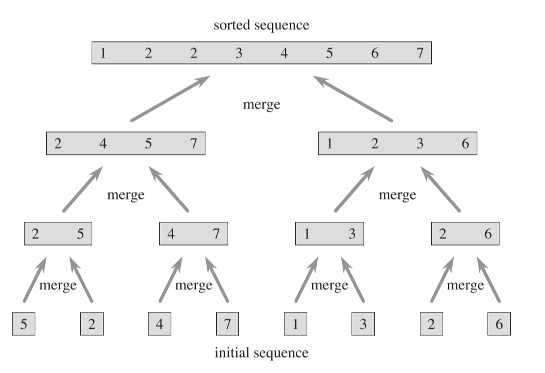



《算法导论》中第一章与第二章阅读笔记。

介绍了插入排序即归并排序的算法及复杂度。



<!--more-->

## Chapter 1. The Role of Algorithms in Computing

### Algorithms

1. 算法是一系列将输入转换为输出的操作步骤。
2. 数据结构是存储和管理数据的一种方式，这种方式要考虑到方便设备访问和修改数据。
3. 这本书也介绍了一些设计和分析算法的技术。如设计算法时需要的分治法，动态规划和如何分析算法是否准确是否高效等。
4. 算法在大多数情况下是找寻高效的方法，但在某些问题无法找到高效的解决方法，如NP问题。目前无人知道对于NP究竟是否存在一个高效的方法，而且NP问题有个特性，一旦找到了一个NP问题的高效解决方案，剩下的也就同样找到了。
5. 现代芯片的设计已经从提高时钟频率到了提高并行效率，因为芯片的功率提升与时钟频率的提升是一个超线性关系，如果一味的增高频率，很可能芯片就会过热。为了提升计算效率，现在考虑的就是使用多核芯片进行并行运算，书中也会引入一些多线程的算法。

### Algorithms as a technology

不同的算法一般有不同的效率，如插入排序和合并排序，插入排序的效率为$C_1 n^2$,而合并排序的效率为$C_2 n \log n$，虽然$C_1<C_2$，但是在n较大的情况下，$\log ⁡n$ 远小于$n^2$，所以对于大数据来说合并排序更为高效。

## Chapter 2. Getting Started

### Insertion Sort

1. 插入排序，在对数量较小的元素排序时是一个很高效的算法。

2. 插入排序类似于打牌整理手牌的过程，下为图解
    
    
    1) 首先将数组的某一项作为Key值，然后Key值从右至左的与每一项比较，如果该项的数值比Key值大，则将该值像右侧拷贝 A[i+1]=A[i] ，这相当于牌向右移的过程。

    2) 如果某一项比Key值小，则将Key值插入在他后方，A[i+1]=key

    3) 从数组的第二项开始从左至右的作为Key值，重复a,b的操作

3. 伪代码实现

    ```pseudocode
    for j=2 to A.length
	    key=A[j]
	    i=j-1
	    while i>0 && A[i]>key
		    A[i+1]=A[i]
		    i--;
        A[i+1]=key
    ```

4. C++实现

    ```c++
    void InsertationSort(int* array, int arraySize)
    {
	    for (int i = 1; i < arraySize; i++)
	    {
		    int key = array[i];
		    int startIndex = i - 1;
		    while (startIndex >= 0 && array[startIndex] > key)
		    {
			    array[startIndex + 1] = array[startIndex];
			    startIndex--;
		    }
		    array[++startIndex] = key;
	    }
    }
    ```

5. 一些书中伪代码需要注意的点

    1) for循环的变量，在退出循环后，保持最后一个超越循环边界的值
    
       如 for j=2 to A.length，在退出循环后，j = A.length +1

    2) A[ 1…..j] 表示A[1]、A[2]…A[j]

    3) 函数的形参是值传递的


### Analyzing algorithms

1. 分析算法主要是预测算法需要花费的资源，资源通常包括内存、带宽、但我们最关心的还是时间。

2. 书中的分析都是基于单核的随机访问机器(random-access machine)。在这个模型中，所有的操作都看作花费一个固定时长，而且我们不考虑内存操作（如分配内存）所占用的时间。

#### Analysis of insertion sort

1. 通常描述一个算法的运行时间都是一个关于输入数据大小的函数。

    1) 关于输入数据大小的定义根据问题的不同会发生改变。
   
        a. 对于排序问题，数据的大小通常就是需要排列的数的大小

        b. 对于两个整数相乘问题，数据大小就是这两个整数需要占据的bit数

        c. 有些时候还需要两个数字来描述问题，如关于图的问题就需要顶点数和边数。

    2) 关于算法的运行时间通常是关于算法究竟有多少步骤需要执行。在RAM模型中，我们简化每一步所花费的时间都是同样长且都为一个固定值。

    3) 循环语句本身比循环体要多一次执行，因为循环语句本身在越界的时候仍然会进行一次判断。
   
2. 插入算法时间复杂度分析

    | 插入排序步骤                        | 时间花费 | 运行次数              | 说明                                                                                                                                 |
    | ----------------------------------- | -------- | --------------------- | ------------------------------------------------------------------------------------------------------------------------------------ |
    | for j=2 to A.length                 | $c_1$    | $n$                   | 将A.Length看作n，因为循环语句本身多执行一次，所以总运行次数为$n$                                                                     |
    | &emsp;&emsp;key=A[j]                | $c_2$    | $n-1$                 | 2->n，运行$n-1$次                                                                                                                    |
    | &emsp;&emsp;i=j-1                   | $c_3$    | $n-1$                 | 2->n，运行$n-1$次                                                                                                                    |
    | &emsp;&emsp;while i>0 && A[i]>key   | $c_4$    | $\sum_{j=2}^nt_j$     | 因为运行次数收到while判断影响，所以不定为$t_j$<br>最好情况下直接满足，只需要判断一次，$t_j=1$<br>最坏情况运行到i=0，运行j次，$t_j=j$ |
    | &emsp;&emsp;&emsp;&emsp;A[i+1]=A[i] | $c_5$    | $\sum_{j=2}^n(t_j-1)$ | 比循环判断少运行一次，运行次数为$t_j-1$                                                                                              |
    | &emsp;&emsp;&emsp;&emsp;i--;        | $c_6$    | $\sum_{j=2}^n(t_j-1)$ | 比循环判断少运行一次,运行次数为$t_j-1$                                                                                               |
    | &emsp;&emsp;A[i+1]=key              | $c_7$    | $n-1$                 | 2->n，运行$n-1$次                                                                                                                    |

如表中所示，在最好情况下，$t_j=1$，最坏情况下运行$j$次。通常计算算法的复杂度，我们只考虑算法的最坏情况，因为往往在实际运算中，最坏情况就是最多的情况（如搜索算法，常常搜索的内容不在列表中，那就要搜索整个列表，即最坏情况）。而且纵使我们取平均值，在本例中，我们取运行次数为$j/2$，最终代入式子中计算，结果的最高次幂并不会改变。

我们以最坏情况计算整个表达式的时间

$$
T(n)=c_1n+c_2(n-1)+c_3(n-1)+c_4\sum_{j=2}^nj+c_5\sum_{j=2}^n(j-1)\\\\+c_6\sum_{j=2}^n(j-1)+c_7(n-1)
$$
又有

$$
\sum_{j=2}^nj=\frac{(2+n)(n-1)}{2}=\frac{n(n+1)}{2}-1 \\\\
\sum_{j=2}^nj-1=\frac{(1+n-1)(n-1)}{2}=\frac{n(n-1)}{2}
$$
代入上式得

$$
T(n)=c_1n+c_2(n-1)+c_3(n-1)+c_4\frac{n(n+1)}{2}-c_4+\\\\
c_5\frac{n(n-1)}{2}+c_6\frac{n(n-1)}{2}+c_7(n-1)
\\\\
=\frac{c_4+c_5+c_6}{2}n^2+(c_1+c_2+c_3+\frac{c_4}{2}
-\frac{c_5}{2}-\frac{c_6}{2}+c_7)n-(c_2+c_3+c_4+c_7)\\\\
=an^2+bn+c
$$

所以最坏的运行时间可以表达为$an^2+bn+c$，这是个二次幂方程.

#### Order of growth

一个函数的增长极受最高次幂的影响最大，所以我我们也只关注运算时间的最高次幂，在上例中即为$n_2$。我们将最坏情况运行时间成为$\Theta(n_2)$

### Designing algorithms

这节中简略介绍了分治法（divide-and-conquer），分治法的一大好处是运算时间比较好估计。

#### The divide-and-conquer approach

1. 许多算法都使用了递归，递归算法就是典型的分治法。将一个大问题分解为几个类似的小问题，然后递归的解决各个小问题，然后把结果合并在一起就得到了最终的答案。

2. 分治法的解决分为三个步骤：
   1) 分解：将大问题分解为几个小问题
   2) 解决：迭代解决小问题
   3) 合并：将小问题的答案结合成为原始问题的答案。

3. 归并排序（Merge sort algorithms）就是一个典型的分治法算法。排序算法的思想是将需要排序的数组二分，先对左半部分进行排序，再对右半部分进行排序，最有把左右半部分合并在一起获得完整的排序好的数组。

4. 归并排序算法的伪代码

    ```psuedocode
    Merge-sort(A,p,r)

    //A->需要排序的数组，p->需要排序部分的左起点，r->需要排序部分的右终点

    如果出现了p=r，说明被拆分出的子数组只有一个元素，则不需要计算。只计算p < r的情况

    if p < r 
        q = [(p+r)/2] //除不尽的话向下取整

        //将需要排序的部分等分为两部分，各自进行排序

        Merge-sort(A,p,q)
        Merge-sort(A,q+1,r)
        Merge(A,p,q,r)

    ```

    下图为归并排序图解，先将序列逐渐二分直到最后成为单个元素（单个元素不需要合并），然后再进行合并操作。

    


5. 归并排序中，最重要的就是最终合并的部分。在之前合并函数前，我们假定两个需要被合并的数组已经排序完毕。合并部分的伪代码如下

    ```pseudocode
    Merge(A,p,q,r)

    // A-> 需要排序的数组
    //p,q,r->数组中的Index，p<q<r，A[p,q]表示一个子数组（下称为左半部分），A[q+1,r]表示另一个子数组（下称为右半部分），左右部分都已经排序完毕。

    n1=q-p+1 //左半部分长度
    n2=r-q //右半部分长度

    Make L[1...n1+1],R[1...n2+1] //创建两个新的数组，长度与左右部分长度+1，防止之后遍历时越界。

    for i=1 to n1
        L[i]=A[p+i-1] //将左半部分内容对应拷贝到新建立的左数组中

    for j-1 to n2
        R[i]=A[q+j]  //将右半部分内容对应拷贝到新建立的右数组中

    //将左右数组的最后一个数值都设为无限大，如果遍历时达到了最后一个数值，说明这个数组已经完全装填回了原数组。因为最后的数值为无限大，所以另一个数组的数值始终小于等于这个数值，因此会一直装填另一个数组。

    L[n1+1]=Max 
    R[n2+1]=Max

    i,j=1

    for k=p to r
        if(L[i]<= R[j]>)
            A[k]=L[i]
            i++
        else
            A[k]=R[j]
            j++
    ```

    合并部分算法的图解

    

6. C++实现

    ```c++
    void MergeSort(int* array, int leftStartIndex, int rightEndIndex)
    {
        if (leftStartIndex == rightEndIndex)
            return;

        int centerIndex = (leftStartIndex + rightEndIndex) / 2;
        MergeSort(array, leftStartIndex, centerIndex);
        MergeSort(array, centerIndex + 1, rightEndIndex);
        Merge(array, leftStartIndex, centerIndex, rightEndIndex);

    }

    void Merge(int* array, int leftStartIndex, int middleIndex, int rightEndIndex)
    {
        int leftPartLength = middleIndex - leftStartIndex + 1;
        int rightPartLength = rightEndIndex - middleIndex;

        int* leftArray = new int[leftPartLength + 1];
        int* rightArray = new int[rightPartLength + 1];

        for (int i = 0; i < leftPartLength; i++)
            leftArray[i] = array[leftStartIndex + i];

        for (int i = 0; i < rightPartLength; i++)
            rightArray[i] = array[middleIndex + 1 + i];


        //Make the last index to be max
        leftArray[leftPartLength] = INT_MAX;
        rightArray[rightPartLength] = INT_MAX;

        int leftArrayIndex = 0, rightArrayIndex = 0;

        for (int i = leftStartIndex; i <= rightEndIndex; i++)
        {
            if (leftArray[leftArrayIndex] < rightArray[rightArrayIndex])
                array[i] = leftArray[leftArrayIndex++];
            else
                array[i] = rightArray[rightArrayIndex++];
        }

        delete[] leftArray;
        delete[] rightArray;
    }
    ```

#### Analyzing divide-and-conquer algorithms

当计算一个迭代问题的时间复杂度时，我们也常用迭代表达式来表示。

我们假定将原问题拆分为$a$个子问题，每个子问题有$\frac{1}{b}$个数据，那么所有这些子问题的花费时间为$aT(\frac{1}{b})$。并且拆分子问题需要$D(n)$的时间，合并子问题需要$C(n)$时间。另外我们需要考虑到如果子问题的输入数据足够小，可能在固定时间内子问题就能解决，例如排序的子问题，如果子数组只有一个变量，那么直接返回即可（固定时间）。所以整体的时间花费为：

$$
T(n)=\begin{cases}
    \Theta(1) & \text{if } n \leq c\\\\
    aT(\frac{1}{b})+D(n)+C(n) & 其他情况条件
\end{cases}
$$

#### Analysis of merge sort

这里着重讨论归并排序的时间复杂度。

**分解时间**：归并排序将数组分为两部分，这一操作只是单纯的二分，所以花费时间为固定值，即$D(n)=\Theta(1)$

**解决时间**：将数组平分为两个部分，所以每一份的数据为$n/2$且有两部分，所以子问题解决时间为$2T(\frac{n}{2})$

**合并时间**： 由合并算法的伪代码可知，整个计算过程只有单层循环，所以时间复杂度$C(n)=\Theta(n)$

综上，归并排序的时间复杂度为

$$
T(n)=\begin{cases}
    \Theta(1) & \text{if } n=1\\\\
    2T(\frac{n}{2})+\Theta(n) & \text{if } n\geq 1
\end{cases}
$$

目前$T(n)$的表达式是一个递归表达，我们需要根据这个解出$n\geq 1$情况下的$T(n)$单纯对于$n$的表达式。


我们将$T(n)$用树形结构表示，每个节点都代表一部分时间，所有节点的时间累计即为$T(n)$

例如式子$T(n)=2T(\frac{n}{2})+\Theta(n)$，使用树形结构表达即为从下图的(a)树转换为(b)树，(b)树中的每个节点即代表等式右边的每小部分。而$T(\frac{n}{2})$又可进一步表达为$2T(\frac{n}{4})+\Theta(\frac{n}{2})$，即为下图中(b)图的叶子进一步转换，变成(c)图的样子。


我们可以重复递归这样的操作，直到属性结构变成下图所示：


整棵树所有叶子所代表的时间总和即为$T(n)$，可以看到每一层叶子的总和都为$cn$。最下一层一共有$n$个节点，每个节点时间花费为$c$，即代表归并排序中分解子数组到数组的元素只有一个的情况，这时候直接返回（花费时间固定）。

现在问题的解决到了求树一共有多少层，我们知道最下面一层有$n$个元素，每层的数量都是2的次幂，且第一层为一个元素，所以我们设层数为$x$，计算表达式应该为：

$$
2^(x-1)=n \\\\
x=\lg n+1
$$

那么整棵树所有叶子的时间花费总和即为，每层的时间（$cn$）乘以层数($\lg n+1$)，即$T(n)=cn\lg n+cn$。

所以归并排序最差情况时间复杂度标识为$\Theta(n\lg n)$

* 书中的$\lg n$表示$\log_2n$，而非一般数学书中的$\log_{10}n$，因为计算机讨论的是二进制而非现实生活中常用的十进制。




引用：

1. *Introduction to Algorithms* 3rd Sep.2009



***