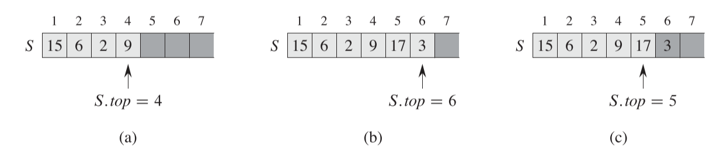
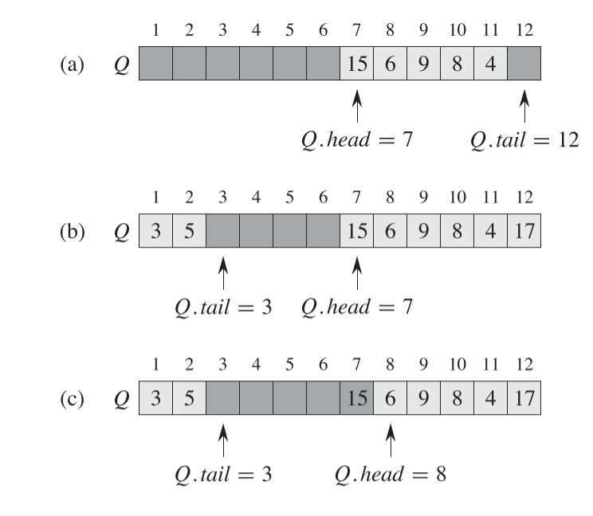
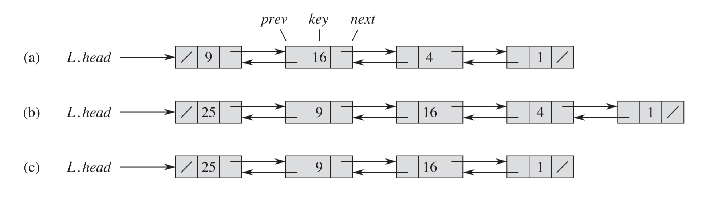
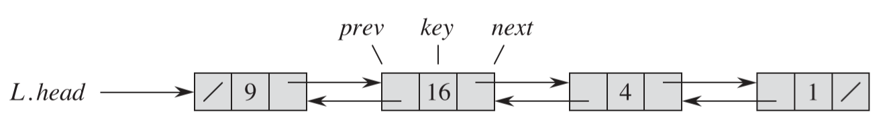
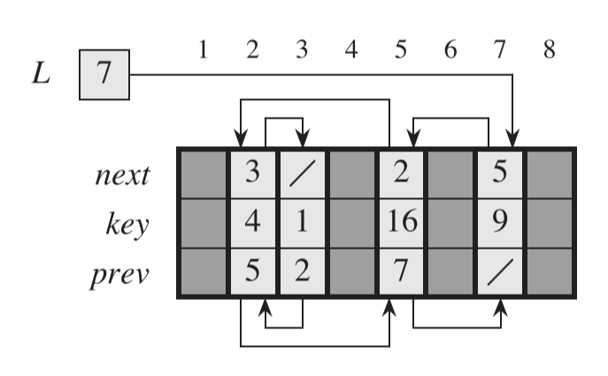
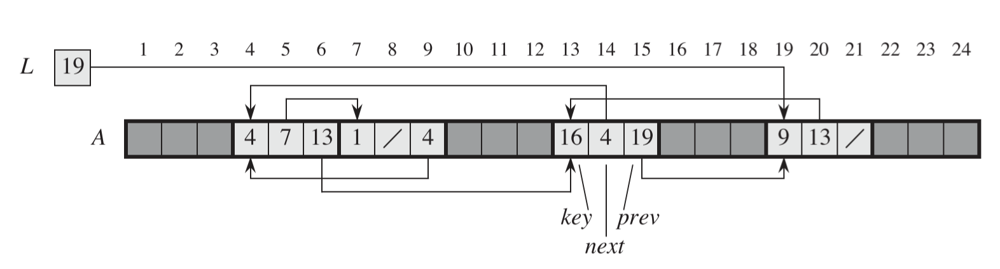
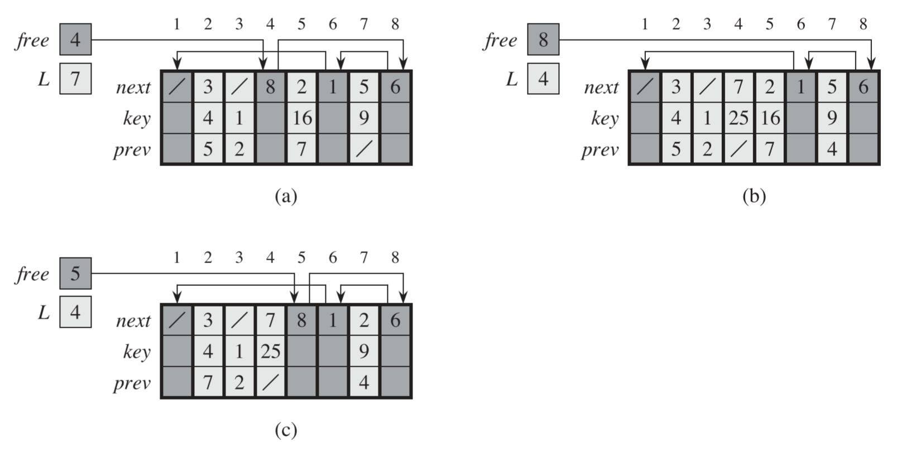
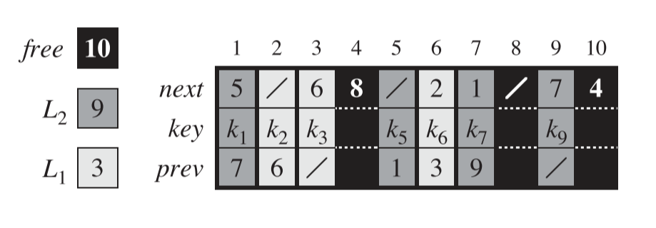
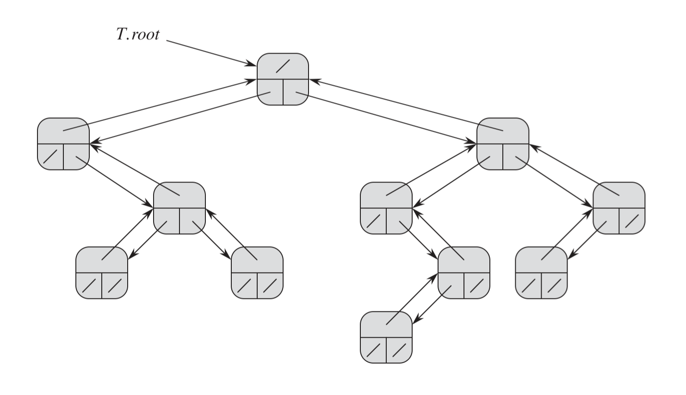
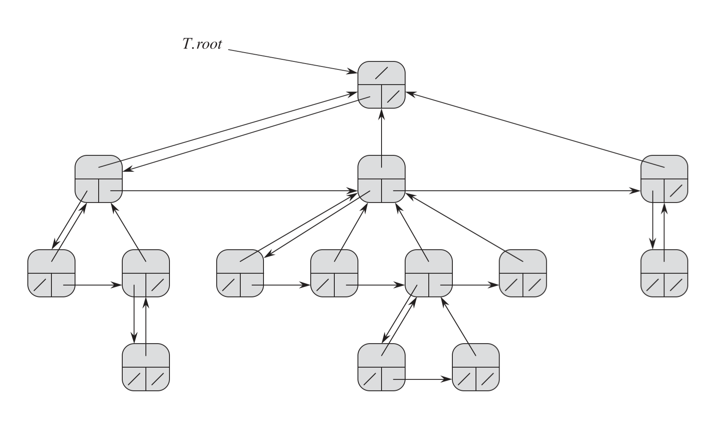



《算法导论》第十章笔记，包括栈，队列，链表的实现。



<!--more-->

## Chapter 10. Elementary Data Structures

集合`Set`作为计算机科学的基础，重要性与数学中的集合相同。但数学中的集合是不可变的，计算机中的集合可在任意时刻扩张，收缩和更改，称之为`动态集合（dynamic set）`。一般动态集合需要实现如下操作中的一部分：

`Search`，`Insert`，`DELETE`，`MINIMUM`，`MAXIMUM`，`SUCCESSOR`，`PREDECESSOR`

这些操作可以分为两种，`查询操作(Queries)`和`修改操作(Modifying operations)`，如`Search`，`MINIMUM`，`MAXIMUM`，`SUCCESSOR`，`PREDECESSOR`都属于前者，`Insert`，`DELETE`属于后者

### Stacks and queues

`堆栈(Stacks)`是后进先出，`队列(Queues)`是先进先出。

#### Stacks

在堆栈上的插入操作一般成为`Push`，删除操作一般称为`Pop`。堆栈有一个`top`指针指向队列中的第一个元素，在`Pop`时返回该元素，在`Push`时top指针向前移动一格，并在新的地方插入新值，当`top`为0则说明队列为空。

堆栈的图解如下图，(a)为原始样子，(b)为执行了`Push(17)和Push(3)`后的样子，(c)为执行了`Pop`后的样子。图中的`S.top`表示当前指针的索引值。



堆栈操作微数据实现，每个步骤的复杂度都为`O(1)`

```pseodocode
STACK_EMPTY(S):

if s.top==0;
    return true;
else
    return false;

Push(S,x):

S.top=S.top+1;
S[S.top]=x;

Pop(S):

if STACK_EMPTY(S)
    error"underflow"
else
    S.top=S.top-1;
    return S[S.top+1]
```

c++的数组实现，不支持运行时扩大队列大小。

```c++
class Stack
{
public:
	int data[MAX];
	~Stack() {}
	Stack() { top = -1; }

	bool push(int value)
	{
		if (top > (MAX - 1))
		{
			cout << "Stack Overflow"<<endl;
			return false;
		}

		data[++top] = value;
		return true;
	}


	int pop()
	{
		if (isEmpty())
		{
			cout << "Stack is empty"<<endl;
			return -1;
		}
		else
		{
			return data[top--];
		}
	}

	bool isEmpty()
	{
		return top < 0;
	}

private:
	int top;
};
```

#### Queues

队列的插入操作称为`ENQUEUE`，删除操作称为`DEQUEUE`。队列的图解如下图，队列存在一个`head`指针和一个`tail`指针，两指针间的数据为队列保存的数据。当进行插入操作时，`tail`指针前移并在新地方插入数据，当进行删除操作时，`head`指针返回指着的值，并前移。

图解如下图，使用一个大小为12的数组表示队列

(a) 为初始状态，索引7-11为原始数据

(b) 为执行了Enqueue(17),Enqueue(3),Enqueue(5)后的样子，每一步执行时tail指针先向前，再插入新值。当抵达数组边界时，返回数组的开头处继续执行插入操作

(c) 为执行了Dequeue（）操作的样子



队列伪代码如下

```pseodocode
ENQUEUE(Q,X):
Q[Q..tail] = x
if [Q.tail == Q.length]
	Q.tail = 1;
else
	Q.tail = Q.tail + 1

DEQUEUE(Q):

x=Q[Q.head]

if [Q.head == Q.length]
	Q.head = 1;
else
	Q.head = Q.head + 1
return x
```

c++的循环数组实现

当`top == head`时认为队列为空，当`(top+1) % size == head`时，认为队列已满。所以在队列插满的情况下永远会有一个空的值（因为top不等于head）

```c++
class Queue
{
public:
	Queue()
	{
		head = tail = 0;
	}
	~Queue()
	{
		head = tail = 0;
	}

	bool Enqueue(int value)
	{
		if ((tail + 1) % QUEUESIZE == 0)
		{
			cout << "Queue is full" << endl;
			return false;
		}

		data[tail] = value;

		tail = (tail == QUEUESIZE - 1) ? 0 : tail + 1;

		return true;
	}

	int Dequeue()
	{
		if (Empty())
		{
			cout << "Queue is empty" << endl;
			return -1;
		}

		int value = data[head];

		head = (head == QUEUESIZE - 1) ? 0 : head + 1;

		return value;
	}

	bool Empty()
	{
		return head == tail;
	}

private:
	int data[QUEUESIZE];
	int head;
	int tail;
};
```

### Linked lists

`链表(linked list)`是一种对象线性排列的数据结构。

对于`双向链表(Doubly linked list)`来说，每个结点都保留有三个对象，表示属性的`key`，以及两个指针`next`和`prev`。如果对于结点`x`来说,`x.prev==Null`，则说明`x`是头结点，如果`x.next==Null`，则说明`x`是尾结点。另外还有存有一个变量`head`来指向头结点，如果`head`为空，则说明列表为空。

对于`单链表（Singly linked list）`，删除`双向链表`中的`prev`对象即可。

对于`循环链表（Circular list）`，尾结点的`next`指向头结点，头结点的`prev`指向尾结点。

下图是`非循环双向链表`的图解

(a) 为存有数据{1,4,9,16}的列表

(b) 为插入了数据25之后的列表

(c) 为删除了数据4之后的列表



链表通常需要支持`Search`，`Insert`和`Delete`操作，三者的伪代码分别为

```pseudocode
SEARCH(L,k):

x=L.head
while x!=null and x.key!=k
	x=x.next
return x

INSERT(L,k):

x.next=L.head
if L.head!=null
	L.head.prev=x;
x.prev=null;
L.head=x;

DELETE(L,x)

if(x.prev!=Null)
	x.prev.next=x.next
else
	L.head=x.next

if x.next!=null
	x.next.prev=x.prev
```

`Search`的复杂度为$\Theta(n)$，`Insert`的复杂度为$O(1)$，`Delete`的复杂度本身为$O(1)$，但是通常删除操作前需要先找到该元素，所以整体复杂度为$\Theta(n)$

列表的C++实现如下

```c++
struct Node
{
	int value;
	Node* next;
	Node* prev;
};

class List
{
public:
	List()
	{
		head = nullptr;
	}
	~List()
	{

	}

	void Insert(int value)
	{
		Node* node = (Node*)malloc(sizeof(Node));
		node->value = value;

		node->next = head;
		node->prev = nullptr;
		if (head != nullptr)
			head->prev = node;

		head = node;
	}

	void Delete(int value)
	{
		Node* toDelete = Search(value);
		if (toDelete == nullptr)
			return;

		if (toDelete->prev != nullptr)
			toDelete->prev->next = toDelete->next;
		else
			head = toDelete->next;

		if (toDelete->next != nullptr)
			toDelete->next->prev = toDelete->prev;

		free(toDelete);
	}

	Node* Search(int value)
	{
		Node* begin = head;
		while (begin != nullptr && begin->next != nullptr && begin->value != value)
		{
			begin = begin->next;
		}

		if (begin->value == value)
		{
			cout << "Find the value " << value << endl;
			return begin;
		}
		else
		{
			return nullptr;
		}
	}

	void Print()
	{
		Node* begin = head;
		while (begin != nullptr)
		{
			cout << "List element value is " << begin->value << endl;
			begin = begin->next;
		}

		cout << "Print is over" << endl;
	}

private:
	Node* head;
};
```

#### Sentinels

可以使用一个哨兵结点来将列表变为循环列表，将哨兵结点命名为`nil`，`nil.next=head`且`nil.prev=tail`，这时候列表中就不需要存储`head`结点了，因为通过`nil`即可找到`head`。

使用了哨兵结点后，搜索，插入以及删除伪代码变为

```pseodocode
SEARCH(L,k):

x=L.nil.next
while x!=L.nil and x.key!=k
	x=x.next
return x

INSERT(L,k):

x.next=L.nil.next
x.prev=L.nil
L.nil.next.prev=x;
L.nil.next=x

DELETE(L,x)
x.next.prev=x.prev;
x.prev.next=x.next

```

哨兵循环双链表的C++实现为

```c++
struct Node
{
	int value;
	Node* next;
	Node* prev;
};

class List_Sentinels
{
public:
	List_Sentinels()
	{
		sentials = (Node*)malloc(sizeof(Node));
		sentials->next = sentials;
		sentials->prev = sentials;
	}
	~List_Sentinels()
	{
		free(sentials);
	}

	void Insert(int value)
	{
		Node* node = (Node*)malloc(sizeof(Node));
		node->value = value;

		node->next = sentials->next;
		node->prev = sentials;
		sentials->next->prev = node;
		sentials->next = node;
	}

	void Delete(int value)
	{
		Node* toDelete = Search(value);

		if (toDelete == nullptr)
		{
			cout << "return for value == null" << endl;
			return;
		}

		toDelete->prev->next = toDelete->next;
		toDelete->next->prev = toDelete->prev;

		free(toDelete);
	}

	Node* Search(int value)
	{
		Node* node = sentials->next;
		while (node->value != value && node->next != sentials)
		{
			node = node->next;
		}

		return node->value == value ? node : nullptr;
	}

	void Print()
	{
		Node* node = sentials->next;
		while (node != sentials)
		{
			cout << "value is " << node->value << endl;
			node = node->next;
		}
	}

private:
	Node* sentials;
};
```

### Implementing pointers and objects

在上一节的实现线性列表的过程中，需要用到指针来表示上一个结点或下一个结点。但在某些语言中，并没有提供指针的概念，如C#和Java，这一节介绍了在这些语言中如何来实现列表。

#### A multiple-array representation of objects

第一种方法是使用三个大小相同的数组来分别表示`next`，`key`和`prev`，如下两图实际上是实现了同一种结构。




图二是将三个数组并排显示的效果，另外有一个变量`L`来保存列表的第一个结点的索引值，在这里第一个结点的`Key`值为9，索引值为7，所以`L`中保存的值为7。

以索引值为7为例，`key`值为9,`next`值为5,`prev`值为/。表示这个结点没有前一个结点，即为头结点，且后一个结点的索引值为5，数组索引值为5的地方，`key`值为16,`next`为2，`prev`为7。以此类推,可得到所有的结点。

#### A single-array representation of objects

第二种方法是只用一个数组来表示`next`，`key`和`prev`。每一个结点占数组中的三个位置，如一个结点的Key值在数组中的位置`A[i]`，则`next`位置为`A[i+1]`,`prev`位置为`A[i+2]`





同理，这里仍然需要一个变量`L`来保存头结点的索引，这里的头结点索引为19，所有头结点的`Key`值为9，`next`结点为13，表示下一个结点的从索引值13开始，`prev`结点为/，表示没有前结点，该结点为头结点。

#### Allocating and freeing objects

这里以多数组表示法进行说明。为了可以释放和分配结点，我们需要另一个变量`free`来记录数组的哪个索引值为空结点。我们可以将多个空结点们看作也是一个链表，但是只是一个单链表，只需要知道下一个空结点在哪即可，所以在多数组方法中也仅只需要用到`next`数组即可。

分配和释放对象的过程如下图所示：




下图中的图(a)即为用多数组方式表示上图的数据，唯一与之前说明不同的是，这里需要一个变量`free`来表示第一个空结点在哪，这里显示第一个空结点的索引值为4，而在`next`数组的索引4处，值为8，说明下一个空结点在索引8的地方。

图(b)是插入了一个`key`值为25的结点。因为之前第一个空结点的位置在索引值为`4`的地方，所以这个结点现在插入在索引为4的地方。此时行结点成为了头结点，所以变量`L`值变为4,也因为索引4的地方有了值，所以第一个空结点变成之前的第一个空结点中保存的索引值的地方，即索引值为8的地方，因此`free`变量变为8.

图(c)是删除了`key`值为16的结点，该结点在索引值为5的地方。删除后，将他作为空结点插入空结点链表，即第一个空结点为索引值为5的地方，所以变量`free`值为5。且第一个空结点的`next`需要指向下一个空姐点，即索引值为8的地方。

多数组方法中，分配和删除的伪代码如下

```pseudocodeee
ALLOCATE-OBJECT()

if free == NULL
	error "out of free"
else 
	x=free;
	free=x.next
	return x

FREE-OBJECT()

x.next=free;
free=x;

```

这两步操作的复杂度都为`O(1)`

另外多个链表可以共用同三个数组，且共用一个free链表，如下图所示。存在两个链表，分别以$L_2$和$L_1$作为头结点。




### Representing rooted trees

可以用表示链表的方法可以用在其他的类似的数据结构中，这一节将用列表的方法来表示有根树形结构。树的每一个结点都作为对象，如链表一样，结点中也有一个类似与`Key`值的存在，不同的是根据树的类型不同，结点中的指针会有不同的表示。

#### Binary Tree

在二叉树中，每个结点都有三个变量$p$，$left$和$right$，分别表示结点的父结点，左子结点和右子结点。如没有左子结点，则`left=null`，右子结点同理。

二叉树实例图如下：




#### Rooted trees with unbounded branching

对于分支没有限制的有根树，可以使用变量$child_1$，$child_2$，$child_3$....来替代$left$和$right$。

但是这种方法存在一个弊端，首先如果子结点的个数没有限制，那我们无法预先直到该为每个结点分配多少的子结点。其次如果我们用一个非常大的数值来作为子结点的个数，在多数结点的子结点个数都小于这个设定数值时，就会造成很严重的内存浪费。

但是可以通过`左孩子和右兄弟表示法(left-child,right-sibling representation)`来解决这种情况，`x.left-child`表示所有子结点中，最靠左的那一个，`x.right-sibling`表示同级的结点中，最靠近`x`结点右边的那一个。

分支无限制有根树实例图如下






引用：

1. *Introduction to Algorithms* 3rd Sep.2009



***