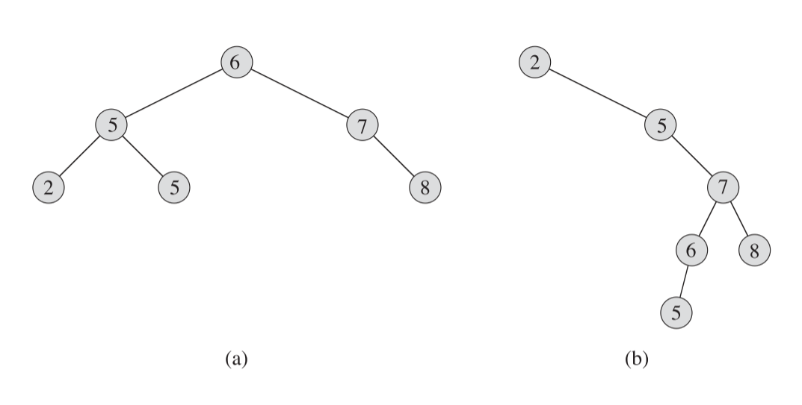
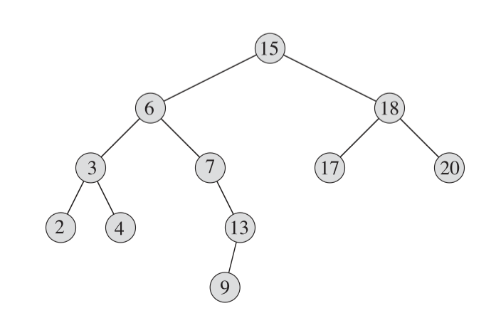
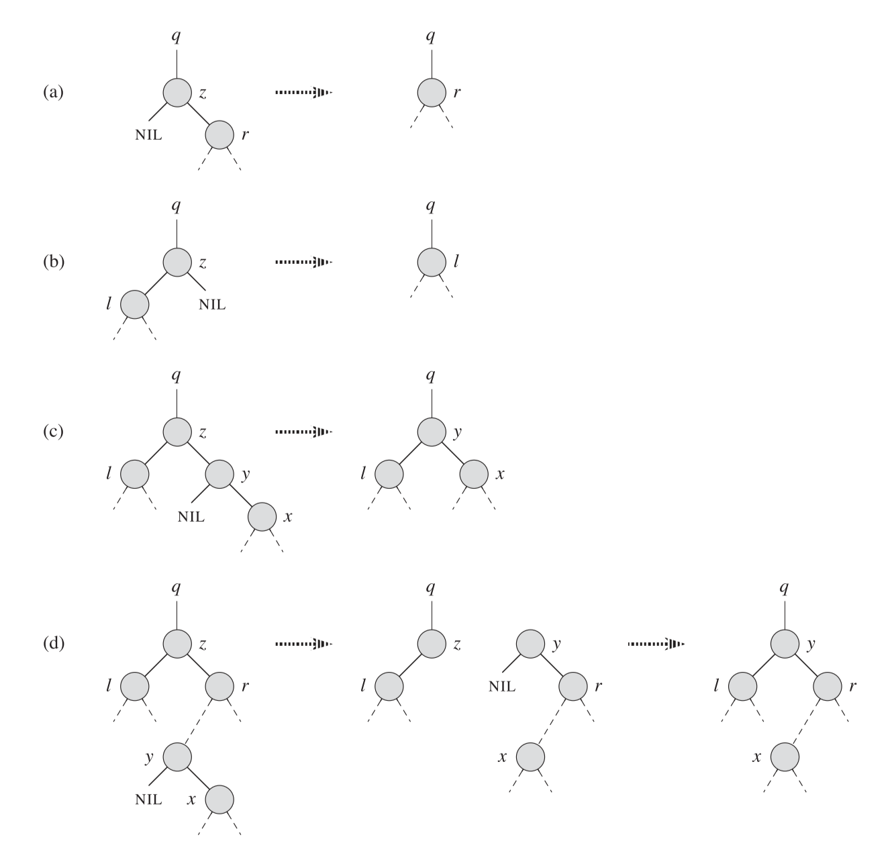



《算法导论》 第十二章笔记，线性二叉树的实现。

12.4节尚未整理



<!--more-->

## Chapter 12. Binary Search Trees

`搜索树(Search tree)`结构支持许多动态数组的操作，包括SEARCH，MINIMUM，MAXIMUM，PREDESCESSOR，SUCESSOR，INSERT和DELETE。

对于一个有$n$个结点的完全二叉树，这些操作在最坏情况下的时间复杂度应该为$\Theta(n)$，而如果是一个随机建立的二叉树，复杂度应该为$\Theta(\lg n)$

### What is a binary search tree?

二叉搜索树的每一个结点（下使用`x`来表示）都包含一个$key$值以及三个指针$p$、$left$和$right$分别表示结点的父结点，左子结点和右子结点。

对于一个二叉搜索树而言，一个结点的所有左子结点一定小于等于该结点值，结点的所有右子结点一定大于等于该结点值。

大部分搜索树的操作都与树的高度有关，下图是两个搜索二叉树的情况：



可以看到两个树都有8个结点，但(a)中的树较为平衡，树的深度较低，(b)树则很不平衡都集中在了右树上，树的深度较深。

二叉搜索树可以通过简单的递归按顺序打印出所有结点的数值，称为`中序树遍历(inorder tree walk)`，这个方法是先打印左树的值，再打印中间结点的值，最后打印右树的值。同理，还有`前序树遍历(preorder tree walk)`和`后序树遍历(postorder tree walk)`。

中序树遍历的伪代码如下

```pseudocode
INORDER-TREE-WALK(x)

if x!=NULL
	INORDER-TREE-WALK(x.left)
	print x.key
	INORDER-TREE-WALK(x.right)
```

中序树遍历的时间复杂度为$\Theta(n)$。

证明如下：首先因为中序遍历需要访问所有n个结点，所以时间复杂度最少为$\Omega(n)$，所以只要证明时间复杂度为$T(n)=O(n)$即能满足情况。

在空树的情况下，因为需要判断`x!=null`，所以也是存在一些时间花费的，以$T(0)=c$来表示。设左树有$k$个结点，则右树有$n-k-1$个结点，那么遍历时间可表达为$T(n)\leq T(k) + T(n-k+1) +d$。这个$d$表示是一个常数，用来控制右式为遍历时间的上限。

后面我们可以通过`4.3`节中的替代法来证明，为了证明$T(n)=O(n)$，假设$T(n)\leq (c+d)n+c$。对于$n=0$,$(c+d)0+c=c=T(n)$，满足情况，对于$n>0$来说

$$
T(n)\leq T(k) + T(n-k+1) +d \\\\
=( (c+d)k + c ) + ( (c+d)(n-k-1) +c ) +d \\\\
=c + (c+d)n  -(c+d) +c +d\\\\
=(c+d)n +c
$$

满足猜测，所以证明得$T(n)=O(n)$。因此结合$T(n)=\Omega(n)$可得$T(n)=\Theta(n)$

### Querying a binary search tree

二叉树的一系列操作，如`MINIMUM`，`MAXIMUM`,`SUCCESSOR`,`PREDECESSOR`的时间复杂度都与树的高度有关，对一个高度为$h$的数，这些操作的复杂度为$O(h)$

#### Searching

根据二叉搜索树的特性，我们只要判断目标值是否与当前值相同，如果相同则返回当前节点，如果小于则在当前节点的左树搜索，否则在右树搜索

搜索递归伪代码

```pseudocode
TREE-SEARCH(x,k)

if x==NULL or k==x.key
    return x

if k < x.key
    return TREE-SEARCH(x.left,k)

return TREE-SEARCH(x.right,k)
```

这个递归代码也可以通过循环方式来写，通常来说通过循环迭代方法实现的效率更高，因为少了函数的压栈与出栈操作。

```pseudocode

TREE-SEARCH(x,k)

while(x != NULl and k != x.key)
{
    if k < x.key
        x = x.left
    else
        x= x.right
}

return x

```

两种方法的C++实现如下

```c++
TreeNode* BinarySearchTree::Search(TreeNode* rootNode, int value)
{
	if (rootNode == nullptr || rootNode->value == value)
		return rootNode;

	return value < rootNode->value ? Search(rootNode->leftChild, value) : Search(rootNode->rightChild, value);
}

TreeNode* BinarySearchTree::Search(TreeNode* rootNode, int value)
{
	while (rootNode != nullptr && rootNode->value != value)
	{
		if (value < rootNode->value)
			rootNode = rootNode->leftChild;
		else
			rootNode = rootNode->rightChild;
	}

	return rootNode;
}
```

#### Minimum and Maximum

最大最小值的获取很简单，找到最左的节点即为最小值，找到最右的节点即为最大值，伪代码如下

```pseudocode
TREE-MINIMUM(x)

while x.left != NULL
    x = x.left
return x


TREE-MAXIMUM(x)

while x.right !=NULL
    x = x.right
return x

```

c++ 实现如下

```c++
TreeNode* BinarySearchTree::Maximum(TreeNode* node)
{
	if (node == nullptr)
	{
		cout << "Tree is empty";
		return nullptr;
	}
	while (node->rightChild != nullptr)
	{
		node = node->rightChild;
	}

	return node;
}

TreeNode* BinarySearchTree::Minimum(TreeNode* node)
{
	if (node == nullptr)
	{
		cout << "Tree is empty";
		return nullptr;
	}
	while (node->leftChild != nullptr)
	{
		node = node->leftChild;
	}

	return node;
}
```

#### Successor and predecessor

`Successor`函数是找比当前结点值大的所有结点中，最小的一个
`Predecessor`函数值找比当前结点值小的所有结点中，最大的一个

`Successor`算法的思路是：

（1） 如果一个节点的右子树不为空，那么右子树中的最小值即为比当前结点值刚好大的节点。

（2） 如果右子树为空，则需要从父节点中找寻比自己刚好大的节点，使用x.p遍历逐渐向上寻找祖先节点，直到遇到第一个祖先结点让当前结点或当前节点的祖先是它的左子树，这个父结点就是刚好大的节点。如下图中，我们以结点13为例子，7是13的父节点，但13是是它的右子树，所以不满足。继续向上找到6结点，但结点7是结点6的右子树，所以仍然不满足。再向上找到结点15，结点6是他的左子树，所以满足条件。即15为节点13的Successoor。

`Predecessor`算法的思路可以看出是`Successor`的镜像，即

（1） 如果一个节点的左子树不为空，那么左子树中的最大值即为比当前结点值刚好小的节点。

（2） 如果左子树为空，则需要从父节点中找寻比自己刚好小的节点，使用x.p遍历逐渐向上寻找祖先节点，直到遇到第一个祖先结点让当前结点或当前节点的祖先是它的右子树，这个父结点就是刚好小的节点。



`Successor`和`Predecessor`伪代码

```pseudocode

TREE-SUCCESSOR(x)

if x.right != NULL
    return TREE-MINIMUM(x.right)

y = x.p

while( y != NULL && x == y.right )
    x = y;
    y = y.p;

return y;

TREE-PREDECESSOR(x)

if x.left != NULL
    return TREE-MAXIMUM(x.left)

y = x.p

while( y != NULL && x == y.left )
    x = y;
    y = y.p;

return y;

```

c++实现如下

```c++
BSTreeNode* BinarySearchTree::Successor(int value)
{
	BSTreeNode* node = Search(root, value);
	if (node == nullptr)
	{
		cout << "Can't find node with " << value << endl;
		return nullptr;
	}

	if (node->rightChild != nullptr)
		return Minimum(node->rightChild);

	BSTreeNode* nodeParent = node->parent;

	while (nodeParent != nullptr && node == nodeParent->rightChild)
	{
		node = nodeParent;
		nodeParent = node->parent;
	}

	return nodeParent;
}

BSTreeNode* BinarySearchTree::Predecessor(int value)
{
	BSTreeNode* node = Search(root, value);
	if (node == nullptr)
	{
		cout << "Can't find node with " << value << endl;
		return nullptr;
	}

	if (node->leftChild != nullptr)
		return Maximum(node->leftChild);

	BSTreeNode* nodeParent = node->parent;

	while (nodeParent != nullptr && node == nodeParent->leftChild)
	{
		node = nodeParent;
		nodeParent = node->parent;
	}

	return nodeParent;
}
```



可以看到，无论是Search,Minimum,Maximum,Successor,Predecessor，在最坏的情况下，都是遍历树的每一层，所以时间复杂度为$O(h)$



### Insertion and deletion

二叉搜索树的插入和删除操作都需要保证改变的结点不会影响二叉搜索树的特性。

#### Insertion

插入算法的思想是用一个变量（伪代码中是变量$x$）来找寻插入结点(伪代码中被插入结点为$z$)的位置，用另一个变量（伪代码中为$y$）来记录第一个变量的父节点。

```pseudocode
TREE-INSERT(T,z)

//T->被插入树，z->需要插入的结点

y = NULL
x = T.root
//出循环时，X为空，即为z将要插入的位置，y是x的父节点
while x != NULL 
    y = x
    if z.key < x.key
        x = x.left
    else
        x = x.right
z.p = y;
if (y == NULL)
    T.root = z;
else if ( z.key < y.key)
    y.left = z
else
    y.right = z
    
```

c++实现为：

```c++
void BinarySearchTree::Insert(int value)
{
	BSTreeNode* node = (BSTreeNode*)malloc(sizeof(BSTreeNode));
	node->value = value;
	node->leftChild = nullptr;
	node->rightChild = nullptr;

	BSTreeNode* target = root;
	BSTreeNode* targetParent = nullptr;

	while (target != nullptr)
	{
		targetParent = target;
		target = value < target->value ? target->leftChild : target->rightChild;
	}

	if (targetParent == nullptr)
	{
		root = node;
		return;
	}

	if (value < targetParent->value)
		targetParent->leftChild = node;
	else
		targetParent->rightChild = node;

	node->parent = targetParent;
}
```

插入算法需要从上到下遍历整棵树，所以时间复杂度为$O(h)$

#### Delete

删除操作相比插入操作更复杂一些，需要考虑三种情况。将需要删除的结点称为$z$

1. $z$没有子结点
   
   可直接删除

2. $z$只有一个子结点

    用存在的节点`替换`$z$

3. $z$有两个子结点

    找到$z$的`Successor`，这里称为$y$，然后需要再细分为两种情况讨论。
	
	注意这两种情况下$y$的左树不需要管，因为左树必然为空，否则`Successor`将出现在$y$的左树中。

    (1) $y$是$z$的右子节点
    
    用$y$替换$z$

    (2) $y$不是$z$的右子节点

    用$y$的右树替换$y$的位置。将$z$的右树作为$y$的右树，再用$y$替换$z$

* 因为$z$有两个子节点，所以`Successor`必然是$z$右子树中的最小值
  
删除的示意图如下，其中图(a)(b)表示$z$只有一个子结点的情况，(c)(d)表示存在两个子结点的情况，其中(c)表示$y$即为$z$的右子树，(d)表示$y$不是$z$的右子树。

* $z$没有子结点的情况，也可以用(a)(b)表示，即将存在的结点看作为空。



在实现DELETE算法前，需要先实现被反复用到的`替换`算法，伪代码如下

```pseudocode
//u为被替换节点，v为替换节点
TRANSPLANT(T,u,v)

if u.p == NULL //将v设为u的parnet的新子节点
    T.root = v;
else if u == u.p.left
    u.p.left = v
else
    u.p.right = v
if v != NULL //将v的parent设为u的parent
    v.p = u.p

```

c++实现如下

```c++
void BinarySearchTree::transplant(BSTreeNode* originNode, BSTreeNode* newNode)
{
	if (originNode->parent == nullptr)
		root = newNode;
	else if (originNode == originNode->parent->leftChild)
		originNode->parent->leftChild = newNode;
	else
		originNode->parent->rightChild = newNode;

	if (newNode != nullptr)
		newNode->parent = originNode->parent;
}
```

* 注意TRANSPART算法并没有处理u的子结点。替换后u的子节点处于没有追踪的状态

Delete算法的伪代码如下

```pseudocode
TREE-DELETE(T,z)

if z.left == NULL //只有一种节点的情况，用另一个节点替换z
    TRANSPLANT(T , z , z.right)
else if z.right == NULL //只有一种节点的情况，用另一个节点替换z
    TRANSPLANT(T , z , z.left)
else
    y = MINIMUM(y.right) //求得Successor
    if y.p != z // y不是z的右子树的情况，
        TRANSPLANT(T, y, y.right) //y的右子树替换y的位置
        y.right = z.right //z的右子树作为y的右子树
        y.right.p = y
    TRANSPLANT(T,z,y) //用y替换z
    y.left = z.left //TRANSPLANT算法并没有处理z的子树情况，所以这里需要处理
    y.left.p = y
```

c++代码实现如下

```c++
void BinarySearchTree::Delete(int value)
{
	BSTreeNode* toDeleteNode = Search(root, value);
	if (toDeleteNode == nullptr)
	{
		//cout << "There is no node with value " << value << endl;
		return;
	}

	if (toDeleteNode->leftChild == nullptr)
		transplant(toDeleteNode, toDeleteNode->rightChild);
	else if (toDeleteNode->rightChild == nullptr)
		transplant(toDeleteNode, toDeleteNode->leftChild);
	else
	{
		BSTreeNode* successorNode = Minimum(toDeleteNode->rightChild);

		if (successorNode->parent != toDeleteNode)
		{
			transplant(successorNode, successorNode->rightChild);
			//Handle toDeleteNode's right child
			//因为successorNode不是toDelete的子节点，所以toDeleteNode的右节点一定比他大，所以作为它的右子树。
			successorNode->rightChild = toDeleteNode->rightChild;
			toDeleteNode->rightChild->parent = successorNode;
		}

		transplant(toDeleteNode, successorNode);
		//Handle toDeleteNode's left child
		successorNode->leftChild = toDeleteNode->leftChild;
		toDeleteNode->leftChild->parent = successorNode;

		free(toDeleteNode);
	}

}
```

删除操作算法并不存在循环，所以大部分操作都是固定时间，除了用来找`Successor`的MINIMUM算法，因为MINIMUM算法的复杂度为$O(h)$，所以删除算法的复杂度也为$O(h)$

### Randomly built binary search trees

//TODO



引用：

1. *Introduction to Algorithms* 3rd Sep.2009



***