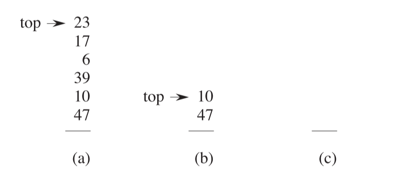
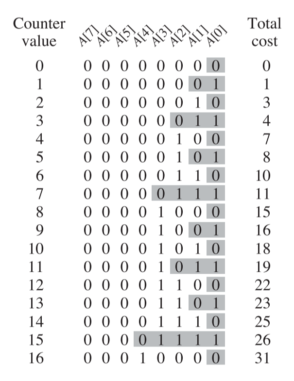



《算法导论》 第十七章笔记，关于平摊分析。

第17.4节尚未整理



<!--more-->

# Chapter 17 Amortized Analysis

平摊算法是计算一系列对数据结构的操作的平均时间，平摊算法分析保证了最坏情况下每个操作的平均性能。

这一节中会首先介绍三个平摊分析的方法：

17.1节介绍聚集分析，这个分析可以知道N个操作的累计花费时间的上限。

17.2节介绍记账方法，这个分析可以知道N个操作中，不同类型的操作的平均花费。

17.3节介绍势能方法，这个分许也可以知道N个操作中，不同类型的操作的平均花费。

势能方法与记账方法不同的是，记账操作是对每一个操作进行分析，如有的操作计算的时间比实际要花的时间更长，这些称之为预付，而有些操作计算的时间比实际时间更短，这些操作就是在使用之前的预付。而势能方法本质上也是预付和使用预付，但他的统计是针对于整个一系列操作，而不是针对每个操作，所以在势能方法中的预付是整体的。

## Aggregrate analysis

在聚集分析（Aggregrate analysis）中，对一系列（n个）操作在最坏情况下总共花费的时间称为$T(n)$，因此对每个操作的平摊花费（amortized cost）为$T(n)/n$。

### Stack operation

以栈操作为例，对于一个栈而言，Push和Pop的操作时间复杂度都是$O(1)$。定义一个新函数$Multipop(S,k)$，该操作会弹出栈上头K个元素，`S`为需要操作的堆栈，$K$为需要弹出的元素个数。如果栈上的元素数小于$k$，则该操作弹出所有的元素。

如下图所示：



MultiPop函数的伪代码如下：

```Pseudocode
MULTIPOP(S,k)
while not STACK_EMPTY(S) and k > 0
    POP(S)
    k = k-1
```

MultiPop函数的时间复杂度与它真正执行的Pop函数数量成线性关系。

如果对栈有n个操作。那么最差情况下，MultiPop的时间复杂度为$O(n)$，即前面所有的操作都是Push，最后调用Multipop时它需要弹出所有的操作。最差情况下n个操作的时间复杂度为$nO(n)=O(n^2)$。尽管$O(n^2)$的确是n个操作的时间上限，但这个上限并不是紧密的。

使用聚合分析可以得到一个更紧密的上限。实际上对于一个栈而言，如果有n个操作，那么pop的数量最多和push一样，即n个操作的时间复杂度总和为$O(n)$，因此每个操作的平摊花费为$O(n)/n$。在聚合分析分析中，不关心不同类型的操作，因此将每个操作的平摊花费定义为$O(n)/n$即$O(1)$。

### Incrementing a binary counter

这里举另外一个例子来讨论聚合分析。如使用一个二进制数的数组来做计数器，将数组命名为A，设数组中一共有k个元素，将A[0]定义为最低位，将A[k-1]定义为最高位。整个数组表示一个十进制数，则这个数的值为$x=\sum^{k-1}_{i=0}A[i]\dot{2^i}$。

Increment(A)的伪代码如下：

```pseudocode
i = 0;
while i < A.length and A[i] == 1
    A[i] = 0;
    i++
if i < A.length
    A[i] = 1
```

While循环中处理的是进位问题，从最低位开始，如果是1则将其变为0（进位），直到发现某一位是0（出循环）后加1。所以Increment函数的时间复杂度与翻转（1变0或0变1）的位数有关。

在最坏的情况下，加1前，数组中的每个元素都是1，因此所有的元素值都需要反转（1变0，这种情况下是超过了数组所能累加的上线）。这种情况下时间复杂度为$O(k)$。一系列有n个操作，所以总体时间复杂度为$O(nk)$。但这样分析出来的时间复杂度同样也是不紧密的。

下图，展示了累加时数组每一位的变化情况。



可以看到，A[0]每次操作都发生变化，A[1]每两次操作发生变化，A[2]每四次操作发生变化....A[i]每$2^i$次操作发生变化。所以对于n次操作而言，A[i]发生了$n/2^i$次变化。因此，从第0位到第k-1位，反转的总计为：

$$
\sum_{i=0}^{k-1}\lfloor \frac{n}{2^i} \rfloor \\\\
< n \sum_{i=0}^{\infty}\frac{1}{2^i} \\\\
=2n
$$

因此，整个操作的时间复杂度为$O(n)$，每个操作的平摊花费为$O(n)/n=O(1)$

## The accounting method

记账方法（Accounting method），对不同的操作计算不同的时间，这个时间称为平摊花费(amortized cost)。如果某一个操作，计算的时间大于其真实的运行时间，对于操作的对象，存放一个特殊的数据称为`credit`。

对于一系列n个操作，操作平摊花费的累加是要大于等于操作真实花费的累加，这样平摊花费的总和才能表示一系列操作的时间上限。

$$
\sum_{i=1}^{n}\hat{c_i}\geq\sum_{i=1}^{n} c_i
$$

所有操作的credit总和即为$\sum_{i=1}^{n} \hat{c_i} - \sum_{i=1}^{n} c_i$。为了保证平摊花费的总和代表上限，这个值必须是非负的。

### Stack Operations

| 操作     | 真实花费 | 平摊花费 |
| -------- | -------- | -------- |
| Push     | 1        | 2        |
| Pop      | 1        | 0        |
| MultiPop | min(k,s) | 0        |

其中$min(k,s)$中，$k$表示Multipop传入的$k$值，$s$表示目标数组的大小。

可以看到对于Push操作，平摊花费比真实花费要多1，这个1即使`credit`。即栈中的每个元素都有一个值为1的credit，之后的Pop操作和Multipop操作平摊花费都为0，相当于是使用一个`credit`。因为在Pop前都必须调用了相应数量的Push，所以总和的`credit`永远不会小于0

因此对于一系列n个操作而言，其总共的平摊花费也是$O(n)$。

### Incrementing a binary counter

如之前所述，Increment函数的时间复杂度与翻转（1变0或0变1）的位数有关。实际上无论是从0变成1，还是从1变成0，其真实花费都是1。但是在这里认为对从0变成1，平摊花费为2，对与从1变成0，平摊花费为0。因为如果进行从1变为0的操作，这一位在之前一定经历过从0变为1，所以总和的`credit`也永远不会小于0。

因此对于n个Increment操作，其总平摊花费为$O(n)$。

## The potential method

势能方法（potential method）中势能是对整个一系列操作而言的，即一些操作会增加整体势能，而一些操作会减少整体的势能。

我们假设数据$D_{i-1}$在进行了第$i$个操作后，变为了数据$D_{i}$，其中第$i$个操作的真实花费为$c_i$，数据$D_{i}$的势能为$\Phi(D_{i})$，数据$D_{i-1}$的势能为$\Phi(D_{i-1})$。定义第$i$个操作的平摊花费为

$$
\hat{c_i} = c_i + \Phi(D_{i})-\Phi(D_{i-1})
$$

即真实的操作花费加上势能的变化，这个变化可能是正数，也可能是负数。

那么对于一系列操作而言，其总体的平均花费为

$$
\sum_{i=0}^{n} \hat{c_i} \\\\
=\sum_{i=0}^{n}(c_i+\Phi(D_{i})-\Phi(D_{i-1})) \\\\
=\sum_{i=0}^{n}c_i + \Phi(D_{n}) - \Phi(D_{0})
$$

为了平均花费的总和是真实花费总和的上界限，必须保证$\Phi(D_{n})\geq \Phi(D_{0})$。在实际中，并不能知道$n$的值是多少，所以我们要保证$\Phi(D_{i})\geq \Phi(D_{0})$。

为了满足这个式子，经常在定义势能函数时保证，$\Phi(D_{0})=0$而且$\Phi(D_{i})\geq0$。

势能分析的关键在于定义势能的计算函数。

### Stack Operation

在栈操作中，定义势能函数为栈中元素的个数，则对于Push操作，操作后势能的变化为

$$
\Phi(D_{i})- \Phi(D_{i-1})\\\\
(s+1) -s \\\\
=1
$$

因此Push操作的平摊花费为

$$
\hat{c_i} = c_i + \Phi(D_{i})-\Phi(D_{i-1})\\\\
= 1 +1 \\\\
=2
$$

而对于Multipop函数而言，操作后的势能变化为

$$
\Phi(D_{i})- \Phi(D_{i-1})\\\\
=(s-k^{'}) -s \\\\
=-k^{'}
$$

其中$k^{'}$为$min(k,s)$。因此Multipop的平摊花费为

$$
\hat{c_i} = c_i + \Phi(D_{i})-\Phi(D_{i-1})\\\\
= k^{'} -k^{'} \\\\
=0
$$

同理可证明$\hat{c_i}=0$，因此三个操作的均摊时间复杂度都是$O(1)$，总体的均摊时间复杂度为$O(n)$。

### Incrementing a binary counter

这里，定义势能为操作后数组中值为1的元素数，表达为$b_i$。假设第$i$个操作，把$t_i$位从1变为0，其真实花费最多为$t_i+1$，即再加上一个退出循环后的从0到1的操作（也可能在退出循环后，已经大于了数组的边界，也就不会有从0到1的操作了）。

如果操作后$b_i$=0，说明上一个累加操作时超越了边界的，即操作前整个数组都是1，进行了$k$个从1到0，k为数组长度，即$b_{i-1}=t_i=k$。如果操作后$b_i>0$，则$b_i=b_{i-1}-t_i+1$，总之$b_i\leq b_{i-1}-t_i+1$。

因此势能的变化为:

$$
\Phi(D_{i})- \Phi(D_{i-1})\\\\
\leq (b_{i-1}-t_i+1) - b_{i-1}\\\\
=1-t_i
$$

平摊花费为

$$
\hat{c_i} = c_i + \Phi(D_{i})-\Phi(D_{i-1})\\\\
\leq t_i +1 +1 - t_i \\\\
=2
$$

如果计数器从0开始，即$\Phi(D_{0})=0$，且有$\Phi(D_{i})\geq 0$，因此一系列n个操作的总共平摊时间复杂度为$O(n)$。


如果计数器不是从0开始，一开始有$b_0$个1，最后有$b_n$个1，这两个数满足$0\leq b_0$和$b_n \leq k$。势能方法的表达式可变形为：

$$
\sum_{i=0}^{n}c_i \\\\
=\sum_{i=0}^{n}\hat{c_i}-\Phi(D_{n})+\Phi(D_{0})
$$

因为已经证明了$\hat{c_i} \leq 2$，所以可得

$$
\sum_{i=0}^{n}c_i
\leq 2n-b_n+b_o
$$


所以实际操作的总体花费复杂度为$O(n)$。



引用：

1. *Introduction to Algorithms* 3rd Sep.2009



***