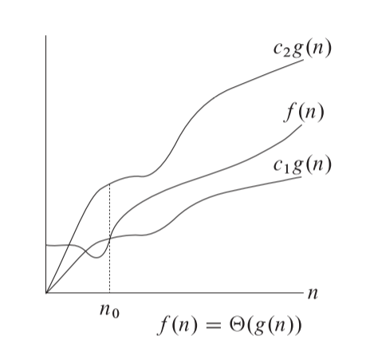
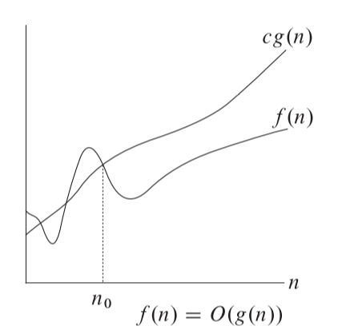
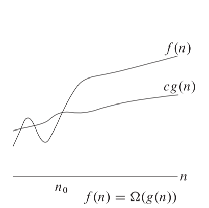



《算法导论》 第三章笔记，包括时间复杂度符号即一些基本的数学公式



<!--more-->

## Chapter 3. Growth of Functions

### Asymptotic notation

#### Asymptotic notation,functions,and running time

书中所有的渐进符号都是用来用来表达算法的运算时间的，虽然渐进符号也能用来表示算法的其他资源，如内存，硬盘空间等。

#### $\Theta$-notation

在第二章中，描述插入算法的最坏情况下$T(n)=\Theta(n^2)$，但没有详细解释$\Theta$含义，
这一节给出了定义。

对函数$f(n)$，如果存在常数$c_1$，$c_2$和$n_0$使得对于任意$n\geq n_0$，满足
$$
0\leq c_1g(n)\leq f(n) \leq c_2g(n)
$$

则称$f(n)=\Theta(g(n))$，$g(n)$称为$f(b)$的渐进紧确界，函数下图表示


注意$\Theta(g(n))$实际上是一系列函数的集合，所以严格意义上来说应该表达为$f(n)\in \Theta(g(n))$，但在书中为了表达方便，都写为$f(n)=\Theta(g(n))$



这里的所有函数都约定为非负的


数学证明如下：

如我们要证明函数$\frac{1}{2}n^2-3n=\Theta(n^2)$，那么按定义，应该证明

$$
0\leq c_1n^2\leq \frac{1}{2}n^2-3n \leq c_2n^2
$$

不等式各边都除去$n^2$，得到

$$
c_1 \leq \frac{1}{2}-\frac{3}{n} \leq c_2
$$

那么当$n$足够大时（大于$n_0$）,则逼近于$c_1 \leq \frac{1}{2}\leq c_2$，明显可以可以找到$c_1$和$c_2$满足该不等式是。这里的$c_1$和$c_2$取值可以有无数种组合。

#### $O$-notation

$O$标记表示渐进上边界，定义为对函数$f(n)$，如果存在常数$c$和$n_0$使得对于任意$n\geq n_0$，满足

$$
0\leq f(n) \leq cg(n)
$$

函数图如下：

因为$O$标记定义的表达式实际上是$\Theta$标记表达式的一部分，所以可以用同样的方法证明$O$标记的合理性。

要注意的是，按照定义，$O$标记仅仅是定义了上边界，而没有具体的确认这个边界与原函数需要多么的紧密。如$n=O(n^2)$仍然也是成立的，即使对于函数$f(n)=n$来说，紧密的上边界应该为$O(n)$。

也正是因为如此，对于算法来说，无论输入情况是什么样的，都可以用$O$标记来描述。以插入函数举例：我们针对插入函数的最差输入情况（每次插入的数都需要插入到已有列表的第一个），紧密上边界表达式为$O(n^2)$；对于最佳输入情况（每次插入的数都可直接插入已有列表的最后），紧密的上边界应该表达为$O(n)$，但是表达式$O(n^2)$按定义仍然是可以用来描述最好情况的。

而渐进紧确界$\Theta$则不满足上述情况，在插入算法中，最坏和最好情况下，表达式分别为$\Theta(n^2)$和$\Theta(n)$。这里不同的是$\Theta(n^2)$不能用于描述最好情况，因为你无法找到一个常量$c$，在$n$足够大的情况下，仍然满足$n^2<cn$。

#### $\Omega$-notation

$\Omega$标记提供了符号渐进下边界，定义为存在常数$c$和$n_0$使得对于任意$n\geq n_0$，满足

$$
0\leq cg(n)\leq f(n)
$$

函数图像如下：

$\Omega$标记的证明与$\Theta$类似，且与$O$一样都能描述算法的任何输入。只不过$\Omega$关注的是算法的最好情况，$O$关注的是算法的最差情况，所以通常我们对于$O$的使用较多。



定理3.1：
对任意两个函数$f(n)$和$g(n)$，当且仅当$f(n)=O(g(n)$和$f(n)=\Omega(g(n))$时，存在$f(n)=\Theta(g(n))$



#### Asymoptotic notation in equations and inequalities

在书中，有时会在表达式和不等式中用渐进表达式来省去一些不关注的细节，如表达式$2n^2+3n+1=2n^2+\Theta(n)$表示$2n^2+3n+1=2n^2+f(n)$，其中$f(n)\in \Theta(n)$

#### $o$-notation

如之前在$O$标记一节中描述的，$O$标记可以表示紧密上边界和非紧密上边界，如对于函数$2n^2$,$O(n^2)$即为紧密上边界，而$O(n^3)$则不是。

这里我们定义$o$标记来单独表示非紧密上边界：对于任意正常量$c$，都存在一个对应的常量$n_0$使得在$n\geq n_0$时满足

$$
0\leq f(n) < cg(n)
$$

则称$f(n)=o(g(n))$

$o$标记和$O$标记在定义上的区别在于，$O$是存在常量$c$和$n_0$使表达式成立即可，而$o$定义是对于任意常量$c$，都要存在$n_0$使得表达式成立(且表达式为<而非$\leq$)，例如$2n=o(n^2)$但$2n\neq o(n)$。如果后者成立，那么当$c$取2时，无论$n_0$取值为多少，都无法满足$f(n)<2n$。

关于$o$标记还有一个等效的定义表达式：因为是$o$标记非紧密的上边界，所以当$n$足够大，$g(n)$会远大于$f(n)$

$$
\lim_{n\rightarrow \infty}\frac{f(n)}{g(n)}=0
$$

#### $\omega$ -notation

$\omega$标记对于$\Omega$标记就如同$o$标记对于$O$标记。$\omega$标记的定义为，对于任意正常量$c$，都存在一个对应的常量$n_0$使得在$n\geq n_0$时满足

$$
0\leq cg(n) < f(n)  
$$

则称$f(n)=\omega(g(n))$。例如，$n^2/2=\omega(n)$但$n^2/2 \neq \omega(n^2)$。且同样存在另一个定义。

$$
\lim_{n\rightarrow \infty}\frac{f(n)}{g(n)}=\infty
$$

$o$标记和$\omega$标记的关系可以表达为：当且仅当$g(n)\in o(f(n))$时，$f(n)\in \omega(g(n))$

#### Comparing functions

渐进标记与数学中的不等式有点类似，同样都满足传递法，如a<b，b<c，则a<c。

$f(n)=O(g(n))$ 类似于 $a\leq b$

$f(n)=\Omega(g(n))$ 类似于 $a\geq b$

$f(n)=\Theta(g(n))$ 类似于 $a= b$

$f(n)=o(g(n))$ 类似于 $a < b$

$f(n)=\omega(g(n))$ 类似于 $a > b$

但与不等式不同的是，对于两个数字，关系要么满足大于等于，要么满足小于等于。但对于渐进标记，存在两个函数$f(n)$和$g(n)$，可能即不满足$f(n)=O(g(n))$，也不满足$f(n)=\Omega(g(n))$，如函数$n$与$n^{1+\sin n}$，因为$n^{1+\sin n}$的次幂始终在变化，在0-2之间摇摆。

### Standard notations and common functions

这一节主要是介绍一些数学内容，这里只列出关键的结论，定理和公式，并没有完整证明。

#### Floors and ceilings（向上取整与向下取整）

一些定理及公式

$$\lceil n/2 \rceil + \lfloor n/2 \rfloor = n$$

$$ \lceil \frac{\lceil x/a \rceil}{b} \rceil = \lceil \frac{x}{ab} \rceil$$ 

$$ \lfloor \frac{\lfloor x/a \rfloor}{b} \rfloor = \lfloor \frac{x}{ab} \rfloor$$ 

$$ \lceil \frac{a}{b} \rceil \leq \frac{a+(b-1)}{b} $$

$$ \lfloor \frac{a}{b} \rfloor \geq \frac{a-(b-1)}{b} $$

#### Modular arithmetic（求余）

$$ a mod n =a -n\lfloor a/n \rfloor$$

如果存在$(a mod n ) = (b mod n)$，可写作$a\equiv b \text { (mod n)}$

#### Polunomials(多项式)

对于某个常量$k$，如果有$f(n)=O(n^k)$则称函数$f(n)$是多项式有界的

#### Exponentials（指数）

$$(a^m)^n=a^{mn}$$

$$(a^m)+a^n=a^{m+n}$$

对所有实数有，
$$ e^x=\sum_{i=0}^{\infty}\frac{x^i}{i!} $$
$$ e^x\geq1+x$$
$$ e^x=\lim_{n\rightarrow \infty}(1+\frac{x}{n})^n$$

指数增长速度比多项式快得多，可表达为

$$ \lim_{n\rightarrow \infty}\frac{n^b}{a^n}=0$$

用渐进标记，则表达为

$$n^b=o(a^n)$$

#### Logarithms（对数）

$$ \lg ^kn=(\lg n)^k$$
$$ a=b^{\log_ba} $$
$$ \log_c(ab)=\log_ca+\log_cb$$
$$ \log_ba^n=n\log_ba$$
$$ \log_ba= \frac{\log_ca}{\log_cb} $$
$$ \log_b(1/a)=-\log_ba$$
$$ \log_ba=\frac{1}{\log_ab}$$
$$ a^{\log_bc}=c^{\log_ba}$$

如果满足$f(n)=O(\lg^kn)$，则称$f(n)$是多对数有界的。

多项式的增长速度比对数快得多，可以表达为

$$ \lim_{n\rightarrow \infty}\frac{\lg^bn}{n^a}=0$$

用渐进标记，则表达为

$$\lg^bn=o(n^a)$$

#### Factorials(阶乘)

$$n!\leq n^n \text{ 即 }n!=o(n^n)$$
$$ n!=\omega 2^n$$
$$ \lg(n^!)=\Theta(n\lg n)$$

#### Functional iteration (多重函数)

可看作是函数的递归嵌套，递归次数用括号包裹的次幂表示，如$f^{(i)}(n)$，表示递归$i$次

$$
f^{(i)}(n)=
\begin{cases}
    n & \text{if }i=0 \\\\
    f(f^{(i-1)}(n)) & \text{if } i >0
\end{cases}
$$

如函数$f(n)=2n$，$f^{(i)}(n)=2^in$

注意区分$\lg^in$与$\lg^{(i)}n$，前者是$\lg n$的$i$次幂，后者是对$n$连续使用$i$次对数函数。

#### The iterated logarithm function (多重对数函数)

使用$lg*n$表示多重对数函数，定义为

$$ \lg^*n=min\{i\geq 0:lg^{(i)}n\leq 1\} $$

意思是求得最小的可以满足$lg^{(i)}n\leq 1$的$i$是多少

如$lg^*16=3$、$lg^*65536=4$，因为

$$\log_216=4 \rightarrow \log_24=2 \rightarrow \log_22=1$$
$$\log_265536=16 \rightarrow \log_216=4 \rightarrow \log_24=2 \rightarrow \log_22=1$$

即分别需要三次和四次运算才能满足条件。

#### 斐波那契数列

斐波那契数列定义为：

$$F_0=0$$
$$F_1=1$$
$$F_i=F_{i-1}+F_{i-2} $$

还有一个定义

$$
F_i=\frac{\phi ^ i - \hat{\phi}^i}{\sqrt{5}}
$$

其中$\phi$和$\hat{\phi}$为方程$x^2=x+1$的两个解。

* 斐波那契数列以指数速率增长。



引用：

1. *Introduction to Algorithms* 3rd Sep.2009



***