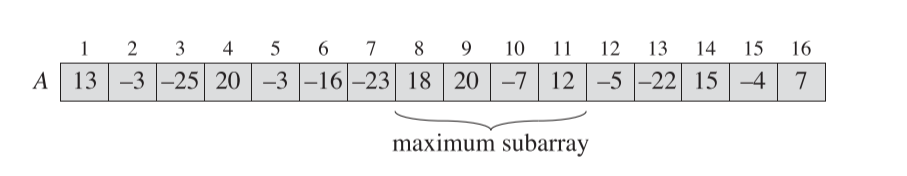
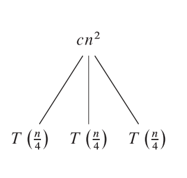
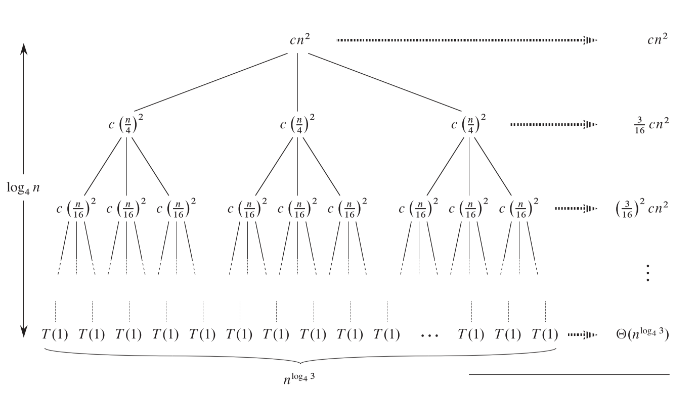



《算法导论》第四章笔记。包括分治法的介绍，最大子数组问题算法与分析，矩阵相乘问题问题算法与分析，代入法、递归树法、主方法求时间复杂度。
4.6节尚未整理。



<!--more-->

# Chapter 4. Divide-and-Conquer

在分析分治法的时候一般无视了许多细节，例如在分析归并排序时，如果考虑到$n$存在奇、偶情况，那么表达式应该写成

$$
T(n)=\begin{cases}
     \Theta(1) & \text{ if }  n=1
     \\\\
     T(\lceil n/2 \rceil)+T(\lfloor n/2 \rfloor)+\Theta(n) & \text{ if }  n>1
\end{cases}
$$

但在实际中，通常会无视向上取整，向下取整和一些边界条件，所以在归并排序分析时写成

$$T(n)=2T(n/2)+\Theta(n)$$

## The Maximum-subarray problem

从一个整数数组中找寻出值最大的子数组。如下图所示的数组中，$A[8..11]$即为最大数组，和为43



### A brute-force solution

暴力破解法：通过双重循环遍寻所有的子数组情况，找出最大的数组。通过上一个子数组的和加上当前元素即可求得当前子数组的和，所以计算子数组和的花费为$O(1)$，遍历所有子数组需要的时间花费为$O(n^2)$，所以总体算法时间为$O(n^2)$

暴力破解的代码实现如下：

```cpp
int FindMaximumSubarray_BruteForce(int* originArray, int arrayLength, int& leftIndex, int& rightIndex)
{
	int maxSum = -INT_MAX, sum = 0;
	leftIndex = rightIndex = 0;
	for (int i = 0; i < arrayLength; i++)
	{
		sum = 0;
		for (int j = i; j < arrayLength; ++j)
		{
			sum += originArray[j];
			if (sum > maxSum)
			{
				maxSum = sum;
				leftIndex = i;
				rightIndex = j;
			}
		}
	}
	return maxSum;
}
```

### A solution using divide-and-conquer

分治法求最大子数组问题的思路为，把原数组等分为两个部分，左半数组和右半数组。这时候求得的最大数组只可能是三种情况：完全在左半数组中，完全在右半数组中，处在左右半数组交界的地方。

所以分治法求最大子数组的伪代码如下，代码中依次求三种情况的最大子数组，然后比较求得原数组的最大子数组。（在求左右半边的最大子数组时使用了迭代）。

```pseudocode
FIND-MAXIMUM_SUBARRAY(A,low,high)
//A为原数组，low，high分别表示拆分出的左或右数组的左右Index

if high==low //只有一个元素时，即为最大子数组
    return [low,high,A[low]]
else 
    mid=[(low + high)/2]
    (left-low, left-high, left-sum)= FIND-MAXIMUM_SUBARRAY(A,low,mid)
    (right-low, right-high, right-sum)= FIND-MAXIMUM_SUBARRAY(A,mid+1,high)
    (cross-low, cross-high,cross-sum)=FIND-MAX-CROSSING-SUBARRAY(A,low,mid,high)

    if left-sum >=right-sum && left-sum>=cross-sum
        return [left-low,left-high,left-sum]
    else if right-sum>=left-sum && right-sum >= cross-sum
        return [right-low,right-high,right-sum]
    else
        return [cross-low,cross-high,cross-sum]
```

在求左右半边的最大子数组时使用了迭代，现在还要解决的就是求交叉最大子数组FIND-MAX-CROSSING-SUBARRAY函数的定义。

交叉最大子数组一定一部分处于左半数组，一部分处于右半。从Index mid处向左和向右各寻找最大的左部分，然后将左右部分结合便形成了最大的交叉子数组。

求交叉最大子数组伪代码如下：

```pseodocode
FIND-MAX-CROSSING-SUBARRAY(A,low,mid,high)

left-sum= -MAX
sum=0;

for i= mid downto low
    sum = sum + A[i]
    if sum > left-sum
        left-sum=sum;
        max-left-Index=i

right-sum= -MAX
sum=0;

for i= mid to high
    sum = sum + A[i]
    if sum > right-sum
        right-sum=sum;
        max-right-Index=i

return (max-left-index,max-right-index,left-sum + right-sum)

```

完整C++实现代码如下：

```c++
int FindMaximumSubarray_DivideAConquer(int* originArray, int leftIndex, int rightIndex, int& maxLeftIndex, int& maxRightIndex)
{
	if (leftIndex == rightIndex)
	{
		maxLeftIndex = maxRightIndex = leftIndex;
		return originArray[leftIndex];
	}

	int midIndex = (leftIndex + rightIndex) / 2;

	int sumLeft = 0, leftMaxLeftIndex = 0, leftMaxRightIndex = 0;
	sumLeft = FindMaximumSubarray_DivideAConquer(originArray, leftIndex, midIndex, leftMaxLeftIndex, leftMaxRightIndex);

	int sumRight = 0, rightMaxLeftIndex = 0, rightMaxRightIndex = 0;
	sumRight = FindMaximumSubarray_DivideAConquer(originArray, midIndex + 1, rightIndex, rightMaxLeftIndex, rightMaxRightIndex);

	int sumCross = 0, crossMaxLeftIndex = 0, crossMaxRightIndex = 0;
	sumCross = FindCrossingMaximumSubarray(originArray, leftIndex, midIndex, rightIndex, crossMaxLeftIndex, crossMaxRightIndex);

	if (sumLeft >= sumRight && sumLeft >= sumCross)
	{
		maxLeftIndex = leftMaxLeftIndex;
		maxRightIndex = leftMaxRightIndex;
		return sumLeft;
	}
	else if (sumRight >= sumLeft && sumRight >= sumCross)
	{
		maxLeftIndex = rightMaxLeftIndex;
		maxRightIndex = rightMaxRightIndex;
		return sumRight;
	}
	else
	{
		maxLeftIndex = crossMaxLeftIndex;
		maxRightIndex = crossMaxRightIndex;
		return sumCross;
	}
}

int FindCrossingMaximumSubarray(int* originArray, int leftIndex, int midIndex, int rightIndex, int& maxLeftIndex, int& maxRightIndex)
{
	int maxSumLeft = -INT_MAX;
	int sum = 0;
	for (int i = midIndex; i >= leftIndex; i--)
	{
		sum += originArray[i];
		if (sum > maxSumLeft)
		{
			maxLeftIndex = i;
			maxSumLeft = sum;
		}
	}

	int maxSumRight = -INT_MAX;
	sum = 0;

	for (int i = midIndex + 1; i <= rightIndex; i++)
	{
		sum += originArray[i];
		if (sum > maxSumRight)
		{
			maxRightIndex = i;
			maxSumRight = sum;
		}
	}

	return maxSumLeft + maxSumRight;
}
```

### Analyzing the divide-and-conquer algorithm

分治法求最大子数组的是将原问题拆分为三个部分，（1）求左半部分的最大子数组 （2）求右半部分的最大子数组（3）求交叉部分的最大子数组，所以我们可以将原问题的时间花费$T(n)$改写为

$$
T(n)=\Theta(1)+2T(n/2)+\Theta(n)+\Theta(1) \\\\
    =2T(n/2)+\Theta(n)
$$

其中两个$\Theta(1)$分别表示拆分问题和合并答案的时间，$\Theta(n)$表示求交叉最大子数组的时间。

这个表达式与归并排序的表达式相同，所以我们可以得出求最大子数组的分治法复杂度为$T(n)=\Theta(n\lg(n))$

## Strassen's algorithms for matrix multiplication

对于两个大小为$n\times n$的矩阵$A$和$B$，它们的乘积$C=A\cdot B$中的每个元素$c_{ij}, i,j = 1,2,\dotsc n$，可表示为：

$$
c_{ij}=\sum_{k=1}^{n}a_{ik}\cdot b_{kj}
$$

该方法用伪代码可表示为

```pseudocode
SQUARE-MATRIX-MULTIPLY(A,B)
n= A.rows
let C be a new n*n matrix
for i = 1 to n
	for j = 1 to n
		c_ij = 0
		for k = 1 to n
			c_ij=c_ij+a_ik*b_kj
return C
```

c++实现如下：

```cpp
Matrix MatrixMultiply(const Matrix& A, const Matrix& B)
{
	Matrix result(A.row, B.column);

	for (int i = 0; i < A.row; i++)
	{
		for (int j = 0; j < B.column; ++j)
		{
			for (int k = 0; k < A.column; k++)
			{
				result.data[i][j] = result.data[i][j] + A.data[i][k] * B.data[k][j];
			}
		}
	}
	return result;
}
```

* 伪代码实现假设相乘的两个矩阵大小都是$n\times n$，在c++实现中可以是任意满足矩阵相乘的条件的矩阵大小。

可以很容易的看出，`SQUARE-MATRIX-MULTIPLY`的复杂度为$O(n^3)$

### A simple dividea-and-conquer algorithm

可以用分治法来解决矩阵相乘问题，为了简化问题，假设两个相乘的矩阵大小都是$n\times n$，且$n$的值为某个2的次幂。

首先将两个相乘的矩阵都拆成四部分，即每部分的长度为$n/2$，可以将每部分都看作是一个简单元素，于是问题转换为了两个$2\times2$矩阵的运算（两个$2\times2$矩阵中的每个元素都是一个子矩阵）。对于其中子矩阵相乘的计算可使用相同策略，即再进一步拆分成四个更小的子矩阵。

数学说明如下，A和B为两个相乘的矩阵，C为结果矩阵：

$$
A=\begin{pmatrix}
	A_{11} & A_{12}\\\\
	A_{21} & A_{22}
\end{pmatrix}
$$
$$
B=\begin{pmatrix}
	B_{11} & B_{12}\\\\
	B_{21} & B_{22}
\end{pmatrix},
$$
$$
C=\begin{pmatrix}
	C_{11} & C_{12}\\\\
	C_{21} & C_{22}
\end{pmatrix}
$$
$$

C=A \cdot B =\begin{pmatrix}
	C_{11} & C_{12}\\\\
	C_{21} & C_{22}
\end{pmatrix}=\begin{pmatrix}
	A_{11} & A_{12}\\\\
	A_{21} & A_{22}
\end{pmatrix}\cdot \begin{pmatrix}
	B_{11} & B_{12}\\\\
	B_{21} & B_{22}
\end{pmatrix}
$$

C中的各子矩阵的计算可以看作是普通元素的计算，即满足：
$$
C_{11}=A_{11}\cdot B_{11} +A_{12} \cdot B_{21}\\\\
C_{12}=A_{11}\cdot B_{12} +A_{12} \cdot B_{22}\\\\
C_{21}=A_{21}\cdot B_{11} +A_{22} \cdot B_{21}\\\\
C_{22}=A_{21}\cdot B_{12} +A_{22} \cdot B_{22}\\\\
$$

可以看到，需要8个子矩阵的相乘，每个子矩阵的大小是$n/2$，即将问题拆分成了8个子问题。

分治计算矩阵相乘的伪代码如下：

```pseudocode
SQUARE-MATRIX-MULTIPLY-RECURSIVE(A,B)

n = a.rows;
let C be a new n*n matrix
if n == 1
	c_11=a_11 * b_11
else
	divide A,B,C into 4 submatrix
	C_11 = SQUARE-MATRIX-MULTIPLY-RECURSIVE(A_11,B_11)+
		SQUARE-MATRIX-MULTIPLY-RECURSIVE(A_12,B_21)
	C_12 = SQUARE-MATRIX-MULTIPLY-RECURSIVE(A_11,B_22)+
		SQUARE-MATRIX-MULTIPLY-RECURSIVE(A_12,B_22)
	C_21 = SQUARE-MATRIX-MULTIPLY-RECURSIVE(A_21,B_11)+
		SQUARE-MATRIX-MULTIPLY-RECURSIVE(A_22,B_21)
	C_12 = SQUARE-MATRIX-MULTIPLY-RECURSIVE(A_21,B_12)+
		SQUARE-MATRIX-MULTIPLY-RECURSIVE(A_22,B_22)
return C
```

其中`divide A,B,C into 4 submatrix`将产生3*4个子矩阵，每个子矩阵的大小为$n/2$，创建子矩阵时需要拷贝数据，即这操作的总时间复杂度为$\Theta(n^2)$。

另外计算$C$的各部分时，需要将迭代得到的数据进行累加，每次累加的对象都是一个大小为$n/2$的子矩阵，因此这些累加操作的时间复杂度也为$\Theta(n^2)$。

综上，这个分治法的时间表达式为$T(n)=8T(n/2)+\Theta(n^2)$。根据之后的章节可得知，该式子符合主方法的第一个情况，因此复杂度为$O(n^3)$。

伪代码中的创建子矩阵和数据拷贝的相关操作实际上是可以通过指针操作来省掉的，如以下C++实现，通过函数的形参来标识子矩阵的位置和大小：

```cpp
Matrix* MatrixMultiply_Recursive(Matrix* A, Matrix* B, Matrix* result, int resultStartRow, int resultStartCol,
	int aStartRow, int aStartCol, int bStartRow, int bStartColumn, int subMatSize)
{
	//This method assume that the size of Matrix is n*n where n is an exact power of 2
	//StartRow and startColumn indicate where subMatrix starts, three pairs of value individually for A,B and result
	//The subMatrix of A and B should be the same size, so there is only on subMatrixSize value

	if (result == nullptr)
		result = new Matrix(A->row, B->column);

	if (subMatSize == 1)
		result->data[resultStartRow][resultStartCol] = result->data[resultStartRow][resultStartCol] + A->data[aStartRow][aStartCol] * B->data[bStartRow][bStartColumn];
	else
	{
		subMatSize /= 2;
		//result 11
		MatrixMultiply_Recursive(A, B, result, resultStartRow, resultStartCol, aStartRow, aStartCol, bStartRow, bStartColumn, subMatSize);//A11*B11
		MatrixMultiply_Recursive(A, B, result, resultStartRow, resultStartCol, aStartRow, aStartCol + subMatSize, bStartRow + subMatSize, bStartColumn, subMatSize);//A12*B21;
		//result 12
		MatrixMultiply_Recursive(A, B, result, resultStartRow, resultStartCol + subMatSize, aStartRow, aStartCol, bStartRow, bStartColumn + subMatSize, subMatSize);//A11*B12
		MatrixMultiply_Recursive(A, B, result, resultStartRow, resultStartCol + subMatSize, aStartRow, aStartCol + subMatSize, bStartRow + subMatSize, bStartColumn + subMatSize, subMatSize);//A12*B22
		//result 21
		MatrixMultiply_Recursive(A, B, result, resultStartRow + subMatSize, resultStartCol, aStartRow + subMatSize, aStartCol, bStartRow, bStartColumn, subMatSize);//A21*B11
		MatrixMultiply_Recursive(A, B, result, resultStartRow + subMatSize, resultStartCol, aStartRow + subMatSize, aStartCol + subMatSize, bStartRow + subMatSize, bStartColumn, subMatSize);//A22*B21
		//result 22
		MatrixMultiply_Recursive(A, B, result, resultStartRow + subMatSize, resultStartCol + subMatSize, aStartRow + subMatSize, aStartCol, bStartRow, bStartColumn + subMatSize, subMatSize);//A21*B12
		MatrixMultiply_Recursive(A, B, result, resultStartRow + subMatSize, resultStartCol + subMatSize, aStartRow + subMatSize, aStartCol + subMatSize, bStartRow + subMatSize, bStartColumn + subMatSize, subMatSize);//A22*B22
	}
	return result;
}
```

注意上述C++实现中，子矩阵结果的累加也放到了$n==1$情况下处理，因此整个算法的时间复杂度可表示为$T=8T(n/2)$

虽然少了后置项$\Theta(n^2)$，但此式仍然是满足主方法的第一种情况，且结果仍然是$T=\Theta(n^3)$

### Strassen's method

在上述的分治法中，一共需要8次子矩阵的相乘才能得到最终结果。而在施特拉森方法（Stressen's method）中，仅需要7次子矩阵的相乘。

如上节一样，将A，B视作两个需要相乘的矩阵，矩阵大小都是$n\times n$，且$n$的值为某个2的次幂。C为相乘的结果。

施特拉森方法的步骤如下：

1. 将A，B，C各拆分成四部分。
2. 创建10个矩阵 $S_1 \dotsc S_{10}$，每个子矩阵的大小都是$n/2$。这10个矩阵的值都可以通过A，B的子矩阵相互加减得到。
3. 创建7个矩阵，$P_1 \dotsc P_7$，每个子矩阵的值都可以通过步骤2的10个矩阵与A，B的子矩阵相乘得到。
4. 结果C的4个子矩阵，可以通过步骤3中的7个矩阵加减得到。

步骤1如果通过拷贝，则时间复杂度为$\Theta(n^2)$，如果通过指针操作，时间复杂度为$\Theta(1)$
步骤2是加减操作，所以时间复杂度为$\Theta(n^2)$
步骤3是子矩阵的相乘，但是与分治法不同的是，这里只需要7个矩阵的相乘操作，即原问题拆分为了7个子问题。
步骤3是加减操作，所以时间复杂度为$\Theta(n^2)$。

可以看出，施特拉森方法的时间复杂度表达式为：

$T(n)=7T(n/2)+\Theta(n^2)$

符合主方法的第一种情况，可得出时间复杂度为$T(n)=O(n^{\lg 7})$，比递归法求解矩阵相乘效率更高。

步骤2的10个矩阵的值具体计算如下：

$$
S_1=B_{12}-B_{22} \\\\
S_2 = A_{11} +A_{12} \\\\
S_3 = A_{21}+A_{22} \\\\ 
S_4 = B_{21}-B_{11} \\\\
S_5 = A_{11}+A_{22} \\\\
S_6 = B_{11}+B_{22} \\\\
S_7 = A_{12}-A_{22} \\\\ 
S_8 = B_{21}+B_{22} \\\\
S_9 = A_{11}-A_{21} \\\\
S_{10} = B_{11}+B_{12} :
$$

步骤3的7个矩阵的值具体计算如下：

$$
P_{1} = A_{11} \cdot S_{1} =  A_{11} \cdot B_{12} - A_{11} \cdot B_{22}\\\\
P_{2} = S_{2}  \cdot B_{22} = A_{11} \cdot B_{22} + A_{12} \cdot B_{22}\\\\
P_{3} = S_{3}  \cdot B_{11} = A_{21} \cdot B_{11} + A_{22} \cdot B_{11}\\\\
P_{4} = A_{22} \cdot S_{4} =  A_{22} \cdot B_{21} - A_{22} \cdot B_{11}\\\\
P_{5} = S_{5}  \cdot S_{6} =  A_{11} \cdot B_{11} + A_{11} \cdot B_{22} + A_{22} \cdot B_{11} + A_{22} \cdot B_{22}\\\\
P_{6} = S_{7}  \cdot S_{8} =  A_{12} \cdot B_{21} + A_{12} \cdot B_{22} - A_{22} \cdot B_{21} - A_{22} \cdot B_{22}\\\\
P_{7} = S_{9}  \cdot S_{10} = A_{11} \cdot B_{11} + A_{11} \cdot B_{12} - A_{21} \cdot B_{11} - A_{21} \cdot B_{12}
$$

可以发现最终7个矩阵的计算都可以通过A和B的子矩阵获得，即在实际算法的实现中，可以跳过步骤2中关于$S_1 \dotsc S_10$的实现。

步骤4的C子矩阵值计算如下：

$$
C_{11}=P_{5} +P_{4}-P_{2}+P_{6} \\\\
C_{12}=P_{1} +P_{2} \\\\
C_{21}=P_{3} +P_{4} \\\\
C_{22}=P_{5} +P_{1}-P_{3}+P_{7} \\\\
$$

完整的C++实现如下:

```cpp
Matrix MatrixMultiply_Strassen(const Matrix& A, const Matrix& B)
{
	if (A.row == 1 && A.column == 1 && B.row == 1 && B.column == 1)
	{
		Matrix result(A.row, B.column);
		result.data[0][0] += A.data[0][0] * B.data[0][0];
		return result;
	}
	else
	{
		Matrix A_11 = createSubMatrix(A, 0, 0, A.row / 2), A_12 = createSubMatrix(A, 0, A.column / 2, A.row / 2);
		Matrix A_21 = createSubMatrix(A, A.row / 2, 0, A.row / 2), A_22 = createSubMatrix(A, A.row / 2, A.column / 2, A.row / 2);

		Matrix B_11 = createSubMatrix(B, 0, 0, B.row / 2), B_12 = createSubMatrix(B, 0, B.column / 2, B.row / 2);
		Matrix B_21 = createSubMatrix(B, B.row / 2, 0, B.row / 2), B_22 = createSubMatrix(B, B.row / 2, B.column / 2, B.row / 2);

		Matrix P_1 = MatrixMultiply_Strassen(A_11, B_12) - (MatrixMultiply_Strassen(A_11, B_22));
		Matrix P_2 = MatrixMultiply_Strassen(A_11, B_22) + (MatrixMultiply_Strassen(A_12, B_22));
		Matrix P_3 = MatrixMultiply_Strassen(A_21, B_11) + (MatrixMultiply_Strassen(A_22, B_11));
		Matrix P_4 = MatrixMultiply_Strassen(A_22, B_21) - (MatrixMultiply_Strassen(A_22, B_11));
		Matrix P_5 = MatrixMultiply_Strassen(A_11, B_11) + (MatrixMultiply_Strassen(A_11, B_22)) + (MatrixMultiply_Strassen(A_22, B_11)) + (MatrixMultiply_Strassen(A_22, B_22));
		Matrix P_6 = MatrixMultiply_Strassen(A_12, B_21) + (MatrixMultiply_Strassen(A_12, B_22)) - (MatrixMultiply_Strassen(A_22, B_21)) - (MatrixMultiply_Strassen(A_22, B_22));
		Matrix P_7 = MatrixMultiply_Strassen(A_11, B_11) + (MatrixMultiply_Strassen(A_11, B_12)) - (MatrixMultiply_Strassen(A_21, B_11)) - (MatrixMultiply_Strassen(A_21, B_12));

		Matrix C_11 = P_5 + (P_4)-(P_2)+(P_6);
		Matrix C_12 = P_1 + (P_2);
		Matrix C_21 = P_3 + (P_4);
		Matrix C_22 = P_5 + (P_1)-(P_3)-(P_7);

		Matrix result(C_11, C_12, C_21, C_22);
		return result;
	}
}
```

## The substitution method for solving recurrences

代入法求迭代复杂度分为两步：
1. 猜出解的表达形式
2. 用数学归纳法找出解的常数并证明解是正确的。

如有表达式
$$T(n)=2T(\lfloor n/2 \rfloor)+n$$
表达式的形式与归并排序算法很类似，所以我们时间复杂度为$T(n)=O(n\lg n)$。需要证明的是，存在某正常数$c$使得$T(n)\leq cn\lg n$。

根据数学归纳法，先假设存在一个$m<n$，对于$m$表达式成立，在这里将$m$取$\lfloor n/2 \rfloor$，如果上述表达式对于$\lfloor n/2 \rfloor$成立，所以$T(\lfloor n/2 \rfloor)\leq \lfloor n/2\rfloor \lg(\lfloor n/2\rfloor)$，代入原表达式，原表达式为

$$
T(n)\leq 2(c\lfloor n/2\rfloor \lg(\lfloor n/2\rfloor))+n \\\\
\leq cn \lg(n/2)+n \\\\
= cn\lg n-cn\lg 2+n \\\\
= cn\lg n +(1-c)n
$$

所以只要取$c\leq1$即能满足$n$也符合猜测。

注意，在数学归纳法中，边界条件也要符合猜测，在本例中，如果$T(1)$即为第一个表达式，那么需要满足$T(1)\leq 1\lg(1)=0$，但往往在$T(1)$情况下，时间为常量，于是这就存在了矛盾。为了解决这个矛盾，我们可以假设式子是在大于一个常数$n_0$情况下才满足，那么边界条件也就成为了$n_0$。

### Subtleties

有的时候，我们可以猜出正确的表达式，但是无法正确的证明，如表达式

$$
T(n)=T(\lfloor n/2 \rfloor)+T(\lceil n/2 \rceil)+1
$$

猜测时间复杂度为$T(n)=O(n)$，于是尝试想证明$T(n) \leq cn$，同样我们假设在$<n$的情况下条件满足，即

$$
T(n) \leq c\lfloor n/2 \rfloor + c \lceil n/2 \rceil+1 \\\\
=cn+1
$$

这只能表明，$T(n)\leq cn+1$但不能证明想要的$T(n)\leq cn$。

但可以通过一个有更低项的表达式来证明我猜测，如$T(n)=cn-d$，$d$为大于0的常数，代入上式得，

$$
T(n) \leq (c\lfloor n/2 \rfloor -d)+ (c \lceil n/2 \rceil -d )+1 \\\\
=cn-2d+1\\\\
=cd -d -(1-d)
$$

那么只要取$d\geq 1$就能满足猜测表达式。

这与通常的直觉相反，因为我们在证明$T(n)=cn$时失败了，那在再次尝试时，应该猜一个值更大的函数，但是我们用了一个值更小（减去了一个更小项）的函数却证明成功了。这是因为通常猜测的表达式越接近答案，证明过程也就越严格，所以我们取了一个相离较远相对宽松的值反而容易证明。

### Avoiding pitfalls

避免跌入证明的陷阱里，我们在证明时要确认最终的表达式确实是我们想要的式子。例如在猜测式子$T(n)=2T(\lfloor n/2 \rfloor)+n$的复杂度，猜测$T(n)=O(n)$，即需要证明$T(n)\leq cn$，代入式子可得

$$
T(n)\leq 2(c\lfloor n/2 \rfloor)+n \\\\
\leq cn+n \\\\
= (c+1)n
$$

这时候很容易错误的认为$\leq (c+1)n$即满足了$\leq cn$，但$c$是我们指定的常量，小于$c+1$并不一定小于$c$，所以猜测并不成立。

### Changing variables

有时候一些代数变换可以帮助猜测出解，如有式子

$$
T(n)=2T(\lfloor \sqrt{n} \rfloor)+\lg n
$$

可以将$m=\lg n$即$n=2^m$代入上式，得

$$
T(2^m)=2T(2^{m/2})+m
$$

再将$T(2^m)$的关系表示为$S(m)$，得

$$
S(m)=2S(\frac{m}{2})+m
$$

此时，式子的表达与归并排序相同，所以可得$S(m)=O(m\lg m)$，将$m= \lg n$带回式子，得

$$
S(\lg n)=O(\lg n \lg \lg n)
$$

又$S(m)=T(2^m)$所以$S(\lg n)=T(2^{\lg n})=T(n)$

所以

$$
T(n)=O(\lg n \lg \lg n)
$$

## The recursion-tree method for solving recurrences

在递归树中，每一个节点都表示一个子问题的花费，整个问题的时间花费即为所有节点的花费总和。在计算时我们通常计算树的每一层的花费，然后再将所有的层数花费累加进而得到整棵树的花费。

通常在使用递归树时，我们会**忽略一些细节**，得到一个近似的答案作为猜测，再使用代入法去验证。当然也可以事无巨细的使用递归树来作为时间复杂度的证明。

如需要求得式子$T(n)=3T(\lfloor n/4 \rfloor)+\Theta(n^2)$的时间复杂度，我们首先忽略向下取整，变为求式子$T(n)=3T(n/4)+cn^2$

这个式子可以拆分为下图所示



$T(\frac{n}{4})$又可以表达为$T(\frac{n}{4})=3T(\frac{n}{16})+c(\frac{n}{4})^2$，于是树可以进一步拆分为：


同理类推，最终树可以拆分为:



每一层都对需要平方的$n$除以4，直到最后变为1，设最后一层（数值为1）的层数为$i$，则有表达式

$$\frac{n}{4^i}=1$$

注意，这里的x取值是从0，所以第一层的数值为$n(\frac{1}{4})^0=n$，求得最后一层的层数为

$$i=\log_4n$$

* 因为是从0开始，所以总层数为$\log_4n+1$

设行数为$i$，则每一层的节点数为$3^i$，每个节点为$c(\frac{n}{4^i})^2$，所以每一层的值为

$$
3^ic(\frac{n}{4^i})^2\\\\
=(\frac{3}{16})^icn^2
$$

所以整棵树的时间为

$$
T(n)=\sum_{i=0}^{\log_4n-1}(\frac{3}{16})^icn^2+3^ {\log_4n}\Theta(1)\\\\
    =\sum_{i=0}^{\log_4n-1}(\frac{3}{16})^icn^2+ n\log_43\Theta(1)\\\\
    =\sum_{i=0}^{\log_4n-1}(\frac{3}{16})^icn^2+ \Theta(n\log_43)
$$

上式为等比数列，可以套等比数列公式求得，但我们可以先进一步简化

$$
T(n)=\sum_{i=0}^{\log_4n-1}(\frac{3}{16})^icn^2+ \Theta(n\log_43) \\\\
\leq \sum_{i=0}^{\infty}(\frac{3}{16})^icn^2+ \Theta(n\log_43) \\\\
$$

这时套入等比公式

$$\sum _{k=0}^{\infty}x^k=\frac{1}{1-x}$$

可得

$$
T(n)\leq \sum_{i=0}^{\infty}(\frac{3}{16})^icn^2+ \Theta(n\log_43) \\\\
    =\frac{1}{1-{\frac{3}{16}}}cn^2+\Theta(n\log_43) \\\\
    =\frac{16}{13}n^2+\Theta(n\log_43)\\\\
    =0(n^2)
$$

**之后可以用代入法来验证结果**

需要证明的就是$T(n)\leq dn^2$

$$
T(n^2)\leq 3d(n/4)^2+cn^2////
=\frac{3}{16}dn^2+cn^2
$$

只要$\frac{3}{16}d+c$<$d$，即可满足条件，即$d\geq \frac{16}{13}c$即可

## The Master method for solving recurrences

主方法提供了针对形如$T(n)=aT(n/b)+f(n)$的一系列迭代算法的复杂度计算套用公式。

主方法定理存在三个情况：

1. 如果存在常量$\epsilon$满足$f(n)=O(n^{\log_ba-\epsilon})$，则$T(n)=\Theta(n^{\log _ba})$
2. 如果有$f(n)=\Theta(n^{\log_ba})$，则$T(n)=\Theta(n^{\log_ba}\lg n)$
3. 如果存在常量满足$f(n)=\Omega(n^{\log_ba+\epsilon})$，且对于足够大的$n$，存在常量$c<1$满足$af(n/b)\leq cf(n)$，则$T(n)=\Theta(f(n))$

可以发现定理的三个情况都是$f(n)$对$n^{\log_ba}$的比较。而且要注意$\epsilon$的存在，他表示关系式都必须是多项式渐进大于或多项式渐进小于。需要“即使相差一个因子$n^\epsilon$，不等式仍然成立“。

### Using the master method

1. 式子$T(n)=9T(n/3)+n$

    可知$a=9,b=3,f(n)=n$，$n^{\log_ba}=n^2$，只要$\epsilon<=1$，都可满足$f(n)=O(n^{\log_ba-\epsilon})$，符合条件一，时间复杂度为$T(n)=\Theta(n^2)$

2. 式子$T(n)=T(2n/3)+1$

    可知$a=1,b=3/2,f(n)=1$，$n^{\log_ba}=n^{\log_3/21}=n^0=1$，即$f(n)=1=\Theta(1)=\Theta(n^{\log_ba})$，所以满足条件二，时间复杂度为$T(n)=\Theta(\lg n)$

3. 式子$T(n)=3T(n/4)+n\lg n$

    可知$a=3,b=4,f(n)=n\lg n,n^{\log_ba}=n^{\log_43}=n^{0.793}$，取$\epsilon$足够小，如取0.1则满足$f(n)=n\lg n=\Omega (n^{0.89})$

    如果要满足条件三，仍然需要满足，存在$c$使得$af(n/b)\leq cf(n)$，即需要满足$\frac{3n}{4}\lg \frac{n}{4}\leq cn\lg n$

    $$\frac{3n}{4}\lg \frac{n}{4}=\frac{3n}{4}\lg n -\frac{3}{2}n$$

    如果取$c=3/4$，则不等式可以转换为

    $$
    \frac{3n}{4}\lg n -\frac{3}{2}n \leq \frac{3n}{4}\lg n
    $$

    条件满足，所以原式子满足条件三，所以结果为$T(n)=\Theta(n\lg n)$

4. 式子$T(n)=2T(n/2)+n\lg n$

    可知$a=2,b=2,f(n)=n\lg n,n^{\log_ba}=n$

    因为$f(n)=n\lg n$大于$n^{\log_ba}=n$，所以很容易误以为这个式子满足条件三，但实际上条件需要满足多项式渐进大于，在本例子中需要存在一个$\epsilon$，使得$\lg n$渐进大于$n^{\epsilon}$，但对于任意$\epsilon >0$，这个式子都不满足。所以这个式子并不满足条件三，不能使用主方法来求得时间复杂度。

## Proof of the master theorem

//TODO



引用：

1. *Introduction to Algorithms* 3rd Sep.2009



***