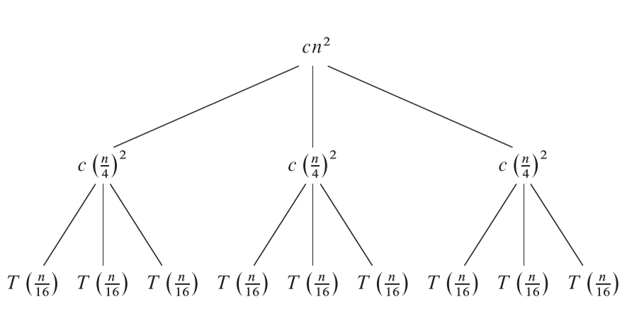



《算法导论》第四章笔记。包括分治法的介绍，最大子数组问题算法与分析，代入法、递归树法、主方法求时间复杂度。
4.2节,4.6节尚未整理。



<!--more-->

## Chapter 4. Divide-and-Conquer

在分析分治法的时候一般无视了许多细节，例如在分析归并排序时，如果考虑到$n$存在奇、偶情况，那么表达式应该写成

$$
T(n)=\begin{cases}
     \Theta(1) & \text{ if }  n=1
     \\\\
     T(\lceil n/2 \rceil)+T(\lfloor n/2 \rfloor)+\Theta(n) & \text{ if }  n>1
\end{cases}
$$

但在实际中，通常会无视向上取整，向下取整和一些边界条件，所以在归并排序分析时写成

$$T(n)=2T(n/2)+\Theta(n)$$

### The Maximum-subarray problem

从一个整数数组中找寻出值最大的子数组。如下图所示的数组中，$A[8..11]$即为最大数组，和为43


#### A brute-force solution

暴力破解法：通过双重循环遍寻所有的子数组情况，找出最大的数组。通过上一个子数组的和加上当前元素即可求得当前子数组的和，所以计算子数组和的花费为$O(1)$，遍历所有子数组需要的时间花费为$O(n^2)$，所以总体算法时间为$O(n^2)$

暴力破解的代码实现如下：

```cpp
int FindMaximumSubarray_BruteForce(int* originArray, int arrayLength, int& leftIndex, int& rightIndex)
{
	int maxSum = -INT_MAX, sum = 0;
	leftIndex = rightIndex = 0;
	for (int i = 0; i < arrayLength; i++)
	{
		sum = 0;
		for (int j = i; j < arrayLength; ++j)
		{
			sum += originArray[j];
			if (sum > maxSum)
			{
				maxSum = sum;
				leftIndex = i;
				rightIndex = j;
			}
		}
	}
	return maxSum;
}
```

#### A solution using divide-and-conquer

分治法求最大子数组问题的思路为，把原数组等分为两个部分，左半数组和右半数组。这时候求得的最大数组只可能是三种情况：完全在左半数组中，完全在右半数组中，处在左右半数组交界的地方。

所以分治法求最大子数组的伪代码如下，代码中依次求三种情况的最大子数组，然后比较求得原数组的最大子数组。（在求左右半边的最大子数组时使用了迭代）。

```pseudocode
FIND-MAXIMUM_SUBARRAY(A,low,high)
//A为原数组，low，high分别表示拆分出的左或右数组的左右Index

if high==low //只有一个元素时，即为最大子数组
    return [low,high,A[low]]
else 
    mid=[(low + high)/2]
    (left-low, left-high, left-sum)= FIND-MAXIMUM_SUBARRAY(A,low,mid)
    (right-low, right-high, right-sum)= FIND-MAXIMUM_SUBARRAY(A,mid+1,high)
    (cross-low, cross-high,cross-sum)=FIND-MAX-CROSSING-SUBARRAY(A,low,mid,high)

    if left-sum >=right-sum && left-sum>=cross-sum
        return [left-low,left-high,left-sum]
    else if right-sum>=left-sum && right-sum >= cross-sum
        return [right-low,right-high,right-sum]
    else
        return [cross-low,cross-high,cross-sum]
```

在求左右半边的最大子数组时使用了迭代，现在还要解决的就是求交叉最大子数组FIND-MAX-CROSSING-SUBARRAY函数的定义。

交叉最大子数组一定一部分处于左半数组，一部分处于右半。从Index mid处向左和向右各寻找最大的左部分，然后将左右部分结合便形成了最大的交叉子数组。

求交叉最大子数组伪代码如下：

```pseodocode
FIND-MAX-CROSSING-SUBARRAY(A,low,mid,high)

left-sum= -MAX
sum=0;

for i= mid downto low
    sum = sum + A[i]
    if sum > left-sum
        left-sum=sum;
        max-left-Index=i

right-sum= -MAX
sum=0;

for i= mid to high
    sum = sum + A[i]
    if sum > right-sum
        right-sum=sum;
        max-right-Index=i

return (max-left-index,max-right-index,left-sum + right-sum)

```

完整C++实现代码如下：

```c++
int FindMaximumSubarray_DivideAConquer(int* originArray, int leftIndex, int rightIndex, int& maxLeftIndex, int& maxRightIndex)
{
	if (leftIndex == rightIndex)
	{
		maxLeftIndex = maxRightIndex = leftIndex;
		return originArray[leftIndex];
	}

	int midIndex = (leftIndex + rightIndex) / 2;

	int sumLeft = 0, leftMaxLeftIndex = 0, leftMaxRightIndex = 0;
	sumLeft = FindMaximumSubarray_DivideAConquer(originArray, leftIndex, midIndex, leftMaxLeftIndex, leftMaxRightIndex);

	int sumRight = 0, rightMaxLeftIndex = 0, rightMaxRightIndex = 0;
	sumRight = FindMaximumSubarray_DivideAConquer(originArray, midIndex + 1, rightIndex, rightMaxLeftIndex, rightMaxRightIndex);

	int sumCross = 0, crossMaxLeftIndex = 0, crossMaxRightIndex = 0;
	sumCross = FindCrossingMaximumSubarray(originArray, leftIndex, midIndex, rightIndex, crossMaxLeftIndex, crossMaxRightIndex);

	if (sumLeft >= sumRight && sumLeft >= sumCross)
	{
		maxLeftIndex = leftMaxLeftIndex;
		maxRightIndex = leftMaxRightIndex;
		return sumLeft;
	}
	else if (sumRight >= sumLeft && sumRight >= sumCross)
	{
		maxLeftIndex = rightMaxLeftIndex;
		maxRightIndex = rightMaxRightIndex;
		return sumRight;
	}
	else
	{
		maxLeftIndex = crossMaxLeftIndex;
		maxRightIndex = crossMaxRightIndex;
		return sumCross;
	}
}

int FindCrossingMaximumSubarray(int* originArray, int leftIndex, int midIndex, int rightIndex, int& maxLeftIndex, int& maxRightIndex)
{
	int maxSumLeft = -INT_MAX;
	int sum = 0;
	for (int i = midIndex; i >= leftIndex; i--)
	{
		sum += originArray[i];
		if (sum > maxSumLeft)
		{
			maxLeftIndex = i;
			maxSumLeft = sum;
		}
	}

	int maxSumRight = -INT_MAX;
	sum = 0;

	for (int i = midIndex + 1; i <= rightIndex; i++)
	{
		sum += originArray[i];
		if (sum > maxSumRight)
		{
			maxRightIndex = i;
			maxSumRight = sum;
		}
	}

	return maxSumLeft + maxSumRight;
}
```

#### Analyzing the divide-and-conquer algorithm

分治法求最大子数组的是将原问题拆分为三个部分，（1）求左半部分的最大子数组 （2）求右半部分的最大子数组（3）求交叉部分的最大子数组，所以我们可以将原问题的时间花费$T(n)$改写为

$$
T(n)=\Theta(1)+2T(n/2)+\Theta(n)+\Theta(1) \\\\
    =2T(n/2)+\Theta(n)
$$

其中两个$\Theta(1)$分别表示拆分问题和合并答案的时间，$\Theta(n)$表示求交叉最大子数组的时间。

这个表达式与归并排序的表达式相同，所以我们可以得出求最大子数组的分治法复杂度为$T(n)=\Theta(n\lg(n))$

### Strassen's algorithms for matrix multiplication

//TODO

### The substitution method for solving recurrences

代入法求迭代复杂度分为两步：
1. 猜出解的表达形式
2. 用数学归纳法找出解的常数并证明解是正确的。

如有表达式
$$T(n)=2T(\lfloor n/2 \rfloor)+n$$
表达式的形式与归并排序算法很类似，所以我们时间复杂度为$T(n)=O(n\lg n)$。需要证明的是，存在某正常数$c$使得$T(n)\leq cn\lg n$。

根据数学归纳法，先假设存在一个$m<n$，对于$m$表达式成立，在这里将$m$取$\lfloor n/2 \rfloor$，如果上述表达式对于$\lfloor n/2 \rfloor$成立，所以$T(\lfloor n/2 \rfloor)\leq \lfloor n/2\rfloor \lg(\lfloor n/2\rfloor)$，代入原表达式，原表达式为

$$
T(n)\leq 2(c\lfloor n/2\rfloor \lg(\lfloor n/2\rfloor))+n \\\\
\leq cn \lg(n/2)+n \\\\
= cn\lg n-cn\lg 2+n \\\\
= cn\lg n +(1-c)n
$$

所以只要取$c\leq1$即能满足$n$也符合猜测。

注意，在数学归纳法中，边界条件也要符合猜测，在本例中，如果$T(1)$即为第一个表达式，那么需要满足$T(1)\leq 1\lg(1)=0$，但往往在$T(1)$情况下，时间为常量，于是这就存在了矛盾。为了解决这个矛盾，我们可以假设式子是在大于一个常数$n_0$情况下才满足，那么边界条件也就成为了$n_0$。

#### Subtleties

有的时候，我们可以猜出正确的表达式，但是无法正确的证明，如表达式

$$
T(n)=T(\lfloor n/2 \rfloor)+T(\lceil n/2 \rceil)+1
$$

猜测时间复杂度为$T(n)=O(n)$，于是尝试想证明$T(n) \leq cn$，同样我们假设在$<n$的情况下条件满足，即

$$
T(n) \leq c\lfloor n/2 \rfloor + c \lceil n/2 \rceil+1 \\\\
=cn+1
$$

这只能表明，$T(n)\leq cn+1$但不能证明想要的$T(n)\leq cn$。

但可以通过一个有更低项的表达式来证明我猜测，如$T(n)=cn-d$，$d$为大于0的常数，代入上式得，

$$
T(n) \leq (c\lfloor n/2 \rfloor -d)+ (c \lceil n/2 \rceil -d )+1 \\\\
=cn-2d+1\\\\
=cd -d -(1-d)
$$

那么只要取$d\geq 1$就能满足猜测表达式。

这与通常的直觉相反，因为我们在证明$T(n)=cn$时失败了，那在再次尝试时，应该猜一个值更大的函数，但是我们用了一个值更小（减去了一个更小项）的函数却证明成功了。这是因为通常猜测的表达式越接近答案，证明过程也就越严格，所以我们取了一个相离较远相对宽松的值反而容易证明。

#### Avoiding pitfalls

避免跌入证明的陷阱里，我们在证明时要确认最终的表达式确实是我们想要的式子。例如在猜测式子$T(n)=2T(\lfloor n/2 \rfloor)+n$的复杂度，猜测$T(n)=O(n)$，即需要证明$T(n)\leq cn$，代入式子可得

$$
T(n)\leq 2(c\lfloor n/2 \rfloor)+n \\\\
\leq cn+n \\\\
= (c+1)n
$$

这时候很容易错误的认为$\leq (c+1)n$即满足了$\leq cn$，但$c$是我们指定的常量，小于$c+1$并不一定小于$c$，所以猜测并不成立。

#### Changing variables

有时候一些代数变换可以帮助猜测出解，如有式子

$$
T(n)=2T(\lfloor \sqrt{n} \rfloor)+\lg n
$$

可以将$m=\lg n$即$n=2^m$代入上式，得

$$
T(2^m)=2T(2^{m/2})+m
$$

再将$T(2^m)$的关系表示为$S(m)$，得

$$
S(m)=2S(\frac{m}{2})+m
$$

此时，式子的表达与归并排序相同，所以可得$S(m)=O(m\lg m)$，将$m= \lg n$带回式子，得

$$
S(\lg n)=O(\lg n \lg \lg n)
$$

又$S(m)=T(2^m)$所以$S(\lg n)=T(2^{\lg n})=T(n)$

所以

$$
T(n)=O(\lg n \lg \lg n)
$$

### The recursion-tree method for solving recurrences

在递归树中，每一个节点都表示一个子问题的花费，整个问题的时间花费即为所有节点的花费总和。在计算时我们通常计算树的每一层的花费，然后再将所有的层数花费累加进而得到整棵树的花费。

通常在使用递归树时，我们会**忽略一些细节**，得到一个近似的答案作为猜测，再使用代入法去验证。当然也可以事无巨细的使用递归树来作为时间复杂度的证明。

如需要求得式子$T(n)=3T(\lfloor n/4 \rfloor)+\Theta(n^2)$的时间复杂度，我们首先忽略向下取整，变为求式子$T(n)=3T(n/4)+cn^2$

这个式子可以拆分为下图所示


$T(\frac{n}{4})$又可以表达为$T(\frac{n}{4})=3T(\frac{n}{16})+c(\frac{n}{4})^2$，于是树可以进一步拆分为：



同理类推，最终树可以拆分为:


每一层都对需要平方的$n$除以4，直到最后变为1，设最后一层（数值为1）的层数为$i$，则有表达式

$$\frac{n}{4^i}=1$$

注意，这里的x取值是从0，所以第一层的数值为$n(\frac{1}{4})^0=n$，求得最后一层的层数为

$$i=\log_4n$$

* 因为是从0开始，所以总层数为$\log_4n+1$

设行数为$i$，则每一层的节点数为$3^i$，每个节点为$c(\frac{n}{4^i})^2$，所以每一层的值为

$$
3^ic(\frac{n}{4^i})^2\\\\
=(\frac{3}{16})^icn^2
$$

所以整棵树的时间为

$$
T(n)=\sum_{i=0}^{\log_4n-1}(\frac{3}{16})^icn^2+3^ {\log_4n}\Theta(1)\\\\
    =\sum_{i=0}^{\log_4n-1}(\frac{3}{16})^icn^2+ n\log_43\Theta(1)\\\\
    =\sum_{i=0}^{\log_4n-1}(\frac{3}{16})^icn^2+ \Theta(n\log_43)
$$

上式为等比数列，可以套等比数列公式求得，但我们可以先进一步简化

$$
T(n)=\sum_{i=0}^{\log_4n-1}(\frac{3}{16})^icn^2+ \Theta(n\log_43) \\\\
\leq \sum_{i=0}^{\infty}(\frac{3}{16})^icn^2+ \Theta(n\log_43) \\\\
$$

这时套入等比公式

$$\sum _{k=0}^{\infty}x^k=\frac{1}{1-x}$$

可得

$$
T(n)\leq \sum_{i=0}^{\infty}(\frac{3}{16})^icn^2+ \Theta(n\log_43) \\\\
    =\frac{1}{1-{\frac{3}{16}}}cn^2+\Theta(n\log_43) \\\\
    =\frac{16}{13}n^2+\Theta(n\log_43)\\\\
    =0(n^2)
$$

**之后可以用代入法来验证结果**

需要证明的就是$T(n)\leq dn^2$

$$
T(n^2)\leq 3d(n/4)^2+cn^2////
=\frac{3}{16}dn^2+cn^2
$$

只要$\frac{3}{16}d+c$<$d$，即可满足条件，即$d\geq \frac{16}{13}c$即可

### The Master method for solving recurrences

主方法提供了针对形如$T(n)=aT(n/b)+f(n)$的一系列迭代算法的复杂度计算套用公式。

主方法定理：

1. 如果存在常量$\epsilon$满足$f(n)=O(n^{\log_ba-\epsilon})$，则$T(n)=\Theta(n^{\log _ba})$
2. 如果有$f(n)=\Theta(n^{\log_ba})$，则$T(n)=\Theta(n^{\log_ba}\lg n)$
3. 如果存在常量满足$f(n)=\Omega(n^{\log_ba+\epsilon})$，且对于足够大的$n$，存在常量$c<1$满足$af(n/b)\leq cf(n)$，则$T(n)=\Theta(f(n))$

可以发现定理的三个情况$f(n)$对$n^{\log_ba}$的比较。而且要注意$\epsilon$的存在，他表示关系式都必须是多项式渐进大于或多项式渐进小于，需要即使相差一个因子$n^\epsilon$，不等式仍然成立。

#### Using the master method

1. 式子$T(n)=9T(n/3)=n$

    可知$a=9,b=3,f(n)=n$，$n^{\log_ba}=n^2$，只要$\epsilon<=1$，都可满足$f(n)=O(n^{\log_ba-\epsilon})$，符合条件一，时间复杂度为$T(n)=\Theta(n^2)$

2. 式子$T(n)=T(2n/3)+1$

    可知$a=1,b=3/2,f(n)=1$，$n^{\log_ba}=n^{\log_3/21}=n^0=1$，即$f(n)=1=\Theta(1)=\Theta(n^{\log_ba})$，所以满足条件二，时间复杂度为$T(n)=\Theta(\lg n)$

3. 式子$T(n)=3T(n/4)+n\lg n$

    可知$a=3,b=4,f(n)=n\lg n,n^{\log_ba}=n^{\log_43}=n^{0.793}$，取$\epsilon$足够小，如取0.1则满足$f(n)=n\lg n=\Omega (n^{0.89})$

    如果要满足条件三，仍然需要满足，存在$c$使得$af(n/b)\leq cf(n)$，即需要满足$\frac{3n}{4}\lg \frac{n}{4}\leq cn\lg n$

    $$\frac{3n}{4}\lg \frac{n}{4}=\frac{3n}{4}\lg n -\frac{3}{2}n$$

    如果取$c=3/4$，则不等式可以转换为

    $$
    \frac{3n}{4}\lg n -\frac{3}{2}n \leq \frac{3n}{4}\lg n
    $$

    条件满足，所以原式子满足条件三，所以结果为$T(n)=\Theta(n\lg n)$

4. 式子$T(n)=2T(n/2)+n\lg n$

    可知$a=2,b=2,f(n)=n\lg n,n^{\log_ba}=n$

    因为$f(n)=n\lg n$大于$n^{\log_ba}=n$，所以很容易误以为这个式子满足条件三，但实际上条件需要满足多项式渐进大于，在本例子中需要存在一个$\epsilon$，使得$\lg n$渐进大于$n^{\epsilon}$，但对于任意$\epsilon >0$，这个式子都不满足。所以这个式子并不满足条件三，不能使用主方法来求得时间复杂度。

### Proof of the master theorem

//TODO



引用：

1. *Introduction to Algorithms* 3rd Sep.2009



***