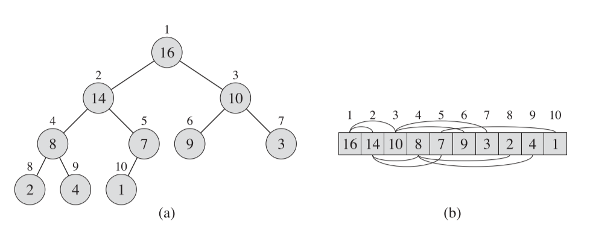
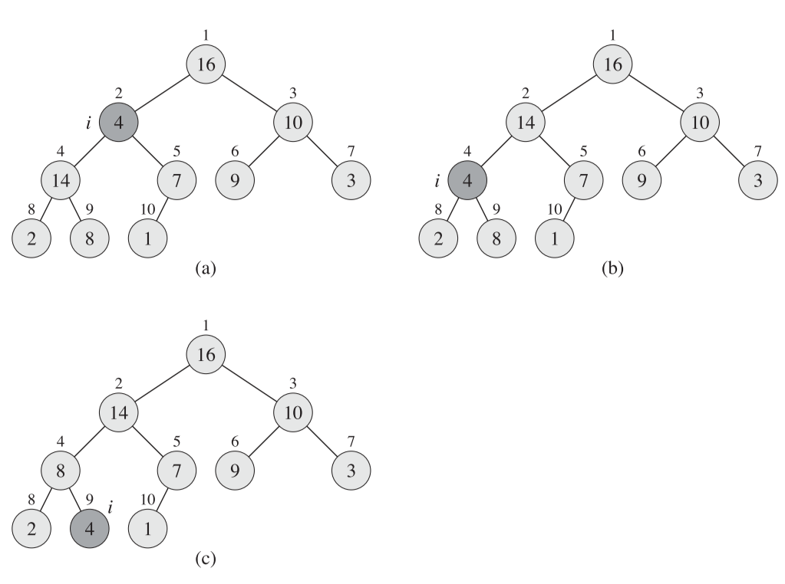
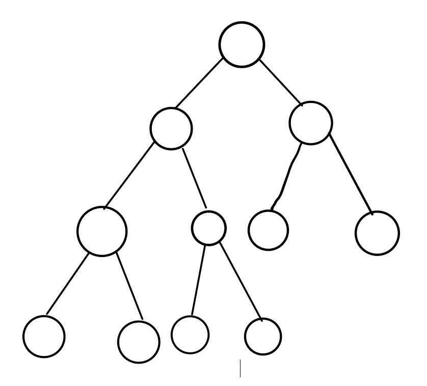
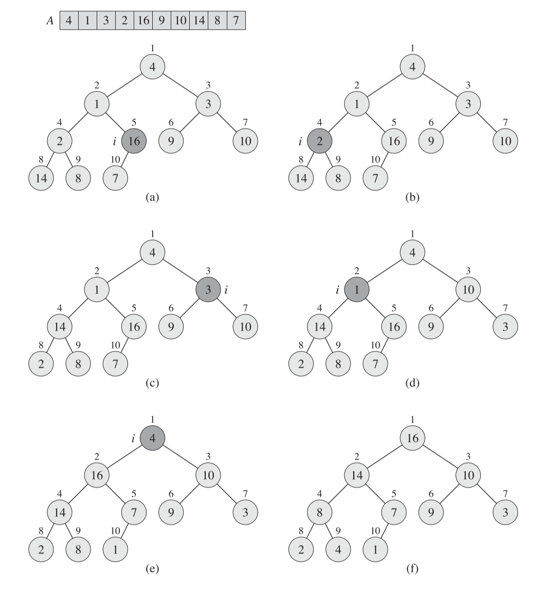
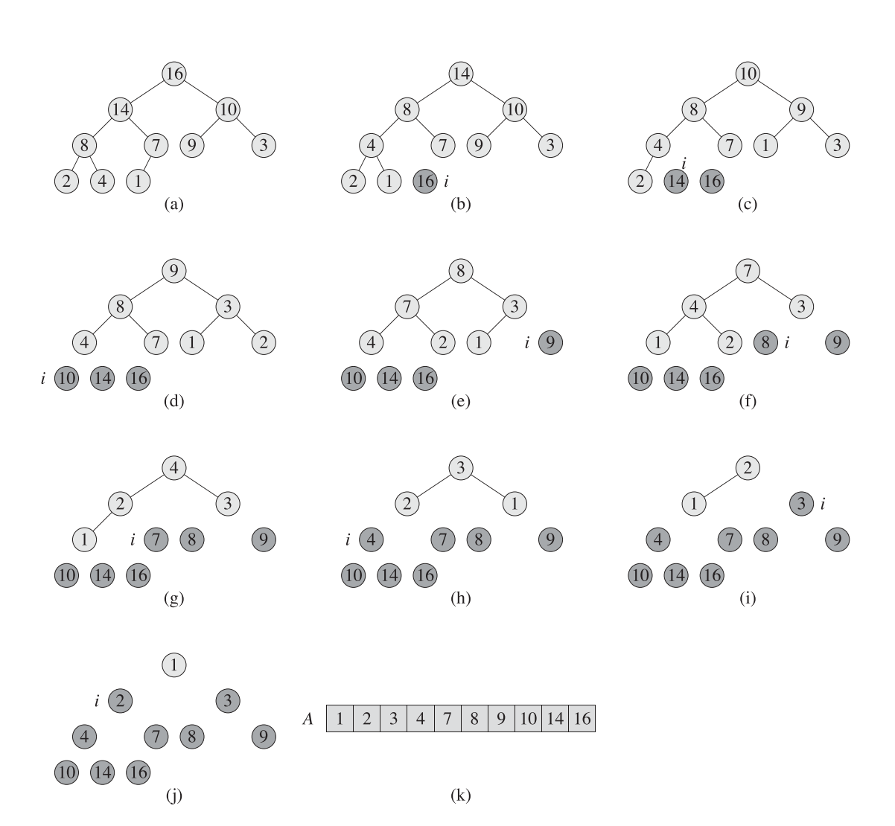
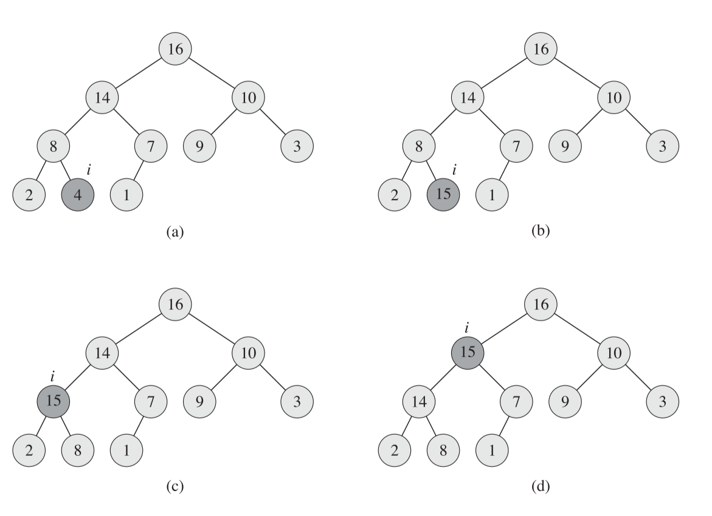


《算法导论》中第六章笔记。

关于堆与堆排序。



<!--more-->

# Chapter 6 Heapsort

如归并排序一样，堆排序的时间复杂度为$O(nlgn)$，但与归并排序不同的是，堆排序在运行过程中仅需要固定大小的外部空间，即运行时所需的内存不会因为输入规模的上升而上升，这一点与插入排序一样。

所以堆排序是结合了插入排序和归并排序两者的优点。

“堆”（Heap）这一称呼最早就是针对于堆排序的，但是在一些语言的垃圾回收概念中存在堆栈的概念。这两者虽然名字相同，但实际上是完全不同的存在。

## Heap

`堆（Heap）`或称`二叉堆（Binary Heap）`是一种用数组来表示近似完全二叉树的数据结构。树中的每一个元素都对应数组中的一个元素，树除了最下面一层，其余层都是满的。

二叉堆与二叉树如下图所示：



在数组中，用一个变量`heap-size`来表示数组中真正元素的个数。如一个数组可能长度为10，但其中真正的元素个数为5，剩下的都为空，即$0\leq A.heap-size \leq A.length$。

树的根节点用$A[1]$表示，所有结点可根据以下伪代码计算其父结点，左子树以及右子树。这些操作都是单纯的乘二或除二，因此可以用位运算来实现。

```pseudocode
PARENT(i)
return i/2

LEFT(i)
return 2i

RIGHT(i)
return 2i+1
```

c++ 实现如下，注意因为c++中的索引是从0开始，所以index值需要做相应调整：

```cpp
int parent(int index)
{
	return ceil(index / 2.0) - 1;
}
int left(int index)
{
	return index * 2 + 1;
}
int right(int index)
{
	return index * 2 + 2;
}
```


有两种二叉堆：`最大堆（max-heaps）`与`最小堆（min-heaps）`。对于最大堆，每个结点都需要满足`最大特性（max-heap property）`，即

$$
A[Parent(i)] \geq A[i]
$$

可以因此判断出在最大堆中最大的元素存储在根结点。同理最小堆需要满足$A[Parent(i)] \leq A[i]$，最小的元素存储在根结点。

* 之后的几个章节都默认以最大堆作为对象进行分析

将一个堆看作一棵树后，将一个结点的高度定义为这个结点到叶子的最长单一路径，一棵树的高度定义为根节点的高度。因为堆是近似完全二叉树，所以对于有$n$个结点的堆来说，其高度为$\Omega(\log n)$。

## Maintaining the heap property

通过函数`MAX-HEAPIFY`来保持堆的特性，该函数需要传入需要处理的数组$A$和需要进行处理的元素索引值$i$。

调用前默认元素$i$的左树$LEFT(i)$和右树$RIGHT(i)$都满足最大特性，但元素$i$本身可能违背，即元素$i$可能小于它的子结点。

`MAX-HEAPIFY`操作是将值$A[i]$“向下沉”，即将更小的$A[i]$值向树的更底层传递，伪代码如下：

```Pseudocode
MAX-HEAPIFY(A,i)
l = LEFT(i)
r = RIGHT(i)
if l <= A.heapSize and A[l] > A[i]
    largest = l;
else
    largest = i;
if r <= A.heapSize and A[r] > A[largest]
    largest = r;

if (largest != i)
    exchange A[i] with A[largest]
    MAX-HEAPIFY(A,largest)
```

c++代码实现如下：

```cpp
void MaxHeapify(int index, int dataLength)
{
	if (index >= dataLength)
	{
		cout << "Invalid index " << index << endl;
		return;
	}
	int largest = index;
	int lIndex = left(index);
	int rIndex = right(index);
	if (lIndex < dataLength)
		largest = dataArray[index] > dataArray[lIndex] ? index : lIndex;
	if (rIndex < dataLength)
		largest = dataArray[rIndex] > dataArray[largest] ? rIndex :largest;
	if (largest != index)
	{
		int temp = dataArray[index];
		dataArray[index] = dataArray[largest];
		dataArray[largest] = temp;
		MaxHeapify(largest, dataLength);
	}
}
```

伪代码中的`exchange`操作的结果就是值更大的结点向树的上方传递，值小的结点向树的下方下沉。

算法的图解如下：



(a)图到(b)中，值为14的结点向上移动，值为4的结点向下移动。(b)到(c)图，值为8的结点向上移动，值为4的结点向下移动。

该算法实际上是一个递归，对结点(i)调用后，会对原先拥有最大结点的子树进一步调用（`MAX-HEAPIFY（A，largest）`）。

如果一个树的结点数目为$n$，其子树最多拥有$2n/3$个结点。首先因为二叉堆需要满足近似完全二叉树，即只有最下一层的结点可能是不满的。因此最大比例情况发生在最下层结点一半是空的时候，此时非空另一半的子树拥有最大比例的子结点。

如下图所示，此时树中一共有11个结点，根节点的左子树此时拥有的结点比例是最大的，为7/11。



一个树的结点数目为$n$，其子树最多拥有$2n/3$个结点。证明如下：

首先如果树的每一层结点数是上一层的两倍，根据等比数列公式可以求得，高度为$h$的树，其结点总数为：

$$
\frac{a_1-a_nq}{1-q} \\\\
=\frac{1- 2^{h-1}2}{1-2} \\\\
=2^h-1
$$

最大比例情况下，即最底层的结点一半为空的情况下，最大子树所占结点数目的比例计算如下：

$$
\frac{2^{h-1}-1}{2^h-1 - \frac{2^{h-1}}{2}}
$$

该式子的分子是子树的结点总数，在最大情况下子树可以看作是一颗层数小1的满树($2^{h-1}-1$)。分母是整棵树的结点数，为满树($2^h-1$)减去最下一层结点的一半（$\frac{2^{h-1}}{2}$）.

对上式求极限可得：

$$
\lim_{n\rightarrow \infty} \frac{2^{h-1}-1}{2^h-1 - \frac{2^{h-1}}{2}} \\\\
=\lim_{n\rightarrow \infty} \frac{2^{-1}-\frac{1}{2^h}}{1-\frac{1}{2^h}-2^{-2}}\\\\
=\frac{\frac{1}{2}-0}{1-0-\frac{1}{4}} \\\\
= \frac{2}{3}
$$

因此`MAX-HEAPIFY(A,i)`的时间复杂度递归表达式可以写作
$$
T(n)\leq T(2n/3) +\Theta(1)
$$

该式子满足主方法的第二种情况，因此可以算出时间复杂度为$T(n)=O(\lg n)$

## Building a heap

可以通过自底向上（即从树的第一个非叶子结点开始向上调用直到根结点）的调用`MAX_HEAPIFY`方法将一个普通数组转换为满足最大特性的数组。将这个方法称为`BUILD-MAX-HEAP(A)`

对于一个数组$A$，索引值从$\lfloor n/2 \rfloor +1$到$n$都是这个树的叶子。

证明如下：

如果一个结点的索引值为$\lfloor n/2 \rfloor +1$，求这个结点的左结点，可得：

$$
LEFT(\lfloor n/2 \rfloor +1)\\\\
=2(\lfloor n/2 \rfloor +1)\\\\>2( (\frac{n}{2}-1)+1)\\\\
=n-2+2 =n
$$

即他的左子树的结点索引值已经大于了$n$，所以他的左子树是不存在的。

使用的同样的方法，也可以证明对于索引值为$\lfloor n/2 \rfloor$的结点，其左结点是存在的。


`BUILD-MAX-HEAP(A)`的伪代码如下，其核心为自底向上对所有的非叶子结点进行MAX-HEAPIFY

```pseudocode
BUILD-MAX-HEAP(A)
A.heap-size=A.length
for i = A.length/2 downto 1
    MAX-HEAPIFY(A,i)
```

c++代码实现如下：
```cpp
void BuildMaxHeap()
{
	for (int i = dataLength / 2 - 1; i >= 0; i--)
		MaxHeapify(i, dataLength);
}
```

算法图解如下，从(a)到(e)分别表示每一次的循环，(f)为最终结果。



该算法会调用$O(n)$次MAX-HEAPIFY算法，所以复杂度为$O(n\lg n)$。但这个复杂度并不是紧密的上限。

考虑到对于一个拥有$n$个结点的树，其树高为$\lfloor \lg n \rfloor$。

且可以证明对于高度为$h$的层（这里的高度0是指最下面一层，高度1为倒数第二层，依次类推），节点数最多为$\lceil n/2^{h+1}\rceil$。

证明如下：

在前面已经得知，对于一个数组$A$，索引值从$\lfloor n/2 \rfloor +1$到$n$都是这个树的叶子。那么可以计算出，一棵树的叶子结点个数为$n-(\lfloor n/2 \rfloor +1)+1=\lceil n/2 \rceil$。非叶子结点个数为$n-\lceil n/2 \rceil= \lfloor n/2 \rfloor$

用数学归纳法证明

对于高度为0的层，即叶子层，其结点个数为$\lceil n/2 \rceil$，满足$\lceil n/2^{h+1}\rceil$。

对于高度为h-1的层，条件满足。对于高度为$h-1$的层到顶部的结点个数即为一棵树非叶子结点的个数，即$\lfloor n/2 \rfloor$。

因此式子为

$$
\lceil \frac{\lfloor n/2 \rfloor}{2^{h-1+1}} \rceil \\\\
< \lceil \frac{n/2}{2^{h-1+1}} \rceil \\\\
= \lceil \frac{n}{2^{h+1}} \rceil
$$

即可推导出原式，因此原式得证。

对于`BUILD-MAX-HEAP(A)`而言，每一次调用`MAX-HEAPIFY`都与调用时的高度相关，即每个`MAX-HEAPIFY`的时间复杂度为$O(h)$。

因此整个算法的时间复杂度可表示为

$$
\sum_{h=0} ^{\lfloor \lg n \rfloor} \lceil \frac{n}{2^{h+1}} O(h) \rceil \\\\
= O( n \sum_{h=0} ^{\lfloor \lg n \rfloor}\frac{h}{2^h} )\\\\
=  O( n \sum_{h=0} ^{\infty}\frac{h}{2^h} )
$$

套用公式

$$
\sum_{k=0}^{\infty} kx^k=\frac{x}{(1-x)^2}
$$

得

$$
O( n \sum_{h=0} ^{\infty}\frac{h}{2^h} \\\\
=O(2n)=O(n)
$$

所以`BUILD-MAX-HEAP(A)`的紧密时间复杂度为$O(n)$

## The heapsort algorithm

对排序算法，首先需要调用`BUILD-MAX-HEAP(A)`算法将数组转换为满足最大特性的数组。满足最大特性后，数组的第一个元素即为最大值，将数组的最后一个值与第一个值进行交换，然后将数组的有效大小缩小（相当于不再追踪最后一个元素，因为此时最后一个元素是原第一个元素即最大元素）。然后再针对新的第一个元素调用`MAX-HEAPIFY(A,1)`即可。

伪代码如下：

```pseudocode
HEAPSORT(A)
BUILD-MAX-HEAP(A)
for i = A.length downto 2
    exchange A[1] with A[i]
    A.heapSize = A.heapSize - 1
    MAX-HEAPIFY(A,1)
```

c++代码实现如下
```cpp
void heapSort()
{
	BuildMaxHeap();
	for (int tempDataLength = dataLength; tempDataLength > 1;tempDataLength--)
	{
		int temp = dataArray[0];
		dataArray[0] = dataArray[tempDataLength - 1];
		dataArray[tempDataLength - 1] = temp;
		MaxHeapify(0, tempDataLength - 1);
	}
	//This part is not related to the heapsort
	//Output the sort result and recover the heap 
	HeapDebug();
	BuildMaxHeap();
}
```

算法图解如下，(a)为初始状态，(b)到(j)每次循环调用完MAX-HEAPIFY后的结果，(k)为最终结果：



该算法的时间复杂度为$O(n\lg n)$。因为BUILD-MAX-HEAP的复杂度为$O(n)$，且调用了$O(n)$次复杂度为$O(\lg n)$的`MAX-HEAPIFY`算法。

## Priority Queue 

`优先队列（Priority queues）`是二叉堆排序的一个应用。

如有一系列任务，每个任务有不同的优先级，每次任务处理完后需要在剩下的任务中选取优先级最高的任务进行处理。可以将一个任务看作是一个结点，任务的优先级看作是结点的值，因此每次选取任务时只要从`最大堆`中取第一个元素即可。存放这些任务的队列即为优先队列。

也可以通过二叉堆来实现事件的回放，每一个事件作为树中的一个结点，事件的时间作为结点的值。因此在回放事件时，每次只要取`最小堆`中的第一个元素即可。

一个优先队列需要实现如下几个命令：

1. INSERT(S,x) 将元素x插入队列S中
2. MAXIMUM（S）返回S中的最大元素
3. EXTRACT—MAX(S)返回并取出S中的最大元素
4. INCREASE-KEY(S,x,k)增加S中的元素x的值至k，k必须大于原先x的值。

MAXIMUM伪代码如下：

```pseudocode
HEAP-MAXIMUM(A)
return A[1]
```

c++代码实现如下：
```cpp
int Maximum()
{
	return dataArray[0];
}
```

EXTRACT-MAX(S)的伪代码如下：

```pseudocode
HEAP-EXTRACT-MAX(A)
if A.heap-size < 1
    error "heap under flow"
max = A[1]
A[1] = A[A.heapSize]
A.heapSize--
MAX-HEAPIFY(A,1)
return max;
```

c++代码实现如下：
```cpp
int ExtractMaximum()
{
	int max = dataArray[0];
	dataArray[0] = dataArray[--dataLength];
	if (dataLength != 0)
		MaxHeapify(0, dataLength);
	return max;
}
```

EXTRACT-MAX的时间复杂度为$O(\lg n)$

INCREASE-KEY的伪代码如下：

```pseudocode
HEAP-INCREASE-KEY(A,i,key)
if key < A[i]
    error "new key is smaller than current key"
A[i] = key
while i > 1 and A[PARENT(i)] < A[i]
    exchange A[i] with A[PARENT(i)]
    i = PARENT(i)
```

c++代码实现如下：
```cpp
void IncreaseKey(int index, int newValue)
{
	if (index >= dataLength)
	{
		cout << "Invalid index in IncreaseKey" << endl;
		return;
	}
	if (dataArray[index] >= newValue)
	{
		cout << "No need to update" << endl;
		return;
	}
	dataArray[index] = newValue;
	int parentIndex = parent(index);
	cout << "parent index is " << parentIndex << endl;
	while (index > 0 && dataArray[parentIndex] < newValue)
	{
		dataArray[index] = dataArray[parentIndex];
		dataArray[parentIndex] = newValue;
		index = parent(index);
		parentIndex = parent(index);
	}
}
```

INCREASE-KEY的算法主要思想是将更大数值的结点与父结点比较，如果更大则向上移动。这里的操作与MAX-HEAPIFY实际上是相反的，MAX-HEAPIFY是将更小的数值向下沉。最坏情况下循环的次数与堆的高度相同，即时间复杂度为$O(\lg n)$

算法图解如下,(a)图是原先的值，(b)图是将值改为15后，(c)和(d)为循环过程：



INSERT的伪代码如下：

```pseudocode
MAX-HEAP-INSERT(A.key)
A.heapSize = A.heapSize+1
A[A.heapSize] = -MAX
HEAP-INCREASE-KEY(A,A.heapSize,key)
```

c++代码实现如下：
```cpp
void Insert(int value)
{
	dataLength++;
	if (dataLength > arrayLength)
	{
		cout << "The heap is full" << endl;
		return;
	}
	dataArray[dataLength - 1] = -INT_MAX;
	IncreaseKey(dataLength - 1, value);
}
```

INSERT算法是先加入一个无限小的结点，再通过INCREASE-KEY方法将这个结点的值改为需要的值。该算法的时间复杂度与INCREASE-KEY相同，即$O(\lg n)$



引用：

1. *Introduction to Algorithms* 3rd Sep.2009



***