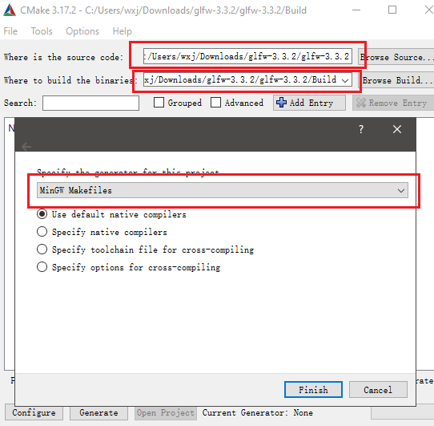
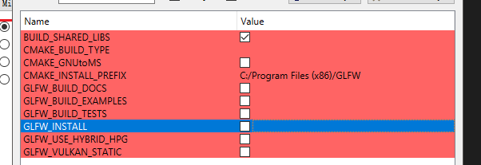
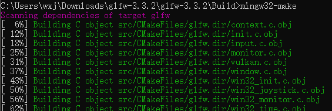
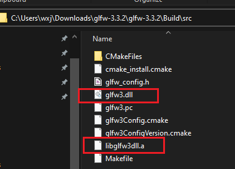
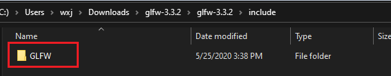
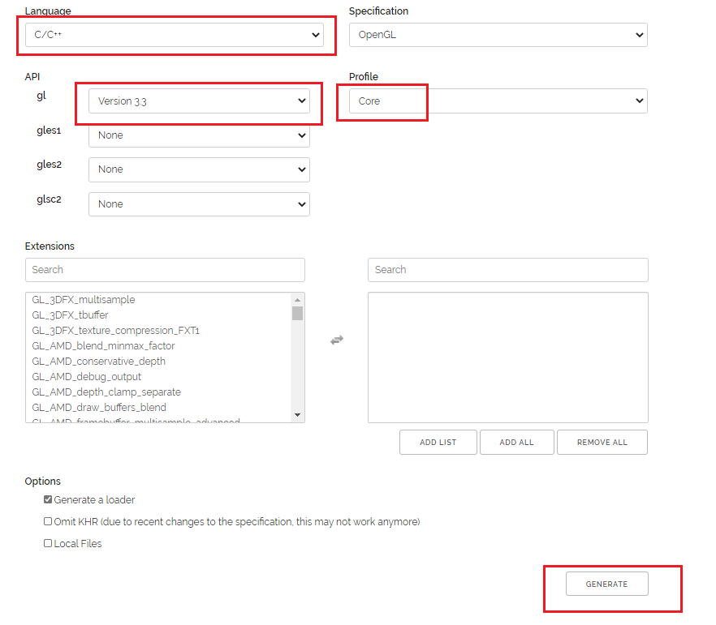
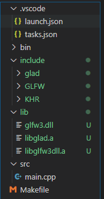
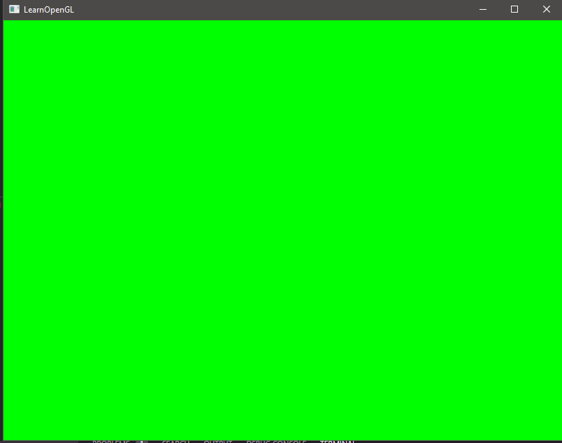

<!--more-->

# Creating a Window

在OpenGL前，首先需要创建OpenGL的上下文和用于绘制的窗口等，这些内容是与操作系统相关的，而OpenGL则是希望成为一个夸平台的工具，因此OpenGL本身并不复杂这些内容的处理，需要用户自己来进行相关的环境配置。好在一些现有的库以及帮助完成了工作，这里首先需要进行的就是相关库的配置。

## GLFW

GLFW是一个开源的OpenGL库，主要为创建窗口，OpenGL上下文，处理用户输入等功能提供了简单的API。

从[官网](https://www.glfw.org/download.html)中下载GLFW源文件，然后再下载并安装[CMake](https://cmake.org/download/)软件推荐，windows平台下推荐下载msi版本。

安装Cmake后，按下图进行配置，从上到下三个红框分别表示，GLFW的源代码地址，编译后结果的输出地址以及编译对象，这里因为想搭建的是VSCode环境下的地址，所以选择了`MinGW Makefiles`。其中第三个红框的窗口时通过按左下角的`Configure`按钮呼出的。



配置完成后，勾选上最上面的`BUILD_SHARD_LIBS`选项后点积`Generate`按钮。



输出后，进入输出结果的地址，并通过`mingw32-make`命令进行编译，如下：



注意这一步需要安装[mingw](https://osdn.net/projects/mingw/releases/)工具。

完成后进入`src`文件夹，其中的`glfw3.dll`和`libglfw3dll.a`即为所需要的静态链接文件。



而需要的头文件，则在`glfw3`的源代码路径下的`include`文件夹中



## GLAD

OpenGL实质上是一个标准，因此对于不同的显卡厂商而言，会做出不同的OpenGL相关驱动，也因此OpenGL函数的地址并不能在编译时刻确定，只能在Runtime时找到相关的函数指针地址再使用该指针进行操作，无疑这是一个很繁琐的功能。

而`GLAD`库简化了相关操作，并且`GLAD`库使用了网络服务来简化了编译过程，只要在其[网站](https://glad.dav1d.de/)上选择目标语言和相关OpenGL类型之后，就可以直接生成出想要的内容并直接下载，网站上的相关设置如下：



当下载`GLAD`内容后，进入文件夹，并通过命令行运行如下两个命令来生成需要的静态链接文件。

```text
gcc .\src\glad.c -c -I.\include\
ar -rc libglad.a glad.o
```

第一条命令时将`.c`文件编译为`.o`文件，第二条命令是将`.o`文件转换为静态链接`.a`文件。生成的`libglad.a`文件即为需要的静态链接文件。

`GLAD`需要的头文件在`include`文件夹下。

## 配置VS Code

首先安装`C/C++ Project Generator`插件帮助创建相关的文件夹，安装插件并运行`Create C++ Project`后，将之前生成的`GLFW`和`GLAW`的静态链接文件和头文件分别拷贝至`lib`和`include`文件夹下，如下所示：



还需要对Makefile文件进行修改，修改后的结果如下：

```MakeFile
CC		:= g++
CFLAGS	:= -std=c++17 -Wall -Wextra -g

BIN		:= bin
SRC		:= src
INCLUDE	:= include
LIB		:= lib

LIBRARIES	:= -lglad -lglfw3dll # Add Lib file

ifeq ($(OS),Windows_NT)
EXECUTABLE	:= main.exe
SOURCEDIRS	:= $(SRC)
INCLUDEDIRS	:= $(INCLUDE)
LIBDIRS		:= $(LIB)
else
EXECUTABLE	:= main
SOURCEDIRS	:= $(shell find $(SRC) -type d)
INCLUDEDIRS	:= $(shell find $(INCLUDE) -type d)
LIBDIRS		:= $(shell find $(LIB) -type d)
endif

CINCLUDES	:= $(patsubst %,-I%, $(INCLUDEDIRS:%/=%))
CLIBS		:= $(patsubst %,-L%, $(LIBDIRS:%/=%))

SOURCES		:= $(wildcard $(patsubst %,%/*.cpp, $(SOURCEDIRS)))
OBJECTS		:= $(SOURCES:.cpp=.o)

all: $(BIN)/$(EXECUTABLE)

.PHONY: clean
clean:
	-$(RM) $(BIN)/$(EXECUTABLE)
	-$(RM) $(OBJECTS)


run: all
	./$(BIN)/$(EXECUTABLE)

$(BIN)/$(EXECUTABLE): $(SOURCES) # Use SOURCES instead of OBJECTS to avoid complile without include/lib
	$(CC) $(CFLAGS) $(CINCLUDES) $(CLIBS) $^ -o $@ $(LIBRARIES)
```

主要的修改点如上注释所示，一是添加了静态文件的链接，原MakeFile文件只是制定了lib文件夹，但需要链接文件夹中的哪些文件并没有说明，需要修改`LIBRARIES`文件进行说明。其中的`-lglad`表示链接`libglad.a`文件，`-lglfw3dll`表示链接`libglfw3dll.a`文件。二是将原最后编译步骤中的`OBJECTS`对象改成了`SOURCES`。这是因为如果设定了`OBJECTS`则会隐式的进行一步`cpp`文件到`.o`文件的编译，而这次编译并没有指定include和lib目录，则会造成编译失败。

lib文件夹中的`glfw.dll`文件需要手动的复制到与最后生成的`exe`文件同目录下，这里即是`bin`文件夹。

可将如下代码拷贝至`main.cpp`文件中，并按下F5自动编译运行，或在`Makefile`所在目录下通过命令行命令`mingw32-make run`编译运行。

```cpp
#include <glad/glad.h>
#include <GLFW/glfw3.h>
#include <iostream>
const unsigned int SCR_WIDTH = 800;
const unsigned int SCR_HEIGHT = 600;

int main()
{
	glfwInit();
	glfwWindowHint(GLFW_CONTEXT_VERSION_MAJOR, 3);
	glfwWindowHint(GLFW_CONTEXT_VERSION_MINOR, 3);
	glfwWindowHint(GLFW_OPENGL_PROFILE, GLFW_OPENGL_CORE_PROFILE);
	GLFWwindow *window = glfwCreateWindow(SCR_WIDTH, SCR_HEIGHT, "LearnOpenGL", NULL, NULL);
	if (window == NULL)
	{
		std::cout << "Failed to create GLFW window" << std::endl;
		glfwTerminate();
		return -1;
	}
	glfwMakeContextCurrent(window);
	if (!gladLoadGLLoader((GLADloadproc)glfwGetProcAddress))
	{
		std::cout << "Failed to initialize GLAD" << std::endl;
		return -1;
	}
	while (!glfwWindowShouldClose(window))
	{
		glClearColor(0.0f, 1.f, 0.0f, 1.0f);
		glClear(GL_COLOR_BUFFER_BIT);
		glfwSwapBuffers(window);
		glfwPollEvents();
	}
	glfwTerminate();
	return 0;
}
```

结果应该为一个绿色的窗口，如下所示：



至此整个学习OpenGL的环境设置完成。




引用：

1. [vscode OpenGL环境搭建](https://blog.csdn.net/sarono/article/details/86564726)
2. [Creating a window](https://learnopengl.com/Getting-started/Creating-a-window)



***