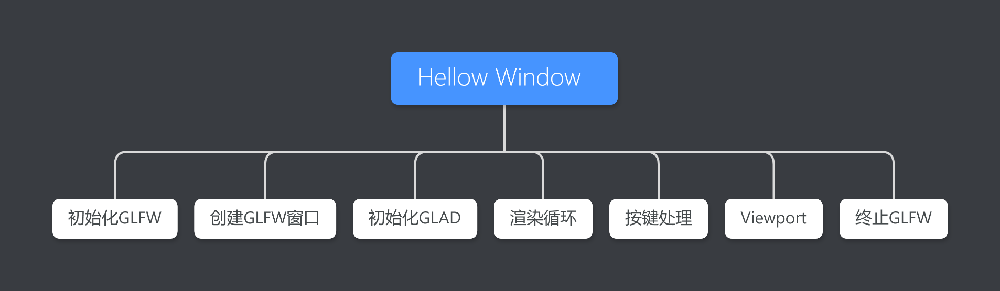







<!--more-->

# Hello Window

## 引入相关库

```cpp
#include <glad/glad.h>
#include <GLFW/glfw3.h>
#include <iostream>
```

## 初始化GLFW

```cpp
glfwInit();
glfwWindowHint(GLFW_CONTEXT_VERSION_MAJOR, 3);
glfwWindowHint(GLFW_CONTEXT_VERSION_MINOR, 3);
glfwWindowHint(GLFW_OPENGL_PROFILE, GLFW_OPENGL_CORE_PROFILE);
```

`glfwWindowHint`函数的第一个参数用来表示要设定的参数，所有参数都是以`GLFW_`开头，函数的第二个参数是需要设定的值。
`glfwWindowHint`接受的参数与参数值，可以在[GLFW文档]("https://www.glfw.org/docs/latest/window.html#window_hints")中设置。

## 创建GLFW窗口

```cpp
GLFWwindow *window = glfwCreateWindow(SCR_WIDTH, SCR_HEIGHT, "LearnOpenGL", NULL, NULL);
if (window == NULL)
{
    std::cout << "Failed to create GLFW window" << std::endl;
    glfwTerminate();
    return -1;
}
glfwMakeContextCurrent(window);
```

通过`glfwCreateWindow`函数创建窗口，前两个参数设置窗口的宽和高，第三个参数设置窗口名，最后两个参数教程中未做解释。该函数会返回一个`GLFWWINDOW`类型的指针。

`glfwMakeContextCurrent`将`glfwCreateWindow`返回的表示窗口的指针绑定给当前线程环境。

## 初始化GLAD

```cpp
if (!gladLoadGLLoader((GLADloadproc)glfwGetProcAddress))
{
    std::cout << "Failed to initialize GLAD" << std::endl;
    return -1;
}
```

`GLAD`用来管理OpenGL函数的地址，因此在调用任何的OpenGL函数前需要先对`GLAD`进行初始化。

需要给`gladLoadGLLoader`指定读取函数地址的函数，函数地址是系统相关的。在绑定了窗口后，可以通过`glfwGetProcAddress`函数获取到相应系统给出的函数地址。

因此需要先初始化`GLFW`，绑定`GLFW`窗口，再初始化`GLAD`，然后才能使用OpenGL相应的函数。

## 渲染循环

```cpp
while (!glfwWindowShouldClose(window))
{
    glClearColor(0.2f, 0.3f, 0.3f, 1.0f);
    glClear(GL_COLOR_BUFFER_BIT);

    glfwSwapBuffers(window);
    glfwPollEvents();
}
```

`glClearColor`设置`ClearColor`的颜色。
`glClear`设置需要清理的对象，这里仅清理颜色缓存。
`glfwSwapBuffers`设置双缓冲。如果仅使用单缓存时可能会有图像闪烁的原因，因为图像并不是瞬间被画出，而是从左至右，从下至上逐像素画出。为避免这种情况的发生，可以用双缓存，当前缓存在显示时，后缓存进行读取，当后缓存读完，交换前后缓存，如此，图像可瞬间画出。
`glfwPollEvents`用来检查是否有事件触发，包括键盘事件，鼠标事件，和窗口事件等。（即使不需要处理输入，也仍然要设定该函数）。

## 按键处理

```cpp
void processInput(GLFWwindow *window)
{
    if (glfwGetKey(window, GLFW_KEY_ESCAPE) == GLFW_PRESS)
        glfwSetWindowShouldClose(window, true);
}
```

`glfwGetKey`用来获取当前窗口按下的按键。
`glfwSetWindowShouldClose`设置当前窗口需要被关闭，调用该函数后，窗口会被关闭。

`processInput`函数需要在函数主循环中被调用，保证一直检查输入状态。

## Viewport设置

```cpp
glfwSetFramebufferSizeCallback(window, framebuffer_size_callback);

void framebuffer_size_callback(GLFWwindow *window, int width, int height)
{
    glViewport(0, 0, width, height);
}
```

设置在窗口尺寸改变时，设置回调，并在回调中，调用`glViewport`函数更改viewport。

## 终止GLFW

```cpp
glfwTerminate();
```

## 源码

[CPP]("https://raw.githubusercontent.com/xuejiaW/Study-Notes/master/LearnOpenGL_VSCode/src/1.HelloWindow/main.cpp")



引用：

1. [Hello Window](https://learnopengl.com/Getting-started/Creating-a-window)



***