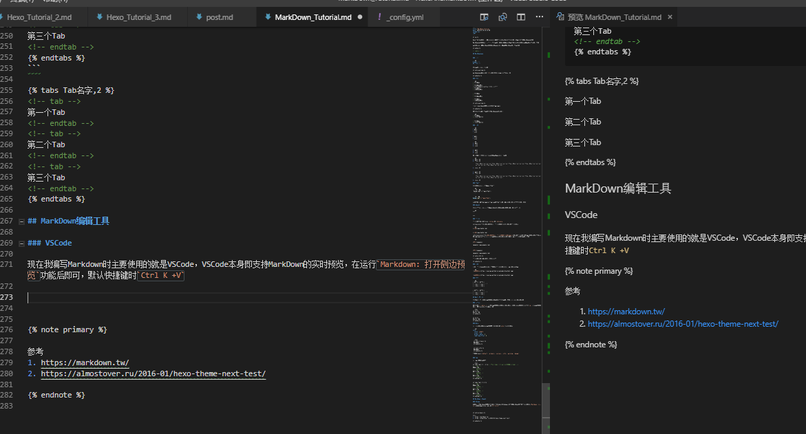
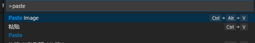
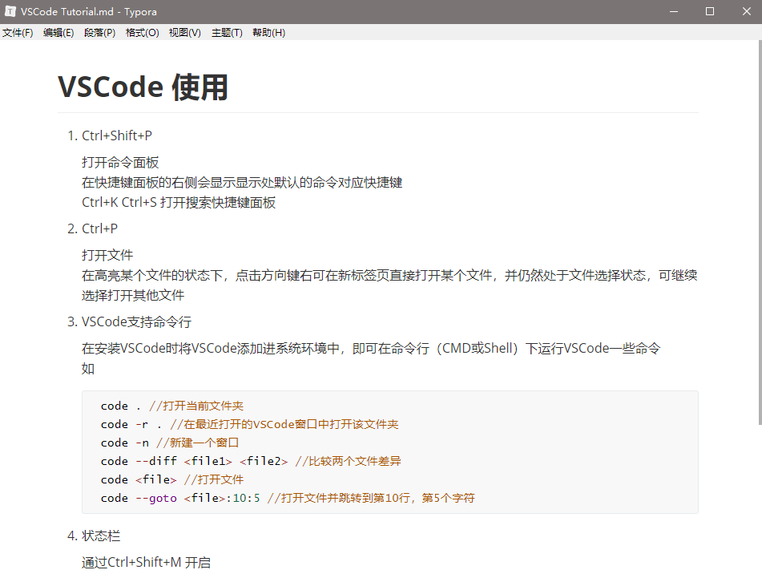
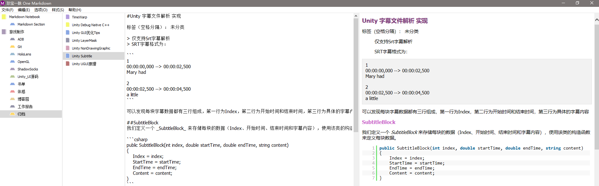
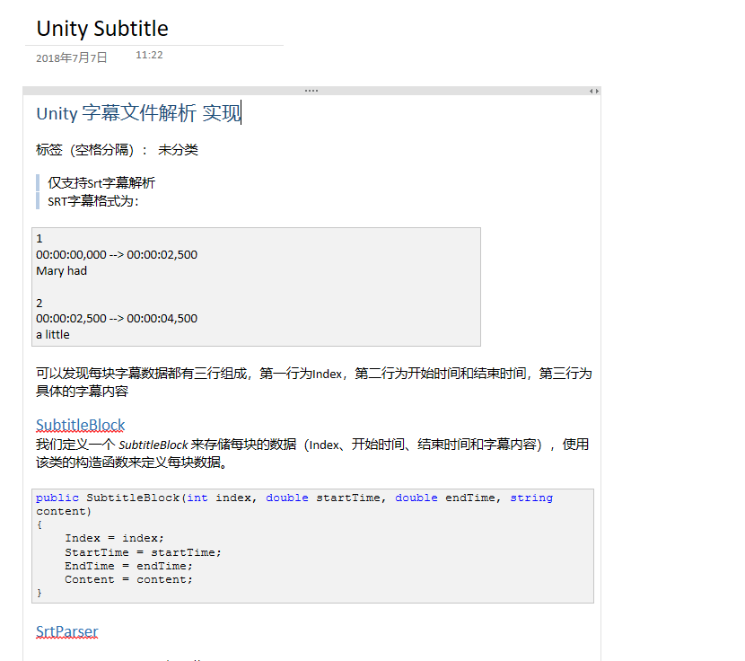



Hexo、Github的项目介绍，简书，有道云笔记，EverNote等等软件和博客网站都支持Markdown语言。

Markdown语言的设计目标是让编写者可以注重文章的内容，以一种较为简单高效的方法完成文章格式的编写。

本篇文章会介绍Markdown比较常见的语法，并介绍一些Markdown的编写工具。



<!--more-->

## Markdown语法


### 标题

```md
# 一级标题
## 二级标题
```

最多可以到六级标题为止



markdown语法符号，比如`#`，后都需要加上一个空格确保生效



### 引用

```md
> 引用内容
>
> 引用内容换行
//这里空了一行就会引起让引用标记中断
> 引用内容
> 这样没法换行
```

> 引用内容
>
> 引用内容换行

> 引用内容
> 这样没法换行



根据markdown语法，所有都需要中间空一行，但上例中没有空行，在Next上仍然换行了。这可能是Next的Bug或Feature，但仍然推荐严格安装markdown语法规则添加空行。



在引用之中我们仍然可以使用Markdown语言，比如

```md
> 引用内容
>> 引用中的引用
```

> 引用内容
>> 引用中的引用

### 清单 

```md
* 一号
* 二号
* 三号
```

* 一号
* 二号
* 三号

```md
1. 一号
2. 二号
3. 三号
```

1. 一号
2. 二号
3. 三号

在清单内如果需要有段落，则要在新的一段前加入tab。

```md
1. 一号清单
2. 二号清单

    二号清单段落段落段落段落二号清单段落段落段落段落二号清单段落段落段落段落二号清单段落段落段落段落二号清单段落段落段落段落二号清单段落段落段落段落

3. 三号清单
```

1. 一号清单
2. 二号清单

    二号清单段落段落段落段落二号清单段落段落段落段落二号清单段落段落段落段落二号清单段落段落段落段落二号清单段落段落段落段落二号清单段落段落段落段落

3. 三号清单

### 代码块

用前后两段三个`来表示一个代码块

```md
/```c# 演示
 Debug.Log("这是一段代码");
```/
```

```c# 演示
Debug.Log("这是一段代码");
```

为了防止演示代码被误认为是一个新的代码块，在演示行前后加了/，实际使用时不需要

### 分割线

用三个***或---或___来表示一段分割线，在分割符号所在行内不能有其他东西

```md
***
```

***

### 超链接

超链接的实现有两种方式,`inline`和`reference`

inline方式，是用[]包裹住需要加入超链接的文字，用()包裹住超链接地址

```md
[百度](www.baidu.com)
```

[百度](www.baidu.com)

refernece方式，是用[]包裹住需要加入超链接的文字，再接一个[]包裹住超链接文字的Tag，再文章的其他地方（最少需要在下一行），通过[]:()来标记tag的地址，以简化多段文字指向同一个超链接的情况的编写。

```md

[谷歌][google]

[google]:(www.google.com)

```

[谷歌][google]

[google]:(www.google.com)



超链接的[]和()符号后都不需要跟空格



### 图片

图片与超链接语法相似，只不过在包裹超链接前的[]前加入一个感叹号即可

```md

```


### 表格

```md
| 分类1 | 分类2 |
| ------- | ------- |
| 数据1 | 数据2 |
| 数据3 | 数据4 |
```

| 分类1 | 分类2 |
| ------- | ------- |
| 数据1 | 数据2 |
| 数据3 | 数据4 |

## Next特定标签

使用Next编写博客时，可以在文章的md文件中使用一些特定的标记来增加文章样式。

### 居中简介

在使用了`<!--more-->`标记后，可以在文章首页增加文章的简介并添加阅读全文按钮，使用`cq`标记则可以在文章简介前后加入双引号，并居中显示简介。

```html

文章简介。

```


文章简介。


### Note

加入更多样式的Note，可以在主题配置文件的`note`字段修改样式

```yml
note:
  style: simple
  icons: true
  border_radius: 3
  light_bg_offset: 0
```

```html
 
 内容内容
 
```

 
 内容内容
 

支持的class有`default`,`primary`,`success`,`info`,`warning`,`danger`


### Tab

加入可切换的tab页面

```html
<!--格式 <tabs 名字,初始状态点第几个tab> -->
<!-- tab -->
第一个Tab
<!-- endtab -->
<!-- tab -->
第二个Tab
<!-- endtab -->
<!-- tab -->
第三个Tab
<!-- endtab -->

```


<!-- tab -->
第一个Tab
<!-- endtab -->
<!-- tab -->
第二个Tab
<!-- endtab -->
<!-- tab -->
第三个Tab
<!-- endtab -->


## Markdown编辑工具

### VSCode

现在我编写Markdown时主要使用的就是VSCode，VSCode本身即支持Markdown的实时预览，在运行`Markdown: 打开侧边预览`功能后即可，默认快捷键时`Ctrl K +V`



如果使用VSCode编写Markdown，推荐安装`Paste Image`插件，该插件可以直接将截图复制进md文件，并且下载到本地。




### Typora

[Typora](https://www.typora.io/)是一个轻量级的专门的Markdown编写工具，我从Typora换为VSCode的主要原因也就是觉得没必要多装一个应用，并非Typora本身存在什么缺陷。



### Onenote + OneMarkdown

我从大学开始是一个OneNote的重度使用者，但无奈目前OneNote不支持Markdown，于是只能寻找一些曲线救国的方法。]OneNoteGem](https://www.onenotegem.com/addins.html)是一个付费的OneNote插件，其中有一个模块叫做`OneMarkdown`。



当使用付费版之后，在OneMarkdown上编辑的页面会自动同步到OneNote上。



OneMarkdown最终的显示效果并不是太理想，所以`Onenote+OneMakeDown`最好只作为数据的归档使用。OneNoteGem在淘宝上有相应的店家，但OneMakeDown因为销量太低没有上架，所以要购买需要单独找店家资讯。




参考
1. https://markdown.tw/
2. https://almostover.ru/2016-01/hexo-theme-next-test/



***
