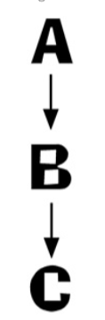
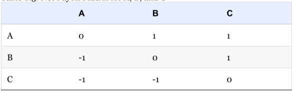
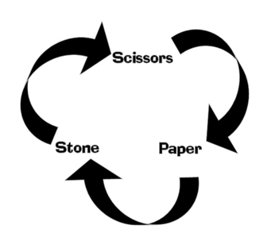



《Andrew Rollings and Ernest Adams on Game Design chapters》 第八章笔记



<!--more-->

# Chapter 8. The Internal Economy of Games and Game Balacning

对于游戏平衡的问题很难有确切的答案，因为游戏平衡中需要牵扯到一个人为因素，即玩家本身。

设计师所考虑的游戏平衡是对于玩家的平均水平而言的，因为游戏很难对于各种水平的玩家都是平衡的。但这也就造成了设计游戏平衡时的一个常见问题，即设计师认为自己的水平即是平均水平，最后制作出一款自己很满意，但是玩家不满意的游戏。

## What is Game balance

一个平衡的游戏，其获胜的主要因素应该是玩家的水平，这不是说平衡的游戏不能有意外因素，但技术好的玩家应该有更大的几率获胜，除非他这局的运气特别特别差。

游戏平衡就是个不断的实验->纠正（Trial-and-error）错误的过程。

对于电子游戏而言，存在太多的变量会影响玩家的体验，即它是一个N维空间的优化问题。一些传统的游戏研究可能并不适合于电子游戏，因为他们太过于简单。在一些其他学科中，有现成的N维空间优化解决技术，但是电子游戏与其他学科不同的点在于它有玩家这个人为因素，即各种变量的平衡并不是一个完全客观理性的数学问题。

反复的实验->纠正很可能是平衡电子游戏唯一的方法。但这个方法很浪费资源和时间，并且有个更严重的问题是，很难定义什么到底平衡的。

这里作者将平衡分为两种静态平衡（Static balance）和动态平衡（Dynamic balance）。

## STATIC BALANCE

静态平衡时关于游戏规则的，即这些规则时如何相互联系，如战争游戏中单位的战斗力，动作游戏中跳跃的距离等等。通常玩家们提及游戏平衡时，它们指的就是静态平衡。

在静态平衡游戏的过程中，设计师需要保证游戏是公平的，所有的元素都是无缝的相互联系，且不会有主导的或者一些隐藏的策略毁坏整个游戏的体验。

### Randomness and Average Values

通常可使用回报矩阵（Payoff matrices）来展示各个元素之间的平衡。如果有B1,B2,R1,R2四个元素，且它们的回报矩阵如下所示：

|     | B1  | B2  |
| --- | --- | --- |
| R1  | 0   | -2  |
| R2  | 3   | 0   |

这表示当R1遇到B1时，两者可能谁都不会占到便宜。当R1遇到B2时，则通常R1会损失2的数值。R2的分析同理。

回报矩阵的关键是，它是一个统计学意义上的值，即上表中的数值并不是针对于一个特定的事件，它是分析多个相似事件后得到的平均情况。

### Dominant Strategies

占优策略（Dominant Strategies）是传统游戏理论中的术语。占优策略指的是指一个策略在所有情况下都能比其他策略更好。其中占有策略还可以进一步分为`强占优策略`和`弱占优策略`，前者是保证这个策略一定会赢，后者是保证这个策略一定不会输。

对于游戏而言，在大多数的情况下要避免占有策略的发生。

下面为作者举得一个占优策略的例子：

|                   | Wife's Birthady | No Wife's Birthday |
| ----------------- | --------------- | ------------------ |
| Buy Flowers       | 10              | 20                 |
| Don't but Flowers | -100            | 0                  |

可以看出，无论那种情况下（是妻子生日或者不是），买花都是一个更好的策略，即买花是占优策略。

如果将这个例子运用到游戏中，就需要通过加上其他的限制来避免其成为占优策略，如给花一个昂贵的售价，那么在非妻子生日时买花就会有一个负得分。

但如之前所述，电子游戏中有太多的变量，对于一个玩家的占优策略可能对于另一个玩家就不是。

一个理想化的解决方法是模拟一个完美的玩家，这个玩家只会做出最优的解，然后用来完美玩家进行测试，避免占优策略的出现。但是这个方法还是与现实有误差，这个方法是一个数学层面上的解决方案，但因为几乎所有的玩家都不会是“完美玩家”，因此对于实际游戏的参考价值并不是很大，大多数的游戏都无法列出一个完整的回报矩阵。

在游戏中，通常会有三个原因造成占优策略的发生：
1. 战术导致，如RTS游戏中，当近点时Rush通常会有很好的收益
2. 不平衡的单位，如一个单位设计的过强，只要生产该单位就大概率能获得胜利
3. Bug，金手指之类的方法，将直接破坏游戏平衡

游戏中的占优策略能让玩家更容易的获得胜利，但是对于大部分的玩家而言，游戏是为了乐趣而不是为了赢。

### Symmetry

对称（Symmetry）是最简单的平衡游戏的方法。

如象棋，开局时双方的棋子类型，位置是完全一样的，这造就了游戏的平衡。但是像象棋这样的镜像对称通常只能运用于一些抽象概念的游戏中，因为这种对称会让玩家觉得不自然和一定程度上的无聊。

但是体育模拟游戏又是一个例外，因为即是在现实生活中，很多体育游戏都是对称的（同意的人数，同意的人员分配）。

要注意的是，游戏中的对称指的是功能上的对称，而不是完全的一样，如体育游戏中，双方都有2个后卫，但这两个后卫的能力可能是不一样。

RTS游戏中对称平衡，如一个玩家开局被山包围，另一个玩家开局被水包围等等。

对称的平衡方式消灭了平衡中的许多变量，简化了平衡工作，但是这也容易导致玩家的行为受限于某种方式，让游戏不再有趣。

### Transitive Relationships

传递关系（Transitive Relationships）定义了多个元素之间一种单向的关系。如下图所示，A能打败B，B能打败C

这种关系的回报矩阵如下：

传递关系在游戏中非常常见，如FPS单机游戏中，玩家的装备越来越好，怪越来越强。这些装备之间形成了传递关系，怪物之间也形成了传递关系，即游戏后段的武器和怪物无疑可以轻易打败游戏初期的武器和怪物。

传递关系在游戏中主要是为了鼓励玩家持续的推进游戏进度。在游戏的过程中，玩家会越来越强，但这个传递关系也会有一个重点，如玩家的死亡或游戏结束。

还有一种三元的非传递关系（three-way intransitive relationship），最简单的例子就是游戏*石头剪刀布*，如下所示：

回报矩阵：

|          | Scissors | Paper | Rock |
| -------- | -------- | ----- | ---- |
| Scissors | 0        | 1     | -1   |
| Paper    | -1       | 0     | 1    |
| Rock     | 1        | -1    | 0    |

石头剪刀布是一个零和的游戏，但是游戏也可以设计为非零和的游戏。

这种非传递关系相较于传递关系更有趣。但是它很容易被玩家找出规律所在，然后玩家可能就会通过某些策略来规避这种关系，所以通常在游戏中需要用其他元素来包装这个关系，或者说关系在游戏中可以动态的发生变换。

### Trade-Offs

权衡（Trade—Offs）在游戏中也是一个非常常见的元素。它是指某一个元素一方面比另一个元素好，但是另一方面又不如另一个元素。

如游戏中常出现的数显就是权衡的设计，就是力量，敏捷，智力三个属性。玩家在升级后，可以选择其中一个属性进行加点。

通常来说，设置用来进行权衡的元素是需要相互独立（orthogonal）的，否则玩家的选择就没有意义。如一个属性表示质量，另一个属性表示浮动力，这两个属性实际上是相关的，玩家选了其中一个就会很大程度上影响另一个。

同时，也要保证多个用来权衡的元素，相互之间的收益的相等的，虽然它们的收益体现在不同的方面。

### Combination

有些情况下，当平衡游戏时，多个单独的元素可以组合在一起视作同一个元素，一起来平衡，如RTS游戏中的兵种组合。

通常来说，如果每个单独元素在设计时平衡的很好，那么它们组合在一起后，平衡也不会太差。

### Emergence

出现（Emergence）是一系列简单的规则组合成一个复杂的结果。在现实生活中，也有许多Emergence的元素，看，听，触摸这些简单的规则构成了生活中大部分的复杂行为。

如在第八章中作者定义的，游戏是一个模拟环境，受限于硬件和软件的实现，游戏世界不可能将现实生活中所有元素都包含进来，通常游戏只会包含一部分的元素。

但是优秀的游戏，应该让这些被包含进的元素可以被完美的运用，让它们能组合成一个复杂的情况，这就是Emergence的魅力。如塞尔达传说，马里奥都是很好的运用Emgerence的例子。

当然Emergence也有缺点，如果被包含进来的元素并没有完全被利用，那么这些仅含的元素就会变成玩家仅有的玩法，游戏就会变得无趣。另外如果某一个元素不平衡， 则很可能导致占优策略。

### Feedback Loops

关于反馈系统，在`《Rules of Play》 第十八章笔记`有详细说明。

反馈系统是静态平衡与动态平衡的交界线，它开始时的状态是静态平衡的，但是运行后就是动态平衡了。

### Summary of Static Balance

静态平衡时关于游戏规则，游戏初始状态下的平衡。

动态平衡则是关于玩家与游戏系统交互的平衡。

## DYNAMIC BALANCE

动态平衡可以分为两种，第一种是消极平衡，第二种是主动平衡。
1. 消极平衡是指修改系统，让系统始终对于玩家而言是平衡的，而且平衡点不会改变
2. 主动平衡是指针对于玩家的行为，动态的修改平衡点。

### What are we balancing？

但无论是哪种平衡，其关键都是重新在平衡点处构成平衡。

平衡游戏的目的是让游戏公平且统一，不会允许玩家去找出错误或游戏的弱点来获取额外的优势。

一个游戏应该保证在初始时是平衡的（通过静态平衡设置的各种规则，在运行时通过动态平衡也保证平衡。

通常动态平衡有以下三种平衡方式：

1. 恢复平衡
2. 保持平衡
3. 摧毁平衡构建新平衡点

### Restoring a Balance

如果玩家的目标是恢复平衡，那么游戏的目标就是让游戏系统重回平衡点。游戏系统中会有力量创造出不平衡状态，但是当玩家介入后，这个力量应该消失或者变得微弱，让玩家可以重新将系统变为平衡。

如拼图游戏，就是一个从混乱状态（不平衡），通过玩家的操作逐渐恢复平衡的过程。

### Maintaining Balance

如果玩家的目标是保持平衡，那么游戏的目标就是阻止让游戏不平衡的力量。

如俄罗斯方块，在一开始的游戏状态是整洁的，玩家的行为就是不要让新出来的方块破坏平衡。在游戏的过程中，破坏平衡的力量会越来越强（方块下落越来越快），这就对玩家构成了挑战。

### Destroying a Balance

如果玩家的目标是破坏平衡，那么游戏系统就会尝试去恢复平衡（玩家和系统的角色与在`恢复平衡`时的角色相反）。

注意这个破坏平衡，并一定指从平衡状态变为混乱状态，它也可以是从一个平衡状态变为另一个平衡状态。

如一个RPG游戏，游戏开始的设定是外星人统治了世界，这已经是一个平衡的状态了，玩家的任务就是让这个世界变为人类统治的世界（变为另一个平衡状态）。

## Balanced Systems

游戏平衡的目标是为了保证玩家的游戏体验，可以从以下几个角度分析：

1. 提供一个恒定的挑战
2. 给玩家一个可预料的，公平的游戏体验
3. 防止停滞（Stagnation）
4. 防止琐事（Trivialities）
5. 允许设置不同难度（可选）。

### Providing a Consistent Challenge

一个游戏的难度应该在玩家进行时平缓的增加，但有些游戏违背了这个规则，游戏的难度在中途比游戏后期更难，这种设计很容易让玩家在中途过后，突然觉得游戏变的无聊。

### Providing a Perceivably Faip Playing Experience

玩家享受游戏的一个重要原因就是玩家是否觉得这个游戏是公平的，可预测的。这里的公平指的是玩家觉得是否公平，而不是要求游戏本身绝对公平。

游戏中可以设计一些欺骗的行为，如当玩家处于最后一名时，倒数几名的赛车速度会慢下来。但是这种欺骗行为不要让玩家意识到。

另外游戏中，如果某些事情会让玩家没有胜利可能，那么这些事情应该在早期就让玩家知道，或者透露出足够的线索。如游戏最后需要一把钥匙开门，在游戏前期就需要通过某些方法告诉玩家要去寻找钥匙，而不是到了最后玩家发现自己只能重新读档。或者玩家知道最后需要某个东西开门，但是设计并没有给出这个东西的线索，需要玩家自己去猜是需要钥匙，还是魔法书，一旦猜错只能读档重来。

这里的关键就是让游戏的推进是利用玩家已知的知识和信息。如果一个游戏，玩家必须通过攻略或重新读档这样的方式才能进行，那么这个游戏的设计是失败的。

另一个重要的保证玩家觉得游戏公平的因素，就是保住新玩家。当新玩家加入游戏，并被有经验的玩家屠杀时，很容易就觉得这个游戏不公平。通常很多游戏提供的单人模式就是为了保护新人玩家，给新玩家一个练习自己技术的地方。

游戏中的死亡也是一样的道理，通常来说，如果一个玩家失败了，他应该要明确的知道自己死亡的原因，即这个原因是可控的，即玩家需要有方法可以避免死亡。

### Avoiding Stagnation

停滞在游戏中是一个很恼怒的状态，指的是当玩家在游戏中抵达了一个进度，然后不知道自己该如何推进。

在很多情况下，停滞是很难被避免的，因为不同玩家的思考能力，探索能力是不同的。但这个可以通过平衡来解决，如当游戏发现玩家在一个地方停留了太久后，给出多余的提示等。

### Avoiding Trivialities

琐事指的是，玩家需要做出大量的零碎的决定，而且这些决定对于游戏的最终结果没有明确的影响。

的确有的游戏会通过零碎的决定让玩家更有参与感，但是这些选择应该是可选的，即玩家是自愿去做琐碎的决定，而不是被强迫去做。

RTS游戏中也存在许多细小的决定，如决定每个单位如何行走等。但是这些决定对于最终的游戏结果是有影响的，所以不算是琐事。

### Setting the Difficulty Level

游戏玩家第一次接触游戏的平衡工作，就是选择难度。通常来说，难度会分为四个等级，简单，正常，困难，噩梦。

网络游戏中通常没有难度选择，它们通过将不同的玩家进行分割来处理难度水平（处于不同的地图，处于不同的天梯等级）。
   
还有一些游戏会通过动态调节游戏难度，如当玩家表现很差时，降低游戏难度，让表现很好时增加游戏难度。但这个方法有两个缺点。第一，会给玩家造成被欺骗感，第二，玩家可能利用这个规则，如故意表现得很差降低游戏难度。

通常来说，单机游戏中的难度选择会通过两种方式改变难度，敌人更强或者敌人更多。如简单难度每过一关，敌人数目增加5%，正常难度每过一关，敌人数量增加10%。

现在的一些单机游戏，还会通过让敌人更聪明来增加难度，即修改AI的表现。

## Tools For BALANCING

### Design for Modification

当设计游戏时，应该是面向修改设计的。

为了能更好的修改，通常先设计游戏规则，再设计游戏运用这些规则的元素。一旦规则被平衡了，修改其中的元素不会让平衡效果偏差的太过于严重，在规则的限制下，这些元素也不会相互干扰。

如之前所述，游戏平衡工作是一个反复试错的过程，在修改元素或规则来进行平衡时，要记得控制变量法

### Design Prototyping

在开发一款游戏前，应该先开发一个游戏的模板，最好用一个简单的程序语言进行开发。

### Future Potential

因为手动的进行参数的平衡并不高效，未来可能会有自动手机玩家数据，然后进行参数调整的平衡方法。如发现某一个英雄被玩家使用的过多，且胜率很高，自动下调这个英雄的一些属性。



引用：

1.*Rules of Play* 2003



***