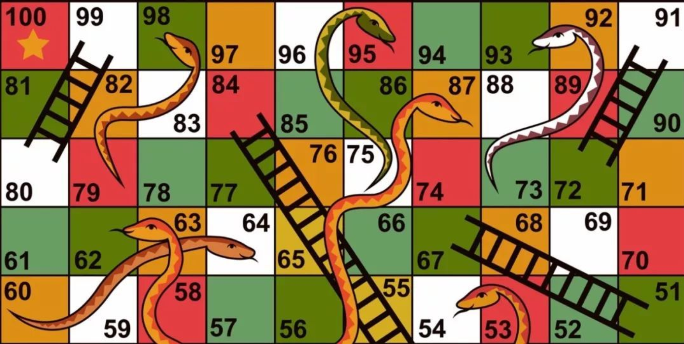
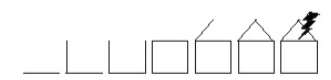



《Rules of Play》 第十五章笔记

这一章中，作者区分了宏观层面和微观层面的不确定性。

再将不确定性分为三种`certain`，`uncertain`，`risk`。

之后通过两个例子说明，不确定性如何结合到游戏中。

最后提出了数学层面上的概率与玩家体会到的概率之间是存在差距的。



<!--more-->

# Chapter 15: Games as Systems of Uncertainty

## Introducing Uncertainty

不确定性是每个游戏的核心特征。正是有位对游戏结果的不确定性，才能给玩家目的感，如果游戏的结果是确定的，那么玩家何必要玩呢？玩家的行为并没有造成任何的区别，换句话来说，不确定性一定程度上提供了游戏的意义。

游戏的不确定性可以从两个层面表达：

1. 宏观层面（Macro-level）：游戏总体的结果的不确定性
2. 微观层面（Micro-level）：游戏中设计的特定行为的结果

“不确定性”这个词本身表示了随机性和机会，但这并不意味着只有那些包含随机性（如色子）的游戏才有不确定性，由技能主导的游戏同样有不确定性（围棋的胜负是不确定的）。

所有游戏在宏观层面都提供了不确定性，但是在微观层面并不是都提供了（如围棋）。

## Certainty，Uncertainty，and Risk

数学家Richard Epstein在*The Theory of Gambling and Statistical Logic*一书中将所有的赌博行为都描述为是一种决策，而决策又可根据行为与结果之间的关系，分为三种：`不确定（uncertainty）`，`冒险（risk）`，`确定（certainty）`。

1. 确定
   一个完全是`确定`的游戏很难称作为游戏，因为结局已定，玩家的行为没有任何影响，玩家也很难感受到快乐。
2. 冒险
   `冒险`也是用来描述不确定的情况的，只不过在这个情况，玩家对于不确定性的信息是了解的，如知道概率等。如丢硬币游戏就是冒险游戏，虽然最后的结果不知道，但是玩家知道每个结果发生的概率都是50%。
3. 不确定
   剩下的`不确定`分类中，玩家对于当前的不确定情况不知道任何信息。如随机加入一场网上的围棋比赛，在比赛前对手的实力是完全不确定的，他可能是一个职业选手，也可能是个完全的菜鸟。

大部分的游戏都是`冒险`和`不确定`的结合。

## The Feeling of Randomness

玩家的不确定感并一定来自于游戏中的随机事件。

如跳棋，虽然游戏中的每一步都是玩家自己的选择，但是如果你在别人的回合时闭上眼镜，然后只在自己的回合睁开。
    a. 对于经验不丰富的玩家，睁眼时的场景会有不确定感，因为他无法从游戏的场景中抽取出逻辑，当前的情况对他而言就如同是随机的。
    b. 对于经验足够丰富的玩家，他或许就可以从这个场景中猜测出前面的其他玩家做出了什么行为，对于他而言这个实验就没有不确定感。
    
上述例子中，玩家的不确定感是来自于玩家自己的经验，而不是游戏中的随机设计。

游戏中是否让玩家有随机感比游戏中是否真的有随机因素更重要。如果一个游戏完全没有随机感，那么玩家可能会觉得很无聊，或者觉得竞技性过强。如果一个游戏随机感过多，玩家可能就会觉得游戏很混乱。但无论是什么情况，最重要的都是让玩家的选择是有意义的，即使没有随机感，也要让玩家能通过技巧改变结果，即使很混乱，也要让玩家觉得可以通过某个策略来改变结果。

## Probability in Games

这一节是针对微观层面机会的研究。数学上对于不确定性的描述为“概率（Probability）”。

对于概率的研究，有一定的矛盾感：

1. 概率本身给游戏带来了随机感和混乱，即增加了不确定性
2. 对于概率的研究却让玩家知道了不确定性的本质，即从uncertain像risk转变，减少了不确定性

## Dice Probability

这一节作者首先推导了一个色子筛出各点数的概率，又推到了两个色子筛出各点数的概率，这里不赘述。

之所以要求得不同情况的概率，是因为对于概率的了解与玩家的决定与玩家游戏时的结果是相关的。

如两个色子筛出7的概率最大，通常大富翁棋盘有40格。这意味着6轮游戏后很可能就有玩家走到了第二圈，这时候游戏就会出现踩到别人财产付租金的情况了。

## Change and Game Play

对于那些完全由概率决定的游戏，玩家对于游戏的结果本质上是没有任何控制性的，游戏的结果纯粹由概率决定，玩家只能被动的接受游戏的结果。Rogor Caillois认为这样的游戏是没有意义的，但实际上许多完全由概率决定的游戏很有趣，最简单的就是丢硬币。

这里作者给出了两个具体的例子帮助分析，第一个是蛇梯棋（Chutes and Ladders），如下图所示：

在蛇梯棋中，玩家不需要做任何决策，他要做的只是扔色子，然后移动相应的步数（碰到梯子的下段，则自动移动到顶端，碰到蛇的头部则自动滑落到蛇的底部）。

虽然游戏是完全由概率决定的，但是梯子和蛇这两个元素的存在，让玩家前进的速度不再是只有色子决定，即增加了许多的意外因素，而玩家对于意外因素的渴望就构成了乐趣，掷色子的意义变为了“遇到梯子，避免蛇”。

同样的还有彩票，彩票本质上也是个纯粹概率游戏。玩家需要选取一个彩票形式（刮刮卡还是双色球），以及选取一个数字。虽然这个选取过程严格意义上来说是没有意义的，无论怎么选结果都是完全由概率决定。但是这个选取的过程，让玩家对于纯粹的概率游戏有了“参与感”，会有寄托于自己好运的感觉。

因此meaningful play也不一定完全来自于玩家的策略选择与对应的结果，也可能来自于运气的假象。

这里作者给出了两个使用概率来增添游戏趣味性的例子，第一个是*雷暴*，第二个是*小猪*

### Case Study One： Thunderstorm

*雷暴（Thunderstorm）*是德国很著名的家庭游戏。

这个游戏是多人参加，通常4-8人比较合适，需要六个色子。
    a. 第一个玩家丢出所有的色子，如果其中出现了1，则安全通过，将所有是1的色子取出，将剩下的色子顺时针给下一位玩家。如果玩家丢除的色子中没有1，则在自己面前画一笔房子，然后将色子传给下一位玩家。
    b. 如果某个玩家面前的房子已经完成，且又遇到了没有丢出1的情况，则该玩家被淘汰。
    c. 当只有一个玩家时，游戏结束，剩下的玩家为胜者。

房子如下所示：

雷暴这个游戏也是个纯粹的运气游戏。但是这个有趣的点在于每一轮玩家拿到的色子数量是不确定的，第一个玩家有6个色子，所以色出1的概率很高。之后随着游戏的进行，将色出过1的色子逐渐拿走，很可能之后的玩家只有一个色子，此时色出1就很困难了。

在游戏中，每个玩家的概率是由之前玩家的结果决定的，这提供了一定的戏剧性并且会有紧张的气氛在（每个人都不希望他前面的玩家色出很多1）。这种戏剧性和紧张氛围赋予了游戏的意义。

### Case Study Two：Pig

小猪（Pig）也是多人参与，通常3-5人比较合适，需要一个色子。
    a. 第一个玩家丢出色子，色子的点数即为获取的分数。玩家可以选择继续丢色子，然后累加获取的分数。但如果丢出了1，则这一轮累加的所有分数清零。玩家也可以选择不丢色子，那么这一轮获取的分数就会记录在本子上。
    b. 当上一个玩家选择不丢色子后，色子顺时针给下一个玩家，重复上述操作。
    c. 直到某一个玩家分数到达100分，游戏结束。该玩家会获胜者。

小猪游戏中玩家需要做出决策（继续丢色子，还是放弃），每个决策的结果是不可控的，是由概率（玩家可以算出概率）决定的，选择继续丢可能加分也可能失去这一轮所有分数。

游戏的趣味性来源于玩家的决策和概率之间的抗衡，随着丢色子的次数越来越多，丢出1的概率也就越大。玩家此时的决策也会更加的困难，这也会增加紧张气氛。这种抉择和紧张气氛赋予了游戏的意义。

## Breakdowns in Uncertainty

这一部分作者讨论了一些概率元素最终并不没有像设计师预想的那样工作的情况。

### Breakdown 1: Computer Randomness

实际上计算机并不能产生随机数字，所有产生随机数的程序都是伪随机。但是对于大部分的游戏设计来说，计算机产生的伪随机数也足够用了。只是设计师要记住，计算机生成的随机数有时是会出错的。

比如理想上1-100的随机数，出现的数字是均匀的分布在1-100之中的，但可能因为程序的出错，在每个区间的数组出现的概率特别大。

### Breakdown 2：Strategizing Change

第二个要注意的是，玩家会不会通过某种策略将改变了原先的随机事件想要达成的效果。例如小队中的成员在个特定时间段随机一位受到伤害，玩家会不会通过在特定时间前踢出一些弱小玩家，来避免他们收到伤害。

### Breakdown 3： Probability Fallacies

概率存在一些谬论（Fallacies），即玩家理解中的概率，和真实的概率可能是不一样的。

以下是一些常规的谬论：

1. 高估大赌注（Overvaluing the long shot）：即对于低可能，但是高回报的项目会有过多的自信，即会更倾向于选择低可能高回报的项目，而不是选择一个更安全的项目。
2. 认为概率是累加的（The tendency to think of successive chance events as additive）：一个色子时丢出1的概率是1/6，但是丢出2个色子时出现1的概率，并不是2/6,而是11/36。
3. 蒙特卡洛现象（The Monte Carlo Syndrome）：即认为上一次的事件会影响下一次的事件。但实际上多次没有丢出6，和下一次丢不丢出6并没有关系。
4. 过度关心好结果（Overemphasis on good outcomes）：人们会高估一个好结果事件发生的概率。中彩票和被车撞实际上概率时差不多的，但是人们会更相信自己能中彩票而不是被车撞。
5. 雷击两次现象（Lightning striking twice）：和蒙特卡洛现象类似，人们也会倾向于认为好事成双和低概率坏事不会多次发生（连续被雷击中），但实际上一个事件发生的概率和之前事件并没有联系。
6. 好运（Luck）：纯粹从数学角度来说，并没有好运这个东西。

上述的每个谬论对于设计而言都是一个重要提示，比如设计师给了玩家两个选择，一个是低可能高回报，一个是低回报高可能，设计师就要预见到玩家会更倾向于选择前者。设计师的设计目标玩家感受到的随机性，而不是真实数学意义上的随机性。

同时上述提及的三个概率方面的破坏（Breakdown），实际上也可以被运用。针对电脑伪随机，是否可以以此作为灵感，故意设计一个不是那个平衡的随机方法。针对策略规避概率，是否故意的允许玩家去采取某些策略。针对谬论，是否故意设计一个运气系统，虽然运气在理性层面上是不存在的。

## Meaningful Chance

几率存在的意义并不是单纯的增加不确定性。它是要给玩家好处，或者坏处，或者某种信念，如“我希望得到xxx”，“我猜我能得到XXX”等等。



引用：

1.*Rules of Play* 2003



***