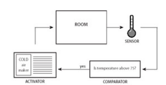
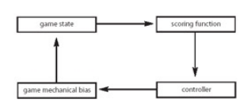



《Rules of Play》 第十八章笔记

这一章作者将游戏看作是一个控制系统。

主要介绍了游戏中的正反馈和负反馈。



<!--more-->

# Chapter 18: Games as Cybernetic Systems

## Introducing Cybernetic Systems

这一章回简单的介绍控制论（Cybernetic），主要关注于游戏运行时系统的变换，和游戏中哪些形式上的结构让这些改变发生。

## Elements of a Cybernetic System

控制系统的概念是指一个系统的输入和输出会由系统内部的结构自行调整。通常的系统的输入是对于环境的检测，而输出是系统做出的行为，即如何去改变环境。

一个控制系统包含三个元素：传感器（Sensor），比较器（Comparator）和催化器（Activator）。一个控制系统由这三个元素构成一个闭环，传感器接受环境信息，比较器比较环境环境信息决定要做什么改动，催化器做出具体的改动影响环境，环境由会进一步被接收器感知，即构成了一个闭环。也因此控制系统有时也会被成为反馈系统（Feedback Systems）和反馈循环（Feedback Loops）。

控制系统最常见的应用就是温度控制器，如下所示：

一个控制系统可以是正反馈的，也可以是负反馈的。

1. 正反馈系统（Positive）：
    系统持续性的向一个方向变换。如传感器接收到温度后，比较是否大于30°，如果大于则加热。这样房间的温度就会越来越热。
    正反馈系统的效果是累加的（Cumulative）。
2. 负反馈系统（Negative）：
   负反馈系统是朝相反方向变换。如传感器接收到温度后，比较是否大于30°，如果大于则开始降温，如果小于10°则开始加热，这样房间的温度保持在一个区间之内。
   负反馈系统的效果是平衡（Equilbrium）。

## Feedback Systems in Games

在游戏中，控制系统如下所示：

其中
1. 游戏状态（Game state）表示游戏当前的状态，如格斗游戏中的血量，玩家的位置，战斗的地图等等。这是一个完全的游戏常规元素的理解，即不会包含玩家的技能，情绪，经验等等信息。
2. 评分方法（scoring function）表示状态改如何被测量，如玩家的血量如何体现是长度还是数字。评分方法等同于传统控制系统中的传感器。
3. 控制器（Controller）表示系统中查看评分方法的结果，并决定要采取什么操作，等同于传统控制系统中的比较器。
4. 游戏调整方法（Game mechanical bias）表示游戏中调节状态的方法，等同于传统控制系统的催化器。

如在一个赛车游戏中，可以通过嵌入反馈系统来决定下一轮时的发车位，如果前一轮的第一名处于最前方的发车位，那么就是正反馈系统，反之如果成绩越差的车手发车位越靠前就是负反馈系统。

## Positive and Negative Basketball

这里作者以篮球游戏作为例子来帮助分析正反馈系统和负反馈系统。

在正反馈系统的实现下，如果两个队伍的分值每相差5分，分数高的队伍会增加一名球员。这样随着比赛的进行，分数高的队伍球员会越来越多，即优势越来越大，比分差距会扩大。
在负反馈系统的实现下，如果两个队伍的分值每相差5分，分数高的队伍会失去一名球员。这样随着比赛的进行，分数高的队伍球员会越来越少，他们也就越来越难打，这样比分差距会收拢。

## Racing Loops

这里作者以两个实际的游戏例子说明通过不同思路实现的负反馈系统。

第一个是索尼平台上的赛车游戏*Wipeout*，这个游戏实现负反馈是通过修改游戏元素的属性。

在游戏中电脑控制的赛车速度是会被调整的，如果玩家处于第一名，那么第二名的赛车速度会上升尝试追上玩家。如果玩家处于最后一名，那么最后面的几辆车速度会降低，让玩家可以追上。

这样的负反馈系统，保证玩家与电脑控制的赛车之间差距不会过大。

另一个例子是任天堂的*Super Monkey*，这个游戏是通过玩家的能力。

在游戏中，玩家可以减去道具干扰其他玩家。跑在前方的玩家更有可能收到其他玩家的攻击，而跑在后面的玩家则有更高的几率捡到加速道具。

这个负反馈系统同样保证了玩家之间的差距不会过大。

如之前所述，游戏的结果需要是不确定的，这样游玩才有意义。这上述两个例子通过负反馈缩小玩家之间的差距，都是让游戏的结果不确定，不然的话跑在前面的玩家大概率就是获胜者，对于之后的玩家而言游戏就是无意义的。

## Positive Feedback in a Game

正反馈系统出现在许多格斗游戏中。如被攻击的对象会出现硬直，这样就会收到更多的攻击。

正反馈会提供一个戏剧性的结果，一个细微的差距可能就会导致巨大的差异，因此让游戏更为紧张。

但是正反馈必须有终止条件，不然玩家在开局收到一次攻击后，就会硬直，并不断的收到攻击，那么游戏就没法进行了。

在格斗游戏中的击飞效果，就是这个终止条件。当收到攻击的对象承受了足够大的伤害后，就会被击飞，击飞时攻击的玩家就无法继续攻击，这样一次正反馈就结束了。

还有的游戏是通过策略等方法来补偿正反馈。如魔兽争霸中，拥有更多金矿的玩家会有更多的经济收入，那么就会有更多的士兵，也就导致优势会不断的扩大。但是弱势的一方却可以通过战术来终止优势方的优势扩大，如进攻分矿。

## Dynamic Difficulty Adjustment

动态难度调节（Dynamic Difficult Adjustment，DDA）根据玩家的表现使用反馈系统来调整游戏难度。

游戏难度在不同的玩家之间很难平衡，经验丰富的玩家对于同一个难度可能觉得无聊，而这个难度对于新手又可能觉得无法突破。

顽皮狗的游戏*古惑狼（Crash Bandicoot）*中使用了DDA来动态的调整游戏难度。即当玩家在一个点反反复复死去后，游戏会自动做出调整，如出现更多的帮助道具，出现更少的怪物等。同理，但玩家的游玩过程过于顺畅，游戏也会相应变难。

但是DDA是一个非常刻意的调整，很可能会损害玩家的游戏体验。玩家经过了反反复复的练习，变得更加数量，想要快速的通过游戏，结果游戏却相应的变得更难，这对于玩家而言有一种欺骗感，感觉自己是在“被游戏玩”。

## A Simple Die Roll

游戏的反馈系统，也可以仅仅通过一个规则来实现。

如在游戏*蛇梯棋*中，接近重点的玩家，必须准确的丢出距离终点步数的色子数。

这个规则就是一个负反馈系统，它潜在缩短了落后玩家与第一名玩家的距离。只要第一名玩家不色出那个确切的点数，他就永远无法获胜。

如果没有这个负反馈系统，那么蛇梯棋在某些时间点就会变得没有意义。例如第一名玩家距离重点只有两步，而落后玩家距离重点还有20步，此时游戏的结果就已经是确定的了。即使第一名玩家每次都色出1，两回合后也能胜利，而两回合的时候对于落后20步的玩家，是不可能追上的。

注意，这个严格意义上不是一个控制系统，因为没有传感器，比较器，催化器的元素存在。但它的思想仍然是控制系统其中负反馈的思想。

## Putting Feedback to Use

反馈系统可以帮助平衡游戏。以下是正负反馈特点的总结：

1. 正反馈系统
   a. 让游戏结果不稳定
   b. 让游戏时间缩短
   c. 放大胜利果实
2. 负反馈系统
   a. 让游戏结果稳定
   b. 让游戏时间延长
   c. 缩小胜利果实

太多的正反馈会让一个游戏结果失控，一旦玩家获取到了一点优势，优势会不可控制的持续扩大，直到游戏结束。
太多的负反馈让游戏太过无聊，玩家获取到的优势会因为各种原因丧失，这样双方的差距始终无法拉开。

平衡正反馈和负反馈是创造meaningful play的关键。一个优秀的游戏设计应该让游戏过程自始自种都是有意义的，即优秀的玩家其优秀的行为是有意义的，能获取到回报，但是对于落后的玩家而言，他们同样有机会去翻盘，让他们在落后时的努力也存在意义。

同时要注意的是，不要过多的加入反馈系统，如之前所述，它可能会造成玩家的被欺骗感。例如如果一个玩家的赛车无论跑的多快，由电脑控制的第二名的赛车都能跟在玩家背后，那玩家的努力的意义在哪？

控制系统会一定程度上剥夺玩家对于游戏的控制，而控制感又是玩家游戏乐趣的一大来源。但实际上这两者并不矛盾，玩家的控制感和玩家是否真的完全控制游戏并不存在必然关系。如同之前章节中，不确定感也不一定来自不确定的随机一样。Meaningful Play针对的是玩家的感受，而不是游戏的规则。

## Afterword： Don't Forget the Participant

控制系统在学术上还分为，第一类控制系统和第二类控制系统。其中第一类控制系统完全由自身决定，而第二类控制系统还由旁观者决定。

这一章中提到的控制系统为第一类控制系统，但如果考虑到了游戏的文化层面或其他社会层面，则控制系统可能会受外界因素的干扰，成为第二类控制系统。



引用：

1.*Rules of Play* 2003



***