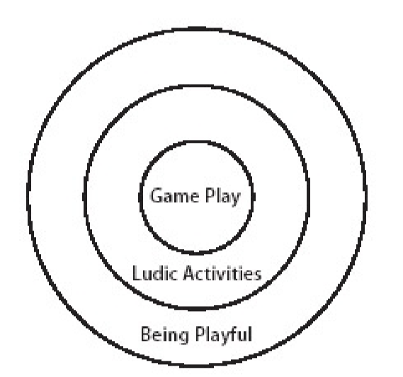
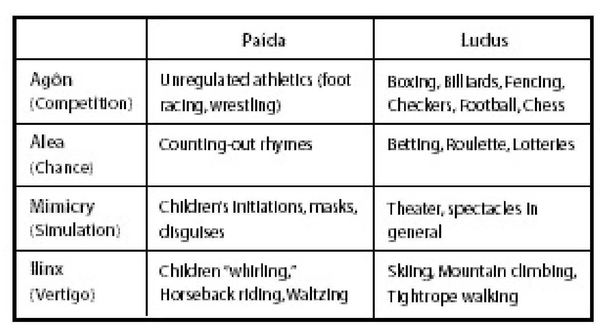



《Rules of Play》 第二十二章笔记

22.1节作者规则和玩在游戏中的关系。
22.2节作者尝试解释玩是什么，并给出了玩的三个分类：
22.3节作者给出了玩的定义
22.4节作者解释了Transformative Play的概念
22.5-22.7节，作者分别对玩的三个定义进行分析。



<!--more-->

# Defining Play

## Introducing Play

`玩游戏`这个操作在玩家体验到游戏的规则时就发生了。

从形式角度来看，游戏中的规则构成了游戏内核的关键。但是把游戏仅看作是形式系统是很危险的事，游戏设计者要意识到设计游戏的最终目的并不是设计游戏规则，即使这些规则很有创意或者很优雅。

游戏规则仅仅是用来创建玩这个过程的，如果游戏设计者拘泥于去设计优雅的游戏规则而忽略了玩家的感受，那么这个设计者就是走错了方向。玩游戏的时的体验才是游戏的灵魂。

在玩游戏时，应该是将游戏作为一个体验和获得快乐的系统。

## What Is Play

作者在这一节尝试解释玩是什么。

心理学家J.Barnard Gilmore在*Child's Play*一书中说，“即使不是所有人都能在什么是玩耍上达成共识，但是所有人都在准确的知道什么不是玩耍。”

首先作者回顾了在第七章中定义的游戏和玩的两个可能关系：

1. 游戏是玩的子集：如扮演医生或追逐打闹就不属于游戏的范畴
2. 玩是游戏的一部分：除了规则和文化，玩是游戏的重要部分。

这两个关系都是正确的，第一个是个描述性的区分，把游戏作为正式世界中所有的关于玩的集合的一部分。第二个是为概念性的区分，把玩描述为游戏中的一部分。

作者之后又提出，在英文中，`Play`一词覆盖的范围是非常广的，还有些情况都不适合于玩耍或游戏这两个范围。因此作者将`Play`一词描述的活动分为三类：

1. 游戏（Game Play）
   玩游戏是一个比较狭窄的分类，是那些符合第七章中定义的活动。
2. 玩耍活动（Ludic Activities）
   Ludic一词来源于拉丁语Ludus,即意为玩。玩耍活动包括的不仅仅是游戏，如小猫玩毛球，两个人互相丢飞盘等都是玩耍活动。这种活动并没有一个可量化的结果系统，因此不能算是游戏。
3. 好玩的（Being Playful）
   这是一个最广的分类范围，它不仅仅是包含传统意义上的玩耍活动，还包括脑海中好玩的想法，而这种想法最终会投射入某种活动。如取外号或打油诗，就是一种对文字的玩耍。

上述三个活动分类的结构如下：

## A General Definition of Play

这里作者给出了玩的定义，上述三个定义的活动都能套入这个定义：

**玩是在一个严格结构内的自由活动**

即玩是一个系统的体现，它体现了这个系统结构下还能自由活动的范围。

对于上述的三个分类来说：

1. 游戏
   玩游戏过程无疑是在游戏所设定的框架（游戏规则）下
2. 玩耍活动
   玩耍活动实际上也是存在限定的，如玩抛飞盘就有关于物理规则和参与人员的身体素质等。玩的过程就是就是在反复测试这个限制的边界，抛的更高，更快等
3. 好玩的
   外号，打油诗这种实际上也是在语言的语法限定下，去做词汇和短语的自由调整。

玩之所以能存在就是因为有严格的结构，但也是因为做出了一些反结构的行为。如俚语和打油诗虽然符合语法的规则，但是与官方的使用时不同的。像墙壁上丢球能进行，是因为物理规律和墙壁的存在，但丢球这个行为却又不是墙设计的目的。总之，玩这个行为体现出一种反结构和抵抗，但这个行为又是有趣的，它用现有存在的结构发明了一些新的事物（外号→新的语言，丢球→新的行为）。

## Transformative Play

当玩耍发生时，它可能可以改变现有的严格结构。如哲学家James S.Hans说，“玩的目的不是在现有的结构下舒适的活动，而是为了通过玩来发展结构”。比如一个好玩的俚语可能最终变成了谚语，成为了正式语言中的一部分。

将这种形式的玩耍称为Transformative play。Transformative Play是玩耍的一种特例，它在现有结构中自由活动会改变当前的结构。Transformative Play在三种玩耍分类中都可能发生：

1. 游戏：
   在比赛中，规则会进行调整来让游戏保持挑战性和趣味性
2. 玩耍活动：
   儿童的玩耍活动的规则一直会发生变化，甚至会根据玩耍时的情况即兴修改。
3. 好玩的：
   如艺术的一些边缘风格最早就是处于玩乐性质，但最后可能就发展成了潮流。

## Being Playful

好玩是玩的最广泛的定义。

1. 玩的存在是同时来源于结构和反结构。
   如谐音梗的行为，仅在语言本身存在的情况下才有意义，而谐音梗又是与语言本身的定义是违背的。
2. 每个玩耍都有可能成为Transformative Play
   与在饭桌上说了一个谐音梗，或许整个饭桌的话题就变成了谐音梗，于是产生谐音梗的语境就发生了变化。

好玩对于游戏设计的提示在于，生活中的普通行为都可以通过加入适当的灵感变成好玩的事。比如排队，开车，看新闻等等行为都可以通过加入一些元素变成一个好玩的事件。

玩是人类活动的一个潜在行为，任何事物都可以称为玩的灵感来源。

## Ludic Activities

区分游戏和其他活动的主要点在于是否有可量化结果。

在Roger Caillois的*Man,Play,and Games*一书中对于玩耍活动有进一步的分类：

1. $Ag\hat{o}n$：竞争游戏（Competitive Play）
2. $Alea$：几率游戏（Chance-based play）。游戏的结果与玩家无关，更多是因为运气。
3. $Mimicry$：角色扮演游戏和假装游戏（Role-Playing and make-believe play）。玩家有一种自己就是假象人物的感受，在过程中遗忘和隐藏自己的特性来假装是另一个人。
4. $Ilinx$：与物理眩晕感相关的玩耍（Playing with the physical sensation of vertigo）。如小孩子原地告诉旋转，然后眩晕的走路玩

Coilois的四个分类都适用于作者给出的对于玩的定义：

1. 竞争游戏和几率游戏：这两个游戏都有系统的规则限定，即使是几率游戏，也是有玩家自己参与，只是希望系统能给出一个更好运的结果。
2. 角色扮演游戏和假装游戏：都是在现有的现实框架下，通过想象做一些自由的移动
3. 眩晕感相关游戏：是基于感官和物理系统的，只不过是利用旋转来获得一种与平常行为不同的感受。

同时Coilois又进一步通过两个分类，将上述的四个分类进行扩展。这两个分类是`Paida`，表示一种无规则的，即兴的玩耍，`Ludus`表示一种受规则约束，规范化的玩耍。因此，一共又8个分类，如下所示：

大部分的游戏都使用了多个属于上表中不同分类的元素，如一个角色扮演游戏（Mimicry）可以在玩家快速移动时加入眩晕效果（Ilinx）。

Coilois的分类方法可以成为一个有价值的游戏设计工具，因为它帮助分类了游戏设计中的问题。

## Game Play

游戏的体验，是通过玩家的参与来获得的。好玩和玩耍活动包含了许许多多的玩耍形式，而游戏只是其中的一小部分。

游戏无疑是在系统设定的规则内运行的。玩游戏的喜好是玩家游戏规则的直接体现。

在这一章讨论其他的玩，其目的是想找寻如何做出有意义的玩，而不是去调查社会或心理学上对于游戏的存在意义的讨论。

之后的章节会讨论游戏的体验品质，包括玩的心理学，对于情感的表达，游戏促进个人玩耍风格方式等。



引用：

1.*Rules of Play* 2003



***