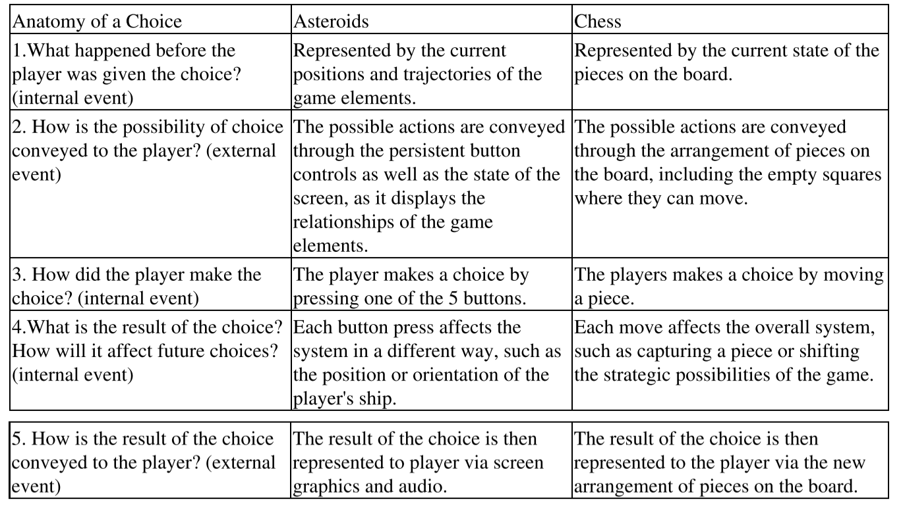



《Rules of Play》 第六章笔记

这一章中主要讨论了游戏的交互。

作者首先罗列了不同人对于交互的定义，然后推导出自己对于交互的多价模型，并强调这一章将重点讨论其中的显式交互。

然后作者区分了设计者所能设计的是让交互变得有意义的环境。

之后作者谈论了交互中的关键部分“选择”，先是给出了交互结构中的最小微粒"行为->结果"单元，再通过五个问题对应的五个步骤剖析了选择的过程，

最后阐述游戏设计者并不能直接的限定所有的交互可能，而是通过设计的规则创建一个“可能性空间”。



<!--more-->

# Chapter 6： Interactivity

## Introducing Interactivity

玩的过程就暗示了存在交互性：玩游戏，玩玩具，与人玩，都是与被玩的对象进行交互。

这种交互也发生在玩的各种层面上，从游戏本身的交互，到社会中与玩家的交互，还有游戏所诞生的文化的交互。

## Defining Interactivity

首先需要定义交互是什么，如果任何事物都可以是交互的对象，那么这个概念也就不再能帮助解决设计问题，因为它实在是太过于宽泛。

传播理论学家Stephen W.Littlejohn把“系统中存在有相互关系的元素称为是可交互的”。

数字媒体理论家Brenda Laurel强调了交互体验的可描述性，将交互系统定义为是个表征空间。这个空间描述了一些事物，人们可以参与在这个空间中去理解事物，这个行为就是交互。

理论学家Andy Cameron在表征空间的基础上强调了直接干预（Direct intervention）的概念，即“交互是需要有能力以有意义的方式干预表征本身，而不是简单的从不同角度去理解。”

游戏设计师Chris Crawdord认为交互是一个周期性的活动，两个参与者需要轮流的进行倾听，思考和反馈。交互的质量取决于每个子活动（倾听，思考和反馈）的质量。

但所有的这些解释都没有解释交互应该如何发生以及在何处发生。而这俩问题才是设计游戏交互的关键点。

## A Multivalent Model of Interaction

作者设计了一个多价模型来描述交互，该模型将上述的所有对交互的定义蕴含在其中，且定义了四种交互的类型或者说是四种交互的参与程度，其中每个类型都有可能与其他类型同时发生。

1. Mode 1：认知交互（Cognitive interactivity; or interpretive participation）

   认知交互是一种心理学，情绪上和智能上的人与系统的交互。如当一个玩家玩一款冒险游戏时，他对于游戏世界的复杂想象就是一种认知交互。

2. Mode 2：功能性交互（Functional interactivity；or utilitarian participation ）

   功能性交互是与系统组件（无论是真实的还是虚拟的）的交互。如游戏的交互界面是怎么样的？按钮多硬？系统的反应延迟是怎么样的？在高分辨率的显示器上字体显示效果如何等

3. Mode 3：显式互动（Explicit interactivity;or participation with designed choices and procedures）

   显式互动是关于玩家在游戏规则限定下做出的选择，遇到的随机事件，游戏的动态模拟等等构成的玩家交互体验。

4. Mode 4：超越对象互动（Beyond-the-object-interactivity；or participation within the culture of the object）

   超越对象交互，是超过了设计系统本身体验的交互。如粉丝文化。

这章之后的章节将主要关注显式互动。但需要注意的是四种互动是相互联系的，如玩扑克牌，选择是否切牌是显式互动，牌的质量和大小影响了功能性互动，牌上印的花纹则又是超越对象互动（不同国家扑克牌的花纹通常是与其文化相关的）。

## But Is it "Designed Interaction"

为了设计交互性，首先需要了解设计师需要设计哪种交互。

需要记住的是在第三章所述的，meaningful play不仅仅与玩家行为以及系统反馈有关（Descriptive），还与行为执行时的情景有关（Evaluative）。

“某人丢出了一个苹果”是一个交互，但不是一个设计的交互。“丢出苹果”在系统中包含了多个元素的交互，如手，苹果，地面。但是它并不存在于一个上下文中，即这个交互行为是没有意义的。

但如果为这交互设计一个上下文，如两个人在互相丢苹果，并且记录丢出的数量。这样通过一个简单的设计，交互就有了意义。

## Interaction and Choice

在游戏中，玩家需要做出选择，系统会根据选择的行为做出相应的回应。选择和回应中的关系一定程度上决定了游戏交互的深度和质量。

考虑游戏中的选择时，可以从两个层次考虑游戏的选择设计：微观（Micro）和宏观（Macro）。微观角度代表了小，实时反馈的选择；宏观角度是这些微观的选择如何结合在一起构成一个更大的游戏体验变换的轨迹。

微观和宏观的选择设计是交织在一起的，无疑有些设计很难判断它到底是微观的还是宏观的。

例如在文字冒险游戏中（输入文字指令，系统同样会以文字告知结果）。在命令行中输入指令就是微观选择，而这些选择在宏观层面上最终或许会构成多种不同的结局。即使在输入行中输入错误的指令（如指令是`get rock`，而输入是`grab rock`），也是有意义的，因为系统对于错误输入的提示，也帮助了玩家进一步了解系统规则的边界。

又例如在Black jack（21点）游戏中，每一次选择是否加牌都是微观选择，但这些选择的结果构成了宏观选择（每一次微观的选择都增加了牌一共的点数）。

上面两个例子都说明了微观和宏观上选择是可以很自然的切换，它们将作为一个协调的整体展现给玩家。如果每个行为的结果都是可感知的且整体性的，那么选择就会构成meaningful play。

游戏设计师Doug Church在文章*Formal Abstract Design Tools*中描述了，在格斗游戏中，玩家的每个控制指令都是统一的，且可以通过屏幕上的角色体现出来（可感知性，同时也是微观的选择）。而且看别人玩游戏，可以看出为什么别人打的比自己更好（整体协调性，同时也是宏观选择的体现）。

可以看出，宏观选择不仅包括在整个游戏过程中该做什么，它还包括是否要继续玩游戏这款游戏和与谁竞争。如果在格斗游戏中，并没有足够的meaningful play，玩家将不知道为什么输，也就会失去对游戏的兴趣。相反，如果每次都能知道为什么对手比自己做的更好，那么输这个行为就是有意义的。

## Choice Molecules

构建一个大的有意义的交互结构，其中最小的微粒就是`行为->结果`单元。

如在游戏Asteroids中一共有五个按键：左转，右转，前进，开火，跳跃。每个行为->结果单元就是由这五个按键和他们对于的结果构成的。在游戏进行过程中，每个行为->结果单元都会形成后一个单元的选择时的情景，单元直接的连接是非常顺畅的，所以玩家根本意识不到自己在一分钟内会做出几百次选择。

## Anatomy of a Choice

`选择`这个概念乍看起来十分的简单，但实际上是一个复杂的结构。在阐述行为->结果单元时，需要问如下五个问题，这五个问题构成了对选择的剖析（Anatomy of a Choice）。这五个问题同样也是选择时的五个步骤，这五个步骤如果可以顺畅的连接在一起，也就能产生顺畅的行为->结果单元的连接，最后meaningful play。

1. 在玩家做出选择前发生了什么？

   这个问题是描述玩家做出选择时的状态。无论是微观还是宏观的选择都与这个问题相关。

2. 可能的选项是如何传递给玩家的？

   玩家做出选择时，需要知道可能的选项有哪些。如上述Asteroids的例子中，玩家可能的选项就是五个按键，它通过游戏面板告知了玩家

3. 玩家如何做出选择？

   这个问题与上个问题相关。选项告知玩家后玩家该如何做出选择，通过按按钮，还是语音，或是其他？

4. 选择的结果是什么，会对未来造成什么影响？

   这个问题是关于玩家行为的结果，而且这个结果是特指内在的结果。玩家的行为在游戏系统中将会怎样产生更深远的影响的，这个影响暂时不会展示给玩家。

5. 游戏的结果是如何传递给玩家的？

   这个问题同样是关于玩家行为的结果，这里的结果是外在的表现。如游戏画面中的角色做出了位移等。

   第五个问题解答后将自然的回到第一个问题。因为第五个问题的答案，即产生的结果又构成了下一个选择时的状态。

上述的五个问题，有些是内在的事件（Internal events），有些是外在的事件（external events）。其中问题1,3,4是内在事件，问题2,5是外在事件。

游戏包含内在事件的特征暗示了游戏系统实际上是会记录一部分玩家的行为的，为了在之后产生深远影响。Jesper Juul在文章*Play Time, Event Time, Themability*中将游戏描述为一台状态机。

下标为Asteroids和下棋两个游戏针对五个选择问题的回答：

针对选择的剖析可以帮助解决游戏设计时的问题。如觉得一款游戏没有足够的meaningful play，可能就是因为在一系列行为->结果单元的连接中出现了断档，如

1. 如果觉得游戏中的决定并没有什么大影响。问题可能出现在步骤四中，玩家的行为并没有在游戏系统内部构成一个有意义的结果。
2. 如果玩家不知道下一步要做什么。这个现象在大型的冒险游戏中很普遍，问题可能处在步骤二中，问题的选项并没有很清晰的告知玩家。
3. 如果玩家并不知道为什么会输。问题很可能出现在步骤五中，即游戏当前的状态并没有很好的告知玩家。玩家并不知道当前的游戏状态因此无法把握游戏的走向，也就对最终的结果感到困惑。
4. 如果玩家不知道一个操作是否产生了结果。问题可能出在步骤三和四中，即玩家做出了操作，而系统并没有对操作做出相应的反应。这种情况看似很少见，但在一些新鲜的交互方式中很有可能出现，如重力感应，运动传感器等。

## Space of  Possibility

现在许多关于游戏和交互的作品并不是从一个玩家的视角出发，而是作为一个外在的观察者。但是游戏交互需要的是体验，而不是观察。

创造一个游戏意味着创造一个复杂的系统，这个系统可能会以意想不到的方式被玩家所使用。作为一个游戏设计者，应该让游戏中的各种行为都变得有意义，而不是去打断或者限制玩家的行为。

游戏设计者的工作并不是设计玩家该如何玩，他们的设计工作是去创建一个玩耍可以发生的环境，间接的引导玩家的行为。将玩家未来的所有行动所构成的空间，称为可能性空间（Space of Possibility）。这个概念将游戏设计（design），含义（meaning），系统（system），可交互性（interactive）连接在了一起。

这空间中的所有可能性的意义都来自于游戏设计。游戏设计者也不是直接的去构建这个空间，而是通过设计的游戏规则间接的产生这个空间。

游戏设计是对自己设计的规则，对玩家，对游戏本身产生信心，期望他们能共同创造meaningful play。但最终是否成功，永远无法预先得知，了解游戏设计的关键只是帮助你去接近这个期待。

>  Game design is an act of faith-in your rules, in your players, in your game itself. Will your game create meaningful play? You can never know for sure.

## Further Reading

1. *The Design of Everyday Things* by Donald Norman
2. *Formal Abstract Design Tools* by Doug Church
3. *The Art of Interactive Design: A Euphorious and Illuminating Guide to Building Successful Software*  by Chris Crawford



引用：

1.*Rules of Play* 2003



***