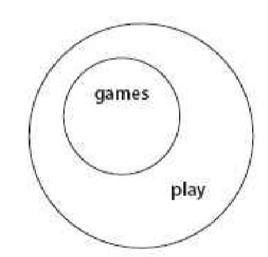
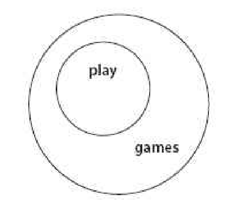
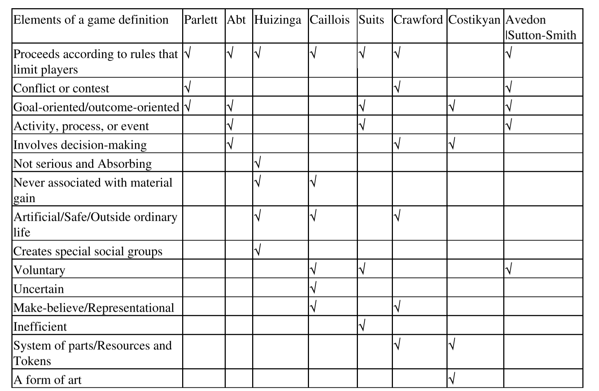



《Rules of Play》 第七章笔记

本章首先区分了游戏和玩的概念

然后从八种不同的游戏定义角度出发推导出作者对于游戏的定义。

最后介绍了两种看似与游戏定义不符的特例，智力游戏与角色扮演类游戏。



<!--more-->

# Chapter 7：Defining Games

对于游戏的定义不仅仅是帮助将游戏设计与其他的设计区分开来，更可以帮助人们对于什么是有意义的玩有更深的理解

## Play and Game

第一步要区分玩和游戏这两个概念。根据定义方式的不同，玩可以是比游戏更大的概念，也可以是更小的概念

### Relationship one： Games are a subset of play

一些玩可以称作为游戏，如躲避球，在这种玩耍下，玩家要遵循一个规则，并且尽量获得胜利。

而另一些玩耍则很难称之为游戏，如在海滩上追逐嬉闹。

实际上大部分的玩都不够有组织化，所以无法称之为游戏。

从类型学方法上来说，游戏是玩的子集，如图：

### Relationship two：Play is a component of games

在另一些思考角度下，游戏可以视作包含了玩这个概念，玩只是游戏中众多观察和理解角度之一。

从概念方法上来说，玩时游戏的子集，如图：

## Comparing Definitions

可以看出定义玩和定义游戏是不同的。

作者尝试通过比较前人对游戏的定义来归纳出游戏的定义。但需要提及的一点是在许多的语言中，玩和游戏是使用同一个词汇的，因此在定义过程中，玩和游戏便混合在了一起。作者在这一章对于这种混合的定义仍然会采纳，只不过侧重点在于游戏。

### Definition 1：David Parlett

Pelett首先区分了正式游戏和非正式游戏的区别。非正式游戏是那些没有明确目标的游戏，如孩子与玩偶的玩耍。

对于正式游戏Pelett给出了二元结构：

1. 终结性：正式游戏从定义上来说有一个获胜者，获胜即是游戏的结束，也是游戏的目标。
2. 意义：正式有游戏有一系列各方都同意的规则和可以使用的设备，可以使用这些设备去获胜。

在Pelett的定义下，非正式游戏其实就是普通的玩，而正式游戏中的`获胜目标`和`规则`是关键部分。

### Definition 2：Clark C.Abt

Abt定义游戏为：游戏是两个或多个独立的决策者参与的活动，在活动中它们在限定条件下去寻找达到目标的方法。或者说是在一系列竞争者和规则的限定下，去赢得目标。

Abt的定义在一定程度上太狭隘：游戏并不一定是竞争环境，也可能是合作的。

同时Abt的定义又在一定程度上太宽泛：按照定义，政治活动等也能算是游戏。

### Definition 3：Johann Huizinga

Huizinga定义的是玩，他的定义是：玩是一种脱离原本的生活的免费且不严肃的活动，但同时又能完全的吸引玩家。它同时也是个和物质利益无关的的活动，它限定在自己根据一系列规则设定的空间时间框架内。玩也可以促进社会团体的形成，将团队与外界世界区分开来。

Huizinga的定义更加的抽象，他来描述了游玩时的感受，比如吸引但不严肃。但是这些特征并不能很好的定义游戏，一个设计差到无法吸引人的游戏难道就不是游戏了吗？

但这个定义最大的问题还是在于没有明显区分玩和游戏的概念。

### Definition 4：Roger Caillois

Caillois同样给出了玩的定义:

1. 自由：玩并不是强制性的
2. 独立性：游戏的环境是一个预先定义和设定好的优先空间和时间
3. 不确定性：过程和结果都无法确定
4. 无产出：游戏不会产生货物或者财富。对于玩家而言，游戏开始时和结束时的情况是一样的。
5. 被规则管理：有自己的独立规则
6. 虚构的：构造一个与现实不同的世界，或者一个与现实完全相反的世界

但Caillois的一些定义与游戏似乎是不相关的。如他提到了自由性，但如果一个游戏是被朋友逼着玩的，它就不是游戏了吗？还有不确定性，一个游戏的老手和游戏的新手一起竞赛，其结果几乎是必然的，难道这就不是游戏了吗？

### Definition 5：Benard Suits

Suits的对于游戏的定义主要是以下几点：

1. 活动：游戏是个活动
2. 自愿性：游戏可以自由加入
3. 游戏有明确的目标：
4. 规则：规则是游戏的一部分
5. 低效性：游戏的规则限制了行为，让它不再搞笑
6. 共识：规则是被所有玩家接受的

Suits在定义中第一次涉及了低效性，为此他提出了游戏态度（lusory attitude）这个概念，这是对于玩家的一种状态描述。游戏态度理论的一部分是说，游戏中的规则是让游戏变得不高效，如人需要过马路，最高效的方法就是直接穿过去，但是规则限定了人必须走斑马线。游戏态度理论的另一部分就是描述，玩家必须接纳这些规则，正是对这些没必要的障碍的接纳，才让玩游戏变成了可能。

### Definition 6：Chris Crawford

Crawford提出了四个分类游戏的重要特征：

1. 体现性（Representation）：游戏是一个封闭的正式系统，它体现了正式世界的一个子集。封闭是指游戏是一个完全的自给自足的结构。正式是指游戏有自己的一套规则。游戏创造了一个主观的对现实情感世界的简单体现。
2. 相互影响(Interaction):游戏提供了相互影响元素，这是它们有吸引性的一个重要理由。它体现了游戏世界是如何结合在一起的，改变是如何发生的。
3. 冲突（Conflict）：有相互影响就自然而然就会有冲突。同时游戏还存在障碍，让玩家不会轻易的完成目标。
4. 安全性（Safety）：游戏让人体验心理上的冲突和危险，但保证了物理上的安全。游戏是一个安全的体验现实的方法。

Crawford是第一个将游戏称为系统的人，他也是第一个从电子游戏角度来定义游戏的人。

### Definition 7：Greg Gostikyan

Gostikyan定义游戏为：游戏一种艺术形式，在其中玩家为管理资源做出一系列决策，并通过游戏代币（Game token，这里的含义不仅仅是钱）来达成目标。

Gostikyan是唯一一个没有将规则纳入游戏定义的人，他也是唯一一个将游戏视作为艺术文化的人。

### Definition 8：Elliot Avedon and Brian Sutton-Smith

在Sutton-Smith和Avedon对于游戏的定义为：游戏是一个自愿参加的练习控制的系统，其中会有竞争，同时还有一系列为了获得不同结果而定义的规则。

## A Comparsion

下图是上述所有定义提到的点：

只有规则和目标这两项是大部分人都同意的。

## Our Definition

作者在对游戏的定义是：`游戏是一个玩家参与的，有人造冲突，被规则所限定，有可量化结果的系统。`

其中可量化的结果就是区分普通非正式的玩耍和游戏的体现。

作者同时也给出了游戏设计的定义：`游戏设计是游戏设计师创造游戏的过程，玩家可以通过游戏进行有意义的玩`。

## The puzzle of Puzzles

后面会描述两种游戏类型，这两个游戏类型看起来似乎适合游戏的定义又似乎不合适。

首先是各种智力游戏（Puzzles）。智力游戏是一种特殊的游戏形式，是因为它们有固定的答案。智力游戏完全符合作者对游戏的定义，其中的冲突存在于玩家和系统之间。

从智力游戏的角度来思考游戏，可以帮助构筑游戏。比如，当感觉一个冒险游戏太过于开放的时候，或许这个游戏应该有更多的puzzle-like的游戏因素来塑造玩家的成就感（Puzzle-like的元素是可控的）。而当感觉冒险游戏缺乏游玩的感觉时，可能就是因为有太多的Pizzle-Like的因素，让人觉得所有的可能就是限定了的。

## Role-Playing Games

角色扮演类游戏（Role-Playing Games）从定义上来看缺乏可量化的结果，但其实这是一个观察角度的问题。

如果从整个游戏的角度来看，角色扮演类游戏确实没有一个可量化的分数之类的结果。但是从游戏中的每一部分去看，在游戏过程中有任务的完成，或角色的升级等，这些都是一个量化结果。

举这两个例子是想说明当遇到一个游戏似乎不满足游戏的定义，应该更多的是从扩大游戏定义的角度去思考，这才会推动游戏的发展。

## Further Reading

1. *Homo Ludens*,Johann Huizinga
2. *Man,Play,Games*,Roger Caillois



引用：

1.*Rules of Play* 2003



***